# Augmented Large Language Models: A Comprehensive SOTA Treatment

---

## Table of Contents
1. [Augmented Large Language Models — Formal Framework](#1)
2. [Retrieval-Augmented Generation (RAG)](#2)
3. [RAG Evaluation](#3)
4. [Tool Calling with LLMs](#4)
5. [LLM Augmentation with Agents](#5)

---

# 1. Augmented Large Language Models (ALMs)

## 1.1 Definition

An **Augmented Large Language Model** is a system $\mathcal{S}$ that extends a frozen or fine-tuned parametric language model $\mathcal{M}_\theta$ by coupling it with one or more **non-parametric** or **external functional modules** $\{E_1, E_2, \dots, E_k\}$, such that the composite system's generative distribution surpasses what $\mathcal{M}_\theta$ can express alone.

Formally, whereas a vanilla LLM models:

$$P_\theta(y \mid x) = \prod_{t=1}^{T} P_\theta(y_t \mid y_{<t}, x)$$

an Augmented LLM models:

$$P_{\mathcal{S}}(y \mid x) = \prod_{t=1}^{T} P_\theta\!\Big(y_t \;\Big|\; y_{<t},\; x,\; \bigoplus_{i=1}^{k} E_i\big(\phi_i(x, y_{<t})\big)\Big)$$

where:
- $\phi_i(\cdot)$ is a **query formulation function** that constructs a request to external module $E_i$
- $\bigoplus$ denotes an **aggregation operator** (concatenation, cross-attention fusion, interleaving, or gated mixture)
- $E_i$ can be a retriever, tool API, code interpreter, memory buffer, or another model

## 1.2 Motivation — Why Augmentation is Necessary

Standard LLMs suffer from well-characterized failure modes that are **inherent to purely parametric architectures**:

| Failure Mode | Formal Characterization |
|---|---|
| **Knowledge Cutoff** | $P_\theta(y \mid x)$ is conditioned only on training corpus $\mathcal{D}_{\text{train}}$ with temporal bound $t_{\text{max}}$ |
| **Hallucination** | Model assigns $P_\theta(y \mid x) > \epsilon$ to factually incorrect $y$ due to distributional memorization artifacts |
| **Computation Bottleneck** | All reasoning must occur within fixed forward-pass depth $L$ and hidden dimension $d$; no external symbolic computation |
| **Static Knowledge** | Parameters $\theta$ encode a snapshot; updating requires retraining with cost $\mathcal{O}(|\theta| \cdot |\mathcal{D}|)$ |
| **Groundedness Gap** | No mechanism to verify generated claims against authoritative sources at inference time |

## 1.3 Taxonomy of Augmentation Modalities

```
                    Augmented LLM
                         │
          ┌──────────────┼──────────────────┐
          │              │                  │
    Retrieval        Tool Use           Agentic
   Augmentation     Augmentation      Augmentation
          │              │                  │
   ┌──────┴──────┐  ┌───┴────┐     ┌───────┴──────┐
   │             │  │        │     │              │
 Sparse       Dense  API   Code   Single-Agent  Multi-Agent
 (BM25)     (DPR)  Calls  Exec   (ReAct)       (Debate)
```

## 1.4 Formal Augmentation Categories

**Category 1 — Retrieval Augmentation ($E_{\text{ret}}$):**

$$E_{\text{ret}}(q) = \text{Top-}k\Big(\{d_j\}_{j=1}^{N},\; \text{sim}(f_q(q),\; f_d(d_j))\Big)$$

**Category 2 — Tool Augmentation ($E_{\text{tool}}$):**

$$E_{\text{tool}}(a) = \texttt{Execute}\big(\text{API}_a,\; \text{args}(a)\big) \rightarrow r_a$$

**Category 3 — Agentic Augmentation ($E_{\text{agent}}$):**

$$E_{\text{agent}}(x) = \text{ControlLoop}\big(\mathcal{M}_\theta,\; \{E_1, \dots, E_k\},\; \text{objective}(x)\big)$$

## 1.5 The Augmentation Integration Equation

The key architectural decision is **where** and **how** external information integrates into the generation process. We define the **Augmented Context Window**:

$$C_{\text{aug}}(x, t) = \Big[x \;\|\; \underbrace{E_{\text{ret}}(\phi_{\text{ret}}(x, y_{<t}))}_{\text{retrieved documents}} \;\|\; \underbrace{E_{\text{tool}}(\phi_{\text{tool}}(x, y_{<t}))}_{\text{tool outputs}} \;\|\; \underbrace{M_{<t}}_{\text{memory trace}}\Big]$$

where $\|$ denotes sequence concatenation and $M_{<t}$ represents accumulated agent memory.

The generation at each step then becomes:

$$y_t \sim P_\theta\big(y_t \mid C_{\text{aug}}(x, t)\big)$$

---

# 2. Retrieval-Augmented Generation (RAG)

## 2.1 Definition

**Retrieval-Augmented Generation (RAG)** is a framework where a language model's generation is conditioned not only on the input query $q$ but also on a set of documents $\mathcal{D}_q$ dynamically retrieved from an external knowledge corpus $\mathcal{K} = \{d_1, d_2, \dots, d_N\}$ at inference time.

$$P_{\text{RAG}}(y \mid q) = \sum_{d \in \mathcal{K}} P_{\text{ret}}(d \mid q) \cdot P_\theta(y \mid q, d)$$

In the practical **top-$k$ marginalization** variant:

$$P_{\text{RAG}}(y \mid q) \approx \sum_{d \in \text{Top-}k(\mathcal{K}, q)} \frac{\exp\big(\text{sim}(q, d)/\tau\big)}{\sum_{d' \in \text{Top-}k} \exp\big(\text{sim}(q, d')/\tau\big)} \cdot P_\theta(y \mid q, d)$$

where $\tau$ is a temperature parameter controlling retrieval distribution sharpness.

## 2.2 RAG Architecture — End-to-End Pipeline


```
┌─────────────────────────────────────────────────────────────────────┐
│                     RAG SYSTEM ARCHITECTURE                         │
│                                                                     │
│  ┌──────────┐    ┌────────────┐    ┌───────────┐    ┌───────────┐  │
│  │  Query q  │───▶│  Query     │───▶│ Retriever │───▶│ Re-Ranker │  │
│  │          │    │  Encoder   │    │  (ANN)    │    │ (Cross-   │  │
│  └──────────┘    │  f_q(·)   │    │           │    │  Encoder) │  │
│                  └────────────┘    └───────────┘    └─────┬─────┘  │
│                                                           │        │
│  ┌──────────────────────────────────────────────────────┐ │        │
│  │              Knowledge Corpus  K                      │ │        │
│  │  ┌────┐ ┌────┐ ┌────┐        ┌────┐                 │ │        │
│  │  │ d₁ │ │ d₂ │ │ d₃ │  ...   │ dₙ │                 │ │        │
│  │  └────┘ └────┘ └────┘        └────┘                 │ │        │
│  │         │                                            │ │        │
│  │    ┌────▼──────────────────┐                         │ │        │
│  │    │ Document Encoder f_d  │                         │ │        │
│  │    └────┬──────────────────┘                         │ │        │
│  │         │                                            │ │        │
│  │    ┌────▼──────────────────┐                         │ │        │
│  │    │ Vector Index (FAISS/  │                         │ │        │
│  │    │ HNSW / ScaNN)        │◀────────────────────────┘ │        │
│  │    └───────────────────────┘                           │        │
│  └────────────────────────────────────────────────────────┘        │
│                                                           │        │
│                           ┌───────────────────────────────▼──────┐ │
│                           │      Context Assembly                │ │
│                           │  C = [Instruction ∥ d₁ ∥...∥ dₖ ∥ q]│ │
│                           └──────────────┬───────────────────────┘ │
│                                          │                         │
│                           ┌──────────────▼───────────────────────┐ │
│                           │      Generator  M_θ                  │ │
│                           │      P_θ(y | C)                      │ │
│                           └──────────────┬───────────────────────┘ │
│                                          │                         │
│                           ┌──────────────▼───────┐                 │
│                           │    Response  y        │                 │
│                           └──────────────────────┘                 │
└─────────────────────────────────────────────────────────────────────┘
```

## 2.3 Component-Level Deep Dive

### 2.3.1 Indexing Phase

**Definition:** The offline process of converting raw documents into searchable vector representations stored in an approximate nearest neighbor (ANN) index.

**Chunking Strategy:** Given a document $D$ of length $|D|$ tokens, we partition it into chunks:

$$D \rightarrow \{c_1, c_2, \dots, c_m\} \quad \text{where} \quad c_i = D[s_i : s_i + w], \quad s_{i+1} = s_i + w - o$$

- $w$ = chunk window size (tokens)
- $o$ = overlap size (tokens)
- $m = \lceil (|D| - o) / (w - o) \rceil$

**Embedding:** Each chunk is encoded via a bi-encoder:

$$\mathbf{v}_i = f_d(c_i) \in \mathbb{R}^{d_{\text{emb}}}$$

typically normalized: $\hat{\mathbf{v}}_i = \mathbf{v}_i / \|\mathbf{v}_i\|_2$

**Index Construction:** Vectors are inserted into an ANN structure (HNSW, IVF-PQ, etc.) that supports sublinear search:

$$\text{Index}: \{\hat{\mathbf{v}}_1, \dots, \hat{\mathbf{v}}_N\} \rightarrow \mathcal{I} \quad \text{s.t.} \quad \text{Search}(\mathcal{I}, \mathbf{q}, k) \in \mathcal{O}(\log N)$$

---

### 2.3.2 Retrieval Phase

**Bi-Encoder Retrieval (Dense):**

$$\text{sim}(q, d_i) = \langle f_q(q),\; f_d(d_i) \rangle = \mathbf{q}^\top \mathbf{d}_i$$

where $f_q$ and $f_d$ may share parameters (single-encoder) or be separate (dual-encoder).

**Sparse Retrieval (BM25):**

$$\text{BM25}(q, d) = \sum_{t \in q} \text{IDF}(t) \cdot \frac{f(t, d) \cdot (k_1 + 1)}{f(t, d) + k_1 \cdot \big(1 - b + b \cdot \frac{|d|}{\text{avgdl}}\big)}$$

where $f(t, d)$ is term frequency, $k_1$ and $b$ are hyperparameters.

**Hybrid Retrieval:** A convex combination:

$$\text{score}_{\text{hybrid}}(q, d) = \alpha \cdot \text{sim}_{\text{dense}}(q, d) + (1 - \alpha) \cdot \text{BM25}_{\text{norm}}(q, d)$$

where $\alpha \in [0, 1]$ controls the interpolation.

---

### 2.3.3 Re-Ranking Phase

A cross-encoder $\text{CE}(q, d)$ jointly attends over query-document pairs:

$$\text{CE}(q, d) = \sigma\big(W_r \cdot \text{CLS}\big(\text{Transformer}([q; \texttt{[SEP]}; d])\big) + b_r\big)$$

This is computationally expensive ($\mathcal{O}(k \cdot (|q| + |d|)^2)$) but provides superior relevance estimation due to full cross-attention.

**Re-rank scoring with Listwise loss (ListMLE):**

$$\mathcal{L}_{\text{ListMLE}} = -\sum_{i=1}^{k} \log \frac{\exp\big(s_{\pi(i)}\big)}{\sum_{j=i}^{k} \exp\big(s_{\pi(j)}\big)}$$

where $\pi$ is the ground-truth permutation and $s_i = \text{CE}(q, d_i)$.

---

### 2.3.4 Generation Phase (Reader)

The generator conditions on the augmented context:

$$P_\theta(y \mid q, \mathcal{D}_q) = \prod_{t=1}^{T} P_\theta\!\big(y_t \mid y_{<t}, [q \;\|\; d_1 \;\|\; \dots \;\|\; d_k]\big)$$

**Fusion-in-Decoder (FiD)** variant encodes each document independently, then cross-attends:

$$\mathbf{H}_i = \text{Encoder}([q \;\|\; d_i]) \quad \forall i \in \{1, \dots, k\}$$

$$\mathbf{H}_{\text{fused}} = [\mathbf{H}_1; \mathbf{H}_2; \dots; \mathbf{H}_k]$$

$$y_t = \text{Decoder}(y_{<t}, \mathbf{H}_{\text{fused}})$$

This scales linearly $\mathcal{O}(k \cdot |d|^2 + T \cdot k \cdot |d|)$ rather than quadratically in total context length.

## 2.4 RAG Variants Taxonomy

| Variant | Retrieval Timing | Key Mechanism |
|---|---|---|
| **Naive RAG** | Once, before generation | Single retrieval → generate |
| **Advanced RAG** | Once, with pre/post-retrieval processing | Query rewriting + re-ranking |
| **Modular RAG** | Multiple times, adaptively | Conditional retrieval triggers |
| **Self-RAG** | Per-segment, with self-reflection | Model decides when to retrieve and critiques retrieved content |
| **CRAG (Corrective RAG)** | With retrieval quality assessment | Evaluates retrieval relevance; falls back to web search |
| **Adaptive RAG** | Query-complexity-dependent | Classifier routes to no-retrieval, single-retrieval, or iterative |

### 2.4.1 Self-RAG — Formal Definition

Self-RAG introduces **reflection tokens** $\{r_{\text{ret}}, r_{\text{rel}}, r_{\text{sup}}, r_{\text{use}}\}$:

$$P_{\text{Self-RAG}}(y, \mathbf{r} \mid q) = \prod_{t} P_\theta(r_{\text{ret}}^{(t)} \mid q, y_{<t}) \cdot \begin{cases} P_\theta(d^{(t)} \mid q) \cdot P_\theta(y_t, r_{\text{rel}}^{(t)}, r_{\text{sup}}^{(t)} \mid q, d^{(t)}, y_{<t}) & \text{if } r_{\text{ret}}^{(t)} = \texttt{yes} \\ P_\theta(y_t \mid q, y_{<t}) & \text{if } r_{\text{ret}}^{(t)} = \texttt{no} \end{cases}$$

where:
- $r_{\text{ret}} \in \{\texttt{yes}, \texttt{no}\}$ — whether to retrieve
- $r_{\text{rel}} \in \{\texttt{relevant}, \texttt{irrelevant}\}$ — document relevance
- $r_{\text{sup}} \in \{\texttt{fully}, \texttt{partially}, \texttt{none}\}$ — response support level
- $r_{\text{use}} \in \{1, 2, 3, 4, 5\}$ — overall utility score

## 2.5 Pseudo-Algorithms

### Algorithm 1: RAG Indexing Pipeline

```
━━━━━━━━━━━━━━━━━━━━━━━━━━━━━━━━━━━━━━━━━━━━━━━━━━━━━━━━━━━━━━━
ALGORITHM: RAG-INDEX
━━━━━━━━━━━━━━━━━━━━━━━━━━━━━━━━━━━━━━━━━━━━━━━━━━━━━━━━━━━━━━━
INPUT:
    K = {D₁, D₂, ..., Dₙ}          ▷ Raw document corpus
    f_d(·)                           ▷ Document encoder model
    w                                ▷ Chunk window size (tokens)
    o                                ▷ Chunk overlap size (tokens)
    ANN_config                       ▷ Index hyperparameters (type, nprobe, efConstruction)

OUTPUT:
    I                                ▷ Searchable vector index
    ChunkStore                       ▷ Mapping: chunk_id → chunk_text + metadata

PROCEDURE:
    1.  ChunkStore ← ∅
    2.  VectorBuffer ← ∅
    3.  global_id ← 0

    4.  FOR each document Dⱼ ∈ K DO:
    5.      chunks ← SEGMENT(Dⱼ, w, o)
                ▷ SEGMENT splits Dⱼ into overlapping windows
                ▷ cᵢ = Dⱼ[sᵢ : sᵢ + w], sᵢ₊₁ = sᵢ + (w − o)

    6.      FOR each chunk cᵢ ∈ chunks DO:
    7.          vᵢ ← f_d(cᵢ)                    ▷ Encode to dense vector ∈ ℝ^d
    8.          v̂ᵢ ← vᵢ / ‖vᵢ‖₂                ▷ L2-normalize
    9.          ChunkStore[global_id] ← (cᵢ, metadata(Dⱼ, i))
   10.          VectorBuffer ← VectorBuffer ∪ {(global_id, v̂ᵢ)}
   11.          global_id ← global_id + 1
   12.      END FOR
   13.  END FOR

   14.  I ← BUILD_ANN_INDEX(VectorBuffer, ANN_config)
            ▷ Constructs HNSW / IVF-PQ / ScaNN index

   15.  RETURN (I, ChunkStore)
━━━━━━━━━━━━━━━━━━━━━━━━━━━━━━━━━━━━━━━━━━━━━━━━━━━━━━━━━━━━━━━
```

### Algorithm 2: RAG Inference Pipeline

```
━━━━━━━━━━━━━━━━━━━━━━━━━━━━━━━━━━━━━━━━━━━━━━━━━━━━━━━━━━━━━━━
ALGORITHM: RAG-INFERENCE
━━━━━━━━━━━━━━━━━━━━━━━━━━━━━━━━━━━━━━━━━━━━━━━━━━━━━━━━━━━━━━━
INPUT:
    q                                ▷ User query (natural language)
    f_q(·)                           ▷ Query encoder
    I                                ▷ Pre-built vector index
    ChunkStore                       ▷ Chunk text mapping
    M_θ                              ▷ Generator LLM
    k                                ▷ Number of documents to retrieve
    CE(·,·)                          ▷ Cross-encoder re-ranker (optional)
    k_rerank                         ▷ Number of documents after re-ranking

OUTPUT:
    y                                ▷ Generated response
    Sources                          ▷ Attribution source list

PROCEDURE:
    ──── STAGE 1: QUERY PROCESSING ────
    1.  q' ← QUERY_REWRITE(M_θ, q)
            ▷ Optional: HyDE, multi-query expansion, step-back prompting
    2.  q_vec ← f_q(q') / ‖f_q(q')‖₂

    ──── STAGE 2: RETRIEVAL ────
    3.  CandidateIDs ← ANN_SEARCH(I, q_vec, k_initial)
            ▷ k_initial ≥ k, retrieve broader candidate set
    4.  Candidates ← {(id, ChunkStore[id].text, sim(q_vec, I[id])) 
                       for id ∈ CandidateIDs}

    ──── STAGE 3: RE-RANKING ────
    5.  IF CE is provided THEN:
    6.      FOR each (id, text, _) ∈ Candidates DO:
    7.          score_id ← CE(q, text)
    8.      END FOR
    9.      RankedDocs ← TOP-k_rerank(Candidates, by score_id)
   10.  ELSE:
   11.      RankedDocs ← TOP-k(Candidates, by similarity)
   12.  END IF

    ──── STAGE 4: CONTEXT ASSEMBLY ────
   13.  Context ← ASSEMBLE([
            SystemPrompt,
            "Retrieved Documents:",
            FORMAT(RankedDocs),      ▷ [1] doc_text_1 \n [2] doc_text_2 ...
            "Query:", q
        ])

    ──── STAGE 5: GENERATION ────
   14.  y ← M_θ.generate(Context, sampling_params)
   15.  Sources ← EXTRACT_ATTRIBUTIONS(y, RankedDocs)

   16.  RETURN (y, Sources)
━━━━━━━━━━━━━━━━━━━━━━━━━━━━━━━━━━━━━━━━━━━━━━━━━━━━━━━━━━━━━━━
```

### Algorithm 3: Self-RAG Inference

```
━━━━━━━━━━━━━━━━━━━━━━━━━━━━━━━━━━━━━━━━━━━━━━━━━━━━━━━━━━━━━━━
ALGORITHM: SELF-RAG-INFERENCE
━━━━━━━━━━━━━━━━━━━━━━━━━━━━━━━━━━━━━━━━━━━━━━━━━━━━━━━━━━━━━━━
INPUT:
    q                                ▷ User query
    M_θ                              ▷ Self-RAG trained model (generates reflection tokens)
    RETRIEVER(·, k)                  ▷ Retrieval function
    T_segments                       ▷ Max number of generation segments

OUTPUT:
    y                                ▷ Final response with self-assessed quality

PROCEDURE:
    1.  y ← ""
    2.  FOR t = 1 TO T_segments DO:

    3.      r_ret ← M_θ.predict_token(
                type=RETRIEVE_DECISION, 
                context=(q, y)
            )       ▷ Output ∈ {yes, no, continue}

    4.      IF r_ret = "yes" THEN:
    5.          D_t ← RETRIEVER(FORMULATE_QUERY(q, y), k)
    6.          CandidateOutputs ← ∅

    7.          FOR each d ∈ D_t DO:
    8.              r_rel ← M_θ.predict_token(
                        type=RELEVANCE, 
                        context=(q, d)
                    )       ▷ ∈ {relevant, irrelevant}
    9.              IF r_rel = "irrelevant" THEN CONTINUE

   10.              y_seg ← M_θ.generate_segment(q, d, y)
   11.              r_sup ← M_θ.predict_token(
                        type=SUPPORT, 
                        context=(q, d, y_seg)
                    )       ▷ ∈ {fully_supported, partially, no_support}
   12.              r_use ← M_θ.predict_token(
                        type=UTILITY, 
                        context=(q, y ∥ y_seg)
                    )       ▷ ∈ {1, 2, 3, 4, 5}

   13.              score ← w_rel·𝟙[r_rel=rel] + w_sup·SCORE(r_sup) + w_use·r_use
   14.              CandidateOutputs ← CandidateOutputs ∪ {(y_seg, d, score)}
   15.          END FOR

   16.          (y_best, d_best, _) ← argmax(CandidateOutputs, by score)
   17.          y ← y ∥ y_best

   18.      ELSE:      ▷ No retrieval needed
   19.          y_seg ← M_θ.generate_segment(q, y)
   20.          y ← y ∥ y_seg
   21.      END IF

   22.      IF M_θ.predicts_EOS(y) THEN BREAK
   23.  END FOR

   24.  RETURN y
━━━━━━━━━━━━━━━━━━━━━━━━━━━━━━━━━━━━━━━━━━━━━━━━━━━━━━━━━━━━━━━
```

---

# 3. RAG Evaluation

## 3.1 Definition

**RAG Evaluation** is the systematic, multi-dimensional assessment of a Retrieval-Augmented Generation system across its decomposed components (retriever, re-ranker, generator) and their emergent interactions, quantified through both **component-level** and **end-to-end** metrics that measure retrieval quality, generation faithfulness, answer correctness, and absence of hallucination.

The evaluation problem can be stated as: given a benchmark $\mathcal{B} = \{(q_i, y_i^*, \mathcal{D}_i^*)\}_{i=1}^{n}$ where $y_i^*$ is the gold answer and $\mathcal{D}_i^*$ is the set of gold-relevant documents, compute a vector of metrics:

$$\mathbf{m}(q_i) = \big[\underbrace{m_{\text{ret}}}_{\text{Retrieval}},\; \underbrace{m_{\text{gen}}}_{\text{Generation}},\; \underbrace{m_{\text{e2e}}}_{\text{End-to-End}}\big]$$

## 3.2 Evaluation Dimensions and Metrics

### 3.2.1 Retrieval Component Metrics

**Context Precision** — Measures the proportion of retrieved documents that are relevant, weighted by rank:

$$\text{ContextPrecision}@k = \frac{1}{\text{|relevant docs in top-}k|} \sum_{i=1}^{k} \Big(\text{Precision}@i \times \mathbb{1}[d_i \in \mathcal{D}^*]\Big)$$

**Context Recall** — Measures coverage of gold-relevant information:

$$\text{ContextRecall} = \frac{|\{s \in y^* : \exists\; d \in \mathcal{D}_{\text{retrieved}},\; s \text{ is attributable to } d\}|}{|\{s \in y^*\}|}$$

where $s$ represents individual claims/sentences in the gold answer.

**Mean Reciprocal Rank (MRR):**

$$\text{MRR} = \frac{1}{|\mathcal{B}|} \sum_{i=1}^{|\mathcal{B}|} \frac{1}{\text{rank}_i}$$

where $\text{rank}_i$ is the position of the first relevant document for query $q_i$.

**Normalized Discounted Cumulative Gain (nDCG@k):**

$$\text{DCG}@k = \sum_{i=1}^{k} \frac{2^{\text{rel}_i} - 1}{\log_2(i + 1)}$$

$$\text{nDCG}@k = \frac{\text{DCG}@k}{\text{IDCG}@k}$$

where $\text{IDCG}@k$ is the ideal DCG with perfect ranking.

### 3.2.2 Generation Component Metrics

**Faithfulness** — Measures whether every claim in the generated answer is supported by retrieved context:

$$\text{Faithfulness}(y, \mathcal{D}_{\text{ret}}) = \frac{|\{c \in \text{CLAIMS}(y) : \text{ENTAILED}(c, \mathcal{D}_{\text{ret}})\}|}{|\text{CLAIMS}(y)|}$$

where $\text{CLAIMS}(y)$ decomposes $y$ into atomic factual claims.

**Answer Relevance** — Measures whether the answer addresses the query (independent of correctness):

$$\text{AnswerRelevance}(q, y) = \frac{1}{n} \sum_{i=1}^{n} \text{sim}\big(q,\; \hat{q}_i\big)$$

where $\hat{q}_i$ are synthetically generated questions from $y$ using a reverse-generation model, and $\text{sim}$ is cosine similarity in embedding space.

**Hallucination Rate:**

$$\text{HallucinationRate}(y, \mathcal{D}_{\text{ret}}) = 1 - \text{Faithfulness}(y, \mathcal{D}_{\text{ret}})$$

### 3.2.3 End-to-End Metrics

**Answer Correctness** — Combines semantic similarity and factual overlap:

$$\text{Correctness}(y, y^*) = \beta \cdot F_1(y, y^*) + (1 - \beta) \cdot \text{SemanticSim}(y, y^*)$$

where $F_1$ operates on extracted claim sets:

$$F_1 = \frac{2 \cdot |\text{TP}|}{2 \cdot |\text{TP}| + |\text{FP}| + |\text{FN}|}$$

- $\text{TP}$: claims in $y$ that are also in $y^*$
- $\text{FP}$: claims in $y$ not in $y^*$ (hallucinations)
- $\text{FN}$: claims in $y^*$ not in $y$ (missing information)

## 3.3 Evaluation Frameworks

### 3.3.1 RAGAS (Retrieval Augmented Generation Assessment)

RAGAS defines four core metrics computed **without gold labels** (reference-free):

| Metric | What It Measures | Computation Method |
|---|---|---|
| **Faithfulness** | Claims grounded in context | LLM-based claim extraction → NLI verification |
| **Answer Relevance** | Response addresses query | Reverse question generation → similarity |
| **Context Precision** | Relevant context ranked higher | LLM judges relevance per retrieved chunk |
| **Context Recall** | Gold answer sentences covered | LLM checks attribution of each gold claim |

**RAGAS Aggregate Score:**

$$\text{RAGAS}_{\text{score}} = \text{HarmonicMean}(\text{Faithfulness}, \text{AnswerRelevance}, \text{ContextPrecision}, \text{ContextRecall})$$

### 3.3.2 LLM-as-Judge Evaluation

An evaluator LLM $\mathcal{M}_{\text{judge}}$ scores along predefined rubrics:

$$s = \mathcal{M}_{\text{judge}}\big(\text{RUBRIC},\; q,\; y,\; \mathcal{D}_{\text{ret}},\; y^*\big) \in [1, 5]$$

**Calibration Check:** To validate judge reliability:

$$\kappa = \frac{P_o - P_e}{1 - P_e}$$

where $\kappa$ is Cohen's kappa between LLM-judge and human annotators, $P_o$ is observed agreement, $P_e$ is chance agreement.

## 3.4 Diagnostic Failure Analysis Matrix

```
┌─────────────────────────────────────────────────────────────────┐
│              RAG FAILURE DIAGNOSIS MATRIX                        │
├──────────────┬──────────────┬───────────────────────────────────┤
│  Retrieval   │  Generation  │  Diagnosis                        │
├──────────────┼──────────────┼───────────────────────────────────┤
│  ✓ Good      │  ✓ Good      │  System working correctly         │
│  ✓ Good      │  ✗ Bad       │  Generator failure: ignoring      │
│              │              │  context, instruction-following    │
│              │              │  deficit, or insufficient capacity │
│  ✗ Bad       │  ✓ Good      │  Lucky generation from parametric │
│              │              │  knowledge (fragile; not reliable) │
│  ✗ Bad       │  ✗ Bad       │  Retrieval failure: fix indexing,  │
│              │              │  chunking, query formulation,      │
│              │              │  or embedding model first          │
└──────────────┴──────────────┴───────────────────────────────────┘
```

## 3.5 Pseudo-Algorithm: Comprehensive RAG Evaluation

```
━━━━━━━━━━━━━━━━━━━━━━━━━━━━━━━━━━━━━━━━━━━━━━━━━━━━━━━━━━━━━━━
ALGORITHM: RAG-EVALUATE
━━━━━━━━━━━━━━━━━━━━━━━━━━━━━━━━━━━━━━━━━━━━━━━━━━━━━━━━━━━━━━━
INPUT:
    B = {(qᵢ, yᵢ*, Dᵢ*)}          ▷ Evaluation benchmark
    RAG_SYSTEM(·)                   ▷ System under test
    M_judge                         ▷ LLM evaluator (for reference-free metrics)
    NLI_MODEL(·)                    ▷ Natural language inference model

OUTPUT:
    MetricReport                    ▷ Per-query and aggregate scores

PROCEDURE:
    1.  Results ← []

    2.  FOR each (q, y*, D*) ∈ B DO:

        ──── Run RAG System ────
    3.      (y, D_ret, metadata) ← RAG_SYSTEM(q)

        ──── Retrieval Metrics ────
    4.      ctx_precision ← CONTEXT_PRECISION(D_ret, D*, ranks)
    5.      ctx_recall ← CONTEXT_RECALL(y*, D_ret, M_judge)
    6.      mrr ← 1 / FIRST_RELEVANT_RANK(D_ret, D*)
    7.      ndcg ← NDCG(D_ret, D*, k)

        ──── Generation Metrics ────
    8.      claims ← EXTRACT_CLAIMS(y, M_judge)
                ▷ Decompose y into atomic factual propositions

    9.      supported_count ← 0
   10.      FOR each claim c ∈ claims DO:
   11.          verdict ← NLI_MODEL(premise=CONCAT(D_ret), hypothesis=c)
   12.          IF verdict = ENTAILMENT THEN:
   13.              supported_count ← supported_count + 1
   14.      END FOR
   15.      faithfulness ← supported_count / |claims|

   16.      reverse_queries ← GENERATE_QUESTIONS(y, M_judge, n=3)
   17.      answer_relevance ← MEAN([sim(q, q̂) for q̂ ∈ reverse_queries])

        ──── End-to-End Metrics ────
   18.      claims_y ← EXTRACT_CLAIMS(y, M_judge)
   19.      claims_y_star ← EXTRACT_CLAIMS(y*, M_judge)
   20.      TP ← |claims_y ∩ claims_y_star|    ▷ via semantic matching
   21.      FP ← |claims_y \ claims_y_star|
   22.      FN ← |claims_y_star \ claims_y|
   23.      f1_correctness ← 2·TP / (2·TP + FP + FN)
   24.      semantic_sim ← COSINE(EMBED(y), EMBED(y*))
   25.      correctness ← β·f1_correctness + (1−β)·semantic_sim

        ──── Aggregate per query ────
   26.      Results.APPEND({
                ctx_precision, ctx_recall, mrr, ndcg,
                faithfulness, answer_relevance,
                correctness, hallucination_rate: 1−faithfulness
            })
   27.  END FOR

    ──── Compute Aggregate ────
   28.  MetricReport ← {
            metric_name: MEAN([r[metric_name] for r ∈ Results])
            for each metric_name
        }
   29.  MetricReport["ragas_score"] ← HARMONIC_MEAN(
            MetricReport["faithfulness"],
            MetricReport["answer_relevance"],
            MetricReport["ctx_precision"],
            MetricReport["ctx_recall"]
        )

   30.  RETURN MetricReport
━━━━━━━━━━━━━━━━━━━━━━━━━━━━━━━━━━━━━━━━━━━━━━━━━━━━━━━━━━━━━━━
```

---

# 4. Tool Calling with LLMs

## 4.1 Definition

**Tool Calling** (also termed **function calling** or **tool use**) is the capability of an LLM $\mathcal{M}_\theta$ to recognize when its parametric knowledge or computational abilities are insufficient for a given query, **emit a structured invocation** of an external function or API, receive the result, and integrate that result into its ongoing generation.

Formally, we augment the token vocabulary $\mathcal{V}$ with a set of **tool-call tokens** and define:

$$\mathcal{V}_{\text{aug}} = \mathcal{V} \cup \mathcal{V}_{\text{tool}}$$

where $\mathcal{V}_{\text{tool}}$ includes structured markers such as $\texttt{<tool\_call>}$, $\texttt{</tool\_call>}$, $\texttt{<tool\_result>}$, etc.

The generation process becomes a **hybrid autoregressive-reactive loop:**

$$y_t \sim \begin{cases} P_\theta(y_t \mid y_{<t}, x, R) & \text{if } y_{t-1} \notin \mathcal{V}_{\text{tool}} \\ \texttt{EXECUTE}(\text{parse\_tool\_call}(y_{<t})) \rightarrow R & \text{if } y_{t-1} = \texttt{</tool\_call>} \end{cases}$$

where $R$ is the tool result injected back into the context.

## 4.2 Tool Specification Schema

A tool is defined as a tuple:

$$\mathcal{T} = (\text{name}, \text{description}, \text{parameters}, \text{returns})$$

where $\text{parameters}$ follows a typed schema:

$$\text{parameters} = \{(p_i, \text{type}_i, \text{description}_i, \text{required}_i)\}_{i=1}^{m}$$

This is typically serialized as a JSON Schema object and provided in the system prompt or a dedicated tool-definition section.

## 4.3 Tool-Call Resolution Process

```
     User Query
         │
         ▼
  ┌──────────────┐
  │   M_θ        │
  │  (Planning)  │──── "Do I need a tool?" ────┐
  └──────┬───────┘                              │
         │ NO                                   │ YES
         ▼                                      ▼
  ┌──────────────┐                    ┌─────────────────────┐
  │  Direct      │                    │  Emit structured    │
  │  Generation  │                    │  tool call:         │
  │  y           │                    │  {name, arguments}  │
  └──────────────┘                    └──────────┬──────────┘
                                                 │
                                      ┌──────────▼──────────┐
                                      │  RUNTIME EXECUTOR    │
                                      │  Parse → Validate → │
                                      │  Execute             │
                                      └──────────┬──────────┘
                                                 │
                                      ┌──────────▼──────────┐
                                      │  Tool Result r      │
                                      └──────────┬──────────┘
                                                 │
                                      ┌──────────▼──────────┐
                                      │  M_θ resumes with   │
                                      │  context ∥ r        │
                                      │  → generates y      │
                                      └─────────────────────┘
```

## 4.4 Parallel vs. Sequential Tool Calling

**Sequential Tool Calling:**

$$y = \mathcal{M}_\theta\Big(x,\; r_1 = \mathcal{T}_1(a_1),\; r_2 = \mathcal{T}_2(a_2; r_1),\; \dots\Big)$$

Each tool call depends on the result of the previous one (data dependency chain).

**Parallel Tool Calling:**

$$\{r_1, r_2, \dots, r_p\} = \texttt{PARALLEL\_EXEC}\Big(\mathcal{T}_1(a_1),\; \mathcal{T}_2(a_2),\; \dots,\; \mathcal{T}_p(a_p)\Big)$$

$$y = \mathcal{M}_\theta(x, r_1, r_2, \dots, r_p)$$

The model emits multiple independent tool calls in a single generation step when no inter-dependencies exist.

## 4.5 Training Paradigms for Tool Use

### 4.5.1 Supervised Fine-Tuning on Tool-Call Traces

Given demonstrations $\mathcal{D}_{\text{tool}} = \{(x_i, \text{trace}_i)\}$ where each trace contains interleaved text, tool calls, and results:

$$\mathcal{L}_{\text{SFT}} = -\sum_{i} \sum_{t} \log P_\theta(w_t^{(i)} \mid w_{<t}^{(i)})$$

where the loss is computed **only on model-generated tokens** (tool calls and final answers), not on tool results (which are treated as given context).

### 4.5.2 Reinforcement Learning from Tool Feedback

Define a reward:

$$r(x, y, \text{tool\_calls}) = \underbrace{r_{\text{correct}}(y, y^*)}_{\text{answer quality}} + \lambda_1 \underbrace{r_{\text{efficiency}}(\text{tool\_calls})}_{\text{minimize redundant calls}} + \lambda_2 \underbrace{r_{\text{format}}(\text{tool\_calls})}_{\text{valid JSON schema}}$$

Optimize via PPO or DPO:

$$\mathcal{L}_{\text{DPO}} = -\mathbb{E}\Big[\log \sigma\Big(\beta \log \frac{\pi_\theta(y_w \mid x)}{\pi_{\text{ref}}(y_w \mid x)} - \beta \log \frac{\pi_\theta(y_l \mid x)}{\pi_{\text{ref}}(y_l \mid x)}\Big)\Big]$$

where $y_w$ is the preferred trajectory (correct tool usage) and $y_l$ is the dispreferred one.

## 4.6 Tool-Call Decision Boundary

The model must learn a decision boundary in the latent space that partitions queries into:

$$\Omega_{\text{direct}} = \{x : \text{Confidence}_\theta(x) \geq \gamma \text{ without tools}\}$$

$$\Omega_{\text{tool}} = \{x : \text{Confidence}_\theta(x) < \gamma \text{ OR } x \in \mathcal{C}_{\text{computation}}\}$$

where $\mathcal{C}_{\text{computation}}$ is the class of queries requiring external computation (math, API lookup, code execution) regardless of model confidence.

## 4.7 Pseudo-Algorithm: Tool-Calling LLM

```
━━━━━━━━━━━━━━━━━━━━━━━━━━━━━━━━━━━━━━━━━━━━━━━━━━━━━━━━━━━━━━━
ALGORITHM: TOOL-CALLING-LLM
━━━━━━━━━━━━━━━━━━━━━━━━━━━━━━━━━━━━━━━━━━━━━━━━━━━━━━━━━━━━━━━
INPUT:
    x                                ▷ User query
    M_θ                              ▷ Tool-calling LLM
    T = {T₁, T₂, ..., Tₙ}           ▷ Available tool specifications
    max_iterations                   ▷ Maximum tool-call rounds
    EXECUTOR(·)                      ▷ Sandboxed tool execution runtime

OUTPUT:
    y                                ▷ Final natural language response

PROCEDURE:
    1.  context ← [
            SYSTEM_PROMPT,
            TOOL_DEFINITIONS(T),      ▷ Serialized JSON schemas
            USER_MESSAGE(x)
        ]
    2.  iteration ← 0

    3.  LOOP:
    4.      iteration ← iteration + 1
    5.      IF iteration > max_iterations THEN:
    6.          RETURN M_θ.generate(context ∥ "Provide best answer with available information.")

    7.      response ← M_θ.generate(context, stop_sequences=[EOS, </tool_call>])

    8.      IF response CONTAINS tool_call(s) THEN:
    9.          tool_calls ← PARSE_TOOL_CALLS(response)
                    ▷ Extract list of {name, arguments} objects

   10.          ──── Validation ────
   11.          FOR each tc ∈ tool_calls DO:
   12.              VALIDATE_SCHEMA(tc.arguments, T[tc.name].parameters)
                        ▷ Type checking, required field verification
   13.              IF validation fails THEN:
   14.                  context ← context ∥ ASSISTANT(response) ∥ 
                                  ERROR_MESSAGE(tc, validation_error)
   15.                  CONTINUE to next LOOP iteration
   16.          END FOR

   17.          ──── Execution ────
   18.          IF all tool_calls are independent THEN:
   19.              results ← PARALLEL_EXECUTE(
                        [(tc.name, tc.arguments) for tc ∈ tool_calls],
                        EXECUTOR
                    )
   20.          ELSE:
   21.              results ← SEQUENTIAL_EXECUTE(tool_calls, EXECUTOR)
   22.          END IF

   23.          ──── Context Update ────
   24.          context ← context ∥ ASSISTANT(response)
   25.          FOR each (tc, result) ∈ ZIP(tool_calls, results) DO:
   26.              context ← context ∥ TOOL_RESULT(tc.id, result)
   27.          END FOR

   28.      ELSE:
                ▷ No tool call detected — this is the final response
   29.          RETURN response.text
   30.      END IF
   31.  END LOOP
━━━━━━━━━━━━━━━━━━━━━━━━━━━━━━━━━━━━━━━━━━━━━━━━━━━━━━━━━━━━━━━
```

### Algorithm: Tool Selection via Semantic Routing

```
━━━━━━━━━━━━━━━━━━━━━━━━━━━━━━━━━━━━━━━━━━━━━━━━━━━━━━━━━━━━━━━
ALGORITHM: TOOL-SEMANTIC-ROUTER
━━━━━━━━━━━━━━━━━━━━━━━━━━━━━━━━━━━━━━━━━━━━━━━━━━━━━━━━━━━━━━━
INPUT:
    x                                ▷ User query
    T = {(Tᵢ, descᵢ, embedᵢ)}       ▷ Tools with pre-computed description embeddings
    f_q(·)                           ▷ Query encoder
    θ_threshold                      ▷ Minimum similarity for tool activation

OUTPUT:
    T_active ⊆ T                     ▷ Subset of tools to present to LLM

PROCEDURE:
    1.  x_emb ← f_q(x) / ‖f_q(x)‖₂
    2.  scores ← {}
    3.  FOR each (Tᵢ, descᵢ, embedᵢ) ∈ T DO:
    4.      scores[Tᵢ] ← COSINE(x_emb, embedᵢ)
    5.  END FOR
    6.  T_active ← {Tᵢ : scores[Tᵢ] ≥ θ_threshold}
    7.  T_active ← TOP-k(T_active, by scores)
            ▷ Limit to manageable set to avoid context window bloat
    8.  RETURN T_active
━━━━━━━━━━━━━━━━━━━━━━━━━━━━━━━━━━━━━━━━━━━━━━━━━━━━━━━━━━━━━━━
```

---

# 5. LLM Augmentation with Agents

## 5.1 Definition

An **LLM Agent** is an autonomous system $\mathcal{A} = (\mathcal{M}_\theta, \mathcal{P}, \mathcal{T}, \mathcal{E}, \mathcal{S})$ where:


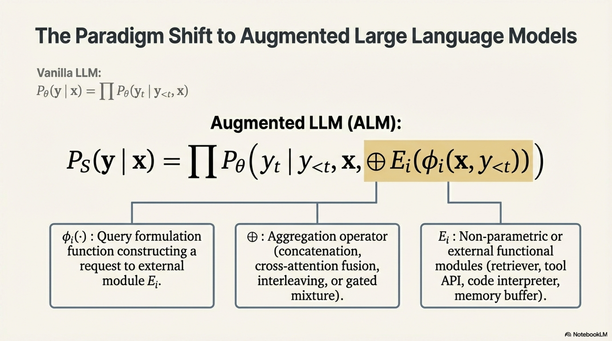

- $\mathcal{M}_\theta$ — the backbone language model serving as the **cognitive core**
- $\mathcal{P}$ — the **planning module** (decomposition, goal-setting, strategy selection)
- $\mathcal{T} = \{T_1, \dots, T_n\}$ — the **tool set** (APIs, retrievers, code executors)
- $\mathcal{E}$ — the **environment** (the external world the agent can observe and act upon)
- $\mathcal{S}$ — the **state/memory module** (working memory, episodic memory, persistent memory)

The agent operates as a **cognitive loop** mapping observations to actions:

$$a_t = \pi_\theta(o_{\leq t}, m_t, g) = \mathcal{M}_\theta\Big(\text{PROMPT}\big(o_{\leq t}, m_t, g, \mathcal{T}\big)\Big)$$

where:
- $o_{\leq t}$ = observation history up to step $t$
- $m_t$ = current memory state
- $g$ = goal derived from the original user query
- $a_t \in \mathcal{A}_{\text{space}} = \{\text{tool\_call}, \text{think}, \text{respond}, \text{delegate}\}$

## 5.2 Agent Architecture — The Cognitive Architecture


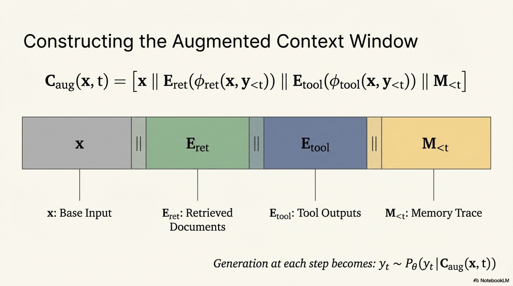


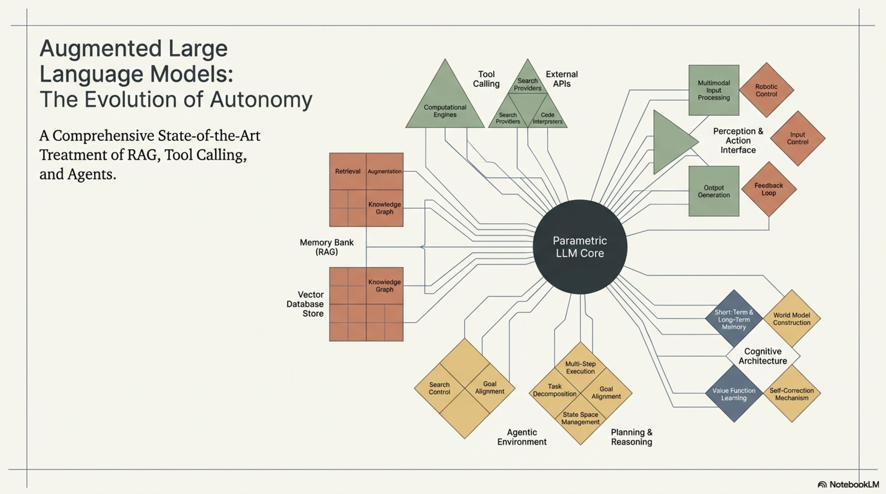

```
┌──────────────────────────────────────────────────────────────────────┐
│                        LLM AGENT ARCHITECTURE                        │
│                                                                      │
│   ┌──────────────────────────────────────────────────────────────┐   │
│   │                    PERCEPTION MODULE                          │   │
│   │   Observation oₜ ← PARSE(Environment feedback, Tool results) │   │
│   └────────────────────────────┬─────────────────────────────────┘   │
│                                │                                     │
│   ┌────────────────────────────▼─────────────────────────────────┐   │

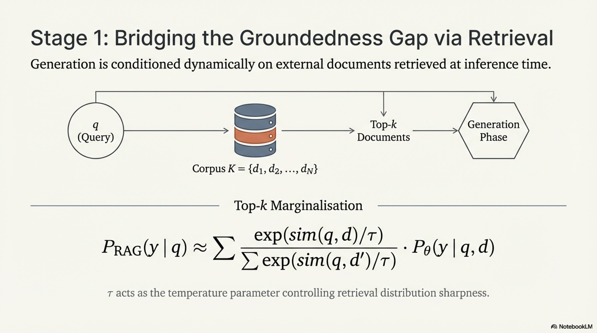


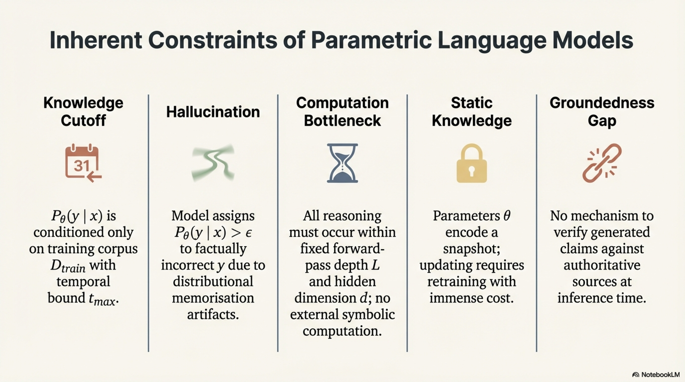

│   │                    MEMORY MODULE  S                           │   │
│   │  ┌──────────┐  ┌──────────────┐  ┌────────────────────────┐ │   │
│   │  │ Working  │  │  Episodic    │  │  Semantic / Long-term  │ │   │
│   │  │ Memory   │  │  Memory      │  │  Memory (Vector DB)    │ │   │
│   │  │ (context │  │  (past       │  │  (persistent facts,    │ │   │
│   │  │  window) │  │   traces)    │  │   learned patterns)    │ │   │
│   │  └──────────┘  └──────────────┘  └────────────────────────┘ │   │
│   └────────────────────────────┬─────────────────────────────────┘   │
│                                │                                     │
│   ┌────────────────────────────▼─────────────────────────────────┐   │

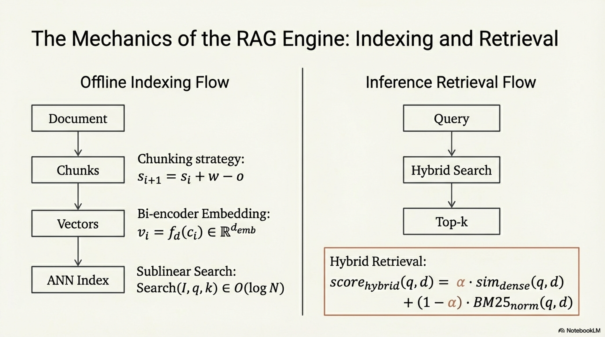

│   │                 REASONING / PLANNING MODULE  P                │   │
│   │                                                               │   │
│   │   ┌──────────────┐  ┌──────────────┐  ┌──────────────────┐  │   │
│   │   │  Task        │  │  Strategy    │  │  Self-Reflection │  │   │
│   │   │  Decompose   │  │  Selection   │  │  & Critique      │  │   │
│   │   │  (subgoals)  │  │  (which tool │  │  (verify, retry) │  │   │
│   │   │              │  │   / method)  │  │                  │  │   │
│   │   └──────────────┘  └──────────────┘  └──────────────────┘  │   │
│   └────────────────────────────┬─────────────────────────────────┘   │
│                                │                                     │
│   ┌────────────────────────────▼─────────────────────────────────┐   │
│   │                    ACTION MODULE                              │   │
│   │   aₜ ∈ {tool_call, think, respond, delegate, wait}          │   │
│   └────────────────────────────┬─────────────────────────────────┘   │
│                                │                                     │
│          ┌─────────────────────┼──────────────────────┐              │
│          ▼                     ▼                      ▼              │
│   ┌────────────┐     ┌──────────────┐      ┌──────────────────┐     │
│   │   Tool     │     │  Internal    │      │  Final Response  │     │
│   │  Execution │     │  Reasoning   │      │  to User         │     │
│   │  T₁...Tₙ  │     │  (CoT step)  │      │                  │     │
│   └─────┬──────┘     └──────────────┘      └──────────────────┘     │
│         │                                                            │
│         └──────── result rₜ ───── fed back to Perception ───────────│
│                                                                      │
└──────────────────────────────────────────────────────────────────────┘
```

## 5.3 Agent Reasoning Frameworks

### 5.3.1 ReAct (Reason + Act)

ReAct interleaves **reasoning traces** (chain-of-thought) with **actions** (tool calls):

$$\text{Trajectory}_{\text{ReAct}} = (t_1, a_1, o_1, t_2, a_2, o_2, \dots, t_n, a_{\text{finish}})$$

where:
- $t_i$ = **Thought**: natural language reasoning about what to do next
- $a_i$ = **Action**: structured tool invocation or final answer
- $o_i$ = **Observation**: result returned from the environment/tool

The key advantage is **interpretability** — the thought traces provide an auditable reasoning chain.

**Formal generation at each step:**

$$t_i, a_i \sim P_\theta\big(\cdot \mid q, t_1, a_1, o_1, \dots, t_{i-1}, a_{i-1}, o_{i-1}\big)$$

### 5.3.2 Plan-and-Execute

Separates **planning** from **execution** into distinct phases:

**Planning Phase:**

$$\mathcal{G} = \{g_1, g_2, \dots, g_m\} = \text{PLANNER}(\mathcal{M}_\theta, q)$$

where each $g_i$ is a subgoal with defined inputs, expected outputs, and dependencies.

**Execution Phase:**

$$r_i = \text{EXECUTOR}(\mathcal{M}_\theta, g_i, \{r_j : j \in \text{deps}(g_i)\}, \mathcal{T})$$

**Re-Planning:**

After each execution step, the planner can revise the remaining plan:

$$\mathcal{G}_{i+1:m}' = \text{REPLAN}(\mathcal{M}_\theta, q, r_{\leq i}, \mathcal{G}_{i+1:m})$$

### 5.3.3 Reflexion

Adds an explicit **self-evaluation** loop with persistent memory:

$$\text{Evaluation}_t = \mathcal{M}_\theta(\text{"Evaluate trajectory"}, \tau_t, q)$$

$$\text{Reflection}_t = \mathcal{M}_\theta(\text{"What went wrong and how to improve"}, \tau_t, \text{Eval}_t)$$

$$\mathcal{S}_{\text{memory}} \leftarrow \mathcal{S}_{\text{memory}} \cup \{\text{Reflection}_t\}$$

The next attempt conditions on accumulated reflections:

$$\tau_{t+1} \sim \pi_\theta(\cdot \mid q, \mathcal{S}_{\text{memory}})$$

### 5.3.4 Tree of Thoughts (ToT)

Explores multiple reasoning paths via tree search:

$$V(s) = \mathcal{M}_\theta(\text{"Evaluate state progress"}, s, q) \in [0, 1]$$

Search strategies include BFS and DFS with pruning:

$$s_{t+1}^{(j)} \sim P_\theta(\cdot \mid s_t^{(i)}) \quad \text{for } j \in \{1, \dots, b\}$$

where $b$ is the branching factor. Prune branches where $V(s) < \delta$.

## 5.4 Memory Systems in Agents

### 5.4.1 Memory Taxonomy

| Memory Type | Analogy | Implementation | Persistence |
|---|---|---|---|
| **Working Memory** | Human short-term memory | Context window of $\mathcal{M}_\theta$ | Per-session |
| **Episodic Memory** | Past experiences | Stored action-observation traces | Cross-session |
| **Semantic Memory** | General knowledge | Vector database of facts | Permanent |
| **Procedural Memory** | Skills / habits | Fine-tuned weights or prompt templates | Permanent |

### 5.4.2 Memory Compression

When the trajectory exceeds context window $L_{\max}$:

$$m_{\text{compressed}} = \mathcal{M}_\theta\big(\text{"Summarize key information"},\; \tau_{1:t}\big)$$

**Sliding-window with summary:**

$$\text{Context}_t = [m_{\text{compressed}(1:t-w)} \;\|\; \tau_{t-w:t}]$$

ensuring total length $\leq L_{\max}$.

## 5.5 Multi-Agent Systems

### 5.5.1 Definition

A **Multi-Agent System (MAS)** consists of $n$ agents $\{\mathcal{A}_1, \dots, \mathcal{A}_n\}$, each potentially with different roles, tools, and specialized prompts, interacting through a **communication protocol** $\Pi$:

$$\Pi: \mathcal{A}_i \xrightarrow{\text{message}} \mathcal{A}_j$$

### 5.5.2 Communication Topologies

```
    ┌────────────┐        ┌────────────┐        ┌────────────┐
    │   Star     │        │   Chain    │        │   Full     │
    │            │        │            │        │   Mesh     │
    │    A₁      │        │ A₁→A₂→A₃  │        │  A₁──A₂   │
    │   /|\      │        │            │        │  |\ /|    │
    │  A₂A₃A₄   │        │            │        │  | X |    │
    │            │        │            │        │  |/ \|    │
    │ (Hub-Spoke)│        │ (Pipeline) │        │  A₃──A₄   │
    └────────────┘        └────────────┘        └────────────┘

    ┌────────────┐        ┌────────────┐
    │  Hierarchy │        │  Debate    │
    │            │        │            │
    │   Manager  │        │  A₁ ⟺ A₂  │
    │   / \      │        │    Judge   │
    │  A₁  A₂   │        │    A₃      │
    │  /\  /\   │        │            │
    │ w₁w₂w₃w₄ │        │(Adversarial│
    │            │        │ refinement)│
    └────────────┘        └────────────┘
```

### 5.5.3 Multi-Agent Coordination Equation

For a team of agents solving task $x$:

$$y = \text{ORCHESTRATOR}\Big(\{r_i\}_{i=1}^{n}\Big) \quad \text{where} \quad r_i = \mathcal{A}_i\Big(x_i, \text{shared\_state}, \{m_{j \to i}\}_{j \neq i}\Big)$$

- $x_i$ = subtask assigned to agent $\mathcal{A}_i$
- $m_{j \to i}$ = messages received from other agents
- $\text{shared\_state}$ = globally visible workspace (e.g., shared document, codebase)

## 5.6 Pseudo-Algorithms

### Algorithm: ReAct Agent

```
━━━━━━━━━━━━━━━━━━━━━━━━━━━━━━━━━━━━━━━━━━━━━━━━━━━━━━━━━━━━━━━
ALGORITHM: REACT-AGENT
━━━━━━━━━━━━━━━━━━━━━━━━━━━━━━━━━━━━━━━━━━━━━━━━━━━━━━━━━━━━━━━
INPUT:
    q                                ▷ User objective
    M_θ                              ▷ LLM backbone
    T = {T₁, ..., Tₙ}               ▷ Available tools
    max_steps                        ▷ Maximum reasoning-action cycles
    EXECUTOR(·)                      ▷ Tool execution sandbox

OUTPUT:
    y                                ▷ Final answer
    τ                                ▷ Full trajectory (for auditability)

PROCEDURE:
    1.  τ ← []                       ▷ Trajectory: list of (thought, action, observation)
    2.  context ← [
            SYSTEM_PROMPT_REACT,
            TOOL_DEFINITIONS(T),
            USER(q)
        ]

    3.  FOR step = 1 TO max_steps DO:

        ──── Thought Generation ────
    4.      thought ← M_θ.generate(
                context,
                prefix="Thought: ",
                stop=["Action:"]
            )
    5.      context ← context ∥ "Thought: " ∥ thought

        ──── Action Selection ────
    6.      action_str ← M_θ.generate(
                context,
                prefix="Action: ",
                stop=["Observation:"]
            )
    7.      (action_type, action_input) ← PARSE_ACTION(action_str)

    8.      IF action_type = "FINISH" THEN:
    9.          y ← action_input
   10.          τ.APPEND((thought, "FINISH", y))
   11.          RETURN (y, τ)
   12.      END IF

        ──── Execution ────
   13.      IF action_type ∉ NAMES(T) THEN:
   14.          observation ← "Error: Unknown tool '" ∥ action_type ∥ 
                              "'. Available: " ∥ NAMES(T)
   15.      ELSE:
   16.          observation ← EXECUTOR(T[action_type], action_input)
                    ▷ Returns result string or error message
   17.      END IF

   18.      context ← context ∥ "Action: " ∥ action_str ∥ 
                                "Observation: " ∥ observation
   19.      τ.APPEND((thought, action_str, observation))

        ──── Memory Management ────
   20.      IF LENGTH(context) > 0.9 · L_max THEN:
   21.          summary ← M_θ.generate("Summarize key findings so far: " ∥ τ)
   22.          context ← [SYSTEM_PROMPT_REACT, TOOL_DEFINITIONS(T),
                           "Previous progress summary: " ∥ summary,
                           USER(q)]
   23.      END IF

   24.  END FOR

        ──── Forced Termination ────
   25.  y ← M_θ.generate(context ∥ 
            "Maximum steps reached. Provide the best answer based on 
             information gathered so far.")
   26.  RETURN (y, τ)
━━━━━━━━━━━━━━━━━━━━━━━━━━━━━━━━━━━━━━━━━━━━━━━━━━━━━━━━━━━━━━━
```

### Algorithm: Plan-and-Execute Agent

```
━━━━━━━━━━━━━━━━━━━━━━━━━━━━━━━━━━━━━━━━━━━━━━━━━━━━━━━━━━━━━━━
ALGORITHM: PLAN-AND-EXECUTE-AGENT
━━━━━━━━━━━━━━━━━━━━━━━━━━━━━━━━━━━━━━━━━━━━━━━━━━━━━━━━━━━━━━━
INPUT:
    q                                ▷ User objective
    M_θ_planner                      ▷ Planning LLM (may be same as executor)
    M_θ_executor                     ▷ Execution LLM
    T = {T₁, ..., Tₙ}               ▷ Available tools
    max_replans                      ▷ Maximum re-planning cycles

OUTPUT:
    y                                ▷ Final synthesized answer
    plan_trace                       ▷ Executed plan with results

PROCEDURE:
    ──── PHASE 1: INITIAL PLANNING ────
    1.  plan ← M_θ_planner.generate(
            "Decompose this task into a numbered sequence of subtasks. 
             Each subtask should specify: description, required tool(s), 
             inputs, expected output, dependencies on prior steps."
            ∥ q ∥ TOOL_DEFINITIONS(T)
        )
    2.  steps ← PARSE_PLAN(plan)
            ▷ steps = [{id, description, tool, depends_on, status}]
    3.  results ← {}
    4.  replan_count ← 0

    ──── PHASE 2: EXECUTION ────
    5.  WHILE ∃ step ∈ steps WITH step.status = "pending" DO:

    6.      executable ← {s ∈ steps : s.status = "pending" 
                          AND ∀ dep ∈ s.depends_on: results[dep] ≠ ⊥}
                ▷ Find steps whose dependencies are satisfied

    7.      IF executable = ∅ THEN:
    8.          ▷ Deadlock or dependency failure
    9.          BREAK
   10.      END IF

   11.      FOR each step_s ∈ executable DO:
                ▷ Can parallelize independent steps

   12.          dep_results ← {dep_id: results[dep_id] for dep_id ∈ step_s.depends_on}

   13.          execution_result ← M_θ_executor.generate(
                    "Execute this subtask:" ∥ step_s.description ∥
                    "Previous results:" ∥ FORMAT(dep_results) ∥
                    "Available tools:" ∥ TOOL_DEFINITIONS(T) ∥
                    "Original query:" ∥ q
                )
                ▷ The executor may invoke tools via TOOL-CALLING-LLM subroutine

   14.          results[step_s.id] ← execution_result
   15.          step_s.status ← "completed"
   16.      END FOR

        ──── PHASE 2.5: RE-PLANNING CHECK ────
   17.      progress_assessment ← M_θ_planner.generate(
                "Assess progress toward the goal. Are remaining steps 
                 still appropriate given results so far?" ∥ 
                 FORMAT(steps, results) ∥ q
            )

   18.      IF progress_assessment INDICATES need_to_replan THEN:
   19.          IF replan_count ≥ max_replans THEN:
   20.              ▷ Force continuation with current plan
   21.              CONTINUE
   22.          END IF
   23.          revised_plan ← M_θ_planner.generate(
                    "Revise the remaining plan given current results." ∥
                    FORMAT(completed_steps, results) ∥ q
                )
   24.          steps ← MERGE(completed_steps, PARSE_PLAN(revised_plan))
   25.          replan_count ← replan_count + 1
   26.      END IF

   27.  END WHILE

    ──── PHASE 3: SYNTHESIS ────
   28.  y ← M_θ_planner.generate(
            "Synthesize a comprehensive final answer from all subtask results." ∥
            FORMAT(steps, results) ∥ q
        )

   29.  RETURN (y, {steps, results})
━━━━━━━━━━━━━━━━━━━━━━━━━━━━━━━━━━━━━━━━━━━━━━━━━━━━━━━━━━━━━━━
```

### Algorithm: Reflexion Agent

```
━━━━━━━━━━━━━━━━━━━━━━━━━━━━━━━━━━━━━━━━━━━━━━━━━━━━━━━━━━━━━━━
ALGORITHM: REFLEXION-AGENT
━━━━━━━━━━━━━━━━━━━━━━━━━━━━━━━━━━━━━━━━━━━━━━━━━━━━━━━━━━━━━━━
INPUT:
    q                                ▷ User objective
    M_θ                              ▷ LLM backbone
    EVALUATOR(·)                     ▷ Evaluation function (heuristic, LLM-judge, or env reward)
    T                                ▷ Available tools
    max_trials                       ▷ Maximum retry attempts
    success_threshold                ▷ Score above which to accept answer

OUTPUT:
    y_best                           ▷ Best answer found
    reflections                      ▷ Accumulated self-reflections

PROCEDURE:
    1.  long_term_memory ← []        ▷ Persistent reflection storage
    2.  best_score ← -∞
    3.  y_best ← ⊥

    4.  FOR trial = 1 TO max_trials DO:

        ──── Generate Attempt ────
    5.      IF trial = 1 THEN:
    6.          τ ← REACT_AGENT(q, M_θ, T)
                    ▷ First attempt without reflections
    7.      ELSE:
    8.          context ← [
                    SYSTEM_PROMPT,
                    "Previous reflections on what to avoid and improve:",
                    FORMAT(long_term_memory),
                    USER(q)
                ]
    9.          τ ← REACT_AGENT(q, M_θ, T, 
                    additional_context=FORMAT(long_term_memory))
   10.      END IF

   11.      y ← EXTRACT_ANSWER(τ)

        ──── Evaluate ────
   12.      score ← EVALUATOR(q, y, τ)
                ▷ Score ∈ [0, 1], can be LLM-judge, unit test pass rate, 
                ▷ environment reward, or human proxy

   13.      IF score > best_score THEN:
   14.          best_score ← score
   15.          y_best ← y
   16.      END IF

   17.      IF score ≥ success_threshold THEN:
   18.          RETURN (y_best, long_term_memory)
   19.      END IF

        ──── Self-Reflect ────
   20.      reflection ← M_θ.generate(
                "You attempted to solve this task and received score " ∥ 
                score ∥ ". Analyze what went wrong in your trajectory. 
                Identify specific errors, incorrect assumptions, and 
                what you should do differently next time." ∥
                "Trajectory:" ∥ FORMAT(τ) ∥
                "Query:" ∥ q
            )

   21.      long_term_memory.APPEND({
                trial: trial,
                score: score,
                reflection: reflection,
                key_errors: EXTRACT_ERRORS(reflection)
            })

   22.  END FOR

   23.  RETURN (y_best, long_term_memory)
━━━━━━━━━━━━━━━━━━━━━━━━━━━━━━━━━━━━━━━━━━━━━━━━━━━━━━━━━━━━━━━
```

### Algorithm: Multi-Agent Orchestrator

```
━━━━━━━━━━━━━━━━━━━━━━━━━━━━━━━━━━━━━━━━━━━━━━━━━━━━━━━━━━━━━━━
ALGORITHM: MULTI-AGENT-ORCHESTRATOR
━━━━━━━━━━━━━━━━━━━━━━━━━━━━━━━━━━━━━━━━━━━━━━━━━━━━━━━━━━━━━━━
INPUT:
    q                                ▷ Complex user objective
    Agents = {A₁, ..., Aₙ}          ▷ Specialized agents with roles
    M_orchestrator                   ▷ Orchestrator LLM
    comm_topology                    ▷ ∈ {star, chain, mesh, hierarchy}
    max_rounds                       ▷ Maximum communication rounds

OUTPUT:
    y                                ▷ Final consolidated answer
    transcript                       ▷ Full inter-agent communication log

PROCEDURE:
    1.  shared_workspace ← {}        ▷ Shared state visible to all agents
    2.  message_queue ← PriorityQueue()
    3.  transcript ← []

    ──── TASK DECOMPOSITION ────
    4.  assignments ← M_orchestrator.generate(
            "Decompose into subtasks and assign to agents based on expertise:" ∥
            "Agents:" ∥ FORMAT([{a.name, a.role, a.capabilities} for a ∈ Agents]) ∥
            "Task:" ∥ q
        )
    5.  task_map ← PARSE_ASSIGNMENTS(assignments)
            ▷ task_map[Aᵢ] = {subtask, depends_on, priority}

    ──── EXECUTION LOOP ────
    6.  FOR round = 1 TO max_rounds DO:

    7.      active_agents ← SELECT_READY_AGENTS(task_map, shared_workspace)

    8.      round_results ← {}
    9.      FOR each Aᵢ ∈ active_agents DO:     ▷ Can parallelize

   10.          incoming_msgs ← GET_MESSAGES(message_queue, recipient=Aᵢ)

   11.          agent_context ← [
                    Aᵢ.system_prompt,       ▷ Role-specific prompt
                    "Your assigned subtask:" ∥ task_map[Aᵢ].subtask,
                    "Messages from other agents:" ∥ FORMAT(incoming_msgs),
                    "Shared workspace:" ∥ FORMAT(shared_workspace),
                    "Original objective:" ∥ q
                ]

   12.          (result, outgoing_msgs) ← Aᵢ.execute(agent_context)
                    ▷ Agent may use tools, reason, and produce messages for others

   13.          round_results[Aᵢ] ← result
   14.          shared_workspace[Aᵢ.name] ← result

   15.          FOR each msg ∈ outgoing_msgs DO:
   16.              message_queue.ENQUEUE(msg)
                        ▷ msg = {sender, recipient, content, priority}
   17.          END FOR

   18.          transcript.APPEND({
                    round: round, agent: Aᵢ.name, 
                    result: result, messages_sent: outgoing_msgs
                })
   19.      END FOR

        ──── CONVERGENCE CHECK ────
   20.      convergence ← M_orchestrator.generate(
                "Have all subtasks been completed satisfactorily? 
                 Is additional coordination needed?" ∥
                FORMAT(shared_workspace) ∥ q
            )

   21.      IF PARSE_DECISION(convergence) = "complete" THEN:
   22.          BREAK
   23.      ELSE IF PARSE_DECISION(convergence) = "reassign" THEN:
   24.          task_map ← M_orchestrator.REPLAN(task_map, shared_workspace)
   25.      END IF

   26.  END FOR

    ──── SYNTHESIS ────
   27.  y ← M_orchestrator.generate(
            "Synthesize all agent contributions into a final comprehensive answer:" ∥
            FORMAT(shared_workspace) ∥ q
        )

   28.  RETURN (y, transcript)
━━━━━━━━━━━━━━━━━━━━━━━━━━━━━━━━━━━━━━━━━━━━━━━━━━━━━━━━━━━━━━━
```

## 5.7 Agent Evaluation Metrics


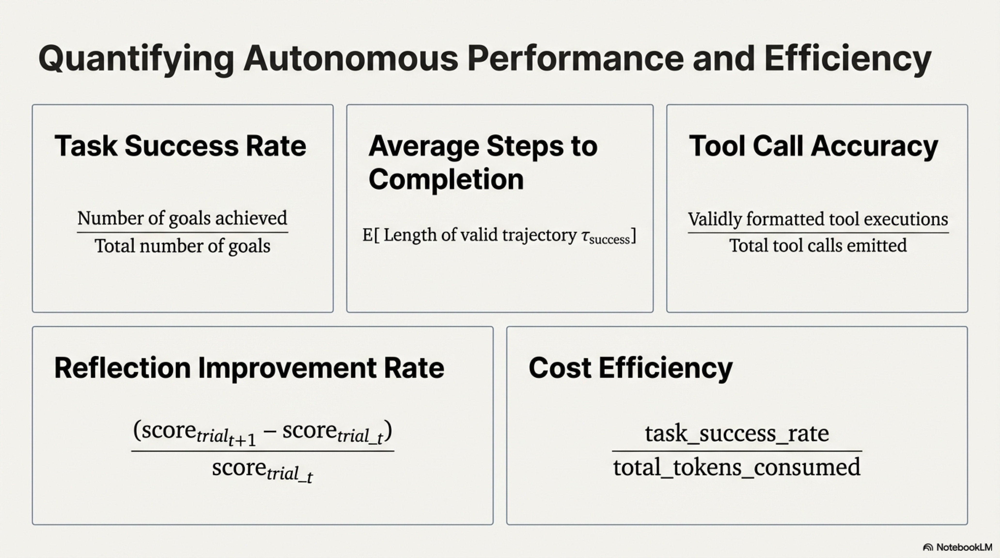

| Metric | Definition |
|---|---|
| **Task Success Rate** | $\frac{|\{q : \text{EVALUATOR}(q, y) \geq \theta\}|}{|\mathcal{B}|}$ |
| **Average Steps to Completion** | $\mathbb{E}[|\tau|]$ over successful trajectories |
| **Tool Call Accuracy** | $\frac{|\text{valid and necessary tool calls}|}{|\text{total tool calls}|}$ |
| **Reflection Improvement Rate** | $\frac{\text{score}_{\text{trial}_{t+1}} - \text{score}_{\text{trial}_t}}{\text{score}_{\text{trial}_t}}$ |
| **Cost Efficiency** | $\frac{\text{task\_success\_rate}}{\text{total\_tokens\_consumed}}$ |

---

# Summary: Unified View of Augmented LLMs


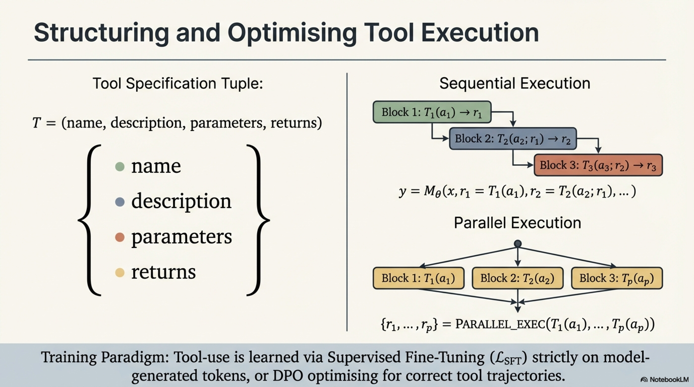


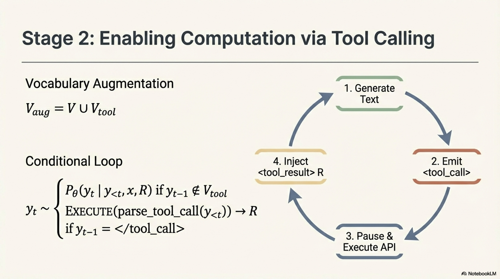


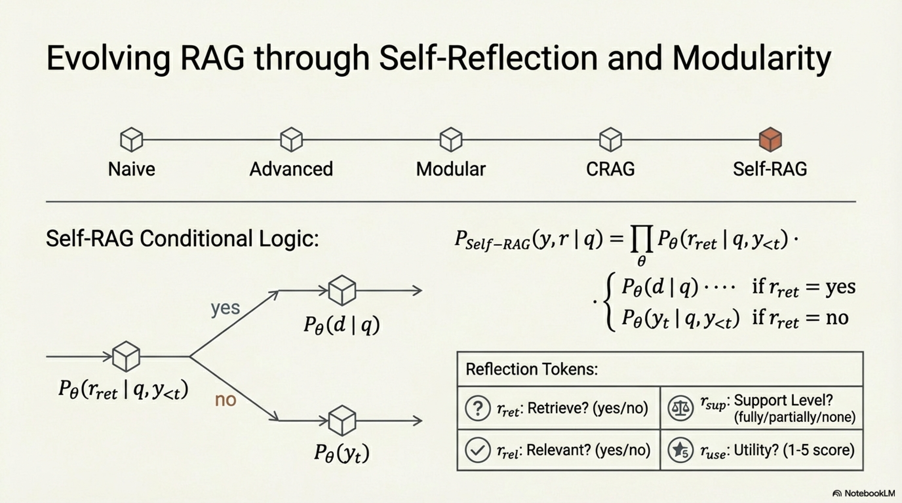

```
┌──────────────────────────────────────────────────────────────────┐
│                                                                  │
│                    AUGMENTED LLM SPECTRUM                         │
│                                                                  │
│   Complexity ──────────────────────────────────────────────►     │
│                                                                  │
│   ┌─────────┐    ┌─────────┐    ┌───────────┐    ┌───────────┐ │
│   │  Naive  │    │Advanced │    │   Tool    │    │  Agentic  │ │
│   │  RAG    │───▶│  RAG    │───▶│  Calling  │───▶│  Systems  │ │

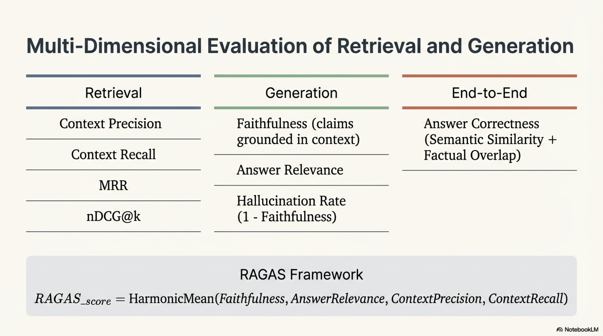

│   │         │    │+Rerank  │    │  + RAG    │    │           │ │
│   │ Single  │    │+Rewrite │    │           │    │ Planning  │ │
│   │retrieve │    │+Self-RAG│    │ Parallel/ │    │ Memory    │ │
│   │+generate│    │+CRAG    │    │ Sequential│    │ Reflection│ │
│   │         │    │         │    │           │    │ Multi-Agnt│ │
│   └─────────┘    └─────────┘    └───────────┘    └───────────┘ │
│                                                                  │
│   Autonomy:  Low          Medium         Medium-High      High  │
│   Latency:   Low          Medium         Medium           High  │
│   Accuracy:  Medium       High           High             V.High│
│   Cost:      Low          Medium         Medium           High  │
│                                                                  │
└──────────────────────────────────────────────────────────────────┘
```


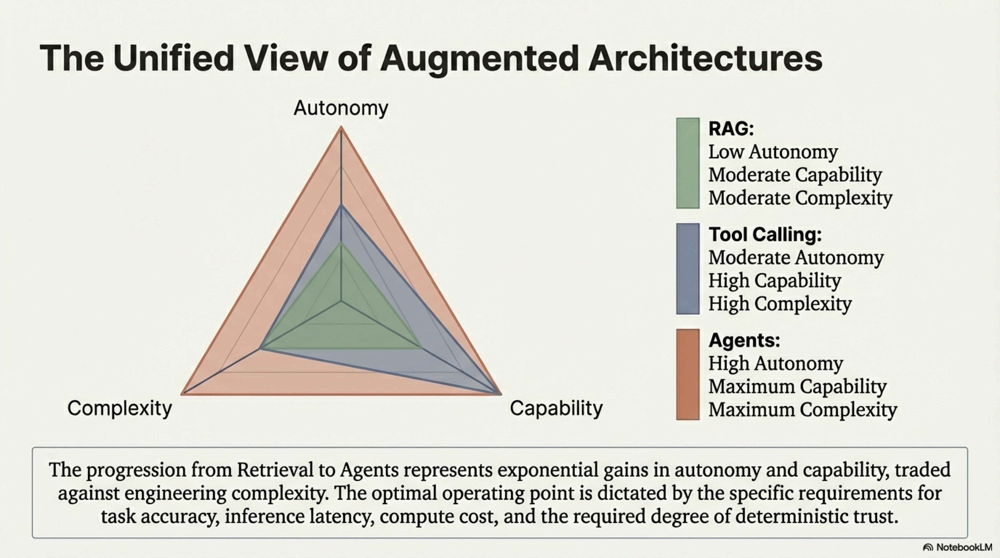


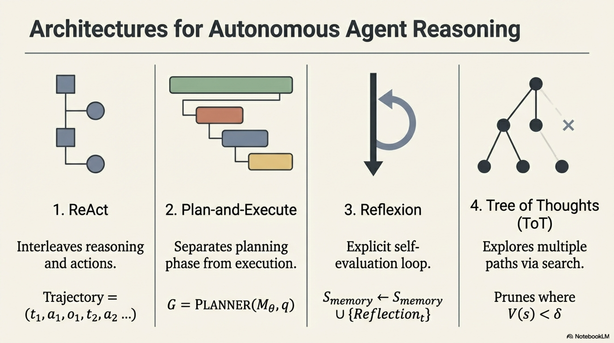


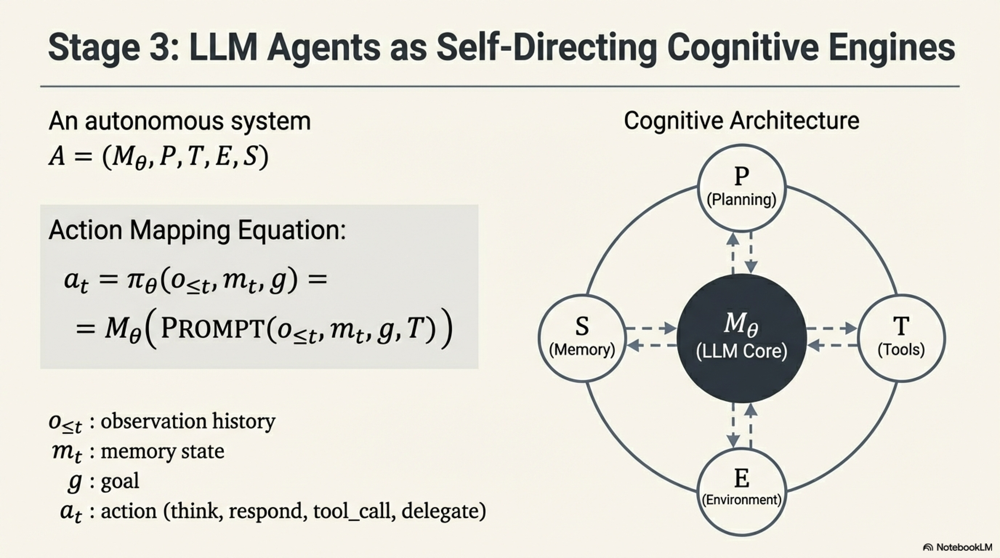

The progression from RAG → Tool Calling → Agents represents an increase along three axes: **autonomy** (the system's ability to self-direct), **capability** (range of problems solvable), and **complexity** (engineering and evaluation difficulty). The optimal operating point depends on the task's requirements for accuracy, latency, cost, and the degree of trust placed in autonomous model behavior.
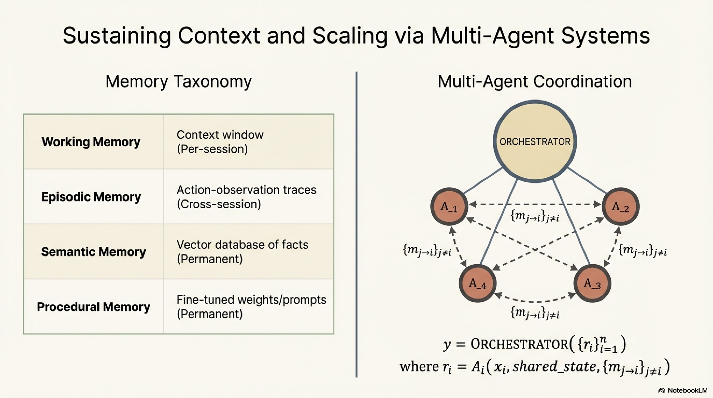

