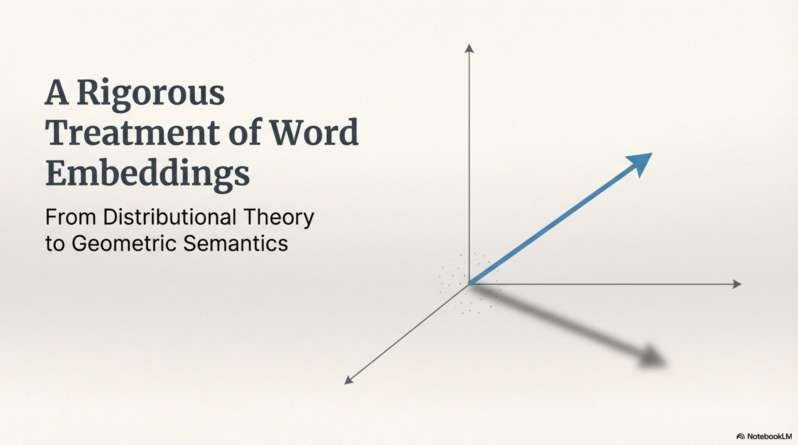

# Word Embeddings: A Rigorous Treatment


---

## 1. Word Embedding


### Definition

A **word embedding** is a learned mapping $\phi: \mathcal{V} \rightarrow \mathbb{R}^d$ from a discrete vocabulary $\mathcal{V}$ of size $|\mathcal{V}| = V$ into a continuous, dense vector space of dimensionality $d \ll V$, such that geometric relationships in $\mathbb{R}^d$ encode linguistic relationships observed in a corpus $\mathcal{C}$.

Formally, for each word $w_i \in \mathcal{V}$, the embedding assigns a vector:

$$\phi(w_i) = \mathbf{e}_i \in \mathbb{R}^d$$

The embedding matrix is then:

$$\mathbf{E} \in \mathbb{R}^{V \times d}$$

where the $i$-th row $\mathbf{E}[i, :] = \mathbf{e}_i$.

### Why Not One-Hot?

The naïve one-hot representation $\mathbf{o}_i \in \{0,1\}^V$ satisfies:

$$\mathbf{o}_i^\top \mathbf{o}_j = \delta_{ij} = \begin{cases} 1 & \text{if } i = j \\ 0 & \text{otherwise} \end{cases}$$


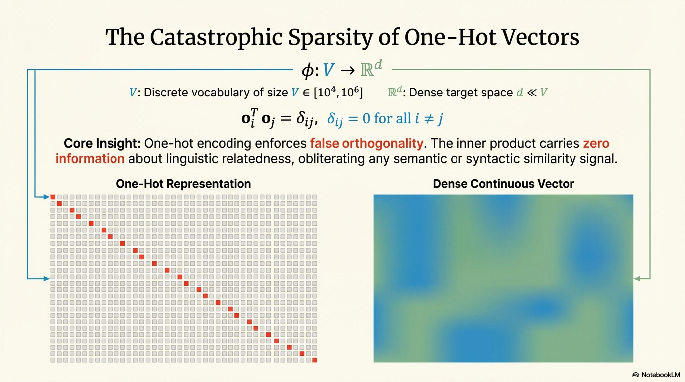

This imposes **orthogonality** on all word pairs, obliterating any semantic or syntactic similarity signal. The inner product carries zero information about linguistic relatedness. Dimensionality is $O(V)$ — typically $V \in [10^4, 10^6]$ — yielding catastrophic sparsity.

### Core Desiderata of Embeddings


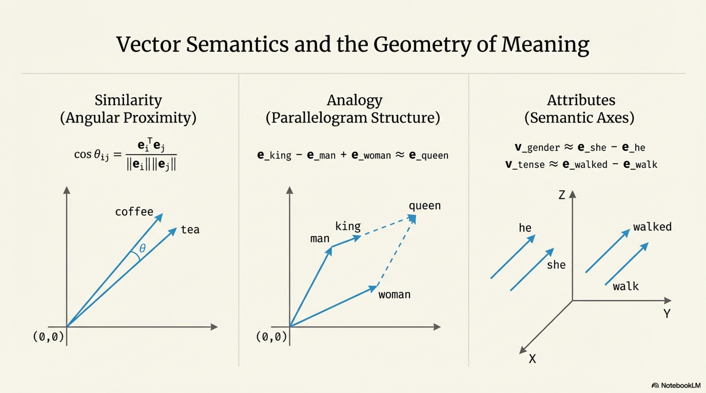

| Property | Formal Requirement |
|---|---|
| **Semantic Proximity** | $\text{sim}(\mathbf{e}_i, \mathbf{e}_j) \propto \text{semantic\_relatedness}(w_i, w_j)$ |
| **Compositionality** | $\mathbf{e}_{\text{king}} - \mathbf{e}_{\text{man}} + \mathbf{e}_{\text{woman}} \approx \mathbf{e}_{\text{queen}}$ |
| **Dimensionality Efficiency** | $d \in [50, 1024] \ll V$ |
| **Smoothness** | Small perturbations in $\mathbb{R}^d$ correspond to gradual semantic shifts |
| **Transferability** | Learned $\phi$ generalizes across downstream tasks |

The similarity function is typically cosine similarity:

$$\text{cos}(\mathbf{e}_i, \mathbf{e}_j) = \frac{\mathbf{e}_i^\top \mathbf{e}_j}{\|\mathbf{e}_i\|_2 \cdot \|\mathbf{e}_j\|_2}$$

---

## 2. Distributional Hypothesis


### Definition

**"A word is characterized by the company it keeps."** — J.R. Firth (1957)

Formally, the distributional hypothesis asserts that the conditional distribution over contexts determines word meaning:

$$\text{meaning}(w) \equiv P(\mathcal{C}\text{ontext} \mid w)$$

Two words $w_i, w_j$ are semantically similar if and only if:

$$D_{\text{KL}}\Big(P(\text{context} \mid w_i) \;\|\; P(\text{context} \mid w_j)\Big) \approx 0$$


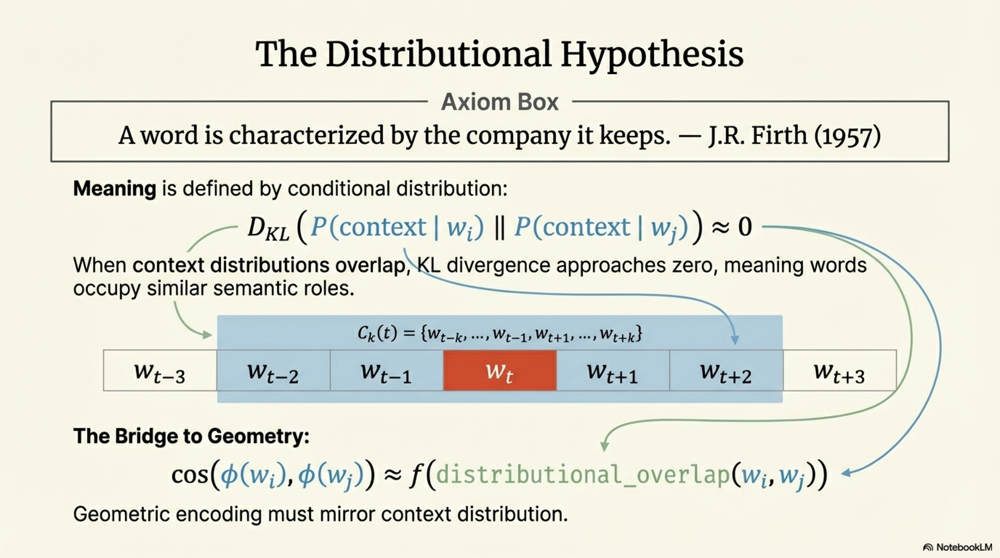

where $D_{\text{KL}}$ is the Kullback-Leibler divergence. When the context distributions are nearly identical, the words occupy similar semantic roles.

### Mathematical Formalization

Define a **context window** of size $k$ around position $t$ in corpus $\mathcal{C} = (w_1, w_2, \ldots, w_T)$:

$$\mathcal{C}_k(t) = \{w_{t-k}, \ldots, w_{t-1}, w_{t+1}, \ldots, w_{t+k}\}$$

The **co-occurrence probability** is:

$$P(w_c \mid w_t) = \frac{\#(w_t, w_c)}{\sum_{c' \in \mathcal{V}} \#(w_t, w_{c'})}$$

where $\#(w_t, w_c)$ counts how often $w_c$ appears in the context window of $w_t$ across the entire corpus.

### The Distributional-to-Geometric Bridge


The distributional hypothesis provides the **theoretical license** to construct embeddings: if context distributions encode meaning, then any faithful geometric encoding of those distributions will encode meaning. Specifically, the embedding $\phi$ is valid if:

$$\text{cos}(\phi(w_i), \phi(w_j)) \approx f\Big(\text{distributional\_overlap}(w_i, w_j)\Big)$$

for some monotonically increasing function $f$.

### Levels of Distributional Granularity

| Level | Context Definition | Captures |
|---|---|---|
| **First-order co-occurrence** | Words that directly co-occur with $w$ | Syntagmatic relations (e.g., "drink" ↔ "coffee") |
| **Second-order co-occurrence** | Words whose context distributions overlap with $w$'s | Paradigmatic relations (e.g., "coffee" ↔ "tea") |
| **Higher-order** | Chains of distributional transitivity | Abstract semantic fields |

> **Critical Insight:** Embedding methods differ primarily in *how* they compress the distributional signal — count-based methods preserve it explicitly; prediction-based methods learn it implicitly through gradient optimization.

---

## 3. Vector Semantics

### Definition

**Vector semantics** is the theoretical framework that represents word meanings as points (or directions) in a high-dimensional vector space, where the geometric structure — distances, angles, subspaces — encodes semantic and syntactic relationships.

### Geometric Properties as Semantic Primitives

**3.1 Similarity as Angular Proximity**

$$\text{sem\_sim}(w_i, w_j) = \cos\theta_{ij} = \frac{\mathbf{e}_i^\top \mathbf{e}_j}{\|\mathbf{e}_i\| \|\mathbf{e}_j\|}$$

**3.2 Analogy as Parallelogram Structure**


The analogy "$a$ is to $b$ as $c$ is to $d$" holds when:

$$\mathbf{e}_b - \mathbf{e}_a \approx \mathbf{e}_d - \mathbf{e}_c$$

Solving for the unknown $d$:

$$d^* = \arg\max_{w \in \mathcal{V}} \cos(\mathbf{e}_w, \; \mathbf{e}_b - \mathbf{e}_a + \mathbf{e}_c)$$

This emerges because embedding methods implicitly factorize a shifted co-occurrence matrix, and linear relationships in log-bilinear models produce additive vector arithmetic.

**3.3 Clustering as Semantic Fields**

Words belonging to the same semantic field (e.g., medical terms) cluster in $\mathbb{R}^d$:

$$\exists \; \text{subspace } S \subseteq \mathbb{R}^d : \forall w \in \text{field}, \; \text{proj}_S(\mathbf{e}_w) \text{ is concentrated}$$

**3.4 Directions as Semantic Axes**

Specific directions in the embedding space encode interpretable attributes:

$$\mathbf{v}_{\text{gender}} \approx \mathbf{e}_{\text{she}} - \mathbf{e}_{\text{he}}$$
$$\mathbf{v}_{\text{tense}} \approx \mathbf{e}_{\text{walked}} - \mathbf{e}_{\text{walk}}$$

The projection of any word onto such a direction quantifies the degree to which the word exhibits that attribute:

$$\text{gender\_score}(w) = \mathbf{e}_w^\top \hat{\mathbf{v}}_{\text{gender}}$$

### Formal Axioms of Vector Semantics

1. **Faithfulness:** $\text{sim}_{\text{geometric}}(\phi(w_i), \phi(w_j)) \propto \text{sim}_{\text{semantic}}(w_i, w_j)$
2. **Compositionality (weak):** $\exists$ linear operations that compose word vectors into phrase/sentence meanings
3. **Regularity:** Systematic linguistic relations manifest as consistent geometric transformations

---

## 4. Types of Word Embeddings

### Taxonomy


```
Word Embeddings
├── Count-Based (Frequency-Based)
│   ├── Term-Document Matrix
│   ├── Term-Term Co-occurrence Matrix
│   ├── TF-IDF
│   ├── PPMI
│   └── SVD / LSA
├── Prediction-Based
│   ├── Word2Vec (CBOW, Skip-Gram)
│   ├── GloVe (Hybrid: count + prediction)
│   └── FastText (subword-enriched)
├── Contextual (Dynamic)
│   ├── ELMo (BiLSTM-based)
│   ├── BERT (Transformer encoder)
│   └── GPT family (Transformer decoder)
└── Subword / Character-Level
    ├── BPE-based
    ├── CharCNN
    └── FastText n-gram
```

### Static vs. Contextual: Formal Distinction

**Static embeddings** assign a single vector per word type:

$$\phi_{\text{static}}: w \mapsto \mathbf{e}_w \in \mathbb{R}^d \quad \text{(context-independent)}$$

**Contextual embeddings** assign vectors per word token conditioned on surrounding context:

$$\phi_{\text{contextual}}: (w, \mathcal{C}) \mapsto \mathbf{h}_w^{(\mathcal{C})} \in \mathbb{R}^d$$


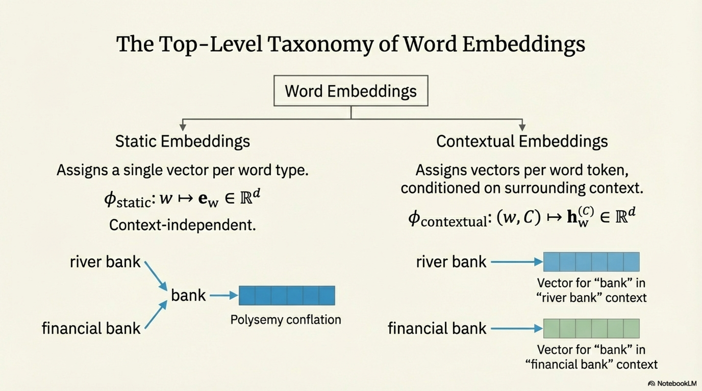

For a polysemous word like "bank," static embeddings produce a single conflated vector, whereas contextual embeddings produce distinct vectors for "river bank" versus "financial bank."

---

## 5. Frequency-Based Embeddings (Count-Based Methods)

### 5.1 Term-Document Matrix

**Definition:** Matrix $\mathbf{M}_{\text{td}} \in \mathbb{R}^{V \times D}$ where $D$ is the number of documents:

$$\mathbf{M}_{\text{td}}[i, j] = \text{count of word } w_i \text{ in document } d_j$$

Each row is a word vector of dimensionality $D$. Each column is a document vector of dimensionality $V$.

### 5.2 Term-Term (Word-Context) Co-occurrence Matrix

**Definition:** Matrix $\mathbf{F} \in \mathbb{R}^{V \times V}$:

$$\mathbf{F}[i, j] = \sum_{t=1}^{T} \mathbb{1}[w_t = w_i] \cdot \sum_{\substack{l = t-k \\ l \neq t}}^{t+k} \mathbb{1}[w_l = w_j]$$

where $k$ is the context window half-size and $T$ is the corpus length.

### 5.3 TF-IDF Weighting

Raw counts are dominated by frequent, uninformative words. **TF-IDF** re-weights:

$$\text{TF-IDF}(w, d) = \text{TF}(w, d) \times \text{IDF}(w)$$

where:

$$\text{TF}(w, d) = \frac{f_{w,d}}{\max_{w'} f_{w',d}} \quad \text{(augmented frequency)}$$

$$\text{IDF}(w) = \log\frac{D}{|\{d : w \in d\}|}$$

The IDF term down-weights words appearing in many documents (low discriminative power), while TF captures within-document importance.

### 5.4 Pointwise Mutual Information (PMI) and PPMI

**PMI** measures how much more (or less) two words co-occur than expected under independence:

$$\text{PMI}(w_i, w_j) = \log_2 \frac{P(w_i, w_j)}{P(w_i) \cdot P(w_j)}$$

where:

$$P(w_i, w_j) = \frac{\mathbf{F}[i,j]}{\sum_{i',j'}\mathbf{F}[i',j']} \;, \quad P(w_i) = \frac{\sum_j \mathbf{F}[i,j]}{\sum_{i',j'}\mathbf{F}[i',j']}$$

**Problem:** PMI is unbounded below (→ $-\infty$ for zero co-occurrences). **Positive PMI (PPMI)** truncates:

$$\text{PPMI}(w_i, w_j) = \max(0, \text{PMI}(w_i, w_j))$$

The PPMI matrix $\mathbf{M}_{\text{PPMI}} \in \mathbb{R}^{V \times V}$ provides high-quality sparse word vectors.

### 5.5 Dimensionality Reduction via Truncated SVD (LSA)

The PPMI (or TF-IDF) matrix is $V \times V$ (or $V \times D$) — too high-dimensional. **Truncated SVD** compresses it:

$$\mathbf{M} \approx \mathbf{U}_d \boldsymbol{\Sigma}_d \mathbf{V}_d^\top$$

where $\mathbf{U}_d \in \mathbb{R}^{V \times d}$, $\boldsymbol{\Sigma}_d \in \mathbb{R}^{d \times d}$ (diagonal), $\mathbf{V}_d \in \mathbb{R}^{V \times d}$, and only the top-$d$ singular values are retained.

The word embedding becomes:

$$\mathbf{E} = \mathbf{U}_d \boldsymbol{\Sigma}_d^{\alpha}, \quad \alpha \in \{0, 0.5, 1\}$$


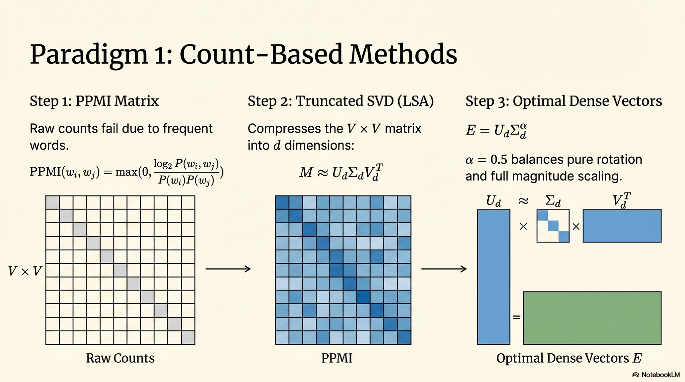

Setting $\alpha = 0.5$ is common, balancing between pure rotation ($\alpha=0$) and full magnitude scaling ($\alpha=1$).

**Optimality:** SVD produces the rank-$d$ approximation minimizing the Frobenius norm:

$$\mathbf{U}_d, \boldsymbol{\Sigma}_d, \mathbf{V}_d = \arg\min_{\text{rank-}d} \|\mathbf{M} - \hat{\mathbf{M}}\|_F$$

---

### 5.6 Prediction-Based Methods


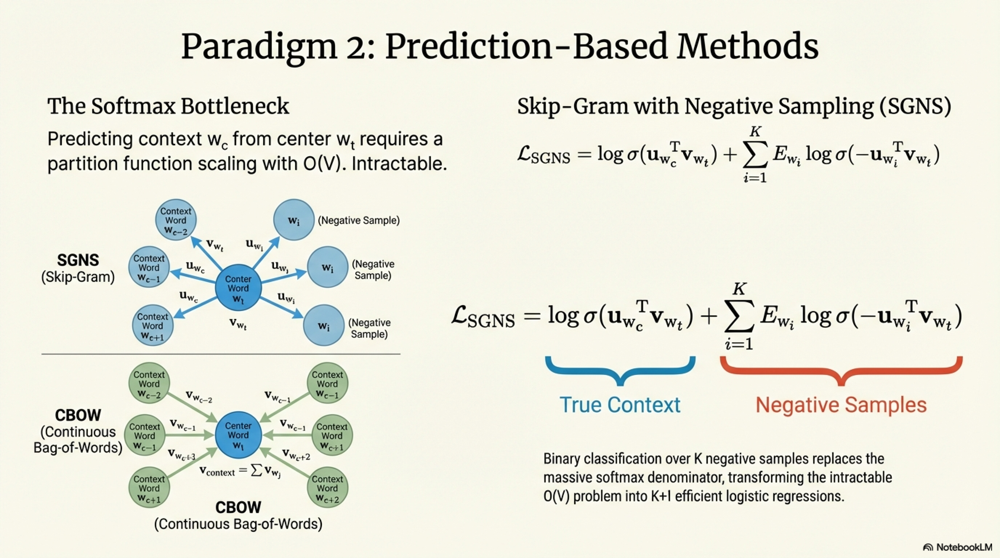

#### Word2Vec: Skip-Gram with Negative Sampling (SGNS)


**Objective:** Given center word $w_t$, predict context words $w_c$ within window $k$.

The full softmax objective:

$$P(w_c \mid w_t) = \frac{\exp(\mathbf{u}_{w_c}^\top \mathbf{v}_{w_t})}{\sum_{w' \in \mathcal{V}} \exp(\mathbf{u}_{w'}^\top \mathbf{v}_{w_t})}$$

where $\mathbf{v}_{w_t} \in \mathbb{R}^d$ is the center embedding, $\mathbf{u}_{w_c} \in \mathbb{R}^d$ is the context embedding.

The partition function $\sum_{w'} \exp(\cdot)$ is $O(V)$ — intractable. **Negative Sampling** approximates via:

$$\mathcal{L}_{\text{SGNS}} = \sum_{(w_t, w_c) \in \mathcal{D}^+} \left[ \log \sigma(\mathbf{u}_{w_c}^\top \mathbf{v}_{w_t}) + \sum_{i=1}^{K} \mathbb{E}_{w_i \sim P_n(w)} \log \sigma(-\mathbf{u}_{w_i}^\top \mathbf{v}_{w_t}) \right]$$

where $\sigma(x) = \frac{1}{1+e^{-x}}$, $K$ is the number of negative samples, and $P_n(w) \propto f(w)^{3/4}$ is the smoothed unigram distribution.

**Critical Result (Levy & Goldberg, 2014):** SGNS implicitly factorizes the shifted PMI matrix:

$$\mathbf{v}_{w}^\top \mathbf{u}_{c} \approx \text{PMI}(w, c) - \log K$$

This unifies count-based and prediction-based paradigms.

#### CBOW (Continuous Bag of Words)

Inverts the prediction direction: predict center word from context average:

$$P(w_t \mid w_{t-k:t+k}) = \frac{\exp\left(\mathbf{v}_{w_t}^\top \bar{\mathbf{u}}_{\text{ctx}}\right)}{\sum_{w'} \exp\left(\mathbf{v}_{w'}^\top \bar{\mathbf{u}}_{\text{ctx}}\right)}$$

where $\bar{\mathbf{u}}_{\text{ctx}} = \frac{1}{2k} \sum_{\substack{j=t-k \\ j \neq t}}^{t+k} \mathbf{u}_{w_j}$.

#### GloVe (Global Vectors)


**Objective:** Directly model the log co-occurrence ratio.

$$J = \sum_{i,j=1}^{V} f(X_{ij}) \left( \mathbf{w}_i^\top \tilde{\mathbf{w}}_j + b_i + \tilde{b}_j - \log X_{ij} \right)^2$$

where $X_{ij}$ is the co-occurrence count, $b_i, \tilde{b}_j$ are bias terms, and $f$ is a weighting function:

$$f(x) = \begin{cases} (x / x_{\max})^\alpha & \text{if } x < x_{\max} \\ 1 & \text{otherwise} \end{cases}, \quad \alpha = 0.75$$

This down-weights extremely frequent co-occurrences (e.g., stop-word pairs) and prevents zero counts from dominating the loss.

**Rationale:** GloVe derives from the observation that meaning is encoded in co-occurrence *ratios*:

$$\frac{P(k \mid \text{ice})}{P(k \mid \text{steam})} \quad \text{is large for } k=\text{solid}, \text{ small for } k=\text{gas}, \approx 1 \text{ for } k=\text{water}$$

The bilinear form $\mathbf{w}_i^\top \tilde{\mathbf{w}}_j$ must capture $\log P(j \mid i)$ for this ratio structure to emerge.

#### FastText

Extends Skip-Gram by representing each word as a bag of character $n$-grams:

$$\mathbf{v}_{w} = \frac{1}{|\mathcal{G}_w|} \sum_{g \in \mathcal{G}_w} \mathbf{z}_g$$

where $\mathcal{G}_w$ is the set of $n$-grams (typically $n \in [3,6]$) of word $w$ plus the word itself.


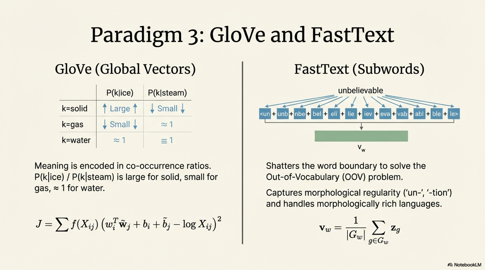

**Advantages:**
- Handles **out-of-vocabulary (OOV)** words via subword composition
- Captures **morphological** regularity (e.g., "un-" prefix, "-tion" suffix)
- Improves embeddings for **morphologically rich** languages

---

## Pseudo-Algorithms

### Algorithm 1: PPMI Matrix Construction

```
ALGORITHM: Construct_PPMI_Matrix

INPUT:
    Corpus C = (w_1, w_2, ..., w_T),  T = corpus length
    Vocabulary V = {w_1, ..., w_V}
    Context window half-size k ∈ ℤ⁺

OUTPUT:
    PPMI matrix M ∈ ℝ^{V × V}

PROCEDURE:
    1. INITIALIZE co-occurrence matrix F ∈ ℝ^{V × V} ← 0

    2. FOR t = 1 TO T:
        FOR j = t - k TO t + k, j ≠ t:
            IF 1 ≤ j ≤ T:
                F[idx(w_t), idx(w_j)] ← F[idx(w_t), idx(w_j)] + 1

    3. COMPUTE total sum:
        N ← ∑_{i,j} F[i,j]

    4. COMPUTE marginals:
        FOR i = 1 TO V:
            n_i ← ∑_j F[i,j]
        FOR j = 1 TO V:
            n_j ← ∑_i F[i,j]

    5. CONSTRUCT PPMI:
        FOR i = 1 TO V:
            FOR j = 1 TO V:
                IF F[i,j] > 0:
                    pmi_ij ← log₂( (F[i,j] · N) / (n_i · n_j) )
                    M[i,j] ← max(0, pmi_ij)
                ELSE:
                    M[i,j] ← 0

    6. RETURN M
```

---

### Algorithm 2: Skip-Gram with Negative Sampling (SGNS)

```
ALGORITHM: SGNS_Training

INPUT:
    Corpus C = (w_1, ..., w_T)
    Vocabulary V, |V| = V
    Embedding dimension d
    Context window half-size k
    Number of negative samples K
    Learning rate η
    Noise distribution P_n(w) ∝ f(w)^{3/4}
    Number of epochs E

OUTPUT:
    Center embedding matrix W ∈ ℝ^{V × d}
    Context embedding matrix U ∈ ℝ^{V × d}

PROCEDURE:
    1. INITIALIZE W, U with small random values ~ 𝒰(-1/√d, 1/√d)

    2. FOR epoch = 1 TO E:
        FOR t = 1 TO T:
            w_center ← w_t
            
            // Generate positive pairs
            FOR j = t - k TO t + k, j ≠ t:
                IF 1 ≤ j ≤ T:
                    w_context ← w_j
                    
                    // Positive update
                    score_pos ← W[w_center]ᵀ · U[w_context]
                    δ_pos ← σ(score_pos) - 1   // gradient toward 1
                    
                    // Negative samples
                    FOR i = 1 TO K:
                        w_neg ← SAMPLE from P_n
                        score_neg ← W[w_center]ᵀ · U[w_neg]
                        δ_neg ← σ(score_neg)    // gradient toward 0
                        
                        // Update negative context vector
                        U[w_neg] ← U[w_neg] - η · δ_neg · W[w_center]
                        // Accumulate center gradient
                        W[w_center] ← W[w_center] - η · δ_neg · U[w_neg]
                    
                    // Update positive context vector
                    U[w_context] ← U[w_context] - η · δ_pos · W[w_center]
                    W[w_center] ← W[w_center] - η · δ_pos · U[w_context]

    3. RETURN W, U
```

---

### Algorithm 3: GloVe Training

```
ALGORITHM: GloVe_Training

INPUT:
    Co-occurrence matrix X ∈ ℝ^{V × V}  (precomputed)
    Embedding dimension d
    x_max, α (weighting hyperparameters)
    Learning rate η
    Number of epochs E

OUTPUT:
    Word vectors W ∈ ℝ^{V × d}, context vectors W̃ ∈ ℝ^{V × d}
    Biases b ∈ ℝ^V, b̃ ∈ ℝ^V

PROCEDURE:
    1. INITIALIZE W, W̃ ~ 𝒰(-0.5/d, 0.5/d)
       INITIALIZE b, b̃ ← 0

    2. COLLECT nonzero entries: S ← {(i, j) : X[i,j] > 0}

    3. FOR epoch = 1 TO E:
        SHUFFLE S
        total_loss ← 0
        
        FOR each (i, j) ∈ S:
            // Compute weight
            IF X[i,j] < x_max:
                f_ij ← (X[i,j] / x_max)^α
            ELSE:
                f_ij ← 1
            
            // Compute prediction error
            diff ← W[i]ᵀ · W̃[j] + b[i] + b̃[j] - log(X[i,j])
            
            // Weighted squared loss
            loss ← f_ij · diff²
            total_loss ← total_loss + loss
            
            // Compute gradient
            grad_common ← 2 · f_ij · diff
            
            // Update parameters (or accumulate for AdaGrad)
            W[i] ← W[i] - η · grad_common · W̃[j]
            W̃[j] ← W̃[j] - η · grad_common · W[i]
            b[i] ← b[i] - η · grad_common
            b̃[j] ← b̃[j] - η · grad_common

    4. // Final embedding: average of both
       E ← W + W̃

    5. RETURN E, b, b̃
```

---

### Algorithm 4: SVD-Based Embedding (LSA)

```
ALGORITHM: SVD_Embedding

INPUT:
    Weighted matrix M ∈ ℝ^{V × V}  (e.g., PPMI matrix)
    Target dimensionality d
    Power weighting α ∈ [0, 1]

OUTPUT:
    Word embedding matrix E ∈ ℝ^{V × d}

PROCEDURE:
    1. COMPUTE truncated SVD:
       U_d, Σ_d, V_dᵀ ← TruncatedSVD(M, rank=d)
       
       // U_d ∈ ℝ^{V × d}, Σ_d ∈ ℝ^{d × d} diagonal, V_d ∈ ℝ^{V × d}

    2. CONSTRUCT embedding:
       E ← U_d · Σ_d^α
       
       // α = 0:   E = U_d         (orthonormal directions only)
       // α = 0.5: E = U_d · Σ_d^{0.5}  (balanced, common choice)
       // α = 1:   E = U_d · Σ_d   (full magnitude)

    3. OPTIONAL: L2-normalize each row
       FOR i = 1 TO V:
           E[i] ← E[i] / ‖E[i]‖₂

    4. RETURN E
```

---

## 6. Bias in Word Embeddings


### Definition

**Embedding bias** refers to the systematic encoding of societal stereotypes, prejudices, and discriminatory associations within the learned vector space, arising from biased distributional patterns in the training corpus.

### Formal Characterization

Given a bias direction $\mathbf{b} \in \mathbb{R}^d$ (e.g., $\mathbf{b} = \mathbf{e}_{\text{he}} - \mathbf{e}_{\text{she}}$), the **bias score** of a word $w$ is:

$$\text{bias}(w, \mathbf{b}) = \cos(\mathbf{e}_w, \mathbf{b}) = \frac{\mathbf{e}_w^\top \mathbf{b}}{\|\mathbf{e}_w\| \|\mathbf{b}\|}$$

Empirical findings (Bolukbasi et al., 2016):

| Word | Gender Bias Score |
|---|---|
| nurse | −0.85 (strongly female-associated) |
| programmer | +0.73 (strongly male-associated) |
| homemaker | −0.92 |
| philosopher | +0.61 |

These reflect and **amplify** corpus-level stereotypes, propagating them into downstream systems.

### Types of Embedding Bias

| Bias Type | Manifestation | Example |
|---|---|---|
| **Gender** | Professional role stereotypes | "doctor" ↔ male, "nurse" ↔ female |
| **Racial** | Name-profession associations | Names associated with race encode socioeconomic stereotypes |
| **Religious** | Sentiment disparities | "Muslim" closer to negative sentiment words |
| **Socioeconomic** | Dialect/register discrimination | Informal language embeddings encode lower prestige |

### Debiasing Methods

#### 6.1 Hard Debiasing (Bolukbasi et al., 2016)

**Step 1: Identify the bias subspace.** Given definitional pairs $\mathcal{D} = \{(w_1^m, w_1^f), (w_2^m, w_2^f), \ldots\}$, compute:

$$\mathbf{b}_i = \mathbf{e}_{w_i^m} - \mathbf{e}_{w_i^f}$$

Perform PCA on $\{\mathbf{b}_i\}$ to extract the top-$k$ components defining the bias subspace $B \in \mathbb{R}^{d \times k}$.

**Step 2: Neutralize.** For neutral words $w \notin \mathcal{D}$, remove the projection onto $B$:

$$\mathbf{e}_w^{\text{debiased}} = \mathbf{e}_w - B B^\top \mathbf{e}_w$$

**Step 3: Equalize.** For definitional pairs, ensure equidistance from all neutral words by centering within $B$ and reflecting symmetrically.

#### 6.2 WEAT (Word Embedding Association Test)

An adaptation of the Implicit Association Test (IAT) to embedding spaces. The test statistic:

$$s(\mathcal{X}, \mathcal{Y}, \mathcal{A}, \mathcal{B}) = \sum_{x \in \mathcal{X}} s(x, \mathcal{A}, \mathcal{B}) - \sum_{y \in \mathcal{Y}} s(y, \mathcal{A}, \mathcal{B})$$

where:

$$s(w, \mathcal{A}, \mathcal{B}) = \frac{1}{|\mathcal{A}|}\sum_{a \in \mathcal{A}} \cos(\mathbf{e}_w, \mathbf{e}_a) - \frac{1}{|\mathcal{B}|}\sum_{b \in \mathcal{B}} \cos(\mathbf{e}_w, \mathbf{e}_b)$$

The effect size (analogous to Cohen's $d$):

$$\text{ES} = \frac{\mu_x - \mu_y}{\sigma_{x \cup y}}$$

Statistical significance is established via permutation test over $\mathcal{X} \cup \mathcal{Y}$.

### Pseudo-Algorithm: Hard Debiasing

```
ALGORITHM: Hard_Debias

INPUT:
    Embedding matrix E ∈ ℝ^{V × d}
    Definitional pairs D = {(w_1^m, w_1^f), ..., (w_n^m, w_n^f)}
    Neutral word set N ⊂ V
    Bias subspace dimensionality k (typically k = 1)

OUTPUT:
    Debiased embedding matrix E' ∈ ℝ^{V × d}

PROCEDURE:
    1. COMPUTE bias direction vectors:
       FOR i = 1 TO |D|:
           b_i ← E[w_i^m] - E[w_i^f]

    2. COMPUTE bias subspace via PCA:
       C ← (1/|D|) · Σ_i b_i · b_iᵀ    // covariance matrix
       B ← top-k eigenvectors of C       // B ∈ ℝ^{d × k}

    3. NEUTRALIZE neutral words:
       FOR each w ∈ N:
           E'[w] ← E[w] - B · Bᵀ · E[w]
           E'[w] ← E'[w] / ‖E'[w]‖₂      // re-normalize

    4. EQUALIZE definitional pairs:
       FOR each pair (w^m, w^f) ∈ D:
           μ ← (E[w^m] + E[w^f]) / 2
           μ_⊥ ← μ - B · Bᵀ · μ           // component orthogonal to B
           ν ← B · Bᵀ · (E[w^m] - E[w^f]) / 2
           ν̂ ← ν / ‖ν‖₂ · √(1 - ‖μ_⊥‖₂²)
           E'[w^m] ← μ_⊥ + ν̂
           E'[w^f] ← μ_⊥ - ν̂

    5. RETURN E'
```

### Critical Observation on Debiasing Limitations

Gonen & Goldberg (2019) demonstrated that hard debiasing is **superficial**: after projection-based debiasing, previously biased words remain clustered together when measured by nearest-neighbor structure. The bias is distributed across many dimensions, not confined to a single linear subspace. This implies that debiasing by linear projection addresses symptoms, not root causes.

---

## 7. Limitations of Word Embedding Methods

### 7.1 Polysemy Conflation

Static embeddings assign a **single vector per word type**, collapsing all senses into one point:

$$\phi(\text{"bank"}) = \frac{1}{|\text{senses}|}\sum_{s} \alpha_s \cdot \mathbf{e}_{\text{bank}}^{(s)}$$

where $\alpha_s$ is roughly proportional to sense frequency. The resulting vector is the **frequency-weighted centroid** of all sense vectors, which may not represent any single sense accurately.

**Consequence:** For downstream tasks requiring sense disambiguation, static embeddings introduce irreducible noise.

### 7.2 Context Independence

$$\phi_{\text{static}}(w_t) = \mathbf{e}_{w_t} \quad \forall \text{ contexts}$$

The embedding is invariant to the sentential environment. "He deposited money in the bank" and "The river bank was muddy" yield identical representations.

### 7.3 Out-of-Vocabulary (OOV) Problem

For a fixed vocabulary $\mathcal{V}$:

$$\phi(w) = \text{undefined} \quad \forall \; w \notin \mathcal{V}$$

This is catastrophic for morphologically rich languages (Turkish, Finnish), domain-specific corpora (biomedical terms), and noisy text (social media).

**Mitigation:** Subword methods (FastText, BPE) partially address this by composing embeddings from character $n$-grams.

### 7.4 Antonym Problem

Distributional methods conflate synonyms and antonyms because both share nearly identical context distributions:

$$P(\text{context} \mid \text{hot}) \approx P(\text{context} \mid \text{cold})$$

Both co-occur with "weather," "temperature," "extremely," etc. Yet their meanings are **opposite**. The distributional hypothesis is blind to this distinction.

### 7.5 Frequency Bias

Rare words have fewer training examples, yielding **high-variance, low-quality embeddings**:

$$\text{Var}(\hat{\mathbf{e}}_w) \propto \frac{1}{f(w)}$$

where $f(w)$ is the word frequency. Extremely frequent words (stop words) dominate training signal despite carrying minimal semantic content.

### 7.6 Static Geometry Constraints

| Limitation | Description |
|---|---|
| **Isotropic assumption** | Embeddings tend to occupy a narrow cone in $\mathbb{R}^d$ (anisotropy), reducing effective representational capacity |
| **Euclidean metric mismatch** | Hierarchical relationships (hyponymy) are poorly modeled in flat Euclidean space; hyperbolic embeddings (Poincaré) address this |
| **Hubness** | Some vectors become nearest neighbors of disproportionately many other vectors in high dimensions, distorting retrieval |

### 7.7 Training Corpus Dependency

Embedding quality and coverage are **entirely determined** by the training corpus:

- **Domain mismatch:** Embeddings trained on Wikipedia perform poorly on biomedical text
- **Temporal mismatch:** Language evolves; "corona" pre-2020 ≠ "corona" post-2020
- **Cultural specificity:** Embeddings trained on English text do not transfer semantic structures to typologically distant languages

### 7.8 Non-Compositionality

Word embeddings do not natively compose:

$$\phi(\text{"not good"}) \neq g(\phi(\text{"not"}), \phi(\text{"good"}))$$

for any simple function $g$. Negation, intensification, and other compositional operations require architectures beyond simple vector addition.

### 7.9 Dimensionality Selection

The choice of $d$ is typically heuristic. There exists a **bias-variance tradeoff**:

- **Small $d$:** High bias (insufficient capacity), underfitting semantic distinctions
- **Large $d$:** High variance (overfitting to corpus artifacts), diminishing marginal returns

No principled, universally applicable method exists for optimal $d$ selection, though PPA (Post-Processing Algorithm) and intrinsic dimensionality estimation provide partial guidance.

---

## 8. Applications of Word Embeddings

### 8.1 Taxonomy of Applications

| Application Domain | How Embeddings Are Used |
|---|---|
| **Information Retrieval** | Query-document matching via cosine similarity in embedding space |
| **Machine Translation** | Cross-lingual mapping $\mathbf{W}\mathbf{e}_{\text{src}} \approx \mathbf{e}_{\text{tgt}}$ via Procrustes alignment |
| **Sentiment Analysis** | Input features for classification; sentiment-enriched embeddings |
| **Named Entity Recognition** | Dense input representations for sequence labeling models |
| **Question Answering** | Semantic matching between question and candidate answer spans |
| **Text Classification** | Document representation via embedding aggregation |
| **Relation Extraction** | Offset vectors encode relational patterns |
| **Knowledge Graph Completion** | Entity/relation embeddings predict missing triples |

### 8.2 Cross-Lingual Embedding Alignment

Given monolingual embeddings $\mathbf{E}_{\text{src}} \in \mathbb{R}^{V_s \times d}$ and $\mathbf{E}_{\text{tgt}} \in \mathbb{R}^{V_t \times d}$, and a bilingual seed dictionary $\{(s_i, t_i)\}_{i=1}^n$, learn a rotation matrix:

$$\mathbf{W}^* = \arg\min_{\mathbf{W}} \sum_{i=1}^{n} \|\mathbf{W} \mathbf{e}_{s_i} - \mathbf{e}_{t_i}\|^2 \quad \text{s.t.} \quad \mathbf{W}^\top \mathbf{W} = \mathbf{I}$$

**Solution** (Procrustes):

$$\mathbf{W}^* = \mathbf{V} \mathbf{U}^\top, \quad \text{where } \mathbf{U} \boldsymbol{\Sigma} \mathbf{V}^\top = \text{SVD}(\mathbf{E}_{\text{tgt}}^\top \mathbf{E}_{\text{src}})$$

The orthogonality constraint preserves monolingual quality while enabling cross-lingual transfer.

### 8.3 Embeddings as Transfer Learning

Pre-trained embeddings serve as **initialization** for task-specific models:

$$\theta_{\text{task}} = \arg\min_\theta \mathcal{L}_{\text{task}}(f_\theta(\mathbf{E}_{\text{pretrained}} \cdot \mathbf{x}), y)$$

The embedding layer may be **frozen** (feature extraction) or **fine-tuned** (end-to-end adaptation), with the choice governed by:


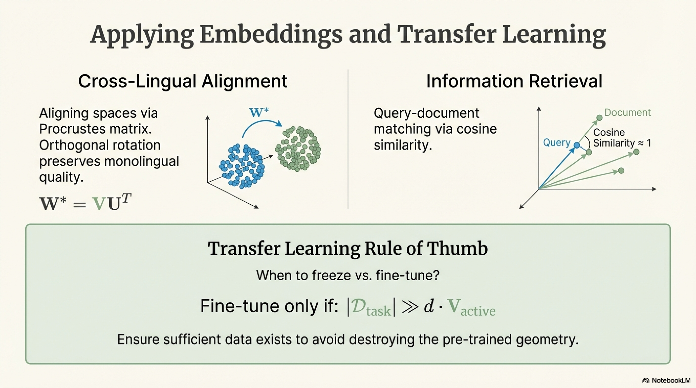

$$\text{Fine-tune if: } |\mathcal{D}_{\text{task}}| \gg d \cdot V_{\text{active}} \quad \text{(sufficient data to avoid overfitting)}$$

### 8.4 Analogical Reasoning as Evaluation

The **analogy task** evaluates relational consistency:

$$\text{accuracy} = \frac{1}{|\mathcal{A}|} \sum_{(a,b,c,d) \in \mathcal{A}} \mathbb{1}\left[\arg\max_{w \neq a,b,c} \cos(\mathbf{e}_w, \mathbf{e}_b - \mathbf{e}_a + \mathbf{e}_c) = d\right]$$

Common benchmarks: Google Analogy Dataset (syntactic + semantic), BATS (Balanced Analogy Test Set).

### 8.5 Document Representation

Aggregation strategies to obtain document-level vectors from word embeddings:

$$\mathbf{d}_{\text{avg}} = \frac{1}{|D|} \sum_{w \in D} \mathbf{e}_w$$

$$\mathbf{d}_{\text{TF-IDF}} = \frac{\sum_{w \in D} \text{TF-IDF}(w, D) \cdot \mathbf{e}_w}{\sum_{w \in D} \text{TF-IDF}(w, D)}$$

$$\mathbf{d}_{\text{SIF}} = \frac{1}{|D|} \sum_{w \in D} \frac{a}{a + P(w)} \mathbf{e}_w \quad \text{(Smooth Inverse Frequency, Arora et al. 2017)}$$


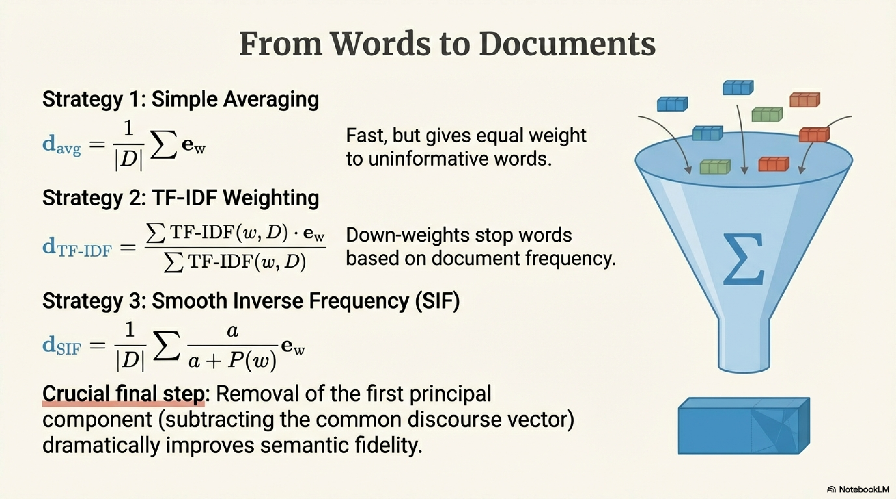

followed by removal of the first principal component (common discourse vector).

---

## Summary: Unifying Perspective

The entire landscape of word embeddings can be understood through a single lens:


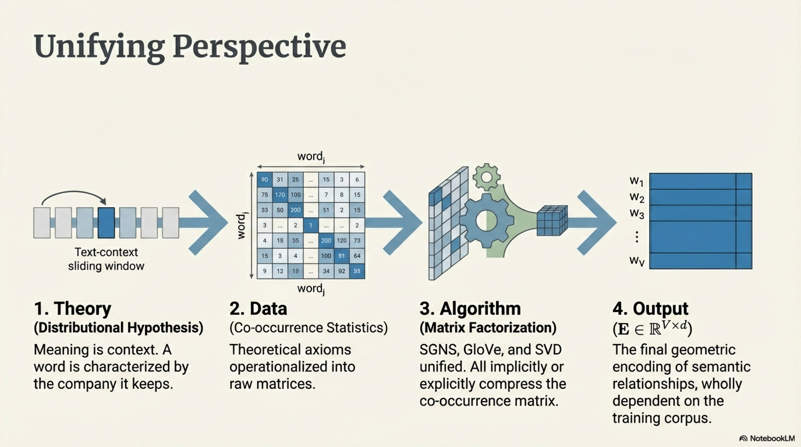

$$\underbrace{\text{Distributional Hypothesis}}_{\text{Theoretical Foundation}} \xrightarrow{\text{operationalized via}} \underbrace{\text{Co-occurrence Statistics}}_{\text{Data}} \xrightarrow{\text{compressed by}} \underbrace{\text{Matrix Factorization / Neural Prediction}}_{\text{Algorithm}} \xrightarrow{\text{yielding}} \underbrace{\mathbf{E} \in \mathbb{R}^{V \times d}}_{\text{Embedding}}$$


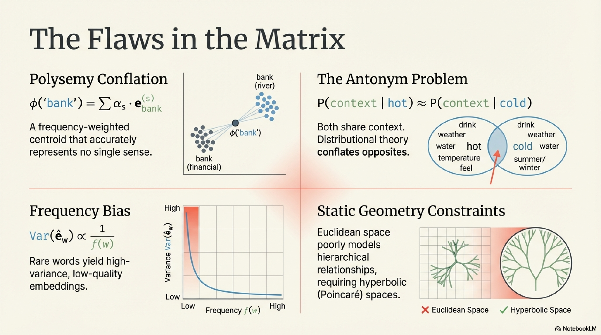


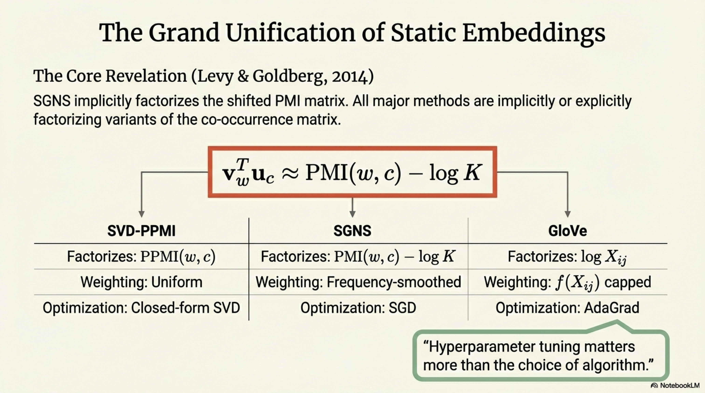

The key result unifying the field: **all major static embedding methods — SGNS, GloVe, SVD on PPMI — are implicitly or explicitly factorizing variants of the co-occurrence matrix** (Levy, Goldberg & Dagan, 2015). They differ in:

| Method | Matrix Factorized | Weighting | Optimization |
|---|---|---|---|
| SVD-PPMI | $\text{PPMI}(w,c)$ | Uniform | Closed-form SVD |
| SGNS | $\text{PMI}(w,c) - \log K$ | Frequency-smoothed | SGD |
| GloVe | $\log X_{ij}$ | $f(X_{ij})$ capped | AdaGrad |

This unification reveals that **hyperparameter tuning** (window size, subsampling, negative samples, dimensionality) matters more than the choice of algorithm — a finding with profound practical and theoretical implications.
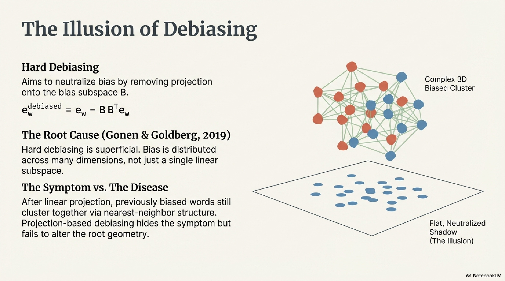


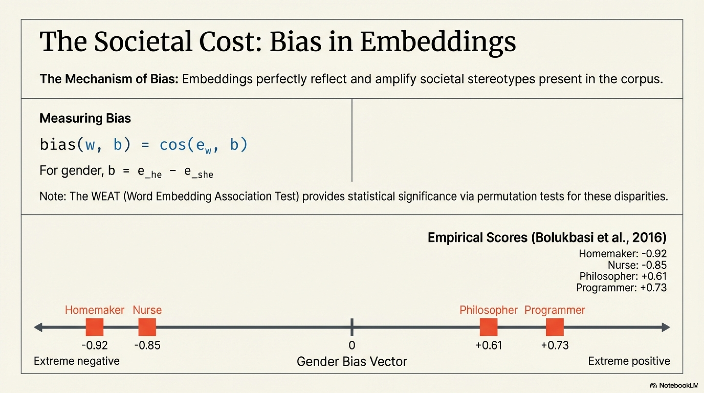

