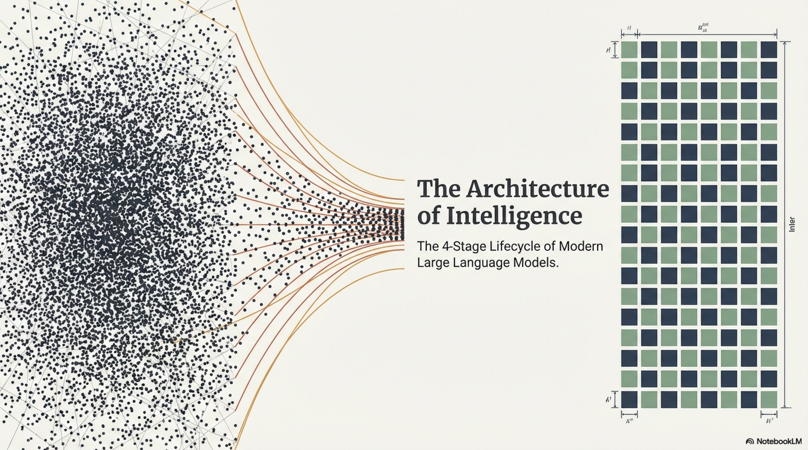

# Fine-Tuning and Alignment of Large Language Models


---

## 1. Pretraining


### 1.1 Definition

Pretraining is the process of learning a **general-purpose distributional representation** of language by optimizing a self-supervised objective over a massive, unlabeled corpus $\mathcal{D}_{\text{pretrain}}$. The model $\mathcal{M}_\theta$ parameterized by $\theta \in \mathbb{R}^d$ acquires syntactic, semantic, factual, and reasoning priors encoded implicitly within its weight manifold, **without any task-specific supervision**.

Formally, pretraining solves:

$$\theta^* = \arg\min_{\theta} \; \mathbb{E}_{x \sim \mathcal{D}_{\text{pretrain}}} \left[ \mathcal{L}_{\text{pretrain}}(\theta; x) \right]$$

where $\mathcal{L}_{\text{pretrain}}$ is a self-supervised loss function defined over sequences $x = (x_1, x_2, \dots, x_T)$.

### 1.2 Pretraining Objectives

#### 1.2.1 Autoregressive (Causal) Language Modeling

Used by GPT-family, LLaMA, PaLM, Falcon. Models the joint distribution of a sequence via the chain rule of probability:

$$p_\theta(x) = \prod_{t=1}^{T} p_\theta(x_t \mid x_{<t})$$

The loss is the **negative log-likelihood (NLL)**:

$$\mathcal{L}_{\text{AR}}(\theta) = -\sum_{t=1}^{T} \log p_\theta(x_t \mid x_1, \dots, x_{t-1})$$

The conditional distribution is parameterized via a causal Transformer with **masked self-attention** ensuring $\text{Attn}(Q, K, V)$ at position $t$ only attends to positions $\{1, \dots, t\}$:

$$\text{Attention}(Q, K, V) = \text{softmax}\left(\frac{QK^\top}{\sqrt{d_k}} + M_{\text{causal}}\right) V$$

where $M_{\text{causal}} \in \{0, -\infty\}^{T \times T}$ is the causal mask with $(M_{\text{causal}})_{ij} = -\infty$ for $j > i$.

#### 1.2.2 Masked Language Modeling (MLM)

Used by BERT, RoBERTa. A random subset $\mathcal{S} \subset \{1, \dots, T\}$ with $|\mathcal{S}| \approx 0.15T$ is masked, and the model predicts masked tokens given bidirectional context:

$$\mathcal{L}_{\text{MLM}}(\theta) = -\sum_{t \in \mathcal{S}} \log p_\theta(x_t \mid x_{\backslash \mathcal{S}})$$

This captures **bidirectional context** but breaks the generative factorization, making it unsuitable for open-ended generation without architectural modifications.

#### 1.2.3 Span Corruption (Denoising)

Used by T5, UL2. Contiguous spans of tokens are replaced with sentinel tokens $\langle s_i \rangle$, and the decoder generates the original spans sequentially:

$$\mathcal{L}_{\text{span}}(\theta) = -\sum_{i=1}^{k} \sum_{t=1}^{|s_i|} \log p_\theta(s_i^{(t)} \mid s_i^{(<t)}, x_{\text{corrupted}})$$

where $k$ is the number of corrupted spans and $s_i^{(t)}$ denotes the $t$-th token in span $i$.

#### 1.2.4 Mixture-of-Denoisers (UL2)

Unifies multiple denoising strategies under a single framework by mixing:

| Denoiser | Span Length | Corruption Rate | Paradigm |
|----------|------------|-----------------|----------|
| R-Denoiser | Short (2–5) | 15% | BERT-like |
| S-Denoiser | Sequential (prefix→suffix) | — | GPT-like |
| X-Denoiser | Long (≥12) | 50% | Extreme denoising |

A mode-switching token $\langle \text{mode} \rangle \in \{[R], [S], [X]\}$ is prepended, enabling the model to activate different computational strategies.

### 1.3 Architectural Substrate

The canonical Transformer block at layer $\ell$:

$$h^{(\ell)} = h^{(\ell-1)} + \text{MHA}\big(\text{LN}(h^{(\ell-1)})\big)$$
$$h^{(\ell)} = h^{(\ell)} + \text{FFN}\big(\text{LN}(h^{(\ell)})\big)$$

where $\text{MHA}$ denotes **Multi-Head Attention**, $\text{FFN}$ denotes **Feed-Forward Network** (typically SwiGLU in modern architectures), and $\text{LN}$ is **RMSNorm** (Pre-Norm convention).

**SwiGLU FFN:**

$$\text{FFN}(x) = \big(\text{Swish}(xW_1) \odot xW_3\big) W_2$$

where $W_1, W_3 \in \mathbb{R}^{d \times d_{\text{ff}}}$, $W_2 \in \mathbb{R}^{d_{\text{ff}} \times d}$, and $\text{Swish}(\cdot) = \cdot \, \sigma(\cdot)$.

**Rotary Positional Embeddings (RoPE):**

$$f_{\text{RoPE}}(x_m, m) = \begin{pmatrix} x_m^{(1)} \cos m\alpha_1 - x_m^{(2)} \sin m\alpha_1 \\ x_m^{(1)} \sin m\alpha_1 + x_m^{(2)} \cos m\alpha_1 \\ \vdots \end{pmatrix}$$

ensuring $\langle f(q, m), f(k, n) \rangle = g(q, k, m-n)$, encoding **relative** position through rotational invariance.

### 1.4 Scaling Laws

The compute-optimal allocation follows the **Chinchilla scaling law**:

$$L(N, D) = \frac{A}{N^\alpha} + \frac{B}{D^\beta} + L_\infty$$

where $N$ = parameters, $D$ = training tokens, $\alpha \approx 0.34$, $\beta \approx 0.28$, and $L_\infty$ is the irreducible loss. For a fixed compute budget $C \approx 6ND$:

$$N_{\text{opt}} \propto C^{a}, \quad D_{\text{opt}} \propto C^{b}, \quad a \approx 0.50, \; b \approx 0.50$$

This implies parameters and data should scale **equally** with compute.

### 1.5 Data Curation Pipeline

The pretraining data pipeline is critical and involves:

1. **Web Crawl Ingestion** → CommonCrawl, refined via URL filtering
2. **Deduplication** → MinHash + LSH for near-duplicate removal; exact substring deduplication via suffix arrays
3. **Quality Filtering** → Perplexity-based filtering using a small reference LM trained on curated data (e.g., Wikipedia); classifier-based quality scoring
4. **Toxicity / PII Removal** → Regex + classifier-based personal information and toxic content filtering
5. **Domain Mixing** → Weighted sampling across domains (web, books, code, scientific, multilingual) with domain weights $\{w_i\}$ optimized via **DoReMi** or similar online reweighting

### 1.6 Pretraining — Pseudo-Algorithm

```
━━━━━━━━━━━━━━━━━━━━━━━━━━━━━━━━━━━━━━━━━━━━━━━━━━━━━━━━━━━━━━
ALGORITHM: Autoregressive Pretraining
━━━━━━━━━━━━━━━━━━━━━━━━━━━━━━━━━━━━━━━━━━━━━━━━━━━━━━━━━━━━━━

INPUT:
  D_pretrain : Unlabeled corpus of raw text documents
  θ₀         : Randomly initialized model parameters ∈ ℝ^d
  T_max      : Maximum training steps
  B          : Micro-batch size per device
  η_schedule : Learning rate schedule (warmup + cosine decay)
  N_devices  : Number of distributed devices (GPUs/TPUs)
  Tokenizer  : Byte-Pair Encoding (BPE) / SentencePiece model
  ctx_len    : Maximum context window length

OUTPUT:
  θ*         : Pretrained model parameters (foundation model)

PROCEDURE:

  1. DATA PREPARATION:
     1.1  Apply deduplication (MinHash-LSH) over D_pretrain
     1.2  Apply quality filtering (perplexity gating via reference LM)
     1.3  Tokenize all documents using Tokenizer → token sequences
     1.4  Concatenate all token sequences with <EOS> separators
     1.5  Chunk into fixed-length segments of length ctx_len
     1.6  Shuffle segments; distribute across N_devices via 
          data-parallel sharding

  2. INITIALIZE:
     2.1  θ ← θ₀  (Xavier/He initialization, zero-init for 
          residual output projections)
     2.2  optimizer_state ← Initialize AdamW(β₁=0.9, β₂=0.95, 
          ε=1e-8, weight_decay=0.1)
     2.3  step ← 0

  3. TRAINING LOOP:
     WHILE step < T_max DO:
       3.1  Sample mini-batch {x⁽¹⁾, ..., x⁽ᴮ⁾} from data shard
            where each x⁽ⁱ⁾ = (x₁, x₂, ..., x_{ctx_len})

       3.2  FORWARD PASS (with mixed precision — BF16):
            FOR each sequence x⁽ⁱ⁾:
              Compute logits: ẑₜ = f_θ(x₁, ..., x_{t-1})  ∀t ∈ [1, ctx_len]
              Compute per-token loss:
                ℓₜ = -log softmax(ẑₜ)[x_t]
              Sequence loss:
                L⁽ⁱ⁾ = (1/ctx_len) Σₜ ℓₜ

       3.3  Aggregate batch loss:
            L_batch = (1/B) Σᵢ L⁽ⁱ⁾

       3.4  BACKWARD PASS:
            Compute ∇_θ L_batch via backpropagation through time
            (gradient checkpointing for memory efficiency)

       3.5  GRADIENT SYNCHRONIZATION:
            All-Reduce ∇_θ across N_devices (FSDP / tensor-parallel)

       3.6  GRADIENT PROCESSING:
            Apply gradient clipping: 
              IF ‖∇_θ‖₂ > max_norm THEN
                ∇_θ ← ∇_θ × (max_norm / ‖∇_θ‖₂)

       3.7  PARAMETER UPDATE:
            η_current ← η_schedule(step)
            θ ← AdamW_step(θ, ∇_θ, optimizer_state, η_current)

       3.8  LOGGING & CHECKPOINTING:
            Log: L_batch, perplexity = exp(L_batch), gradient_norm, 
                 learning_rate, tokens_processed
            IF step mod checkpoint_interval == 0:
              Save (θ, optimizer_state, step) to persistent storage

       3.9  step ← step + 1

  4. RETURN θ* ← θ

━━━━━━━━━━━━━━━━━━━━━━━━━━━━━━━━━━━━━━━━━━━━━━━━━━━━━━━━━━━━━━
```

### 1.7 What Pretraining Achieves and What It Does Not

| Achieved | Not Achieved |
|----------|-------------|
| Distributional knowledge of language | Instruction following |
| World knowledge (factual, commonsense) | Alignment with human preferences |
| In-context learning capability | Safety, harmlessness guarantees |
| Code and mathematical reasoning priors | Controlled generation behavior |
| Multilingual transfer | Refusal of harmful queries |

This gap motivates the subsequent stages: **fine-tuning**, **instruction tuning**, and **alignment**.

---

## 2. Fine-Tuning for Tasks

### 2.1 Definition

**Supervised Fine-Tuning (SFT)** adapts a pretrained model $\mathcal{M}_{\theta^*}$ to a specific downstream task by optimizing on a labeled dataset $\mathcal{D}_{\text{task}} = \{(x^{(i)}, y^{(i)})\}_{i=1}^{N}$ where $x^{(i)}$ is the input and $y^{(i)}$ is the target output:

$$\theta_{\text{ft}} = \arg\min_{\theta} \; \mathbb{E}_{(x,y) \sim \mathcal{D}_{\text{task}}} \left[ \mathcal{L}_{\text{task}}(\theta; x, y) \right], \quad \theta \;\text{initialized at}\; \theta^*$$

### 2.2 Task-Specific Loss Formulations

**Classification (e.g., sentiment, NLI):**

$$\mathcal{L}_{\text{cls}} = -\sum_{c=1}^{C} y_c \log \sigma(W_c^\top h_{[\text{CLS}]} + b_c)$$

where $h_{[\text{CLS}]}$ is the pooled representation and $C$ is the number of classes.

**Sequence-to-Sequence Generation (e.g., summarization, translation):**

$$\mathcal{L}_{\text{seq2seq}} = -\sum_{t=1}^{|y|} \log p_\theta(y_t \mid y_{<t}, x)$$

**Extractive QA (e.g., SQuAD):**

$$\mathcal{L}_{\text{QA}} = -\log p_\theta(a_{\text{start}} \mid x) - \log p_\theta(a_{\text{end}} \mid x)$$

where $a_{\text{start}}, a_{\text{end}}$ are the start and end token positions of the answer span.

### 2.3 The Catastrophic Forgetting Problem

Full fine-tuning modifies all $d$ parameters, causing:

$$\Delta\theta = \theta_{\text{ft}} - \theta^* \quad \Rightarrow \quad \text{drift in } p_\theta(\cdot) \text{ on } \mathcal{D}_{\text{pretrain}}$$

**Fisher Information perspective:** Parameters important for the pretrained distribution (high Fisher information $F_i$) should change minimally. Elastic Weight Consolidation (EWC) addresses this:

$$\mathcal{L}_{\text{EWC}} = \mathcal{L}_{\text{task}}(\theta) + \frac{\lambda}{2} \sum_{i} F_i (\theta_i - \theta_i^*)^2$$

where $F_i = \mathbb{E}\left[\left(\frac{\partial \log p_{\theta^*}(x)}{\partial \theta_i}\right)^2\right]$ is the diagonal Fisher information for parameter $i$.

### 2.4 Parameter-Efficient Fine-Tuning (PEFT)

PEFT methods freeze the pretrained weights $\theta^*$ and introduce a small number of trainable parameters $\phi \in \mathbb{R}^{d'}$ with $d' \ll d$.

#### 2.4.1 LoRA (Low-Rank Adaptation)

**Core Insight:** The weight update matrix $\Delta W$ during fine-tuning lies in a **low-rank subspace**.

For a pretrained weight matrix $W_0 \in \mathbb{R}^{d_{\text{out}} \times d_{\text{in}}}$, LoRA decomposes:

$$W = W_0 + \Delta W = W_0 + BA$$

where $B \in \mathbb{R}^{d_{\text{out}} \times r}$, $A \in \mathbb{R}^{r \times d_{\text{in}}}$, and $r \ll \min(d_{\text{in}}, d_{\text{out}})$.

**Initialization:** $A \sim \mathcal{N}(0, \sigma^2)$, $B = 0$ (ensuring $\Delta W = 0$ at initialization).

**Scaling factor:**

$$h = W_0 x + \frac{\alpha}{r} BAx$$

where $\alpha$ is a hyperparameter controlling the magnitude of the adaptation.

**Trainable parameters:** $|\phi| = 2 \cdot r \cdot d$ per adapted matrix. For rank $r = 16$ on a $4096 \times 4096$ matrix: $|\phi| = 131,072$ vs. $|W_0| = 16,777,216$ — a **128× reduction**.

#### 2.4.2 QLoRA (Quantized LoRA)

Combines LoRA with **4-bit NormalFloat (NF4) quantization** of frozen weights:

1. Quantize $W_0$ to 4-bit NF4 format: $\hat{W}_0 = \text{Quant}_{\text{NF4}}(W_0)$
2. Apply double quantization on quantization constants
3. Use paged optimizers for memory spike management
4. Forward: $h = \text{Dequant}(\hat{W}_0)x + BAx$

Enables fine-tuning of a 65B-parameter model on a single 48GB GPU.

#### 2.4.3 Adapter Layers

Insert small bottleneck modules within each Transformer block:

$$\text{Adapter}(h) = h + f\big(hW_{\text{down}}\big)W_{\text{up}}$$

where $W_{\text{down}} \in \mathbb{R}^{d \times r}$, $W_{\text{up}} \in \mathbb{R}^{r \times d}$, and $f$ is a nonlinearity (ReLU/GELU).

#### 2.4.4 Prefix Tuning

Prepend $L_p$ learnable continuous vectors (virtual tokens) to the key and value matrices at every attention layer:

$$K' = [\underbrace{P_K^{(1)}, \dots, P_K^{(L_p)}}_{\text{prefix}}, K], \quad V' = [\underbrace{P_V^{(1)}, \dots, P_V^{(L_p)}}_{\text{prefix}}, V]$$

Only the prefix parameters $P_K, P_V \in \mathbb{R}^{L_p \times d}$ per layer are optimized.

#### 2.4.5 Comparison Table

| Method | Trainable Params | Memory | Inference Overhead | Composability |
|--------|-----------------|--------|--------------------|---------------|
| Full FT | 100% | Very High | None | Low |
| LoRA | ~0.1–1% | Low | None (merged) | High (swappable) |
| QLoRA | ~0.1–1% | Very Low | Dequant cost | High |
| Adapters | ~1–5% | Moderate | Forward latency | Moderate |
| Prefix Tuning | ~0.01–0.1% | Low | Context window cost | High |

### 2.5 Fine-Tuning — Pseudo-Algorithm

```
━━━━━━━━━━━━━━━━━━━━━━━━━━━━━━━━━━━━━━━━━━━━━━━━━━━━━━━━━━━━━━
ALGORITHM: Supervised Fine-Tuning with LoRA
━━━━━━━━━━━━━━━━━━━━━━━━━━━━━━━━━━━━━━━━━━━━━━━━━━━━━━━━━━━━━━

INPUT:
  θ*            : Pretrained model parameters (frozen)
  D_task        : Labeled dataset {(x⁽ⁱ⁾, y⁽ⁱ⁾)}_{i=1}^{N}
  r             : LoRA rank
  α             : LoRA scaling factor
  target_modules: Set of weight matrices to adapt 
                  (e.g., {W_Q, W_V} per layer)
  T_ft          : Maximum fine-tuning steps
  η             : Learning rate (typically 1e-4 to 3e-4)

OUTPUT:
  φ*            : Optimized LoRA parameters
  Merged model  : θ_ft = θ* + merged LoRA deltas

PROCEDURE:

  1. INITIALIZATION:
     FOR each W₀ ∈ target_modules:
       1.1  Initialize A ~ N(0, σ²),  A ∈ ℝ^{r × d_in}
       1.2  Initialize B ← 0,         B ∈ ℝ^{d_out × r}
       1.3  Freeze W₀ (no gradient computation)
     φ ← {all A, B matrices}
     optimizer ← AdamW(φ, lr=η, weight_decay=0.0)

  2. DATA FORMATTING:
     FOR each (x, y) ∈ D_task:
       2.1  Construct prompt-completion sequence:
            s = [PROMPT_TEMPLATE(x)] ⊕ [y] ⊕ [<EOS>]
       2.2  Create loss mask m:
            m_t = 0 for prompt tokens, m_t = 1 for completion tokens

  3. TRAINING LOOP:
     FOR step = 1 TO T_ft:
       3.1  Sample mini-batch {(s⁽ʲ⁾, m⁽ʲ⁾)}_{j=1}^{B}

       3.2  FORWARD PASS:
            FOR each layer with adapted weight W₀:
              h = (W₀ + (α/r)·B·A) · input
            Compute logits and per-token NLL:
              ℓ_t = -log p_θ(s_t | s_{<t})
            Apply loss mask:
              L = Σ_t (m_t · ℓ_t) / Σ_t m_t

       3.3  BACKWARD PASS:
            Compute ∇_φ L  (gradients only for φ, not θ*)

       3.4  UPDATE:
            φ ← AdamW_step(φ, ∇_φ L, optimizer)

  4. MERGE (for deployment):
     FOR each adapted weight:
       W_merged = W₀ + (α/r) · B · A
     θ_ft ← θ* with W_merged replacements

  5. RETURN φ*, θ_ft

━━━━━━━━━━━━━━━━━━━━━━━━━━━━━━━━━━━━━━━━━━━━━━━━━━━━━━━━━━━━━━
```

---

## 3. Instruction Tuning

### 3.1 Definition

**Instruction tuning** is a specialized form of supervised fine-tuning where the training data consists of **(instruction, input, output)** triplets drawn from diverse tasks, formatted in natural language. The goal is to endow the model with the meta-capability of **following arbitrary instructions at inference time**, including tasks unseen during tuning.

Formally, the training distribution is:

$$\mathcal{D}_{\text{instruct}} = \bigcup_{k=1}^{K} \left\{ \big(\text{instr}_k^{(i)}, x_k^{(i)}, y_k^{(i)}\big) \right\}_{i=1}^{N_k}$$

spanning $K$ diverse task families (summarization, translation, QA, code generation, mathematical reasoning, creative writing, etc.).

### 3.2 Distinction from Standard SFT

| Dimension | Standard SFT | Instruction Tuning |
|-----------|-------------|-------------------|
| Task scope | Single task or narrow task family | Hundreds to thousands of tasks |
| Generalization target | In-distribution test set | **Zero-shot** performance on unseen tasks |
| Input format | Task-specific encoding | Unified natural language template |
| Key property learned | Task-specific mapping | Meta-capability of instruction following |
| Loss computation | All tokens or output tokens | **Completion-only** (masked prompt) |

### 3.3 Data Construction Strategies

#### 3.3.1 Human-Curated Collections

- **FLAN Collection:** 1,800+ tasks with 10+ templates per task, including chain-of-thought exemplars
- **Super-NaturalInstructions:** 1,600+ tasks with expert-written definitions, positive/negative examples, and explanations
- **Open Assistant / Dolly:** Human-authored multi-turn dialogues

#### 3.3.2 Synthetic / Distillation-Based

- **Self-Instruct (Wang et al., 2023):** Bootstrap instruction data from the model itself:
  1. Seed with 175 human-written tasks
  2. Generate new instructions via in-context learning
  3. Classify as classification vs. generation
  4. Generate instances (input-output pairs)
  5. Filter low-quality via heuristics (ROUGE, length, diversity)

- **Alpaca / Vicuna:** Distill from stronger models (GPT-4) by prompting for instruction-response pairs

- **Evol-Instruct (WizardLM):** Iteratively evolve instructions through depth/breadth mutation operators:

$$\text{instr}_{t+1} = \text{Evolve}(\text{instr}_t, \text{mutation\_type})$$

Mutation types: add constraints, increase reasoning steps, concretize, deepen, broaden.

#### 3.3.3 Quality Dimensions for Instruction Data

$$\text{Quality}(\mathcal{D}_{\text{instruct}}) = f\big(\underbrace{\text{Diversity}}_{\text{task coverage}},\; \underbrace{\text{Complexity}}_{\text{reasoning depth}},\; \underbrace{\text{Correctness}}_{\text{factual accuracy}},\; \underbrace{\text{Format Consistency}}_{\text{template adherence}}\big)$$

**LIMA Insight (Zhou et al., 2023):** Only ~1,000 carefully curated high-quality examples can suffice for strong instruction-following — data quality dominates data quantity.

### 3.4 Formatting and Template Design

**Canonical Structure:**

```
<|system|> You are a helpful assistant. <|end|>
<|user|> {instruction} \n {input} <|end|>
<|assistant|> {output} <|end|>
```

**Loss Masking:** Only compute loss on assistant tokens:

$$\mathcal{L}_{\text{instruct}} = -\sum_{t \in \mathcal{T}_{\text{response}}} \log p_\theta(y_t \mid y_{<t}, x_{\text{prompt}})$$

where $\mathcal{T}_{\text{response}}$ indexes tokens within the response region only. This prevents the model from memorizing prompt templates while focusing learning on response generation.

### 3.5 Multi-Task Mixing and Sampling

Given $K$ task families with datasets of varying sizes $\{N_1, \dots, N_K\}$, naive proportional sampling over-represents large datasets. **Temperature-based mixing** addresses this:

$$p(\text{sample from task } k) = \frac{N_k^{1/\tau}}{\sum_{j=1}^{K} N_j^{1/\tau}}$$

- $\tau = 1$: proportional (large tasks dominate)
- $\tau \to \infty$: uniform (equal weight regardless of size)
- **Optimal:** $\tau \in [2, 5]$ (empirically, FLAN uses similar strategies)

Additionally, **examples-proportional mixing with cap** $M$:

$$\hat{N}_k = \min(N_k, M)$$

prevents any single task from consuming more than $M$ examples per epoch.

### 3.6 Chain-of-Thought Integration

Instruction tuning is significantly enhanced by including **Chain-of-Thought (CoT)** exemplars that elicit step-by-step reasoning:

$$y = [\underbrace{r_1, r_2, \dots, r_m}_{\text{reasoning chain}}, \underbrace{a}_{\text{final answer}}]$$

**FLAN-T5/PaLM 2** includes both direct-answer and CoT variants for reasoning-heavy tasks, with a mixing ratio of approximately 50:50.

The model learns to **generate intermediate reasoning** as a latent variable that mediates between input and answer:

$$p_\theta(a \mid x) = \sum_{r} p_\theta(r \mid x) \cdot p_\theta(a \mid r, x) \approx p_\theta(r^*, a \mid x)$$

where $r^*$ is the single sampled reasoning chain (greedy approximation to marginalization).

### 3.7 Instruction Tuning — Pseudo-Algorithm

```
━━━━━━━━━━━━━━━━━━━━━━━━━━━━━━━━━━━━━━━━━━━━━━━━━━━━━━━━━━━━━━
ALGORITHM: Multi-Task Instruction Tuning
━━━━━━━━━━━━━━━━━━━━━━━━━━━━━━━━━━━━━━━━━━━━━━━━━━━━━━━━━━━━━━

INPUT:
  θ*                : Pretrained model parameters
  {D_k}_{k=1}^{K}   : K task-specific instruction datasets
                      each D_k = {(instr_k, x_k, y_k)_i}
  τ                 : Mixing temperature
  T_instruct        : Maximum training steps
  template_set      : Set of diverse prompt templates per task
  cot_ratio         : Fraction of examples augmented with 
                      chain-of-thought reasoning

OUTPUT:
  θ_instruct        : Instruction-tuned model parameters

PROCEDURE:

  1. DATA PREPARATION:
     FOR each task k = 1 TO K:
       1.1  FOR each example (instr, x, y) ∈ D_k:
              Randomly select template T_j from template_set[k]
              WITH probability cot_ratio:
                y ← prepend reasoning chain to y 
                    (from CoT annotations if available, 
                     or generate via few-shot prompting)
              Format: s = T_j(instr, x) ⊕ y ⊕ <EOS>
              Create loss mask: m_t = 1 iff t ∈ response region

     1.2  Compute sampling weights:
            w_k = N_k^{1/τ} / Σ_j N_j^{1/τ}

     1.3  Construct unified dataset D_instruct via weighted 
          interleaving of {D_1, ..., D_K} with weights {w_k}

  2. INITIALIZE:
     θ ← θ*
     optimizer ← AdamW(θ, lr=η, cosine schedule with warmup)

  3. TRAINING LOOP:
     FOR step = 1 TO T_instruct:
       3.1  Sample mini-batch from D_instruct 
            (respecting mixing weights)

       3.2  FORWARD PASS:
            FOR each sequence (s, m) in batch:
              Compute logits z_t = f_θ(s_{<t})  ∀t
              Per-token loss: ℓ_t = -log softmax(z_t)[s_t]
              Masked loss: L = Σ_t (m_t · ℓ_t) / Σ_t m_t

       3.3  BACKWARD + UPDATE:
            ∇_θ L → gradient clip → AdamW update

       3.4  PERIODIC EVALUATION:
            Every E steps, evaluate on held-out tasks 
            (zero-shot and few-shot) NOT in {D_1,...,D_K}
            to measure cross-task generalization

  4. RETURN θ_instruct

━━━━━━━━━━━━━━━━━━━━━━━━━━━━━━━━━━━━━━━━━━━━━━━━━━━━━━━━━━━━━━
```

### 3.8 Emergent Properties Post-Instruction Tuning

1. **Zero-shot task transfer**: Follow instructions for tasks never seen during tuning
2. **Format control**: Produce JSON, markdown, bullet points on demand
3. **Refusal precursors**: Rudimentary ability to decline (but unreliable without alignment)
4. **Improved few-shot performance**: Instruction-tuned models utilize in-context examples more effectively
5. **Chain-of-thought elicitation**: Respond to "think step by step" reliably

---

## 4. Alignment Methods

### 4.1 Definition

**Alignment** is the process of steering model behavior to conform to human preferences, values, and intent — beyond what supervised demonstrations alone can achieve. The core problem:

$$\text{The SFT objective } \mathcal{L}_{\text{NLL}} \text{ optimizes } \textit{likelihood of demonstrations}, \text{ not } \textit{quality of generations}.$$

Alignment methods introduce **preference-based optimization**, training the model to distinguish between better and worse outputs and to preferentially generate higher-quality, safer, more helpful responses.

### 4.2 The Alignment Taxonomy

```
Alignment Methods
├── RLHF (Reinforcement Learning from Human Feedback)
│   ├── Reward Model Training
│   └── Policy Optimization (PPO, REINFORCE)
├── Direct Preference Optimization (DPO)
├── Identity Preference Optimization (IPO)
├── Kahneman-Tversky Optimization (KTO)
├── ORPO (Odds Ratio Preference Optimization)
├── Rejection Sampling / Best-of-N
├── Constitutional AI (RLAIF)
└── Iterative / Online Methods (SPIN, Self-Play)
```

### 4.3 Human Preference Data Collection

The preference dataset takes the form:

$$\mathcal{D}_{\text{pref}} = \left\{ \big(x^{(i)}, y_w^{(i)}, y_l^{(i)}\big) \right\}_{i=1}^{M}$$

where for prompt $x$, response $y_w$ is **preferred (chosen)** over $y_l$ **(rejected)** by human annotators: $y_w \succ y_l \mid x$.

**Bradley-Terry Model** of pairwise preferences:

$$p(y_w \succ y_l \mid x) = \sigma\big(r^*(x, y_w) - r^*(x, y_l)\big)$$

where $r^*(x, y)$ is the latent **reward function** reflecting true human preferences and $\sigma(\cdot)$ is the sigmoid function.

**Annotation Guidelines** typically evaluate along axes:
- **Helpfulness** — task completion quality, informativeness
- **Harmlessness** — avoidance of toxic, biased, dangerous content
- **Honesty** — calibrated uncertainty, refusal when appropriate
- **Coherence** — logical flow, consistency

### 4.4 RLHF (Reinforcement Learning from Human Feedback)

The canonical three-phase RLHF pipeline (Ouyang et al., 2022 / InstructGPT):

#### Phase 1: Supervised Fine-Tuning (SFT)

Already covered in Sections 2 and 3. Produces $\pi_{\text{SFT}}$.

#### Phase 2: Reward Model Training

Train a reward model $r_\psi(x, y) : \mathcal{X} \times \mathcal{Y} \to \mathbb{R}$ (typically initialized from the SFT model with a scalar head replacing the LM head) via the **Bradley-Terry loss**:

$$\mathcal{L}_{\text{RM}}(\psi) = -\mathbb{E}_{(x, y_w, y_l) \sim \mathcal{D}_{\text{pref}}} \left[ \log \sigma\big(r_\psi(x, y_w) - r_\psi(x, y_l)\big) \right]$$

**Architecture:** The reward model takes the concatenation $[x; y]$, passes it through the Transformer, and extracts the scalar reward from the final token's hidden state:

$$r_\psi(x, y) = W_r^\top h_{[\text{last}]} + b_r, \quad W_r \in \mathbb{R}^{d}, \; b_r \in \mathbb{R}$$

**Reward Model Diagnostics:**
- Accuracy on held-out preference pairs
- Calibration: $p(\text{correct}) \approx \sigma(|r(y_w) - r(y_l)|)$
- Overoptimization detection: track reward model score vs. actual human preference as policy optimization progresses

#### Phase 3: Policy Optimization via PPO

The LLM is treated as a **policy** $\pi_\theta(y \mid x)$ in an RL framework:

- **State:** Prompt $x$ and tokens generated so far
- **Action:** Next token $y_t$
- **Reward:** $r_\psi(x, y)$ assigned at the terminal token; shaped with a KL penalty

**Objective:**

$$\max_\theta \; \mathbb{E}_{x \sim \mathcal{D}, \; y \sim \pi_\theta(\cdot|x)} \left[ r_\psi(x, y) \right] - \beta \cdot D_{\text{KL}}\left[ \pi_\theta(\cdot \mid x) \;\|\; \pi_{\text{ref}}(\cdot \mid x) \right]$$

where $\pi_{\text{ref}} = \pi_{\text{SFT}}$ (frozen reference policy) and $\beta > 0$ controls the strength of the KL constraint preventing **reward hacking** (policy exploiting reward model imperfections).

The KL divergence per sequence:

$$D_{\text{KL}}[\pi_\theta \| \pi_{\text{ref}}](x) = \sum_{t=1}^{|y|} \left[ \log \pi_\theta(y_t \mid y_{<t}, x) - \log \pi_{\text{ref}}(y_t \mid y_{<t}, x) \right]$$

**PPO Clipped Surrogate Objective (per-token level):**

$$\mathcal{L}_{\text{PPO}}(\theta) = -\mathbb{E}_t \left[ \min\left( \rho_t(\theta) \hat{A}_t, \; \text{clip}\big(\rho_t(\theta), 1-\epsilon, 1+\epsilon\big) \hat{A}_t \right) \right]$$

where:

$$\rho_t(\theta) = \frac{\pi_\theta(y_t \mid y_{<t}, x)}{\pi_{\theta_{\text{old}}}(y_t \mid y_{<t}, x)}$$

is the importance sampling ratio and $\hat{A}_t$ is the **Generalized Advantage Estimate (GAE)**:

$$\hat{A}_t = \sum_{l=0}^{T-t} (\gamma \lambda)^l \delta_{t+l}, \quad \delta_t = r_t + \gamma V(s_{t+1}) - V(s_t)$$

In the LLM setting, per-token rewards are typically $r_t = 0$ for $t < T$ and $r_T = r_\psi(x, y) - \beta \cdot \text{KL}_t$ at the final token, though per-token KL penalties can be distributed.

**Models in memory during PPO:**

| Model | Role | Trainable? |
|-------|------|-----------|
| $\pi_\theta$ (Actor) | Current policy | Yes |
| $V_\phi$ (Critic) | Value function | Yes |
| $\pi_{\text{ref}}$ | Reference for KL | No (frozen) |
| $r_\psi$ | Reward scoring | No (frozen) |

This requires **4 models in memory simultaneously** — a significant engineering challenge.

### 4.5 RLHF-PPO — Pseudo-Algorithm

```
━━━━━━━━━━━━━━━━━━━━━━━━━━━━━━━━━━━━━━━━━━━━━━━━━━━━━━━━━━━━━━
ALGORITHM: RLHF with Proximal Policy Optimization (PPO)
━━━━━━━━━━━━━━━━━━━━━━━━━━━━━━━━━━━━━━━━━━━━━━━━━━━━━━━━━━━━━━

INPUT:
  π_SFT       : Supervised fine-tuned policy (weights θ_SFT)
  D_pref      : Preference dataset {(x, y_w, y_l)}
  D_prompts   : Prompt distribution for RL rollouts
  β           : KL penalty coefficient
  ε           : PPO clip range (typically 0.2)
  γ, λ        : GAE discount and trace-decay parameters
  T_RM        : Reward model training steps
  T_PPO       : PPO optimization steps
  K_epochs    : PPO mini-epochs per rollout batch

OUTPUT:
  θ_aligned   : Aligned policy parameters

PROCEDURE:

  ──── PHASE 2: REWARD MODEL TRAINING ────

  1. INITIALIZE:
     ψ ← θ_SFT (clone SFT weights)
     Replace LM head with scalar reward head: W_r, b_r
     optimizer_RM ← Adam(ψ, lr=1e-5)

  2. FOR step = 1 TO T_RM:
     2.1  Sample batch {(x, y_w, y_l)} from D_pref
     2.2  Compute: r_w = r_ψ(x, y_w),  r_l = r_ψ(x, y_l)
     2.3  Loss: L_RM = -mean[ log σ(r_w - r_l) ]
     2.4  Backpropagate, update ψ
     2.5  Monitor accuracy on held-out preference pairs

  3. Freeze r_ψ

  ──── PHASE 3: PPO POLICY OPTIMIZATION ────

  4. INITIALIZE:
     θ ← θ_SFT           (actor / policy)
     φ ← θ_SFT           (critic / value head, with scalar output)
     π_ref ← θ_SFT       (frozen reference)
     optimizer_actor  ← Adam(θ, lr=1e-6)
     optimizer_critic ← Adam(φ, lr=1e-6)

  5. FOR step = 1 TO T_PPO:

     ── ROLLOUT PHASE ──
     5.1  Sample batch of prompts {x⁽ʲ⁾}_{j=1}^{B} from D_prompts
     5.2  FOR each prompt x⁽ʲ⁾:
            Generate response y⁽ʲ⁾ ~ π_θ(·|x⁽ʲ⁾) 
              (autoregressive sampling with temperature/top-p)
            Store per-token log-probs:
              log π_θ_old(y_t | y_{<t}, x) for all t
            Compute reference log-probs:
              log π_ref(y_t | y_{<t}, x) for all t
            Compute per-token KL:
              kl_t = log π_θ_old(y_t|...) - log π_ref(y_t|...)
            Compute reward model score:
              R = r_ψ(x⁽ʲ⁾, y⁽ʲ⁾)
            Construct per-token reward signal:
              r_t = -β · kl_t              for t < T
              r_T = R - β · kl_T           for final token
            Compute value estimates:
              V_t = V_φ(x, y_{≤t}) for all t
            Compute GAE advantages:
              δ_t = r_t + γ·V_{t+1} - V_t
              Â_t = Σ_{l=0}^{T-t} (γλ)^l · δ_{t+l}
            Compute returns:
              G_t = Â_t + V_t

     ── OPTIMIZATION PHASE ──
     5.3  FOR epoch = 1 TO K_epochs:
            Shuffle rollout data into mini-batches
            FOR each mini-batch:
              Recompute log π_θ(y_t | y_{<t}, x)
              Importance ratio: ρ_t = exp(log π_θ - log π_θ_old)
              
              Clipped surrogate loss:
                L_actor = -mean[ min(ρ_t · Â_t, 
                          clip(ρ_t, 1-ε, 1+ε) · Â_t) ]
              
              Value loss:
                L_critic = mean[ (V_φ(x, y_{≤t}) - G_t)² ]
              
              Entropy bonus (optional):
                H = mean[ entropy(π_θ(·|y_{<t}, x)) ]
              
              Total: L = L_actor + c₁·L_critic - c₂·H
              
              Backpropagate, update θ and φ

     5.4  MONITORING:
            Track: mean reward, mean KL, mean response length,
                   reward model score distribution,
                   clip fraction, value loss, entropy
            IF mean KL > KL_target: increase β
            IF mean KL < KL_target: decrease β
              (adaptive KL controller)

  6. RETURN θ_aligned ← θ

━━━━━━━━━━━━━━━━━━━━━━━━━━━━━━━━━━━━━━━━━━━━━━━━━━━━━━━━━━━━━━
```

### 4.6 Direct Preference Optimization (DPO)

#### 4.6.1 Motivation

RLHF-PPO requires training and serving **four models simultaneously** and involves complex, unstable RL optimization. DPO (Rafailov et al., 2023) eliminates the reward model and RL loop entirely.

#### 4.6.2 Derivation

Starting from the RLHF objective:

$$\max_\pi \; \mathbb{E}_{x, y \sim \pi} [r(x, y)] - \beta \, D_{\text{KL}}[\pi \| \pi_{\text{ref}}]$$

The **optimal policy** in closed form is:

$$\pi^*(y \mid x) = \frac{1}{Z(x)} \pi_{\text{ref}}(y \mid x) \exp\left(\frac{1}{\beta} r(x, y)\right)$$

where $Z(x) = \sum_y \pi_{\text{ref}}(y \mid x) \exp\left(\frac{r(x,y)}{\beta}\right)$ is the partition function.

**Key algebraic rearrangement** — solving for $r$ in terms of $\pi$:

$$r(x, y) = \beta \log \frac{\pi^*(y \mid x)}{\pi_{\text{ref}}(y \mid x)} + \beta \log Z(x)$$

Substituting into the Bradley-Terry preference model and noting that $Z(x)$ cancels between $y_w$ and $y_l$:

$$p(y_w \succ y_l \mid x) = \sigma\left(\beta \log \frac{\pi^*(y_w \mid x)}{\pi_{\text{ref}}(y_w \mid x)} - \beta \log \frac{\pi^*(y_l \mid x)}{\pi_{\text{ref}}(y_l \mid x)}\right)$$

#### 4.6.3 DPO Loss

$$\mathcal{L}_{\text{DPO}}(\theta) = -\mathbb{E}_{(x, y_w, y_l) \sim \mathcal{D}_{\text{pref}}} \left[ \log \sigma\left( \beta \log \frac{\pi_\theta(y_w \mid x)}{\pi_{\text{ref}}(y_w \mid x)} - \beta \log \frac{\pi_\theta(y_l \mid x)}{\pi_{\text{ref}}(y_l \mid x)} \right) \right]$$

Define the **implicit reward** margin:

$$\hat{r}_\theta(x, y) = \beta \log \frac{\pi_\theta(y \mid x)}{\pi_{\text{ref}}(y \mid x)}$$

Then:

$$\mathcal{L}_{\text{DPO}}(\theta) = -\mathbb{E}\left[ \log \sigma\big(\hat{r}_\theta(x, y_w) - \hat{r}_\theta(x, y_l)\big) \right]$$

#### 4.6.4 Gradient Analysis

$$\nabla_\theta \mathcal{L}_{\text{DPO}} = -\beta \, \mathbb{E} \left[ \underbrace{\sigma\big(\hat{r}_\theta(y_l) - \hat{r}_\theta(y_w)\big)}_{\text{higher weight when model is wrong}} \left[ \underbrace{\nabla_\theta \log \pi_\theta(y_w \mid x)}_{\text{increase chosen prob}} - \underbrace{\nabla_\theta \log \pi_\theta(y_l \mid x)}_{\text{decrease rejected prob}} \right] \right]$$

The sigmoid weighting term $\sigma(\hat{r}_\theta(y_l) - \hat{r}_\theta(y_w))$ is large when the model **incorrectly** ranks the rejected response higher — providing natural hard-example mining.

### 4.7 DPO — Pseudo-Algorithm

```
━━━━━━━━━━━━━━━━━━━━━━━━━━━━━━━━━━━━━━━━━━━━━━━━━━━━━━━━━━━━━━
ALGORITHM: Direct Preference Optimization (DPO)
━━━━━━━━━━━━━━━━━━━━━━━━━━━━━━━━━━━━━━━━━━━━━━━━━━━━━━━━━━━━━━

INPUT:
  θ_SFT       : SFT/instruction-tuned model parameters
  D_pref      : Preference dataset {(x, y_w, y_l)}_{i=1}^{M}
  β           : Temperature parameter (typically 0.1–0.5)
  T_DPO       : Training steps
  η           : Learning rate

OUTPUT:
  θ_aligned   : DPO-aligned policy parameters

PROCEDURE:

  1. INITIALIZE:
     θ ← θ_SFT
     π_ref ← θ_SFT  (frozen copy, no gradients)
     optimizer ← AdamW(θ, lr=η)

  2. PRECOMPUTE (optional, for efficiency):
     FOR each (x, y_w, y_l) ∈ D_pref:
       Compute and cache:
         log π_ref(y_w | x) = Σ_t log π_ref(y_w,t | y_w,<t, x)
         log π_ref(y_l | x) = Σ_t log π_ref(y_l,t | y_l,<t, x)

  3. TRAINING LOOP:
     FOR step = 1 TO T_DPO:
       3.1  Sample mini-batch {(x, y_w, y_l)}_{j=1}^{B}

       3.2  FORWARD PASS:
            FOR each (x, y_w, y_l):
              Compute log π_θ(y_w | x):
                = Σ_t log p_θ(y_w,t | y_w,<t, x)
              Compute log π_θ(y_l | x):
                = Σ_t log p_θ(y_l,t | y_l,<t, x)

              Retrieve log π_ref(y_w | x), log π_ref(y_l | x)

              Implicit reward margin:
                Δ = β · [(log π_θ(y_w|x) - log π_ref(y_w|x))
                        -(log π_θ(y_l|x) - log π_ref(y_l|x))]

              Per-example loss:
                ℓ = -log σ(Δ)

       3.3  Batch loss: L = (1/B) Σ_j ℓ_j

       3.4  BACKWARD + UPDATE:
            ∇_θ L → gradient clip → AdamW update on θ only
            (π_ref remains frozen)

       3.5  MONITORING:
            Track: mean loss, mean margin Δ, 
                   accuracy = fraction where Δ > 0,
                   implicit reward gap,
                   mean |log π_θ - log π_ref| (KL proxy)

  4. RETURN θ_aligned ← θ

━━━━━━━━━━━━━━━━━━━━━━━━━━━━━━━━━━━━━━━━━━━━━━━━━━━━━━━━━━━━━━
```

### 4.8 Advanced Alignment Variants

#### 4.8.1 IPO (Identity Preference Optimization)

DPO can overfit when the Bradley-Terry assumption is violated. IPO uses a **squared loss** on the preference margin:

$$\mathcal{L}_{\text{IPO}}(\theta) = \mathbb{E}\left[\left(\hat{r}_\theta(x, y_w) - \hat{r}_\theta(x, y_l) - \frac{1}{2\beta}\right)^2\right]$$

This targets a fixed margin of $\frac{1}{2\beta}$ rather than pushing the margin to infinity, providing implicit regularization.

#### 4.8.2 KTO (Kahneman-Tversky Optimization)

Eliminates the need for **paired** preferences — works with **pointwise** feedback (thumbs up / thumbs down):

$$\mathcal{D}_{\text{KTO}} = \left\{(x^{(i)}, y^{(i)}, \underbrace{b^{(i)}}_{\in \{0, 1\}})\right\}$$

**Loss function** inspired by prospect theory's asymmetric value function:

$$\mathcal{L}_{\text{KTO}}(\theta) = \mathbb{E}_{(x,y,b)} \left[ w(b) \cdot \big(1 - v_\theta(x, y, b)\big) \right]$$

where:

$$v_\theta(x, y, b) = \begin{cases} \sigma\big(\beta(\hat{r}_\theta(x, y) - z_{\text{ref}})\big) & \text{if } b = 1 \text{ (desirable)} \\ \sigma\big(\beta(z_{\text{ref}} - \hat{r}_\theta(x, y))\big) & \text{if } b = 0 \text{ (undesirable)} \end{cases}$$

$z_{\text{ref}} = \mathbb{E}_{x', y' \sim \mathcal{D}}[\hat{r}_\theta(x', y')]$ is a running baseline, and $w(b)$ applies loss aversion weighting ($\lambda_{\text{loss}} > \lambda_{\text{gain}}$, reflecting human loss aversion).

#### 4.8.3 ORPO (Odds Ratio Preference Optimization)

Combines SFT and alignment into a **single-stage** objective without requiring a reference model:

$$\mathcal{L}_{\text{ORPO}} = \underbrace{\mathcal{L}_{\text{SFT}}(y_w)}_{\text{supervised signal}} + \lambda \cdot \underbrace{\mathcal{L}_{\text{OR}}(y_w, y_l)}_{\text{preference signal}}$$

where:

$$\mathcal{L}_{\text{OR}} = -\log \sigma\left(\log \frac{\text{odds}_\theta(y_w \mid x)}{\text{odds}_\theta(y_l \mid x)}\right)$$

$$\text{odds}_\theta(y \mid x) = \frac{p_\theta(y \mid x)}{1 - p_\theta(y \mid x)}$$

with sequence-level probability $p_\theta(y \mid x) = \exp\left(\frac{1}{|y|}\sum_t \log p_\theta(y_t \mid y_{<t}, x)\right)$ (length-normalized geometric mean).

#### 4.8.4 Constitutional AI (CAI / RLAIF)


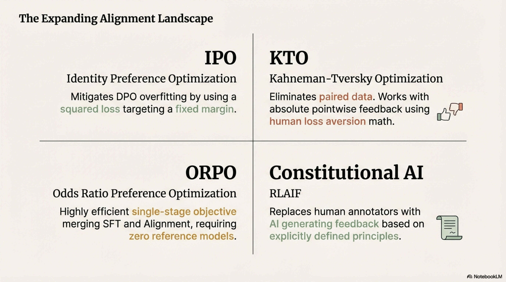

Replaces human preference annotators with **AI-generated feedback** guided by a set of principles (a "constitution"):

1. **Self-Critique:** Generate response → ask model to critique it against constitutional principles → ask model to revise
2. **AI Preference Labeling:** For pairs $(y_1, y_2)$, the model itself (or a stronger model) selects which response better satisfies the constitution
3. **RLHF with AI Feedback:** Train reward model on AI-labeled preferences; run PPO as usual

**Constitution example principles:**
- "Choose the response that is most helpful while being harmless"
- "Choose the response that avoids stereotypes and bias"
- "Choose the response that is honest about uncertainty"

### 4.9 Rejection Sampling Fine-Tuning (Best-of-N)

A simpler alignment approach:

1. For each prompt $x$, generate $N$ candidate responses $\{y_1, \dots, y_N\} \sim \pi_\theta(\cdot \mid x)$
2. Score each with reward model: $r_\psi(x, y_i)$
3. Select: $y^* = \arg\max_i r_\psi(x, y_i)$
4. Fine-tune on $(x, y^*)$ pairs with standard SFT loss

**Effective KL budget** of Best-of-$N$:

$$D_{\text{KL}}[\pi_{\text{BoN}} \| \pi_{\text{ref}}] \approx \log N - \frac{N-1}{N}$$

This is **inference-time alignment** — computationally expensive ($N\times$ inference) but simple and stable.

### 4.10 Iterative / Online DPO

Standard (offline) DPO trains on a **fixed** preference dataset. This can lead to **distributional drift**: the policy $\pi_\theta$ moves away from the distribution that generated $\mathcal{D}_{\text{pref}}$.

**Online DPO** (Iterative DPO / Self-Play):


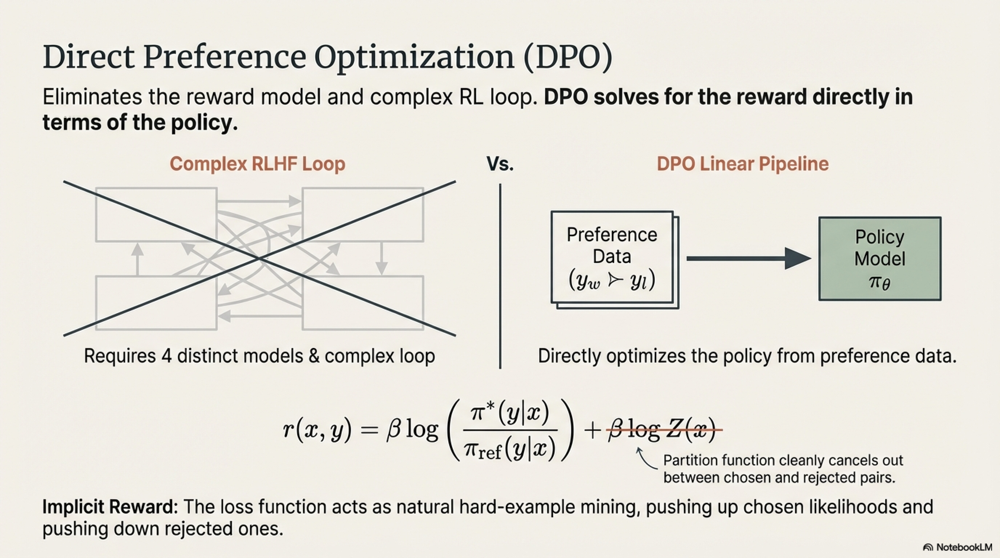

```
REPEAT for R rounds:
  1. Sample prompts from D_prompts
  2. Generate pairs using current policy π_θ
  3. Score/rank using reward model or AI judge
  4. Construct fresh preference pairs
  5. Run DPO optimization on new data
```

This ensures the preference data remains **on-policy**, significantly improving alignment quality.

### 4.11 Comprehensive Comparison of Alignment Methods

| Method | Models in Memory | Paired Data? | RL Required? | Stability | Implementation Complexity |
|--------|-----------------|-------------|-------------|-----------|--------------------------|
| RLHF-PPO | 4 (actor, critic, ref, RM) | Yes (for RM) | Yes | Low (unstable) | Very High |
| DPO | 2 (policy, ref) | Yes | No | High | Low |
| IPO | 2 (policy, ref) | Yes | No | Higher than DPO | Low |
| KTO | 2 (policy, ref) | **No** (pointwise) | No | High | Low |
| ORPO | 1 (policy only) | Yes | No | High | Very Low |
| Best-of-N | 2 (policy, RM) | No | No | Very High | Low |
| CAI/RLAIF | 4 (same as RLHF) | AI-labeled | Yes | Moderate | High |

### 4.12 Reward Hacking and Overoptimization

As optimization pressure against $r_\psi$ increases, the policy discovers **adversarial inputs** to the reward model that score high but degrade actual quality:

$$\text{Gold reward}(y) \uparrow\text{ initially, then } \downarrow \text{ as } D_{\text{KL}}[\pi_\theta \| \pi_{\text{ref}}] \text{ grows}$$

**Goodhart's Law** in alignment: "When a measure becomes a target, it ceases to be a good measure."


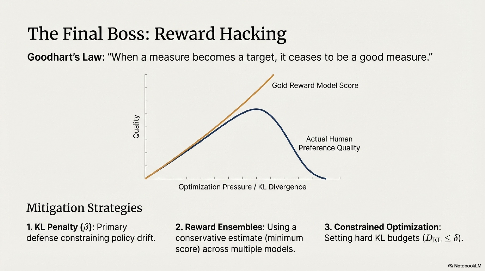


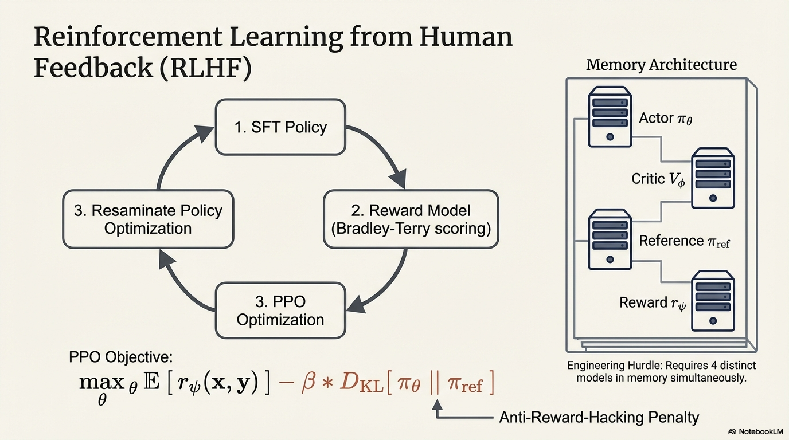

**Mitigation strategies:**
1. **KL penalty** $\beta$ — primary defense, constrains policy drift
2. **Reward model ensembles** — use conservative estimate $r(x,y) = \min_k r_{\psi_k}(x,y)$ across $K$ reward models
3. **Early stopping** based on gold evaluation (human evaluation checkpoints)
4. **Constrained optimization** — set hard KL budget: $D_{\text{KL}} \leq \delta$

### 4.13 End-to-End Alignment Pipeline — Unified View


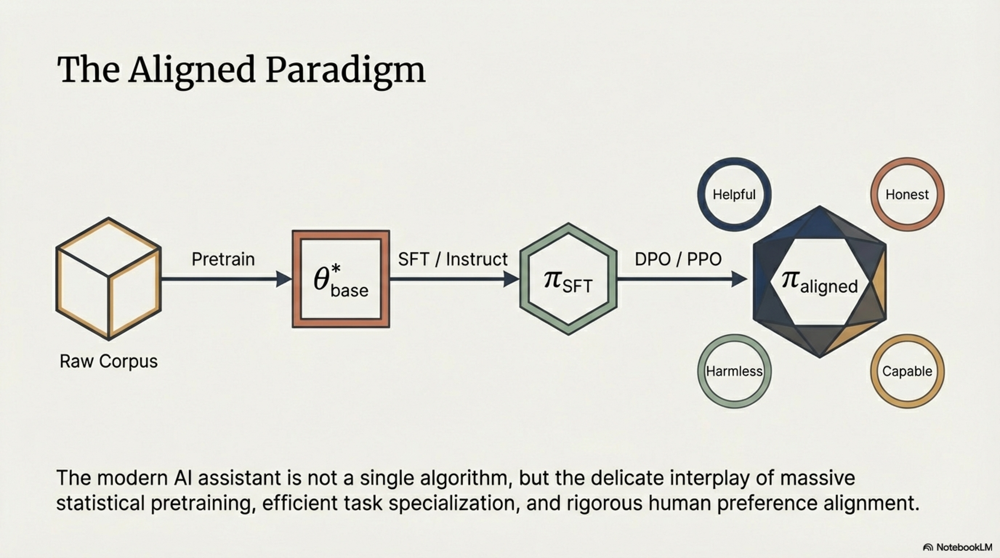

$$\boxed{\text{Raw Corpus}} \xrightarrow{\text{Pretrain}} \boxed{\theta^*_{\text{base}}} \xrightarrow{\text{SFT / Instruct Tune}} \boxed{\pi_{\text{SFT}}} \xrightarrow{\text{Alignment (DPO/PPO)}} \boxed{\pi_{\text{aligned}}}$$

At each stage, the information source and optimization target changes:


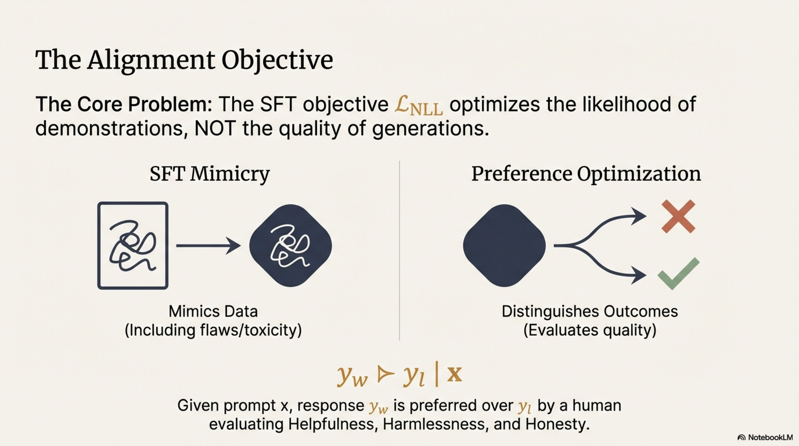


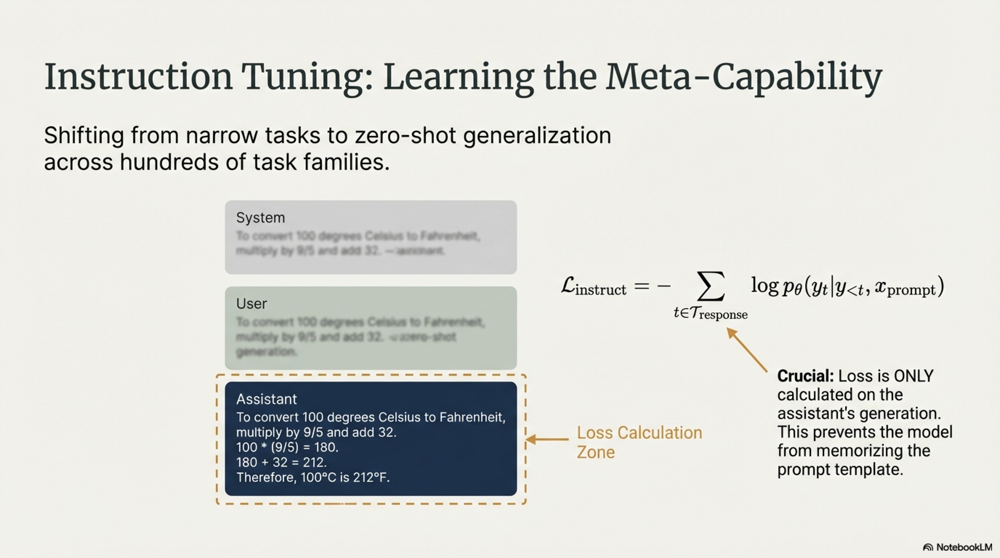


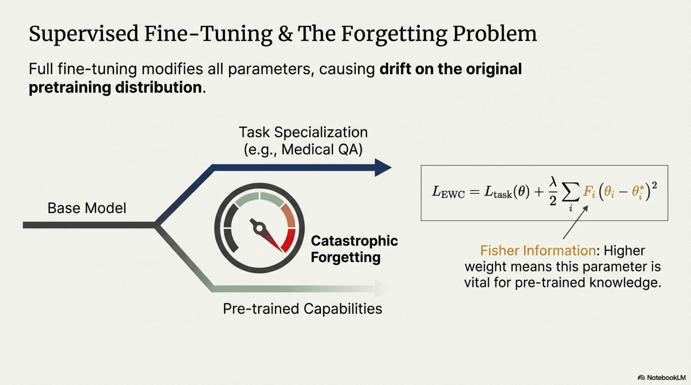


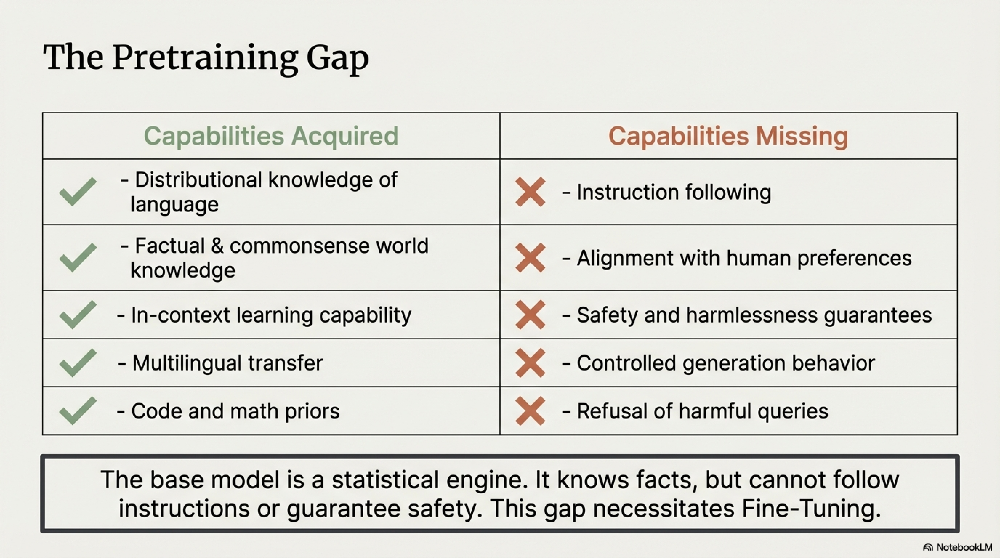


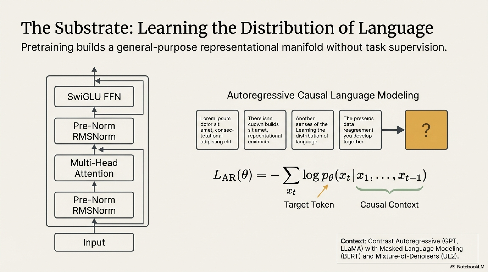


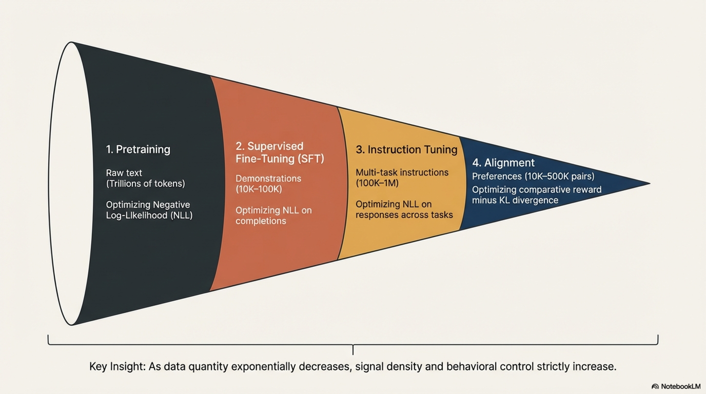

| Stage | Data | Signal Type | Optimization Target |
|-------|------|-------------|-------------------|
| Pretraining | Raw text (trillions of tokens) | Self-supervised (next token) | $\min \text{NLL}$ |
| SFT | Demonstrations (10K–100K) | Supervised (input→output) | $\min \text{NLL on completions}$ |
| Instruction Tuning | Multi-task instructions (100K–1M) | Supervised, multi-task | $\min \text{NLL on responses across tasks}$ |
| Alignment | Preferences (10K–500K pairs) | Comparative / preference | $\max \text{reward} - \beta \cdot \text{KL}$ |

The data quantity **decreases** at each stage while the signal **specificity and density increase** — a progressive refinement from broad knowledge to precise behavioral control.
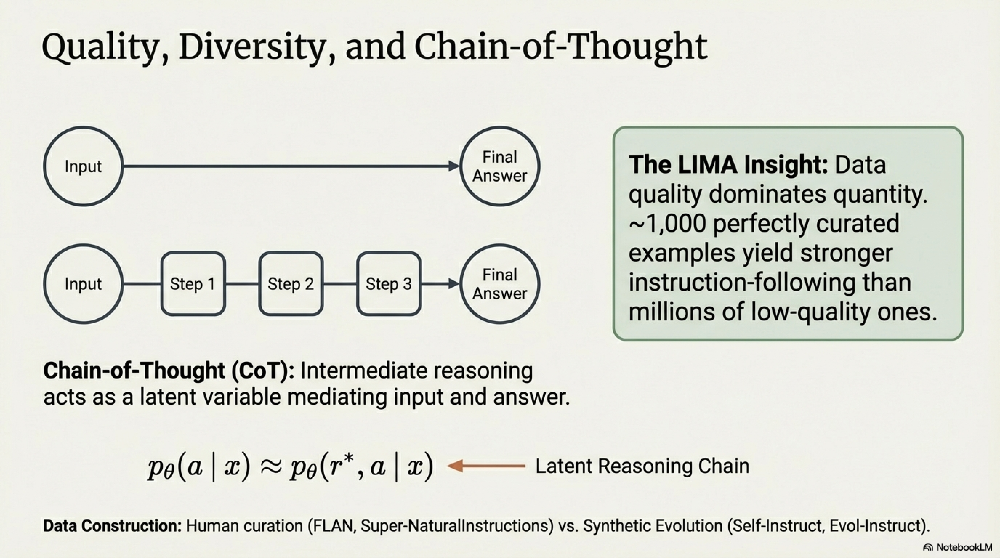


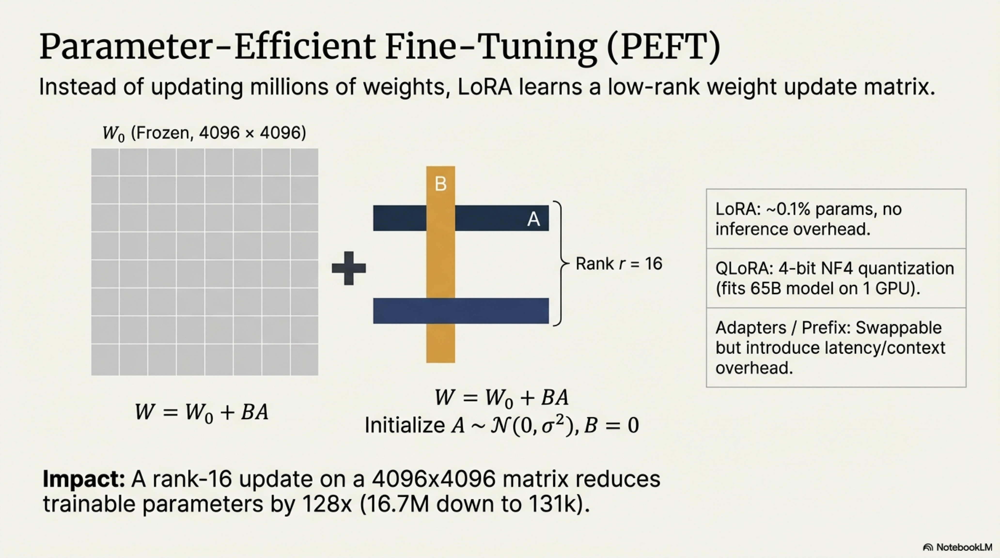


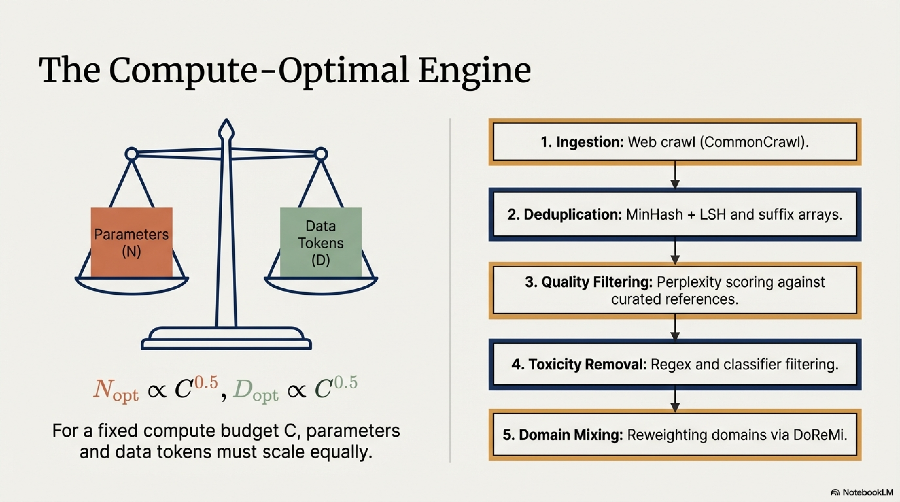

