# Language Models: Foundations, Scaling Laws, and the Evolution of Large Language Models


---

## 1. Introduction


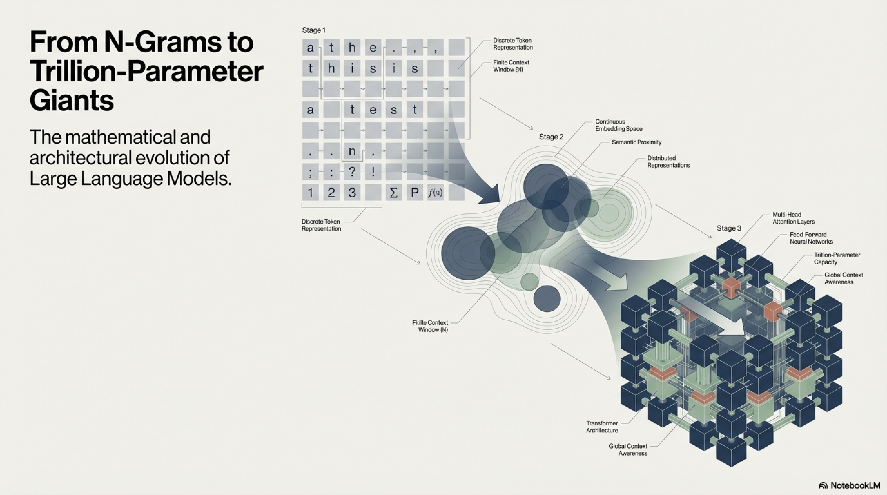

Language modeling constitutes the computational and mathematical framework for assigning probability distributions over sequences of discrete tokens drawn from a finite vocabulary. At its core, this endeavor sits at the intersection of **statistical estimation theory**, **information theory**, **sequential decision-making**, and **representation learning**. The central scientific question is:


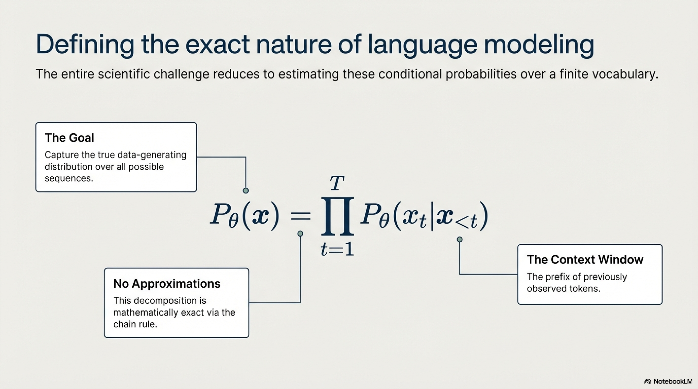

> *Given a finite vocabulary $\mathcal{V}$ and a corpus $\mathcal{D}$ of observed token sequences, how do we construct a parametric or non-parametric function $P_\theta$ that faithfully captures the true data-generating distribution $P^*$ over all possible sequences $\mathbf{x} \in \mathcal{V}^*$, while generalizing to unseen compositions?*

This question is deceptively simple but encapsulates challenges spanning:

| Dimension | Core Challenge |
|---|---|
| **Statistical** | Estimating distributions over combinatorially explosive discrete spaces with finite samples |
| **Computational** | Tractable inference and learning over sequences of arbitrary length |
| **Representational** | Capturing hierarchical syntactic, semantic, and pragmatic structure |
| **Generalization** | Compositional extrapolation beyond training distribution support |
| **Scaling** | Understanding how model capacity, data volume, and compute interact as power laws |

The trajectory from count-based $n$-gram models to transformer-based Large Language Models (LLMs) with $>10^{12}$ parameters represents not merely an engineering progression but a sequence of fundamental scientific insights about the nature of sequential computation, attention, and emergent capabilities.

---

## 2. What Is a Language Model?

### 2.1 Formal Definition

A **language model** is a probability distribution $P_\theta$ over variable-length sequences of tokens from a finite vocabulary $\mathcal{V} = \{v_1, v_2, \ldots, v_{|\mathcal{V}|}\}$, parameterized by $\theta \in \Theta$:

$$P_\theta : \mathcal{V}^* \rightarrow [0, 1] \quad \text{such that} \quad \sum_{\mathbf{x} \in \mathcal{V}^*} P_\theta(\mathbf{x}) = 1$$

where $\mathcal{V}^*$ denotes the Kleene closure of $\mathcal{V}$ (the set of all finite-length sequences including the empty sequence).

### 2.2 Autoregressive Factorization


By the **chain rule of probability**, any joint distribution over a sequence $\mathbf{x} = (x_1, x_2, \ldots, x_T)$ decomposes exactly as:

$$P_\theta(\mathbf{x}) = P_\theta(x_1) \cdot \prod_{t=2}^{T} P_\theta(x_t \mid x_1, x_2, \ldots, x_{t-1}) = \prod_{t=1}^{T} P_\theta(x_t \mid \mathbf{x}_{<t})$$

where $\mathbf{x}_{<t} = (x_1, \ldots, x_{t-1})$ is the prefix context. This factorization is **exact**—it introduces no approximation. The modeling challenge is entirely in estimating each conditional $P_\theta(x_t \mid \mathbf{x}_{<t})$.

Each conditional is a categorical distribution over $|\mathcal{V}|$ outcomes:

$$P_\theta(x_t = v \mid \mathbf{x}_{<t}) = \frac{\exp(f_\theta(\mathbf{x}_{<t})_v)}{\sum_{v' \in \mathcal{V}} \exp(f_\theta(\mathbf{x}_{<t})_{v'})} \quad \forall v \in \mathcal{V}$$

where $f_\theta : \mathcal{V}^* \rightarrow \mathbb{R}^{|\mathcal{V}|}$ is the **logit function** mapping prefix contexts to unnormalized log-probabilities (logits).

### 2.3 Alternative Factorization Paradigms

| Paradigm | Factorization | Example Architectures |
|---|---|---|
| **Autoregressive (Left-to-Right)** | $\prod_{t=1}^{T} P(x_t \mid \mathbf{x}_{<t})$ | GPT, LLaMA, PaLM |
| **Autoregressive (Arbitrary Order)** | $\prod_{t=1}^{T} P(x_{z_t} \mid \mathbf{x}_{z_{<t}})$ for permutation $z$ | XLNet |
| **Masked Language Model** | $\prod_{i \in \mathcal{M}} P(x_i \mid \mathbf{x}_{\setminus \mathcal{M}})$ (conditional independence assumed) | BERT, RoBERTa |
| **Seq-to-Seq (Encoder-Decoder)** | $P(\mathbf{y} \mid \mathbf{x}) = \prod_{t=1}^{T'} P(y_t \mid \mathbf{y}_{<t}, \mathbf{x})$ | T5, BART |
| **Non-Autoregressive** | $\prod_{t=1}^{T} P(x_t \mid \mathbf{c})$ (parallel, conditional independence) | NAT variants |
| **Energy-Based** | $P(\mathbf{x}) = \frac{\exp(-E_\theta(\mathbf{x}))}{Z(\theta)}$ | Residual Energy Models |

For masked language models (MLMs), define a masking set $\mathcal{M} \subset \{1, \ldots, T\}$. The MLM objective approximates:

$$\mathcal{L}_{\text{MLM}}(\theta) = -\mathbb{E}_{\mathbf{x} \sim \mathcal{D}} \, \mathbb{E}_{\mathcal{M}} \left[ \sum_{i \in \mathcal{M}} \log P_\theta(x_i \mid \mathbf{x}_{\setminus \mathcal{M}}) \right]$$

**Critical distinction**: MLMs do not define a proper joint distribution $P(\mathbf{x})$ because they assume conditional independence among masked tokens $\{x_i\}_{i \in \mathcal{M}}$ given unmasked tokens—a pseudo-likelihood approximation.

### 2.4 Training Objective: Maximum Likelihood Estimation

Given corpus $\mathcal{D} = \{\mathbf{x}^{(1)}, \mathbf{x}^{(2)}, \ldots, \mathbf{x}^{(N)}\}$, the standard MLE objective for autoregressive models is:

$$\hat{\theta}_{\text{MLE}} = \arg\min_{\theta} \, \mathcal{L}(\theta) = \arg\min_{\theta} \left[ -\frac{1}{N} \sum_{n=1}^{N} \sum_{t=1}^{T_n} \log P_\theta(x_t^{(n)} \mid \mathbf{x}_{<t}^{(n)}) \right]$$

This is equivalent to minimizing the **cross-entropy** between the empirical distribution $\hat{P}_{\mathcal{D}}$ and the model distribution $P_\theta$:

$$H(\hat{P}_{\mathcal{D}}, P_\theta) = -\mathbb{E}_{\mathbf{x} \sim \hat{P}_{\mathcal{D}}} \left[\log P_\theta(\mathbf{x})\right]$$

### 2.5 Information-Theoretic Perspective

The relationship between cross-entropy, entropy, and KL-divergence provides the theoretical grounding:

$$H(\hat{P}_{\mathcal{D}}, P_\theta) = H(\hat{P}_{\mathcal{D}}) + D_{\mathrm{KL}}(\hat{P}_{\mathcal{D}} \| P_\theta)$$

where:

- $H(\hat{P}_{\mathcal{D}}) = -\mathbb{E}_{\mathbf{x} \sim \hat{P}_{\mathcal{D}}}[\log \hat{P}_{\mathcal{D}}(\mathbf{x})]$ is the **entropy** of the empirical distribution (irreducible)
- $D_{\mathrm{KL}}(\hat{P}_{\mathcal{D}} \| P_\theta) \geq 0$ is the **KL-divergence** quantifying model inadequacy

Therefore, minimizing cross-entropy $\Leftrightarrow$ minimizing KL-divergence $\Leftrightarrow$ MLE.

**Perplexity** is the exponentiated cross-entropy, serving as the standard evaluation metric:

$$\text{PPL}(P_\theta, \mathcal{D}_{\text{test}}) = \exp\left(-\frac{1}{\sum_n T_n}\sum_{n=1}^{N}\sum_{t=1}^{T_n} \log P_\theta(x_t^{(n)} \mid \mathbf{x}_{<t}^{(n)})\right)$$

**Interpretation**: Perplexity represents the effective vocabulary size the model is "confused" among at each prediction step. A perfect model on deterministic text achieves $\text{PPL} = 1$. Shannon's entropy bound for English is approximately $1.0$–$1.3$ bits/character, yielding a character-level perplexity lower bound of approximately $2^{1.0} \approx 2.0$.

### 2.6 Bits-Per-Character and Bits-Per-Token

For cross-model comparison across different tokenization schemes:

$$\text{BPC} = \frac{\log_2(\text{PPL}_{\text{token}}) \cdot T_{\text{tokens}}}{T_{\text{characters}}} = \frac{\mathcal{L}_{\text{CE}}(\theta)}{\ln 2 \cdot \bar{c}}$$

where $\bar{c}$ is the average number of characters per token. This normalizes away tokenization-induced incomparabilities.

### 2.7 Pseudo-Algorithm: Core Language Model Training

```
ALGORITHM: AutoregressiveLanguageModelTraining

INPUT:
    D = {x^(1), x^(2), ..., x^(N)}    // Corpus of token sequences, x^(n) ∈ V^{T_n}
    V                                    // Vocabulary, |V| = K
    f_θ : V* → ℝ^K                     // Logit function (neural network) with parameters θ
    η                                    // Learning rate schedule η(t)
    B                                    // Mini-batch size
    T_max                                // Maximum training steps

OUTPUT:
    θ*                                   // Trained parameters minimizing empirical cross-entropy

PROCEDURE:
    1.  INITIALIZE θ ~ N(0, σ²_init · I), where σ²_init chosen per architecture
    2.  FOR step = 1 TO T_max:
        3.  SAMPLE mini-batch {x^(b)}_{b=1}^{B} from D (with or without replacement)
        4.  FOR EACH sequence x^(b) = (x_1, ..., x_T) in mini-batch:
            5.  COMPUTE logits: z_t = f_θ(x_{<t})  ∈ ℝ^K,  for t = 1, ..., T
            6.  COMPUTE per-token loss:
                    ℓ_t = -log( exp(z_t[x_t]) / Σ_{k=1}^{K} exp(z_t[k]) )
        7.  COMPUTE batch loss: L = (1 / Σ_b T_b) · Σ_b Σ_t ℓ_t^(b)
        8.  COMPUTE gradients: g = ∇_θ L   (via reverse-mode automatic differentiation)
        9.  UPDATE θ ← OPTIMIZER_STEP(θ, g, η(step))
                // e.g., AdamW: m ← β₁m + (1-β₁)g; v ← β₂v + (1-β₂)g²;
                //        θ ← θ - η · (m̂/(√v̂ + ε) + λθ)
        10. IF convergence criteria met (validation loss plateau, gradient norm < δ):
                BREAK
    11. RETURN θ* = θ
```

### 2.8 Expressiveness and Universal Approximation

A critical theoretical question: *Can a given model class represent any distribution over $\mathcal{V}^*$?*

**Theorem (Transformer universality, Yun et al., 2020)**: Transformers with $O(\text{poly}(n))$ layers and hard attention can approximate any continuous sequence-to-sequence function on compact domains to arbitrary precision.

**Theorem (Autoregressive sufficiency)**: Any distribution $P^*$ over $\mathcal{V}^T$ can be represented exactly by an autoregressive model with conditionals $P^*(x_t \mid \mathbf{x}_{<t})$, provided each conditional has sufficient capacity. This follows directly from the chain rule—no approximation is introduced by the factorization itself.

The practical challenge thus reduces to whether $f_\theta$ has sufficient capacity and whether finite-sample MLE recovers the true conditionals.

---

## 3. Evolution of Language Modelling Technologies

### 3.1 Count-Based $n$-Gram Models (1948–2000s)

#### 3.1.1 Formulation

The $n$-gram assumption restricts context to a fixed window of $n-1$ preceding tokens ($(n-1)$-th order Markov assumption):

$$P_{\text{n-gram}}(x_t \mid \mathbf{x}_{<t}) \approx P(x_t \mid x_{t-n+1}, \ldots, x_{t-1})$$

The maximum likelihood estimator is the relative frequency:

$$\hat{P}_{\text{MLE}}(x_t = w \mid x_{t-n+1:t-1}) = \frac{C(x_{t-n+1}, \ldots, x_{t-1}, w)}{C(x_{t-n+1}, \ldots, x_{t-1})}$$

where $C(\cdot)$ denotes the count function over the training corpus.

#### 3.1.2 The Sparsity Problem

The number of possible $n$-grams grows as $|\mathcal{V}|^n$. For a typical vocabulary of $|\mathcal{V}| = 50{,}000$ and $n = 5$:

$$|\mathcal{V}|^5 = 3.125 \times 10^{23}$$

Virtually all 5-grams have zero count in any feasible corpus, making the raw MLE estimator degenerate (assigns $P = 0$ to unseen but valid sequences).

#### 3.1.3 Smoothing Techniques

| Method | Formula | Key Idea |
|---|---|---|
| **Additive (Laplace)** | $$\hat{P}(w \mid h) = \frac{C(h, w) + \alpha}{C(h) + \alpha|\mathcal{V}|}$$  | Add pseudo-counts; poor in practice |
| **Absolute Discounting** | $\hat{P}(w \mid h) = \frac{\max(C(h,w) - d, 0)}{C(h)} + \lambda(h) \cdot P_{\text{lower}}(w)$ | Subtract fixed discount $d$, redistribute |
| **Kneser-Ney** | Uses continuation probability $P_{\text{KN}}$ for backoff | Lower-order model estimates probability of appearing in novel contexts |
| **Modified Kneser-Ney** | Three discount parameters $d_1, d_2, d_{3+}$ depending on count magnitude | SOTA for $n$-gram models (Chen & Goodman, 1999) |

**Modified Kneser-Ney** formally:

$$P_{\text{MKN}}(w \mid h) = \frac{\max(C(h, w) - d(C(h,w)), 0)}{C(h)} + \gamma(h) \cdot P_{\text{MKN}}(w \mid h')$$

where $h'$ is the $(n-2)$-gram backoff context, $d(c)$ is a count-dependent discount, and $\gamma(h)$ is the normalization constant ensuring the distribution sums to 1.

#### 3.1.4 Fundamental Limitations


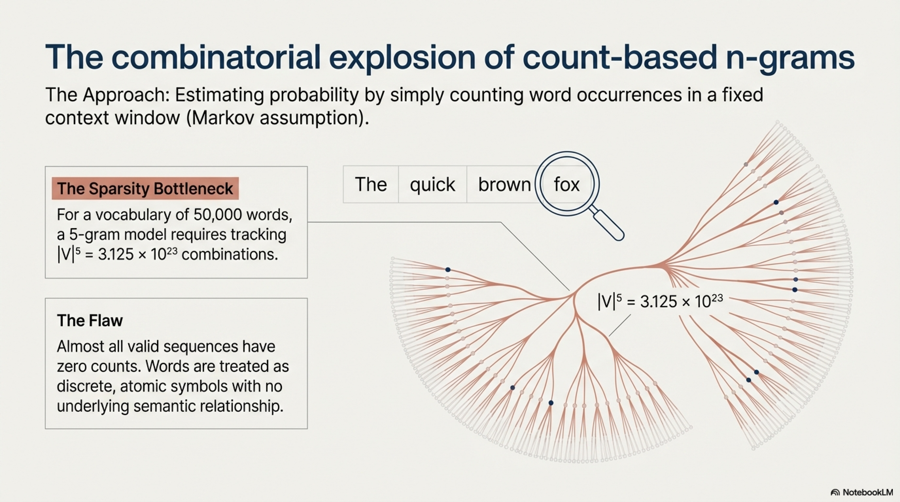

1. **No parameter sharing**: The model learns nothing about the relationship between "cat sat on" and "dog sat on"—each $n$-gram is an independent parameter.
2. **Discrete representation**: Words are atomic symbols with no notion of semantic similarity.
3. **Fixed context**: Cannot capture dependencies beyond $n-1$ tokens regardless of corpus size.

### 3.2 Neural Language Models (2003–2013)

#### 3.2.1 Bengio et al. (2003): Neural Probabilistic Language Model

The foundational insight was replacing discrete $n$-gram tables with **continuous distributed representations** (embeddings) and a neural network:

$$P(x_t \mid x_{t-n+1:t-1}) = g_\theta\big(\mathbf{e}(x_{t-n+1}), \mathbf{e}(x_{t-n+2}), \ldots, \mathbf{e}(x_{t-1})\big)$$

where $\mathbf{e}: \mathcal{V} \rightarrow \mathbb{R}^d$ is a learned embedding function and $g_\theta$ is a feedforward neural network.

The architecture:

$$\mathbf{h} = \tanh\big(\mathbf{W} \cdot [\mathbf{e}(x_{t-n+1}); \mathbf{e}(x_{t-n+2}); \ldots; \mathbf{e}(x_{t-1})] + \mathbf{b}\big)$$

$$P(x_t = v \mid x_{t-n+1:t-1}) = \text{softmax}(\mathbf{U}\mathbf{h} + \mathbf{d})_v$$

**Key advance**: Semantically similar words receive similar embeddings $\mathbf{e}(w) \approx \mathbf{e}(w')$, enabling **generalization across similar contexts**—the curse of dimensionality is partially mitigated via the manifold hypothesis.

#### 3.2.2 Computational Bottleneck: Softmax

The softmax denominator requires summation over $|\mathcal{V}|$ terms:

$$Z = \sum_{v=1}^{|\mathcal{V}|} \exp(\mathbf{u}_v^\top \mathbf{h} + d_v)$$

For $|\mathcal{V}| \sim 10^5$, this becomes expensive. Approximations developed:


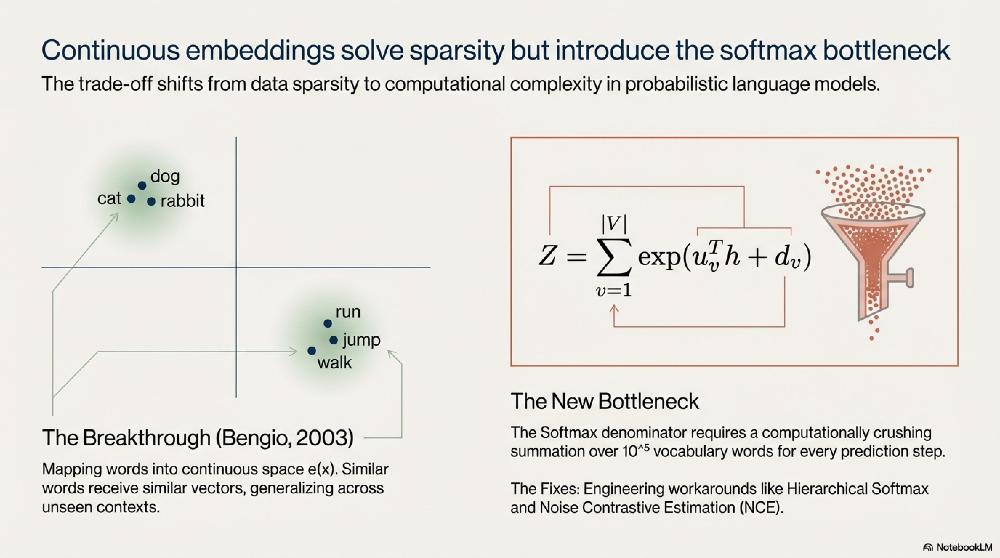

- **Hierarchical softmax**: Organize vocabulary as a binary tree; prediction cost $O(\log |\mathcal{V}|)$
- **Noise Contrastive Estimation (NCE)**: Reduce to binary classification: distinguish true tokens from $k$ noise samples drawn from $Q(w)$

$$\mathcal{L}_{\text{NCE}} = -\log \frac{P_\theta(w \mid h)}{P_\theta(w \mid h) + k \cdot Q(w)} - \sum_{i=1}^{k} \log \frac{k \cdot Q(w_i)}{P_\theta(w_i \mid h) + k \cdot Q(w_i)}$$

- **Negative sampling** (simplified NCE used in Word2Vec)
- **Adaptive softmax**: Partition vocabulary by frequency; assign fewer dimensions to rare words

### 3.3 Recurrent Neural Networks (2010–2017)

#### 3.3.1 Vanilla RNN Language Model

RNNs removed the fixed-context limitation by maintaining a hidden state $\mathbf{h}_t \in \mathbb{R}^d$ that theoretically compresses the entire prefix:

$$\mathbf{h}_t = \phi\big(\mathbf{W}_h \mathbf{h}_{t-1} + \mathbf{W}_x \mathbf{e}(x_t) + \mathbf{b}\big)$$

$$P(x_{t+1} \mid \mathbf{x}_{\leq t}) = \text{softmax}(\mathbf{W}_o \mathbf{h}_t)$$

**Gradient flow pathology**: Unrolling $T$ steps, the gradient of the loss at step $T$ with respect to $\mathbf{h}_1$ involves:

$$\frac{\partial \mathbf{h}_T}{\partial \mathbf{h}_1} = \prod_{t=2}^{T} \frac{\partial \mathbf{h}_t}{\partial \mathbf{h}_{t-1}} = \prod_{t=2}^{T} \text{diag}(\phi'(\mathbf{z}_t)) \cdot \mathbf{W}_h$$

If $\|\mathbf{W}_h\| < 1$ (spectral norm), gradients vanish exponentially: $\left\|\frac{\partial \mathbf{h}_T}{\partial \mathbf{h}_1}\right\| \leq \lambda_{\max}^{T-1} \rightarrow 0$. If $\|\mathbf{W}_h\| > 1$, gradients explode.

#### 3.3.2 LSTM (Hochreiter & Schmidhuber, 1997)

LSTMs introduce a **cell state** $\mathbf{c}_t$ with additive update dynamics and multiplicative gating:

$$\mathbf{f}_t = \sigma(\mathbf{W}_f [\mathbf{h}_{t-1}; \mathbf{e}(x_t)] + \mathbf{b}_f) \quad \text{(forget gate)}$$

$$\mathbf{i}_t = \sigma(\mathbf{W}_i [\mathbf{h}_{t-1}; \mathbf{e}(x_t)] + \mathbf{b}_i) \quad \text{(input gate)}$$

$$\tilde{\mathbf{c}}_t = \tanh(\mathbf{W}_c [\mathbf{h}_{t-1}; \mathbf{e}(x_t)] + \mathbf{b}_c) \quad \text{(candidate cell)}$$

$$\mathbf{c}_t = \mathbf{f}_t \odot \mathbf{c}_{t-1} + \mathbf{i}_t \odot \tilde{\mathbf{c}}_t \quad \text{(cell update)}$$

$$\mathbf{o}_t = \sigma(\mathbf{W}_o [\mathbf{h}_{t-1}; \mathbf{e}(x_t)] + \mathbf{b}_o) \quad \text{(output gate)}$$

$$\mathbf{h}_t = \mathbf{o}_t \odot \tanh(\mathbf{c}_t) \quad \text{(hidden state)}$$

The gradient along the cell state pathway:

$$\frac{\partial \mathbf{c}_T}{\partial \mathbf{c}_1} = \prod_{t=2}^{T} \text{diag}(\mathbf{f}_t)$$

When $\mathbf{f}_t \approx \mathbf{1}$, gradients propagate without decay—the **constant error carousel**. This is the key mechanism enabling long-range dependency capture.

#### 3.3.3 GRU (Cho et al., 2014)

Simplified gating with fewer parameters (two gates instead of three):

$$\mathbf{z}_t = \sigma(\mathbf{W}_z [\mathbf{h}_{t-1}; \mathbf{e}(x_t)]) \quad \text{(update gate)}$$

$$\mathbf{r}_t = \sigma(\mathbf{W}_r [\mathbf{h}_{t-1}; \mathbf{e}(x_t)]) \quad \text{(reset gate)}$$

$$\tilde{\mathbf{h}}_t = \tanh(\mathbf{W}_h [\mathbf{r}_t \odot \mathbf{h}_{t-1}; \mathbf{e}(x_t)])$$

$$\mathbf{h}_t = (1 - \mathbf{z}_t) \odot \mathbf{h}_{t-1} + \mathbf{z}_t \odot \tilde{\mathbf{h}}_t$$

#### 3.3.4 Fundamental Limitations of Recurrence


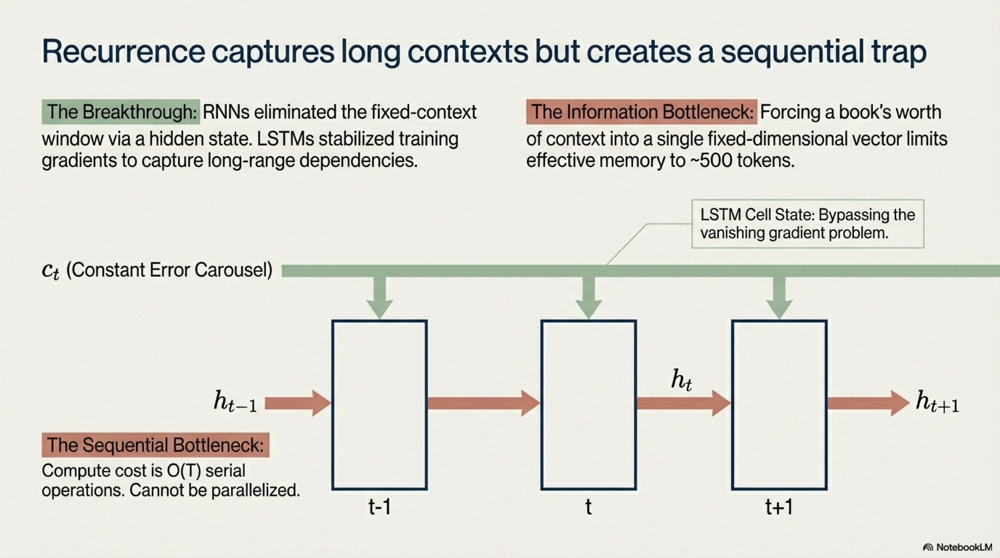

1. **Sequential bottleneck**: $\mathbf{h}_t$ depends on $\mathbf{h}_{t-1}$, precluding parallelization across time steps during training. Compute cost is $O(T)$ serial operations.
2. **Fixed-size bottleneck**: The entire prefix history $\mathbf{x}_{<t}$ must be compressed into a fixed-dimensional vector $\mathbf{h}_t \in \mathbb{R}^d$, creating an information bottleneck governed by:

$$I(\mathbf{h}_t ; \mathbf{x}_{<t}) \leq d \cdot \log_2(\text{precision})$$

3. **Effective context length**: Empirically, LSTMs struggle with dependencies beyond $\sim 200$–$500$ tokens despite theoretical capacity for longer ranges.

### 3.4 Attention Mechanism and Seq2Seq (2014–2016)

#### 3.4.1 Bahdanau Attention

For encoder-decoder models, attention computes a dynamic, input-dependent weighted combination of encoder states:

$$e_{t,s} = \mathbf{v}_a^\top \tanh(\mathbf{W}_a \mathbf{h}^{\text{dec}}_{t-1} + \mathbf{U}_a \mathbf{h}^{\text{enc}}_s) \quad \text{(alignment score)}$$

$$\alpha_{t,s} = \frac{\exp(e_{t,s})}{\sum_{s'=1}^{S} \exp(e_{t,s'})} \quad \text{(attention weight)}$$

$$\mathbf{c}_t = \sum_{s=1}^{S} \alpha_{t,s} \cdot \mathbf{h}^{\text{enc}}_s \quad \text{(context vector)}$$

This eliminates the single-vector bottleneck of vanilla seq2seq by allowing direct access to all encoder states.

#### 3.4.2 Luong Attention Variants

| Variant | Score Function $\text{score}(\mathbf{h}_t, \mathbf{h}_s)$ |
|---|---|
| **Dot** | $\mathbf{h}_t^\top \mathbf{h}_s$ |
| **General** | $\mathbf{h}_t^\top \mathbf{W}_a \mathbf{h}_s$ |
| **Concat** | $\mathbf{v}_a^\top \tanh(\mathbf{W}_a[\mathbf{h}_t; \mathbf{h}_s])$ |

### 3.5 The Transformer Architecture (Vaswani et al., 2017)

#### 3.5.1 Core Insight


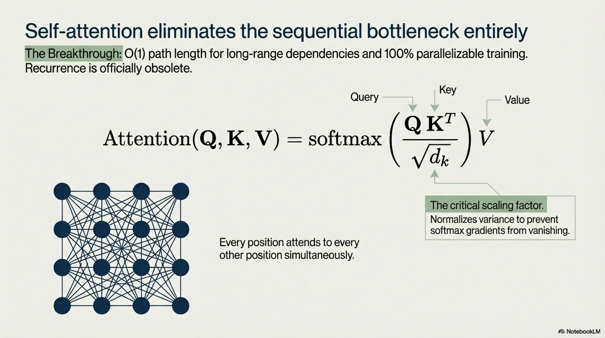

Replace all recurrence with **self-attention**—every position attends to every other position in parallel, eliminating the sequential bottleneck entirely.

#### 3.5.2 Scaled Dot-Product Attention

Given query $\mathbf{Q} \in \mathbb{R}^{T \times d_k}$, key $\mathbf{K} \in \mathbb{R}^{T \times d_k}$, value $\mathbf{V} \in \mathbb{R}^{T \times d_v}$:

$$\text{Attention}(\mathbf{Q}, \mathbf{K}, \mathbf{V}) = \text{softmax}\left(\frac{\mathbf{Q}\mathbf{K}^\top}{\sqrt{d_k}}\right)\mathbf{V}$$

**Scaling justification**: If entries of $\mathbf{Q}$ and $\mathbf{K}$ are i.i.d. with zero mean and unit variance, then $\text{Var}(\mathbf{q}_i^\top \mathbf{k}_j) = d_k$. Without scaling, the softmax inputs have standard deviation $\sqrt{d_k}$, pushing the softmax into saturated regions where gradients vanish. Dividing by $\sqrt{d_k}$ normalizes the variance to 1.

#### 3.5.3 Multi-Head Attention


$$\text{MultiHead}(\mathbf{Q}, \mathbf{K}, \mathbf{V}) = \text{Concat}(\text{head}_1, \ldots, \text{head}_H) \mathbf{W}^O$$

$$\text{head}_i = \text{Attention}(\mathbf{Q}\mathbf{W}_i^Q, \mathbf{K}\mathbf{W}_i^K, \mathbf{V}\mathbf{W}_i^V)$$

where $\mathbf{W}_i^Q \in \mathbb{R}^{d_{\text{model}} \times d_k}$, $\mathbf{W}_i^K \in \mathbb{R}^{d_{\text{model}} \times d_k}$, $\mathbf{W}_i^V \in \mathbb{R}^{d_{\text{model}} \times d_v}$, $\mathbf{W}^O \in \mathbb{R}^{Hd_v \times d_{\text{model}}}$, with $d_k = d_v = d_{\text{model}} / H$.


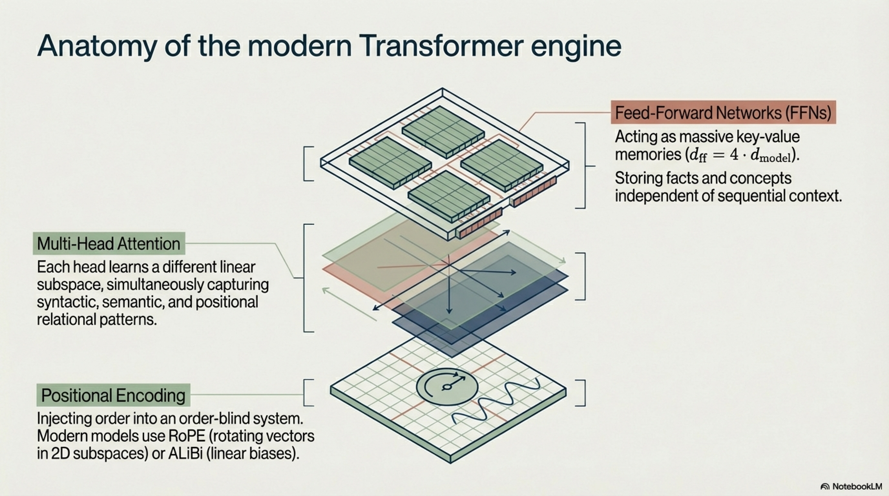

**Interpretation**: Each head learns a different linear subspace to attend in, capturing distinct relational patterns (syntactic, semantic, positional).

#### 3.5.4 Position-Wise Feed-Forward Network

$$\text{FFN}(\mathbf{x}) = \mathbf{W}_2 \cdot \text{ReLU}(\mathbf{W}_1 \mathbf{x} + \mathbf{b}_1) + \mathbf{b}_2$$

where $\mathbf{W}_1 \in \mathbb{R}^{d_{\text{model}} \times d_{\text{ff}}}$, $\mathbf{W}_2 \in \mathbb{R}^{d_{\text{ff}} \times d_{\text{model}}}$, typically $d_{\text{ff}} = 4 \cdot d_{\text{model}}$.

Recent work shows FFN layers act as **key-value memories** where $\mathbf{W}_1$ rows are keys and $\mathbf{W}_2$ columns are values (Geva et al., 2021).

#### 3.5.5 Positional Encoding

Since self-attention is **permutation-equivariant** (applying any permutation $\pi$ to input positions produces the same permutation of outputs), explicit position information is required:

**Sinusoidal (original)**:
$$\text{PE}_{(pos, 2i)} = \sin\left(\frac{pos}{10000^{2i/d_{\text{model}}}}\right), \quad \text{PE}_{(pos, 2i+1)} = \cos\left(\frac{pos}{10000^{2i/d_{\text{model}}}}\right)$$

**Rotary Position Embeddings (RoPE, Su et al., 2021)**: Encode relative positions by rotating query and key vectors in 2D subspaces:

$$f(\mathbf{q}, m) = \mathbf{R}_{\Theta, m} \mathbf{q}, \quad f(\mathbf{k}, n) = \mathbf{R}_{\Theta, n} \mathbf{k}$$

where $\mathbf{R}_{\Theta, m}$ is a block-diagonal rotation matrix with blocks:

$$\begin{pmatrix} \cos(m\theta_i) & -\sin(m\theta_i) \\ \sin(m\theta_i) & \cos(m\theta_i) \end{pmatrix}, \quad \theta_i = 10000^{-2i/d}$$

The key property: $\langle f(\mathbf{q}, m), f(\mathbf{k}, n) \rangle = g(\mathbf{q}, \mathbf{k}, m - n)$—the dot product depends only on the relative distance $m - n$.

**ALiBi (Press et al., 2022)**: Add a linear bias to attention logits: $a_{ij} = \mathbf{q}_i^\top \mathbf{k}_j - m \cdot |i - j|$ where $m$ is a head-specific slope. No learned parameters.

#### 3.5.6 Transformer Block

A single transformer decoder block with Pre-LayerNorm (more stable for deep networks):

$$\mathbf{x}' = \mathbf{x} + \text{MaskedMultiHead}(\text{LN}(\mathbf{x}), \text{LN}(\mathbf{x}), \text{LN}(\mathbf{x}))$$

$$\mathbf{x}'' = \mathbf{x}' + \text{FFN}(\text{LN}(\mathbf{x}'))$$

Stacking $L$ such blocks yields the full model. The causal mask $\mathbf{M}$ ensures autoregressive factorization:

$$M_{ij} = \begin{cases} 0 & \text{if } i \geq j \\ -\infty & \text{if } i < j \end{cases}$$

applied additively to attention logits before softmax.

#### 3.5.7 Computational Complexity Analysis

| Operation | Time Complexity | Space Complexity |
|---|---|---|
| Self-Attention | $O(T^2 \cdot d)$ | $O(T^2 + T \cdot d)$ |
| FFN | $O(T \cdot d \cdot d_{\text{ff}})$ | $O(T \cdot d_{\text{ff}})$ |
| Full Transformer ($L$ layers) | $O(L \cdot (T^2 d + T d \cdot d_{\text{ff}}))$ | $O(L \cdot T^2 + L \cdot T \cdot d)$ |

The $O(T^2)$ attention cost motivates sub-quadratic alternatives:

- **FlashAttention** (Dao et al., 2022): Exact attention with $O(T^2 d / M)$ HBM accesses via tiling (where $M$ is SRAM size), reducing wall-clock time by 2–4× without approximation
- **Linear Attention**: Replace $\text{softmax}(\mathbf{QK}^\top)\mathbf{V}$ with $\phi(\mathbf{Q})(\phi(\mathbf{K})^\top \mathbf{V})$ for kernel function $\phi$, achieving $O(T d^2)$
- **Sparse Attention**: Attend only to subset of positions per query (fixed patterns, learned patterns, or hash-based as in Reformer)

#### 3.5.8 Pseudo-Algorithm: Transformer Decoder Forward Pass

```
ALGORITHM: TransformerDecoderForwardPass

INPUT:
    x = (x_1, ..., x_T)                // Input token sequence, x_t ∈ V
    E ∈ ℝ^{|V| × d_model}             // Token embedding matrix
    {W_l^Q, W_l^K, W_l^V, W_l^O,
     W_l^1, b_l^1, W_l^2, b_l^2,
     γ_l, β_l}  for l = 1..L           // Parameters for L layers
    PE : ℕ → ℝ^{d_model}              // Positional encoding function

OUTPUT:
    logits ∈ ℝ^{T × |V|}              // Unnormalized next-token log-probabilities

PROCEDURE:
    1.  // Embed tokens and add positional information
        FOR t = 1 TO T:
            H^(0)_t = E[x_t] + PE(t)           // H^(0) ∈ ℝ^{T × d_model}

    2.  // Process through L transformer layers
        FOR l = 1 TO L:

            // 2a. Pre-LayerNorm
            H̃ = LayerNorm(H^(l-1); γ_l^attn, β_l^attn)

            // 2b. Multi-Head Causal Self-Attention
            FOR h = 1 TO num_heads:
                Q_h = H̃ · W_{l,h}^Q            // ∈ ℝ^{T × d_k}
                K_h = H̃ · W_{l,h}^K            // ∈ ℝ^{T × d_k}
                V_h = H̃ · W_{l,h}^V            // ∈ ℝ^{T × d_v}

                // Apply causal mask
                A_h = (Q_h · K_h^⊤) / √d_k     // ∈ ℝ^{T × T}
                FOR i = 1 TO T:
                    FOR j = i+1 TO T:
                        A_h[i,j] = -∞
                A_h = softmax(A_h, axis=-1)      // Row-wise softmax
                head_h = A_h · V_h               // ∈ ℝ^{T × d_v}

            // Concatenate and project
            MHA = Concat(head_1, ..., head_H) · W_l^O

            // 2c. Residual connection
            H_mid = H^(l-1) + MHA

            // 2d. Pre-LayerNorm for FFN
            H̃_mid = LayerNorm(H_mid; γ_l^ffn, β_l^ffn)

            // 2e. Position-wise FFN
            FFN_out = W_l^2 · Activation(W_l^1 · H̃_mid + b_l^1) + b_l^2

            // 2f. Residual connection
            H^(l) = H_mid + FFN_out

    3.  // Final LayerNorm and projection to vocabulary
        H_final = LayerNorm(H^(L); γ_final, β_final)
        logits = H_final · E^⊤                  // Weight tying: ℝ^{T × |V|}

    4.  RETURN logits
```

### 3.6 Comparative Summary of Paradigms

| Property | $n$-gram | NNLM | LSTM | Transformer |
|---|---|---|---|---|
| **Context length** | $n-1$ (fixed) | $n-1$ (fixed) | $\infty$ (theoretically) | $T$ (full window) |
| **Parameter sharing** | None | Via embeddings | Via recurrent weights | Via attention + FFN |
| **Parallelism** | N/A | Full | None (sequential) | Full |
| **Long-range deps.** | None | None | Decays | Direct ($O(1)$ path length) |
| **Training complexity** | $O(|\mathcal{D}|)$ counting | $O(|\mathcal{D}| \cdot d^2)$ | $O(|\mathcal{D}| \cdot T \cdot d^2)$ serial | $O(|\mathcal{D}| \cdot (T^2 d + T d^2))$ parallel |
| **Inductive bias** | Locality | Locality + similarity | Sequentiality | Minimal (general) |

---

## 4. Scaling Laws in Language Models


### 4.1 Empirical Power Laws (Kaplan et al., 2020)

Kaplan et al. discovered that test loss of transformer language models follows remarkably smooth **power-law** relationships with three independent variables when the other two are not bottlenecks:

#### 4.1.1 Loss as a Function of Parameters

$$L(N) = \left(\frac{N_c}{N}\right)^{\alpha_N}, \quad \alpha_N \approx 0.076, \quad N_c \approx 8.8 \times 10^{13}$$

where $N$ is the number of non-embedding parameters.

#### 4.1.2 Loss as a Function of Data

$$L(D) = \left(\frac{D_c}{D}\right)^{\alpha_D}, \quad \alpha_D \approx 0.095, \quad D_c \approx 5.4 \times 10^{13}$$

where $D$ is the number of training tokens.

#### 4.1.3 Loss as a Function of Compute

$$L(C) = \left(\frac{C_c}{C}\right)^{\alpha_C}, \quad \alpha_C \approx 0.050, \quad C_c \approx 3.1 \times 10^8$$

where $C$ is the total training compute in FLOPs.

#### 4.1.4 Combined Scaling Law

When both model size and data are finite:

$$L(N, D) = \left[\left(\frac{N_c}{N}\right)^{\alpha_N / \alpha_D} + \frac{D_c}{D}\right]^{\alpha_D}$$

This captures the intuition that loss is dominated by the more constrained resource. When $N$ is small relative to $D$, the first term dominates (model-bottlenecked). When $D$ is small relative to $N$, the second term dominates (data-bottlenecked).

### 4.2 Compute-Optimal Scaling: Chinchilla (Hoffmann et al., 2022)

Chinchilla revisited the Kaplan analysis with a more rigorous experimental protocol and discovered that **Kaplan significantly under-allocated data relative to parameters**.

#### 4.2.1 Revised Parametric Loss Model

Hoffmann et al. fit:

$$L(N, D) = \frac{A}{N^\alpha} + \frac{B}{D^\beta} + E$$

with fitted parameters:

$$A \approx 406.4, \quad B \approx 410.7, \quad \alpha \approx 0.34, \quad \beta \approx 0.28, \quad E \approx 1.69$$

where $E$ represents the irreducible entropy of natural language (the Bayes-optimal loss).

#### 4.2.2 Compute-Optimal Allocation

Given a fixed compute budget $C \approx 6ND$ (approximation for transformer FLOPs), the optimization problem is:

$$\min_{N, D} \quad L(N, D) = \frac{A}{N^\alpha} + \frac{B}{D^\beta} + E$$

$$\text{subject to} \quad 6ND = C$$

Applying Lagrange multipliers:

$$\mathcal{L}(N, D, \lambda) = \frac{A}{N^\alpha} + \frac{B}{D^\beta} + E + \lambda(6ND - C)$$

Setting $\frac{\partial \mathcal{L}}{\partial N} = 0$ and $\frac{\partial \mathcal{L}}{\partial D} = 0$:

$$\frac{\alpha A}{N^{\alpha+1}} = \lambda \cdot 6D, \quad \frac{\beta B}{D^{\beta+1}} = \lambda \cdot 6N$$

Dividing:

$$\frac{\alpha A}{N^{\alpha+1}} \cdot \frac{D^{\beta+1}}{\beta B} = \frac{D}{N}$$

Solving yields the compute-optimal scaling:

$$N^* \propto C^a, \quad D^* \propto C^b$$

where:

$$a = \frac{\beta}{\alpha + \beta}, \quad b = \frac{\alpha}{\alpha + \beta}$$

With $\alpha \approx 0.34, \beta \approx 0.28$:

$$a \approx 0.45, \quad b \approx 0.55$$

This yields approximately **equal scaling** of $N$ and $D$ with compute, in stark contrast to Kaplan's recommendation of scaling $N$ much faster.

#### 4.2.3 The Chinchilla Rule of Thumb

$$D^* \approx 20 \cdot N^*$$

For every parameter in the model, approximately 20 training tokens should be provided. This implies most existing LLMs at the time were **significantly over-parameterized** for their training compute (or equivalently, under-trained).

| Model | $N$ (params) | $D$ (tokens) | Tokens/Param | Status |
|---|---|---|---|---|
| GPT-3 | 175B | 300B | 1.7 | Severely under-trained |
| Gopher | 280B | 300B | 1.1 | Severely under-trained |
| Chinchilla | 70B | 1.4T | 20.0 | Compute-optimal |
| LLaMA-2 70B | 70B | 2.0T | 28.6 | Over-trained (intentionally) |
| LLaMA-3 8B | 8B | 15T | 1875.0 | Far beyond Chinchilla-optimal |

#### 4.2.4 Inference-Optimal vs. Compute-Optimal Scaling

The Chinchilla law optimizes for **training compute**. However, in deployment, inference cost dominates. A smaller model trained on more data ("over-trained") may be preferable:

$$\text{Total Cost} = C_{\text{train}}(N, D) + C_{\text{inference}}(N) \cdot Q$$

where $Q$ is the total number of inference queries over the model's lifetime. This motivates training smaller models well beyond the Chinchilla-optimal data allocation (as in LLaMA-3).

The inference-optimal allocation shifts to:

$$N^*_{\text{infer}} < N^*_{\text{Chinchilla}}, \quad D^*_{\text{infer}} > D^*_{\text{Chinchilla}}$$

### 4.3 FLOPs Estimation for Transformers

For a transformer with $L$ layers, hidden dimension $d_{\text{model}}$, FFN dimension $d_{\text{ff}} = 4d_{\text{model}}$, sequence length $T$, and vocabulary $|\mathcal{V}|$:

**Per-token forward pass FLOPs** (approximate):

$$C_{\text{forward}} \approx 2N + 2 L T d_{\text{model}}$$

where:
- $2N$ accounts for the matrix multiplications in attention projections ($4d_{\text{model}}^2$ per layer × 3 QKV + 1 output) plus FFN ($2 \times 4d_{\text{model}}^2$ per layer), times 2 for multiply-accumulate
- $2LTd_{\text{model}}$ accounts for the attention logit computation ($T \times d_k$ per head)

For $T \ll N / (Ld_{\text{model}})$, the first term dominates and the simple approximation holds:

$$C_{\text{forward}} \approx 2N \quad \text{per token}$$

**Training FLOPs** (forward + backward, where backward ≈ 2× forward):

$$C_{\text{train}} \approx 6ND \quad \text{total}$$

### 4.4 Emergent Capabilities and Phase Transitions


Beyond smooth power-law scaling of loss, Wei et al. (2022) documented **emergent abilities**—capabilities that appear abruptly above a critical model scale:

$$\text{Performance}(\text{task}, N) = \begin{cases} \sim \text{random baseline} & \text{if } N < N_{\text{critical}} \\ \text{significantly above baseline} & \text{if } N \geq N_{\text{critical}} \end{cases}$$

Examples of emergent abilities and their approximate critical scales:

| Capability | Approximate $N_{\text{critical}}$ |
|---|---|
| Multi-step arithmetic | ~100B |
| Chain-of-thought reasoning | ~60B |
| Word unscrambling | ~60B |
| International phonetic transcription | ~60B |

**Controversy (Schaeffer et al., 2023)**: Argued that emergence is an artifact of **nonlinear and discontinuous evaluation metrics** (e.g., exact match). When measured with continuous metrics (e.g., token-level edit distance, log-likelihood), performance improves smoothly. This suggests emergent abilities may be a measurement artifact rather than a phase transition in the underlying representation.

### 4.5 Scaling Law Limitations and Extensions

**Broken Neural Scaling Laws** (Caballero et al., 2023): Proposed a functional form that captures the deviation from pure power laws at very large scales:

$$L(N) = a \cdot \left(1 + (N/b)^{-c}\right)^{-1} + d$$

capturing potential **sigmoid-like saturation** rather than indefinite power-law improvement.

**Data Constrained Scaling** (Muennighoff et al., 2023): When unique data is limited, repeating data yields diminishing returns:

$$L(N, D, R) = \frac{A}{N^\alpha} + \frac{B}{(D_{\text{unique}} \cdot f(R))^\beta} + E$$

where $R$ is the number of data repetitions and $f(R) = 1 - \exp(-R/R_0)$ captures the diminishing value of repeated data, with $R_0 \approx 3$–$5$ epochs.

### 4.6 Pseudo-Algorithm: Compute-Optimal Model Configuration

```
ALGORITHM: ComputeOptimalConfiguration

INPUT:
    C_budget                    // Total compute budget in FLOPs
    A, B, α, β, E              // Fitted scaling law parameters
    c_flop = 6                  // FLOPs per token per parameter constant
    inference_queries = Q       // Expected lifetime inference load (optional)
    λ_infer                     // Relative weight of inference vs. training cost

OUTPUT:
    N*                          // Optimal model size (non-embedding parameters)
    D*                          // Optimal training tokens
    L_predicted                 // Predicted final loss

PROCEDURE:
    1.  IF Q = 0 OR λ_infer = 0:
            // Pure training-compute-optimal (Chinchilla)
            a = β / (α + β)
            b = α / (α + β)
            
            // Derive proportionality constants from KKT conditions
            k_N = (α · A / (β · B))^(1/(α+β)) · (c_flop)^(-b)
            k_D = (β · B / (α · A))^(1/(α+β)) · (c_flop)^(-a)
            
            N* = k_N · C_budget^a
            D* = k_D · C_budget^b

        ELSE:
            // Inference-aware optimization
            DEFINE total_cost(N, D) = c_flop · N · D + λ_infer · Q · 2N
            SOLVE: min_{N,D} L(N,D) = A/N^α + B/D^β + E
                   subject to: total_cost(N, D) ≤ C_budget + λ_infer · Q · 2N
            // Use numerical optimization (e.g., constrained L-BFGS)
            (N*, D*) = numerical_solve(...)

    2.  // Verify feasibility
        ASSERT c_flop · N* · D* ≤ C_budget
        
    3.  // Predict final loss
        L_predicted = A / (N*)^α + B / (D*)^β + E

    4.  // Derive architectural hyperparameters from N*
        // Using empirical relationships for transformers:
        d_model = round_to_multiple(√(N* / (12 · L_target)), 128)
        n_layers = N* / (12 · d_model^2)
        // Adjust for practical hardware constraints (tensor core alignment, etc.)

    5.  RETURN (N*, D*, L_predicted)
```

---

## 5. Evolution of Large Language Models

### 5.1 Taxonomy of LLM Architectural Paradigms


LLMs diverge along three primary architectural paradigms, each with distinct inductive biases:

```
                    ┌─────────────────────────────┐
                    │       Transformer-Based      │
                    │      Language Models          │
                    └──────┬──────────────┬────────┘
                           │              │
            ┌──────────────▼──┐    ┌──────▼──────────────┐
            │  Encoder-Only   │    │  Decoder-Only        │
            │  (Bidirectional)│    │  (Causal/Autoregress)│
            │  BERT, RoBERTa  │    │  GPT, LLaMA, PaLM   │
            └─────────────────┘    └──────────────────────┘
                           │
                    ┌──────▼──────────────┐
                    │  Encoder-Decoder     │
                    │  (Seq2Seq)           │
                    │  T5, BART, UL2       │
                    └─────────────────────┘
```

### 5.2 Encoder-Only Models: BERT and Descendants

#### 5.2.1 BERT (Devlin et al., 2019)

**Architecture**: $L$-layer transformer encoder with bidirectional self-attention (no causal mask).

**Pre-training objectives**:

**1. Masked Language Modeling (MLM)**:
- Randomly select 15% of tokens as $\mathcal{M}$
- Of selected tokens: 80% replaced with `[MASK]`, 10% replaced with random token, 10% kept unchanged
- Objective:

$$\mathcal{L}_{\text{MLM}} = -\mathbb{E}_{\mathbf{x}} \sum_{i \in \mathcal{M}} \log P_\theta(x_i \mid \mathbf{x}_{\setminus \mathcal{M}})$$

**2. Next Sentence Prediction (NSP)**:

$$\mathcal{L}_{\text{NSP}} = -\mathbb{E}_{(A,B)} \left[ y \log P_\theta(\text{IsNext} \mid A, B) + (1-y) \log(1 - P_\theta(\text{IsNext} \mid A, B)) \right]$$

where $y = 1$ if $B$ truly follows $A$ in the corpus.

**BERT-Base**: $L=12$, $d_{\text{model}}=768$, $H=12$, $N=110\text{M}$
**BERT-Large**: $L=24$, $d_{\text{model}}=1024$, $H=16$, $N=340\text{M}$

#### 5.2.2 RoBERTa (Liu et al., 2019): Optimized BERT Training

Key modifications, each empirically validated:

1. **Removed NSP**: Found to be unnecessary or harmful
2. **Dynamic masking**: Different mask per epoch (vs. static in BERT)
3. **Larger batches**: $B = 8192$ sequences
4. **More data**: 160GB text (vs. BERT's 16GB)
5. **Byte-Pair Encoding (BPE)**: 50K vocabulary (vs. WordPiece)

#### 5.2.3 Limitations of Encoder-Only Models for Generation

MLM does not define a proper joint distribution $P(\mathbf{x})$. Generation requires iterative procedures (e.g., Gibbs sampling on masked positions) that are slow and lack the mathematical guarantees of autoregressive sampling. This makes encoder-only models suboptimal for open-ended generation tasks.

### 5.3 Encoder-Decoder Models: T5 and Variants

#### 5.3.1 T5 (Raffel et al., 2020)

**Core contribution**: Unified all NLP tasks as text-to-text problems. Translation, summarization, classification, and question answering all use the same encoder-decoder architecture with task-specific text prefixes.

**Pre-training objective — Span Corruption**:

1. Randomly select spans of tokens (average span length 3)
2. Replace each span with a unique sentinel token $\langle s_i \rangle$
3. Target is the concatenation of replaced spans with sentinels:

$$\text{Input:} \quad \text{"The } \langle s_1 \rangle \text{ over the } \langle s_2 \rangle \text{ dog"}$$

$$\text{Target:} \quad \langle s_1 \rangle \text{ quick brown fox jumped} \langle s_2 \rangle \text{ lazy}$$

This is more compute-efficient than MLM because targets are shorter (only corrupted spans, not full sequences).

**Architecture**: Standard transformer encoder-decoder. The encoder uses bidirectional attention; the decoder uses causal attention with cross-attention to encoder outputs.

**Scaling**: T5-Small (60M) through T5-11B, trained on C4 (Colossal Clean Crawled Corpus, ~750GB text).

#### 5.3.2 UL2 (Tay et al., 2023): Mixture-of-Denoisers

Unified objective combining three denoising paradigms:

| Denoiser | Corruption | Analogy |
|---|---|---|
| **R-Denoiser** | Short spans, low corruption rate (15%) | Similar to T5/BERT MLM |
| **S-Denoiser** | Sequential (prefix-to-suffix) | Similar to GPT causal LM |
| **X-Denoiser** | Long spans, high corruption rate (50%) | Extreme denoising |

A mode-switching token prepended to each input signals which denoiser regime applies. This trains a single model that unifies the strengths of encoder-only, decoder-only, and encoder-decoder paradigms.

### 5.4 Decoder-Only Models: The GPT Lineage and Beyond

#### 5.4.1 GPT-1 (Radford et al., 2018)

- 12-layer transformer decoder, $d_{\text{model}} = 768$, 117M parameters
- Pre-trained on BooksCorpus (~5GB) with standard causal LM objective
- Fine-tuned per downstream task with task-specific linear heads
- **Key insight**: Demonstrated that unsupervised pre-training followed by supervised fine-tuning yields strong performance, establishing the **pre-train → fine-tune** paradigm

#### 5.4.2 GPT-2 (Radford et al., 2019)

- 48-layer transformer decoder, $d_{\text{model}} = 1600$, 1.5B parameters
- Pre-trained on WebText (~40GB, curated from Reddit links with ≥3 karma)
- **Key insight**: Demonstrated **zero-shot task transfer**—prompting the model with task descriptions and examples without any gradient updates. Framed all tasks as conditional language modeling:

$$P(\text{output} \mid \text{task description}, \text{input})$$

- Introduced the paradigm shift: **language models are unsupervised multitask learners**

#### 5.4.3 GPT-3 (Brown et al., 2020)

- 96-layer transformer decoder, $d_{\text{model}} = 12288$, $N = 175\text{B}$ parameters
- Pre-trained on 300B tokens from a filtered CommonCrawl + curated sources
- **Key insight**: Systematic study of **in-context learning (ICL)** at scale

**In-Context Learning formalization**: Given $k$ demonstration examples $(x_1, y_1), \ldots, (x_k, y_k)$ and a query $x_{k+1}$, the model generates:

$$y_{k+1} \sim P_\theta(y \mid x_1, y_1, \ldots, x_k, y_k, x_{k+1})$$

without any parameter updates. The model conditions on the demonstrations purely through its forward pass.

| ICL Setting | $k$ | Description |
|---|---|---|
| Zero-shot | 0 | Task description only |
| One-shot | 1 | Single demonstration |
| Few-shot | $k > 1$ (typically 4–32) | Multiple demonstrations |

**GPT-3 revealed ICL performance scales smoothly with model size**—a capability essentially absent below ~1B parameters.

**Architecture details**:
- Alternating dense and sparse attention layers
- Batch size ramp-up: started at 32K tokens, increased to 3.2M tokens
- Learning rate schedule: cosine decay with warmup to $6 \times 10^{-5}$

#### 5.4.4 PaLM (Chowdhery et al., 2022) and PaLM 2

- 118-layer transformer, $d_{\text{model}} = 18432$, $N = 540\text{B}$ parameters
- Trained on 780B tokens across 780B multilingual web, books, code
- Trained on 6144 TPU v4 chips using Pathways system

**Architectural modifications**:

- **SwiGLU activation** in FFN (replacing ReLU):

$$\text{SwiGLU}(\mathbf{x}) = (\mathbf{x} \mathbf{W}_1) \odot \text{Swish}_\beta(\mathbf{x} \mathbf{W}_g) \cdot \mathbf{W}_2$$

$$\text{Swish}_\beta(x) = x \cdot \sigma(\beta x)$$

- **Parallel attention + FFN** (compute attention and FFN in parallel rather than sequentially):

$$\mathbf{x}^{(l+1)} = \mathbf{x}^{(l)} + \text{Attn}(\text{LN}(\mathbf{x}^{(l)})) + \text{FFN}(\text{LN}(\mathbf{x}^{(l)}))$$

This saves one sequential dependency, improving throughput by ~15% with minimal quality degradation at scale.

- **Multi-query attention (MQA)**: All heads share the same $\mathbf{K}$ and $\mathbf{V}$ projections:

$$\mathbf{K} = \mathbf{X}\mathbf{W}^K, \quad \mathbf{V} = \mathbf{X}\mathbf{W}^V \quad \text{(shared across heads)}$$

$$\text{head}_h = \text{Attention}(\mathbf{X}\mathbf{W}_h^Q, \mathbf{K}, \mathbf{V})$$

Reduces KV-cache memory from $O(L \cdot H \cdot T \cdot d_k)$ to $O(L \cdot T \cdot d_k)$, critical for inference efficiency.

- **RoPE** positional embeddings
- No bias terms in any dense layer

#### 5.4.5 LLaMA Family (Touvron et al., 2023)

**LLaMA-1**: Open-weight foundation models demonstrating that smaller, more heavily trained models outperform larger, under-trained ones.

| Model | $N$ | $D$ (tokens) | Training Cost |
|---|---|---|---|
| LLaMA-7B | 6.7B | 1.0T | 82K GPU-hours (A100) |
| LLaMA-13B | 13.0B | 1.0T | 135K GPU-hours |
| LLaMA-33B | 32.5B | 1.4T | 530K GPU-hours |
| LLaMA-65B | 65.2B | 1.4T | 1.02M GPU-hours |

LLaMA-13B matched GPT-3 (175B) on most benchmarks, validating the Chinchilla insight.

**Architecture choices**:

- **Pre-LayerNorm** with **RMSNorm** (Zhang & Sennrich, 2019):

$$\text{RMSNorm}(\mathbf{x}) = \frac{\mathbf{x}}{\text{RMS}(\mathbf{x})} \odot \mathbf{g}, \quad \text{RMS}(\mathbf{x}) = \sqrt{\frac{1}{d}\sum_{i=1}^{d} x_i^2}$$

Eliminates the mean-centering of LayerNorm, saving computation with negligible quality impact.

- **SwiGLU** FFN with $d_{\text{ff}} = \frac{2}{3} \cdot 4d_{\text{model}}$ (accounting for the extra gating projection)
- **RoPE** positional embeddings
- **Grouped Query Attention (GQA)** in LLaMA-2 onwards:

Intermediate between MHA and MQA. With $H$ query heads and $G$ KV groups ($1 < G < H$, each group of $H/G$ query heads shares one KV head):

$$\text{KV-cache memory} = O(L \cdot G \cdot T \cdot d_k)$$

| Mechanism | KV Heads | KV Memory | Quality |
|---|---|---|---|
| MHA | $H$ | $O(LHT d_k)$ | Best |
| GQA | $G$ ($1 < G < H$) | $O(LGT d_k)$ | Near MHA |
| MQA | $1$ | $O(LT d_k)$ | Slight degradation |

**LLaMA-3** (Meta, 2024): Pushed over-training to extremes—8B model trained on 15T tokens (1875 tokens/param), with expanded vocabulary (128K BPE tokens) and 8192-token context.

### 5.5 Mixture-of-Experts (MoE) LLMs

#### 5.5.1 Sparse MoE Layer

Replace the dense FFN with $E$ expert FFNs, activating only $K \ll E$ per token via a learned router:

$$\mathbf{g}(\mathbf{x}) = \text{TopK}\big(\text{softmax}(\mathbf{W}_r \mathbf{x}), K\big) \in \mathbb{R}^E$$

$$\text{MoE}(\mathbf{x}) = \sum_{e=1}^{E} g_e(\mathbf{x}) \cdot \text{FFN}_e(\mathbf{x})$$

where $g_e = 0$ for all but the top-$K$ experts.

**FLOPs per token**: $\approx K/E$ fraction of a dense model with all experts active, while total parameter count is $\approx E/K$ times larger.

#### 5.5.2 Load Balancing Loss

Without explicit balancing, the router collapses to routing all tokens to a few experts. The auxiliary loss penalizes uneven routing:

$$\mathcal{L}_{\text{balance}} = \alpha \cdot E \cdot \sum_{e=1}^{E} f_e \cdot p_e$$

where:
- $f_e = \frac{1}{T} \sum_{t=1}^{T} \mathbb{1}[e \in \text{TopK}(\mathbf{g}(\mathbf{x}_t))]$ is the fraction of tokens routed to expert $e$
- $p_e = \frac{1}{T} \sum_{t=1}^{T} \text{softmax}(\mathbf{W}_r \mathbf{x}_t)_e$ is the average router probability for expert $e$

This is minimized when $f_e = p_e = 1/E$ (uniform distribution).

#### 5.5.3 Notable MoE LLMs

| Model | Total $N$ | Active $N$ | Experts | Top-$K$ |
|---|---|---|---|---|
| Switch Transformer | 1.6T | ~100B | 2048 | 1 |
| GLaM | 1.2T | 96.6B | 64 | 2 |
| Mixtral 8x7B | 46.7B | 12.9B | 8 | 2 |
| DeepSeek-MoE | 145B | 22B | 64 | 6 |
| DBRX | 132B | 36B | 16 | 4 |

### 5.6 Post-Training Alignment: From Base LM to Assistant

Base language models are **next-token predictors** that reflect the statistical patterns of their training data. Alignment transforms them into safe, helpful, instruction-following systems.

#### 5.6.1 Supervised Fine-Tuning (SFT)

Fine-tune on curated $(instruction, response)$ pairs:

$$\mathcal{L}_{\text{SFT}}(\theta) = -\mathbb{E}_{(\mathbf{x}, \mathbf{y}) \sim \mathcal{D}_{\text{SFT}}} \sum_{t=1}^{|\mathbf{y}|} \log P_\theta(y_t \mid \mathbf{x}, \mathbf{y}_{<t})$$

Note: Loss is computed only on response tokens $\mathbf{y}$, not on instruction tokens $\mathbf{x}$.

#### 5.6.2 Reinforcement Learning from Human Feedback (RLHF)

**Step 1: Reward Model Training**

Given human preference pairs $(y_w \succ y_l \mid x)$ (preferred response $y_w$ over dispreferred $y_l$ for prompt $x$), train $R_\phi$ under the Bradley-Terry preference model:

$$P(y_w \succ y_l \mid x) = \sigma\big(R_\phi(x, y_w) - R_\phi(x, y_l)\big)$$

$$\mathcal{L}_{\text{RM}}(\phi) = -\mathbb{E}_{(x, y_w, y_l)} \left[\log \sigma\big(R_\phi(x, y_w) - R_\phi(x, y_l)\big)\right]$$

**Step 2: Policy Optimization (PPO)**

Optimize the language model policy $\pi_\theta$ to maximize reward while staying close to the reference policy $\pi_{\text{ref}}$ (the SFT model):

$$\max_\theta \quad \mathbb{E}_{x \sim \mathcal{D}, \, y \sim \pi_\theta(\cdot|x)} \left[R_\phi(x, y) - \beta \cdot D_{\mathrm{KL}}\big(\pi_\theta(\cdot|x) \| \pi_{\text{ref}}(\cdot|x)\big)\right]$$

The KL penalty with coefficient $\beta$ prevents reward hacking (the policy exploiting imperfections in the reward model).

#### 5.6.3 Direct Preference Optimization (DPO, Rafailov et al., 2023)

DPO eliminates the need for a separate reward model by deriving a closed-form mapping between the optimal policy and the reward:

$$R^*(x, y) = \beta \log \frac{\pi^*(y|x)}{\pi_{\text{ref}}(y|x)} + \beta \log Z(x)$$

Substituting into the Bradley-Terry model yields:

$$\mathcal{L}_{\text{DPO}}(\theta) = -\mathbb{E}_{(x, y_w, y_l)} \left[\log \sigma\left(\beta \log \frac{\pi_\theta(y_w|x)}{\pi_{\text{ref}}(y_w|x)} - \beta \log \frac{\pi_\theta(y_l|x)}{\pi_{\text{ref}}(y_l|x)}\right)\right]$$

This is a simple binary cross-entropy loss that directly optimizes the policy without RL infrastructure (no value function, no sampling loop, no reward model).

### 5.7 Key Architectural Innovations Timeline


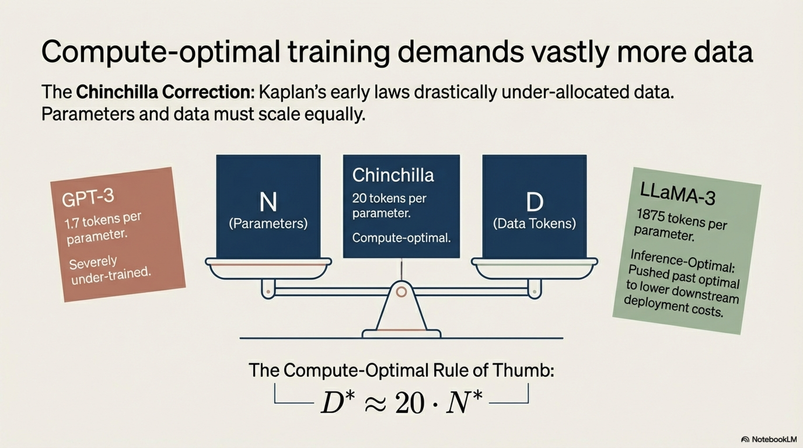


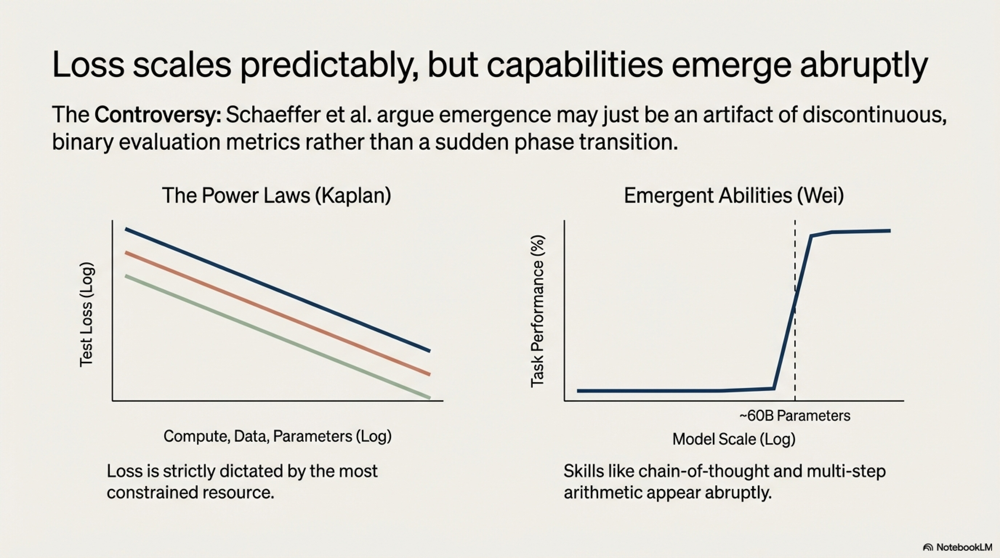


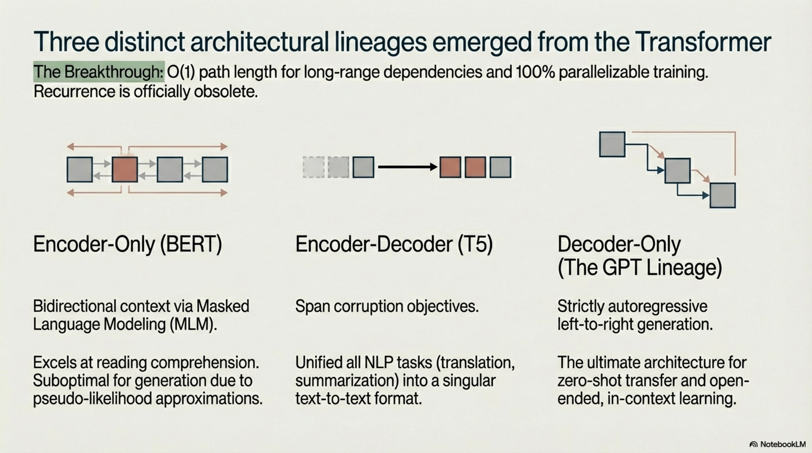

```
2017 ──── Transformer (Vaswani et al.)
  │         • Self-attention replaces recurrence
  │         • Sinusoidal positional encoding
  │
2018 ──── GPT-1 (Radford et al.) / BERT (Devlin et al.)
  │         • Pre-train → Fine-tune paradigm
  │         • Autoregressive vs. masked objectives
  │
2019 ──── GPT-2 / RoBERTa / T5
  │         • Zero-shot transfer via prompting
  │         • Text-to-text unification
  │         • Training recipe optimization
  │
2020 ──── GPT-3 (Brown et al.) / Scaling Laws (Kaplan et al.)
  │         • In-context learning at scale
  │         • Power-law characterization
  │
2021 ──── RoPE / Codex / FLAN
  │         • Rotary position embeddings
  │         • Code generation, instruction tuning
  │
2022 ──── Chinchilla / PaLM / InstructGPT / ChatGPT
  │         • Compute-optimal scaling
  │         • SwiGLU, Parallel attention+FFN, MQA
  │         • RLHF alignment
  │
2023 ──── LLaMA / Mistral / Mixtral / DPO
  │         • Open-weight high-quality models
  │         • GQA, Sliding window attention
  │         • Sparse MoE at scale
  │         • Simplified alignment without RL
  │
2024 ──── LLaMA-3 / DeepSeek-V2/V3 / Qwen-2.5
  │         • Extreme over-training (15T+ tokens)
  │         • Multi-head Latent Attention (MLA)
  │         • 128K+ context lengths via YaRN/NTK-aware interpolation
  │
2025 ──── DeepSeek-R1 / Reasoning models
            • Reinforcement learning for chain-of-thought
            • Test-time compute scaling
            • Verifiable reward models
```

### 5.8 Pseudo-Algorithm: Full LLM Development Pipeline

```
ALGORITHM: EndToEndLLMDevelopmentPipeline

INPUT:
    Raw_Data: {web crawls, books, code repositories, curated datasets}
    C_budget: total compute budget in FLOPs
    Target_capabilities: {instruction following, reasoning, multilinguality, ...}

OUTPUT:
    π_aligned: deployed, aligned language model ready for inference

PROCEDURE:

    ═══════════════════════════════════════════════
    PHASE 1: DATA ENGINEERING
    ═══════════════════════════════════════════════
    1.1  COLLECT raw text from diverse sources
    1.2  DEDUPLICATE:
            - Exact: hash-based (SHA-256 per document)
            - Near-duplicate: MinHash + LSH (Jaccard threshold τ ≈ 0.8)
    1.3  FILTER for quality:
            - Language identification (fastText classifier, confidence > 0.65)
            - Perplexity filter: remove documents with PPL > threshold
              under a small reference LM (indicates noise/gibberish)
            - Heuristic rules: min document length, max symbol ratio,
              porn/toxicity classifiers
    1.4  TOKENIZE using BPE/SentencePiece:
            - Train tokenizer on representative subset
            - Target vocabulary size |V| ∈ {32K, 64K, 128K}
            - Ensure byte-fallback for full Unicode coverage
    1.5  DETERMINE domain mixture weights:
            - e.g., {web: 67%, code: 10%, books: 8%, papers: 5%,
                     wiki: 5%, math: 3%, conversation: 2%}
            - Weights may be tuned via small-scale ablations or
              DoReMi (Xie et al., 2023) data reweighting
    1.6  SHUFFLE and package into training shards

    ═══════════════════════════════════════════════
    PHASE 2: ARCHITECTURE & HYPERPARAMETER SELECTION
    ═══════════════════════════════════════════════
    2.1  COMPUTE (N*, D*) via scaling law model (Algorithm 4.6)
    2.2  SELECT architecture:
            - Decoder-only transformer
            - Pre-RMSNorm
            - SwiGLU FFN with d_ff = (2/3) · 4 · d_model
            - GQA with G KV-groups
            - RoPE with base θ = 500,000
            - No bias terms
    2.3  DETERMINE layer count L, d_model, n_heads, n_kv_heads
         such that total parameters ≈ N*
    2.4  SET training hyperparameters:
            - Optimizer: AdamW(β₁=0.9, β₂=0.95, ε=1e-8, λ=0.1)
            - LR schedule: linear warmup (2000 steps) → cosine decay to 0.1·η_max
            - η_max determined by μP (Yang et al., 2022) or grid search
              at small proxy scale
            - Batch size ramp: start small, increase to final B
            - Sequence length: T = 4096 or 8192

    ═══════════════════════════════════════════════
    PHASE 3: PRE-TRAINING
    ═══════════════════════════════════════════════
    3.1  INITIALIZE parameters:
            - Embeddings: N(0, σ_emb), σ_emb = 1/√d_model
            - Attention/FFN weights: N(0, σ_layer), σ_layer = 1/√(2·L·d_model)
              (depth-scaled initialization)
    3.2  DISTRIBUTE across GPU/TPU cluster:
            - Tensor parallelism (TP): split weight matrices across devices
            - Pipeline parallelism (PP): split layers across stages
            - Data parallelism (DP): replicate model, shard data
            - Sequence parallelism (SP): shard activations along sequence dim
            - FSDP / ZeRO-3: shard optimizer states + gradients + params
    3.3  TRAIN for D* tokens:
            FOR each mini-batch:
                - Forward pass: compute logits (Algorithm 3.5.8)
                - Compute cross-entropy loss
                - Backward pass: gradient computation
                - All-reduce gradients across DP ranks
                - Gradient clipping: clip global norm to max_norm (typically 1.0)
                - Optimizer step
                - Log: loss, gradient norm, learning rate, throughput (tokens/sec)
            PERIODICALLY:
                - Evaluate on held-out validation set
                - Checkpoint model state
                - Monitor for loss spikes → reduce LR or skip batch

    ═══════════════════════════════════════════════
    PHASE 4: POST-TRAINING ALIGNMENT
    ═══════════════════════════════════════════════
    4.1  SUPERVISED FINE-TUNING (SFT):
            - Curate D_SFT = {(instruction, response)} pairs
              (human-written or distilled from stronger models)
            - Fine-tune with loss on response tokens only
            - Typically 1-5 epochs, lower LR (1e-5 to 5e-5)


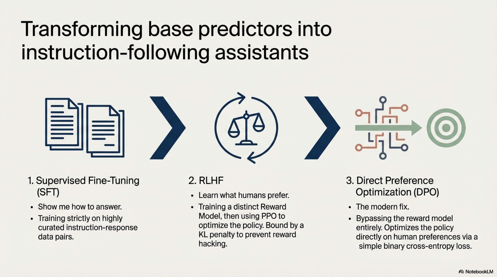

    4.2  PREFERENCE OPTIMIZATION:
         OPTION A — RLHF:
            4.2a  Train reward model R_φ on human preference data
            4.2b  Optimize π_θ via PPO against R_φ with KL constraint
         OPTION B — DPO:
            4.2a  Collect preference pairs {(x, y_w, y_l)}
            4.2b  Optimize DPO loss directly (no separate RM needed)

    4.3  SAFETY ALIGNMENT:
            - Red-teaming: adversarial prompt testing
            - Constitutional AI: self-critique and revision chains
            - Refusal training on harmful request categories

    ═══════════════════════════════════════════════
    PHASE 5: EVALUATION
    ═══════════════════════════════════════════════
    5.1  BENCHMARK SUITE:
            - Perplexity on held-out corpora
            - Knowledge: MMLU, ARC, TriviaQA
            - Reasoning: GSM8K, MATH, BBH
            - Code: HumanEval, MBPP
            - Safety: TruthfulQA, toxicity benchmarks
    5.2  ABLATION STUDIES to validate architectural/data choices
    5.3  CALIBRATION ANALYSIS: reliability diagrams, ECE
    5.4  HUMAN EVALUATION: pairwise preference, Chatbot Arena

    ═══════════════════════════════════════════════
    PHASE 6: DEPLOYMENT
    ═══════════════════════════════════════════════
    6.1  QUANTIZATION: FP16 → INT8 → INT4 (GPTQ, AWQ, GGUF)
    6.2  INFERENCE OPTIMIZATION:
            - KV-cache with PagedAttention (vLLM)
            - Continuous batching
            - Speculative decoding with smaller draft model
    6.3  SERVING INFRASTRUCTURE:
            - Auto-scaling, load balancing
            - Output monitoring, guardrails

    RETURN π_aligned
```

### 5.9 Comparative Analysis of Major LLM Families


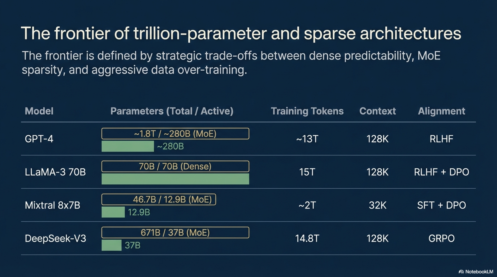


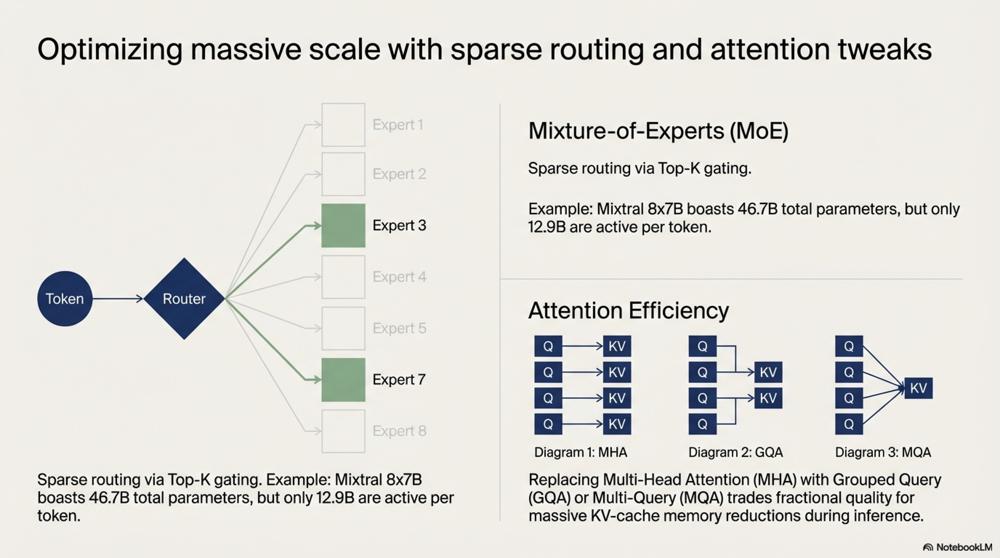

| Dimension | GPT-4 | PaLM-2 | LLaMA-3 70B | Mixtral 8x7B | DeepSeek-V3 |
|---|---|---|---|---|---|
| **Architecture** | Decoder-only (rumored MoE) | Decoder-only | Decoder-only | Sparse MoE | Sparse MoE |
| **Total Params** | ~1.8T (rumored) | ~340B | 70B | 46.7B | 671B |
| **Active Params** | ~280B (rumored) | ~340B | 70B | 12.9B | 37B |
| **Training Tokens** | ~13T (rumored) | ~3.6T | 15T | ~2T | 14.8T |
| **Context Length** | 128K | 32K | 128K | 32K | 128K |
| **Attention** | GQA (likely) | MQA | GQA | GQA | Multi-head Latent Attention |
| **Position Encoding** | Unknown | RoPE | RoPE | RoPE | RoPE |
| **FFN** | Unknown | SwiGLU | SwiGLU | SwiGLU | DeepSeekMoE + SwiGLU |
| **Alignment** | RLHF | RLHF | RLHF + DPO | SFT + DPO | GRPO |

---

## Summary of Key Theoretical Insights

1. **A language model is a probability distribution over token sequences**, most naturally factorized autoregressively via the chain rule, with each conditional parameterized by a neural network.

2. **The evolution from $n$-grams to transformers** is characterized by progressively relaxing the fixed-context assumption ($n$-grams → RNNs → attention), replacing discrete representations with distributed embeddings, and eliminating sequential computation bottlenecks.


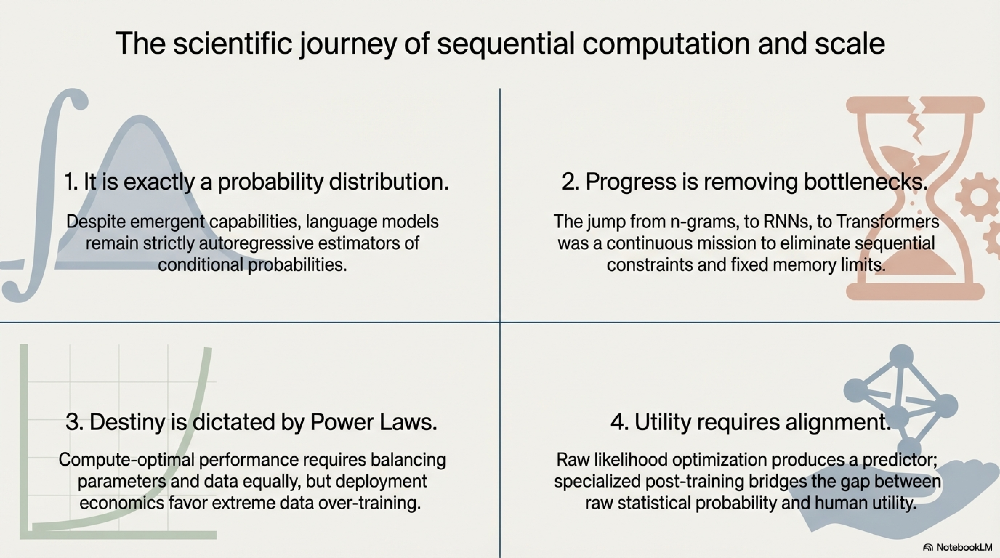

3. **Scaling laws** reveal that loss follows power-law relationships with model size, data, and compute; the Chinchilla analysis established that **data and parameters should scale roughly equally** with compute budget, though inference-cost considerations push toward smaller, over-trained models.

4. **The evolution of LLMs** progressed from the pre-train/fine-tune paradigm (BERT, GPT-1) through in-context learning at scale (GPT-3), compute-optimal training (Chinchilla), open-weight democratization (LLaMA), sparse scaling (MoE), and alignment (RLHF/DPO)—each representing a fundamental scientific or engineering insight that reshaped the field.