# Multilingual and Multimodal Large Language Models: A Rigorous Treatment

---

## 1. Multilingual Models and Cross-Lingual Learning

### 1.1 Formal Definition

A **multilingual language model** is a parameterized conditional distribution $M_\theta$ trained over a union of corpora spanning $L$ distinct languages $\{\ell_1, \ell_2, \ldots, \ell_L\}$, such that the model acquires a **shared representational manifold** capable of processing, generating, and transferring knowledge across languages without per-language architectural specialization.

Let $\mathcal{V} = \bigcup_{i=1}^{L} \mathcal{V}_{\ell_i}$ denote the unified multilingual vocabulary (with significant overlap for shared scripts and subword units). The model learns:

$$
P_\theta(x_t \mid x_{<t}) = \text{softmax}\!\left( W_o \cdot h_t + b_o \right), \quad x_t \in \mathcal{V}, \quad h_t = f_\theta(x_1, \ldots, x_{t-1})
$$

where $f_\theta$ is a shared transformer backbone whose internal representations are **language-agnostic** at intermediate layers while retaining **language-specific surface features** at input/output boundaries.

### 1.2 Cross-Lingual Transfer: Formal Framework

**Cross-lingual transfer** is the phenomenon whereby knowledge acquired from a **source language** $\ell_s$ (typically high-resource) generalizes to a **target language** $\ell_t$ (typically low-resource) **without any target-language task supervision**.

#### 1.2.1 Zero-Shot Cross-Lingual Transfer

Given a task $\mathcal{T}$ with labeled data only in $\ell_s$:

$$
\text{Train:} \quad \theta^* = \arg\min_\theta \; \mathbb{E}_{(x, y) \sim \mathcal{D}_{\mathcal{T}}^{\ell_s}} \left[ \mathcal{L}(M_\theta(x), y) \right]
$$

$$
\text{Evaluate:} \quad \text{Perf}(\ell_t) = \mathbb{E}_{(x, y) \sim \mathcal{D}_{\mathcal{T}}^{\ell_t}} \left[ \mathcal{S}(M_{\theta^*}(x), y) \right]
$$

The **transfer gap** is:

$$
\Delta_{\text{transfer}}(\ell_s \to \ell_t) = \text{Perf}(\ell_s) - \text{Perf}(\ell_t) \geq 0
$$

Minimizing $\Delta_{\text{transfer}}$ across all language pairs is a core objective.

#### 1.2.2 Theoretical Basis: Shared Representational Geometry

Cross-lingual transfer succeeds when the model's internal representations satisfy **approximate isometric alignment** across languages. For two languages $\ell_i, \ell_j$, let $\mathbf{H}^{\ell_i}, \mathbf{H}^{\ell_j} \in \mathbb{R}^{n \times d}$ denote the hidden-state matrices for semantically parallel sentences. Transfer requires:

$$
\exists \; \mathbf{R} \in O(d) \quad \text{(orthogonal)} \quad \text{s.t.} \quad \| \mathbf{H}^{\ell_i} \mathbf{R} - \mathbf{H}^{\ell_j} \|_F^2 < \epsilon
$$

This is the **Procrustes alignment** condition. The degree to which this holds determines transfer quality.

### 1.3 Mechanisms Enabling Multilingual Representations

#### 1.3.1 Shared Subword Vocabulary

Multilingual tokenization (e.g., SentencePiece, BPE over concatenated multilingual corpora) produces a vocabulary $\mathcal{V}$ containing:

- **Anchor tokens**: subwords shared across languages (numerals, punctuation, borrowed words, shared morphemes) that serve as implicit alignment bridges
- **Language-specific tokens**: script-unique subwords

The **anchor token hypothesis** states that shared tokens create representational coupling:

$$
\text{If } \; v \in \mathcal{V}_{\ell_i} \cap \mathcal{V}_{\ell_j}, \quad \text{then } \; \mathbf{e}(v) \text{ is trained on contexts from both } \ell_i \text{ and } \ell_j
$$

This forces the embedding space to be at least locally aligned around anchor tokens.

#### 1.3.2 Structural Similarity Exploitation

Languages sharing syntactic universals (subject-verb-object order, dependency structures) provide **structural regularities** that the transformer's attention patterns capture across languages:

$$
A^{(l)}_{ij} = \text{softmax}\!\left(\frac{Q^{(l)} (K^{(l)})^\top}{\sqrt{d_k}}\right)_{ij}
$$

At deeper layers $l$, attention patterns converge across languages for syntactically equivalent constructions, creating **language-universal structural representations**.

#### 1.3.3 Capacity Allocation and the Curse of Multilinguality

The **curse of multilinguality** (Conneau et al., 2020) formalizes the tradeoff between language coverage and per-language capacity:

$$
\text{Perf}(\ell_i) \propto \frac{|\theta|}{L} \cdot \left(\frac{|\mathcal{D}^{\ell_i}|}{|\mathcal{D}|}\right)^\alpha, \quad \alpha \in (0, 1)
$$

For fixed model size $|\theta|$, adding more languages $L$ degrades per-language performance (especially for high-resource languages). The **critical capacity ratio**:

$$
\rho = \frac{|\theta|}{L \cdot \bar{C}}
$$

where $\bar{C}$ is the average per-language complexity. When $\rho < \rho_{\text{crit}}$, catastrophic interference dominates positive transfer.

### 1.4 Training Objectives for Multilingual Models

#### 1.4.1 Multilingual Masked Language Modeling (MMLM)

$$
\mathcal{L}_{\text{MMLM}} = -\mathbb{E}_{\ell \sim P(\mathcal{L})} \; \mathbb{E}_{x \sim \mathcal{D}^\ell} \left[ \sum_{i \in \mathcal{M}} \log P_\theta(x_i \mid x_{\setminus \mathcal{M}}) \right]
$$

where $\mathcal{M}$ is the masked token set, and $P(\mathcal{L})$ is the language sampling distribution.

#### 1.4.2 Translation Language Modeling (TLM)

Extends MMLM to parallel sentence pairs $(x^{\ell_i}, x^{\ell_j})$:

$$
\mathcal{L}_{\text{TLM}} = -\sum_{i \in \mathcal{M}} \log P_\theta\!\left(x_i \mid [x^{\ell_i}_{\setminus \mathcal{M}}; x^{\ell_j}_{\setminus \mathcal{M}}]\right)
$$

By masking tokens in both languages and providing cross-lingual context, TLM **explicitly forces alignment** between language representations.

#### 1.4.3 Language Sampling Strategy

The sampling probability for language $\ell_i$ with corpus size $n_i$ follows the **exponential smoothing** formula:

$$
p(\ell_i) = \frac{n_i^\alpha}{\sum_{j=1}^{L} n_j^\alpha}, \qquad \alpha \in [0, 1]
$$

- $\alpha = 1$: proportional sampling (dominant languages dominate)
- $\alpha = 0$: uniform sampling (all languages equally weighted)
- **Typical choice**: $\alpha \approx 0.7$ (balances high-resource fluency with low-resource exposure)

### 1.5 Pseudo-Algorithm: Multilingual Model Training with Cross-Lingual Alignment

```
ALGORITHM: MultilingualModelTraining

INPUT:
    {D^ℓ_i}_{i=1}^{L}     — Monolingual corpora for L languages
    D_parallel              — Parallel sentence pairs (optional):
                              {(x^ℓ_a, x^ℓ_b)} for aligned language pairs
    α                       — Language sampling smoothing exponent (e.g., 0.7)
    tokenizer_config        — SentencePiece config with target vocab size |V|
    model_config            — Transformer architecture hyperparameters:
                              {d_model, n_heads, n_layers, d_ff}
    T                       — Total training steps
    objectives              — Subset of {MMLM, TLM, CLM, CROSS_LINGUAL_CONTRAST}
    batch_size              — Tokens per batch B

OUTPUT:
    θ*                      — Trained multilingual model parameters
    tokenizer               — Multilingual tokenizer

PROCEDURE:

    1. TOKENIZER CONSTRUCTION:
       corpus_combined ← ∅
       FOR each ℓ_i, i = 1 TO L:
           // Subsample to prevent high-resource dominance in vocab
           sample_size_i ← min(|D^ℓ_i|, S_max)
           corpus_combined ← corpus_combined ∪ Subsample(D^ℓ_i, sample_size_i)
       
       tokenizer ← TrainSentencePiece(corpus_combined, vocab_size=|V|,
                                       model_type=UNIGRAM_OR_BPE,
                                       character_coverage=0.9995)
       
       // QUALITY CHECK: Measure fertility (tokens per word) per language
       FOR each ℓ_i:
           fertility_i ← AverageFertility(tokenizer, D^ℓ_i)
           // fertility = avg number of subwords per whitespace word
           // High fertility (>3) for ℓ_i → under-represented in vocab
           IF fertility_i > threshold_fert:
               LOG warning: "Language ℓ_i under-represented in tokenizer"

    2. COMPUTE LANGUAGE SAMPLING DISTRIBUTION:
       FOR i = 1 TO L:
           n_i ← |D^ℓ_i|    // Number of tokens in corpus for ℓ_i
       
       FOR i = 1 TO L:
           p(ℓ_i) ← n_i^α / Σ_{j=1}^{L} n_j^α

    3. INITIALIZE MODEL:
       θ ← InitializeTransformer(model_config)
       // Xavier/He initialization with language-agnostic parameterization
       // Single shared encoder (no language-specific parameters)

    4. TRAINING LOOP:
       FOR step = 1 TO T:

          a. SAMPLE LANGUAGE AND DATA:
             ℓ ← Sample(p(ℓ_1), ..., p(ℓ_L))
             batch_mono ← SampleBatch(D^ℓ, batch_size=B)

          b. CONSTRUCT TRAINING OBJECTIVE:
             loss ← 0

             IF MMLM ∈ objectives:
                 // Mask 15% of tokens: 80% [MASK], 10% random, 10% unchanged
                 batch_masked, targets ← ApplyMLMmasking(batch_mono, mask_prob=0.15)
                 logits ← M_θ(batch_masked)
                 loss ← loss + CrossEntropy(logits[masked_positions], targets)

             IF TLM ∈ objectives AND D_parallel ≠ ∅:
                 // Sample parallel pair involving ℓ or random pair
                 (x^a, x^b) ← SampleParallelPair(D_parallel)
                 concat_pair ← [x^a ; SEPARATOR ; x^b]
                 pair_masked, targets ← ApplyMLMmasking(concat_pair, mask_prob=0.15)
                 logits ← M_θ(pair_masked)
                 loss ← loss + CrossEntropy(logits[masked_positions], targets)

             IF CLM ∈ objectives:
                 // Causal language modeling (for decoder/autoregressive models)
                 logits ← M_θ.CausalForward(batch_mono)
                 loss ← loss + AutoregressiveLoss(logits, batch_mono)

             IF CROSS_LINGUAL_CONTRAST ∈ objectives AND D_parallel ≠ ∅:
                 // Contrastive alignment of parallel sentence representations
                 (x^a, x^b) ← SampleParallelBatch(D_parallel, batch_size=B)
                 h_a ← MeanPool(M_θ.Encode(x^a))    // [B, d_model]
                 h_b ← MeanPool(M_θ.Encode(x^b))    // [B, d_model]
                 
                 // InfoNCE loss
                 sim_matrix ← (h_a · h_b^T) / τ     // [B, B]
                 labels ← DiagonalIndices(B)          // positive pairs on diagonal
                 loss ← loss + CrossEntropy(sim_matrix, labels)

          c. GRADIENT UPDATE:
             g ← ∇_θ loss
             g ← GradientClip(g, max_norm=1.0)
             θ ← θ - η(step) · Adam(g, θ)

          d. PERIODIC EVALUATION (every E steps):
             // Evaluate on held-out data across languages
             FOR each ℓ_i:
                 ppl_i ← Perplexity(M_θ, D_val^{ℓ_i})
             
             // Evaluate cross-lingual transfer on downstream task
             // (fine-tune on English NER, evaluate on all languages)
             IF step % (10·E) = 0:
                 transfer_scores ← EvaluateZeroShotTransfer(M_θ, task=NER,
                                       source=en, targets={ℓ_1,...,ℓ_L})
                 LOG transfer_scores

    5. POST-TRAINING ALIGNMENT VERIFICATION:
       // Measure representational alignment via Procrustes distance
       FOR each language pair (ℓ_i, ℓ_j):
           H_i, H_j ← ExtractHiddenStates(M_θ, ParallelSentences(ℓ_i, ℓ_j))
           R*, dist ← OrthogonalProcrustes(H_i, H_j)
           alignment_score(ℓ_i, ℓ_j) ← 1 - dist / normalization_constant

    6. RETURN θ*, tokenizer
```

---

## 2. Multimodal Language Models

### 2.1 Definition

A **multimodal language model** is a unified generative or discriminative model $M_\theta$ that jointly processes, reasons over, and generates content across $K$ distinct modalities $\{m_1, m_2, \ldots, m_K\}$ (e.g., text, image, audio, video, point clouds), leveraging a **shared latent representational space** in which cross-modal semantic correspondences are preserved.

Formally, let $\mathcal{X}^{m_k}$ denote the input space for modality $m_k$. The multimodal model learns a joint distribution:

$$
P_\theta(y \mid x^{m_1}, x^{m_2}, \ldots, x^{m_K}) = P_\theta\!\left(y \mid \text{Fuse}\!\left(\phi_1(x^{m_1}), \phi_2(x^{m_2}), \ldots, \phi_K(x^{m_K})\right)\right)
$$

where $\phi_k: \mathcal{X}^{m_k} \to \mathbb{R}^{n_k \times d}$ is a **modality-specific encoder** projecting raw input into a sequence of $d$-dimensional token representations, and $\text{Fuse}(\cdot)$ is the **cross-modal fusion mechanism**.

### 2.2 Architectural Taxonomy

#### 2.2.1 Type A: Modality-Specific Encoders + Fusion + LLM Decoder

The dominant paradigm (LLaVA, Flamingo, Gemini-class). Each modality has a dedicated encoder; outputs are projected into the LLM's embedding space via **alignment projectors**, then processed by the frozen or fine-tuned LLM.

$$
h_{\text{vision}} = W_{\text{proj}} \cdot \text{ViT}_\psi(I) + b_{\text{proj}}, \quad h_{\text{vision}} \in \mathbb{R}^{N_v \times d_{\text{LLM}}}
$$

$$
h_{\text{text}} = \text{Embed}(x_{\text{text}}), \quad h_{\text{text}} \in \mathbb{R}^{N_t \times d_{\text{LLM}}}
$$

$$
h_{\text{combined}} = \text{Interleave}(h_{\text{vision}}, h_{\text{text}})
$$

$$
P_\theta(y \mid I, x_{\text{text}}) = \text{LLM}_\theta(h_{\text{combined}})
$$

#### 2.2.2 Type B: Early Fusion (Tokenize Everything)

All modalities are tokenized into a **common discrete token space** and processed by a single transformer. Images are converted to visual tokens via VQ-VAE or patch tokenization; audio via codec tokens.

$$
z = [z_{\text{text}}^1, \ldots, z_{\text{text}}^{N_t}, z_{\text{image}}^1, \ldots, z_{\text{image}}^{N_v}, z_{\text{audio}}^1, \ldots, z_{\text{audio}}^{N_a}]
$$

$$
P_\theta(z_{i+1} \mid z_{\leq i}) = \text{Transformer}_\theta(z_{\leq i})
$$

This is the **most unified** approach (Chameleon, unified I/O models).

#### 2.2.3 Type C: Cross-Attention Fusion (Perceiver / Flamingo-Style)

Introduce **learnable query tokens** $\mathbf{Q} \in \mathbb{R}^{N_q \times d}$ that attend into modality-specific encoder outputs via cross-attention:

$$
\hat{h}_{\text{query}} = \text{CrossAttn}\!\left(\mathbf{Q}, \; K = \phi_k(x^{m_k}), \; V = \phi_k(x^{m_k})\right)
$$

$$
\hat{h}_{\text{query}} = \text{softmax}\!\left(\frac{\mathbf{Q} W_Q \cdot (\phi_k(x^{m_k}) W_K)^\top}{\sqrt{d_k}}\right) \cdot \phi_k(x^{m_k}) W_V
$$

The $N_q$ output tokens (typically $N_q \ll N_v$) serve as a **compressed multimodal representation** fed into the LLM. This provides a **bottleneck** that controls computational cost independent of visual resolution.

### 2.3 Cross-Modal Alignment

#### 2.3.1 Contrastive Alignment (CLIP-Style)

Pre-align modality encoders via contrastive loss over paired data $\{(x^{m_i}, x^{m_j})\}$:

$$
\mathcal{L}_{\text{CLIP}} = -\frac{1}{2B} \sum_{k=1}^{B} \left[ \log \frac{\exp(\text{sim}(h_k^i, h_k^j) / \tau)}{\sum_{l=1}^{B} \exp(\text{sim}(h_k^i, h_l^j) / \tau)} + \log \frac{\exp(\text{sim}(h_k^j, h_k^i) / \tau)}{\sum_{l=1}^{B} \exp(\text{sim}(h_k^j, h_l^i) / \tau)} \right]
$$

where $\text{sim}(a, b) = \frac{a^\top b}{\|a\| \|b\|}$ is cosine similarity, $\tau$ is a learned temperature, and $B$ is the batch size.

#### 2.3.2 Generative Alignment

Train the LLM to **generate text conditioned on non-text modalities**, using next-token prediction:

$$
\mathcal{L}_{\text{gen}} = -\sum_{t=1}^{|y|} \log P_\theta(y_t \mid y_{<t}, \phi(x^{\text{image}}))
$$

This implicitly aligns the visual representation $\phi(x^{\text{image}})$ with the LLM's text embedding space by gradient flow through the projection layer $W_{\text{proj}}$.

### 2.4 Mathematical Treatment: Information-Theoretic View

The fundamental objective of a multimodal model is to maximize the **mutual information** between representations of semantically corresponding cross-modal inputs:

$$
\max_\theta \; I_\theta(Z^{m_i}; Z^{m_j}) = H(Z^{m_i}) - H(Z^{m_i} \mid Z^{m_j})
$$

where $Z^{m_k} = \phi_k(X^{m_k})$ is the encoded representation. Simultaneously, the model must preserve **modality-specific information** necessary for generation:

$$
\max_\theta \; I_\theta(Z^{m_k}; X^{m_k}) \quad \forall \; k
$$

This creates a **tension**: maximizing cross-modal alignment encourages modality-invariant features, while preserving generative fidelity requires modality-specific detail. The **information bottleneck** framework formalizes this tradeoff:

$$
\max_\theta \left[ I(Z; Y) - \beta \sum_{k} I(Z; X^{m_k} \mid \text{task-irrelevant features}) \right]
$$

### 2.5 Pseudo-Algorithm: Multimodal LLM Construction and Training

```
ALGORITHM: MultimodalLLMTraining

INPUT:
    LLM_θ                  — Pretrained language model (e.g., LLaMA, Mistral)
                             with parameters θ_LLM
    VisionEncoder_ψ        — Pretrained vision encoder (e.g., ViT-L/14 from CLIP)
                             with parameters ψ
    AudioEncoder_φ         — Pretrained audio encoder (e.g., Whisper encoder)
                             with parameters φ (optional)
    D_align                — Modality-text alignment data:
                             {(image_i, caption_i)} or {(audio_i, transcript_i)}
    D_instruct             — Multimodal instruction-following data:
                             {(image_i, question_i, answer_i)}
    proj_config             — Projection module architecture:
                             ∈ {LINEAR, MLP_2LAYER, QFORMER, PERCEIVER_RESAMPLER}
    training_stages         — Ordered stages of training
    freeze_schedule         — Which components are frozen per stage

OUTPUT:
    θ*_complete             — Fully trained multimodal model parameters
                             including θ_LLM, ψ, φ, θ_proj

PROCEDURE:

    1. ARCHITECTURE CONSTRUCTION:

       a. VISION PROJECTION MODULE:
          IF proj_config = LINEAR:
              W_v ∈ R^{d_vision × d_LLM}
              Proj_vision(h) = h · W_v
          
          ELSE IF proj_config = MLP_2LAYER:
              Proj_vision(h) = GELU(h · W_1 + b_1) · W_2 + b_2
              W_1 ∈ R^{d_vision × d_hidden}, W_2 ∈ R^{d_hidden × d_LLM}
          
          ELSE IF proj_config = PERCEIVER_RESAMPLER:
              Q_learnable ∈ R^{N_q × d_LLM}     // N_q learned query tokens
              FOR layer = 1 TO L_perceiver:
                  Q ← Q + CrossAttention(Q, KV=h_vision)
                  Q ← Q + FFN(Q)
              Proj_vision(h) = Q    // Output: N_q tokens in LLM space

       b. AUDIO PROJECTION MODULE (if applicable):
          Analogous to vision with appropriate dimensionality adaptation
          Proj_audio: R^{d_audio} → R^{d_LLM}

       c. MULTIMODAL INPUT ASSEMBLY:
          // For input (image I, text prompt x_text):
          h_vis ← Proj_vision(VisionEncoder_ψ(I))    // [N_v, d_LLM]
          h_txt ← LLM_θ.Embed(x_text)                // [N_t, d_LLM]
          
          // Special token interleaving:
          h_input ← [BOS, , h_vis_1, ..., h_vis_{N_v}, </IMG>,
                      h_txt_1, ..., h_txt_{N_t}]
          //  and </IMG> are special delimiter tokens

    2. STAGE 1 — MODALITY ALIGNMENT PRETRAINING:
       // Goal: Align vision features to LLM's text embedding space
       // Strategy: Train ONLY projection module; freeze everything else

       Freeze(LLM_θ)
       Freeze(VisionEncoder_ψ)
       Unfreeze(Proj_vision)    // Only trainable component

       FOR step = 1 TO T_stage1:
           (I, caption) ← SampleBatch(D_align, batch_size=B)
           
           h_vis ← Proj_vision(VisionEncoder_ψ(I))
           h_input ← AssembleMultimodalInput(h_vis, Embed(caption))
           
           // Autoregressive loss on caption tokens only
           // (do NOT compute loss on image tokens or prompt tokens)
           logits ← LLM_θ.Forward(h_input)
           loss ← -Σ_{t ∈ caption_positions} log P(caption_t | context_{<t})
           
           ∇_{θ_proj} loss → Update(θ_proj, optimizer=AdamW, lr=1e-3)

       // VALIDATION:
       // Check that Proj_vision output lies within the LLM's
       // representational manifold by measuring cosine similarity
       // distribution between projected visual tokens and text embeddings

    3. STAGE 2 — MULTIMODAL INSTRUCTION TUNING:
       // Goal: Enable instruction-following over multimodal inputs
       // Strategy: Fine-tune LLM + projection; optionally unfreeze vision encoder

       Unfreeze(LLM_θ)           // Fine-tune LLM
       Unfreeze(Proj_vision)     // Continue adapting projection
       // VisionEncoder: freeze or unfreeze last K layers depending on budget
       IF full_finetune_vision:
           Unfreeze(VisionEncoder_ψ, last_k_layers=K)
       ELSE:
           Freeze(VisionEncoder_ψ)

       FOR step = 1 TO T_stage2:
           (I, question, answer) ← SampleBatch(D_instruct, batch_size=B)
           
           h_vis ← Proj_vision(VisionEncoder_ψ(I))
           prompt ← FormatInstructionPrompt(question)
           h_input ← AssembleMultimodalInput(h_vis, Embed(prompt + answer))
           
           logits ← LLM_θ.Forward(h_input)
           
           // Loss on ANSWER tokens only (not image or question)
           loss ← -Σ_{t ∈ answer_positions} log P(answer_t | context_{<t})
           
           ∇_{θ_trainable} loss → Update(θ_trainable, optimizer=AdamW, lr=2e-5)

    4. (OPTIONAL) STAGE 3 — MULTIMODAL RLHF:
       // Align multimodal outputs with human preferences
       
       // 4a. Train multimodal reward model R_φ:
       //     R_φ(image, question, response) → scalar
       //     Trained on human preference pairs:
       //     {(I, q, y_w, y_l)} where y_w preferred over y_l
       //     Loss: -log σ(R_φ(I,q,y_w) - R_φ(I,q,y_l))

       // 4b. PPO/DPO optimization:
       //     Optimize policy M_θ to maximize R_φ
       //     with KL penalty against reference model

    5. RETURN θ*_complete = {θ_LLM, ψ, φ, θ_proj}
```

### 2.6 Resolution and Token Budget Analysis

A critical design consideration is the **visual token budget** — the number of tokens $N_v$ representing an image:

For a ViT with patch size $p$ and image resolution $H \times W$:

$$
N_v = \frac{H \times W}{p^2}
$$

For example, ViT-L/14 at 336×336: $N_v = 336^2 / 14^2 = 576$ tokens.

The computational cost of cross-modal attention scales as:

$$
\text{Cost}_{\text{attn}} = O\!\left((N_v + N_t)^2 \cdot d_{\text{model}}\right)
$$

For high-resolution images ($N_v > 2000$), this becomes prohibitive. **Compression strategies**:

| **Method** | **Mechanism** | **Output Tokens** |
|---|---|---|
| Perceiver Resampler | Learned queries cross-attend to visual features | Fixed $N_q$ (e.g., 64) |
| Average Pooling | Spatial pooling of ViT features | Reduced $N_v' < N_v$ |
| Adaptive Tokenization | Dynamic resolution based on image complexity | Variable $N_v(I)$ |
| Tile-and-Merge | Split image into tiles, process independently, aggregate | $\sum_k N_v^{(k)}$ |

---

## 3. Training Strategies & Data Preprocessing

### 3.1 Data Preprocessing for Multilingual Models

#### 3.1.1 Corpus Curation Pipeline

```
ALGORITHM: MultilingualCorpusCuration

INPUT:
    raw_web_crawl           — Raw web scrape (CommonCrawl-scale)
    language_id_model       — FastText or CLD3 language identification model
    quality_classifier      — Trained document quality classifier
    dedup_config            — Deduplication parameters (MinHash config)
    target_languages        — Set of L target languages

OUTPUT:
    {D^ℓ_i}_{i=1}^{L}      — Cleaned, deduplicated per-language corpora
    statistics              — Per-language token counts, quality distributions

PROCEDURE:

    1. LANGUAGE IDENTIFICATION:
       FOR each document d ∈ raw_web_crawl:
           ℓ_d, conf_d ← language_id_model.Predict(d)
           IF conf_d < threshold_lang (e.g., 0.5):
               DISCARD d    // Ambiguous language
           IF ℓ_d ∉ target_languages:
               DISCARD d
           AssignToCorpus(d, ℓ_d)

    2. DOCUMENT-LEVEL QUALITY FILTERING:
       FOR each language ℓ_i:
           FOR each d ∈ D_raw^{ℓ_i}:
               // Heuristic filters:
               IF FractionAlphanumeric(d) < 0.6: DISCARD d
               IF MeanWordLength(d) < 3 OR > 45: DISCARD d
               IF FractionDuplicateLines(d) > 0.3: DISCARD d
               IF ContainsBadwords(d, badword_list^{ℓ_i}): FLAG or DISCARD d
               IF FractionUppercase(d) > 0.5: DISCARD d

               // Model-based quality scoring:
               q_d ← quality_classifier.Score(d)
               IF q_d < quality_threshold: DISCARD d

    3. DEDUPLICATION:
       FOR each language ℓ_i:
           // Exact deduplication: hash-based
           D^{ℓ_i} ← RemoveExactDuplicates(D^{ℓ_i}, hash=SHA256)

           // Near-deduplication: MinHash + LSH
           // Compute MinHash signatures for each document
           signatures ← ComputeMinHash(D^{ℓ_i}, num_hashes=128, shingle_size=5)
           clusters ← LSHClustering(signatures, similarity_threshold=0.8)
           FOR each cluster:
               // Retain only the highest-quality document per cluster
               keeper ← argmax_{d ∈ cluster} quality_classifier.Score(d)
               REMOVE (cluster \ {keeper}) from D^{ℓ_i}

    4. SENSITIVE CONTENT AND PII REMOVAL:
       FOR each language ℓ_i:
           FOR each d ∈ D^{ℓ_i}:
               d ← RemovePII(d, patterns=[EMAIL, PHONE, SSN, IP_ADDRESS])
               d ← RedactNamed Entities(d, entity_types=[PERSON_NAME, ADDRESS])
                   // Use language-specific NER where available

    5. TOKENIZATION FERTILITY ANALYSIS:
       // Ensure tokenizer treats all languages fairly
       FOR each ℓ_i:
           avg_fertility_i ← MeasureFertility(tokenizer, D^{ℓ_i})
           compression_ratio_i ← |characters| / |tokens|
           IF avg_fertility_i > 2× median fertility across languages:
               RECOMMEND: retrain tokenizer with increased ℓ_i sampling weight

    6. RETURN {D^{ℓ_i}}_{i=1}^{L}, statistics
```

### 3.2 Data Preprocessing for Multimodal Models

#### 3.2.1 Image-Text Data Pipeline

```
ALGORITHM: ImageTextDataPreprocessing

INPUT:
    raw_image_text_pairs    — {(I_i, t_i)}: raw image-caption pairs (web-scraped)
    CLIP_model              — Pretrained CLIP for filtering
    NSFW_classifier         — Safety classifier
    image_config            — {min_resolution, max_aspect_ratio, target_size}

OUTPUT:
    D_clean                 — Filtered, processed image-text dataset
    quality_scores          — Per-sample quality annotations

PROCEDURE:

    1. IMAGE QUALITY FILTERING:
       FOR each (I, t):
           IF I.width < min_resolution OR I.height < min_resolution: DISCARD
           IF I.width / I.height > max_aspect_ratio: DISCARD
           IF IsCorrupted(I): DISCARD
           IF NSFW_classifier.Score(I) > nsfw_threshold: DISCARD
           IF IsPhotographOfText(I) AND NOT desired: DISCARD

    2. TEXT QUALITY FILTERING:
       FOR each (I, t):
           IF len(t.split()) < 3: DISCARD      // Too short to be informative
           IF len(t.split()) > 300: TRUNCATE    // Excessive noise
           IF IsBoilerplate(t): DISCARD         // "Click here", "Image not found"
           IF FractionSpecialChars(t) > 0.3: DISCARD

    3. CROSS-MODAL RELEVANCE FILTERING:
       FOR each (I, t):
           sim ← CLIP_Score(I, t)
           // sim = cos(CLIP_image(I), CLIP_text(t))
           IF sim < threshold_clip (e.g., 0.25): DISCARD
           // Low similarity indicates mismatched pair
           quality_scores[(I,t)] ← sim

    4. IMAGE PREPROCESSING:
       FOR each (I, t) ∈ surviving pairs:
           I ← ResizeWithPadding(I, target_size=image_config.target_size)
           // OR: dynamic resolution bucketing
           I ← Normalize(I, mean=[0.485,0.456,0.406], std=[0.229,0.224,0.225])
           // ImageNet normalization if using pretrained ViT

    5. TEXT PREPROCESSING:
       FOR each (I, t):
           t ← NormalizeUnicode(t)
           t ← FixEncodingErrors(t)
           // Optionally: rephrase alt-text into natural language caption
           //            using LLM-based rewriting

    6. DATA BALANCING:
       // Analyze concept distribution
       concept_dist ← ComputeConceptHistogram(D_clean)
       // Upsample rare concepts, downsample dominant ones
       D_balanced ← StratifiedResampling(D_clean, concept_dist,
                                          max_oversampling_factor=5)

    7. RETURN D_clean, quality_scores
```

### 3.3 Training Strategies

#### 3.3.1 Progressive Training Paradigm

The staged approach is **critical** for stable multimodal training:

| **Stage** | **Trainable** | **Frozen** | **Data** | **Objective** | **LR** |
|---|---|---|---|---|---|
| 0 — Unimodal Pre-training | All of LLM | — | Text only | CLM | ~3e-4 |
| 1 — Modality Alignment | Projection | LLM, Vision Encoder | Paired data (image-caption) | Caption generation | ~1e-3 |
| 2 — Instruction Tuning | LLM + Projection | Vision Encoder (or partial unfreeze) | Multimodal instructions | Instruction following | ~2e-5 |
| 3 — Preference Optimization | LLM + Projection | Vision Encoder | Preference data | DPO / RLHF | ~5e-7 |

**Rationale for staging**: direct joint training causes **representation collapse** — the LLM's pretrained text knowledge degrades catastrophically before the projection module learns meaningful cross-modal mappings.

#### 3.3.2 Mixture of Training Data

For joint multilingual-multimodal training, the batch composition matters critically:

$$
\text{Batch} = \underbrace{\lambda_1 \cdot B_{\text{text-only}}}_{\text{preserve language ability}} + \underbrace{\lambda_2 \cdot B_{\text{image-text}}}_{\text{learn vision}} + \underbrace{\lambda_3 \cdot B_{\text{audio-text}}}_{\text{learn audio}} + \underbrace{\lambda_4 \cdot B_{\text{multilingual-vision}}}_{\text{cross-lingual-modal}}
$$

$$
\lambda_1 + \lambda_2 + \lambda_3 + \lambda_4 = 1
$$

The optimal mixing ratios are typically determined empirically but follow the principle:

$$
\lambda_k \propto \frac{\text{task importance}_k}{\sqrt{\text{dataset size}_k}}
$$

This **inverse-square-root scaling** prevents large datasets from dominating training dynamics.

#### 3.3.3 Resolution Scaling Strategy

$$
\text{Stage 1}: \quad \text{Low resolution (224×224)} \to N_v = 256 \text{ tokens}
$$
$$
\text{Stage 2}: \quad \text{Medium resolution (336×336)} \to N_v = 576 \text{ tokens}
$$
$$
\text{Stage 3}: \quad \text{High resolution (672×672 or dynamic)} \to N_v = 2304 \text{ tokens}
$$

Progressive resolution scaling enables learning **coarse-to-fine visual understanding** while managing computational costs. The model first learns high-level semantics, then refines spatial detail.

---

## 4. Challenges in Multilingual & Multimodal LLMs

### 4.1 The Curse of Multilinguality (Revisited with Precision)

**Formal statement**: For a model with fixed capacity $C = |\theta|$, let $\text{Perf}(\ell_i, C, L)$ denote performance on language $\ell_i$ when training over $L$ languages:

$$
\exists \; L^* \quad \text{s.t.} \quad \forall L > L^*, \quad \frac{\partial \; \text{Perf}(\ell_i, C, L)}{\partial L} < 0 \quad \text{for high-resource } \ell_i
$$

Beyond the critical threshold $L^*$, adding more languages **degrades** high-resource language performance. This stems from **parameter interference**: gradients from low-resource languages push shared parameters away from optima for high-resource languages.

**Mitigation strategies**:

| **Strategy** | **Mechanism** | **Tradeoff** |
|---|---|---|
| Scale model size | Increase $C$ so $C/L$ remains above critical threshold | Compute cost |
| Language-specific adapters | $\theta = \theta_{\text{shared}} + \Delta\theta^{\ell_i}$ per language | Parameter overhead $O(L \cdot |\Delta\theta|)$ |
| Mixture-of-Experts | Route different languages to different expert sublayers | Routing complexity, load balancing |
| Vocabulary extension | Add language-specific tokens post-hoc | Embedding matrix expansion |

### 4.2 Tokenization Inequity

Subword tokenizers trained on English-dominated corpora produce **highly unequal compression rates** across languages:

$$
\text{Fertility}(\ell) = \frac{\text{Number of subword tokens}}{\text{Number of whitespace words}}
$$

Typical measurements:

| **Language** | **Script** | **Fertility** | **Implication** |
|---|---|---|---|
| English | Latin | ~1.2 | Baseline |
| German | Latin | ~1.5 | Compound words segmented |
| Chinese | CJK | ~1.8 | Per-character tokenization |
| Myanmar | Myanmar | ~6.0 | Extreme fragmentation |
| Amharic | Ge'ez | ~8.0 | Near character-level |

**Consequences of high fertility**:
- **Context window exhaustion**: same semantic content consumes $5\times$ more tokens
- **Increased inference cost**: proportional to token count
- **Degraded performance**: model sees shorter effective context in high-fertility languages
- **Inflated pricing**: API-based models charge per token

$$
\text{Effective context length}(\ell) = \frac{C_{\max}}{\text{Fertility}(\ell)}
$$

### 4.3 Cross-Modal Alignment Degradation

**Modality gap**: Even after contrastive alignment, there exists a persistent gap between modality-specific representation clusters:

$$
\Delta_{\text{gap}} = \| \mathbb{E}[\phi_{\text{image}}(I)] - \mathbb{E}[\phi_{\text{text}}(t)] \|_2 > 0
$$

Liang et al. (2022) showed this gap exists in CLIP and persists across training. It creates a **systematic bias** in retrieval and generation tasks where one modality is preferred over another.

### 4.4 Hallucination in Multimodal Models

**Object hallucination**: the model generates text referencing objects **not present** in the input image. Formally:

$$
P_\theta(\text{"chair"} \mid I) > 0.5 \quad \text{even when no chair exists in } I
$$

This arises from **language prior dominance**: the LLM's strong text priors override weak or ambiguous visual signals:

$$
P(y \mid I, x) \approx \underbrace{P_{\text{LLM}}(y \mid x)}_{\text{language prior}} \cdot \underbrace{\frac{P(I \mid y, x)}{P(I \mid x)}}_{\text{visual likelihood ratio}}
$$

When the visual likelihood ratio is close to 1 (weak visual evidence), the language prior dominates, producing hallucinated content that is **linguistically plausible but visually unfounded**.

**CHAIR metric** (Caption Hallucination Assessment with Image Relevance):

$$
\text{CHAIR}_s = \frac{|\text{hallucinated sentences}|}{|\text{total sentences}|}
$$

$$
\text{CHAIR}_i = \frac{|\text{hallucinated objects}|}{|\text{total mentioned objects}|}
$$

### 4.5 Catastrophic Forgetting During Multimodal Adaptation

When fine-tuning a pretrained LLM for multimodal capabilities, the model risks **catastrophic forgetting** of text-only abilities:

$$
\text{Forgetting}(\mathcal{T}_{\text{text}}) = \text{Perf}_{\text{before}}(\mathcal{T}_{\text{text}}) - \text{Perf}_{\text{after}}(\mathcal{T}_{\text{text}}) > 0
$$

This is particularly severe when:
- The multimodal fine-tuning dataset is small relative to pretraining
- Learning rates are too high during visual instruction tuning
- Text-only data is not mixed into multimodal training batches

**Formal connection to continual learning**: Multimodal adaptation can be framed as a continual learning problem where task $\mathcal{T}_1$ = text understanding and $\mathcal{T}_2$ = multimodal understanding, and the goal is:

$$
\min_\theta \; \mathcal{L}_{\text{multimodal}}(\theta) + \lambda \cdot \mathcal{L}_{\text{EWC}}(\theta)
$$

where $\mathcal{L}_{\text{EWC}}(\theta) = \sum_i F_i (\theta_i - \theta_i^*)^2$ penalizes deviation from the text-pretrained parameters $\theta^*$ weighted by Fisher information $F_i$.

### 4.6 Data Scarcity in Cross-Lingual Multimodal Settings

For the intersection of multilingual AND multimodal:

$$
|\mathcal{D}_{\text{multilingual}} \cap \mathcal{D}_{\text{multimodal}}| \ll |\mathcal{D}_{\text{English-only multimodal}}|
$$

Paired image-text data is overwhelmingly English. Multilingual image-text datasets are orders of magnitude smaller:

| **Dataset** | **Languages** | **Pairs** |
|---|---|---|
| LAION-5B (English) | 1 | ~5B |
| LAION-multi | ~100 | ~2.3B (but quality varies drastically) |
| XTD10 | 10 | ~1K per language |
| Crossmodal-3600 | 36 | ~3.6K total |

This creates a **compounding scarcity problem**: low-resource languages have neither sufficient text NOR sufficient multimodal data.

### 4.7 Computational Cost of Joint Modeling

The computational complexity of processing multimodal inputs is:

$$
\text{FLOPs}_{\text{multimodal}} = \underbrace{\text{FLOPs}_{\text{vision encoder}}}_{\text{per-image cost}} + \underbrace{O\!\left((N_v + N_t)^2 \cdot d \cdot L_{\text{layers}}\right)}_{\text{LLM attention over combined sequence}}
$$

For a single 336×336 image ($N_v = 576$) with 512 text tokens:

$$
(576 + 512)^2 \approx 1.19 \times 10^6 \quad \text{attention entries per layer}
$$

For video (e.g., 32 frames): $N_v = 576 \times 32 = 18{,}432$ tokens — making standard attention **intractable**:

$$
(18{,}432 + 512)^2 \approx 3.6 \times 10^8 \quad \text{attention entries per layer}
$$

This necessitates **token compression**, **sparse attention**, or **hierarchical temporal modeling**.

---

## 5. Future Trends

### 5.1 Unified Any-to-Any Models

**Direction**: Models that accept **any combination** of modalities as input and generate **any combination** as output, within a single architecture:

$$
M_\theta: \prod_{k \in S_{\text{in}}} \mathcal{X}^{m_k} \to \prod_{k \in S_{\text{out}}} \mathcal{X}^{m_k}, \quad S_{\text{in}}, S_{\text{out}} \subseteq \{1, \ldots, K\}
$$

**Key research challenge**: designing a **unified tokenizer** that maps all modalities into a common discrete token space without lossy compression:

$$
\text{Tokenize}^{m_k}: \mathcal{X}^{m_k} \to \mathcal{V}_{\text{universal}}^{n_k}
$$

$$
\text{Detokenize}^{m_k}: \mathcal{V}_{\text{universal}}^{n_k} \to \mathcal{X}^{m_k}
$$

Current approaches: **vector-quantized autoencoders** per modality with **shared codebook alignment**.

### 5.2 Mixture-of-Experts for Language/Modality Routing

**Sparse MoE** architectures route different languages and modalities to **specialized expert subnetworks**, mitigating the curse of multilinguality without proportional compute scaling:

$$
y = \sum_{i=1}^{E} g_i(x) \cdot \text{Expert}_i(x), \qquad \|g(x)\|_0 = k \ll E
$$

where only $k$ experts are activated per token. **Language-aware routing** learns:

$$
g(x) = \text{TopK}\!\left(\text{softmax}(W_g \cdot h_x + \text{noise}), k\right)
$$

Emerging trend: **modality-specific expert groups** — vision tokens route to vision-specialized experts, text tokens to language-specialized experts, with shared experts for cross-modal integration.

### 5.3 Self-Supervised Cross-Modal Pretraining at Scale

Moving beyond supervised image-caption pairs to **self-supervised cross-modal learning**:

- **Masked multimodal modeling**: randomly mask patches in images AND tokens in text; model reconstructs both simultaneously
- **Interleaved document pretraining**: train on naturally interleaved web documents (text-image-text sequences) without explicit pair annotation
- **Cross-modal prediction**: predict visual features from text context and vice versa, without explicit alignment labels

$$
\mathcal{L}_{\text{interleaved}} = -\sum_{t} \log P_\theta(z_t \mid z_{<t}), \quad z_t \in \mathcal{V}_{\text{text}} \cup \mathcal{V}_{\text{image}}
$$

### 5.4 Retrieval-Augmented Multimodal Generation

Instead of encoding all knowledge in parameters, **retrieve** relevant multimodal context at inference time:

$$
P_\theta(y \mid x) = \sum_{d \in \text{Top-K}(\mathcal{R})} P_\theta(y \mid x, d) \cdot P_{\text{retriever}}(d \mid x)
$$

where $\mathcal{R}$ is a **multimodal knowledge base** containing text, images, tables, and structured data. This enables:
- **Dynamic knowledge update** without retraining
- **Reduced hallucination** via grounding in retrieved evidence
- **Efficient scaling** — knowledge in retrieval index rather than model parameters

### 5.5 Efficient Multilingual Tokenization

**Byte-level models** (e.g., ByT5, MegaByte) eliminate tokenization inequity entirely:

$$
\text{Fertility}(\ell) = 1 \quad \forall \; \ell \quad \text{(at byte level)}
$$

But byte-level processing increases sequence length by $\sim 4\times$ on average, requiring architectural innovations:
- **Hierarchical byte-to-patch transformers**: process local byte windows, then global patch sequences
- **Dynamic computation allocation**: spend more compute on complex bytes, less on predictable sequences

### 5.6 Neuro-Symbolic Multimodal Reasoning

Combining neural perception with **symbolic reasoning engines** for tasks requiring:
- Spatial reasoning over visual scenes
- Temporal reasoning over video
- Mathematical reasoning grounded in visual inputs

$$
\text{Answer} = \text{SymbolicEngine}\!\left(\text{Program}(M_\theta(I, q)), \; \text{SceneGraph}(I)\right)
$$

The LLM generates a **structured program** from the visual input and question; a symbolic engine executes it over a formal scene representation.

### 5.7 Agentic Multimodal Systems

LLMs that **act in multimodal environments** — observing visual/audio streams, reasoning, and taking actions:

$$
a_t = \pi_\theta(o_{1:t}^{\text{visual}}, o_{1:t}^{\text{text}}, o_{1:t}^{\text{audio}}, a_{1:t-1})
$$

This connects multimodal LLMs to **embodied AI** and **robotics**, requiring:
- Real-time visual processing
- Grounded language understanding
- Action planning with safety constraints

---

## 6. Limitations

### 6.1 Representational Limitations

**6.1.1 Language Representation Collapse**

In multilingual models, representations of typologically similar languages cluster together while dissimilar languages remain distant, creating **uneven transfer**:

$$
\text{Transfer}(\ell_s \to \ell_t) \propto \text{Sim}_{\text{typological}}(\ell_s, \ell_t)
$$

Languages distant from the high-resource centroid (e.g., Basque, Georgian) receive negligible transfer benefits.

**6.1.2 The Anchoring Problem**

Multilingual models are **anchored** to the dominant pretraining language (typically English). Cross-lingual representations are organized around English-centric semantic structures:

$$
\text{Concept}(\ell_i) \approx R_{\ell_i} \cdot \text{Concept}(\text{en}) + \epsilon_{\ell_i}
$$

This means culturally specific concepts with no English equivalent have **degraded representations**, as the model lacks an English "anchor point."

### 6.2 Evaluation Limitations

**6.2.1 Benchmark Saturation vs. Real-World Gaps**

Models achieve near-human performance on standard benchmarks (XNLI, XQuAD) while failing dramatically on:
- Low-resource language tasks beyond standardized benchmarks
- Code-switching and dialectal variation
- Culturally contextualized understanding

**6.2.2 Cross-Modal Evaluation Gaps**

No comprehensive benchmark exists for evaluating **multilingual multimodal** capabilities jointly. Existing benchmarks test either:
- English multimodal (VQA, image captioning)
- Multilingual text-only (XTREME, MEGA)

But not **non-English visual question answering**, **multilingual image captioning quality**, or **culturally diverse visual understanding**.

### 6.3 Data Limitations

| **Limitation** | **Description** | **Scale of Problem** |
|---|---|---|
| **Skewed language distribution** | $>90\%$ of web text is in $<20$ languages | ~7000 languages with near-zero data |
| **Cultural bias in images** | Training images disproportionately depict Western contexts | Models fail on non-Western visual concepts |
| **Annotation quality variance** | Low-resource language annotations often have higher error rates | Noise amplified during training |
| **Parallel data scarcity** | High-quality translations exist for $<100$ language pairs | Cross-lingual alignment fundamentally limited |
| **Temporal staleness** | Pretraining data has a fixed cutoff | Knowledge degrades over time |

### 6.4 Architectural Limitations

**6.4.1 Fixed Context Window**

The finite context window $C_{\max}$ (typically 4K–128K tokens) creates hard limits:

$$
N_v + N_a + N_t \leq C_{\max}
$$

For rich multimodal inputs (high-resolution images, long audio, lengthy text), this constraint forces **lossy compression** of at least one modality.

**6.4.2 Autoregressive Generation Bottleneck**

Generating multimodal outputs (text + image + audio) autoregressively is **fundamentally sequential**:

$$
\text{Generation time} = O\!\left(\sum_k N_k^{\text{output}}\right) \cdot t_{\text{per-token}}
$$

Generating a 1024×1024 image as tokens requires ~16K generation steps — orders of magnitude slower than diffusion-based image generators.

**6.4.3 Lack of Native Spatial Reasoning**

Transformers process vision as **flattened 1D token sequences**, discarding explicit 2D spatial structure:

$$
\text{ViT}: \quad I \in \mathbb{R}^{H \times W \times 3} \to [p_1, p_2, \ldots, p_N] \in \mathbb{R}^{N \times d}
$$

2D spatial relationships (above/below, left/right, containment) must be **implicitly learned** from position embeddings, which is sample-inefficient compared to architectures with explicit spatial inductive biases.

### 6.5 Alignment and Safety Limitations

**6.5.1 Inconsistent Safety Across Languages**

Safety alignment (RLHF/DPO) is predominantly performed in English. Harmful content generation in non-English languages is **systematically undertested**:

$$
P_\theta(\text{harmful output} \mid \text{harmful prompt in } \ell_{\text{low-resource}}) \gg P_\theta(\text{harmful output} \mid \text{harmful prompt in English})
$$

Safety guardrails can be trivially bypassed by prompting in languages underrepresented in alignment data.

**6.5.2 Cross-Modal Jailbreaking**

Multimodal inputs introduce **new attack surfaces**: harmful instructions embedded in images (OCR-based), steganographic prompts, adversarial visual perturbations:

$$
\exists \; \delta \in \mathbb{R}^{H \times W \times 3}, \; \|\delta\|_\infty < \epsilon \quad \text{s.t.} \quad M_\theta(I + \delta, x_{\text{benign}}) = y_{\text{harmful}}
$$

### 6.6 Computational and Environmental Limitations

$$
\text{Training cost}_{\text{multilingual-multimodal}} = O(|\theta| \cdot D_{\text{tokens}} \cdot K_{\text{modalities}})
$$

For a 70B parameter model trained on 10T tokens across 3 modalities: estimated $\sim 10^{25}$ FLOPs — requiring thousands of GPUs for months, with corresponding carbon footprint.

**Energy-performance frontier**: as model capability approaches diminishing returns, the marginal energy cost per percentage point of benchmark improvement **grows superlinearly**:

$$
\frac{\partial \text{Energy}}{\partial \text{Performance}} \to \infty \quad \text{as Performance} \to \text{saturation}
$$

### 6.7 Summary Table of Limitations


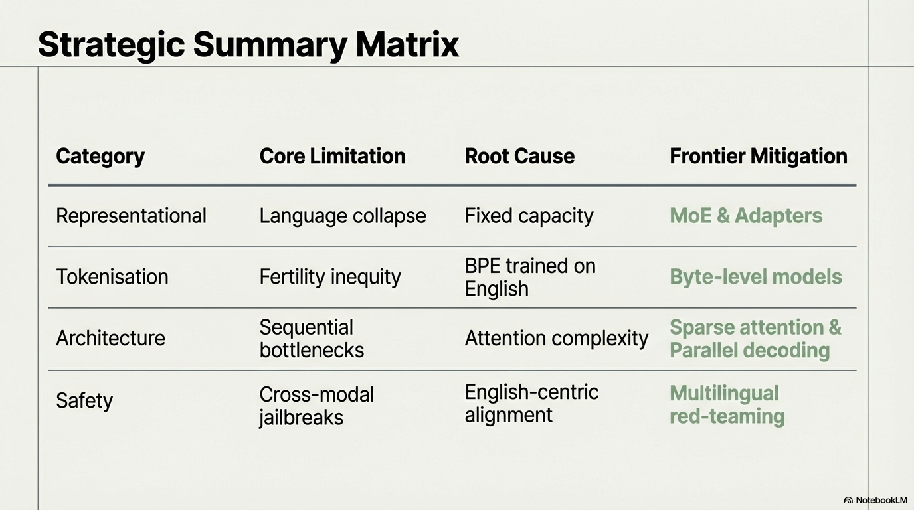


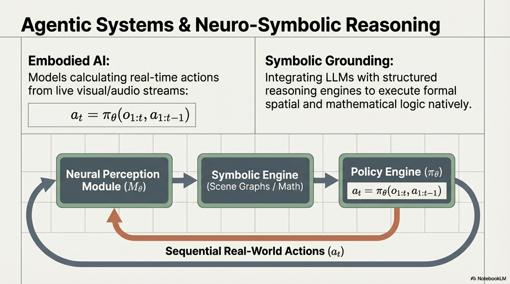


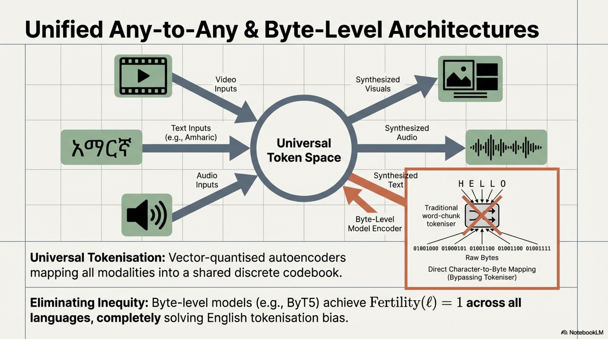


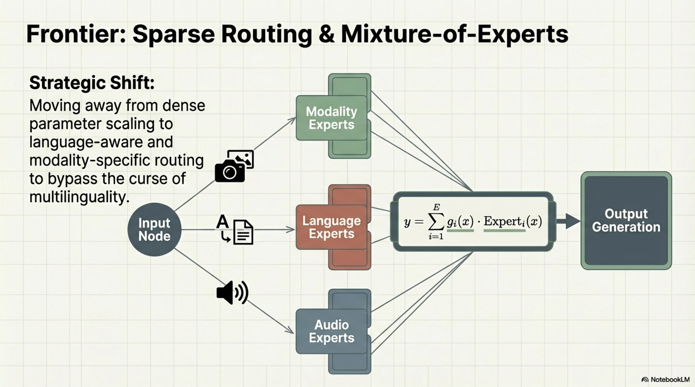


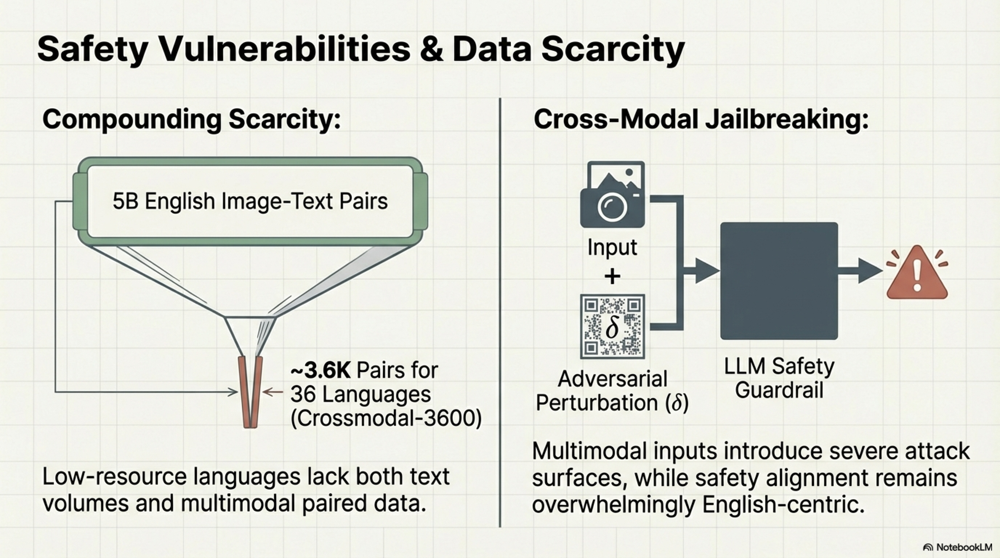


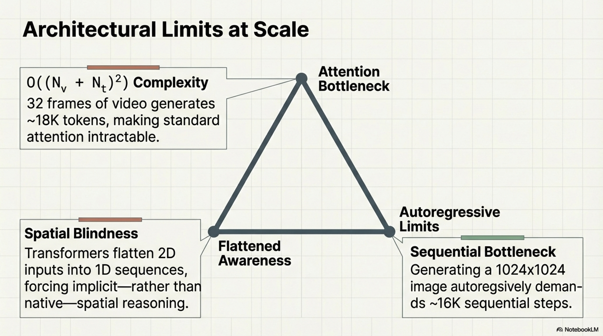


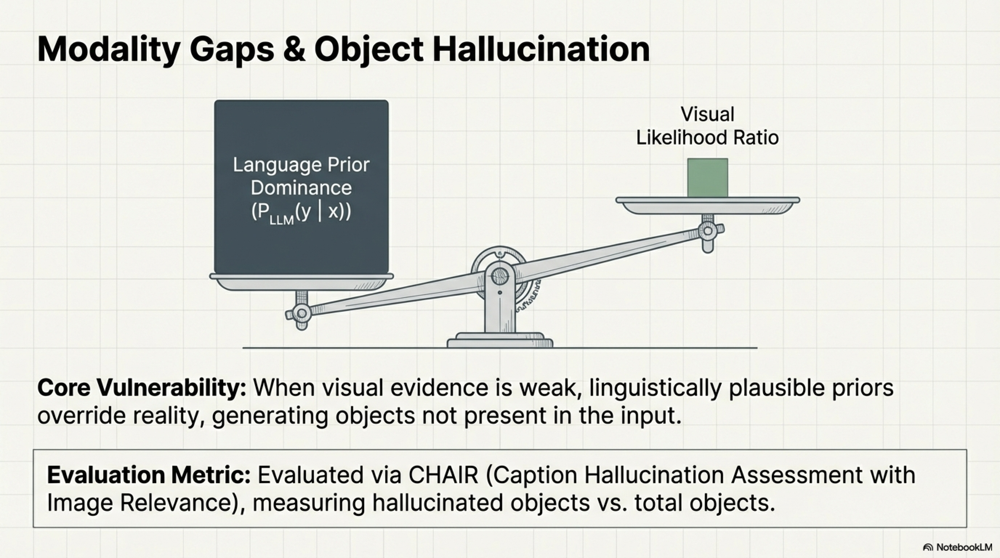


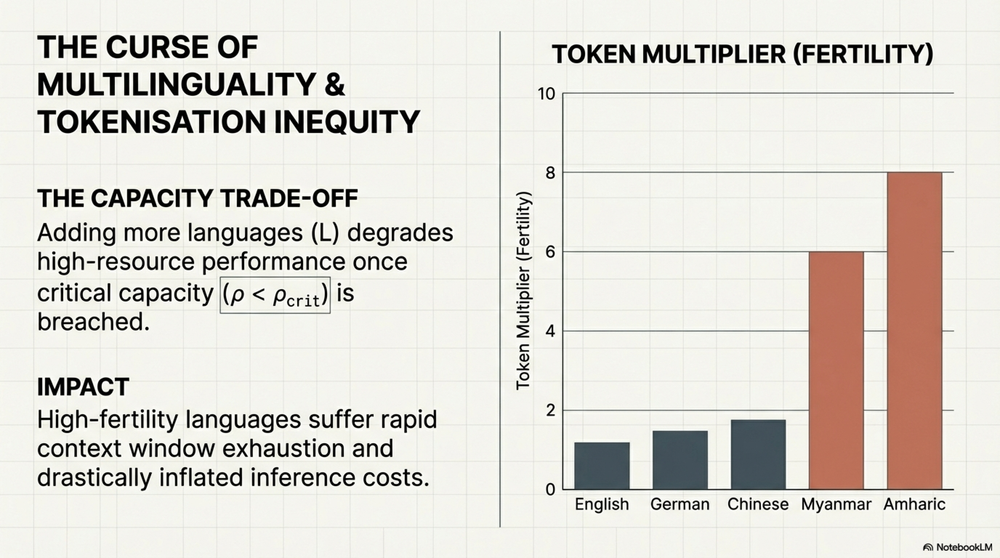


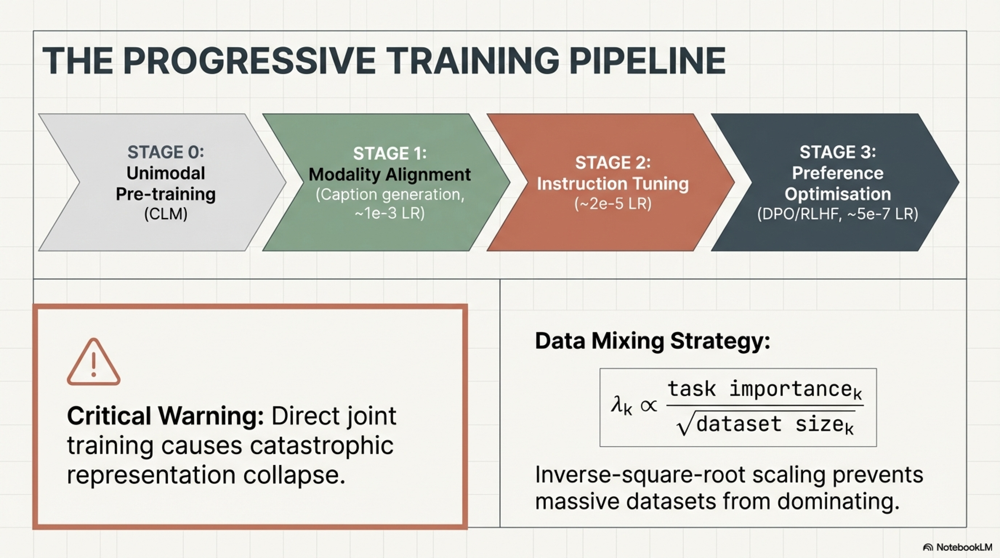


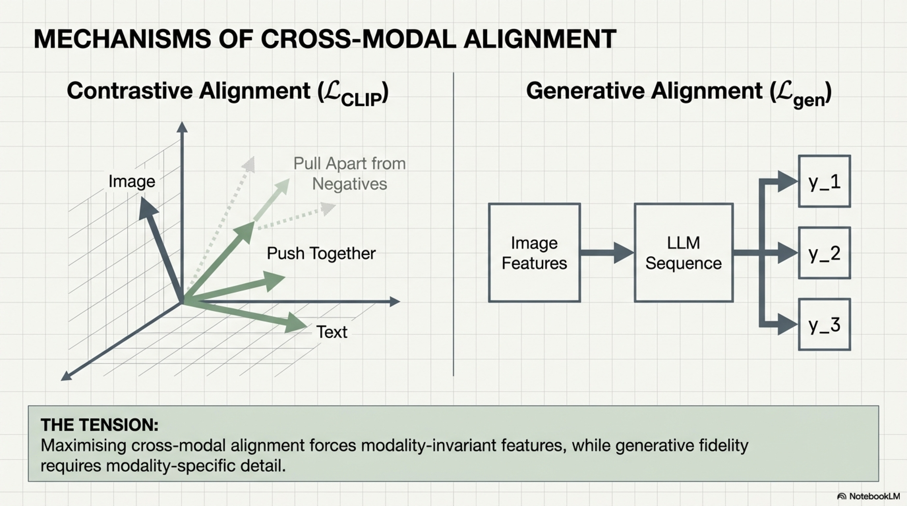


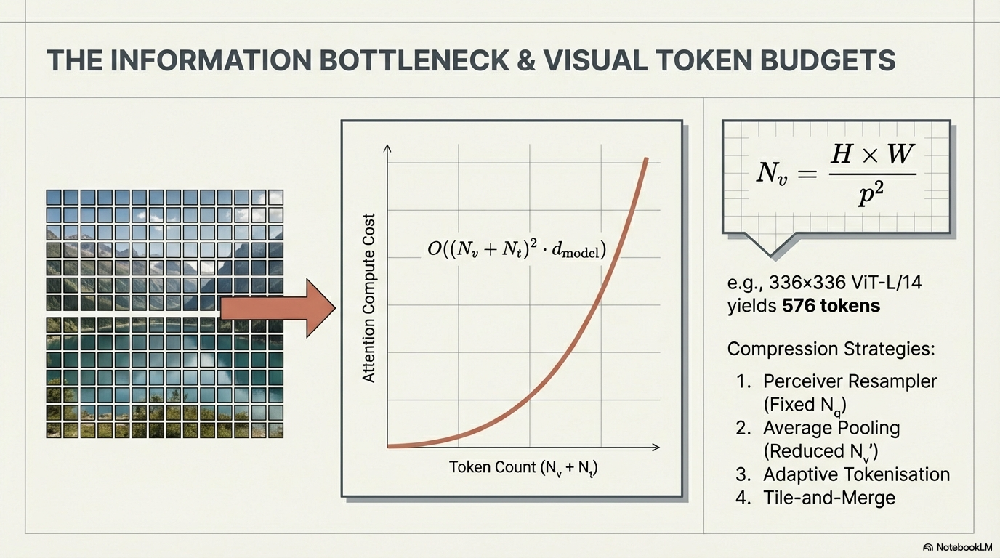


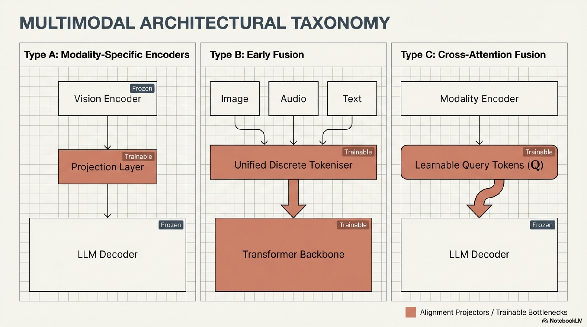


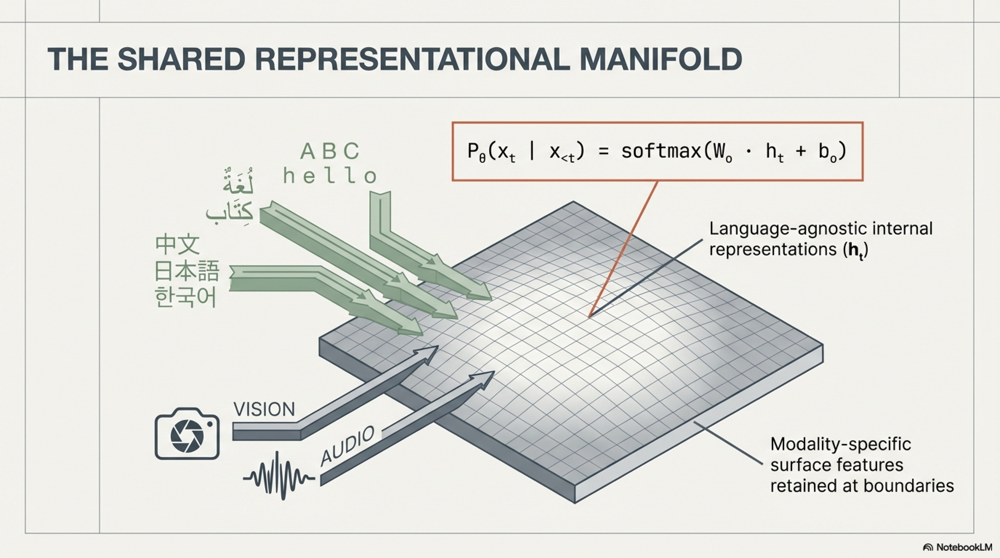


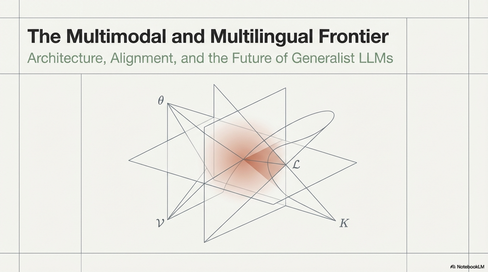

| **Category** | **Core Limitation** | **Root Cause** | **Mitigation Status** |
|---|---|---|---|
| Representational | Language collapse, English anchoring | Data imbalance + fixed capacity | Partially addressed (MoE, adapters) |
| Tokenization | Fertility inequity | BPE trained on skewed distribution | Byte-level models emerging |
| Cross-modal alignment | Modality gap, hallucination | Weak visual grounding, language prior dominance | Active research |
| Data | Scarcity in $\ell_{\text{low}} \times \text{multimodal}$ | Fundamental data availability | Synthetic data, translation |
| Architecture | Context limits, sequential generation | Attention complexity, autoregressive bottleneck | Sparse attention, parallel decoding |
| Safety | Cross-lingual/cross-modal vulnerabilities | Alignment data English-centric | Multilingual red-teaming |
| Compute | Superlinear scaling cost | Fundamental scaling laws | Efficiency research |
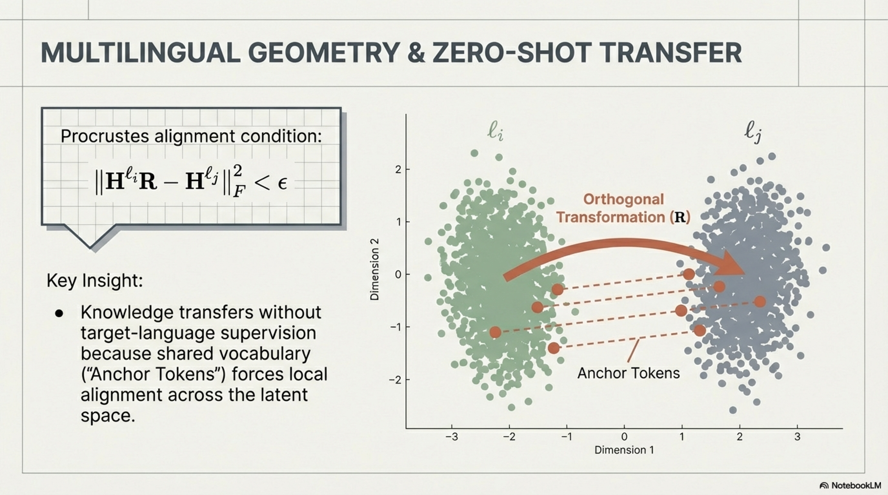

