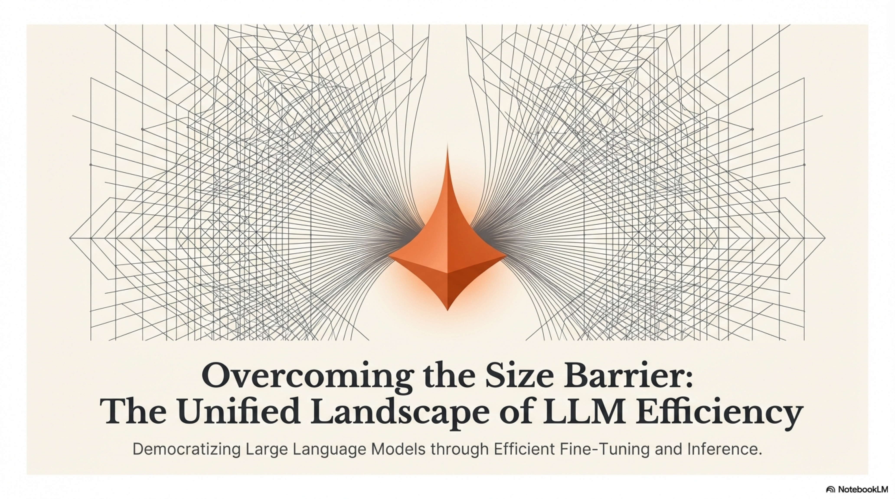

# Efficient Methods for Fine-Tuning Large Language Models

---

## 1. Model Compression & Knowledge Distillation

### 1.1 Problem Statement

A pretrained LLM $\mathcal{M}_\theta$ with $|\theta| = d$ parameters (often $d \in [7\text{B}, 405\text{B}]$) incurs prohibitive costs along three axes:


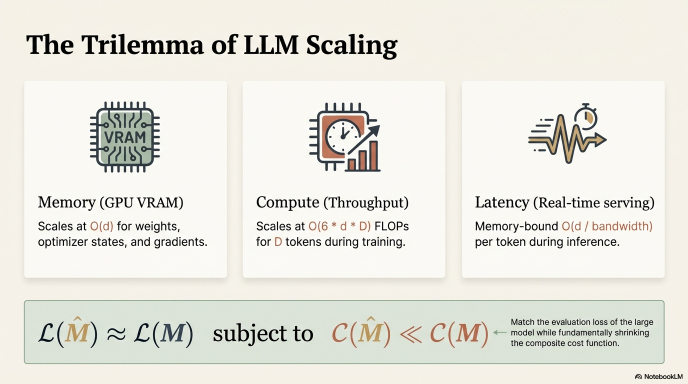

| Cost Axis | Scaling Behavior | Bottleneck |
|-----------|-----------------|------------|
| Memory | $\mathcal{O}(d)$ weights + $\mathcal{O}(d)$ optimizer states + $\mathcal{O}(d)$ gradients | GPU VRAM |
| Compute | $\mathcal{O}(6 \cdot d \cdot D)$ FLOPs for $D$ tokens (training) | Throughput |
| Latency | $\mathcal{O}(d / \text{bandwidth})$ per token (inference, memory-bound) | Real-time serving |

**Model compression** aims to produce a smaller model $\mathcal{M}_{\hat{\theta}}$ with $|\hat{\theta}| \ll |\theta|$ such that:

$$\mathcal{L}(\mathcal{M}_{\hat{\theta}}; \mathcal{D}_{\text{eval}}) \approx \mathcal{L}(\mathcal{M}_\theta; \mathcal{D}_{\text{eval}}) \quad \text{subject to} \quad C(\mathcal{M}_{\hat{\theta}}) \ll C(\mathcal{M}_\theta)$$

where $C(\cdot)$ is a composite cost function over memory, FLOPs, and latency.

---

### 1.2 Knowledge Distillation

#### 1.2.1 Definition


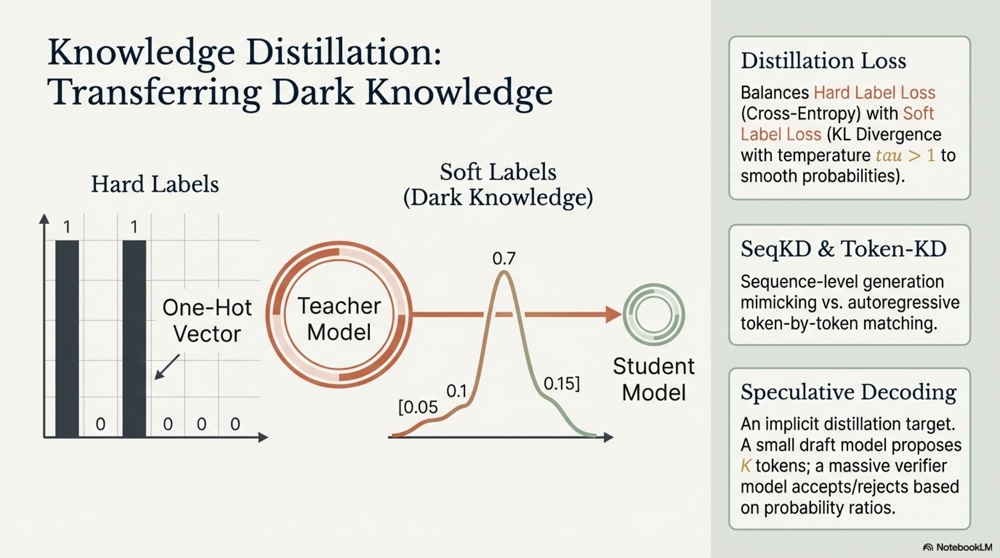

**Knowledge distillation (KD)** transfers the learned function of a large **teacher** model $\mathcal{T}_\phi$ to a smaller **student** model $\mathcal{S}_\theta$ by training the student to mimic the teacher's output distribution rather than solely fitting hard labels. The teacher's softened probability distribution encodes **dark knowledge** — inter-class similarities, calibrated uncertainties, and relational structure — that hard labels destroy.

#### 1.2.2 Standard (Hinton) Distillation

Given input $x$ and temperature $\tau > 1$, the teacher's softened distribution:

$$q_i^\tau = \frac{\exp(z_i^T / \tau)}{\sum_j \exp(z_j^T / \tau)}$$

where $z^T$ are the teacher's logits. The student's softened distribution $p_i^\tau$ is computed analogously from student logits $z^S$.

**Distillation loss:**

$$\mathcal{L}_{\text{KD}} = (1 - \alpha) \cdot \underbrace{\mathcal{L}_{\text{CE}}(p^1, y)}_{\text{hard label loss}} + \alpha \cdot \tau^2 \cdot \underbrace{D_{\text{KL}}(q^\tau \| p^\tau)}_{\text{soft label loss}}$$

where:
- $\alpha \in [0, 1]$ balances hard vs. soft supervision
- The $\tau^2$ factor compensates for the gradient magnitude reduction when $\tau > 1$:

$$\frac{\partial D_{\text{KL}}(q^\tau \| p^\tau)}{\partial z^S} \propto \frac{1}{\tau^2} \cdot \frac{\partial D_{\text{KL}}(q^1 \| p^1)}{\partial z^S}$$

#### 1.2.3 Distillation Variants for LLMs

**Sequence-Level KD (SeqKD — Kim & Rush, 2016):**

Instead of token-level distribution matching, distill at the sequence level:

$$\mathcal{L}_{\text{SeqKD}} = -\sum_{t=1}^{|y^T|} \log p_\theta(y_t^T \mid y_{<t}^T, x)$$

where $y^T = \arg\max_{y} p_\phi(y \mid x)$ (or $y^T \sim p_\phi(\cdot \mid x)$) is the teacher-generated sequence. The student is simply fine-tuned on teacher outputs.

**Token-Level KD for Autoregressive LLMs:**

$$\mathcal{L}_{\text{Token-KD}} = \sum_{t=1}^{T} D_{\text{KL}}\big(p_\phi(\cdot \mid y_{<t}, x) \;\|\; p_\theta(\cdot \mid y_{<t}, x)\big)$$

This requires **simultaneous forward passes** through both teacher and student at every position.

**Feature / Intermediate-Layer Distillation:**

Align student hidden states to teacher hidden states via projection:

$$\mathcal{L}_{\text{feat}} = \sum_{\ell \in \mathcal{L}_{\text{match}}} \left\| W_\ell^{\text{proj}} h_\theta^{(\ell)} - h_\phi^{(g(\ell))} \right\|_2^2$$

where $g(\ell)$ maps student layers to teacher layers, and $W_\ell^{\text{proj}} \in \mathbb{R}^{d_T \times d_S}$ projects between hidden dimensions. Used in DistilBERT, TinyBERT.

**Attention Transfer:**

$$\mathcal{L}_{\text{attn}} = \sum_{\ell} \sum_{h} \left\| A_\theta^{(\ell, h)} - A_\phi^{(g(\ell), h)} \right\|_F^2$$

where $A^{(\ell, h)} \in \mathbb{R}^{T \times T}$ is the attention map at layer $\ell$, head $h$.

#### 1.2.4 On-Policy vs. Off-Policy Distillation

| Mode | Data Source | Advantage | Disadvantage |
|------|-----------|-----------|-------------|
| **Off-policy** | Fixed dataset, teacher pre-generates outputs | Efficient, teacher runs once | Exposure bias, distribution shift |
| **On-policy** | Student generates, teacher scores/corrects | Matches student's own distribution | Requires online teacher inference |
| **Mixed** | Interpolate student/teacher generations | Balanced coverage | Complexity |

**On-Policy Distillation (GKD — Agarwal et al., 2024):**

$$\mathcal{L}_{\text{GKD}} = \mathbb{E}_{x \sim \mathcal{D}, \; y \sim \pi_{\text{mix}}} \left[ \sum_t D_{\text{KL}}\big(p_\phi(\cdot \mid y_{<t}, x) \;\|\; p_\theta(\cdot \mid y_{<t}, x)\big) \right]$$

where $\pi_{\text{mix}} = (1-\lambda)\pi_\theta + \lambda \pi_\phi$ interpolates between student and teacher generation.

#### 1.2.5 Speculative Decoding as Implicit Distillation Target

A small **draft model** $\mathcal{S}_\theta$ proposes $K$ tokens autoregressively; the large **verifier** $\mathcal{T}_\phi$ checks all $K$ tokens in a single forward pass, accepting token $k$ with probability:

$$p_{\text{accept}}(y_k) = \min\left(1, \frac{p_\phi(y_k \mid y_{<k}, x)}{p_\theta(y_k \mid y_{<k}, x)}\right)$$

This provides a direct signal for where the student diverges — high rejection rates indicate distillation gaps.

### 1.3 Knowledge Distillation — Pseudo-Algorithm

```
━━━━━━━━━━━━━━━━━━━━━━━━━━━━━━━━━━━━━━━━━━━━━━━━━━━━━━━━━━━━━━━
ALGORITHM: Generalized Knowledge Distillation for LLMs
━━━━━━━━━━━━━━━━━━━━━━━━━━━━━━━━━━━━━━━━━━━━━━━━━━━━━━━━━━━━━━━

INPUT:
  T_φ          : Teacher model (frozen), parameters φ
  S_θ          : Student model (trainable), parameters θ
  D_train      : Training corpus {x⁽ⁱ⁾}_{i=1}^{N}
  τ            : Temperature for softening distributions
  α            : Interpolation weight (hard vs. soft loss)
  λ            : On-policy mixing ratio (student vs. teacher gen)
  mode         : ∈ {TOKEN_KD, SEQ_KD, FEATURE_KD, ON_POLICY}
  layer_map    : g : student_layers → teacher_layers 
                 (for FEATURE_KD)
  T_steps      : Maximum training steps

OUTPUT:
  θ*           : Distilled student model parameters

PROCEDURE:

  1. INITIALIZE:
     θ ← pretrained student weights (or random if training 
         from scratch)
     IF mode == FEATURE_KD:
       Initialize projection matrices {W_ℓ^proj} for each 
       matched layer pair
       Add {W_ℓ^proj} to trainable parameter set
     optimizer ← AdamW(trainable_params, lr=η)

  2. IF mode == SEQ_KD:  [OFFLINE TEACHER GENERATION]
     FOR each x ∈ D_train:
       Generate y^T ← decode(T_φ, x, strategy=beam/sample)
       Store (x, y^T) in D_distill

  3. TRAINING LOOP:
     FOR step = 1 TO T_steps:

       3.1  Sample mini-batch {x⁽ʲ⁾}_{j=1}^{B}

       3.2  DETERMINE GENERATION SOURCE:
            IF mode == ON_POLICY:
              WITH probability λ: y ← sample from T_φ(·|x)
              WITH probability 1-λ: y ← sample from S_θ(·|x)
            ELIF mode == SEQ_KD:
              y ← retrieve pre-generated y^T from D_distill
            ELSE:
              y ← ground truth (if available) or teacher generation

       3.3  FORWARD PASS (TEACHER — no gradients):
            Run T_φ on (x, y):
              Collect teacher logits: {z_t^T}_{t=1}^{|y|}
              Compute softened teacher probs:
                q_t^τ = softmax(z_t^T / τ)
              IF mode == FEATURE_KD:
                Collect hidden states: {h_φ^(ℓ)} for ℓ ∈ range
                Collect attention maps: {A_φ^(ℓ,h)}

       3.4  FORWARD PASS (STUDENT — with gradients):
            Run S_θ on (x, y):
              Collect student logits: {z_t^S}_{t=1}^{|y|}
              Compute softened student probs:
                p_t^τ = softmax(z_t^S / τ)
              IF mode == FEATURE_KD:
                Collect hidden states: {h_θ^(ℓ)}
                Collect attention maps: {A_θ^(ℓ,h)}

       3.5  COMPUTE LOSS:
            IF mode ∈ {TOKEN_KD, ON_POLICY}:
              L_soft = (1/|y|) Σ_t D_KL(q_t^τ ‖ p_t^τ)
              L_hard = (1/|y|) Σ_t [-log p_θ(y_t | y_{<t}, x)]
              L = (1 - α)·L_hard + α·τ²·L_soft

            ELIF mode == SEQ_KD:
              L = (1/|y^T|) Σ_t [-log p_θ(y_t^T | y_{<t}^T, x)]

            ELIF mode == FEATURE_KD:
              L_logit = α·τ²·(1/|y|) Σ_t D_KL(q_t^τ ‖ p_t^τ)
              L_feat = Σ_{ℓ ∈ matched} 
                       ‖W_ℓ^proj · h_θ^(ℓ) - h_φ^(g(ℓ))‖₂²
              L_attn = Σ_{ℓ,h} ‖A_θ^(ℓ,h) - A_φ^(g(ℓ),h)‖_F²
              L = L_logit + β₁·L_feat + β₂·L_attn

       3.6  BACKWARD + UPDATE:
            ∇_θ L → gradient clip → optimizer step

       3.7  MONITOR:
            Log: student perplexity, KL divergence from teacher,
                 task-specific eval metrics,
                 layer-wise feature alignment error (if FEATURE_KD)

  4. RETURN θ*

━━━━━━━━━━━━━━━━━━━━━━━━━━━━━━━━━━━━━━━━━━━━━━━━━━━━━━━━━━━━━━━
```

---

## 2. Compression Techniques

### 2.1 Pruning

#### 2.1.1 Definition

**Pruning** removes redundant parameters (or structures) from a neural network, producing a sparse (or smaller) model $\mathcal{M}_{\hat{\theta}}$ where $\|\hat{\theta}\|_0 < \|\theta\|_0$. The fundamental premise: trained networks are **over-parameterized**, and a significant fraction of weights contribute negligibly to the output.

#### 2.1.2 Taxonomy of Pruning


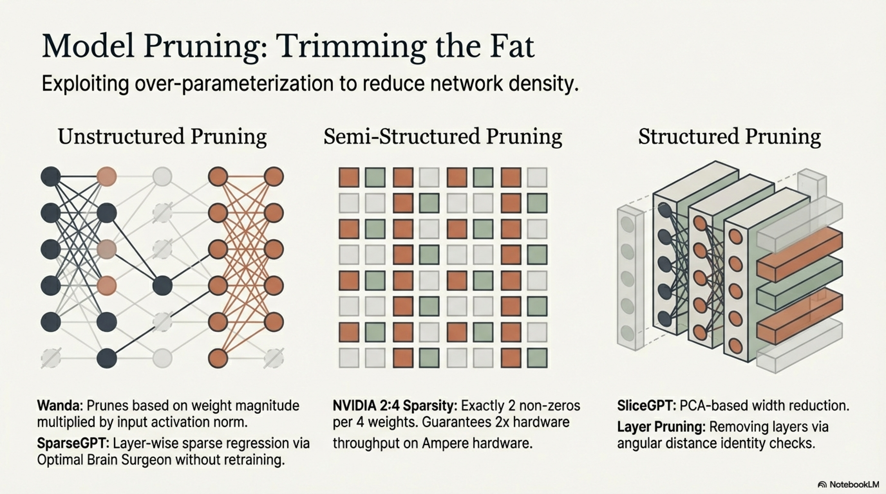

```
Pruning
├── Granularity
│   ├── Unstructured (individual weights → sparse matrices)
│   ├── Semi-Structured (N:M sparsity, e.g., 2:4 on Ampere GPUs)
│   ├── Structured (entire neurons/heads/layers/channels)
│   └── Block-Structured (contiguous blocks for hardware efficiency)
├── Timing
│   ├── Post-Training (one-shot, no retraining)
│   ├── During Training (gradual magnitude pruning)
│   └── At Initialization (Lottery Ticket Hypothesis)
├── Criterion
│   ├── Magnitude-Based (|w_i|)
│   ├── Gradient-Based (|w_i · ∇_{w_i} L|)
│   ├── Hessian-Based (saliency via second-order information)
│   ├── Activation-Based (impact on activations)
│   └── Learned (differentiable masks)
└── Scope
    ├── Local (per-layer threshold)
    └── Global (unified threshold across all layers)
```

#### 2.1.3 Unstructured Pruning

**Magnitude Pruning:** Remove weights with smallest absolute value:

$$m_i = \mathbb{1}[|w_i| > \kappa], \quad \hat{w}_i = m_i \cdot w_i$$

where $\kappa$ is chosen such that $\sum_i (1 - m_i) / |\theta| = s$ for target sparsity $s$.

**Limitation:** Unstructured sparsity yields irregular memory access patterns — negligible wall-clock speedup on standard GPUs without specialized sparse kernels.

**Wanda (Pruning by Weights and Activations — Sun et al., 2024):**

For LLMs, **one-shot post-training** pruning using a saliency metric that combines weight magnitude with input activation norms:

$$S_{ij} = |W_{ij}| \cdot \|X_j\|_2$$

where $W_{ij}$ is the weight connecting input feature $j$ to output neuron $i$, and $\|X_j\|_2$ is the $\ell_2$ norm of the $j$-th input feature computed over a small calibration set.

**Rationale:** A small weight on a large activation has greater impact than a large weight on a near-zero activation. This captures **functional importance** rather than purely parametric magnitude.

**SparseGPT (Frantar & Alistarh, 2023):**

Formulates pruning as a **layer-wise sparse regression** problem:

$$\min_{W_{\text{sparse}}} \|WX - W_{\text{sparse}}X\|_F^2 \quad \text{s.t.} \quad \|W_{\text{sparse}}\|_0 \leq (1-s) \cdot |W|$$

Solves this using an approximate optimal brain surgeon (OBS) framework with Hessian $H = 2XX^\top$:

$$\delta w_q = -\frac{w_q}{[H^{-1}]_{qq}}, \quad W_{:, \neq q} \mathrel{+}= \delta w_q \cdot \frac{H^{-1}_{:, q}}{[H^{-1}]_{qq}}$$

When pruning weight $w_q$, the remaining weights are **updated** to compensate, minimizing output perturbation. SparseGPT achieves 50–60% unstructured sparsity on LLMs with minimal perplexity degradation — **without any retraining**.

#### 2.1.4 Semi-Structured (N:M) Sparsity

NVIDIA Ampere+ GPUs natively support **2:4 sparsity** — out of every 4 consecutive weights, exactly 2 are zero:

$$\text{For each group } (w_1, w_2, w_3, w_4): \text{ keep top-2 by magnitude, zero the other 2}$$

This achieves **50% sparsity** with guaranteed **2× throughput** via hardware sparse tensor cores, with no software overhead.

**Formal constraint:** For weight matrix $W \in \mathbb{R}^{m \times n}$, partition columns into groups of 4. Within each group, enforce exactly 2 non-zeros.

#### 2.1.5 Structured Pruning

Removes entire **computational units** — attention heads, FFN neurons, or entire layers:

**Attention Head Pruning:**

Importance score for head $h$ at layer $\ell$:

$$I_h^{(\ell)} = \mathbb{E}_{x \sim \mathcal{D}} \left[ \left| \frac{\partial \mathcal{L}}{\partial \alpha_h^{(\ell)}} \cdot \alpha_h^{(\ell)} \right| \right]$$

where $\alpha_h^{(\ell)}$ is a differentiable gate on head $h$. Heads with $I_h^{(\ell)} < \kappa$ are removed.

**Width Pruning (SliceGPT — Ashkboos et al., 2024):**

Apply PCA-based dimensionality reduction to the residual stream:

$$X' = XQ_\ell, \quad Q_\ell \in \mathbb{R}^{d \times d'}$$

where $Q_\ell$ retains the top $d' < d$ principal components of inter-layer activations. The weight matrices are then sliced accordingly: $W' = Q_\ell^\top W Q_\ell$. Achieves up to 25% parameter reduction with true wall-clock speedup.

**Layer Pruning:**

For deep LLMs (70B+), adjacent layers often compute near-identity residual updates. Layer importance via **angular distance** between input and output of block $\ell$:

$$\text{BI}^{(\ell)} = \mathbb{E}_x \left[ \frac{h^{(\ell-1)} \cdot h^{(\ell)}}{\|h^{(\ell-1)}\| \|h^{(\ell)}\|} \right]$$

Layers with $\text{BI}^{(\ell)} \approx 1$ (near-identity) can be removed with minimal impact.

### 2.2 Pruning — Pseudo-Algorithm

```
━━━━━━━━━━━━━━━━━━━━━━━━━━━━━━━━━━━━━━━━━━━━━━━━━━━━━━━━━━━━━━━
ALGORITHM: One-Shot Post-Training Pruning (SparseGPT / Wanda)
━━━━━━━━━━━━━━━━━━━━━━━━━━━━━━━━━━━━━━━━━━━━━━━━━━━━━━━━━━━━━━━

INPUT:
  θ           : Pretrained dense model parameters
  D_calib     : Small calibration dataset (128–512 sequences)
  s           : Target sparsity ratio ∈ (0, 1)
  method      : ∈ {MAGNITUDE, WANDA, SPARSEGPT, N:M_SPARSE}
  granularity : ∈ {UNSTRUCTURED, SEMI_STRUCTURED, STRUCTURED}
  scope       : ∈ {LOCAL, GLOBAL}

OUTPUT:
  θ_sparse    : Pruned model parameters
  M           : Binary mask (for unstructured/semi-structured)

PROCEDURE:

  1. CALIBRATION PASS:
     1.1  Run forward pass of full model on D_calib
     1.2  FOR each layer ℓ:
            Record input activations X^(ℓ) ∈ ℝ^{n_calib × d_in}
            (store running statistics, not full tensors 
             for memory efficiency)

  2. COMPUTE SALIENCY:

     IF method == MAGNITUDE:
       FOR each weight w_i:
         S_i = |w_i|

     ELIF method == WANDA:
       FOR each layer ℓ, weight matrix W ∈ ℝ^{d_out × d_in}:
         Compute column-wise activation norms:
           a_j = ‖X_j^(ℓ)‖₂  for j = 1, ..., d_in
         FOR each element (i, j):
           S_{ij} = |W_{ij}| · a_j

     ELIF method == SPARSEGPT:
       FOR each layer ℓ, weight matrix W:
         Compute Hessian: H = 2·(X^(ℓ))ᵀ X^(ℓ) + λI
         Compute H⁻¹ (via Cholesky decomposition)
         Process columns in order q = 1, ..., d_in:
           Compute pruning error for column q:
             err_q = w_q² / [H⁻¹]_{qq}
           IF column q selected for pruning (lowest err_q 
              among remaining quota):
             Compute weight update for remaining weights:
               δ = -w_q / [H⁻¹]_{qq}
               W_{:, remaining} += δ · H⁻¹_{remaining, q}
             Set W_{:, q} = 0

  3. APPLY PRUNING:

     IF granularity == UNSTRUCTURED:
       IF scope == GLOBAL:
         κ = quantile({S_i : all layers}, s)
         M_i = 𝟙[S_i ≥ κ]  ∀i
       ELIF scope == LOCAL:
         FOR each layer ℓ:
           κ_ℓ = quantile({S_i : i ∈ layer ℓ}, s)
           M_i = 𝟙[S_i ≥ κ_ℓ]

     ELIF granularity == SEMI_STRUCTURED (N:M):
       FOR each row of each weight matrix:
         Partition into groups of M consecutive elements
         FOR each group:
           Keep top N elements by saliency S_{ij}
           Zero the remaining M - N elements

     ELIF granularity == STRUCTURED:
       Compute unit-level importance (head/neuron/layer)
       Remove entire units below threshold
       Reshape weight matrices accordingly 
         (actual dimension reduction)

     θ_sparse ← θ ⊙ M  (for unstructured/semi-structured)
     θ_sparse ← sliced θ (for structured)

  4. OPTIONAL POST-PRUNING RECOVERY:
     4.1  Light fine-tuning on D_calib or task data (few steps)
     4.2  OR: apply LoRA adapters to compensate for pruning 
          degradation (LoRA + Pruning synergy)

  5. VALIDATION:
     Evaluate perplexity on held-out data
     Compare with dense baseline
     Measure actual memory savings and latency improvement

  6. RETURN θ_sparse, M

━━━━━━━━━━━━━━━━━━━━━━━━━━━━━━━━━━━━━━━━━━━━━━━━━━━━━━━━━━━━━━━
```

---

### 2.3 Quantization

#### 2.3.1 Definition

**Quantization** maps continuous (or high-precision) weight/activation values from a floating-point space $\mathbb{R}$ to a discrete set of low-precision values $\mathcal{Q} = \{q_0, q_1, \dots, q_{2^b - 1}\}$ with $b$ bits, reducing memory footprint by a factor of $\frac{b_{\text{orig}}}{b_{\text{quant}}}$.

#### 2.3.2 Uniform Affine Quantization

**Quantize:**
$$q = \text{clamp}\left(\left\lfloor \frac{x}{s} \right\rceil + z, \; 0, \; 2^b - 1\right)$$

**Dequantize:**
$$\hat{x} = s \cdot (q - z)$$

where:
- $s = \frac{x_{\max} - x_{\min}}{2^b - 1}$ is the **scale factor**
- $z = \text{clamp}\left(\left\lfloor -\frac{x_{\min}}{s} \right\rceil, 0, 2^b - 1\right)$ is the **zero point**
- $\lfloor \cdot \rceil$ denotes rounding to nearest integer

**Symmetric quantization** (zero point $z = 0$):

$$s = \frac{\max(|x|)}{2^{b-1} - 1}, \quad q = \text{clamp}\left(\left\lfloor \frac{x}{s} \right\rceil, -2^{b-1}, 2^{b-1} - 1\right)$$

#### 2.3.3 Quantization Granularity


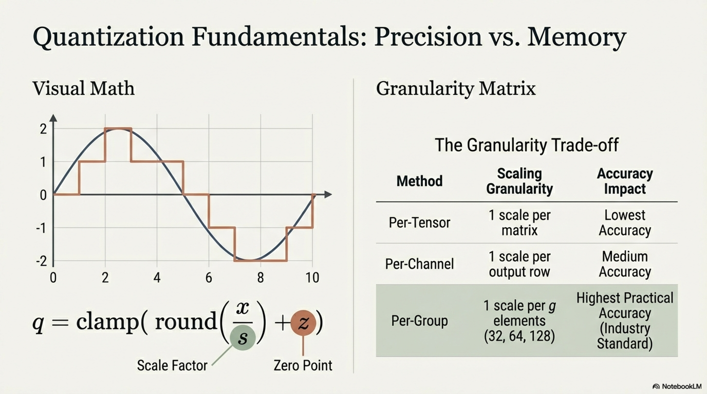

| Granularity | Scale Shared Across | Parameters | Accuracy |
|-------------|-------------------|------------|----------|
| Per-Tensor | Entire weight matrix | 1 scale, 1 zero point | Lowest |
| Per-Channel / Per-Row | Each output channel/row | $d_{\text{out}}$ scales | Medium |
| Per-Group (group size $g$) | Groups of $g$ elements | $d/g$ scales | Highest |
| Per-Element | Each element | Maximum (impractical) | Theoretical max |

Modern LLM quantization (GPTQ, AWQ) typically uses **per-group** quantization with $g \in \{32, 64, 128\}$.

#### 2.3.4 Post-Training Quantization (PTQ) Methods for LLMs

**GPTQ (Frantar et al., 2023):**

Layer-wise optimal quantization via the OBS framework. For weight matrix $W$ and calibration inputs $X$:

$$\min_{\hat{W}} \|WX - \hat{W}X\|_F^2 \quad \text{s.t.} \quad \hat{W} \in \mathcal{Q}^{d_{\text{out}} \times d_{\text{in}}}$$

Process one column $q$ at a time:
1. Quantize $w_q$ to nearest grid point: $\hat{w}_q = \text{quant}(w_q)$
2. Compute quantization error: $\delta_q = w_q - \hat{w}_q$
3. Compensate remaining weights: $W_{:, q+1:} \mathrel{+}= \delta_q \cdot \frac{(H^{-1})_{q, q+1:}}{(H^{-1})_{qq}}$

This **weight compensation** is the key — it redistributes quantization error to not-yet-quantized columns.

**AWQ (Activation-Aware Weight Quantization — Lin et al., 2024):**

**Core observation:** A small fraction (~1%) of weight channels are **salient** because they process large-magnitude activations. Quantizing these channels naively causes disproportionate error.

**Solution:** Scale salient channels before quantization:

$$\hat{W} = \text{quant}\left(W \cdot \text{diag}(\mathbf{s})\right), \quad \hat{x} = \frac{x}{\mathbf{s}}$$

where $\mathbf{s} \in \mathbb{R}^{d_{\text{in}}}$ is a per-channel scaling vector. The optimal scale:

$$s_j^* = \left(\frac{\|x_j\|_2}{\max_i |W_{ij}|}\right)^\alpha, \quad \alpha \in [0, 1]$$

searched via grid search on calibration data. This is **mathematically equivalent** (no approximation) but distributes the numerical precision more favorably.

**QuIP# (Quantization with Incoherence Processing):**

Apply random orthogonal rotations $U, V$ to weight matrices before quantization:

$$W' = U W V^\top$$

The rotation makes weight distributions more **incoherent** (uniform magnitude), enabling aggressive quantization (2-bit) with minimal error. After quantization:

$$\hat{W}x = U^\top \hat{W}' (V x)$$

The rotation overhead is amortized.

#### 2.3.5 Non-Uniform Quantization: NormalFloat (NF4)

Used in QLoRA. Based on the empirical observation that pretrained weights follow approximately $\mathcal{N}(0, \sigma^2)$:

$$\text{NF4 quantiles} = \Phi^{-1}\left(\frac{2i + 1}{2 \cdot 2^b}\right), \quad i = 0, 1, \dots, 2^b - 1$$


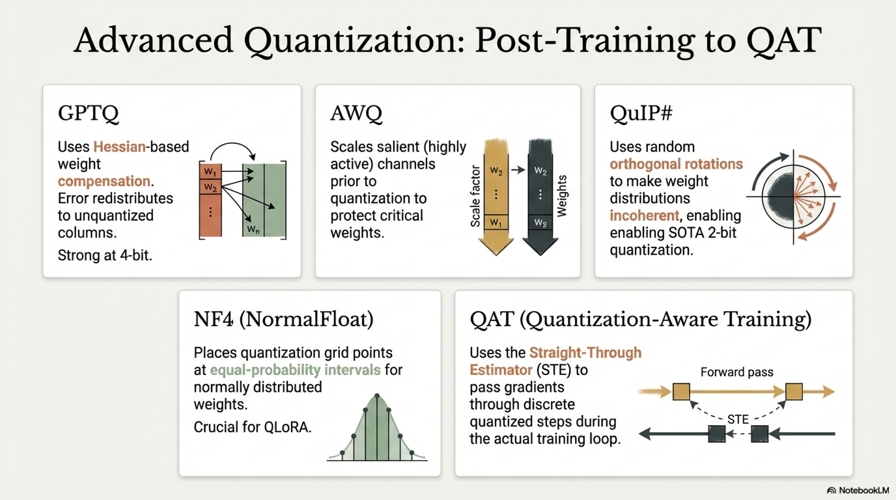

where $\Phi^{-1}$ is the inverse normal CDF. This places quantization grid points at **equal-probability intervals** of the Gaussian, minimizing expected quantization error $\mathbb{E}[(x - \hat{x})^2]$ for normally distributed $x$.

For 4-bit NF4, the 16 quantization levels are:

$$\mathcal{Q}_{\text{NF4}} = \{-1.0, -0.6962, -0.5251, -0.3949, -0.2844, -0.1848, -0.0911, 0, 0.0796, 0.1609, 0.2461, 0.3379, 0.4407, 0.5626, 0.7230, 1.0\}$$

(after normalization by $\sigma$).

#### 2.3.6 Quantization-Aware Training (QAT)

Unlike PTQ, QAT incorporates quantization into the training loop using the **Straight-Through Estimator (STE)**:

**Forward:**
$$\hat{w} = \text{quant}(w) \quad (\text{discrete})$$

**Backward:**
$$\frac{\partial \mathcal{L}}{\partial w} \approx \frac{\partial \mathcal{L}}{\partial \hat{w}} \quad (\text{pass gradient through as if identity})$$

More formally, the STE gradient:

$$\nabla_w \mathcal{L} = \nabla_{\hat{w}} \mathcal{L} \cdot \mathbb{1}\left[w \in [q_{\min}, q_{\max}]\right]$$

**LLM-QAT** extends this to large models by quantizing weights **and** KV-cache activations, enabling 4-bit inference with minimal quality loss.

#### 2.3.7 KV-Cache Quantization

During autoregressive inference, the KV-cache grows as $\mathcal{O}(B \cdot L \cdot H \cdot T \cdot d_h)$ where $B$ = batch size, $L$ = layers, $H$ = heads, $T$ = sequence length, $d_h$ = head dimension. For long contexts, KV-cache dominates memory.

**KV-cache quantization:** Quantize cached keys and values to lower precision:

$$K_{\text{cached}} = \text{quant}_{b_k}(K), \quad V_{\text{cached}} = \text{quant}_{b_v}(V)$$

Typical: $b_k = b_v = 4$ or even $b_k = b_v = 2$ with per-head/per-token scaling.

**KIVI (Liu et al., 2024):** Keys are quantized per-channel (across tokens), values per-token (across channels), reflecting their distinct statistical distributions.

#### 2.3.8 Comprehensive Quantization Comparison

| Method | Bits | Type | Calibration Data | Weight Update | Quality (vs FP16) |
|--------|------|------|-------------------|---------------|-------------------|
| RTN (Round-to-Nearest) | 8/4 | PTQ | None | No | Degraded at 4-bit |
| GPTQ | 4/3 | PTQ | ~128 samples | Hessian-based compensation | Strong at 4-bit |
| AWQ | 4 | PTQ | ~128 samples | Channel scaling | Strong at 4-bit |
| QuIP# | 2/4 | PTQ | ~128 samples | Rotation + compensation | SOTA at 2-bit |
| NF4 (QLoRA) | 4 | PTQ + LoRA training | None for quant | LoRA adapters trained | Near lossless |
| QAT | 4/2 | Training | Full training data | Full or partial | Best at ultra-low bit |
| SqueezeLLM | 3/4 | PTQ | Calibration | Non-uniform + sparse outlier | Strong |

### 2.4 Quantization — Pseudo-Algorithm

```
━━━━━━━━━━━━━━━━━━━━━━━━━━━━━━━━━━━━━━━━━━━━━━━━━━━━━━━━━━━━━━━
ALGORITHM: GPTQ-Style Post-Training Quantization
━━━━━━━━━━━━━━━━━━━━━━━━━━━━━━━━━━━━━━━━━━━━━━━━━━━━━━━━━━━━━━━

INPUT:
  θ           : Pretrained FP16 model parameters
  D_calib     : Small calibration dataset (128 sequences)
  b           : Target bit-width (e.g., 4)
  g           : Group size for per-group quantization (e.g., 128)
  block_size  : Column block size for batched processing

OUTPUT:
  θ_quant     : Quantized model (weights stored as int{b} 
                + FP16 scale/zero_point per group)
  Codebook    : {scale_g, zero_point_g} for each group

PROCEDURE:

  1. CALIBRATION:
     1.1  Run full-precision forward pass on D_calib
     1.2  FOR each linear layer ℓ (sequentially through model):
            Capture input activations X^(ℓ) ∈ ℝ^{n × d_in}
            Compute Hessian proxy:
              H = (X^(ℓ))ᵀ X^(ℓ) / n
            Add damping: H ← H + δ·diag(H)·I  
              (δ ≈ 0.01 for numerical stability)
            Compute H⁻¹ via Cholesky: H⁻¹ = cholesky_inverse(H)

  2. LAYER-WISE QUANTIZATION (process layer by layer):
     FOR each linear layer ℓ with weight W ∈ ℝ^{d_out × d_in}:

       2.1  Process columns in blocks of size block_size:
            FOR block starting at column c:
              E ← 0  (accumulated error matrix)

              FOR q = c TO c + block_size - 1:
                // Quantize column q
                w = W[:, q]

                // Per-group quantization
                FOR each group of g elements in w:
                  Compute scale: s = (max(group) - min(group)) 
                                     / (2^b - 1)
                  Compute zero_point: z = round(-min(group)/s)
                  Quantize: ŵ_group = s · (clamp(round(w_group/s) 
                            + z, 0, 2^b-1) - z)
                  Store (s, z) in Codebook

                // Compute quantization error
                δ = w - ŵ

                // Compensate remaining columns in block
                W[:, q+1 : c+block_size] += 
                  outer(δ, H⁻¹[q, q+1:c+block_size]) 
                  / H⁻¹[q, q]

                // Store quantized column
                W[:, q] ← ŵ

                // Accumulate error for inter-block update
                E += outer(δ, H⁻¹[q, c+block_size:]) 
                     / H⁻¹[q, q]

              // Propagate error to remaining columns
              W[:, c+block_size:] += E

       2.2  Update layer output for subsequent layers:
            Compute quantized layer output using ŴX^(ℓ)
            Feed to next layer (sequential processing)

  3. PACK WEIGHTS:
     Pack b-bit integers into packed format 
       (e.g., 8 × 4-bit values per 32-bit word)
     Store alongside per-group scales and zero points

  4. VALIDATION:
     Evaluate quantized model perplexity on held-out data
     Compare with FP16 baseline
     Measure: memory reduction ratio, inference speedup

  5. RETURN θ_quant, Codebook

━━━━━━━━━━━━━━━━━━━━━━━━━━━━━━━━━━━━━━━━━━━━━━━━━━━━━━━━━━━━━━━
```

---

## 3. Parameter-Efficient Fine-Tuning (PEFT)

### 3.1 Unified Framework

All PEFT methods share a common structure: decompose the model parameters into **frozen** pretrained weights $\theta^*$ and a small set of **trainable** adaptation parameters $\phi$:

$$\theta_{\text{adapted}} = \theta^* \oplus \phi, \quad |\phi| \ll |\theta^*|$$

The optimization:

$$\phi^* = \arg\min_\phi \; \mathbb{E}_{(x,y) \sim \mathcal{D}_{\text{task}}} \left[\mathcal{L}(\theta^* \oplus \phi; x, y)\right]$$


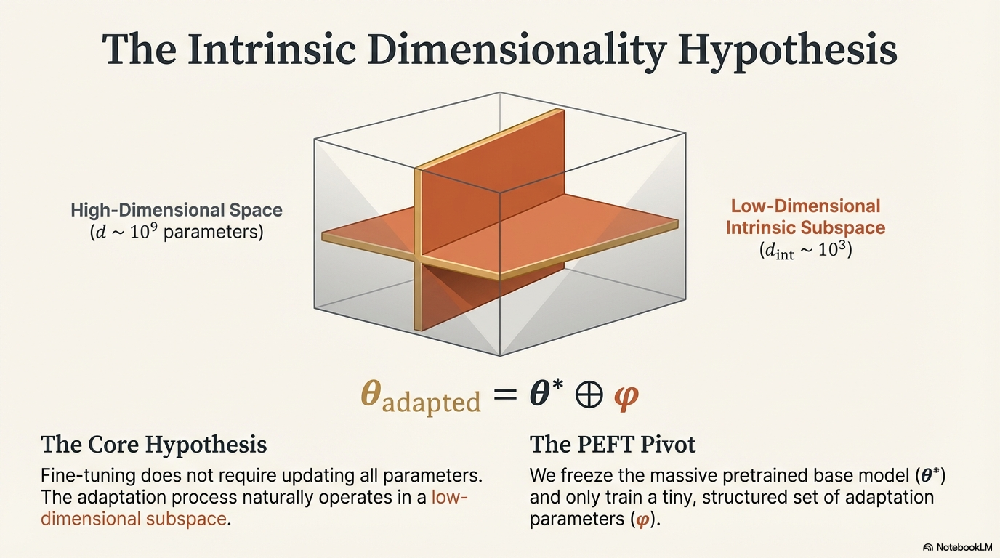

**Intrinsic dimensionality hypothesis (Aghajanyan et al., 2021):** Fine-tuning operates in a **low-dimensional subspace**. For a $d$-parameter model, the intrinsic dimension $d_{\text{int}} \ll d$ (often $d_{\text{int}} \sim 10^3 \text{–} 10^4$ even for $d \sim 10^9$):

$$\theta(\phi) = \theta^* + P\phi, \quad P \in \mathbb{R}^{d \times d_{\text{int}}}$$

where $P$ is a random projection matrix. PEFT methods are various structured instantiations of this principle.

### 3.2 LoRA (Low-Rank Adaptation)

#### 3.2.1 Formulation

For each target weight matrix $W_0 \in \mathbb{R}^{d_{\text{out}} \times d_{\text{in}}}$:

$$h = (W_0 + \Delta W)x = W_0 x + BAx$$

where $B \in \mathbb{R}^{d_{\text{out}} \times r}$, $A \in \mathbb{R}^{r \times d_{\text{in}}}$, rank $r \ll \min(d_{\text{in}}, d_{\text{out}})$.

**Initialization:**
- $A \sim \mathcal{N}(0, \sigma^2)$ (Kaiming or small Gaussian)
- $B = 0$ (ensures $\Delta W = 0$ at start — training begins from pretrained function)

**Scaling:**
$$h = W_0 x + \frac{\alpha}{r} BAx$$

The ratio $\frac{\alpha}{r}$ decouples the **learning rate sensitivity** from the rank choice. When increasing $r$, the per-weight learning rate scales as $\sim \frac{\alpha}{r}$, providing consistent training dynamics.

**Merge at Inference:**
$$W_{\text{merged}} = W_0 + \frac{\alpha}{r} BA$$

No additional inference latency — the adaptation is **absorbed** into the base weight matrix.

**Trainable parameter count per adapted matrix:**

$$|\phi_{\text{LoRA}}| = r \cdot (d_{\text{in}} + d_{\text{out}})$$

For $r = 16$, $d_{\text{in}} = d_{\text{out}} = 4096$: $|\phi| = 131,072$ vs. $|W_0| = 16,777,216$ — **0.78%**.

#### 3.2.2 Which Modules to Adapt?

Empirical findings (Hu et al., 2022; extensive ablations):

| Target Modules | Quality | Coverage |
|----------------|---------|----------|
| $W_Q$ only | Weak | Narrow |
| $W_Q, W_V$ | Strong | Standard |
| $W_Q, W_K, W_V, W_O$ | Stronger | Attention-complete |
| All attention + FFN ($W_{\text{up}}, W_{\text{down}}, W_{\text{gate}}$) | Best | Full |

Modern practice: adapt **all linear layers** with low rank ($r \in [8, 64]$) rather than high rank on few layers.

### 3.3 LoRA Variants

#### 3.3.1 QLoRA (Quantized LoRA — Dettmers et al., 2023)

Combines three innovations to enable 65B-parameter fine-tuning on a single 48GB GPU:

**Innovation 1 — 4-bit NormalFloat (NF4) Base Model:**
$$\hat{W}_0 = \text{NF4\_Quant}(W_0)$$

**Innovation 2 — Double Quantization:**
Quantize the FP32 quantization constants themselves to 8-bit:
$$\hat{s} = \text{Int8\_Quant}(s), \quad \text{saving } \frac{32 - 8}{32} \times \frac{|\text{scales}|}{|\text{weights}|} \text{ per param}$$

For group size $g = 64$: additional savings of $\sim 0.37$ bits per parameter.

**Innovation 3 — Paged Optimizers:**
Use unified memory (CPU ↔ GPU) to handle optimizer state memory spikes during gradient checkpointing.

**Forward pass:**
$$h = \text{Dequant}_{\text{NF4}}(\hat{W}_0) \cdot x + \frac{\alpha}{r} B A x$$

**Backward pass:** Gradients flow only through $B, A$ (and the dequantized path via STE for the frozen weights).

**Memory Analysis for a 65B Model:**

| Component | Full FT (FP16) | QLoRA |
|-----------|---------------|-------|
| Model weights | 130 GB | 32.5 GB (NF4) |
| Optimizer states | 260 GB (AdamW) | ~1 GB (LoRA params only) |
| Gradients | 130 GB | ~0.5 GB |
| **Total** | **~520 GB** | **~34 GB** |

#### 3.3.2 LoRA+ (Hayou et al., 2024)

**Observation:** LoRA's $A$ and $B$ matrices have different optimal learning rates. Using the same LR is suboptimal.

**Fix:** Set $\eta_B = \lambda \cdot \eta_A$ with $\lambda \gg 1$ (typically $\lambda \in [2, 16]$):

$$A \leftarrow A - \eta_A \nabla_A \mathcal{L}, \quad B \leftarrow B - \lambda \eta_A \nabla_B \mathcal{L}$$

**Theoretical justification:** In the lazy training regime, $B$ needs larger updates to rotate the output subspace, while $A$ selects input features (smaller updates suffice).

#### 3.3.3 DoRA (Weight-Decomposed Low-Rank Adaptation — Liu et al., 2024)

**Key insight:** Decompose the weight update into **magnitude** and **direction** components:

$$W' = m \cdot \frac{W_0 + BA}{\|W_0 + BA\|_c}$$

where $m \in \mathbb{R}^{d_{\text{out}}}$ is a learnable magnitude vector (per output neuron) and $\|\cdot\|_c$ denotes column-wise norm.

**Trainable parameters:** $\phi = \{A, B, m\}$

**Rationale:** Full fine-tuning disproportionately modifies direction vs. magnitude. LoRA conflates both, leading to suboptimal updates. DoRA decouples them, consistently outperforming LoRA at the same rank.

#### 3.3.4 rsLoRA (Rank-Stabilized LoRA — Kalajdzievski, 2024)

Standard LoRA uses scaling $\frac{\alpha}{r}$. As $r$ increases, the adaptation signal diminishes. rsLoRA replaces:

$$\frac{\alpha}{r} \rightarrow \frac{\alpha}{\sqrt{r}}$$

**Justification:** Under random matrix theory, $\|BAx\|$ scales as $\sqrt{r}$ (not $r$), so $\frac{1}{\sqrt{r}}$ normalization stabilizes the gradient magnitude across different ranks.

#### 3.3.5 AdaLoRA (Adaptive LoRA — Zhang et al., 2023)

Dynamically allocates rank across layers via importance-aware SVD:

$$\Delta W^{(\ell)} = P^{(\ell)} \Lambda^{(\ell)} Q^{(\ell)}$$

where $\Lambda = \text{diag}(\lambda_1, \dots, \lambda_r)$ contains learnable singular values. Prune singular values with smallest importance:

$$I_k^{(\ell)} = \lambda_k^{(\ell)} \cdot \sqrt{\left\|\nabla_{\lambda_k} \mathcal{L}\right\|^2 + \left\|\nabla_{P_k} \mathcal{L}\right\|^2 + \left\|\nabla_{Q_k} \mathcal{L}\right\|^2}$$

Low-importance singular directions are zeroed out, resulting in **layer-adaptive rank allocation** — more rank where it matters, less where it doesn't.

#### 3.3.6 VeRA (Vector-based Random Matrix Adaptation — Kopiczko et al., 2024)

**Extreme parameter efficiency:** Share frozen random matrices $A_{\text{shared}}, B_{\text{shared}}$ across all layers, and learn only per-layer diagonal scaling vectors:

$$\Delta W^{(\ell)} = B_{\text{shared}} \cdot \text{diag}(d_b^{(\ell)}) \cdot A_{\text{shared}} \cdot \text{diag}(d_a^{(\ell)})$$

where $d_a^{(\ell)} \in \mathbb{R}^r$, $d_b^{(\ell)} \in \mathbb{R}^r$ are the only trainable parameters per layer.

**Trainable parameters:** $|\phi| = 2r$ per layer vs. $r(d_{\text{in}} + d_{\text{out}})$ for LoRA — **orders of magnitude fewer**.

#### 3.3.7 GaLore (Gradient Low-Rank Projection — Zhao et al., 2024)

Unlike LoRA (which constrains the weight update to be low-rank), GaLore projects **gradients** into a low-rank subspace during training of the full model:

$$\tilde{G}_t = P_t G_t Q_t^\top$$

where $P_t \in \mathbb{R}^{m \times r}$, $Q_t \in \mathbb{R}^{n \times r}$ are projection matrices computed via SVD of $G_t$ every $T_{\text{update}}$ steps.

**Key advantage:** The optimizer states (first and second moments in AdamW) are maintained in the **projected space** $\mathbb{R}^{r \times r}$ instead of $\mathbb{R}^{m \times n}$, reducing optimizer memory by up to $8\times$.

**Projection update:**
$$P_t, \Sigma, Q_t = \text{SVD}_r(G_t) \quad \text{every } T_{\text{update}} \text{ steps}$$

This allows **full-rank** weight updates (the projection subspace rotates over time) while maintaining low-rank memory footprint — conceptually superior to LoRA which permanently constrains $\Delta W$ to a fixed rank-$r$ subspace.

### 3.4 Adapter Methods

#### 3.4.1 Bottleneck Adapters (Houlsby et al., 2019)

Insert small feedforward modules after each attention and FFN sub-layer:

$$\text{Adapter}(h) = h + f(hW_{\text{down}})W_{\text{up}}$$

where $W_{\text{down}} \in \mathbb{R}^{d \times r}$, $W_{\text{up}} \in \mathbb{R}^{r \times d}$, $f$ is a nonlinearity, and $r \ll d$.

**Skip connection** ensures that at initialization (with $W_{\text{up}} \approx 0$), the adapter is a near-identity function.

#### 3.4.2 Parallel Adapters (He et al., 2022)

Instead of serial insertion (after the sub-layer), add the adapter **in parallel** to the frozen sub-layer:

$$h' = \text{FFN}_{\text{frozen}}(h) + s \cdot \text{Adapter}(h)$$

where $s$ is a learnable scalar initialized near 0. Parallel adapters achieve better performance because they avoid the sequential bottleneck in gradient flow.

#### 3.4.3 LLaMA-Adapter (Zhang et al., 2023)

Prepend learnable adaptation prompts only to the **top $L$ layers** (not all layers) and use a **zero-initialized gating mechanism**:

$$h' = h + g^{(\ell)} \cdot \text{Attn}(h, [P^{(\ell)}; h])$$

where $g^{(\ell)} = \tanh(\gamma^{(\ell)})$ with $\gamma^{(\ell)}$ initialized to 0. This prevents random adapter signals from corrupting early training.

### 3.5 Prefix Tuning and Prompt Tuning

#### 3.5.1 Prefix Tuning (Li & Liang, 2021)

Prepend $L_p$ trainable continuous vectors to the **key** and **value** matrices at **every** Transformer layer:

$$K^{(\ell)} = [P_K^{(\ell)}; K_{\text{input}}^{(\ell)}], \quad V^{(\ell)} = [P_V^{(\ell)}; V_{\text{input}}^{(\ell)}]$$

where $P_K^{(\ell)}, P_V^{(\ell)} \in \mathbb{R}^{L_p \times d}$ are trainable.

**Reparameterization trick:** Directly optimizing $P$ is unstable. Instead, parameterize via an MLP:

$$P^{(\ell)} = \text{MLP}_\psi(E^{(\ell)})$$

where $E^{(\ell)} \in \mathbb{R}^{L_p \times d'}$ are learnable embeddings and $\text{MLP}_\psi$ maps to $\mathbb{R}^{L_p \times d}$. After training, discard the MLP and use the computed $P$ directly.

**Trainable parameters:**
$$|\phi| = L \cdot 2 \cdot L_p \cdot d$$

For $L = 32$ layers, $L_p = 20$, $d = 4096$: $|\phi| = 5,242,880 \approx 5.2\text{M}$.

**Effective behavior:** The prefix acts as a **task-specific virtual context** that steers the frozen model's computation via attention modulation.

#### 3.5.2 Prompt Tuning (Lester et al., 2021)

A simplified version of prefix tuning: prepend $L_p$ trainable embeddings only to the **input embedding layer** (not every layer):

$$E_{\text{input}} = [P_1, P_2, \dots, P_{L_p}, e_1, e_2, \dots, e_T]$$

where $P_i \in \mathbb{R}^{d}$ are trainable "soft prompts" and $e_t$ are the frozen input embeddings.

**Trainable parameters:** $|\phi| = L_p \cdot d$ — dramatically fewer than prefix tuning.

**Scaling law for prompt tuning (Lester et al., 2021):** As model size increases, the gap between prompt tuning and full fine-tuning **shrinks**. At 11B+ parameters, prompt tuning nearly matches full fine-tuning.

#### 3.5.3 P-Tuning v2 (Liu et al., 2022)

Adds continuous prompts at **every layer** (like prefix tuning) but applies them only to the key/value projections:

$$K^{(\ell)} = [P_K^{(\ell)}; W_K h], \quad V^{(\ell)} = [P_V^{(\ell)}; W_V h]$$

Achieves performance comparable to full fine-tuning across diverse NLU tasks at all model scales (not just large models).

#### 3.5.4 IA³ (Infused Adapter by Inhibiting and Amplifying Inner Activations — Liu et al., 2022)

Learn per-element **rescaling vectors** for keys, values, and FFN intermediate activations:

$$k^{(\ell)} = l_k^{(\ell)} \odot W_K h, \quad v^{(\ell)} = l_v^{(\ell)} \odot W_V h$$
$$h_{\text{ffn}} = l_{\text{ff}}^{(\ell)} \odot f(hW_1)$$

where $l_k, l_v \in \mathbb{R}^{d_k}$ and $l_{\text{ff}} \in \mathbb{R}^{d_{\text{ff}}}$ are learnable vectors (initialized to $\mathbf{1}$).

**Trainable parameters:** Only $\mathcal{O}(L \cdot d)$ — extremely few. Even fewer than LoRA.

### 3.6 Comprehensive PEFT Comparison


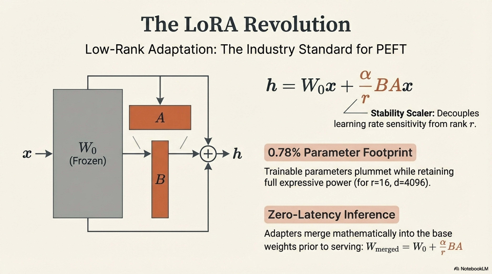

| Method | Trainable Params | Inference Overhead | Multi-Task | Composition | Memory |
|--------|-----------------|--------------------|-----------:|-------------|--------|
| Full FT | $d$ (100%) | None | New copy per task | No | $\sim 16d$ bytes |
| LoRA | $2rLd$ (~0.1–1%) | None (merge) | Swap adapters | Hot-swap | Low |
| QLoRA | $2rLd$ (~0.1–1%) | Dequant | Swap adapters | Hot-swap | Very Low |
| DoRA | $2rLd + Ld_{\text{out}}$ | None (merge) | Swap | Hot-swap | Low |
| AdaLoRA | Variable (adaptive) | None (merge) | Swap | Complex | Low |
| VeRA | $2rL$ | Small | Swap | Hot-swap | Minimal |
| GaLore | $0$ (full model, low-rank optimizer) | None | N/A | N/A | Low optimizer |
| Adapters | $2rLd + $ bias (~1–5%) | Forward latency | Swap | Moderate | Moderate |
| Prefix Tuning | $2L \cdot L_p \cdot d$ (~0.1%) | Context length | Swap | High | Low |
| Prompt Tuning | $L_p \cdot d$ (~0.01%) | Context length | Swap | Very High | Minimal |
| IA³ | $L \cdot (2d_k + d_{\text{ff}})$ (~0.01%) | Negligible | Swap | High | Minimal |

### 3.7 PEFT (LoRA Family) — Unified Pseudo-Algorithm

```
━━━━━━━━━━━━━━━━━━━━━━━━━━━━━━━━━━━━━━━━━━━━━━━━━━━━━━━━━━━━━━━
ALGORITHM: Unified PEFT Fine-Tuning
━━━━━━━━━━━━━━━━━━━━━━━━━━━━━━━━━━━━━━━━━━━━━━━━━━━━━━━━━━━━━━━

INPUT:
  θ*             : Pretrained model parameters (frozen)
  D_task         : Task dataset {(x, y)}
  method         : ∈ {LORA, QLORA, DORA, ADALORA, VERA, 
                      ADAPTER, PREFIX, PROMPT, IA3, GALORE}
  r              : Rank / bottleneck dimension
  α              : LoRA scaling (for LoRA variants)
  target_modules : Set of modules to adapt
  L_p            : Prefix/prompt length (for prefix/prompt methods)
  T_train        : Training steps

OUTPUT:
  φ*             : Optimized adaptation parameters
  θ_merged       : Merged model (where applicable)

PROCEDURE:

  1. PARAMETER INSERTION:

     IF method == LORA:
       FOR each W₀ ∈ target_modules:
         Create A ∈ ℝ^{r × d_in} ~ N(0, σ²)
         Create B ∈ ℝ^{d_out × r} ← 0
         Forward: h = W₀x + (α/r)·B·A·x
         φ += {A, B}

     ELIF method == QLORA:
       FOR each W₀ ∈ target_modules:
         Ŵ₀ = NF4_Quantize(W₀)  [4-bit, frozen]
         Apply double quantization to scale factors
         Create A, B as in LoRA
         Forward: h = Dequant(Ŵ₀)·x + (α/r)·B·A·x
         φ += {A, B}

     ELIF method == DORA:
       FOR each W₀ ∈ target_modules:
         Create A, B as in LoRA
         Create m ∈ ℝ^{d_out} ← ‖W₀‖_column_wise
         Forward: 
           W_adapted = W₀ + (α/r)·B·A
           h = m · (W_adapted / ‖W_adapted‖_c) · x
         φ += {A, B, m}

     ELIF method == ADALORA:
       FOR each W₀ ∈ target_modules:
         Create P ∈ ℝ^{d_out × r_init} (orthogonal init)
         Create Q ∈ ℝ^{r_init × d_in} (orthogonal init)
         Create Λ = diag(λ₁,...,λ_{r_init}) ← small values
         Forward: h = W₀x + P·Λ·Q·x
         φ += {P, Q, Λ}

     ELIF method == VERA:
       Create shared A_shared ∈ ℝ^{r × d_in} ~ N(0,1) [FROZEN]
       Create shared B_shared ∈ ℝ^{d_out × r} ~ N(0,1) [FROZEN]
       FOR each W₀ ∈ target_modules:
         Create d_a^(ℓ) ∈ ℝ^r ← 0
         Create d_b^(ℓ) ∈ ℝ^r ← 0
         Forward: h = W₀x + B_shared·diag(d_b)·A_shared·diag(d_a)·x
         φ += {d_a^(ℓ), d_b^(ℓ)}

     ELIF method == ADAPTER:
       FOR each transformer block:
         Create W_down ∈ ℝ^{d × r}, W_up ∈ ℝ^{r × d}
         Forward: h' = h + GELU(h·W_down)·W_up
         φ += {W_down, W_up}

     ELIF method == PREFIX:
       FOR each layer ℓ = 1 TO L:
         Create E^(ℓ) ∈ ℝ^{L_p × d'} [learnable embeddings]
         Create MLP_ℓ : ℝ^{d'} → ℝ^{2d} 
           (to produce P_K, P_V)
         [P_K^(ℓ); P_V^(ℓ)] = MLP_ℓ(E^(ℓ))
         Prepend P_K, P_V to key/value at layer ℓ
         φ += {E^(ℓ), MLP_ℓ params}

     ELIF method == PROMPT:
       Create P ∈ ℝ^{L_p × d} [learnable soft prompts]
       Prepend P to input embeddings
       φ = {P}

     ELIF method == IA3:
       FOR each layer ℓ:
         Create l_k ∈ ℝ^{d_k} ← 1
         Create l_v ∈ ℝ^{d_v} ← 1
         Create l_ff ∈ ℝ^{d_ff} ← 1
         Modify: k = l_k ⊙ W_K·h, v = l_v ⊙ W_V·h
         Modify: h_ff = l_ff ⊙ activation(h·W₁)
         φ += {l_k, l_v, l_ff}

     ELIF method == GALORE:
       All parameters are trainable (no separate φ)
       Initialize projection matrices P, Q via SVD of 
         initial gradient

  2. FREEZE BASE MODEL:
     Set requires_gradient = FALSE for all θ*
     Set requires_gradient = TRUE for all φ
     (Exception: GALORE — all params trainable, 
      but optimizer states are projected)


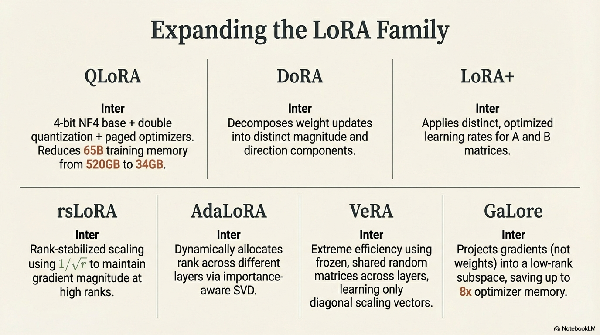

  3. TRAINING LOOP:
     optimizer ← AdamW(φ, lr=η)
     FOR step = 1 TO T_train:
       3.1  Sample (x, y) from D_task
       3.2  Forward pass through adapted model
       3.3  Compute loss L (masked NLL on completions)
       3.4  Backward: ∇_φ L
       3.5  IF method == ADALORA AND step mod T_prune == 0:
              Compute importance I_k^(ℓ) for each singular direction
              Zero out bottom-p% singular values globally
              (budget reallocation across layers)
       3.6  IF method == GALORE AND step mod T_proj == 0:
              Recompute projection: P, Q ← SVD_r(∇_W)
       3.7  Optimizer step on φ (or projected gradients)

  4. POST-TRAINING:
     IF method ∈ {LORA, DORA, ADALORA}:
       Merge: W_final = W₀ + adaptation_delta
     ELIF method == PREFIX:
       Discard MLP, keep computed prefix vectors
     ELIF method == QLORA:
       Option A: Merge LoRA into dequantized weights, re-quantize
       Option B: Keep separate for adapter swapping

  5. RETURN φ*, θ_merged (if merged)

━━━━━━━━━━━━━━━━━━━━━━━━━━━━━━━━━━━━━━━━━━━━━━━━━━━━━━━━━━━━━━━
```

---

## 4. Efficient Training Strategies

### 4.1 Mixed-Precision Training

#### 4.1.1 Definition

**Mixed-precision training** uses lower-precision numerical formats (FP16, BF16) for forward/backward computation while maintaining a **FP32 master copy** of weights for accumulation, balancing speed and numerical stability.

#### 4.1.2 Floating-Point Format Comparison

| Format | Exponent | Mantissa | Total Bits | Dynamic Range | Precision |
|--------|----------|----------|-----------|---------------|-----------|
| FP32 | 8 | 23 | 32 | $\pm 3.4 \times 10^{38}$ | $\sim 7$ decimal digits |
| FP16 | 5 | 10 | 16 | $\pm 6.5 \times 10^{4}$ | $\sim 3.3$ decimal digits |
| BF16 | 8 | 7 | 16 | $\pm 3.4 \times 10^{38}$ | $\sim 2.4$ decimal digits |
| TF32 | 8 | 10 | 19 | $\pm 3.4 \times 10^{38}$ | $\sim 3.3$ decimal digits |
| FP8 (E4M3) | 4 | 3 | 8 | $\pm 448$ | $\sim 1.2$ decimal digits |
| FP8 (E5M2) | 5 | 2 | 8 | $\pm 57344$ | $\sim 0.9$ decimal digits |

**BF16 vs. FP16:** BF16 has the **same exponent range** as FP32, eliminating overflow/underflow issues — the primary failure mode in FP16 training. Modern LLM training overwhelmingly uses BF16.

#### 4.1.3 Mixed-Precision Training Protocol

The three components:

1. **FP32 Master Weights:** $\theta^{(32)} \in \mathbb{R}^d$ — full-precision copy
2. **BF16 Forward/Backward:** Cast weights to BF16, compute loss and gradients in BF16
3. **FP32 Accumulation:** Gradient updates and optimizer states in FP32

**Loss Scaling (for FP16 only, not needed for BF16):**

FP16 gradients below $2^{-24} \approx 5.96 \times 10^{-8}$ underflow to zero. **Dynamic loss scaling** prevents this:

$$\tilde{\mathcal{L}} = S \cdot \mathcal{L} \quad \Rightarrow \quad \tilde{g} = S \cdot g \quad \Rightarrow \quad g = \tilde{g} / S$$

where $S$ is dynamically adjusted:
- If no overflow in $N_{\text{check}}$ steps: $S \leftarrow 2S$
- If overflow detected: $S \leftarrow S/2$, skip update

#### 4.1.4 FP8 Training (Emerging)

**Transformer Engine** decomposes the precision assignment:

| Operation | Forward Precision | Backward (Activation Grad) | Backward (Weight Grad) |
|-----------|:---:|:---:|:---:|
| MatMul | E4M3 × E4M3 | E5M2 × E4M3 | E5M2 × E4M3 |
| Accumulation | FP32 | FP32 | FP32 |

**Per-tensor scaling** with delayed calibration:

$$S_t = \frac{E4M3_{\max}}{\max(|X_{t-1}|) \cdot \text{margin}}$$

Scale is computed from the **previous iteration's** tensor statistics (delayed by 1 step) — avoids synchronous calibration overhead.

### 4.2 Mixed-Precision — Pseudo-Algorithm

```
━━━━━━━━━━━━━━━━━━━━━━━━━━━━━━━━━━━━━━━━━━━━━━━━━━━━━━━━━━━━━━━
ALGORITHM: Mixed-Precision Training with Dynamic Loss Scaling
━━━━━━━━━━━━━━━━━━━━━━━━━━━━━━━━━━━━━━━━━━━━━━━━━━━━━━━━━━━━━━━

INPUT:
  θ^(32)      : FP32 master weights
  D_train     : Training dataset
  precision   : ∈ {FP16, BF16, FP8}
  S₀          : Initial loss scale (e.g., 2¹⁶)
  T_steps     : Training steps
  N_check     : Steps between scale increase attempts

OUTPUT:
  θ*          : Trained model parameters

PROCEDURE:

  1. INITIALIZE:
     θ^(32) ← pretrained or random initialization
     S ← S₀  (loss scale, only used if precision == FP16)
     overflow_counter ← 0
     optimizer ← AdamW with FP32 states (m, v ∈ FP32)

  2. FOR step = 1 TO T_steps:

     2.1  CAST: θ^(low) ← cast(θ^(32), precision)

     2.2  FORWARD PASS (in low precision):
          Compute z = f_{θ^(low)}(x) using low-precision matmuls
          Activations stored in low precision 
            (or selectively in FP32 for sensitive ops: 
             softmax, layer norm, loss computation)
          Compute L in FP32 (always)

     2.3  LOSS SCALING (FP16 only):
          IF precision == FP16:
            L̃ = S · L
          ELSE:
            L̃ = L

     2.4  BACKWARD PASS (in low precision):
          Compute ∇_{θ^(low)} L̃ 
          Gradient accumulation in FP32 for critical paths

     2.5  UNSCALE GRADIENTS (FP16 only):
          IF precision == FP16:
            g = ∇_{θ^(low)} L̃ / S

          CHECK FOR OVERFLOW:
            IF any(isinf(g)) OR any(isnan(g)):
              S ← S / 2
              overflow_counter ← 0
              SKIP this update step (CONTINUE)
            ELSE:
              overflow_counter += 1
              IF overflow_counter ≥ N_check:
                S ← min(S × 2, S_max)
                overflow_counter ← 0

     2.6  GRADIENT PROCESSING (in FP32):
          g^(32) ← cast(g, FP32)
          Apply gradient clipping in FP32
          
     2.7  OPTIMIZER UPDATE (in FP32):
          θ^(32) ← AdamW_step(θ^(32), g^(32), m, v)

  3. RETURN θ* ← θ^(32)

NOTES:
  - BF16 training: loss scaling is unnecessary (sufficient 
    dynamic range); all other steps identical
  - FP8 training: use per-tensor delayed scaling, 
    E4M3 for forward, E5M2 for backward gradients
  - Operations in FP32 always: softmax, layer norm, 
    loss computation, optimizer state updates

━━━━━━━━━━━━━━━━━━━━━━━━━━━━━━━━━━━━━━━━━━━━━━━━━━━━━━━━━━━━━━━
```

### 4.3 Data Selection and Curriculum Strategies

#### 4.3.1 Problem Formulation

Given a large pool of candidate training data $\mathcal{D}_{\text{pool}}$ and a compute budget sufficient for only $|\mathcal{D}_{\text{subset}}| \ll |\mathcal{D}_{\text{pool}}|$ training examples, select $\mathcal{D}_{\text{subset}} \subset \mathcal{D}_{\text{pool}}$ to maximize downstream performance:

$$\mathcal{D}_{\text{subset}}^* = \arg\max_{\mathcal{D} \subset \mathcal{D}_{\text{pool}}, |\mathcal{D}| \leq k} \; \mathcal{P}\big(\text{Train}(\theta_0, \mathcal{D})\big)$$

where $\mathcal{P}(\cdot)$ is the performance metric.

#### 4.3.2 Data Quality Scoring Methods

**Perplexity-Based Filtering:**

Train a small reference model $p_{\text{ref}}$ on high-quality data (e.g., Wikipedia). Score each candidate:

$$\text{PPL}_{\text{ref}}(x) = \exp\left(-\frac{1}{|x|}\sum_t \log p_{\text{ref}}(x_t \mid x_{<t})\right)$$

Select examples with **low perplexity** under the reference model (indicative of well-formed, high-quality text). Reject extremes: very low PPL = repetitive/memorized; very high PPL = noise/garbage.

$$\mathcal{D}_{\text{subset}} = \{x \in \mathcal{D}_{\text{pool}} : \text{PPL}_{\min} \leq \text{PPL}_{\text{ref}}(x) \leq \text{PPL}_{\max}\}$$

**Influence Function-Based Selection:**

The influence of training point $z_i = (x_i, y_i)$ on validation loss:

$$\mathcal{I}(z_i) = -\nabla_\theta \mathcal{L}(z_{\text{val}})^\top H_\theta^{-1} \nabla_\theta \mathcal{L}(z_i)$$

where $H_\theta = \frac{1}{N}\sum_i \nabla^2 \mathcal{L}(z_i)$ is the Hessian. Computationally intractable for LLMs; approximated via:
- **TRAK (Park et al., 2023):** Random projection of gradients + ensemble
- **DataInf:** First-order approximation using gradient inner products

**EL2N Score (Error L2 Norm — Paul et al., 2021):**

$$\text{EL2N}(x, y) = \left\| p_\theta(y \mid x) - \mathbf{e}_y \right\|_2$$

where $\mathbf{e}_y$ is the one-hot target. High EL2N indicates **hard examples** — selecting moderate EL2N values (not too easy, not too noisy) yields optimal training.

**DSIR (Data Selection via Importance Resampling — Xie et al., 2023):**

Compute importance weights via density ratio estimation between target distribution $p_{\text{target}}$ (high-quality domain) and source distribution $p_{\text{source}}$ (general pool):

$$w(x) = \frac{p_{\text{target}}(x)}{p_{\text{source}}(x)} \approx \frac{\hat{p}_{\text{target}}(\text{features}(x))}{\hat{p}_{\text{source}}(\text{features}(x))}$$

Resample from $\mathcal{D}_{\text{pool}}$ with probability $\propto w(x)$.

#### 4.3.3 Curriculum Learning

**Anti-Curriculum (Easy → Hard ordering)** has shown mixed results for LLMs. More effective:

**Skill-It (Chen et al., 2024):** Model skills as a DAG. Train on foundational skills first, then advance to composite skills:

$$\text{Schedule}(t) = \{s_k : \text{prerequisites}(s_k) \subset \text{mastered}(t)\}$$

**D2 Pruning (Data-Driven Pruning):** At each epoch, compute training loss on all examples. Remove the bottom-$p$% (too easy, already learned) and top-$p$% (too hard, potentially noisy). Dynamic shrinkage of training set.

#### 4.3.4 Active Learning for Fine-Tuning

For **annotation-budget-constrained** fine-tuning:

$$x_{\text{next}} = \arg\max_{x \in \mathcal{U}} \; \mathcal{A}(x; \theta)$$

Acquisition functions $\mathcal{A}$:

- **Predictive Entropy:** $\mathcal{A}(x) = H[p_\theta(y \mid x)] = -\sum_y p(y|x) \log p(y|x)$
- **Variation Ratio:** $\mathcal{A}(x) = 1 - \max_y p(y \mid x)$
- **BALD (Bayesian Active Learning by Disagreement):** $\mathcal{A}(x) = H[p(y|x)] - \mathbb{E}_\theta[H[p(y|x, \theta)]]$

For LLMs, approximate via **MC Dropout** or **prompt perturbation ensembles**.

### 4.4 Data Selection — Pseudo-Algorithm

```
━━━━━━━━━━━━━━━━━━━━━━━━━━━━━━━━━━━━━━━━━━━━━━━━━━━━━━━━━━━━━━━
ALGORITHM: Multi-Criteria Data Selection for Efficient Fine-Tuning
━━━━━━━━━━━━━━━━━━━━━━━━━━━━━━━━━━━━━━━━━━━━━━━━━━━━━━━━━━━━━━━

INPUT:
  D_pool       : Large candidate dataset {x_i}_{i=1}^{N}
  θ            : Current model parameters
  p_ref        : Reference quality model (small, trained on 
                 curated data)
  k            : Target subset size (budget constraint)
  strategy     : ∈ {PERPLEXITY, INFLUENCE, EL2N, DSIR, 
                     CURRICULUM, HYBRID}
  D_target     : (Optional) target domain examples for DSIR

OUTPUT:
  D_subset     : Selected training subset, |D_subset| = k
  w            : (Optional) per-example importance weights

PROCEDURE:

  1. SCORE COMPUTATION:

     IF strategy == PERPLEXITY:
       FOR each x_i ∈ D_pool:
         score_i = PPL_{p_ref}(x_i)
       Remove: score_i < PPL_min (repetitive) 
               OR score_i > PPL_max (noise)
       Select top-k by proximity to median PPL range

     ELIF strategy == INFLUENCE:
       Compute reference gradient:
         g_val = (1/|D_val|) Σ ∇_θ L(z_val)
       FOR each x_i ∈ D_pool:
         g_i = ∇_θ L(x_i)
         score_i = g_val · g_i  (gradient alignment)
       Select top-k by score_i  (most helpful for val set)

     ELIF strategy == EL2N:
       Run θ for E_early epochs on D_pool
       FOR each x_i:
         Accumulate score_i = mean over epochs of 
           ‖p_θ(y|x_i) - e_y‖₂
       Select examples with score_i in 
         [quantile(0.2), quantile(0.8)]
       (discard too-easy and too-hard)

     ELIF strategy == DSIR:
       Extract n-gram features for all x_i ∈ D_pool
       Estimate p_source(features) via n-gram model on D_pool
       Estimate p_target(features) via n-gram model on D_target
       FOR each x_i:
         w_i = p_target(features(x_i)) / p_source(features(x_i))
       Importance-resample k examples with prob ∝ w_i

     ELIF strategy == HYBRID:
       Compute multiple scores per example:
         s_quality = f(PPL, grammar, coherence)
         s_diversity = distance from cluster centroid
         s_difficulty = EL2N or loss-based
       Composite: score_i = weighted combination
       Apply facility location submodular maximization:
         D_subset = GREEDY_SUBMODULAR(D_pool, k, score)

  2. DIVERSITY ENFORCEMENT:
     IF enable_diversity:
       Embed all scored candidates via sentence embeddings
       Apply k-means clustering with C clusters
       Sample proportionally from each cluster
       OR: use determinantal point process (DPP) sampling

  3. DEDUPLICATION:
     Remove near-duplicates via MinHash within D_subset
     Fill removed slots from ranked candidates

  4. VALIDATION:
     Verify: domain coverage, length distribution, 
             topic diversity, label balance (if applicable)

  5. RETURN D_subset, w (importance weights if DSIR)

━━━━━━━━━━━━━━━━━━━━━━━━━━━━━━━━━━━━━━━━━━━━━━━━━━━━━━━━━━━━━━━
```

---

### 4.5 Prompt Compression

#### 4.5.1 Definition

**Prompt compression** reduces the number of tokens in the input prompt while preserving the semantic content necessary for accurate response generation. This addresses the quadratic attention cost $\mathcal{O}(T^2 d)$ and the linear KV-cache growth $\mathcal{O}(T)$:

$$x_{\text{compressed}} = \text{Compress}(x), \quad |x_{\text{compressed}}| \ll |x|$$

such that:

$$p_\theta(y \mid x_{\text{compressed}}) \approx p_\theta(y \mid x)$$

#### 4.5.2 Taxonomy

```
Prompt Compression
├── Token-Level Pruning
│   ├── Attention-Based (remove low-attention tokens)
│   ├── Information-Theoretic (entropy/mutual information)
│   └── Extractive (select key sentences/phrases)
├── Soft Compression (map tokens to fewer continuous vectors)
│   ├── Gist Tokens (Mu et al., 2023)
│   ├── AutoCompressors (Chevalier et al., 2023)
│   └── ICAE (In-Context Autoencoder)
├── LLM-Based Summarization
│   └── LLMLingua (Jiang et al., 2023)
└── Retrieval-Augmented Compression
    └── Selective context retrieval
```

#### 4.5.3 LLMLingua / LongLLMLingua

**Token-level perplexity-based filtering** using a small LM:

For each token $x_t$ in the prompt, compute its **conditional perplexity** under a small model $p_{\text{small}}$:

$$\text{PPL}_t = -\log p_{\text{small}}(x_t \mid x_{<t})$$

High perplexity tokens carry **more information** (surprising/informative). Low perplexity tokens are **redundant** (predictable from context).

**Budget-constrained selection:**

$$\mathcal{S}^* = \arg\max_{\mathcal{S} \subset \{1,\dots,T\}, |\mathcal{S}| = k} \sum_{t \in \mathcal{S}} \text{PPL}_t$$

Keep the top-$k$ highest-perplexity tokens. This achieves 2–20× compression with minimal quality degradation.

**LLMLingua-2:** Trains a dedicated binary classifier to predict token importance:

$$\hat{y}_t = \sigma(W h_t^{\text{encoder}} + b) \in [0, 1]$$

trained on distillation labels: $y_t = 1$ if removing $x_t$ changes the LLM's output, $y_t = 0$ otherwise.

#### 4.5.4 Gist Tokens

Train the model to compress arbitrary-length context into a fixed number of **gist tokens** $G = (g_1, \dots, g_k)$:

**Training objective:**

$$\mathcal{L}_{\text{gist}} = \mathbb{E}_{x, y}\left[-\log p_\theta(y \mid g_1, \dots, g_k)\right]$$

where the gist tokens are generated by a **compressor** that attends to the full input:

$$g_i = \text{Compressor}(x, i)$$

**At inference:** The full prompt is compressed into $k$ gist tokens; the LLM conditions only on these $k$ tokens + the query. Context window cost drops from $|x| + |q|$ to $k + |q|$.

#### 4.5.5 Attention-Based Compression (Token Eviction)

During inference, dynamically evict low-importance tokens from the KV-cache:

**H₂O (Heavy-Hitter Oracle — Zhang et al., 2023):**

Maintain a budget $B$ for KV-cache size. At each generation step:

1. Compute cumulative attention scores for each cached position:
$$\text{Score}(j) = \sum_{t : t > j} \sum_h A_{t,j}^{(h)}$$

2. Retain: top-$B$ positions by score (heavy hitters) + recent $W$ positions (sliding window)

3. Evict all other positions from KV-cache

**Observation:** Attention in LLMs concentrates on a small subset of tokens (~5–10%) — the "heavy hitters" — which are critical for accurate generation regardless of context length.

**StreamingLLM (Xiao et al., 2023):** Preserves the initial **attention sink** tokens (first 4 tokens) + a sliding window of recent tokens:

$$\text{KV-cache} = \{\text{sink tokens}\} \cup \{\text{last } W \text{ tokens}\}$$

The attention sink phenomenon: initial tokens accumulate disproportionate attention regardless of content, serving as a normalization anchor.

### 4.6 Prompt Compression — Pseudo-Algorithm

```
━━━━━━━━━━━━━━━━━━━━━━━━━━━━━━━━━━━━━━━━━━━━━━━━━━━━━━━━━━━━━━━
ALGORITHM: Adaptive Prompt Compression (LLMLingua-Style)
━━━━━━━━━━━━━━━━━━━━━━━━━━━━━━━━━━━━━━━━━━━━━━━━━━━━━━━━━━━━━━━

INPUT:
  x              : Input prompt tokens (x₁, x₂, ..., x_T)
  p_small        : Small reference LM for importance scoring
  τ_target       : Target compression ratio ∈ (0, 1)
  method         : ∈ {PERPLEXITY, CLASSIFIER, ATTENTION, GIST}
  p_large        : Target LLM for inference
  preserve_set   : Token types to always preserve 
                   (special tokens, question tokens, key entities)

OUTPUT:
  x_compressed   : Compressed prompt (|x_compressed| ≈ τ_target · T)
  y              : LLM response conditioned on x_compressed

PROCEDURE:

  1. SEGMENT PROMPT:
     Decompose x into semantic segments:
       {S_system, S_context_1, ..., S_context_m, S_instruction, S_query}
     Assign per-segment compression ratios:
       τ_query = 1.0           (never compress query)
       τ_instruction = 0.9     (light compression)
       τ_context = adjusted to meet overall τ_target

  2. IMPORTANCE SCORING:

     IF method == PERPLEXITY:
       Run p_small on x:
         FOR t = 1 TO T:
           importance_t = -log p_small(x_t | x_{<t})
         // Higher = more informative = keep

     ELIF method == CLASSIFIER:
       Run trained token classifier on x:
         FOR t = 1 TO T:
           importance_t = σ(W · encode(x, t) + b)

     ELIF method == ATTENTION:
       Run p_large on x (one forward pass):
         FOR t = 1 TO T:
           importance_t = Σ_{layers} Σ_{heads} mean(A_{:, t})
         // Tokens receiving high attention are important

  3. COARSE-LEVEL COMPRESSION (segment-level):
     IF number of context segments > threshold:
       Score each segment: 
         S_score_j = mean(importance_t : t ∈ segment_j)
       Remove lowest-scoring segments until within 
         coarse budget

  4. FINE-LEVEL COMPRESSION (token-level):
     FOR each remaining segment S_j:
       Compute budget: k_j = ⌈τ_j · |S_j|⌉
       
       Apply forced preservation:
         Mark tokens in preserve_set as importance = ∞
       
       Select top-k_j tokens by importance score
       Maintain original token order in selection
       
       x_compressed_j ← selected tokens in order

  5. RECONSTRUCT:
     x_compressed = concatenate(
       x_compressed_system,
       x_compressed_context_1, ..., x_compressed_context_m,
       x_compressed_instruction,
       x_query   // uncompressed
     )

  6. OPTIONAL: ITERATIVE REFINEMENT
     IF quality_check:
       Generate y_compressed ← p_large(x_compressed)
       IF divergence_metric(x_compressed, x) > δ:
         Reduce compression ratio: τ_target ← τ_target + 0.1
         GOTO step 4

  7. INFERENCE:
     y ← p_large(y | x_compressed)

  8. RETURN x_compressed, y

━━━━━━━━━━━━━━━━━━━━━━━━━━━━━━━━━━━━━━━━━━━━━━━━━━━━━━━━━━━━━━━
```

---

### 4.7 KV-Cache Optimization During Inference

#### 4.7.1 Multi-Query Attention (MQA) and Grouped-Query Attention (GQA)

**Standard MHA:** $H$ heads, each with independent $K, V$ projections → KV-cache size $\mathcal{O}(2 \cdot L \cdot H \cdot T \cdot d_h)$

**MQA (Shazeer, 2019):** All heads share **one** $K, V$ pair:

$$\text{KV-cache}_{\text{MQA}} = \mathcal{O}(2 \cdot L \cdot 1 \cdot T \cdot d_h) = \frac{1}{H} \times \text{MHA cache}$$

**GQA (Ainslie et al., 2023):** Group $H$ heads into $G$ groups ($1 < G < H$), each group shares $K, V$:

$$\text{KV-cache}_{\text{GQA}} = \mathcal{O}(2 \cdot L \cdot G \cdot T \cdot d_h) = \frac{G}{H} \times \text{MHA cache}$$

LLaMA 2 70B uses $G = 8$ with $H = 64$ → **8× reduction** in KV-cache.

#### 4.7.2 Sliding Window Attention

Mistral uses a window size $W$: each token only attends to the previous $W$ tokens. KV-cache is bounded:

$$\text{KV-cache} = \mathcal{O}(2 \cdot L \cdot W \cdot d) \quad \text{independent of sequence length } T$$

Combined with **rolling buffer**: positions are stored modulo $W$, overwriting stale entries.

### 4.8 Gradient Checkpointing (Activation Recomputation)

#### 4.8.1 Definition

Standard backpropagation stores all intermediate activations — for an $L$-layer model, memory $\mathcal{O}(L \cdot B \cdot T \cdot d)$. **Gradient checkpointing** stores activations only at selected checkpoint layers $\mathcal{C} \subset \{1, \dots, L\}$ and **recomputes** intermediate activations during the backward pass.

**Memory-compute tradeoff:**

| Strategy | Activation Memory | Compute Overhead |
|----------|------------------|-----------------|
| No checkpointing | $\mathcal{O}(L)$ | $1\times$ |
| Every $\sqrt{L}$ layers | $\mathcal{O}(\sqrt{L})$ | $\sim 1.33\times$ |
| Every layer (full recompute) | $\mathcal{O}(1)$ | $\sim 2\times$ |
| Selective (attention only) | Application-dependent | ~$1.2\times$ |

**Optimal checkpoint placement (Chen et al., 2016):** Place $\sqrt{L}$ evenly-spaced checkpoints, achieving $\mathcal{O}(\sqrt{L})$ memory with only ~33% compute overhead.

### 4.9 Distributed Training Strategies (Brief)

| Strategy | What is Parallelized | Communication Pattern |
|----------|---------------------|----------------------|
| **Data Parallel (DP)** | Data batches | All-Reduce gradients |
| **FSDP (ZeRO)** | Model params + optimizer states sharded | All-Gather params (forward), Reduce-Scatter grads |
| **Tensor Parallel (TP)** | Individual layer computations | All-Reduce within layer |
| **Pipeline Parallel (PP)** | Model layers across devices | Point-to-point inter-stage |
| **Sequence Parallel (SP)** | Sequence dimension | All-to-All |
| **Expert Parallel (EP)** | MoE experts across devices | All-to-All dispatch |

**ZeRO Stage Classification:**


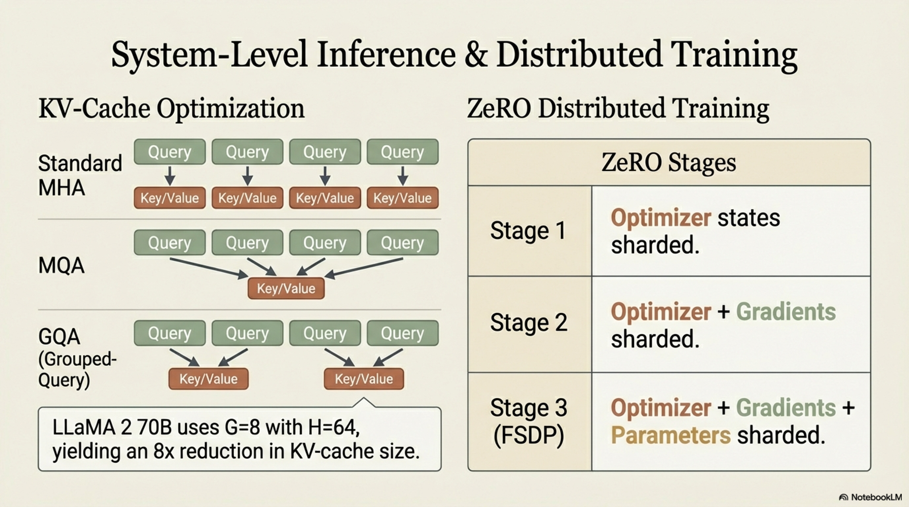

| ZeRO Stage | Sharded Component | Memory per GPU |
|:---:|---|---|
| Stage 1 | Optimizer states | $\sim d + \frac{12d}{N}$ |
| Stage 2 | + Gradients | $\sim d + \frac{14d}{N}$ → better: $\sim 2d + \frac{12d}{N}$ |
| Stage 3 | + Parameters | $\sim \frac{16d}{N}$ |

where $d$ = model params (in FP16), $N$ = number of devices, and 12 = bytes for AdamW states (FP32 copy + FP32 $m$ + FP32 $v$).

---

## 5. Unified Efficiency Landscape — Summary

$$\boxed{\text{Efficiency} = f(\underbrace{\text{Compression}}_{\text{pruning + quantization}}, \underbrace{\text{PEFT}}_{\text{LoRA, adapters, prefix}}, \underbrace{\text{Training}}_{\text{mixed precision, data selection}}, \underbrace{\text{Inference}}_{\text{prompt compression, KV-cache}})}$$


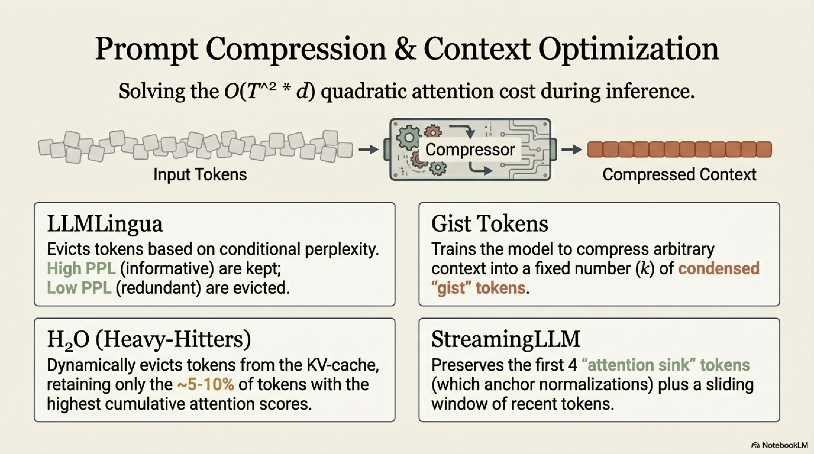


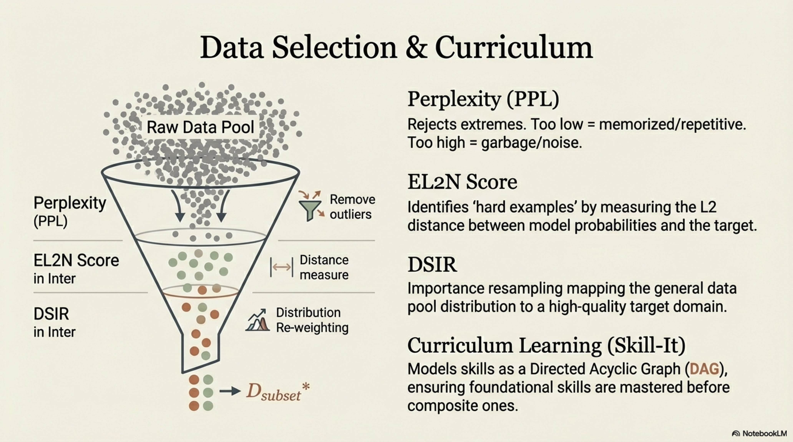


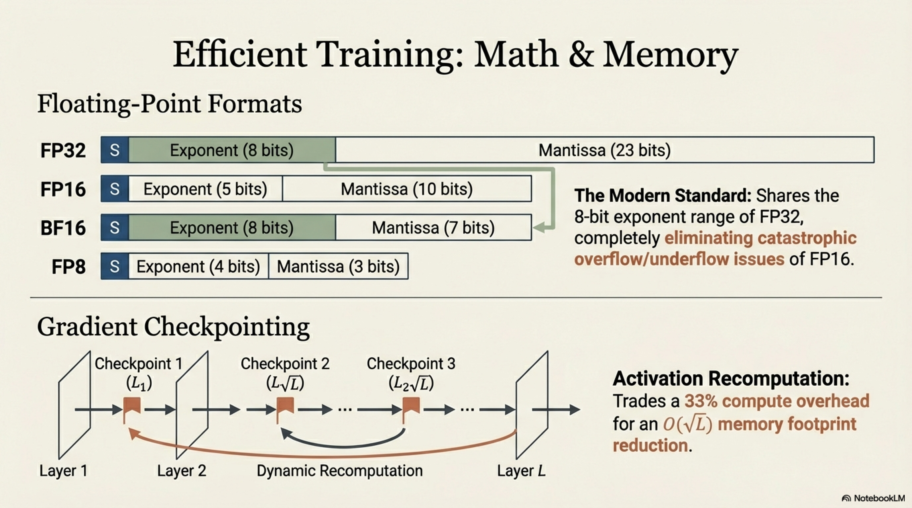


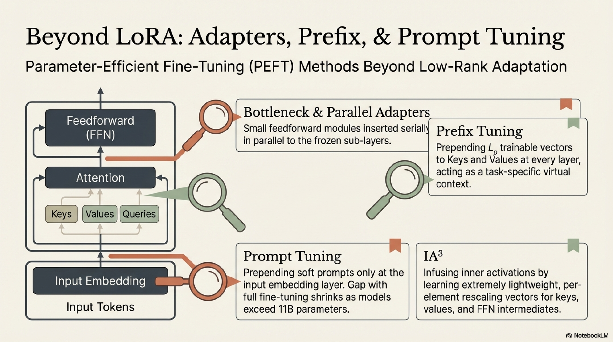

| Technique | Primary Bottleneck Addressed | Typical Savings | Quality Impact |
|-----------|:---:|:---:|:---:|
| Quantization (4-bit) | Inference memory/latency | 4× memory | <1% perplexity |
| Pruning (50% unstructured) | Parameters/memory | 2× | 1–3% perplexity |
| LoRA ($r=16$) | Training memory/compute | 10–100× fewer trainable params | ~0% vs. full FT |
| QLoRA | Training memory | 16× GPU mem | ~0% vs. full FT |
| Mixed precision (BF16) | Training compute/memory | 2× speed, 2× memory | ~0% |
| Gradient checkpointing | Training activation memory | 3–4× activation memory | 0% (exact) |
| Data selection | Training compute | 2–10× fewer examples | 0% or positive |
| Prompt compression | Inference compute/latency | 2–10× context reduction | Task-dependent |
| KV-cache quantization | Inference memory | 4–8× cache reduction | <1% |
| GQA | Inference KV-cache | $H/G$× reduction | Trained into model |

**Composability** is critical: modern efficient fine-tuning pipelines combine multiple techniques simultaneously:

$$\text{QLoRA} + \text{BF16 training} + \text{gradient checkpointing} + \text{data selection} + \text{4-bit inference} + \text{KV-cache quant}$$


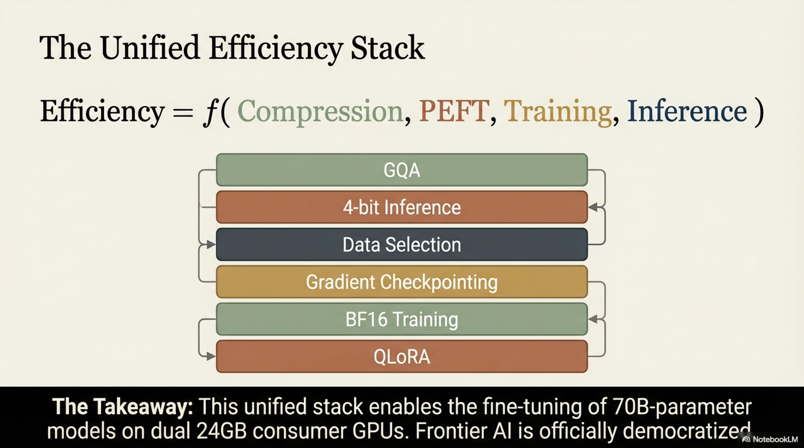

This stack enables fine-tuning 70B-parameter models on 2× 24GB GPUs and deploying them on consumer hardware — democratizing access to frontier LLM capabilities.