# Language Model Pretraining: A Rigorous Treatment


---

## 1. Language Model Pretraining

### 1.1 Definition

Language Model Pretraining is the paradigm of learning transferable, general-purpose representations of language by optimizing a self-supervised objective over large unlabeled corpora $\mathcal{D} = \{x^{(1)}, x^{(2)}, \ldots, x^{(N)}\}$, where each $x^{(i)} = (x_1^{(i)}, x_2^{(i)}, \ldots, x_{T_i}^{(i)})$ is a variable-length token sequence. The learned parameters $\theta^*$ encode distributional, syntactic, and semantic regularities that transfer to downstream tasks via fine-tuning or feature extraction, dramatically reducing the labeled data requirement.


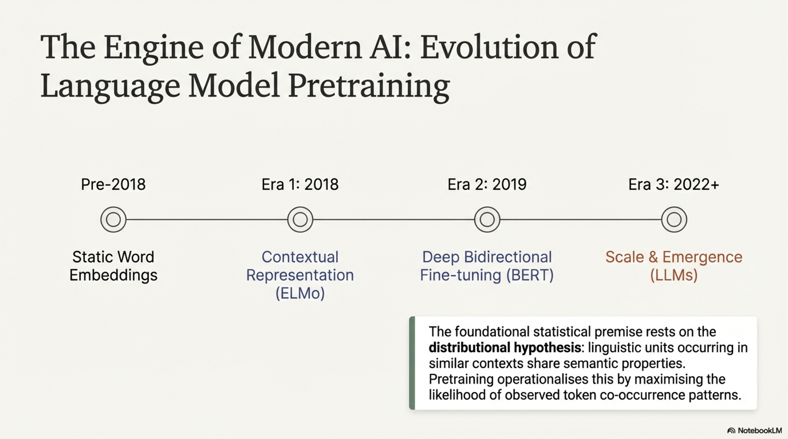

The foundational statistical premise rests on the **distributional hypothesis**: linguistic units occurring in similar contexts share semantic properties. Pretraining operationalizes this by maximizing the likelihood of observed token co-occurrence patterns under a parameterized model.

### 1.2 Mathematical Formulation


#### 1.2.1 Autoregressive (Causal) Language Modeling

Model the joint distribution via the chain rule of probability:

$$P_\theta(x_1, x_2, \ldots, x_T) = \prod_{t=1}^{T} P_\theta(x_t \mid x_{<t})$$

The training objective maximizes the log-likelihood:

$$\mathcal{L}_{AR}(\theta) = \sum_{i=1}^{N} \sum_{t=1}^{T_i} \log P_\theta\!\left(x_t^{(i)} \mid x_1^{(i)}, \ldots, x_{t-1}^{(i)}\right)$$

Each conditional is parameterized as:

$$P_\theta(x_t \mid x_{<t}) = \text{softmax}\!\left(W_e \cdot h_t^{(L)} + b\right)_{x_t}$$

where $h_t^{(L)} \in \mathbb{R}^d$ is the top-layer hidden state at position $t$, $W_e \in \mathbb{R}^{|V| \times d}$ is the output projection (often tied with input embeddings), and $|V|$ is the vocabulary size.

#### 1.2.2 Masked Language Modeling (Bidirectional)

Given a corruption function $\mathcal{C}$ that selects a subset $\mathcal{M} \subset \{1, 2, \ldots, T\}$ of positions and replaces them with a special $[\text{MASK}]$ token (or random/original tokens), the objective maximizes:

$$\mathcal{L}_{MLM}(\theta) = \sum_{i=1}^{N} \sum_{t \in \mathcal{M}^{(i)}} \log P_\theta\!\left(x_t^{(i)} \mid \tilde{x}^{(i)}\right)$$

where $\tilde{x}^{(i)}$ denotes the corrupted sequence. The critical distinction: conditioning is on **all non-masked positions** (bidirectional context), not just the left context.

#### 1.2.3 Sequence-to-Sequence (Span Corruption)

Generalizes MLM by corrupting contiguous spans and reconstructing them autoregressively in the decoder:

$$\mathcal{L}_{S2S}(\theta) = \sum_{i=1}^{N} \sum_{j=1}^{|\mathcal{S}^{(i)}|} \sum_{k=1}^{|s_j^{(i)}|} \log P_\theta\!\left(s_{j,k}^{(i)} \mid \tilde{x}^{(i)}, s_{j,<k}^{(i)}\right)$$

where $\mathcal{S}^{(i)} = \{s_1^{(i)}, s_2^{(i)}, \ldots\}$ are the corrupted spans and $s_{j,k}^{(i)}$ is the $k$-th token of the $j$-th span.

### 1.3 The Pretraining–Fine-tuning Paradigm


The two-stage transfer protocol:

**Stage 1 (Pretraining):** Solve the self-supervised objective:
$$\theta^* = \arg\min_\theta \; \mathcal{L}_{pretrain}(\theta; \mathcal{D}_{unlabeled})$$

**Stage 2 (Fine-tuning):** Initialize from $\theta^*$, optimize a task-specific supervised objective:
$$\theta^{**} = \arg\min_\theta \; \mathcal{L}_{task}(\theta; \mathcal{D}_{labeled}) + \lambda \|\theta - \theta^*\|_2^2$$

The optional regularization term $\lambda \|\theta - \theta^*\|_2^2$ prevents catastrophic forgetting of pretrained knowledge.

### 1.4 Information-Theoretic Perspective

Pretraining minimizes the cross-entropy between the empirical data distribution $\hat{P}_{data}$ and the model distribution $P_\theta$:

$$H(\hat{P}_{data}, P_\theta) = -\mathbb{E}_{x \sim \hat{P}_{data}}[\log P_\theta(x)] = H(\hat{P}_{data}) + D_{KL}(\hat{P}_{data} \| P_\theta)$$

Since $H(\hat{P}_{data})$ is constant with respect to $\theta$, minimizing cross-entropy is equivalent to minimizing the KL divergence $D_{KL}(\hat{P}_{data} \| P_\theta)$, driving the model distribution toward the true data-generating process.

The **perplexity** serves as the exponentiated cross-entropy:

$$\text{PPL}(\theta) = \exp\!\left(-\frac{1}{T}\sum_{t=1}^{T} \log P_\theta(x_t \mid x_{<t})\right)$$

Lower perplexity implies better compression of the data, which under the minimum description length principle, corresponds to capturing more of the underlying linguistic structure.

### 1.5 Pseudo-Algorithm: General Language Model Pretraining

```
ALGORITHM: LanguageModelPretraining

INPUT:
    D_unlabeled       — Large unlabeled text corpus {x^(1), x^(2), ..., x^(N)}
    V                  — Vocabulary of size |V| (constructed via BPE/WordPiece/Unigram)
    θ_init             — Parameter initialization (Xavier/He/scaled)
    objective_type     — ∈ {AUTOREGRESSIVE, MASKED_LM, SPAN_CORRUPTION}
    η                  — Learning rate schedule function η(t)
    B                  — Mini-batch size
    T_max              — Maximum training steps
    mask_ratio         — Masking probability (for MLM/span corruption), typically 0.15
    warmup_steps       — Linear warmup period for learning rate
    optimizer_config   — {β₁, β₂, ε, weight_decay} for AdamW

OUTPUT:
    θ*                 — Pretrained model parameters encoding general linguistic knowledge

PROCEDURE:
    1. TOKENIZE each x^(i) ∈ D_unlabeled using subword segmentation → token ID sequences
    2. INITIALIZE parameters θ ← θ_init
    3. INITIALIZE optimizer state (first/second moment estimates) ← 0
    
    4. FOR step = 1 TO T_max DO:
    
        5. SAMPLE mini-batch B = {x^(b)}_{b=1}^{B} from D_unlabeled
        
        6. IF objective_type = AUTOREGRESSIVE:
            7. FOR each x^(b) in B:
                8. COMPUTE h_t^(L) = Encoder(x_{<t}^(b); θ)  ∀ t ∈ {1,...,T_b}
                9. COMPUTE logits_t = W_e · h_t^(L) + bias     ∀ t
                10. loss^(b) = -Σ_t log softmax(logits_t)[x_t^(b)]
                
        11. ELSE IF objective_type = MASKED_LM:
            12. FOR each x^(b) in B:
                13. SAMPLE mask set M^(b) where each position selected with P = mask_ratio
                14. APPLY corruption: 80% → [MASK], 10% → random token, 10% → original
                15. COMPUTE h_t^(L) = BidirectionalEncoder(x̃^(b); θ)  ∀ t
                16. loss^(b) = -Σ_{t ∈ M^(b)} log softmax(W_e · h_t^(L))[x_t^(b)]
                
        17. ELSE IF objective_type = SPAN_CORRUPTION:
            18. FOR each x^(b) in B:
                19. SAMPLE span lengths from Poisson(λ=3), corrupt ~15% of tokens
                20. REPLACE spans with sentinel tokens in encoder input
                21. CONSTRUCT decoder target: sentinel₁ span₁ sentinel₂ span₂ ...
                22. COMPUTE encoder representations H_enc = Encoder(x̃^(b); θ_enc)
                23. COMPUTE decoder logits via cross-attention to H_enc
                24. loss^(b) = -Σ_j Σ_k log P(s_{j,k} | x̃^(b), s_{j,<k})
        
        25. COMPUTE batch loss: L = (1/B) Σ_b loss^(b)
        26. COMPUTE gradients: g = ∇_θ L
        27. CLIP gradients: g ← g · min(1, max_norm / ‖g‖₂)
        28. UPDATE learning rate: η_current = ScheduleLR(step, warmup_steps, η)
        29. UPDATE parameters: θ ← AdamW(θ, g, η_current, optimizer_config)
        
        30. IF step MOD eval_interval = 0:
            31. COMPUTE validation perplexity on held-out set
            32. LOG metrics {loss, perplexity, gradient_norm, learning_rate}
            33. SAVE checkpoint if validation perplexity improves
    
    34. RETURN θ* ← θ
```

---

## 2. Embeddings from Language Models (ELMo)


### 2.1 Definition

ELMo (Peters et al., 2018) produces **deep contextualized word representations** by training a multi-layer bidirectional LSTM (biLSTM) language model and extracting a learned, task-specific linear combination of all internal layer representations. Unlike static embeddings (Word2Vec, GloVe) where each word type maps to a single vector regardless of context, ELMo assigns each word **token** a unique representation conditioned on its entire sentential context, capturing polysemy, syntax, and semantics at different layers of the network.

The key architectural insight: **different layers of a deep language model capture different types of linguistic information**—lower layers encode syntax and morphology, upper layers encode semantics and task-relevant abstractions.

### 2.2 Architecture

ELMo consists of three hierarchical components:

#### 2.2.1 Character-Level Convolutional Encoder

For a word $w$ composed of characters $(c_1, c_2, \ldots, c_m)$:

1. Each character $c_j$ is embedded into a $d_c$-dimensional vector via a character embedding matrix $E_{char} \in \mathbb{R}^{|\mathcal{C}| \times d_c}$.

2. A set of $F$ convolutional filters $\{W_f^{(k)} \in \mathbb{R}^{d_c \times k}\}$ with varying widths $k \in \{1, 2, 3, 4, 5, 6, 7\}$ are applied:

$$y_f^{(k)}(j) = \text{ReLU}\!\left(\sum_{l=0}^{k-1} W_f^{(k)}[:, l] \cdot e_{c_{j+l}} + b_f^{(k)}\right)$$

3. Max-over-time pooling extracts the most salient feature per filter:

$$\hat{y}_f^{(k)} = \max_j \; y_f^{(k)}(j)$$

4. All pooled features are concatenated and projected through two highway layers:

$$r = \text{concat}\!\left(\hat{y}_1^{(1)}, \ldots, \hat{y}_{F_1}^{(1)}, \hat{y}_1^{(2)}, \ldots, \hat{y}_{F_7}^{(7)}\right) \in \mathbb{R}^{d_{cnn}}$$

$$\text{Highway}(r) = t \odot g(W_H r + b_H) + (1 - t) \odot r$$

where $t = \sigma(W_T r + b_T)$ is the transform gate and $g$ is a nonlinearity.

5. A final linear projection maps to the biLSTM input dimension $d$:

$$x_t^{(0)} = W_{proj} \cdot \text{Highway}(r_t) + b_{proj} \in \mathbb{R}^d$$

This yields the **context-independent token representation** $x_t^{(0)}$ (Layer 0 of ELMo).

#### 2.2.2 Multi-Layer Bidirectional LSTM

A stack of $L$ layers ($L = 2$ in the original work) of bidirectional LSTMs, trained with **coupled** forward and backward language model objectives.

**Forward LSTM at layer $j$:**

$$\overrightarrow{h}_{t}^{(j)}, \overrightarrow{c}_{t}^{(j)} = \text{LSTM}^{(j)}_{\rightarrow}\!\left(\overrightarrow{h}_{t-1}^{(j)}, \overrightarrow{c}_{t-1}^{(j)}, \overrightarrow{h}_{t}^{(j-1)}\right)$$

**Backward LSTM at layer $j$:**

$$\overleftarrow{h}_{t}^{(j)}, \overleftarrow{c}_{t}^{(j)} = \text{LSTM}^{(j)}_{\leftarrow}\!\left(\overleftarrow{h}_{t+1}^{(j)}, \overleftarrow{c}_{t+1}^{(j)}, \overleftarrow{h}_{t}^{(j-1)}\right)$$

where the input to layer 1 is $\overrightarrow{h}_{t}^{(0)} = \overleftarrow{h}_{t}^{(0)} = x_t^{(0)}$.

**LSTM cell internals (expanded for layer $j$, forward direction):**

$$\begin{aligned}
i_t &= \sigma\!\left(W_{ii}^{(j)} \overrightarrow{h}_{t}^{(j-1)} + W_{hi}^{(j)} \overrightarrow{h}_{t-1}^{(j)} + b_i^{(j)}\right) \\
f_t &= \sigma\!\left(W_{if}^{(j)} \overrightarrow{h}_{t}^{(j-1)} + W_{hf}^{(j)} \overrightarrow{h}_{t-1}^{(j)} + b_f^{(j)}\right) \\
g_t &= \tanh\!\left(W_{ig}^{(j)} \overrightarrow{h}_{t}^{(j-1)} + W_{hg}^{(j)} \overrightarrow{h}_{t-1}^{(j)} + b_g^{(j)}\right) \\
o_t &= \sigma\!\left(W_{io}^{(j)} \overrightarrow{h}_{t}^{(j-1)} + W_{ho}^{(j)} \overrightarrow{h}_{t-1}^{(j)} + b_o^{(j)}\right) \\
\overrightarrow{c}_{t}^{(j)} &= f_t \odot \overrightarrow{c}_{t-1}^{(j)} + i_t \odot g_t \\
\overrightarrow{h}_{t}^{(j)} &= o_t \odot \tanh\!\left(\overrightarrow{c}_{t}^{(j)}\right)
\end{aligned}$$

**Residual connections** are applied between layers when $L > 1$:

$$\overrightarrow{h}_{t}^{(j)} \leftarrow \overrightarrow{h}_{t}^{(j)} + \overrightarrow{h}_{t}^{(j-1)}$$

The combined hidden state at layer $j$ for position $t$:

$$h_{t,j}^{LM} = \left[\overrightarrow{h}_{t}^{(j)} ; \overleftarrow{h}_{t}^{(j)}\right] \in \mathbb{R}^{2d}$$

### 2.3 Training Objective

The biLM jointly maximizes the forward and backward log-likelihoods:

$$\mathcal{L}_{biLM}(\Theta) = \sum_{t=1}^{T}\left[\log P\!\left(x_t \mid x_1, \ldots, x_{t-1}; \overrightarrow{\Theta}_{LSTM}, \Theta_{embed}\right) + \log P\!\left(x_t \mid x_{t+1}, \ldots, x_T; \overleftarrow{\Theta}_{LSTM}, \Theta_{embed}\right)\right]$$

where $\Theta_{embed}$ (character CNN) and the softmax projection $\Theta_{softmax}$ are **shared** between forward and backward directions, while $\overrightarrow{\Theta}_{LSTM}$ and $\overleftarrow{\Theta}_{LSTM}$ are **separate**.

The softmax over vocabulary at position $t$ (forward direction):

$$P(x_t \mid x_{<t}) = \frac{\exp\!\left(e_{x_t}^\top \overrightarrow{h}_t^{(L)} + b_{x_t}\right)}{\sum_{v \in V} \exp\!\left(e_v^\top \overrightarrow{h}_t^{(L)} + b_v\right)}$$

In practice, **sampled softmax** or **adaptive softmax** is used due to large $|V|$.

### 2.4 ELMo Representation Extraction

For token $k$ in a downstream task, ELMo computes a task-specific combination of all $L+1$ layer representations:

$$R_k = \left\{h_{k,j}^{LM} \mid j = 0, 1, \ldots, L\right\}$$

where $h_{k,0}^{LM} = \left[x_k^{(0)} ; x_k^{(0)}\right]$ (duplicated context-independent representation to match dimensionality).

The ELMo vector is:

$$\textbf{ELMo}_k^{task} = \gamma^{task} \sum_{j=0}^{L} s_j^{task} \cdot h_{k,j}^{LM}$$

where:
- $s_j^{task}$ are **softmax-normalized** scalar weights: $s_j^{task} = \frac{\exp(\alpha_j^{task})}{\sum_{j'=0}^{L}\exp(\alpha_{j'}^{task})}$ with learnable parameters $\alpha_j^{task}$
- $\gamma^{task} \in \mathbb{R}^+$ is a task-specific scalar that scales the entire ELMo vector to the appropriate magnitude for the task loss landscape

### 2.5 Integration with Downstream Models

The ELMo vector is concatenated with the existing task-specific input representation $x_k^{task}$:

$$\hat{x}_k^{task} = \left[x_k^{task} ; \textbf{ELMo}_k^{task}\right]$$

Optionally, ELMo is also appended at the output layer of the task model before the final classification head:

$$\hat{h}_k^{task} = \left[h_k^{task} ; \textbf{ELMo}_k^{task}\right]$$

### 2.6 Layer-wise Linguistic Analysis

| Layer | Information Captured | Probing Evidence |
|-------|---------------------|------------------|
| Layer 0 (Char CNN) | Morphological features, character n-grams, word shape | High accuracy on POS tagging, morphological inflection |
| Layer 1 (biLSTM-1) | Syntactic structure, dependency relations, constituency | Superior performance on syntactic parsing, chunking |
| Layer 2 (biLSTM-2) | Semantic disambiguation, word sense, coreference | Best results on WSD, NER, sentiment analysis |

### 2.7 Pseudo-Algorithm: ELMo Training and Representation Extraction

```
ALGORITHM: ELMo_Training

INPUT:
    D_unlabeled        — Large text corpus tokenized into word sequences
    C                  — Character vocabulary |C|
    V                  — Word vocabulary |V|
    L                  — Number of biLSTM layers (default: 2)
    d                  — LSTM hidden dimension (default: 4096)
    d_proj             — Projection dimension (default: 512)
    d_c                — Character embedding dimension (default: 16)
    filter_widths      — CNN filter widths {1, 2, 3, 4, 5, 6, 7}
    n_filters          — Number of filters per width {32, 32, 64, 128, 256, 512, 1024}
    T_max              — Maximum training steps

OUTPUT:
    Θ_biLM             — Trained biLM parameters {Θ_embed, Θ_LSTM_fwd, Θ_LSTM_bwd, Θ_softmax}

PROCEDURE:
    1. CONSTRUCT character vocabulary C from corpus
    2. INITIALIZE character embedding matrix E_char ∈ R^{|C| × d_c}
    3. INITIALIZE CNN filters {W_f^(k)} for each width k ∈ filter_widths
    4. INITIALIZE highway network parameters {W_H, b_H, W_T, b_T} × 2 layers
    5. INITIALIZE L forward LSTM layers, each: W ∈ R^{4d × (d_proj + d_proj)}, bias ∈ R^{4d}
    6. INITIALIZE L backward LSTM layers (separate parameters)
    7. INITIALIZE projection matrices P_fwd^(j), P_bwd^(j) ∈ R^{d × d_proj} per layer
       (project 4096-dim hidden state → 512-dim for next layer input & residual)
    8. INITIALIZE shared softmax projection W_softmax ∈ R^{|V| × d_proj}
    
    9. FOR step = 1 TO T_max DO:
        10. SAMPLE mini-batch of sentences {x^(b)}
        
        11. FOR each sentence x^(b) = (w_1, w_2, ..., w_T):
            
            // === Character CNN ===
            12. FOR each word w_t = (c_1, ..., c_m):
                13. EMBED characters: e_j = E_char[c_j]  ∀ j
                14. APPLY each CNN filter group, max-pool → concatenate → highway → project
                15. OBTAIN x_t^(0) ∈ R^{d_proj}  (context-independent representation)
            
            // === Forward LM ===
            16. FOR j = 1 TO L:
                17. FOR t = 1 TO T:
                    18. input = x_t^(j-1)  (or projected h_t^(j-1) for j > 1)
                    19. (h_fwd_t^(j), c_fwd_t^(j)) = LSTM_fwd^(j)(h_fwd_{t-1}^(j), c_fwd_{t-1}^(j), input)
                    20. h_fwd_t^(j) ← P_fwd^(j) · h_fwd_t^(j)  // project to d_proj
                    21. IF j > 1: h_fwd_t^(j) ← h_fwd_t^(j) + h_fwd_t^(j-1)  // residual
            
            // === Backward LM ===
            22. FOR j = 1 TO L:
                23. FOR t = T DOWNTO 1:
                    24. Symmetric to forward, using LSTM_bwd^(j)
                    25. APPLY projection and residual connection
            
            // === Loss computation ===
            26. FOR t = 1 TO T:
                27. loss_fwd += -log SampledSoftmax(W_softmax · h_fwd_t^(L), x_t)
                28. loss_bwd += -log SampledSoftmax(W_softmax · h_bwd_t^(L), x_t)
            
            29. L_biLM = loss_fwd + loss_bwd
        
        30. COMPUTE gradients, clip to max_norm = 10.0
        31. UPDATE parameters via SGD with momentum or Adagrad
    
    32. RETURN Θ_biLM

---

ALGORITHM: ELMo_RepresentationExtraction

INPUT:
    Θ_biLM             — Pretrained biLM parameters (frozen)
    sentence            — Input sentence (w_1, w_2, ..., w_T)
    task_id             — Identifier for current downstream task

OUTPUT:
    {ELMo_k^task}_{k=1}^{T} — Contextualized representations for each token

PROCEDURE:
    1. RUN forward pass through character CNN → obtain x_t^(0) ∀ t
    2. RUN forward and backward LSTM passes through all L layers
    3. COLLECT layer representations:
        FOR each position k = 1 TO T:
            h_{k,0}^LM = [x_k^(0) ; x_k^(0)]         // Layer 0: duplicated char-CNN output
            h_{k,j}^LM = [h_fwd_k^(j) ; h_bwd_k^(j)]  // Layer j = 1,...,L
    
    4. INITIALIZE task-specific parameters (if not already):
        α_j^task ∀ j ∈ {0, ..., L}  (learnable, initialized uniformly)
        γ^task  (learnable scalar, initialized to 1.0)
    
    5. COMPUTE softmax-normalized layer weights:
        s_j^task = exp(α_j^task) / Σ_{j'} exp(α_{j'}^task)
    
    6. FOR each position k:
        ELMo_k^task = γ^task · Σ_{j=0}^{L} s_j^task · h_{k,j}^LM
    
    7. RETURN {ELMo_k^task}_{k=1}^{T}
```

### 2.8 Original Configuration & Scale

| Hyperparameter | Value |
|---|---|
| biLSTM hidden dim $d$ | 4096 |
| Projection dim $d_{proj}$ | 512 |
| biLSTM layers $L$ | 2 |
| Char CNN filters (total) | 2048 |
| Char embedding dim $d_c$ | 16 |
| Parameters (total) | ~93.6M |
| Training corpus | 1B Word Benchmark |
| Training perplexity | ~39.7 (averaged) |

---

## 3. Evaluation Datasets

### 3.1 Definition

Evaluation datasets for pretrained language models are curated, labeled benchmarks designed to probe specific linguistic capabilities—syntactic understanding, semantic reasoning, commonsense inference, reading comprehension, and compositional generalization. They serve as standardized instruments for measuring the quality of learned representations and comparing architectural choices under controlled conditions.

A rigorous evaluation framework satisfies:
1. **Construct validity**: tasks genuinely measure the claimed linguistic competency
2. **Discriminative power**: sufficient difficulty range to separate model tiers
3. **Resistance to artifacts**: minimized annotation biases and spurious statistical cues
4. **Reproducibility**: fixed train/dev/test splits with standardized metrics

### 3.2 GLUE (General Language Understanding Evaluation)

**Definition:** A multi-task benchmark aggregating 9 sentence-level and sentence-pair NLU tasks, scored via a weighted average.

| Task | Type | Metric | $|\text{Train}|$ | Description |
|------|------|--------|----------|-------------|
| **CoLA** | Single-sentence | Matthews Corr. | 8.5K | Linguistic acceptability (grammaticality judgment) |
| **SST-2** | Single-sentence | Accuracy | 67K | Binary sentiment classification |
| **MRPC** | Sentence-pair | F1/Accuracy | 3.7K | Paraphrase detection |
| **STS-B** | Sentence-pair | Pearson/Spearman | 7K | Semantic textual similarity (regression, 1–5 scale) |
| **QQP** | Sentence-pair | F1/Accuracy | 364K | Question duplicate detection |
| **MNLI** | Sentence-pair | Accuracy | 393K | Natural language inference (3-way: entailment, contradiction, neutral) |
| **QNLI** | Sentence-pair | Accuracy | 105K | Question-answering NLI (derived from SQuAD) |
| **RTE** | Sentence-pair | Accuracy | 2.5K | Recognizing textual entailment |
| **WNLI** | Sentence-pair | Accuracy | 634 | Winograd coreference as NLI |

**Aggregate Score:**

$$\text{GLUE}_{score} = \frac{1}{|\mathcal{T}|}\sum_{\tau \in \mathcal{T}} m_\tau$$

where $m_\tau$ is the primary metric for task $\tau$.

**Limitations of GLUE:** Human baseline achieved ~87.1, quickly saturated by BERT-variants. This motivated SuperGLUE.

### 3.3 SuperGLUE

**Definition:** A successor benchmark with harder tasks, designed to maintain discriminative power post-BERT.

| Task | Type | Metric | Description |
|------|------|--------|-------------|
| **BoolQ** | QA | Accuracy | Boolean yes/no question answering |
| **CB** | NLI | Accuracy/F1 | CommitmentBank: 3-class textual entailment |
| **COPA** | Causal | Accuracy | Choice of Plausible Alternatives |
| **MultiRC** | RC | F1a/EM | Multi-sentence reading comprehension |
| **ReCoRD** | RC | F1/EM | Reading comprehension with commonsense |
| **RTE** | NLI | Accuracy | Same as GLUE but merged across sources |
| **WiC** | WSD | Accuracy | Word-in-Context: binary word sense disambiguation |
| **WSC** | Coref | Accuracy | Winograd Schema Challenge (coreference) |

### 3.4 SQuAD (Stanford Question Answering Dataset)

**Definition:** Extractive reading comprehension benchmark where the answer is a contiguous span in the given passage.

**SQuAD 1.1:** Given passage $P$ and question $Q$, predict the answer span $(a_{start}, a_{end})$ such that $A = P[a_{start}:a_{end}]$.

**Metric — Exact Match (EM):**

$$\text{EM} = \frac{1}{N}\sum_{i=1}^{N} \mathbb{1}\!\left[\hat{A}^{(i)} = A^{(i)}\right]$$

**Metric — Token-level F1:**

$$F_1^{(i)} = \frac{2 \cdot |\hat{A}^{(i)} \cap A^{(i)}|}{|\hat{A}^{(i)}| + |A^{(i)}|}$$

**SQuAD 2.0:** Introduces unanswerable questions, requiring the model to additionally predict $P(\text{no answer} \mid P, Q)$ and abstain when confidence is below a threshold $\tau$.

### 3.5 Additional Critical Benchmarks

| Benchmark | Capability Tested | Key Feature |
|-----------|-------------------|-------------|
| **RACE** | Reading comprehension | Multi-choice, exam-style, requires multi-step reasoning |
| **SWAG / HellaSwag** | Commonsense inference | Adversarially filtered plausible continuations |
| **Winogrande** | Coreference resolution | Scaled Winograd with adversarial filtering |
| **ARC** | Science QA | Challenge set requires retrieval + reasoning |
| **MMLU** | Massive multitask | 57 subjects, zero/few-shot evaluation, knowledge-intensive |
| **TriviaQA** | Open-domain QA | Evidence documents with distant supervision |
| **Natural Questions** | Open-domain QA | Real Google queries with Wikipedia evidence |
| **BIG-Bench** | Diverse capabilities | 200+ tasks, emergent ability detection |
| **HumanEval** | Code generation | Function-level code synthesis, pass@$k$ metric |

### 3.6 Evaluation Metrics — Formal Definitions

**Matthews Correlation Coefficient (for CoLA):**

$$\text{MCC} = \frac{TP \cdot TN - FP \cdot FN}{\sqrt{(TP+FP)(TP+FN)(TN+FP)(TN+FN)}}$$

**Pearson Correlation (for STS-B):**

$$r = \frac{\sum_i(y_i - \bar{y})(\hat{y}_i - \bar{\hat{y}})}{\sqrt{\sum_i(y_i - \bar{y})^2 \sum_i(\hat{y}_i - \bar{\hat{y}})^2}}$$

**pass@$k$ (for HumanEval):**

$$\text{pass@}k = \underset{\text{problems}}{\mathbb{E}}\left[1 - \frac{\binom{n-c}{k}}{\binom{n}{k}}\right]$$

where $n$ is the total number of generated samples and $c$ is the number that pass all unit tests.

### 3.7 Pseudo-Algorithm: Systematic Benchmark Evaluation Pipeline

```
ALGORITHM: BenchmarkEvaluation

INPUT:
    M_θ                — Pretrained (or fine-tuned) model with parameters θ
    B                  — Benchmark suite {(D_τ, m_τ, task_type_τ)}_{τ=1}^{|T|}
                         where D_τ = {(x_i, y_i)} is the evaluation split,
                         m_τ is the metric function, task_type_τ ∈ {classification, 
                         regression, span_extraction, generation, ranking}
    eval_mode          — ∈ {FINE_TUNE, ZERO_SHOT, FEW_SHOT}
    k_shots            — Number of in-context examples (for FEW_SHOT mode)
    n_seeds            — Number of random seeds for statistical robustness
    confidence_level   — Significance level α for confidence intervals

OUTPUT:
    R                  — Results table {(τ, score_τ, CI_τ, per_example_predictions)}
    R_aggregate        — Aggregate benchmark score with confidence interval

PROCEDURE:
    1. INITIALIZE results container R = {}
    
    2. FOR each task τ ∈ B:
        3. LOAD task dataset D_τ = {train_τ, dev_τ, test_τ}
        4. LOAD task-specific metric function m_τ
        
        5. IF eval_mode = FINE_TUNE:
            6. FOR seed s = 1 TO n_seeds:
                7. INITIALIZE task head H_τ appropriate to task_type_τ:
                    — classification: linear W ∈ R^{|C_τ| × d}, softmax
                    — regression: linear W ∈ R^{1 × d}
                    — span_extraction: W_start, W_end ∈ R^{1 × d}
                8. FINE-TUNE (θ, H_τ) on train_τ with dev_τ for early stopping
                9. PREDICT on test_τ: ŷ_i = M_θ(x_i; H_τ)  ∀ (x_i, y_i) ∈ test_τ
                10. score_τ^(s) = m_τ({(ŷ_i, y_i)})
            11. score_τ = mean({score_τ^(s)})
            12. CI_τ = t_{α/2, n_seeds-1} · std({score_τ^(s)}) / √n_seeds
        
        13. ELSE IF eval_mode = ZERO_SHOT:
            14. FORMAT each x_i into natural language prompt P(x_i) with verbalizer
            15. COMPUTE P(y | P(x_i)) via model likelihood for each candidate y ∈ C_τ
            16. ŷ_i = argmax_{y ∈ C_τ} P(y | P(x_i))
            17. score_τ = m_τ({(ŷ_i, y_i)})
        
        18. ELSE IF eval_mode = FEW_SHOT:
            19. SAMPLE k_shots demonstrations {(x_j, y_j)} from train_τ (stratified)
            20. CONSTRUCT prompt: [demo_1, demo_2, ..., demo_k, x_i]
            21. PREDICT via conditional generation or likelihood ranking
            22. COMPUTE score across multiple demonstration sets, average
        
        23. PERFORM error analysis:
            24. STRATIFY errors by input length, label, linguistic phenomena
            25. COMPUTE calibration: ECE = Σ_b (|B_b|/N) |acc(B_b) - conf(B_b)|
            26. TEST for annotation artifact exploitation via hypothesis-only baseline
        
        27. STORE R[τ] = {score_τ, CI_τ, predictions, error_analysis}
    
    28. COMPUTE R_aggregate = AggregationFunction({score_τ | τ ∈ B})
    29. RETURN R, R_aggregate
```

---

## 4. Encoder-Based Pretraining (BERT)


### 4.1 Definition


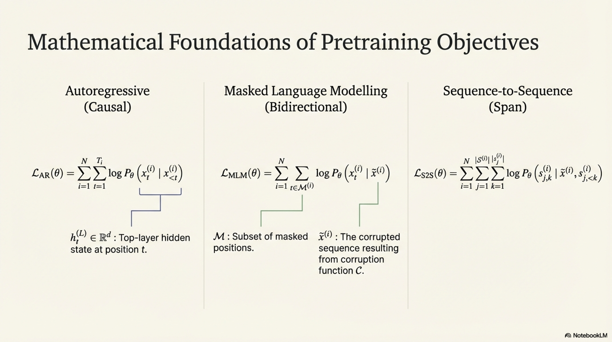

BERT (Bidirectional Encoder Representations from Transformers; Devlin et al., 2019) is a **deep bidirectional Transformer encoder** pretrained on two self-supervised objectives—Masked Language Modeling (MLM) and Next Sentence Prediction (NSP)—that learns rich, bidirectional contextualized representations suitable for transfer to a broad range of downstream NLU tasks via fine-tuning with a minimal task-specific output layer.

The fundamental departure from prior work: **unlike ELMo's shallow concatenation of independently trained left-to-right and right-to-left models, and unlike GPT's unidirectional left-to-right pretraining**, BERT conditions on both left and right context **jointly** at every layer through the MLM objective, enabling deeper cross-directional feature interaction.

### 4.2 Architecture

BERT employs a standard Transformer encoder stack (Vaswani et al., 2017):

#### 4.2.1 Input Representation

For an input sequence (which may be a single sentence or a sentence pair), the input embedding for token at position $t$ is:

$$\mathbf{x}_t = \mathbf{E}_{token}[w_t] + \mathbf{E}_{segment}[s_t] + \mathbf{E}_{position}[t]$$

where:
- $\mathbf{E}_{token} \in \mathbb{R}^{|V| \times d}$ is the WordPiece token embedding
- $\mathbf{E}_{segment} \in \mathbb{R}^{2 \times d}$ encodes segment identity ($s_t \in \{A, B\}$)
- $\mathbf{E}_{position} \in \mathbb{R}^{T_{max} \times d}$ is a learned absolute positional embedding ($T_{max} = 512$)

The full input format:

$$[\text{CLS}] \;\; w_1^A \;\; w_2^A \;\; \cdots \;\; w_{n}^A \;\; [\text{SEP}] \;\; w_1^B \;\; w_2^B \;\; \cdots \;\; w_{m}^B \;\; [\text{SEP}]$$

#### 4.2.2 Transformer Encoder Layer

Each of $L$ identical layers applies multi-head self-attention (MHSA) followed by a position-wise feed-forward network (FFN), with residual connections and layer normalization:

**Multi-Head Self-Attention:**

$$\text{MHSA}(H^{(l-1)}) = \text{Concat}\!\left(\text{head}_1, \ldots, \text{head}_A\right) W^O$$

$$\text{head}_a = \text{Attention}\!\left(H^{(l-1)} W_a^Q, \; H^{(l-1)} W_a^K, \; H^{(l-1)} W_a^V\right)$$

$$\text{Attention}(Q, K, V) = \text{softmax}\!\left(\frac{QK^\top}{\sqrt{d_k}}\right) V$$

where $W_a^Q, W_a^K \in \mathbb{R}^{d \times d_k}$, $W_a^V \in \mathbb{R}^{d \times d_v}$, $W^O \in \mathbb{R}^{Ad_v \times d}$, $d_k = d_v = d/A$.

**Layer computation:**

$$\tilde{H}^{(l)} = \text{LayerNorm}\!\left(H^{(l-1)} + \text{MHSA}(H^{(l-1)})\right)$$

$$H^{(l)} = \text{LayerNorm}\!\left(\tilde{H}^{(l)} + \text{FFN}(\tilde{H}^{(l)})\right)$$

**Position-wise Feed-Forward Network:**

$$\text{FFN}(x) = \text{GELU}(xW_1 + b_1)W_2 + b_2$$

where $W_1 \in \mathbb{R}^{d \times d_{ff}}$, $W_2 \in \mathbb{R}^{d_{ff} \times d}$, and $d_{ff} = 4d$.

**GELU activation:**

$$\text{GELU}(x) = x \cdot \Phi(x) = x \cdot \frac{1}{2}\left[1 + \text{erf}\!\left(\frac{x}{\sqrt{2}}\right)\right]$$

### 4.3 Pretraining Objectives

#### 4.3.1 Masked Language Modeling (MLM)

**Procedure:**
1. Select 15% of all WordPiece tokens uniformly at random → mask set $\mathcal{M}$
2. For each selected position $t \in \mathcal{M}$:
   - With probability 0.80: replace $w_t$ with $[\text{MASK}]$
   - With probability 0.10: replace $w_t$ with a random token $w' \sim \text{Uniform}(V)$
   - With probability 0.10: keep $w_t$ unchanged
3. Predict the original token at each masked position

**Loss:**

$$\mathcal{L}_{MLM} = -\frac{1}{|\mathcal{M}|}\sum_{t \in \mathcal{M}} \log P_\theta(w_t \mid \tilde{w}) = -\frac{1}{|\mathcal{M}|}\sum_{t \in \mathcal{M}} \log \frac{\exp\!\left(\mathbf{e}_{w_t}^\top h_t^{(L)} + b_{w_t}\right)}{\sum_{v \in V}\exp\!\left(\mathbf{e}_v^\top h_t^{(L)} + b_v\right)}$$

**Rationale for the 80/10/10 corruption scheme:**
- If always $[\text{MASK}]$: pretrain-finetune discrepancy (downstream never sees $[\text{MASK}]$)
- The 10% random replacement forces the model to maintain a distributional representation at every position (cannot rely on identity of the input token)
- The 10% unchanged forces the representation to remain faithful to the actual input when the token is not corrupted

#### 4.3.2 Next Sentence Prediction (NSP)

Given two segments $A$ and $B$:
- With probability 0.50: $B$ is the actual next sentence following $A$ (label: `IsNext`)
- With probability 0.50: $B$ is a random sentence from the corpus (label: `NotNext`)

$$\mathcal{L}_{NSP} = -\left[y \log \hat{y} + (1-y)\log(1-\hat{y})\right]$$

where $\hat{y} = \sigma\!\left(W_{NSP} \cdot h_{[\text{CLS}]}^{(L)} + b_{NSP}\right)$, $y \in \{0, 1\}$.

**Combined pretraining loss:**

$$\mathcal{L}_{pretrain} = \mathcal{L}_{MLM} + \mathcal{L}_{NSP}$$

### 4.4 Fine-tuning Protocol

For downstream task $\tau$, a task-specific head is added atop BERT's output representations:

| Task Type | Head Architecture | Loss |
|-----------|-------------------|------|
| **Classification** (e.g., SST-2, MNLI) | $\hat{y} = \text{softmax}(W \cdot h_{[\text{CLS}]}^{(L)} + b)$ | Cross-entropy |
| **Token labeling** (e.g., NER) | $\hat{y}_t = \text{softmax}(W \cdot h_t^{(L)} + b) \;\; \forall t$ | Token-level CE |
| **Span extraction** (e.g., SQuAD) | $P_{start}(t) = \text{softmax}(W_s \cdot h_t^{(L)})$, $P_{end}(t) = \text{softmax}(W_e \cdot h_t^{(L)})$ | CE on start + end |
| **Regression** (e.g., STS-B) | $\hat{y} = W \cdot h_{[\text{CLS}]}^{(L)} + b$ | MSE |

The span score for extractive QA is:

$$\text{score}(i, j) = W_s \cdot h_i^{(L)} + W_e \cdot h_j^{(L)} \quad \text{s.t.} \;\; j \geq i$$

$$(\hat{a}_{start}, \hat{a}_{end}) = \arg\max_{i \leq j} \; \text{score}(i, j)$$

### 4.5 Model Configurations

| Parameter | BERT-Base | BERT-Large |
|-----------|-----------|------------|
| Layers $L$ | 12 | 24 |
| Hidden dim $d$ | 768 | 1024 |
| Attention heads $A$ | 12 | 16 |
| FFN dim $d_{ff}$ | 3072 | 4096 |
| Parameters | 110M | 340M |
| Max sequence length $T_{max}$ | 512 | 512 |
| Vocabulary $|V|$ (WordPiece) | 30,522 | 30,522 |
| Pretraining corpus | BooksCorpus + English Wikipedia (~16GB) | Same |
| Pretraining steps | 1M | 1M |
| Batch size | 256 | 256 |
| Learning rate | $1 \times 10^{-4}$ | $1 \times 10^{-4}$ |
| Optimizer | Adam ($\beta_1 = 0.9$, $\beta_2 = 0.999$) | Same |

### 4.6 Comparison: ELMo vs. BERT — Architectural Paradigm Shift


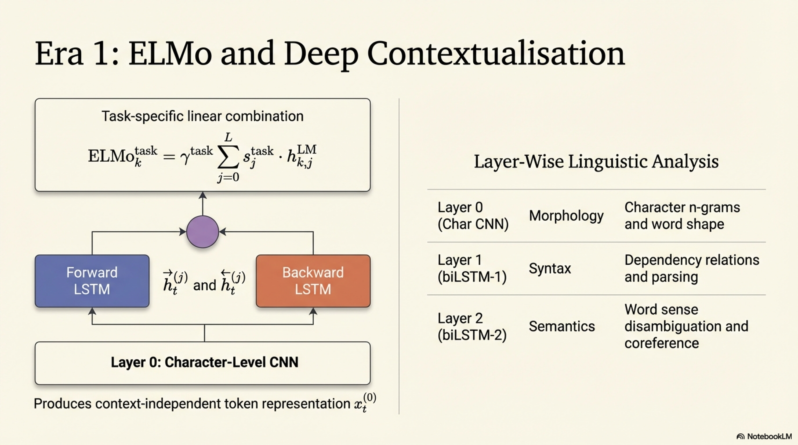

| Dimension | ELMo | BERT |
|-----------|------|------|
| **Backbone** | biLSTM (recurrent) | Transformer encoder (attention) |
| **Bidirectionality** | Shallow: independent L→R and R→L, concatenated | Deep: joint bidirectional at every layer |
| **Context window** | Effective context limited by LSTM memory decay | Full sequence via self-attention ($O(T^2)$) |
| **Transfer mechanism** | Feature extraction: frozen embeddings concatenated to task model | Fine-tuning: all parameters updated end-to-end |
| **Positional encoding** | Implicit via recurrence order | Learned absolute positional embeddings |
| **Tokenization** | Word-level + character CNN | Subword (WordPiece) |
| **Output representation** | Weighted sum of layer outputs | Direct use of $h_{[\text{CLS}]}^{(L)}$ or $h_t^{(L)}$ |

### 4.7 Subsequent Innovations (BERT Lineage)


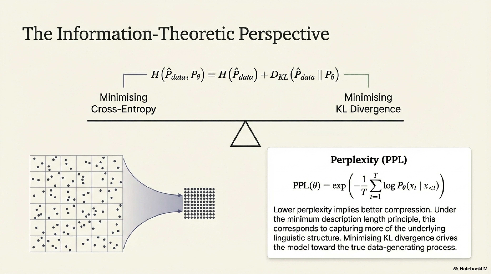

| Model | Key Modification | Impact |
|-------|-----------------|--------|
| **RoBERTa** | Remove NSP, dynamic masking, larger batches, more data, longer training | Substantial gains from training recipe alone |
| **ALBERT** | Cross-layer parameter sharing, factorized embedding ($V \times E$ + $E \times H$) | 18× fewer parameters with competitive performance |
| **SpanBERT** | Mask contiguous spans, span boundary objective (SBO) | Superior on span-selection tasks (QA, coreference) |
| **ELECTRA** | Replace MLM with replaced token detection (RTD) via generator-discriminator | All tokens contribute to loss (15× more efficient) |
| **DeBERTa** | Disentangled attention (content + position separately), enhanced mask decoder | SOTA on SuperGLUE (surpassed human baseline) |

**ELECTRA's RTD objective:**

A small generator $G$ produces plausible replacements for masked tokens. The discriminator $D$ (the main model) classifies each token as original or replaced:

$$\mathcal{L}_{RTD} = -\sum_{t=1}^{T}\left[\mathbb{1}[x_t = x_t^{orig}]\log D_\theta(x_t, t) + \mathbb{1}[x_t \neq x_t^{orig}]\log(1 - D_\theta(x_t, t))\right]$$

This is more sample-efficient because the loss is computed over **all** $T$ tokens, not just the 15% masked subset.

### 4.8 Pseudo-Algorithm: BERT Pretraining and Fine-tuning

```
ALGORITHM: BERT_Pretraining

INPUT:
    D_unlabeled        — Corpus of document-segmented text
    V                  — WordPiece vocabulary of size |V| = 30,522
    L                  — Number of Transformer layers
    d                  — Hidden dimension
    A                  — Number of attention heads
    d_ff               — Feed-forward intermediate dimension
    mask_prob          — MLM masking probability (0.15)
    T_max              — Maximum training steps (1,000,000)
    B                  — Batch size (256 sequences × 512 tokens)
    η_peak             — Peak learning rate (1e-4)
    warmup_steps       — Linear warmup period (10,000)

OUTPUT:
    θ*                 — Pretrained BERT parameters

PROCEDURE:
    // === Data Preparation ===
    1. CONSTRUCT training instances:
       FOR each document d ∈ D_unlabeled:
           2. SEGMENT d into sentences {s_1, s_2, ...}
           3. SAMPLE sentence pairs (A, B) such that:
              — 50%: B = next_sentence(A) → label IsNext
              — 50%: B = random_sentence(D) → label NotNext
           4. TOKENIZE [CLS] A [SEP] B [SEP] via WordPiece
           5. TRUNCATE or PAD to max_seq_length = 512
           6. RECORD segment IDs: 0 for A tokens, 1 for B tokens
    
    // === MLM Corruption ===
    7. FOR each training instance:
        8. SELECT 15% of non-special token positions → M
        9. FOR each position t ∈ M:
            10. WITH probability 0.80: replace token with [MASK]
            11. WITH probability 0.10: replace with random v ~ Uniform(V)
            12. WITH probability 0.10: keep original token
        13. STORE original tokens at M positions as MLM targets
    
    // === Model Initialization ===
    14. INITIALIZE all parameters θ:
        — E_token ∈ R^{|V| × d}: Xavier uniform
        — E_segment ∈ R^{2 × d}: zeros
        — E_position ∈ R^{512 × d}: Xavier uniform
        — Per-layer: W_Q, W_K, W_V ∈ R^{d × d}, W_O ∈ R^{d × d}: Xavier
        — Per-layer: W_1 ∈ R^{d × d_ff}, W_2 ∈ R^{d_ff × d}: Xavier
        — LayerNorm: γ = 1, β = 0
        — MLM head: dense d→d, GELU, LayerNorm, projection to |V|
        — NSP head: dense d→2
    
    // === Training Loop ===
    15. INITIALIZE Adam optimizer with β₁=0.9, β₂=0.999, ε=1e-6, weight_decay=0.01
    
    16. FOR step = 1 TO T_max:
        17. SAMPLE mini-batch of B instances
        
        // --- Forward Pass ---
        18. COMPUTE input embeddings:
            x_t = E_token[w_t] + E_segment[s_t] + E_position[t]   ∀ t
        19. SET H^(0) = [x_1, x_2, ..., x_T] ∈ R^{T × d}
        
        20. FOR l = 1 TO L:
            21. Q = H^(l-1) W_Q^(l),  K = H^(l-1) W_K^(l),  V = H^(l-1) W_V^(l)
            22. SPLIT Q, K, V into A heads: Q_a, K_a, V_a ∈ R^{T × d_k}
            23. Attn_a = softmax(Q_a K_a^T / √d_k) V_a    ∀ a ∈ {1,...,A}
                APPLY attention mask: set padding positions to -∞ before softmax
            24. MultiHead = Concat(Attn_1, ..., Attn_A) W_O^(l)
            25. H̃^(l) = LayerNorm(H^(l-1) + MultiHead)
            26. FFN_out = GELU(H̃^(l) W_1^(l) + b_1^(l)) W_2^(l) + b_2^(l)
            27. H^(l) = LayerNorm(H̃^(l) + FFN_out)
        
        // --- MLM Loss ---
        28. FOR each masked position t ∈ M:
            29. mlm_logits_t = W_vocab · GELU(W_dense · h_t^(L) + b_dense) + b_vocab
            30. L_MLM += -log softmax(mlm_logits_t)[original_token_t]
        31. L_MLM = L_MLM / |M|
        
        // --- NSP Loss ---
        32. nsp_logits = W_NSP · h_[CLS]^(L) + b_NSP
        33. L_NSP = CrossEntropy(nsp_logits, nsp_label)
        
        // --- Combined Loss & Update ---
        34. L_total = L_MLM + L_NSP
        35. g = ∇_θ L_total
        36. CLIP ‖g‖₂ ≤ 1.0
        37. η_t = LinearWarmupDecay(step, warmup_steps, η_peak)
        38. θ ← AdamW(θ, g, η_t, weight_decay=0.01)
        
        39. CHECKPOINT every 100K steps
    
    40. RETURN θ*

---

ALGORITHM: BERT_FineTuning

INPUT:
    θ*                 — Pretrained BERT parameters
    D_task             — Labeled task dataset {(x_i, y_i)}_{i=1}^{N}
    task_type          — ∈ {SEQUENCE_CLASSIFICATION, TOKEN_CLASSIFICATION, 
                            SPAN_EXTRACTION, REGRESSION}
    n_classes          — Number of output classes (or 1 for regression)
    epochs             — Number of fine-tuning epochs (2–4)
    η_ft              — Fine-tuning learning rate (2e-5 to 5e-5)
    B_ft              — Fine-tuning batch size (16 or 32)

OUTPUT:
    θ**                — Fine-tuned model parameters
    predictions        — Model predictions on evaluation split

PROCEDURE:
    1. LOAD pretrained θ*
    
    2. ATTACH task-specific head:
        IF task_type = SEQUENCE_CLASSIFICATION:
            W_task ∈ R^{n_classes × d}, b_task ∈ R^{n_classes}  (randomly initialized)
        ELSE IF task_type = TOKEN_CLASSIFICATION:
            W_task ∈ R^{n_classes × d}, b_task ∈ R^{n_classes}  (applied per token)
        ELSE IF task_type = SPAN_EXTRACTION:
            W_start ∈ R^{1 × d}, W_end ∈ R^{1 × d}
        ELSE IF task_type = REGRESSION:
            W_task ∈ R^{1 × d}, b_task ∈ R^{1}
    
    3. FOR epoch = 1 TO epochs:
        4. SHUFFLE D_task
        5. FOR each mini-batch {(x_b, y_b)} of size B_ft:
            6. FORWARD pass through BERT encoder → H^(L) = {h_1^(L), ..., h_T^(L)}
            
            7. IF task_type = SEQUENCE_CLASSIFICATION:
                ŷ = softmax(W_task · h_[CLS]^(L) + b_task)
                L = -Σ_c y_c log ŷ_c
                
            8. ELSE IF task_type = SPAN_EXTRACTION:
                P_start(t) = softmax_t(W_start · h_t^(L))   ∀ t ∈ passage
                P_end(t) = softmax_t(W_end · h_t^(L))       ∀ t ∈ passage
                L = -log P_start(a_start) - log P_end(a_end)
                
            9. ELSE IF task_type = REGRESSION:
                ŷ = W_task · h_[CLS]^(L) + b_task
                L = (ŷ - y)²
            
            10. g = ∇_{θ*, θ_task} L       // gradients through ALL parameters
            11. θ ← AdamW(θ, g, η_ft)      // update pretrained + task parameters jointly
    
    12. SELECT best checkpoint by dev set performance
    13. PREDICT on test set
    14. RETURN θ**, predictions
```

---

## 5. Emergence of LLMs

### 5.1 Definition

Large Language Models (LLMs) are autoregressive Transformer language models scaled to parameter counts $|\theta| \geq 10^{10}$ (and beyond $10^{12}$), trained on multi-trillion token corpora, that exhibit **emergent capabilities**—qualitatively new behaviors that are absent in smaller models of the same family, appearing discontinuously as a function of model scale, compute, or data volume.

The emergence paradigm marks a phase transition in AI: from task-specific pretrain-finetune pipelines to **general-purpose foundation models** capable of few-shot and zero-shot task execution via natural language instructions alone, without any parameter updates.

### 5.2 Scaling Laws

Kaplan et al. (2020) and Hoffmann et al. (2022) established **neural scaling laws** that predict model performance as a power-law function of scale variables.

#### 5.2.1 Kaplan Scaling Laws

Cross-entropy loss $L$ follows power-law decay in three independent variables:

$$L(N) = \left(\frac{N_c}{N}\right)^{\alpha_N}, \quad L(D) = \left(\frac{D_c}{D}\right)^{\alpha_D}, \quad L(C) = \left(\frac{C_c}{C}\right)^{\alpha_C}$$

where:
- $N$ = number of non-embedding parameters
- $D$ = dataset size (tokens)
- $C$ = compute budget (FLOPs)
- $\alpha_N \approx 0.076$, $\alpha_D \approx 0.095$, $\alpha_C \approx 0.050$
- $N_c, D_c, C_c$ are empirically fitted constants

**Joint scaling law (when neither $N$ nor $D$ bottleneck):**

$$L(N, D) = \left[\left(\frac{N_c}{N}\right)^{\alpha_N / \alpha_D} + \frac{D_c}{D}\right]^{\alpha_D}$$

#### 5.2.2 Chinchilla Scaling Laws (Compute-Optimal Training)

Hoffmann et al. (2022) revised the compute-optimal allocation. For a fixed compute budget $C$ (in FLOPs):

$$C \approx 6ND$$

The optimal allocation satisfies:

$$N_{opt}(C) \propto C^{a}, \quad D_{opt}(C) \propto C^{b}$$

with $a \approx 0.50$, $b \approx 0.50$, implying **parameters and data should scale equally**—a dramatic revision from Kaplan et al.'s recommendation of scaling parameters faster.

**Practical implication:** A 70B parameter model should be trained on ~1.4T tokens (Chinchilla), whereas Kaplan's prescription would have allocated more parameters with fewer tokens (GPT-3 at 175B was trained on only 300B tokens—substantially under-trained by Chinchilla standards).

### 5.3 Architectural Evolution

| Model | Year | $|\theta|$ | Architecture | Key Innovation |
|-------|------|-----------|--------------|----------------|
| **GPT** | 2018 | 117M | Decoder-only, 12L | Unidirectional pretraining + task-specific fine-tuning |
| **GPT-2** | 2019 | 1.5B | Decoder-only, 48L | Zero-shot task transfer via prompting; demonstrated unsupervised multitask |
| **GPT-3** | 2020 | 175B | Decoder-only, 96L | In-context learning; few-shot via priming without gradient updates |
| **PaLM** | 2022 | 540B | Decoder-only, 118L | Pathways system; breakthrough on reasoning benchmarks |
| **Chinchilla** | 2022 | 70B | Decoder-only | Compute-optimal training; matched 280B Gopher with 4× fewer params |
| **LLaMA** | 2023 | 7B–65B | Decoder-only | Open-weight; RMSNorm, SwiGLU, RoPE; efficient training |
| **GPT-4** | 2023 | ~1.8T (est., MoE) | Decoder-only MoE | Multimodal; expert-level performance across professional exams |
| **LLaMA-3** | 2024 | 8B–405B | Decoder-only | 15T+ tokens; grouped query attention; superior data curation |

### 5.4 Key Architectural Components in Modern LLMs

#### 5.4.1 RoPE (Rotary Position Embedding)

Instead of additive positional embeddings, RoPE encodes position via rotation in 2D subspaces of the embedding:

$$f_q(x_m, m) = R_{\Theta, m} W_q x_m, \quad f_k(x_n, n) = R_{\Theta, n} W_k x_n$$

where $R_{\Theta, m} \in \mathbb{R}^{d \times d}$ is a block-diagonal rotation matrix:

$$R_{\Theta, m} = \begin{pmatrix} \cos m\theta_1 & -\sin m\theta_1 & & \\ \sin m\theta_1 & \cos m\theta_1 & & \\ & & \cos m\theta_2 & -\sin m\theta_2 \\ & & \sin m\theta_2 & \cos m\theta_2 \\ & & & & \ddots \end{pmatrix}$$

with $\theta_i = 10000^{-2i/d}$.

The critical property: the attention dot product depends only on **relative** position:

$$f_q(x_m, m)^\top f_k(x_n, n) = x_m^\top W_q^\top R_{\Theta, n-m} W_k x_n$$

#### 5.4.2 SwiGLU Activation

Replaces the standard ReLU/GELU FFN:

$$\text{FFN}_{SwiGLU}(x) = \left(\text{Swish}_\beta(xW_1) \odot xW_3\right) W_2$$

where $\text{Swish}_\beta(x) = x \cdot \sigma(\beta x)$, and $W_1, W_3 \in \mathbb{R}^{d \times d_{ff}}$, $W_2 \in \mathbb{R}^{d_{ff} \times d}$.

Typically $d_{ff} = \frac{2}{3} \cdot 4d$ to maintain parameter count parity with standard FFN.

#### 5.4.3 RMSNorm (replacing LayerNorm)

$$\text{RMSNorm}(x) = \frac{x}{\text{RMS}(x)} \odot \gamma, \quad \text{RMS}(x) = \sqrt{\frac{1}{d}\sum_{i=1}^{d} x_i^2}$$

Eliminates the mean-centering step, reducing computation and improving training stability at scale.

#### 5.4.4 Grouped Query Attention (GQA)

Partitions $A$ query heads into $G$ groups ($G < A$), with each group sharing one key-value head:

- **Multi-Head Attention (MHA):** $G = A$ (each head has its own KV)
- **Multi-Query Attention (MQA):** $G = 1$ (all heads share one KV)
- **Grouped Query Attention (GQA):** $1 < G < A$ (intermediate; e.g., 8 KV heads for 32 query heads)

**KV cache memory** at inference: $\text{Memory}_{KV} = 2 \cdot L \cdot G \cdot T \cdot d_k \cdot \text{sizeof(dtype)}$

GQA reduces KV cache by factor $A/G$ with minimal quality degradation.

### 5.5 Emergent Capabilities

**Definition (Wei et al., 2022):** An ability is **emergent** if it is not present in smaller models but appears in larger models—it is not predicted by extrapolating the performance of smaller models.

Key emergent capabilities:

| Capability | Threshold Scale | Description |
|------------|----------------|-------------|
| **In-context learning** | ~1B+ | Performing new tasks from few demonstrations in the prompt, without gradient updates |
| **Chain-of-thought reasoning** | ~100B+ | Generating intermediate reasoning steps that substantially improve accuracy on multi-step problems |
| **Instruction following** | ~10B+ (with alignment) | Generalizing to novel instruction formats not seen during fine-tuning |
| **Code generation** | ~10B+ | Synthesizing functionally correct programs from natural language specifications |
| **Self-correction** | ~100B+ | Identifying and revising errors in own outputs when prompted |
| **Theory of mind patterns** | ~100B+ | Tracking beliefs of agents in scenarios (though debated) |

**Formal characterization of in-context learning:**

Given a prompt $\mathcal{P} = [(x_1, y_1), (x_2, y_2), \ldots, (x_k, y_k), x_{k+1}]$ containing $k$ demonstrations and a query $x_{k+1}$, the model implicitly computes:

$$\hat{y}_{k+1} = \arg\max_y P_\theta(y \mid \mathcal{P})$$

without any parameter update. This can be viewed as **implicit Bayesian inference** or **implicit gradient descent** performed within the forward pass (Akyürek et al., 2023; von Oswald et al., 2023).

### 5.6 Training Pipeline of Modern LLMs

The full training pipeline proceeds in multiple stages:

**Stage 1 — Pretraining:** Autoregressive LM on massive web-scale corpora.

$$\theta^{(1)} = \arg\min_\theta \; \mathcal{L}_{AR}(\theta; \mathcal{D}_{pretrain})$$

**Stage 2 — Supervised Fine-Tuning (SFT):** On curated instruction-response pairs.

$$\theta^{(2)} = \arg\min_\theta \; \mathbb{E}_{(x,y) \sim \mathcal{D}_{SFT}}\left[-\sum_{t=1}^{|y|} \log P_\theta(y_t \mid x, y_{<t})\right]$$

**Stage 3 — Reward Modeling:** Train a reward model $R_\phi$ on human preference data.

Given prompt $x$ and two completions $y_w \succ y_l$ (winner preferred over loser):

$$\mathcal{L}_{RM}(\phi) = -\mathbb{E}_{(x, y_w, y_l)}\left[\log \sigma\!\left(R_\phi(x, y_w) - R_\phi(x, y_l)\right)\right]$$

This derives from the **Bradley-Terry preference model**:

$$P(y_w \succ y_l) = \frac{\exp R_\phi(x, y_w)}{\exp R_\phi(x, y_w) + \exp R_\phi(x, y_l)} = \sigma\!\left(R_\phi(x, y_w) - R_\phi(x, y_l)\right)$$

**Stage 4 — RLHF (Reinforcement Learning from Human Feedback):**

Optimize the policy $\pi_\theta$ to maximize reward while staying close to the SFT policy $\pi_{ref}$:

$$\max_\theta \; \mathbb{E}_{x \sim \mathcal{D}, \; y \sim \pi_\theta(\cdot|x)}\left[R_\phi(x, y)\right] - \beta \cdot D_{KL}\!\left(\pi_\theta(\cdot | x) \| \pi_{ref}(\cdot | x)\right)$$

This is typically optimized via **PPO (Proximal Policy Optimization)** or equivalently via **DPO (Direct Preference Optimization)**, which bypasses explicit reward modeling:

$$\mathcal{L}_{DPO}(\theta) = -\mathbb{E}_{(x, y_w, y_l)}\left[\log \sigma\!\left(\beta \log \frac{\pi_\theta(y_w | x)}{\pi_{ref}(y_w | x)} - \beta \log \frac{\pi_\theta(y_l | x)}{\pi_{ref}(y_l | x)}\right)\right]$$

### 5.7 Pseudo-Algorithm: LLM Training Pipeline (End-to-End)

```
ALGORITHM: LLM_Training_Pipeline

INPUT:
    D_pretrain         — Web-scale corpus (~1–15T tokens), deduplicated, quality-filtered
    D_SFT              — Curated instruction-response pairs (~100K–1M examples)
    D_pref             — Human preference dataset {(x, y_w, y_l)} (~100K–500K comparisons)
    arch_config        — {L, d, A, d_ff, d_kv_groups, vocab_size, max_seq_len}
    compute_budget     — Total available FLOPs C
    N_target           — Target parameter count (determined by Chinchilla-optimal allocation)
    D_tokens           — Target training tokens ≈ C / (6 · N_target)

OUTPUT:
    π_aligned          — Aligned, instruction-following LLM

PROCEDURE:
    // ========== STAGE 0: Data Curation ==========
    1. CRAWL and DEDUPLICATE web text (MinHash / exact substring dedup)
    2. APPLY quality classifiers: train binary classifier on 
       {high_quality_sources vs random_web} → filter to top ~30%
    3. APPLY toxicity / PII filters
    4. DETERMINE domain mixture ratios:
       {web: 0.67, books: 0.07, code: 0.10, papers: 0.05, 
        wikipedia: 0.03, math: 0.03, conversations: 0.05}
    5. CONSTRUCT BPE/SentencePiece tokenizer on representative sample of D_pretrain
       with vocab_size = 32K–128K, byte-fallback for OOV robustness
    6. TOKENIZE all data, SHUFFLE at document level with domain mixing

    // ========== STAGE 1: Pretraining ==========
    7. INITIALIZE model parameters θ:
       — Embeddings: N(0, 1/√d)
       — Attention: N(0, 1/√d), output projection scaled by 1/√(2L)
       — FFN: N(0, 1/√d)
       — No bias terms (except where needed)
       — RMSNorm: γ = 1
    
    8. CONFIGURE distributed training:
       — Tensor Parallelism (TP): split attention/FFN across devices within a node
       — Pipeline Parallelism (PP): partition layers across node groups
       — Data Parallelism (DP) with ZeRO-3: shard optimizer states + gradients + params
       — FSDP (Fully Sharded Data Parallelism) as alternative to ZeRO
       — Sequence Parallelism: distribute LayerNorm/Dropout across TP group
       — Flash Attention 2: IO-aware exact attention, O(T²d/M) HBM accesses
       — Mixed precision: BF16 compute, FP32 master weights
       — Gradient checkpointing: recompute activations during backward pass
    
    9. CONFIGURE optimizer:
       — AdamW: β₁ = 0.9, β₂ = 0.95, ε = 1e-8, weight_decay = 0.1
       — Learning rate: cosine decay with linear warmup
         η(t) = η_max · (warmup(t)/warmup_steps) for t ≤ warmup_steps
         η(t) = η_min + 0.5(η_max - η_min)(1 + cos(π · (t - warmup_steps)/(T_max - warmup_steps)))
       — η_max typically 3e-4 for ~7B models, ~1.5e-4 for ~70B models
       — η_min = 0.1 · η_max
       — warmup_steps ~ 2000
       — Gradient clipping: ‖g‖₂ ≤ 1.0
    
    10. FOR step = 1 TO T_max:
        11. SAMPLE batch of sequences, each of length max_seq_len (e.g., 4096–8192)
            — Pack multiple documents into single sequences with document separators
            — Apply causal attention mask (lower-triangular)
            — Optionally: apply document-boundary attention masking
        
        12. FORWARD PASS:
            FOR l = 1 TO L:
                H̃^(l) = H^(l-1) + MHSA(RMSNorm(H^(l-1)))     // Pre-norm architecture
                H^(l) = H̃^(l) + FFN_SwiGLU(RMSNorm(H̃^(l)))
            logits = RMSNorm(H^(L)) · E_token^T               // Weight tying
        
        13. COMPUTE loss: L = -(1/T) Σ_t log softmax(logits_t)[x_{t+1}]
        14. BACKWARD PASS with gradient accumulation over micro-batches
        15. ALL-REDUCE gradients across DP ranks
        16. CLIP, UPDATE via AdamW
        
        17. LOG: loss, gradient_norm, learning_rate, tokens_processed, throughput (tokens/sec/GPU)
        18. EVALUATE on held-out validation set every ~1000 steps
        19. CHECKPOINT every ~1000 steps (async to networked storage)
    
    20. θ_pretrained ← θ

    // ========== STAGE 2: Supervised Fine-Tuning (SFT) ==========
    21. FORMAT D_SFT into chat template:
        <|system|> ... <|user|> instruction <|assistant|> response
    22. COMPUTE loss ONLY on assistant response tokens (mask instruction tokens):
        L_SFT = -(1/|y|) Σ_{t ∈ response_positions} log P_θ(y_t | x, y_{<t})
    23. TRAIN for 2–5 epochs with η = 2e-5, cosine decay, batch_size ~ 128
    24. θ_SFT ← θ

    // ========== STAGE 3: Preference Optimization ==========
    
    // Option A: RLHF via PPO
    25. TRAIN reward model R_φ on D_pref:
        L_RM = -E[ log σ(R_φ(x, y_w) - R_φ(x, y_l)) ]
        Trained until validation accuracy ~72-75%
    26. INITIALIZE policy π_θ ← θ_SFT
    27. SET reference policy π_ref ← θ_SFT (frozen)
    28. FOR ppo_step = 1 TO T_RL:
        29. SAMPLE prompts x from D_prompts
        30. GENERATE responses y ~ π_θ(·|x) with temperature sampling
        31. COMPUTE rewards: r = R_φ(x, y) - β · log(π_θ(y|x) / π_ref(y|x))
        32. COMPUTE advantages via GAE (Generalized Advantage Estimation)
        33. UPDATE π_θ via clipped PPO objective:
            L_PPO = -E[min(ρ_t · A_t, clip(ρ_t, 1-ε, 1+ε) · A_t)]
            where ρ_t = π_θ(a_t|s_t) / π_θ_old(a_t|s_t)
    
    // Option B: DPO (Direct Preference Optimization — simpler)
    34. SET π_ref ← θ_SFT (frozen)
    35. OPTIMIZE directly on preference pairs:
        L_DPO = -E[ log σ( β · (log π_θ(y_w|x)/π_ref(y_w|x) 
                             - log π_θ(y_l|x)/π_ref(y_l|x)) ) ]
    36. TRAIN for 1–3 epochs with η = 5e-7 to 1e-6

    37. π_aligned ← θ
    38. RETURN π_aligned
```

### 5.8 Compute Requirements (Order of Magnitude)

For a model with $N$ parameters trained on $D$ tokens:

**Forward pass FLOPs per token:** $\approx 2N$ (matrix multiplications dominate)

**Backward pass FLOPs per token:** $\approx 4N$ (approximately 2× forward)

**Total training FLOPs:**

$$C \approx 6ND$$

| Model | $N$ | $D$ | $C$ (FLOPs) | GPU-hours (A100) |
|-------|-----|-----|-------------|------------------|
| LLaMA-7B | 7B | 1T | $4.2 \times 10^{22}$ | ~82K |
| LLaMA-65B | 65B | 1.4T | $5.5 \times 10^{23}$ | ~1M |
| GPT-3 | 175B | 300B | $3.1 \times 10^{23}$ | ~600K |
| PaLM | 540B | 780B | $2.5 \times 10^{24}$ | ~5M |

---

## 6. Limitations of Pretraining

### 6.1 Definition

Limitations of pretraining encompass the systematic failure modes, theoretical constraints, and practical shortcomings inherent to the self-supervised pretraining paradigm—regardless of scale—that prevent pretrained language models from achieving robust, reliable, and aligned general intelligence. These limitations arise from the training objective itself, the nature of the training data, the model architecture, and the gap between the pretraining distribution and real-world deployment.

### 6.2 Taxonomy of Limitations

#### 6.2.1 Objective Function Mismatch

The pretraining objective (next-token prediction or MLM) is a **proxy** for the actual desired behavior. Minimizing $\mathcal{L}_{AR}$ or $\mathcal{L}_{MLM}$ does not directly optimize for:

- Factual accuracy
- Logical consistency
- Helpfulness
- Safety
- Calibrated uncertainty

**Formal statement:** Let $\mathcal{L}_{desired}$ be the true objective (e.g., aligned, helpful, harmless responses). The pretraining objective $\mathcal{L}_{pretrain}$ satisfies:

$$\arg\min_\theta \mathcal{L}_{pretrain}(\theta) \neq \arg\min_\theta \mathcal{L}_{desired}(\theta)$$

in general. Pretraining produces a model that is a good **compressor of text**, not necessarily a good **reasoner, factual oracle, or aligned agent**.

#### 6.2.2 Hallucination

**Definition:** Generation of fluent, confident text that is factually incorrect, fabricated, or unsupported by the model's training data or any provided context.

**Types:**
- **Intrinsic hallucination:** Output contradicts the provided source/context
- **Extrinsic hallucination:** Output contains claims not verifiable from any source

**Root cause analysis:**

1. **Maximum likelihood training rewards fluency over factuality.** The model learns $P(x_t | x_{<t})$, and a fluent-but-false continuation may have higher likelihood than a disfluent-but-true one under the training distribution.

2. **Exposure bias:** During training, the model conditions on ground-truth prefixes; during inference, it conditions on its own (potentially erroneous) generations, causing error compounding:

$$\text{At training:} \quad P_\theta(x_t | x_{1:t-1}^{*}) \quad \text{(teacher forcing)}$$
$$\text{At inference:} \quad P_\theta(x_t | \hat{x}_{1:t-1}) \quad \text{(autoregressive)}$$

The distributional shift between $x_{1:t-1}^{*}$ and $\hat{x}_{1:t-1}$ accumulates across positions.

3. **Knowledge stored parametrically** (in weights) rather than grounded in verifiable retrieval, making it impossible to trace provenance or guarantee accuracy.

#### 6.2.3 Catastrophic Forgetting

During fine-tuning, updating all parameters toward $\mathcal{L}_{task}$ can overwrite pretrained knowledge:

$$\Delta\theta_{task} = -\eta \nabla_\theta \mathcal{L}_{task}(\theta)$$

If $\Delta\theta_{task}$ is large in directions important for pretrained capabilities, those capabilities degrade. Formally, let $F_i$ be the Fisher information for parameter $\theta_i$ under the pretraining distribution:

$$F_i = \mathbb{E}_{x \sim P_{data}}\!\left[\left(\frac{\partial \log P_\theta(x)}{\partial \theta_i}\right)^2\right]$$

Parameters with high $F_i$ are critical for pretraining performance; updating them aggressively causes forgetting. Methods like EWC (Elastic Weight Consolidation) add the regularizer:

$$\mathcal{L}_{EWC} = \mathcal{L}_{task}(\theta) + \frac{\lambda}{2} \sum_i F_i (\theta_i - \theta_i^*)^2$$

#### 6.2.4 Static Knowledge / Temporal Cutoff

Pretrained models embed a **frozen snapshot** of world knowledge as of the training data cutoff date $t_{cutoff}$. For any event, fact, or entity emerging after $t_{cutoff}$:

$$P_\theta(\text{correct answer} \mid \text{query about post-}t_{cutoff}\text{ fact}) \approx 0 \quad \text{or random}$$

There is no mechanism for the model to update its parametric knowledge without retraining or augmentation (e.g., retrieval-augmented generation).

#### 6.2.5 Training Data Bias and Toxicity

The model learns the statistical distribution of the training corpus, including its biases:

$$P_\theta(x) \approx P_{corpus}(x) \neq P_{ideal}(x)$$

Biases manifest as:
- **Representational bias:** Stereotypical associations ($P(\text{nurse} | \text{she}) > P(\text{nurse} | \text{he})$) reflecting corpus statistics
- **Allocational bias:** Systematically different quality of outputs for different demographic groups
- **Toxicity:** Generation of harmful, offensive, or abusive content because such text exists in the training data

**Quantification via bias score:**

$$\text{Bias}(a_1, a_2, T) = \frac{1}{|T|}\sum_{t \in T} \left[\cos(v_t, v_{a_1}) - \cos(v_t, v_{a_2})\right]$$

where $v_t$ is the representation of target word $t$, and $v_{a_1}, v_{a_2}$ are representations of attribute groups (cf. WEAT test).

#### 6.2.6 Context Window Limitation

Transformer self-attention has complexity $O(T^2 d)$ in time and $O(T^2)$ in memory, fundamentally limiting the context window. Even with efficient attention variants:

| Method | Complexity | Trade-off |
|--------|-----------|-----------|
| Standard attention | $O(T^2 d)$ | Exact; memory-bound |
| Flash Attention | $O(T^2 d)$ (compute) / $O(T)$ (HBM) | Exact; IO-optimized |
| Linear attention | $O(T d^2)$ | Approximate; quality degradation |
| Sparse attention (BigBird, Longformer) | $O(T \cdot w \cdot d)$ | Local + global; misses some long-range dependencies |
| Ring Attention | $O(T^2 d / P)$ per device | Exact; distributed across $P$ devices |

Even with extended contexts (128K–1M tokens), models exhibit **lost-in-the-middle** phenomena: retrieval accuracy degrades for information positioned in the middle of the context, indicating that attention does not uniformly cover all positions.

#### 6.2.7 Lack of Grounding and World Models

Pretrained LLMs operate solely on text tokens—they lack:

- **Perceptual grounding:** No direct connection to visual, auditory, or tactile sensory input (addressed partially by multimodal models)
- **Causal world models:** Cannot perform physical simulation or causal reasoning from first principles
- **Embodied interaction:** No ability to take actions in an environment and observe consequences

The model has learned **correlational patterns** in text, not **causal mechanisms** of the world. This leads to brittleness on:
- Counterfactual reasoning
- Novel situations outside the training distribution
- Tasks requiring genuine spatial or temporal reasoning

#### 6.2.8 Pretrain–Fine-tune Discrepancy (MLM-Specific)

For BERT-style models, the $[\text{MASK}]$ token appears during pretraining but never during fine-tuning or inference, creating a distributional mismatch:

$$P_{pretrain}(x) \neq P_{finetune}(x)$$

The 80/10/10 corruption scheme partially mitigates this, but does not eliminate it. ELECTRA's replaced-token-detection objective entirely avoids this issue.

#### 6.2.9 Lack of Calibration

Pretrained models are typically **overconfident**: the predicted probability $P_\theta(y | x)$ does not reflect the true frequency of correctness.

**Expected Calibration Error (ECE):**

$$\text{ECE} = \sum_{b=1}^{B} \frac{|S_b|}{N} \left|\text{acc}(S_b) - \text{conf}(S_b)\right|$$

where $S_b$ is the set of predictions in confidence bin $b$, $\text{acc}(S_b)$ is the actual accuracy, and $\text{conf}(S_b)$ is the mean predicted confidence.

Large pretrained models exhibit ECE values of 10–30%, meaning their confidence scores are unreliable for decision-making without post-hoc calibration (temperature scaling, Platt scaling).

#### 6.2.10 Reasoning Limitations

Despite emergent chain-of-thought capabilities, pretrained LLMs fail systematically on:

- **Multi-step logical deduction** beyond ~5–7 steps
- **Mathematical proof construction** requiring novel lemma invention
- **Compositional generalization:** Applying known rules to novel combinations (e.g., SCAN benchmark)
- **Adversarial perturbations:** Small input changes that preserve semantics but flip the output

These suggest that pretraining learns **pattern matching** over reasoning traces rather than **internalizing reasoning algorithms**.

### 6.3 Summary Table: Limitations and Mitigation Strategies


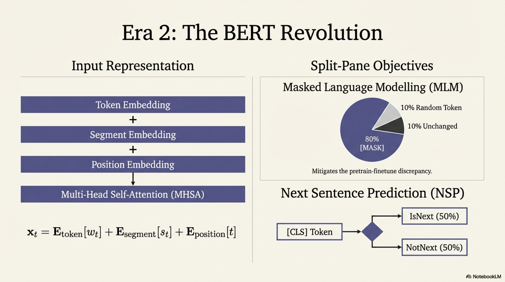

| Limitation | Root Cause | Mitigation Approach |
|------------|-----------|---------------------|
| Hallucination | MLE rewards fluency; parametric knowledge is lossy | Retrieval augmentation (RAG), attribution training, factuality rewards |
| Catastrophic forgetting | Fine-tuning overwrites pretrained weights | EWC, LoRA/adapters, replay buffers, parameter-efficient fine-tuning |
| Static knowledge | Training data has temporal cutoff | RAG, tool use, continual pretraining, internet-augmented generation |
| Bias / toxicity | Training data reflects societal biases | Data filtering, RLHF, constitutional AI, bias-specific fine-tuning |
| Context limitation | $O(T^2)$ attention complexity | Efficient attention, RoPE extrapolation (YaRN, NTK-aware scaling), retrieval |
| Lack of grounding | Text-only training signal | Multimodal pretraining (vision-language, audio-language) |
| Poor calibration | Softmax overconfidence, no uncertainty modeling | Temperature scaling, ensemble methods, conformal prediction |
| Reasoning brittleness | Correlation-based learning, not causal | Chain-of-thought, tool use (code interpreters), neuro-symbolic integration |
| Objective mismatch | Next-token ≠ helpfulness | RLHF, DPO, constitutional AI, process reward models |
| Pretrain-finetune gap | [MASK] token distribution shift | ELECTRA-style objectives, prompt-based fine-tuning |

### 6.4 Pseudo-Algorithm: Comprehensive Limitation Diagnostic Pipeline

```
ALGORITHM: PretrainingLimitationDiagnostics

INPUT:
    M_θ                — Pretrained (or fine-tuned) model
    D_eval             — Evaluation dataset covering diverse capabilities
    D_factual          — Factual knowledge probe dataset with ground-truth answers
    D_bias             — Bias evaluation dataset (e.g., BBQ, WinoBias, CrowS-Pairs)
    D_calibration      — Calibrated prediction evaluation set with confidence scores
    D_adversarial      — Adversarially perturbed inputs
    D_temporal         — Temporally stratified facts: {pre-cutoff, post-cutoff}
    D_reasoning        — Multi-step reasoning chains of varying depth {2, 4, 6, 8, 10+}
    context_lengths    — Set of test context lengths {512, 1K, 2K, 4K, 8K, 16K, 32K, 64K, 128K}

OUTPUT:
    DiagnosticReport   — Structured report quantifying each limitation axis with scores,
                         confidence intervals, failure mode examples, and severity ratings

PROCEDURE:
    // ========== 1. Hallucination Assessment ==========
    1. FOR each (query, ground_truth) ∈ D_factual:
        2. GENERATE response y = M_θ(query)
        3. EXTRACT factual claims from y using claim extraction module
        4. VERIFY each claim against ground_truth:
            — Supported: claim is entailed by ground_truth
            — Contradicted: claim contradicts ground_truth
            — Unverifiable: claim cannot be confirmed or denied
        5. COMPUTE hallucination_rate = |Contradicted + Unverifiable| / |All_claims|
    6. STRATIFY hallucination_rate by:
        — Domain (science, history, geography, current events)
        — Query popularity (head vs. tail entities)
        — Generation length
    7. COMPUTE intrinsic vs. extrinsic hallucination ratio

    // ========== 2. Bias Quantification ==========
    8. FOR each bias dimension ∈ {gender, race, religion, age, nationality}:
        9. FOR each (context, choices, demographic_group) ∈ D_bias:
            10. COMPUTE P_θ(choice | context) for each candidate
            11. MEASURE disparity: Δ = |P(choice | group_A) - P(choice | group_B)|
        12. COMPUTE aggregate bias score per dimension
        13. APPLY statistical significance test (paired permutation test)
    14. COMPUTE toxicity probability via external toxicity classifier on 
        unconstrained generations from neutral prompts

    // ========== 3. Calibration Analysis ==========
    15. FOR each (x, y_true) ∈ D_calibration:
        16. OBTAIN predicted distribution P_θ(y | x)
        17. RECORD (prediction = argmax P_θ, confidence = max P_θ, correct = prediction == y_true)
    18. PARTITION predictions into B confidence bins
    19. COMPUTE ECE = Σ_b (|S_b|/N) · |acc(S_b) - conf(S_b)|
    20. COMPUTE MCE = max_b |acc(S_b) - conf(S_b)|  (Maximum Calibration Error)
    21. FIT temperature T* = argmin_T ECE(softmax(logits/T))
    22. REPORT reliability diagram (confidence vs. accuracy per bin)

    // ========== 4. Temporal Knowledge Degradation ==========
    23. PARTITION D_temporal into {D_pre, D_post} by cutoff date t_cutoff
    24. EVALUATE accuracy on D_pre → acc_pre
    25. EVALUATE accuracy on D_post → acc_post
    26. COMPUTE temporal degradation: Δ_temporal = acc_pre - acc_post
    27. FURTHER stratify by time distance from cutoff: 
        {1 month post, 6 months post, 1 year post, 2+ years post}

    // ========== 5. Context Length Robustness ==========
    28. FOR each target_length ∈ context_lengths:
        29. CONSTRUCT needle-in-a-haystack test:
            — INSERT key fact at positions {beginning, 25%, 50%, 75%, end}
            — PAD with distractor text to reach target_length
        30. QUERY model for the key fact
        31. MEASURE retrieval accuracy at each (length, position) pair
    32. CONSTRUCT heatmap: accuracy as function of (context_length, needle_position)
    33. IDENTIFY "lost-in-the-middle" degradation zone


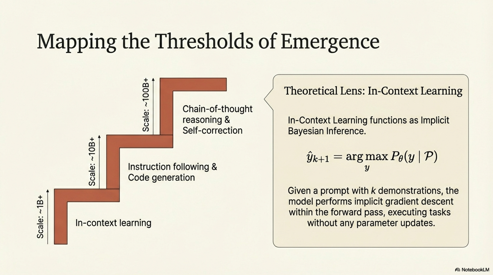

    // ========== 6. Reasoning Depth Analysis ==========
    34. FOR each reasoning_depth d ∈ {2, 4, 6, 8, 10, 12}:
        35. EVALUATE on problems requiring exactly d reasoning steps
        36. MEASURE accuracy with and without chain-of-thought prompting
    37. FIT accuracy decay model: acc(d) = a · exp(-b · d) + c
    38. ESTIMATE maximum reliable reasoning depth d* where acc > threshold

    // ========== 7. Adversarial Robustness ==========
    39. FOR each (x, y) ∈ D_adversarial:
        40. COMPUTE original prediction: ŷ = M_θ(x)
        41. COMPUTE adversarial prediction: ŷ_adv = M_θ(x_adv)
            where x_adv is semantically equivalent but syntactically perturbed
        42. MEASURE attack success rate = |{ŷ ≠ ŷ_adv}| / |D_adversarial|
    43. CATEGORIZE attacks by type: {typo, paraphrase, negation insertion, 
        entity swap, distractor injection}

    // ========== 8. Catastrophic Forgetting Measurement ==========
    44. EVALUATE M_θ on broad capability suite BEFORE fine-tuning → scores_pre
    45. FINE-TUNE M_θ on specific task → M_θ'
    46. EVALUATE M_θ' on same broad capability suite → scores_post
    47. COMPUTE forgetting metric per capability:
        F_c = max(0, scores_pre[c] - scores_post[c]) / scores_pre[c]
    48. COMPUTE average forgetting: F_avg = mean({F_c})

    // ========== Compile Report ==========
    49. AGGREGATE all metrics into DiagnosticReport:
        {hallucination_rate, bias_scores, ECE, MCE, temporal_degradation,
         context_robustness_heatmap, reasoning_depth_curve, adversarial_success_rate,
         forgetting_metrics, severity_rankings, recommended_mitigations}
    
    50. RETURN DiagnosticReport
```

---

## Conceptual Dependency Graph


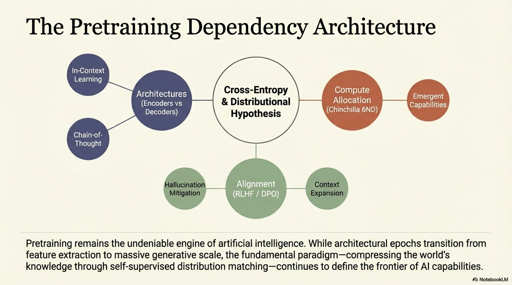


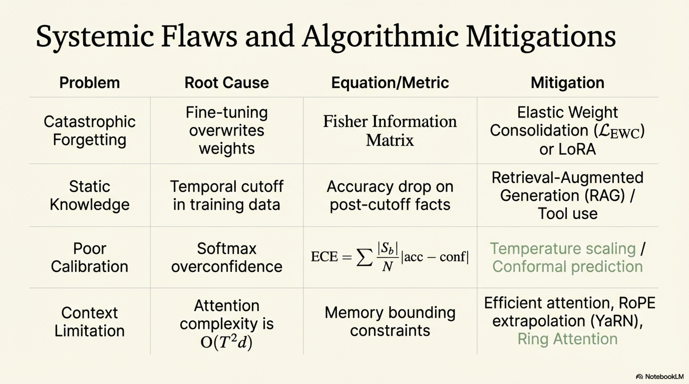


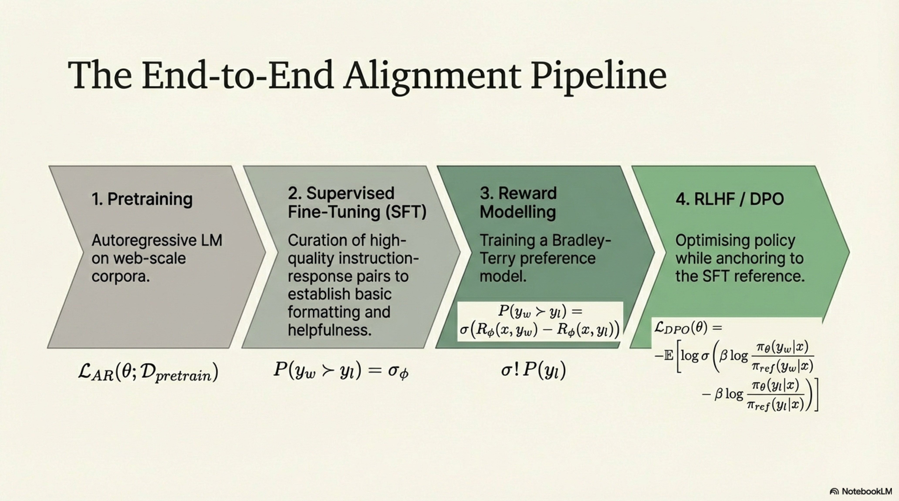


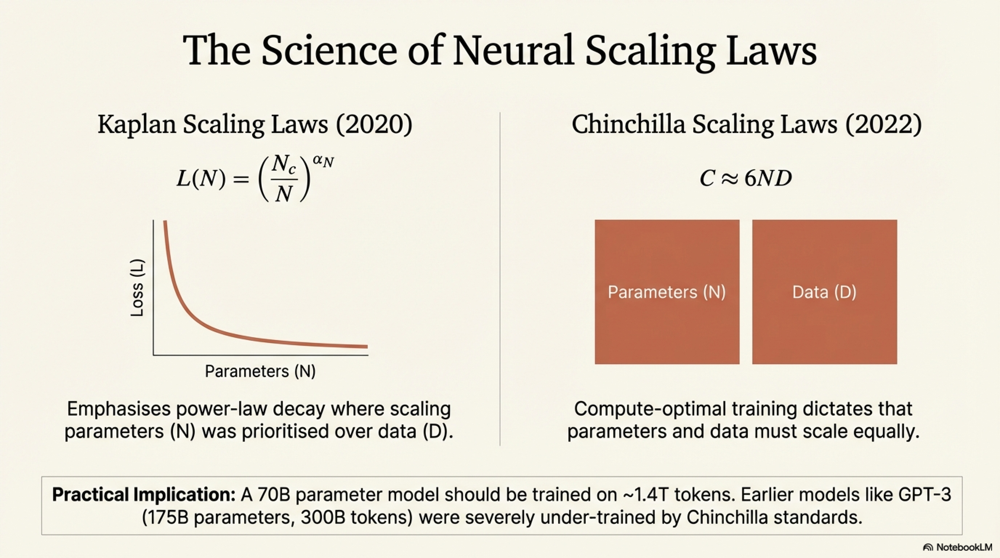


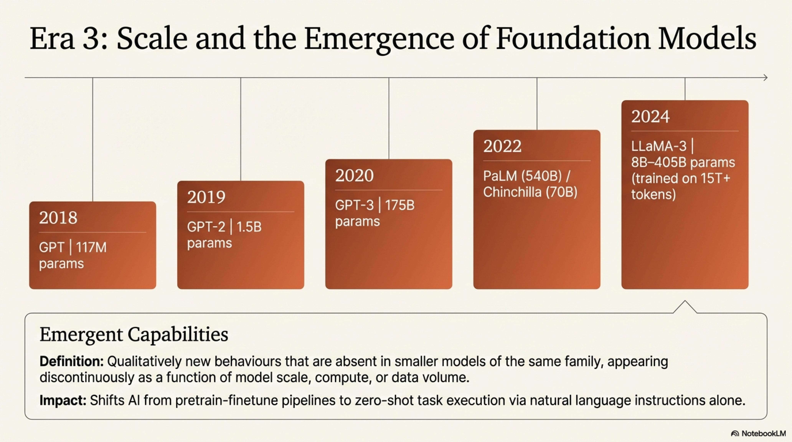


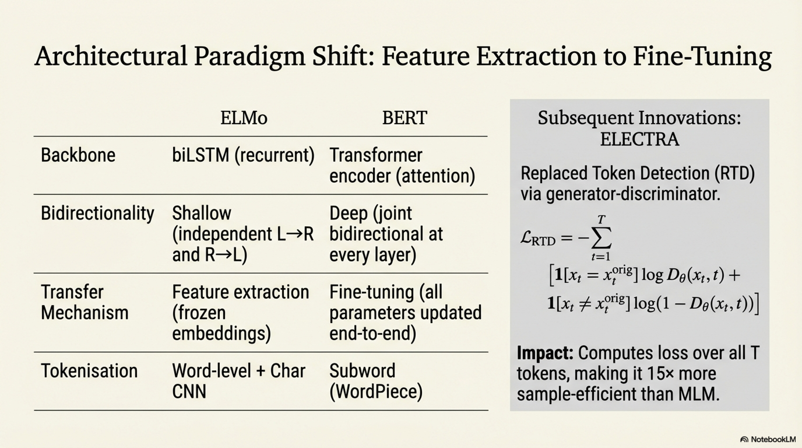

```
Static Word Embeddings (Word2Vec, GloVe)
       │
       ▼
ELMo (Contextualized via biLSTM, feature-based transfer)
       │
       ├──────────────────────────┐
       ▼                          ▼
GPT (Unidirectional Transformer,  BERT (Bidirectional Transformer,
 fine-tuning transfer)             MLM + NSP, fine-tuning transfer)

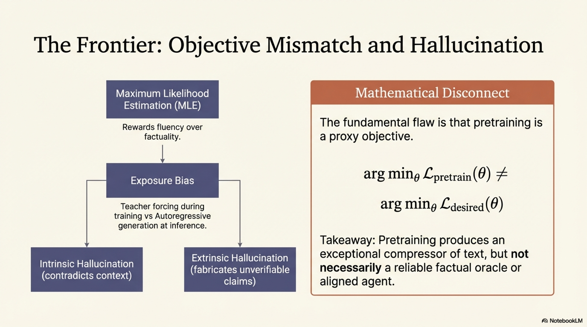


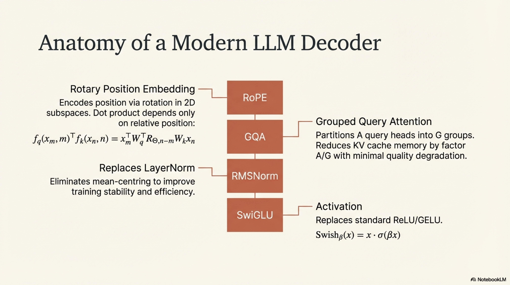


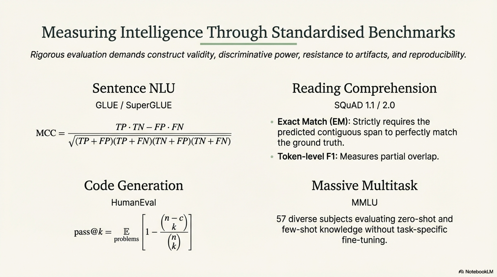

       │                          │
       ▼                          ▼
GPT-2 (Zero-shot via             RoBERTa, ALBERT, ELECTRA, DeBERTa
 language modeling)               (Encoder pretraining refinements)
       │
       ▼
GPT-3 (In-context learning, few-shot, scaling laws)
       │
       ▼
Scaling Era: PaLM, Chinchilla, LLaMA (Compute-optimal, open-weight)
       │
       ▼
Alignment: SFT → RLHF/DPO (Bridging pretrain-deploy gap)
       │
       ▼
Identified Limitations → Active Research Frontiers
{RAG, Tool Use, Multimodal, Neuro-symbolic, Continual Learning}
```