# Prompting Strategies in Large Language Models: A Rigorous Treatment

---

## 1. Prompt Engineering

### 1.1 Formal Definition


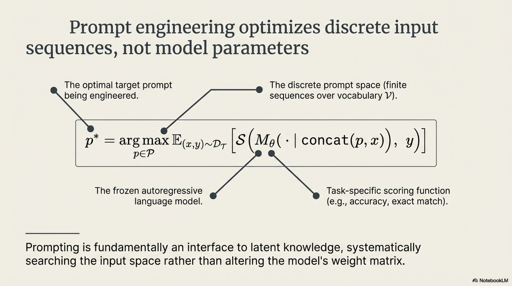


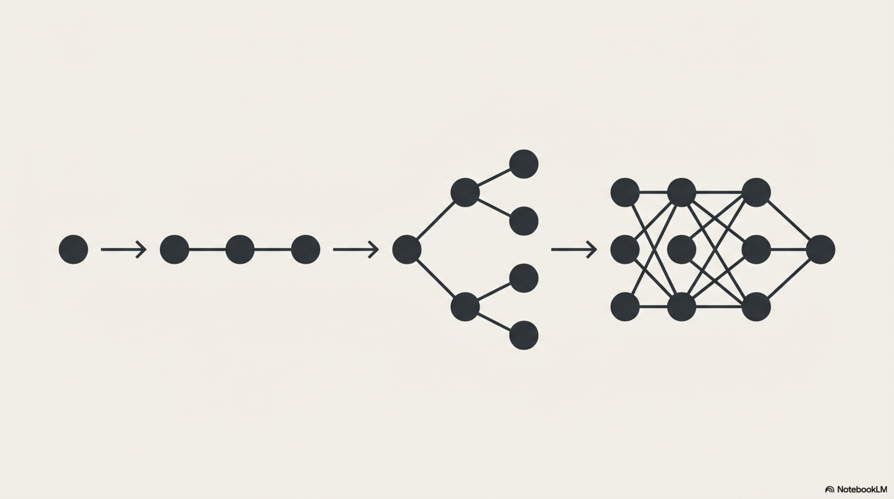

Prompt engineering is the **systematic optimization over discrete natural-language input sequences** to maximally elicit desired behavior from a frozen (or fixed) autoregressive language model $M_\theta$. It operates in the **input space** rather than the **parameter space**, treating the prompt as a learnable (or designable) interface to the model's latent knowledge.

Given a language model $M_\theta$ with frozen parameters $\theta$, a task distribution $\mathcal{D}_\mathcal{T}$ over input-output pairs $(x, y)$, and a discrete prompt space $\mathcal{P} \subseteq \mathcal{V}^*$ (all finite sequences over vocabulary $\mathcal{V}$), prompt engineering seeks:

$$
p^* = \arg\max_{p \in \mathcal{P}} \; \mathbb{E}_{(x, y) \sim \mathcal{D}_\mathcal{T}} \left[ \mathcal{S}\!\left( M_\theta\!\left(\, \cdot \mid \text{concat}(p, x)\right),\; y \right) \right]
$$

where $\mathcal{S}$ is a task-specific scoring function (accuracy, F1, BLEU, exact match, log-likelihood).

### 1.2 Taxonomy of Prompt Construction

| **Dimension** | **Categories** | **Formal Effect** |
|---|---|---|
| Exemplar Count | Zero-shot, Few-shot ($k$-shot) | Controls $|\mathcal{E}|$ in the prompt prefix |
| Instruction Specificity | Vague ↔ Highly-constrained | Constrains the output distribution's entropy $H(Y \mid p, x)$ |
| Role Assignment | Persona / system-level framing | Shifts the conditional prior $P_\theta(y \mid \text{role}, p, x)$ |
| Output Format Specification | Free-form, JSON, structured | Imposes syntactic constraints on the decoding space |
| Decomposition Strategy | Atomic, compositional, iterative | Determines the factorization of the joint reasoning distribution |

### 1.3 Prompt as Soft Constraint on Output Distribution

A well-engineered prompt $p$ effectively **reshapes the conditional output distribution**:

$$
P_\theta(y \mid p, x) = \frac{\exp\!\left(\sum_{t=1}^{|y|} \log P_\theta(y_t \mid y_{<t}, p, x)\right)}{Z(p, x)}
$$

The engineering objective is to select $p$ such that the modes of $P_\theta(y \mid p, x)$ align with the desired target distribution $P_{\text{target}}(y \mid x)$. This can be measured via KL divergence:

$$
p^* = \arg\min_{p \in \mathcal{P}} \; D_{\text{KL}}\!\left( P_{\text{target}}(Y \mid X) \;\|\; P_\theta(Y \mid p, X) \right)
$$

### 1.4 Prompt Sensitivity and Brittleness

Prompt engineering contends with a critical instability phenomenon. For two prompts $p_1, p_2$ differing by minor surface-level perturbations $\delta$:

$$
\| p_1 - p_2 \|_{\text{edit}} = \epsilon \quad \not\Rightarrow \quad \left| \mathcal{S}(M_\theta, p_1) - \mathcal{S}(M_\theta, p_2) \right| < \epsilon'
$$


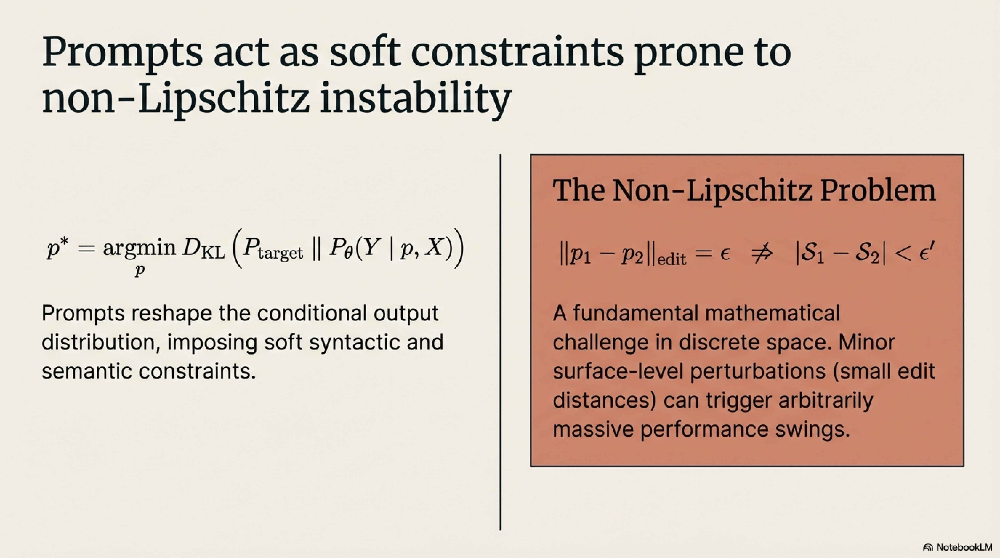

This **non-Lipschitz behavior** in discrete prompt space is a fundamental challenge — small edits can produce arbitrarily large performance swings.

### 1.5 Pseudo-Algorithm: Systematic Prompt Optimization

```
ALGORITHM: IterativePromptOptimization

INPUT:
    M_θ          — Frozen language model with parameters θ
    D_T          — Task distribution: set of (x, y) pairs
    D_val        — Held-out validation set
    S(·, ·)      — Scoring function (task metric)
    K            — Maximum optimization iterations
    B            — Candidate batch size per iteration

OUTPUT:
    p*           — Optimized prompt achieving max S on D_val
    score*       — Corresponding validation score

PROCEDURE:

    1. INITIALIZE:
       p_0 ← ConstructSeedPrompt(D_T)
           // Compose initial prompt from:
           //   - Task instruction I (declarative specification of desired mapping)
           //   - Exemplar set E = {(x_i, y_i)}_{i=1}^{k}, selected via
           //     maximum marginal relevance from D_T
           //   - Output format constraint F (structural schema)
           //   - Role/persona prefix R (optional)
           // p_0 = concat(R, I, E, F)

       score_best ← Evaluate(M_θ, p_0, D_val, S)
       p* ← p_0

    2. FOR iter = 1 TO K:

       a. GENERATE CANDIDATES:
          C ← ∅
          FOR j = 1 TO B:
              p_j ← ApplyPerturbation(p*, perturbation_type)
              // perturbation_type ∈ {
              //   REPHRASE_INSTRUCTION — paraphrase I preserving semantics,
              //   REORDER_EXEMPLARS   — permute exemplar sequence,
              //   SWAP_EXEMPLARS      — replace exemplars via diversity sampling,
              //   ADJUST_SPECIFICITY  — increase/decrease constraint granularity,
              //   MODIFY_FORMAT       — alter output schema,
              //   ADD_REASONING_HINT  — inject intermediate reasoning cues
              // }
              C ← C ∪ {p_j}

       b. EVALUATE CANDIDATES:
          FOR each p_j ∈ C:
              score_j ← Evaluate(M_θ, p_j, D_val, S)

       c. SELECT BEST:
          j* ← argmax_j score_j
          IF score_{j*} > score_best:
              p* ← p_{j*}
              score_best ← score_{j*}

       d. EARLY STOPPING:
          IF no improvement for τ consecutive iterations:
              BREAK

    3. VALIDATE ROBUSTNESS:
       // Test p* against paraphrased inputs from D_val
       // to verify non-brittleness
       robustness_score ← EvaluateOnPerturbedInputs(M_θ, p*, D_val, S)
       IF robustness_score < threshold_r:
           // p* is brittle; restart with different seed or ensembled prompt
           GOTO step 1 with modified seed strategy

    4. RETURN p*, score_best
```

---

## 2. Prompt Applications

### 2.1 Definition

Prompt applications denote the **functional deployment of engineered prompts as task-specific interfaces** to a general-purpose LLM, transforming a single pretrained model into a polymorphic system capable of executing heterogeneous tasks **without parameter modification**. The prompt serves as an **in-context program** — a declarative or procedural specification compiled at inference time into the model's forward pass.

### 2.2 Formal Task Casting via Prompts

Any NLP task $\mathcal{T}_i$ can be cast as a conditional generation problem through a **prompt template function** $\phi_i$:

$$
\phi_i : \mathcal{X}_i \to \mathcal{V}^* \qquad \text{such that} \qquad M_\theta(\phi_i(x)) \approx y_i
$$

The universality claim: for a sufficiently capable $M_\theta$, there exists a prompt template $\phi_i$ for **any** task $\mathcal{T}_i$ such that:

$$
\mathbb{E}_{(x,y) \sim \mathcal{D}_{\mathcal{T}_i}} \left[ \mathcal{S}(M_\theta(\phi_i(x)), y) \right] \geq \tau_i
$$

for some acceptable performance threshold $\tau_i$.

### 2.3 Taxonomy of Application Modalities


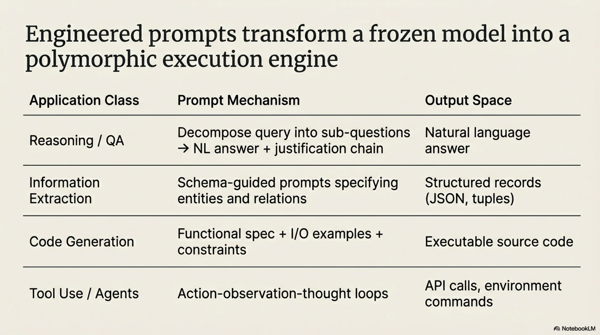

| **Application Class** | **Prompt Mechanism** | **Output Space** |
|---|---|---|
| **Reasoning / QA** | Decompose query into sub-questions; inject reasoning scaffolds | Natural language answer + optional justification chain |
| **Information Extraction** | Schema-guided prompts specifying entity types, relations | Structured records (JSON, tuples, tables) |
| **Code Generation** | Functional specification + input-output examples + constraints | Executable source code in target language |
| **Summarization** | Source document + compression ratio + focus constraints | Condensed natural language |
| **Tool Use / Agents** | Action-observation-thought loop specification | API calls, function invocations, environment commands |
| **Data Augmentation** | Style/distribution specification + seed examples | Synthetic training samples |
| **Evaluation / Critique** | Rubric + candidate output + evaluation dimensions | Scores, rankings, natural language feedback |

### 2.4 In-Context Learning as Implicit Bayesian Inference

The theoretical foundation for few-shot prompt applications rests on the **implicit Bayesian inference** framework (Xie et al., 2022). Given exemplars $\mathcal{E} = \{(x_i, y_i)\}_{i=1}^k$ in the prompt, the model implicitly performs:

$$
P_\theta(y \mid x, \mathcal{E}) \approx \int P(y \mid x, c) \; P(c \mid \mathcal{E}) \; dc
$$


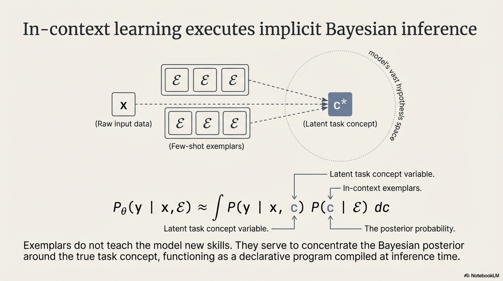

where $c$ is a latent **concept variable** representing the task. The exemplars $\mathcal{E}$ serve to **concentrate the posterior** $P(c \mid \mathcal{E})$ around the true task concept $c^*$, enabling accurate conditional generation.

### 2.5 Pseudo-Algorithm: Universal Prompt-Based Task Execution

```
ALGORITHM: PromptBasedTaskExecution

INPUT:
    M_θ              — Pretrained language model
    T                — Task specification (natural language description)
    x                — Input instance
    E = {(x_i, y_i)} — Optional exemplar set (|E| = k, k ≥ 0)
    F                — Output format schema (structural constraints)
    C                — Domain-specific constraints (length, style, validity)
    D                — Decoding configuration (temperature τ, top-p, max_tokens)

OUTPUT:
    y                — Task output conforming to F and C
    metadata         — Confidence estimate, token log-probabilities

PROCEDURE:

    1. CONSTRUCT PROMPT:
       prompt ← ""

       a. ROLE ASSIGNMENT (optional):
          prompt ← prompt + "You are [domain-expert persona]."

       b. TASK INSTRUCTION:
          prompt ← prompt + FormatInstruction(T)
          // Convert task spec into imperative/declarative instruction

       c. EXEMPLAR INJECTION (if k > 0):
          E_ordered ← OrderExemplars(E, strategy)
          // strategy ∈ {RANDOM, SIMILARITY_TO_x, DIVERSITY_MAXIMIZING,
          //              CURRICULUM_EASY_TO_HARD}
          FOR each (x_i, y_i) ∈ E_ordered:
              prompt ← prompt + FormatExemplar(x_i, y_i, F)

       d. FORMAT SPECIFICATION:
          prompt ← prompt + "Output format: " + Serialize(F)

       e. INPUT INJECTION:
          prompt ← prompt + FormatInput(x)

    2. INFERENCE:
       raw_output ← M_θ.Generate(prompt, D)

    3. POST-PROCESSING:
       y ← ParseOutput(raw_output, F)
       // Extract structured output according to schema F
       // Handle malformed outputs via retry or fallback parsing

    4. CONSTRAINT VALIDATION:
       IF NOT SatisfiesConstraints(y, C):
           // Self-correction loop
           correction_prompt ← ConstructCorrectionPrompt(prompt, y, C, violations)
           y ← M_θ.Generate(correction_prompt, D)
           y ← ParseOutput(y, F)

    5. CONFIDENCE ESTIMATION:
       log_probs ← M_θ.GetLogProbabilities(prompt, raw_output)
       confidence ← ComputeSequenceConfidence(log_probs)
       // confidence = exp(1/|y| · Σ_t log P(y_t | y_{<t}, prompt))

    6. RETURN y, {confidence, log_probs}
```

---

## 3. Chain-of-Thought (CoT) Prompting

### 3.1 Definition

Chain-of-Thought prompting (Wei et al., 2022) is a **prompting paradigm that elicits explicit intermediate reasoning steps** from the language model prior to producing a final answer. It transforms the direct mapping $x \to y$ into a factored sequential computation $x \to r_1 \to r_2 \to \cdots \to r_n \to y$, where each $r_i$ is a coherent reasoning step.

### 3.2 Mathematical Formulation

**Standard prompting** models the answer as:

$$
P_\theta(y \mid x) = P_\theta(y \mid [p; x])
$$

**CoT prompting** introduces a latent reasoning chain $\mathbf{r} = (r_1, r_2, \ldots, r_n)$ and marginalizes:

$$
P_\theta(y \mid x) = \sum_{\mathbf{r} \in \mathcal{R}} P_\theta(y \mid x, \mathbf{r}) \cdot P_\theta(\mathbf{r} \mid x)
$$

In practice, autoregressive generation approximates this by **sampling a single chain** $\mathbf{r}^*$ and conditioning:

$$
P_\theta(y, \mathbf{r} \mid x) = \prod_{i=1}^{n} P_\theta(r_i \mid x, r_1, \ldots, r_{i-1}) \cdot P_\theta(y \mid x, r_1, \ldots, r_n)
$$

The key insight: **by forcing the model to serialize intermediate computations into the token sequence, CoT effectively extends the model's computational depth** beyond the fixed transformer depth $L$, using the autoregressive decoding loop as an unbounded-depth recurrent computation.

### 3.3 Theoretical Justification: Computational Complexity

Feng et al. (2023) formally established that:

- A constant-depth transformer can solve only problems in $\mathsf{TC}^0$ (constant-depth threshold circuits) in a **single forward pass**.
- With CoT of length $T$, the effective computational class expands to $\mathsf{P}$ (polynomial-time decidable problems), since $T$ sequential forward passes simulate $T$ serial computation steps.

$$
\text{Expressivity}(\text{Transformer with CoT of length } T) \supseteq \mathsf{DTIME}(T)
$$

This provides the **formal reason** why CoT enables multi-step arithmetic, symbolic reasoning, and algorithmic tasks that fail under direct prompting.

### 3.4 Variants

| **Variant** | **Mechanism** | **Key Property** |
|---|---|---|
| **Few-Shot CoT** | Exemplars include explicit reasoning chains | Requires manual chain annotation |
| **Zero-Shot CoT** (Kojima et al., 2022) | Append "Let's think step by step" | No exemplars needed; relies on instruction following |
| **Auto-CoT** (Zhang et al., 2023) | Automatically cluster questions, generate chains per cluster | Removes manual exemplar dependency |
| **Self-Consistency** (Wang et al., 2023) | Sample $K$ chains, majority-vote on final answers | Marginalizes over reasoning paths |
| **Complexity-Based CoT** | Select exemplars with longest/most complex reasoning chains | Longer chains correlate with harder reasoning |

### 3.5 Self-Consistency Decoding

Rather than greedily decoding a single chain, self-consistency samples $K$ independent reasoning chains and applies **majority voting**:

$$
a^* = \arg\max_{a \in \mathcal{A}} \sum_{i=1}^{K} \mathbb{1}\!\left[ \text{Extract}(\mathbf{r}_i) = a \right]
$$

where each $\mathbf{r}_i \sim P_\theta(\mathbf{r} \mid x)$ is sampled with temperature $\tau > 0$. This approximates the true marginalization:

$$
a^* = \arg\max_{a} \; P_\theta(a \mid x) = \arg\max_{a} \sum_{\mathbf{r}} P_\theta(a \mid x, \mathbf{r}) \cdot P_\theta(\mathbf{r} \mid x)
$$

via Monte Carlo estimation.

### 3.6 Pseudo-Algorithm: Chain-of-Thought with Self-Consistency

```
ALGORITHM: ChainOfThoughtWithSelfConsistency

INPUT:
    M_θ              — Language model
    x                — Input query/problem
    E_cot            — (Optional) k exemplars with reasoning chains:
                       {(x_i, r_i, y_i)}_{i=1}^{k}
                       where r_i = (r_i^1, r_i^2, ..., r_i^{n_i}) is the
                       chain of intermediate reasoning steps
    K                — Number of sampled reasoning paths (K ≥ 1)
    τ                — Sampling temperature (τ > 0)
    mode             — ∈ {ZERO_SHOT, FEW_SHOT}

OUTPUT:
    a*               — Final answer (majority-voted if K > 1)
    {r_i}_{i=1}^{K}  — Set of generated reasoning chains
    confidence       — Proportion of chains agreeing with a*

PROCEDURE:

    1. CONSTRUCT CoT PROMPT:
       IF mode = ZERO_SHOT:
           prompt ← concat(x, " Let's think step by step.")
       
       ELSE IF mode = FEW_SHOT:
           prompt ← ""
           FOR each (x_i, r_i, y_i) ∈ E_cot:
               prompt ← prompt + "Q: " + x_i + "\n"
               prompt ← prompt + "Reasoning:\n"
               FOR each step r_i^j ∈ r_i:
                   prompt ← prompt + "Step " + j + ": " + r_i^j + "\n"
               prompt ← prompt + "Answer: " + y_i + "\n\n"
           prompt ← prompt + "Q: " + x + "\n"
           prompt ← prompt + "Reasoning:\n"

    2. SAMPLE K REASONING CHAINS:
       chains ← ∅
       answers ← ∅
       FOR i = 1 TO K:
           output_i ← M_θ.Generate(prompt, temperature=τ, do_sample=TRUE)
           r_i ← ExtractReasoningChain(output_i)
           // Parse output into sequence of reasoning steps
           // r_i = (r_i^1, r_i^2, ..., r_i^{n_i})
           
           a_i ← ExtractFinalAnswer(output_i)
           // Extract the terminal answer token/phrase after reasoning
           
           chains ← chains ∪ {r_i}
           answers ← answers ∪ {a_i}

    3. AGGREGATE VIA MAJORITY VOTING:
       // Compute frequency of each distinct answer
       FOR each unique answer a ∈ answers:
           count(a) ← |{i : a_i = a}|
       
       a* ← argmax_a count(a)
       confidence ← count(a*) / K

    4. (OPTIONAL) WEIGHTED VOTING:
       // Weight each chain by its sequence log-probability
       FOR i = 1 TO K:
           w_i ← exp(1/|output_i| · Σ_t log P_θ(token_t | token_{<t}, prompt))
       
       a* ← argmax_a Σ_{i: a_i = a} w_i
       confidence ← (Σ_{i: a_i = a*} w_i) / (Σ_i w_i)

    5. CHAIN QUALITY VALIDATION:
       // Verify that the winning chain is internally consistent
       best_chain ← SelectChain(chains, a*)
       // Select the highest-probability chain that produced a*
       
       IF ContainsContradiction(best_chain):
           // Detected logical inconsistency within steps
           // Re-run with refined prompt or increased K
           FLAG warning

    6. RETURN a*, chains, confidence
```

---

## 4. Tree-of-Thought (ToT) Prompting

### 4.1 Definition

Tree-of-Thought (Yao et al., 2024) generalizes Chain-of-Thought from a **single linear chain** to a **tree-structured exploration** of the reasoning space. Each node in the tree represents a **partial solution state**, each edge represents a **thought** (a coherent reasoning unit), and the model performs **deliberate search** (BFS or DFS) with **self-evaluation** to navigate toward correct solutions.

ToT operationalizes the classical AI search paradigm **within the LLM's own generation capabilities**, using the model simultaneously as:
1. **Thought generator** — proposes candidate next steps
2. **State evaluator** — assesses the promise of each partial state
3. **Search controller** — decides expansion, pruning, and backtracking

### 4.2 Formal Framework

Define a **thought decomposition** of problem $P$:

- **State space** $\mathcal{S}$: set of all partial solution states. Initial state $s_0 = P$ (the raw problem). Terminal states $\mathcal{S}_T \subset \mathcal{S}$ yield final answers.

- **Thought space** $\mathcal{T}$: set of coherent reasoning units. Each thought $t$ is a textual fragment representing a single reasoning step.

- **Transition function**: $\text{NEXT}(s, t) = s'$, the state obtained by appending thought $t$ to state $s$.

- **Thought generator**: $G_\theta(s) \to \{t_1, t_2, \ldots, t_b\}$, produces $b$ candidate thoughts for state $s$ using LLM $M_\theta$.

- **State evaluator**: $V_\theta(s) \to \mathbb{R}$ (or categorical: $\{\text{sure}, \text{likely}, \text{impossible}\}$), assesses the promise of state $s$ using $M_\theta$.

The objective is to find the optimal path from $s_0$ to a terminal state:

$$
s^* = \arg\max_{s \in \mathcal{S}_T} V_\theta(s) \qquad \text{subject to} \qquad s = \text{NEXT}(\cdots\text{NEXT}(s_0, t_1)\cdots, t_n)
$$

### 4.3 Thought Generation Strategies

**Strategy 1 — Independent Sampling (i.i.d.)**:

$$
t_i \overset{\text{i.i.d.}}{\sim} P_\theta(\cdot \mid s), \quad i = 1, \ldots, b
$$

Each thought is sampled independently with temperature $\tau$. Suitable when the thought space is rich and diverse.

**Strategy 2 — Proposal Prompting (sequential)**:

$$
[t_1, t_2, \ldots, t_b] \sim P_\theta(\cdot \mid s, \text{"propose } b \text{ distinct next steps"})
$$

A single LLM call produces all $b$ candidates, leveraging the model's ability to enumerate diverse options. Suitable when thoughts are short and constrained.

### 4.4 State Evaluation Strategies

**Value-based evaluation**: Prompt the LLM to assign a scalar or categorical assessment:

$$
V_\theta(s) = \mathbb{E}\!\left[ M_\theta\!\left(\text{"Evaluate this partial solution: } s \text{"}\right) \right]
$$

**Vote-based evaluation**: Sample $K$ continuations from $s$ to completion, count successes:

$$
V_\theta(s) = \frac{1}{K} \sum_{i=1}^{K} \mathbb{1}\!\left[ \text{Complete}_\theta(s, i) \text{ reaches correct terminal state} \right]
$$

### 4.5 Comparison: CoT vs. ToT

| **Property** | **CoT** | **ToT** |
|---|---|---|
| Structure | Single linear chain | Tree with branching factor $b$ |
| Search | Greedy (no backtracking) | Systematic (BFS/DFS with backtracking) |
| Evaluation | Post-hoc (after full chain) | Per-node (intermediate states evaluated) |
| Computational cost | $O(1)$ LLM calls per step | $O(b^d)$ worst case for depth $d$ |
| Error recovery | None (committed to single path) | Prunes unpromising branches, backtracks |
| Suited for | Simple multi-step reasoning | Combinatorial planning, creative search |

### 4.6 Pseudo-Algorithm: Tree-of-Thought Search

```
ALGORITHM: TreeOfThought

INPUT:
    M_θ              — Language model (serves as generator + evaluator)
    P                — Problem statement (initial state s_0)
    b                — Branching factor (thoughts per node)
    d_max            — Maximum tree depth
    search_mode      — ∈ {BFS, DFS}
    prune_threshold  — Minimum V_θ(s) to continue expanding node
    beam_width       — (BFS only) number of states retained per level: W
    eval_strategy    — ∈ {VALUE, VOTE}
    K_vote           — (VOTE only) number of rollouts for vote-based evaluation

OUTPUT:
    s*               — Best terminal state (solution)
    path*            — Sequence of thoughts from s_0 to s*
    V*               — Evaluation score of s*

PROCEDURE:

    ──────────────────────────────────────────
    CASE search_mode = BFS:
    ──────────────────────────────────────────

    1. INITIALIZE:
       S_0 ← {s_0}     // Set of active states at depth 0

    2. FOR depth = 1 TO d_max:

       a. THOUGHT GENERATION:
          candidates ← ∅
          FOR each s ∈ S_{depth-1}:
              T_s ← GenerateThoughts(M_θ, s, b)
              // T_s = {t_1, ..., t_b}: b candidate thoughts for state s
              FOR each t ∈ T_s:
                  s' ← NEXT(s, t)    // Append thought to state
                  candidates ← candidates ∪ {(s', parent=s, thought=t)}

       b. STATE EVALUATION:
          FOR each (s', _, _) ∈ candidates:
              IF eval_strategy = VALUE:
                  V_θ(s') ← PromptForValue(M_θ, s')
                  // Prompt: "Given this partial solution: [s'],
                  //          rate likelihood of reaching correct answer.
                  //          Respond: sure / likely / impossible"
                  // Map to numeric: sure→1.0, likely→0.5, impossible→0.0

              ELSE IF eval_strategy = VOTE:
                  successes ← 0
                  FOR j = 1 TO K_vote:
                      completion_j ← M_θ.Generate(s', greedy to terminal)
                      IF IsCorrect(completion_j):
                          successes ← successes + 1
                  V_θ(s') ← successes / K_vote

       c. PRUNING AND BEAM SELECTION:
          // Remove states below threshold
          candidates ← {(s', p, t) ∈ candidates : V_θ(s') ≥ prune_threshold}

          // Retain top-W states by evaluation score
          S_{depth} ← TopW(candidates, by=V_θ, count=W)

       d. TERMINAL CHECK:
          terminals ← {s' ∈ S_{depth} : IsTerminal(s')}
          IF terminals ≠ ∅:
              s* ← argmax_{s' ∈ terminals} V_θ(s')
              path* ← ReconstructPath(s*, from=s_0)
              RETURN s*, path*, V_θ(s*)

    3. // Reached d_max without terminal: return best available
       s* ← argmax_{s' ∈ S_{d_max}} V_θ(s')
       path* ← ReconstructPath(s*, from=s_0)
       RETURN s*, path*, V_θ(s*)

    ──────────────────────────────────────────
    CASE search_mode = DFS:
    ──────────────────────────────────────────

    1. INITIALIZE:
       best_solution ← NULL
       V_best ← -∞
       stack ← [(s_0, depth=0, path=[])]

    2. WHILE stack is not empty:

       a. (s, depth, path) ← stack.pop()

       b. IF IsTerminal(s):
              v ← V_θ(s)
              IF v > V_best:
                  V_best ← v
                  best_solution ← s
                  path* ← path
              CONTINUE

       c. IF depth ≥ d_max:
              CONTINUE    // Depth limit reached

       d. THOUGHT GENERATION:
          T_s ← GenerateThoughts(M_θ, s, b)

       e. EVALUATION AND PRUNING:
          FOR each t ∈ T_s:
              s' ← NEXT(s, t)
              v' ← V_θ(s')    // Evaluate via VALUE or VOTE
              IF v' ≥ prune_threshold:
                  stack.push((s', depth+1, path + [t]))
              // Else: prune this branch (backtrack implicitly)

       f. // Ordering heuristic: sort stack top by V_θ descending
          //   to explore most promising branches first (best-first DFS)

    3. RETURN best_solution, path*, V_best
```

### 4.7 Complexity Analysis

For BFS with beam width $W$, branching factor $b$, depth $d$:

$$
\text{LLM calls} = O(W \cdot b \cdot d) \quad \text{(generation)} + O(W \cdot b \cdot d) \quad \text{(evaluation)} = O(W \cdot b \cdot d)
$$

For DFS without pruning (worst case):

$$
\text{LLM calls} = O(b^d) \quad \text{(exponential in depth)}
$$

Effective pruning reduces this substantially. The **evaluation-to-generation cost ratio** is a critical design parameter.

---

## 5. Graph-of-Thought (GoT) Prompting

### 5.1 Definition

Graph-of-Thought (Besta et al., 2024) is the **most general reasoning topology**, extending ToT by modeling the reasoning process as transformations on an **arbitrary directed graph** $\mathcal{G} = (V, E)$ rather than a tree. The fundamental advancement is the introduction of **aggregation operations** — the ability to merge information from multiple independent reasoning paths into a single node — which is structurally **impossible in both chains and trees**.

In GoT:
- Each vertex $v \in V$ represents a **thought** (a partial solution or intermediate reasoning state).
- Each directed edge $(v_i, v_j) \in E$ represents a **dependency**: thought $v_j$ was derived (at least partially) from thought $v_i$.
- The graph is generally a **DAG** (directed acyclic graph), though cycles can represent iterative refinement loops.

### 5.2 Key Insight: Why Trees Are Insufficient

In a tree, every node has **exactly one parent**. This means:

$$
\text{In ToT:} \quad v_j = f_\theta(v_{\text{parent}(j)})
$$

A thought can only depend on **one** preceding thought. GoT enables:

$$
\text{In GoT:} \quad v_j = f_\theta(v_{i_1}, v_{i_2}, \ldots, v_{i_m}) \qquad \text{where } \{v_{i_1}, \ldots, v_{i_m}\} = \text{parents}(v_j)
$$

This models **multi-premise reasoning**, where a conclusion requires synthesizing evidence from **multiple independent reasoning branches**.

### 5.3 Formal Graph Operations

GoT defines four primitive operations on the reasoning graph $\mathcal{G} = (V, E)$:

---

**Operation 1: Generate ($\text{GEN}$)**

Produces new thoughts from an existing thought. Adds vertices and edges:

$$
\text{GEN}(v_i, k) \to \{v_{j_1}, \ldots, v_{j_k}\}
$$
$$
V \leftarrow V \cup \{v_{j_1}, \ldots, v_{j_k}\}, \qquad E \leftarrow E \cup \{(v_i, v_{j_l})\}_{l=1}^{k}
$$

Analogous to branching in ToT.

---

**Operation 2: Aggregate ($\text{AGG}$)**  ← **(unique to GoT)**

Merges multiple thoughts into a single synthesized thought:

$$
\text{AGG}(\{v_{i_1}, v_{i_2}, \ldots, v_{i_m}\}) \to v_j
$$
$$
V \leftarrow V \cup \{v_j\}, \qquad E \leftarrow E \cup \{(v_{i_l}, v_j)\}_{l=1}^{m}
$$

This creates a vertex with **in-degree $> 1$**, which is structurally forbidden in trees. Examples:
- Merging sorted sublists in a sorting task
- Combining partial summaries of document chunks
- Synthesizing evidence from parallel hypothesis branches

---

**Operation 3: Refine ($\text{REF}$)**

Iteratively improves an existing thought **in-place** (or creates an improved successor):

$$
\text{REF}(v_i) \to v_i' \qquad \text{where} \quad V \leftarrow V \cup \{v_i'\}, \quad E \leftarrow E \cup \{(v_i, v_i')\}
$$

This enables **iterative self-correction** without expanding the graph's breadth.

---

**Operation 4: Score ($\text{SC}$)**

Evaluates the quality of a thought:

$$
\text{SC}(v_i) \to \mathbb{R}
$$

Does not modify $\mathcal{G}$. Used to select the best thoughts for downstream operations.

---

### 5.4 Graph-Level Metrics

**Volume of Reasoning**:

$$
\text{Vol}(\mathcal{G}) = |E|
$$

Captures the total amount of reasoning effort expended.

**Latency of Reasoning**:

$$
\text{Lat}(\mathcal{G}) = \text{length of longest path in } \mathcal{G}
$$

This determines the **sequential depth** — operations on vertices at the same depth can be **parallelized**, a crucial advantage over CoT (where latency equals volume).

**Parallelism Ratio**:

$$
\text{Par}(\mathcal{G}) = \frac{|E|}{\text{Lat}(\mathcal{G})}
$$

Higher ratio = more parallelizable. CoT has $\text{Par} = 1$ (fully sequential). GoT can achieve $\text{Par} \gg 1$.

### 5.5 Comparative Topology Analysis

| **Method** | **Graph Structure** | **In-degree** | **Out-degree** | **Aggregation** | **Latency** |
|---|---|---|---|---|---|
| IO (Direct) | Single edge | 0 → 1 | 1 → 0 | — | $O(1)$ |
| CoT | Linear chain | $\leq 1$ | $\leq 1$ | No | $O(n)$ |
| CoT-SC | $K$ parallel chains | $\leq 1$ | $\leq 1$ | Vote only (at end) | $O(n)$ |
| ToT | Tree | $\leq 1$ | $\leq b$ | No | $O(d)$ |
| **GoT** | **DAG** | **$\leq m$ (arbitrary)** | **$\leq k$ (arbitrary)** | **Yes** | **$O(\text{longest path})$** |

### 5.6 GoT as Subsumption of Prior Methods

GoT **strictly generalizes** all prior methods:

- **CoT** is a GoT where $\mathcal{G}$ is a **path graph** (each vertex has in-degree and out-degree $\leq 1$).
- **CoT-SC** is a GoT where $\mathcal{G}$ is a set of $K$ disjoint paths with a single terminal aggregation node.
- **ToT** is a GoT where $\mathcal{G}$ is a **tree** (each vertex has in-degree $\leq 1$).

Formally, the class of reasoning topologies satisfies:

$$
\text{CoT} \subset \text{CoT-SC} \subset \text{ToT} \subset \text{GoT}
$$

### 5.7 Pseudo-Algorithm: Graph-of-Thought Reasoning

```
ALGORITHM: GraphOfThought

INPUT:
    M_θ              — Language model
    P                — Problem statement
    Σ                — Graph transformation schedule (sequence of operations):
                       Σ = [op_1, op_2, ..., op_L]
                       where each op_i ∈ {GEN(params), AGG(params),
                                          REF(params), SC(params)}
    decompose_fn     — Problem decomposition function:
                       decompose_fn(P) → {sub_1, sub_2, ..., sub_m}
    merge_fn         — Merging strategy for AGG operations
    quality_fn       — Quality assessment prompt template for SC
    max_refinements  — Maximum REF iterations per thought
    parallelism      — Whether to execute independent operations concurrently

OUTPUT:
    solution         — Final answer extracted from best-scored terminal vertex
    G = (V, E)       — Complete reasoning graph
    scores           — Quality scores for all evaluated vertices

PROCEDURE:

    1. INITIALIZE GRAPH:
       // Decompose problem into independent sub-problems
       {sub_1, ..., sub_m} ← decompose_fn(P)
       
       V ← {v_0}           // v_0 is the root: the original problem P
       E ← ∅
       
       // Create initial thought vertices for each sub-problem
       FOR i = 1 TO m:
           v_i ← CreateVertex(content=sub_i, depth=1)
           V ← V ∪ {v_i}
           E ← E ∪ {(v_0, v_i)}

    2. EXECUTE TRANSFORMATION SCHEDULE:
       FOR each op in Σ:

          ──────────────────────────────────────
          CASE op = GEN(source_selector, k):
          ──────────────────────────────────────
             // Generate k new thoughts from selected source vertices
             sources ← source_selector(V, E)
             // source_selector identifies which vertices to expand
             // e.g., all leaves, highest-scored unexpanded vertices

             FOR each v_s ∈ sources:  [PARALLELIZABLE]
                 thoughts ← M_θ.Generate(
                     prompt = "Given partial reasoning state: [v_s.content]. "
                              "Generate [k] distinct next reasoning steps.",
                     count = k
                 )
                 FOR each t_j ∈ thoughts:
                     v_new ← CreateVertex(content=t_j, depth=v_s.depth+1)
                     V ← V ∪ {v_new}
                     E ← E ∪ {(v_s, v_new)}

          ──────────────────────────────────────
          CASE op = AGG(group_selector, merge_fn):
          ──────────────────────────────────────
             // Aggregate multiple thoughts into a single synthesized thought
             groups ← group_selector(V, E)
             // group_selector partitions selected vertices into merge groups
             // e.g., group vertices solving same sub-aspect,
             //        or corresponding solutions to parallel sub-problems

             FOR each group G_l = {v_{l_1}, ..., v_{l_q}} ∈ groups:
                                                          [PARALLELIZABLE]
                 combined_content ← Concatenate({v.content : v ∈ G_l})
                 
                 v_agg ← M_θ.Generate(
                     prompt = merge_fn.template.format(
                         thoughts = combined_content,
                         instruction = "Synthesize these reasoning fragments "
                                       "into a single coherent solution."
                     )
                 )
                 v_new ← CreateVertex(content=v_agg,
                                      depth=max({v.depth : v ∈ G_l})+1)
                 V ← V ∪ {v_new}
                 FOR each v ∈ G_l:
                     E ← E ∪ {(v, v_new)}

          ──────────────────────────────────────
          CASE op = REF(target_selector, max_iter):
          ──────────────────────────────────────
             // Refine selected thoughts iteratively
             targets ← target_selector(V, E)

             FOR each v_t ∈ targets:  [PARALLELIZABLE]
                 v_current ← v_t
                 FOR iter = 1 TO min(max_iter, max_refinements):
                     v_refined_content ← M_θ.Generate(
                         prompt = "Current reasoning: [v_current.content]. "
                                  "Identify any errors, gaps, or improvements. "
                                  "Produce a refined version."
                     )
                     v_new ← CreateVertex(content=v_refined_content,
                                          depth=v_current.depth+1)
                     V ← V ∪ {v_new}
                     E ← E ∪ {(v_current, v_new)}

                     // Convergence check
                     IF SemanticSimilarity(v_current.content,
                                           v_new.content) > convergence_θ:
                         BREAK
                     v_current ← v_new

          ──────────────────────────────────────
          CASE op = SC(target_selector):
          ──────────────────────────────────────
             // Score selected vertices for quality
             targets ← target_selector(V, E)

             FOR each v_t ∈ targets:  [PARALLELIZABLE]
                 score ← M_θ.Generate(
                     prompt = quality_fn.format(
                         problem = P,
                         solution = v_t.content,
                         instruction = "Rate correctness and completeness "
                                       "on scale [0, 10]. Return only the number."
                     )
                 )
                 v_t.score ← ParseNumeric(score)
                 scores[v_t] ← v_t.score

    3. EXTRACT SOLUTION:
       // Identify terminal vertices (leaves or vertices after final AGG)
       terminal_vertices ← {v ∈ V : out_degree(v) = 0}
       
       IF terminal_vertices have scores:
           v* ← argmax_{v ∈ terminal_vertices} v.score
       ELSE:
           // Score all terminals
           FOR each v ∈ terminal_vertices:
               ExecuteOperation(SC({v}))
           v* ← argmax_{v ∈ terminal_vertices} v.score
       
       solution ← v*.content
       
    4. COMPUTE GRAPH METRICS:
       volume  ← |E|
       latency ← LongestPath(V, E)
       par_ratio ← volume / latency

    5. RETURN solution, G=(V,E), scores
```

### 5.8 Illustrative GoT Schedule: Sorting Task

To sort a list of 128 elements, GoT constructs:


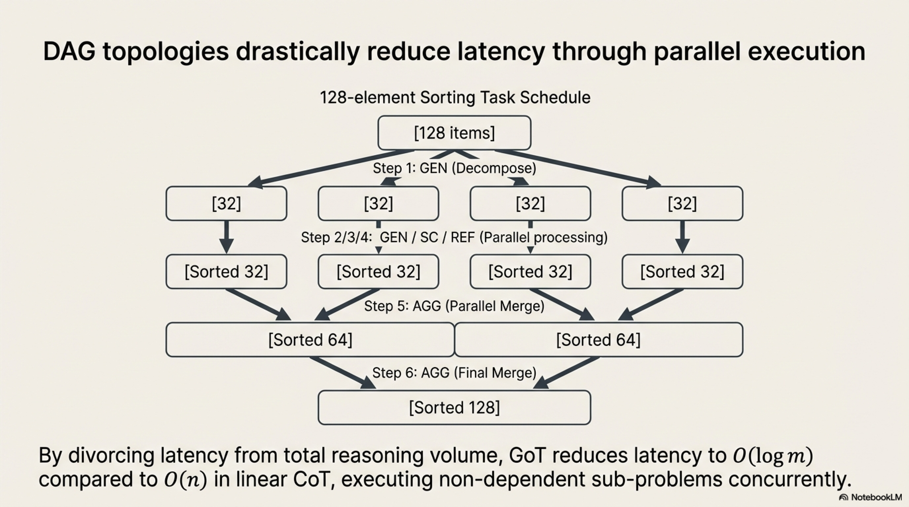

| **Step** | **Operation** | **Effect** |
|---|---|---|
| 1 | $\text{GEN}(v_0, 4)$ | Decompose list into 4 sub-lists of 32 elements |
| 2 | $\text{GEN}(\{v_1,v_2,v_3,v_4\}, 1)$ | Sort each sub-list independently (**parallelizable**) |
| 3 | $\text{SC}(\text{sorted sub-lists})$ | Verify each sub-list is correctly sorted |
| 4 | $\text{REF}(\text{failed vertices})$ | Re-sort any incorrectly sorted sub-lists |
| 5 | $\text{AGG}(\{v_5, v_6\})$, $\text{AGG}(\{v_7, v_8\})$ | Merge-sort pairs of sorted sub-lists (**parallelizable**) |
| 6 | $\text{AGG}(\{v_9, v_{10}\})$ | Final merge into complete sorted list |
| 7 | $\text{SC}(v_{11})$ | Verify final solution |

**Latency**: $O(\log m)$ where $m$ is the number of sub-problems (compared to $O(n)$ for CoT).

---

## 6. Unified Comparative Framework

### 6.1 Topological Hierarchy

$$
\underbrace{\text{IO}}_{\text{point}} \;\subset\; \underbrace{\text{CoT}}_{\text{path}} \;\subset\; \underbrace{\text{CoT-SC}}_{\text{parallel paths}} \;\subset\; \underbrace{\text{ToT}}_{\text{tree}} \;\subset\; \underbrace{\text{GoT}}_{\text{DAG}}
$$

### 6.2 Expressivity vs. Cost Tradeoff


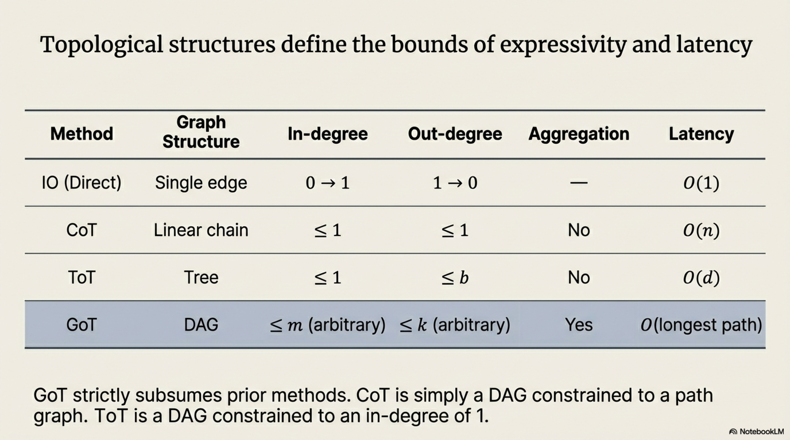


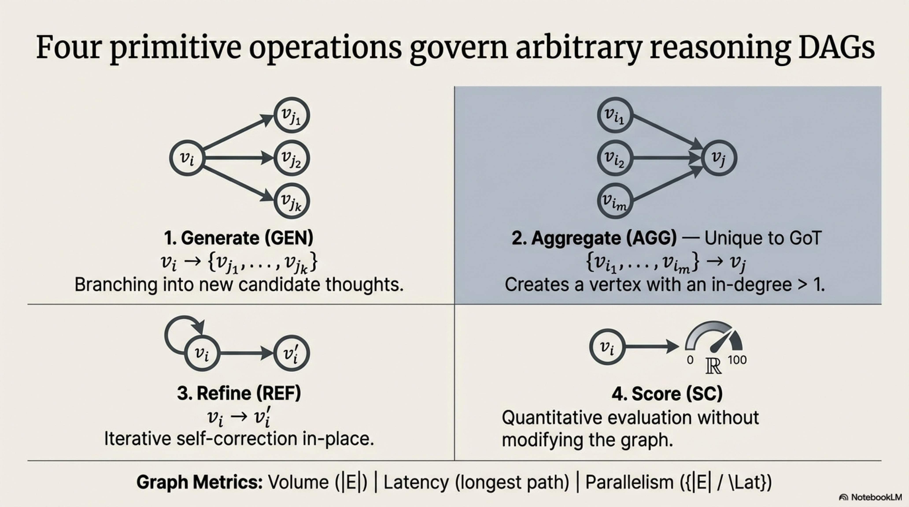

| **Method** | **Expressivity** | **LLM Calls** | **Latency** | **Error Recovery** | **Multi-Source Synthesis** |
|---|---|---|---|---|---|
| Direct (IO) | Minimal | $O(1)$ | $O(1)$ | None | No |
| CoT | Linear | $O(n)$ | $O(n)$ | None | No |
| CoT-SC | Linear + voting | $O(Kn)$ | $O(n)$ | Statistical (voting) | Terminal only |
| ToT | Branching + pruning | $O(Wbd)$ | $O(d)$ | Backtracking | No |
| GoT | Arbitrary DAG | $O(|V| + |E|)$ | $O(\text{longest path})$ | Refinement + backtracking | **Yes (AGG)** |

### 6.3 Decision Criteria for Method Selection


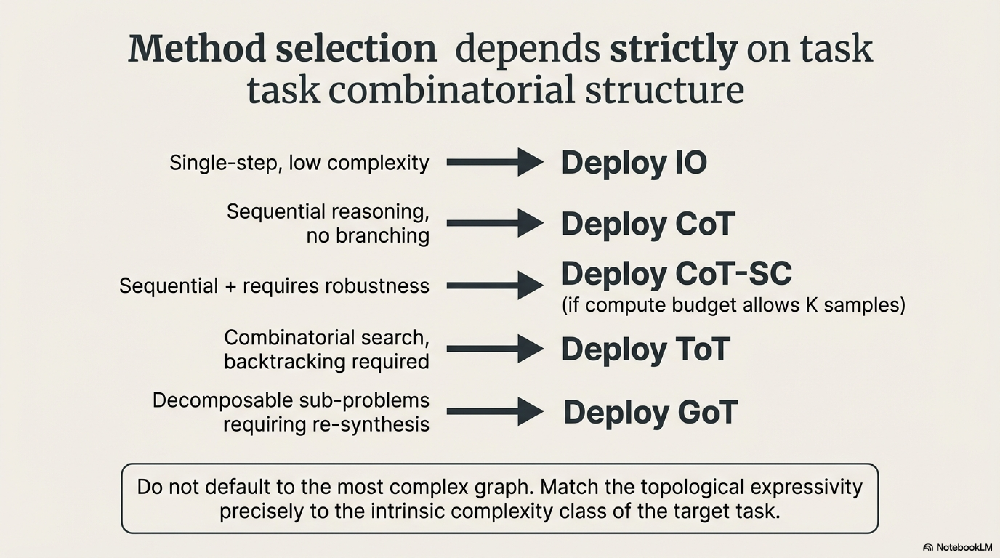


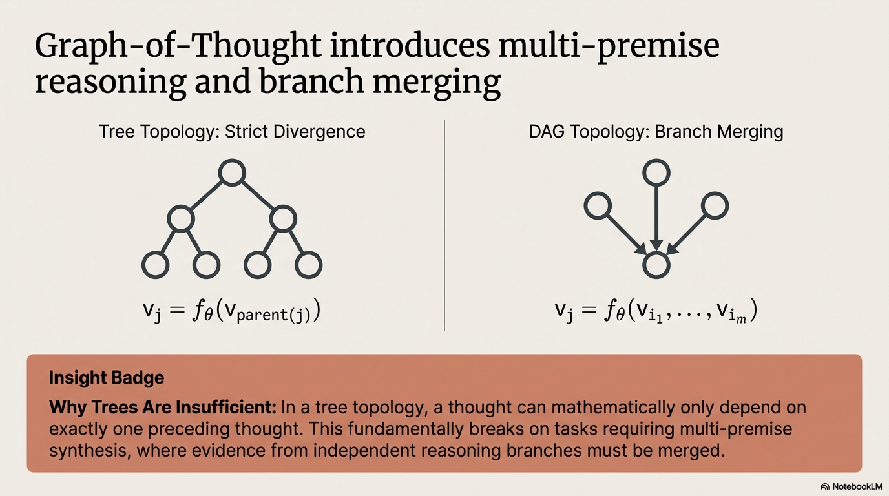


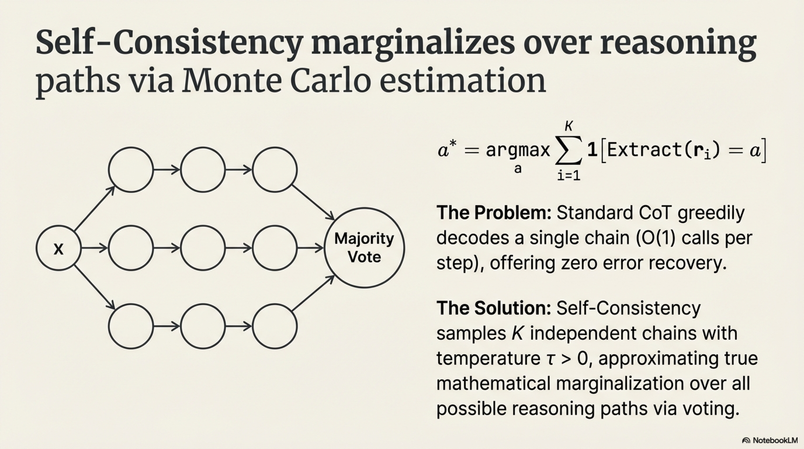

$$
\text{Method}^* = \begin{cases}
\text{IO} & \text{if task is single-step, low complexity} \\
\text{CoT} & \text{if task requires sequential reasoning, no branching} \\
\text{CoT-SC} & \text{if CoT + robustness needed, budget for } K \text{ samples} \\
\text{ToT} & \text{if task has combinatorial search structure, backtracking needed} \\
\text{GoT} & \text{if task is decomposable with independent sub-problems requiring re-synthesis}
\end{cases}
$$


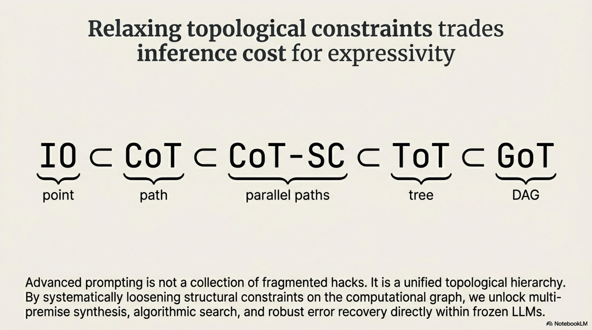


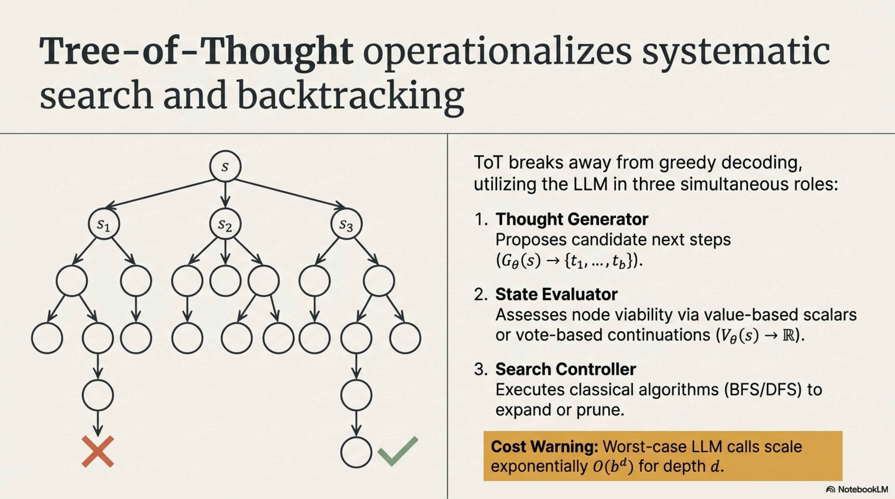


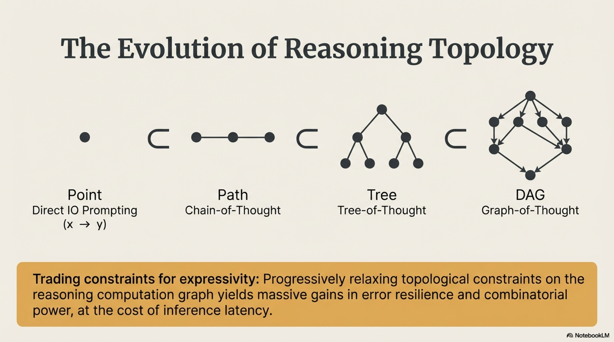

The fundamental insight across this progression: **each method progressively relaxes the topological constraints on the reasoning computation graph**, trading increased inference cost for greater expressivity and error resilience.
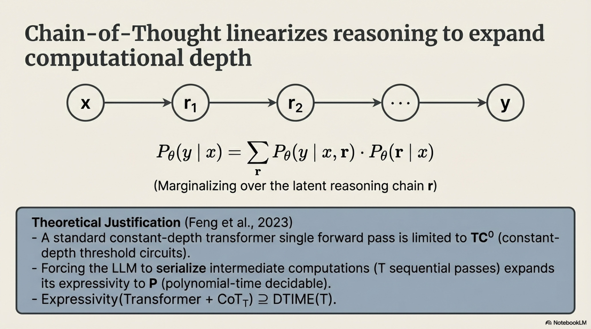

