# Advanced Topics in Large Language Models: A SOTA Treatment

---

## 1. Reasoning with LLMs

### 1.1 Definition


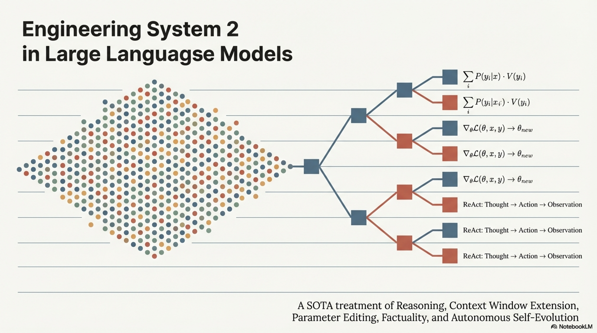

**Reasoning** in the context of LLMs refers to the capacity of a model $\mathcal{M}_\theta$ to derive new conclusions, intermediate inferences, or structured logical steps from given premises, moving beyond surface-level pattern matching to exhibit systematic, compositional, and verifiable multi-step inference. Formally, reasoning is the construction of a **proof trajectory** $\pi = (s_1, s_2, \dots, s_n)$ such that:

$$
\text{Given premises } \mathcal{P}, \quad s_1 \vdash s_2 \vdash \dots \vdash s_n = y
$$

where each $s_i$ follows from $\mathcal{P} \cup \{s_1, \dots, s_{i-1}\}$ under a (possibly implicit) inference rule, and $y$ is the final answer.


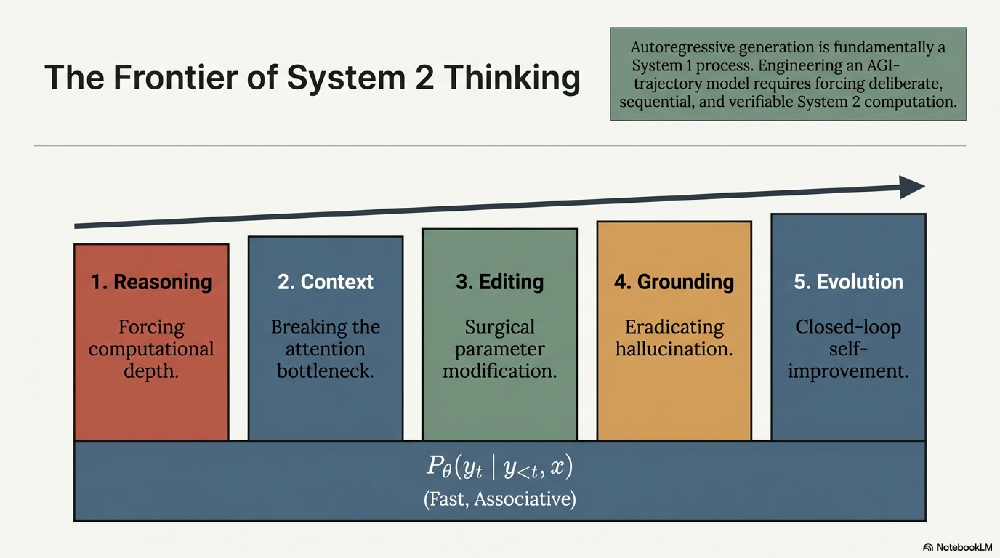

The fundamental tension: autoregressive LLMs model $P_\theta(y_t \mid y_{<t}, x)$ — a **System 1** (fast, associative) process. Reasoning demands **System 2** (slow, deliberate, sequential) computation. All reasoning-enhancement techniques attempt to bridge this gap.

### 1.2 Taxonomy of Reasoning Types

| Reasoning Type | Formal Characterization | Example |
|---|---|---|
| **Deductive** | $\mathcal{P} \models y$ (conclusion necessarily follows from premises) | Syllogisms, formal proofs |
| **Inductive** | $\text{Observations} \rightarrow \text{Generalization}$ (probable but not certain) | Pattern completion, rule discovery |
| **Abductive** | $y \rightarrow \text{Best explanation for } y$ | Diagnosis, hypothesis generation |
| **Analogical** | $\text{Relation}(A, B) \approx \text{Relation}(C, ?)$ | Proportional analogies |
| **Mathematical** | Symbolic manipulation under axioms | Algebra, calculus |
| **Commonsense** | Implicit world-knowledge inference | Physical intuition, social reasoning |
| **Causal** | $\text{do}(X = x) \rightarrow P(Y \mid \text{do}(X = x))$ | Intervention reasoning |

### 1.3 Chain-of-Thought (CoT) Reasoning

#### 1.3.1 Formal Definition

Standard prompting directly models $P_\theta(y \mid x)$. **Chain-of-Thought** introduces an explicit intermediate reasoning chain $r = (r_1, r_2, \dots, r_m)$:

$$
P_\theta(y \mid x) = \sum_{r} P_\theta(r \mid x) \cdot P_\theta(y \mid x, r)
$$

In practice, the sum is approximated by greedy or sampled decoding:

$$
\hat{r} = \arg\max_r P_\theta(r \mid x), \quad \hat{y} = \arg\max_y P_\theta(y \mid x, \hat{r})
$$

**Key insight**: by expanding the computation graph through intermediate tokens, the model gains access to an implicit "scratchpad" — effectively increasing its computational depth from $O(1)$ transformer forward passes to $O(m)$ serial reasoning steps.

#### 1.3.2 Theoretical Perspective

A transformer with $L$ layers and hidden dimension $d$ is a bounded computational device per forward pass. CoT circumvents this by chaining multiple forward passes:

$$
\text{Effective depth with CoT} = L \times m \quad \text{(vs. } L \text{ without CoT)}
$$


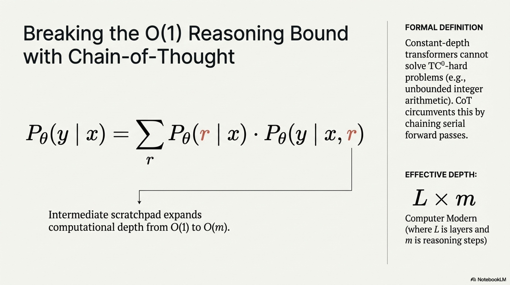

This connects to the result that **constant-depth transformers cannot solve $\text{TC}^0$-hard problems** (e.g., arithmetic on unbounded integers), but **autoregressive generation with intermediate steps** makes transformers Turing-complete in the limit.

#### 1.3.3 CoT Variants

| Variant | Mechanism | Formal Characterization |
|---|---|---|
| **Few-Shot CoT** | Exemplars with explicit reasoning | $P_\theta(r, y \mid x, \{(x_i, r_i, y_i)\}_{i=1}^k)$ |
| **Zero-Shot CoT** | Prompt trigger "Let's think step by step" | $P_\theta(r, y \mid x, \text{trigger})$ |
| **Auto-CoT** | Automatically generate diverse CoT exemplars via clustering | Cluster queries $\rightarrow$ generate CoT per cluster |
| **Faithful CoT** | Enforce that reasoning steps are logically valid | $\forall i: s_i \models_{\text{NLI}} s_{i+1}$ |
| **Program-of-Thought** | Generate executable code as reasoning trace | $r = \text{code}$, $y = \text{Execute}(r)$ |

### 1.4 Tree-of-Thought (ToT) Reasoning

#### 1.4.1 Formal Definition

ToT generalizes linear CoT to a **tree-structured search** over intermediate thought states. Define:

- **State space** $\mathcal{S}$: partial solution configurations
- **Thought generator** $G_\theta(s) \rightarrow \{s'_1, \dots, s'_b\}$: proposes $b$ successor states
- **State evaluator** $V_\theta(s) \rightarrow [0, 1]$: estimates the probability that state $s$ leads to a correct solution

The search problem becomes:

$$
y^* = \arg\max_{y} \max_{\pi: s_0 \rightsquigarrow y} \prod_{t=0}^{|\pi|-1} P_\theta(s_{t+1} \mid s_t) \cdot V_\theta(s_{t+1})
$$

#### 1.4.2 Search Strategies

**BFS-based ToT:**

$$
\mathcal{B}^{(t+1)} = \text{Top-}k_{s'} \left\{ V_\theta(s') : s' \in \bigcup_{s \in \mathcal{B}^{(t)}} G_\theta(s) \right\}
$$

where $\mathcal{B}^{(t)}$ is the beam at depth $t$.

**DFS-based ToT with pruning:**

Explore depth-first, backtrack when $V_\theta(s) < \delta_{\text{prune}}$.

**MCTS (Monte Carlo Tree Search) for LLM Reasoning:**

$$
\text{UCB1}(s, s') = \underbrace{\bar{Q}(s, s')}_{\text{exploitation}} + c \cdot \underbrace{\sqrt{\frac{\ln N(s)}{N(s')}}}_{\text{exploration}}
$$

where $\bar{Q}(s, s')$ is the average value of child state $s'$, $N(\cdot)$ is the visit count, and $c$ is the exploration constant.

### 1.5 Self-Consistency Decoding

Instead of greedy decoding a single chain, **sample** $n$ independent reasoning paths and aggregate via **majority voting**:

$$
\hat{y} = \arg\max_{y \in \mathcal{Y}} \sum_{i=1}^{n} \mathbb{1}\left[\text{Extract}(r^{(i)}) = y\right] \quad \text{where} \quad r^{(i)} \sim P_\theta(r \mid x)
$$

This marginalizes over diverse reasoning paths, yielding a more robust estimate:

$$
\hat{P}(y \mid x) = \frac{1}{n} \sum_{i=1}^{n} P_\theta(y \mid x, r^{(i)}) \cdot P_\theta(r^{(i)} \mid x)
$$


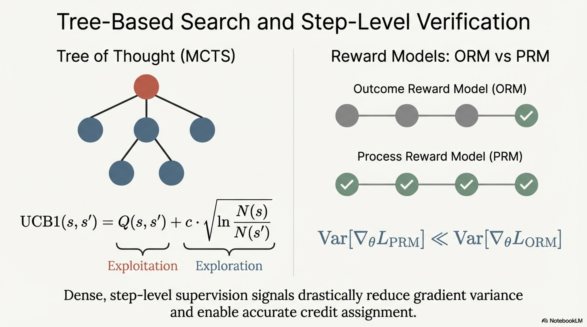

### 1.6 Process Reward Models (PRMs) vs. Outcome Reward Models (ORMs)

**ORM** provides reward only at the final answer:

$$
R_{\text{ORM}}(x, r, y) = \mathbb{1}[y = y^*]
$$

**PRM** provides **step-level** reward:

$$
R_{\text{PRM}}(x, r) = \prod_{i=1}^{m} P_{\text{PRM}}(\text{correct} \mid x, r_1, \dots, r_i)
$$

PRMs enable **credit assignment** to individual reasoning steps and are critical for training reasoning models via RLHF/RLVR (Reinforcement Learning from Verifiable Rewards).

**Advantage of PRM:**

$$
\text{Var}\left[\nabla_\theta \mathcal{L}_{\text{PRM}}\right] \ll \text{Var}\left[\nabla_\theta \mathcal{L}_{\text{ORM}}\right]
$$

Lower gradient variance due to denser supervision signals.

### 1.7 Pseudoalgorithm: Tree-of-Thought with MCTS

```
ALGORITHM: TreeOfThought_MCTS
─────────────────────────────────────────────────────
INPUT:
    x              : problem statement
    M_θ            : LLM (thought generator + evaluator)
    b              : branching factor (thoughts per state)
    max_iterations : MCTS simulation budget
    max_depth      : maximum reasoning depth
    c              : UCB exploration constant

OUTPUT:
    y              : best answer found
    π_best         : best reasoning trajectory

 1. // Initialize root node
 2. root ← CreateNode(state = x, parent = NULL, depth = 0)
 3. 
 4. FOR iter = 1 TO max_iterations DO
 5.     // === SELECTION: traverse tree using UCB1 ===
 6.     node ← root
 7.     WHILE node is fully expanded AND node.depth < max_depth DO
 8.         node ← argmax_{child ∈ node.children} UCB1(node, child, c)
 9.         // UCB1(p,ch,c) = Q̄(ch)/N(ch) + c·√(ln(N(p))/N(ch))
10.     END WHILE
11.     
12.     // === EXPANSION: generate new thought states ===
13.     IF node.depth < max_depth AND NOT IsTerminal(node.state) THEN
14.         new_thoughts ← M_θ.generate_thoughts(node.state, b)
15.         // Each thought extends the reasoning chain
16.         FOR EACH thought_j ∈ new_thoughts DO
17.             child_j ← CreateNode(
18.                 state = node.state ⊕ thought_j,
19.                 parent = node,
20.                 depth = node.depth + 1
21.             )
22.             node.children ← node.children ∪ {child_j}
23.         END FOR
24.         // Select one child for simulation
25.         node ← RandomSelect(node.children)
26.     END IF
27.     
28.     // === SIMULATION: rollout from selected node ===
29.     sim_state ← node.state
30.     FOR d = node.depth TO max_depth DO
31.         IF IsTerminal(sim_state) THEN BREAK
32.         next_thought ← M_θ.generate_thoughts(sim_state, 1)[0]
33.         sim_state ← sim_state ⊕ next_thought
34.     END FOR
35.     
36.     // === EVALUATION ===
37.     value ← M_θ.evaluate_state(sim_state)
38.     // value ∈ [0,1]: estimated probability of reaching correct answer
39.     // Can also use PRM: value = Π_i PRM(step_i)
40.     
41.     // === BACKPROPAGATION ===
42.     current ← node
43.     WHILE current ≠ NULL DO
44.         current.N ← current.N + 1
45.         current.Q ← current.Q + value
46.         current ← current.parent
47.     END WHILE
48. END FOR
49. 
50. // === EXTRACT BEST PATH ===
51. π_best ← ∅ ; node ← root
52. WHILE node.children ≠ ∅ DO
53.     node ← argmax_{child ∈ node.children} Q̄(child)
54.     π_best ← π_best ∥ node.thought
55. END WHILE
56. y ← ExtractAnswer(π_best)
57. 
58. RETURN y, π_best
```

### 1.8 Pseudoalgorithm: Self-Consistency with CoT

```
ALGORITHM: SelfConsistencyCoT
─────────────────────────────────────────────────────
INPUT:
    x           : problem / query
    M_θ         : LLM
    n           : number of sampled reasoning paths
    τ           : sampling temperature (τ > 0, typically 0.5–0.8)
    prompt_cot  : CoT prompt template (zero-shot or few-shot)

OUTPUT:
    y_final     : majority-voted answer
    confidence  : fraction of paths agreeing with y_final
    paths       : all sampled (reasoning, answer) pairs

 1. paths ← ∅
 2. answers ← ∅
 3. 
 4. FOR i = 1 TO n DO
 5.     // Sample diverse reasoning path with temperature τ
 6.     r_i ← M_θ.generate(prompt_cot ∥ x, temperature=τ)
 7.     y_i ← ExtractFinalAnswer(r_i)
 8.     paths ← paths ∪ {(r_i, y_i)}
 9.     answers ← answers ∪ {y_i}
10. END FOR
11. 
12. // === MAJORITY VOTE ===
13. vote_counts ← CountFrequency(answers)
14. y_final ← argmax_y vote_counts[y]
15. confidence ← vote_counts[y_final] / n
16. 
17. // === OPTIONAL: WEIGHTED VOTING by path probability ===
18. // y_final ← argmax_y Σ_i 1[y_i = y] · P_θ(r_i | x)
19. 
20. RETURN y_final, confidence, paths
```

---

## 2. Handling Long Context

### 2.1 Definition

**Long-context handling** addresses the fundamental constraint that standard transformers have $O(n^2)$ attention complexity in sequence length $n$, making processing of sequences with $n \gg L_{\text{train}}$ (where $L_{\text{train}}$ is the training context length) computationally prohibitive and representationally degraded. The goal is to extend the **effective context window** $L_{\text{eff}}$ such that:

$$
L_{\text{eff}} \gg L_{\text{train}}, \quad \text{while preserving:} \quad \text{PPL}(x_{1:L_{\text{eff}}}) \approx \text{PPL}(x_{1:L_{\text{train}}})
$$

and maintaining faithful information retrieval from **any position** within the extended context.

### 2.2 The Attention Bottleneck

Standard self-attention for a sequence of length $n$:

$$
\text{Attention}(Q, K, V) = \text{softmax}\!\left(\frac{QK^\top}{\sqrt{d_k}}\right) V
$$

- **Time complexity**: $O(n^2 \cdot d_k)$
- **Space complexity**: $O(n^2)$ for the attention matrix
- **Position encoding brittleness**: absolute positional embeddings fail to generalize beyond $L_{\text{train}}$

### 2.3 Positional Encoding for Length Generalization

#### 2.3.1 Rotary Position Embedding (RoPE)

RoPE encodes position via rotation matrices applied to query-key pairs:

$$
f_{\text{RoPE}}(\mathbf{x}_m, m) = \mathbf{x}_m \otimes e^{im\boldsymbol{\Theta}}
$$

where $\boldsymbol{\Theta} = (\theta_1, \dots, \theta_{d/2})$ with:

$$
\theta_j = \text{base}^{-2j/d}, \quad \text{base} = 10000 \text{ (default)}
$$

The attention score between positions $m$ and $n$ depends only on the **relative distance** $m - n$:

$$
\langle f_{\text{RoPE}}(\mathbf{q}_m, m), f_{\text{RoPE}}(\mathbf{k}_n, n) \rangle = g(\mathbf{q}_m, \mathbf{k}_n, m - n)
$$

**Problem**: When $m - n > L_{\text{train}}$, the rotational angles enter unseen frequency regimes, causing degraded attention patterns.

#### 2.3.2 Position Interpolation (PI)

Linearly compress positions to fit within the trained range:

$$
f_{\text{PI}}(\mathbf{x}_m, m) = f_{\text{RoPE}}\!\left(\mathbf{x}_m, \frac{m \cdot L_{\text{train}}}{L_{\text{target}}}\right)
$$

Compression ratio: $\alpha = L_{\text{train}} / L_{\text{target}}$

**Trade-off**: preserves relative order but **increases local positional density**, requiring fine-tuning to recalibrate attention.

#### 2.3.3 NTK-Aware Interpolation

Instead of uniform compression, scale the frequency **base** of RoPE:

$$
\text{base}' = \text{base} \cdot \alpha^{d/(d-2)}
$$

This preserves **high-frequency** components (local attention) while only stretching **low-frequency** components (long-range), based on the Neural Tangent Kernel insight that different frequency bands have different sensitivity profiles.

#### 2.3.4 YaRN (Yet another RoPE extensioN)

Combines NTK-aware scaling with **attention temperature scaling** and partitions dimensions into three groups:

$$
\theta'_j = \begin{cases}
\theta_j & \text{if } \lambda_j < \lambda_{\text{low}} \quad \text{(no interpolation)} \\
\theta_j / \alpha & \text{if } \lambda_j > \lambda_{\text{high}} \quad \text{(full interpolation)} \\
(1 - \gamma_j) \cdot \theta_j / 1 + \gamma_j \cdot \theta_j / \alpha & \text{otherwise (ramp)}
\end{cases}
$$

where $\lambda_j = 2\pi / \theta_j$ is the wavelength for dimension $j$ and $\gamma_j$ is a smooth interpolation factor.

Additionally applies an attention temperature correction:

$$
\text{Attention}'(Q, K, V) = \text{softmax}\!\left(\frac{QK^\top}{\sqrt{d_k} \cdot t}\right) V, \quad t = 0.1 \ln(\alpha) + 1
$$

### 2.4 Efficient Attention Architectures

| Method | Complexity | Mechanism |
|---|---|---|
| **Sparse Attention** (BigBird, Longformer) | $O(n \sqrt{n})$ or $O(n \cdot w)$ | Local window + global tokens + random |
| **Linear Attention** (Performer, RWKV) | $O(n \cdot d^2)$ | Kernel approximation: $\phi(Q)\phi(K)^\top V$ |
| **Flash Attention** | $O(n^2)$ time, $O(n)$ memory | IO-aware tiling, exact attention |
| **Ring Attention** | Scales to arbitrary $n$ across devices | Distributed blockwise attention with overlap |
| **Multi-Scale Attention** | $O(n \log n)$ | Hierarchical token grouping |

#### 2.4.1 Flash Attention: IO-Complexity Analysis

Standard attention requires $O(n^2)$ HBM reads/writes (dominated by materializing the $n \times n$ attention matrix). Flash Attention tiles the computation:

$$
\text{HBM accesses} = O\!\left(\frac{n^2 d}{M}\right)
$$

where $M$ is SRAM size. By performing softmax reduction **within tiles** using the online softmax trick:

$$
m^{(j)} = \max(m^{(j-1)}, \tilde{m}^{(j)}), \quad \ell^{(j)} = e^{m^{(j-1)} - m^{(j)}} \ell^{(j-1)} + e^{\tilde{m}^{(j)} - m^{(j)}} \tilde{\ell}^{(j)}
$$

No $n \times n$ matrix is ever materialized in HBM, achieving **exact** attention with wall-clock speedups of 2–4×.

#### 2.4.2 Ring Attention for Sequence Parallelism

Distribute the sequence across $P$ devices, each holding a block of length $n/P$. Each device:
1. Holds its local $Q$ block permanently
2. Receives $K, V$ blocks circularly from other devices
3. Computes **blockwise attention** with running softmax normalization
4. Overlaps communication with computation

$$
\text{Per-device memory} = O\!\left(\frac{n}{P} \cdot d\right), \quad \text{Communication rounds} = P - 1
$$

This enables sequences of **millions of tokens** by scaling across devices.

### 2.5 Context Compression Techniques

When extending context length is infeasible, **compress** the context:

#### 2.5.1 Landmark / Sink Tokens

**Attention Sinks**: The first few tokens accumulate disproportionate attention mass regardless of content. Preserve these "sink tokens" when evicting from the KV cache:

$$
\text{KV-Cache} = \text{Sink}(x_{1:\ell}) \oplus \text{Window}(x_{n-w:n})
$$

where $\ell$ is the number of sink tokens and $w$ is the sliding window size.

#### 2.5.2 KV-Cache Compression

For a model generating token $t$, the full KV cache is $\{(K_i, V_i)\}_{i=1}^{t-1}$, growing as $O(t \cdot L \cdot d)$ across $L$ layers. Compression strategies:

- **Eviction policies**: Remove KV entries with lowest cumulative attention weight:

$$
\text{Importance}(i) = \sum_{\ell=1}^{L} \sum_{h=1}^{H} \sum_{t'=i}^{t} \alpha_{t',i}^{(\ell, h)}
$$

- **Quantization**: Reduce KV precision from FP16 to INT4/INT8:

$$
\hat{K} = \text{Quantize}_{b}(K), \quad \text{Error} = \|K - \hat{K}\|_F
$$

- **Token merging**: Merge similar KV entries:

$$
K_{\text{merged}} = \frac{\sum_{i \in \mathcal{C}} w_i K_i}{\sum_{i \in \mathcal{C}} w_i}
$$

where $\mathcal{C}$ is a cluster of similar keys.

### 2.6 Retrieval-Augmented Context Window

Rather than fitting all context into the window, **retrieve** relevant segments on demand:

$$
\text{Context}_t = \text{Retrieve}(q_t, \mathcal{M}_{\text{long-term}}) \oplus \text{Window}(x_{t-w:t})
$$

This is essentially **RAG applied to the model's own extended input**.

### 2.7 The "Lost in the Middle" Problem

Empirically, LLMs exhibit a **U-shaped retrieval curve**: information at the **beginning** and **end** of the context is accurately retrieved, while information in the **middle** is systematically ignored. Formally:

$$
P(\text{correct} \mid \text{position } p) \propto \begin{cases}
\text{high} & p \approx 1 \text{ or } p \approx L \\
\text{low} & p \approx L/2
\end{cases}
$$

**Mitigations**: attention bias regularization, position-aware training, randomized document ordering during fine-tuning.

### 2.8 Pseudoalgorithm: Adaptive Long-Context Inference

```
ALGORITHM: AdaptiveLongContextInference
─────────────────────────────────────────────────────
INPUT:
    x                : input sequence of length n
    M_θ              : LLM with trained context length L_train
    L_max            : maximum hardware-feasible context
    strategy         : {rope_extension, compression, hierarchical}
    extension_params : {method, scale_factor, fine_tune_steps}

OUTPUT:
    y                : generated response
    attn_diagnostics : attention entropy and coverage statistics


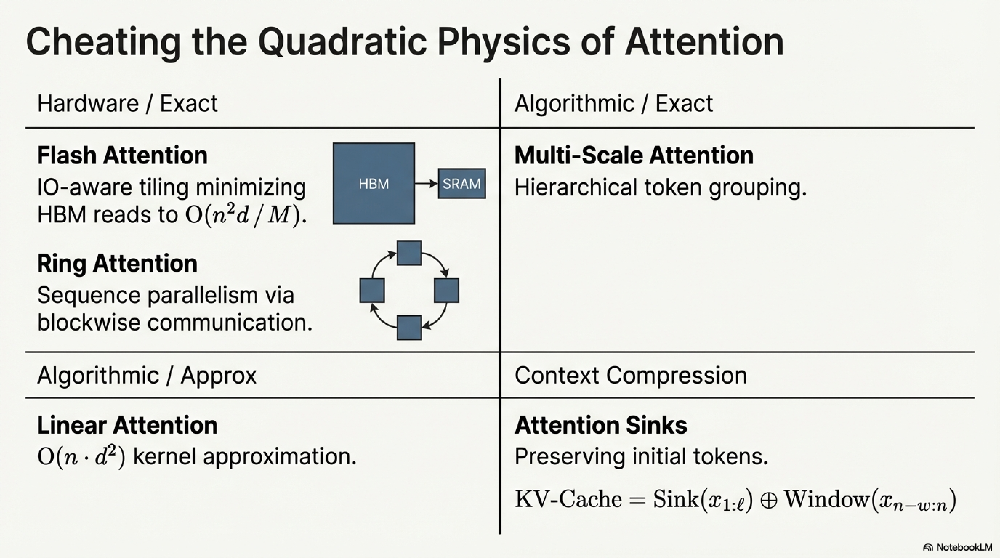


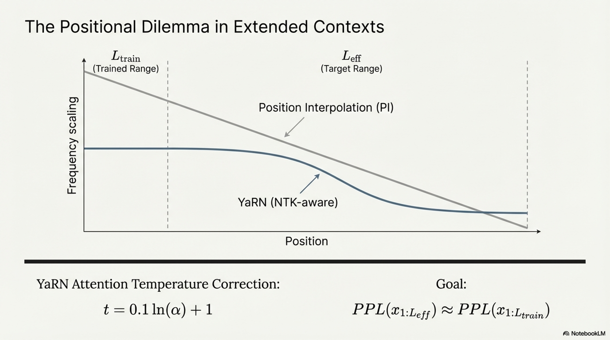

 1. // === DETERMINE CONTEXT HANDLING STRATEGY ===
 2. IF n ≤ L_train THEN
 3.     // No special handling needed
 4.     y ← M_θ.generate(x)
 5.     RETURN y
 6. END IF
 7.
 8. IF strategy = rope_extension THEN
 9.     // === POSITIONAL ENCODING EXTENSION ===
10.     α ← n / L_train                         // scale factor
11.     IF extension_params.method = "PI" THEN
12.         // Position Interpolation
13.         FOR EACH layer ℓ IN M_θ DO
14.             ∀ position m: m' ← m / α         // compress positions
15.             Apply RoPE with m' instead of m
16.         END FOR
17.     ELSE IF extension_params.method = "YaRN" THEN
18.         // YaRN: dimension-dependent scaling
19.         FOR EACH RoPE dimension j DO
20.             λ_j ← 2π / θ_j                   // wavelength
21.             IF λ_j < λ_low THEN θ'_j ← θ_j   // keep high-freq
22.             ELSE IF λ_j > λ_high THEN θ'_j ← θ_j / α  // interpolate
23.             ELSE θ'_j ← ramp(θ_j, α, γ_j)    // smooth blend
24.             END IF
25.         END FOR
26.         t_attn ← 0.1 · ln(α) + 1             // temperature correction
27.         Modify attention: softmax(QK^T / (√d_k · t_attn))
28.     END IF
29.     y ← M_θ.generate(x)
30.
31. ELSE IF strategy = compression THEN
32.     // === KV-CACHE COMPRESSION ===
33.     kv_budget ← L_max                        // max KV entries to retain
34.     sink_tokens ← x[1 : ℓ_sink]              // preserve attention sinks
35.     
36.     // Process in chunks
37.     chunks ← Partition(x, chunk_size = L_train / 2)
38.     kv_cache ← ∅
39.     
40.     FOR EACH chunk_i ∈ chunks DO
41.         // Forward pass, accumulate KV cache
42.         kv_new ← M_θ.encode(chunk_i, existing_kv=kv_cache)
43.         kv_cache ← kv_cache ∪ kv_new
44.         
45.         // Evict if over budget
46.         IF |kv_cache| > kv_budget THEN
47.             // Compute importance scores
48.             FOR EACH entry (K_j, V_j) ∈ kv_cache DO
49.                 importance_j ← CumulativeAttentionWeight(j)
50.             END FOR
51.             // Retain sinks + top entries + recent window
52.             kv_cache ← sink_tokens_kv
53.                        ∪ TopByImportance(kv_cache, kv_budget - ℓ_sink - w)
54.                        ∪ RecentWindow(kv_cache, w)
55.         END IF
56.     END FOR
57.     y ← M_θ.generate_from_kv(kv_cache, query)
58.
59. ELSE IF strategy = hierarchical THEN
60.     // === HIERARCHICAL SUMMARIZE-THEN-ATTEND ===
61.     segments ← Partition(x, segment_size = L_train / 2)
62.     summaries ← ∅
63.     FOR EACH seg_i ∈ segments DO
64.         summary_i ← M_θ.generate("Summarize key information: " ∥ seg_i)
65.         summaries ← summaries ∪ {summary_i}
66.     END FOR
67.     compressed_context ← Concatenate(summaries)
68.     
69.     // If still too long, recurse
70.     IF |compressed_context| > L_train THEN
71.         compressed_context ← AdaptiveLongContextInference(
72.             compressed_context, M_θ, L_max, "hierarchical")
73.     END IF
74.     y ← M_θ.generate(compressed_context ∥ query)
75. END IF
76.
77. // === DIAGNOSTICS ===
78. attn_diagnostics ← ComputeAttentionEntropy(M_θ)
79. // Flag if middle-context attention is anomalously low
80. IF attn_diagnostics.middle_coverage < δ_threshold THEN
81.     WARN("Potential lost-in-the-middle effect detected")
82. END IF
83.
84. RETURN y, attn_diagnostics
```

---

## 3. Model Editing

### 3.1 Definition

**Model Editing** is the targeted modification of a pretrained model's behavior on specific inputs **without** retraining from scratch, formally defined as follows. Given a model $\mathcal{M}_\theta$ and an **edit descriptor** $e = (x_e, y_e^{\text{old}}, y_e^{\text{new}})$ specifying that input $x_e$ should produce $y_e^{\text{new}}$ instead of the current $y_e^{\text{old}}$, the editing operation $\mathcal{E}$ produces:

$$
\theta' = \mathcal{E}(\theta, e) \quad \text{such that:}
$$

$$
\begin{aligned}
&\textbf{Reliability:} \quad P_{\theta'}(y_e^{\text{new}} \mid x_e) \gg P_\theta(y_e^{\text{old}} \mid x_e) \\
&\textbf{Generalization:} \quad \forall x' \in \mathcal{N}(x_e): \; P_{\theta'}(y_e^{\text{new}} \mid x') \text{ is high} \\
&\textbf{Locality:} \quad \forall x \notin \mathcal{N}(x_e): \; P_{\theta'}(y \mid x) \approx P_\theta(y \mid x)
\end{aligned}
$$

where $\mathcal{N}(x_e)$ is the **semantic neighborhood** of $x_e$ (paraphrases, entailed queries).

### 3.2 Desiderata for Model Editing

| Criterion | Formal Requirement | Metric |
|---|---|---|
| **Reliability** (Efficacy) | $P_{\theta'}(y_e^{\text{new}} \mid x_e) \geq 1 - \epsilon$ | Edit success rate |
| **Generalization** (Portability) | $\mathbb{E}_{x' \in \mathcal{N}(x_e)}[P_{\theta'}(y_e^{\text{new}} \mid x')] \geq 1 - \delta$ | Paraphrase accuracy |
| **Locality** (Specificity) | $D_{\text{KL}}\!\left(P_{\theta'}(\cdot \mid x_{\text{unrelated}}) \| P_\theta(\cdot \mid x_{\text{unrelated}})\right) \leq \eta$ | Neighborhood accuracy |
| **Composability** | Multiple sequential edits $e_1, \dots, e_m$ remain jointly effective | Multi-edit consistency |
| **Efficiency** | $\text{Time}(\mathcal{E}) \ll \text{Time}(\text{Fine-tuning on full } \mathcal{D})$ | Wall-clock time, FLOPs |

### 3.3 Knowledge Localization Hypothesis

The foundational assumption behind locate-and-edit methods:


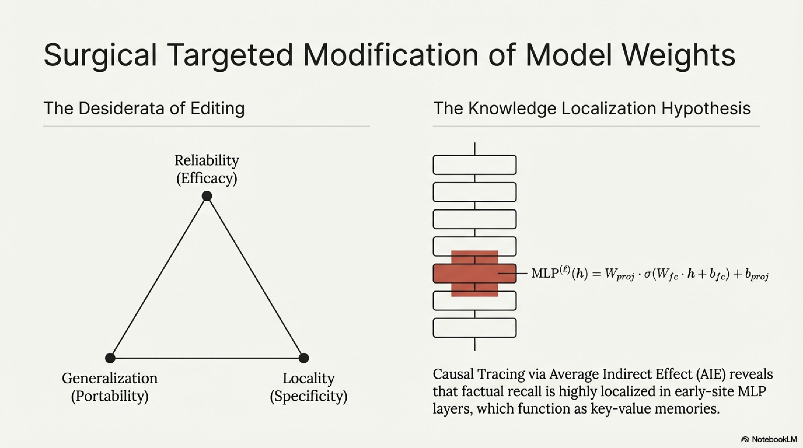

> Factual knowledge is stored in **identifiable, localized** subsets of parameters, particularly in the **MLP layers** of transformers, which function as key-value memories.

Formally, the MLP in layer $\ell$ computes:

$$
\text{MLP}^{(\ell)}(\mathbf{h}) = W_{\text{proj}}^{(\ell)} \cdot \sigma\!\left(W_{\text{fc}}^{(\ell)} \cdot \mathbf{h} + \mathbf{b}_{\text{fc}}^{(\ell)}\right) + \mathbf{b}_{\text{proj}}^{(\ell)}
$$

**Causal Tracing** (from the ROME paper) identifies which layers and positions are causally responsible for a factual prediction:

1. Run clean forward pass, record all hidden states $\mathbf{h}^{(\ell)}_i$
2. Corrupt the subject tokens (e.g., add Gaussian noise)
3. Systematically **restore** clean hidden states at each $(i, \ell)$ and measure recovery of the correct prediction
4. The **causal effect** of restoring position $i$, layer $\ell$:

$$
\text{AIE}(i, \ell) = P_{\text{restored}(i,\ell)}(y_e) - P_{\text{corrupted}}(y_e)
$$

Empirical finding: **early-site MLP layers** at the last subject token position show highest AIE, confirming factual recall localization.

### 3.4 Taxonomy of Model Editing Methods

#### 3.4.1 Meta-Learning Based: MEND

**MEND** (Mitchell et al.) trains a **hypernetwork** $g_\psi$ that transforms a standard fine-tuning gradient into a targeted edit:

$$
\Delta\theta = g_\psi(\nabla_\theta \mathcal{L}(x_e, y_e^{\text{new}}))
$$

$$
\theta' = \theta + \Delta\theta
$$

The hypernetwork is trained to minimize:

$$
\mathcal{L}_{\text{MEND}} = \underbrace{\mathcal{L}_{\text{edit}}(\theta + \Delta\theta, x_e, y_e^{\text{new}})}_{\text{reliability}} + \lambda \underbrace{\mathcal{L}_{\text{loc}}(\theta + \Delta\theta, \mathcal{D}_{\text{loc}})}_{\text{locality}}
$$

#### 3.4.2 Locate-and-Edit: ROME


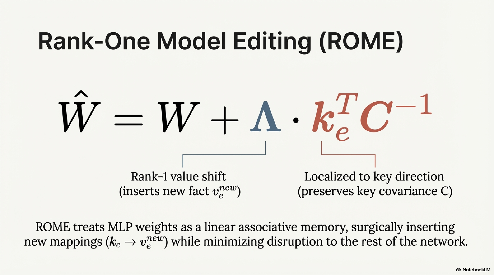

**ROME** (Rank-One Model Editing) treats MLP weights as a linear associative memory:

$$
W \mathbf{k}_e = \mathbf{v}_e^{\text{new}} \quad \text{(desired association)}
$$

To insert a new fact $(k_e \rightarrow v_e^{\text{new}})$ while preserving existing mappings, ROME solves:

$$
\hat{W} = W + \frac{(\mathbf{v}_e^{\text{new}} - W\mathbf{k}_e) \mathbf{k}_e^\top C^{-1}}{\mathbf{k}_e^\top C^{-1} \mathbf{k}_e}
$$

where $C = \mathbb{E}[\mathbf{k}\mathbf{k}^\top]$ is the **key covariance matrix** estimated from a sample of inputs. This is a rank-one update:

$$
\hat{W} = W + \underbrace{\boldsymbol{\Lambda}}_{\text{rank-1 value shift}} \cdot \underbrace{\mathbf{k}_e^\top C^{-1}}_{\text{localized to key direction}}
$$

#### 3.4.3 MEMIT (Mass-Editing Memory in a Transformer)

Generalizes ROME to **batch editing** across multiple layers. Given edits $\{(k_i, v_i^{\text{new}})\}_{i=1}^m$ distributed across layers $\mathcal{L}_{\text{edit}}$:

$$
\hat{W}^{(\ell)} = W^{(\ell)} + R^{(\ell)} \left(K^{(\ell)}\right)^\top \left(K^{(\ell)} \left(K^{(\ell)}\right)^\top + \lambda_{\text{reg}} I\right)^{-1}
$$

where $R^{(\ell)}$ is the residual error matrix assigned to layer $\ell$ via an equitable distribution across the critical path.

#### 3.4.4 In-Context Editing (IKE)

No parameter modification. Instead, prepend the edit as in-context knowledge:

$$
P_\theta(y \mid \text{"Fact: } x_e \rightarrow y_e^{\text{new}}\text{. Query: } x\text{"})
$$

**Advantage**: zero parameter change, fully reversible.
**Disadvantage**: consumes context window, fragile under rephrasing.

#### 3.4.5 Additional-Parameter Methods: GRACE, T-Patcher

Add small **adapter modules** or **neuron patches** that activate only for edited inputs:

$$
\hat{\mathbf{h}}^{(\ell)} = \mathbf{h}^{(\ell)} + \underbrace{A^{(\ell)}(\mathbf{h}^{(\ell)})}_{\text{adapter, activated only for } x \in \mathcal{N}(x_e)}
$$

### 3.5 Pseudoalgorithm: ROME (Rank-One Model Editing)

```
ALGORITHM: ROME_Edit
─────────────────────────────────────────────────────
INPUT:
    M_θ             : pretrained LLM
    e = (s, r, o_old, o_new) : edit fact (subject, relation, old_object, new_object)
                               e.g., ("Eiffel Tower", "located in", "Paris", "London")
    ℓ*              : target MLP layer (identified via causal tracing)
    D_sample        : sample of diverse prompts for covariance estimation
    λ_reg           : regularization coefficient

OUTPUT:
    M_θ'            : edited model with updated weights at layer ℓ*

 1. // === STEP 1: CAUSAL TRACING (identify critical layer) ===
 2. IF ℓ* not provided THEN
 3.     FOR EACH layer ℓ = 1 TO L DO
 4.         FOR EACH token position i in subject tokens DO
 5.             aie(i, ℓ) ← CausalTrace(M_θ, e, i, ℓ)
 6.             // corrupt subject → restore h_i^(ℓ) → measure P(o_old) recovery
 7.         END FOR
 8.     END FOR
 9.     ℓ* ← argmax_{ℓ} max_i aie(i, ℓ)
10. END IF

11. // === STEP 2: COMPUTE KEY VECTOR k_e ===
12. // The key is the input to MLP at layer ℓ* at the last subject token
13. h_subject ← M_θ.forward(prompt_with_subject, return_hidden=ℓ*, position=last_subject)
14. k_e ← h_subject    // ∈ ℝ^d

15. // === STEP 3: ESTIMATE KEY COVARIANCE C ===
16. C ← 0_{d×d}
17. FOR EACH prompt p ∈ D_sample DO
18.     k_p ← M_θ.forward(p, return_hidden=ℓ*, position=random)
19.     C ← C + k_p · k_p^T
20. END FOR
21. C ← C / |D_sample| + λ_reg · I    // regularized covariance

22. // === STEP 4: COMPUTE NEW VALUE VECTOR v_e^new ===
23. // Optimize: find v* such that inserting it at layer ℓ* causes model to output o_new
24. v ← W_proj^(ℓ*) · σ(W_fc^(ℓ*) · k_e)    // current value
25. v_target ← Optimize v* to minimize:
26.     L(v*) = −log P_{M_θ[h_ℓ* ← v*]}(o_new | prompt(s, r))
27.     // i.e., substitute v* at layer ℓ* and maximize P(o_new)
28.     // Solved via gradient descent on v* (not on θ)
29.     v* ← v
30.     FOR step = 1 TO T_optim DO
31.         grad ← ∇_{v*} L(v*)
32.         v* ← v* − η · grad
33.     END FOR
34.     v_e_new ← v*

35. // === STEP 5: RANK-ONE WEIGHT UPDATE ===
36. Δ ← (v_e_new − W_proj^(ℓ*) · σ(W_fc^(ℓ*) · k_e))    // value residual
37. u ← C^{-1} · k_e / (k_e^T · C^{-1} · k_e)              // localized key direction
38. W_proj'^(ℓ*) ← W_proj^(ℓ*) + Δ · u^T                   // rank-one update

39. // === STEP 6: VERIFICATION ===
40. M_θ' ← M_θ with W_proj^(ℓ*) replaced by W_proj'^(ℓ*)
41. ASSERT P_{M_θ'}(o_new | prompt(s, r)) > 0.9              // reliability
42. ASSERT P_{M_θ'}(o_new | paraphrase(s, r)) > 0.8          // generalization
43. ASSERT |PPL_{M_θ'}(D_unrelated) − PPL_{M_θ}(D_unrelated)| < ε  // locality

44. RETURN M_θ'
```

### 3.6 Evaluation Protocol for Model Editing

$$
\text{EditScore} = \frac{1}{3}\left(\underbrace{\text{ES}(x_e)}_{\text{efficacy}} + \underbrace{\text{PS}(\mathcal{N}(x_e))}_{\text{paraphrase}} + \underbrace{\text{NS}(\mathcal{D}_{\text{unrel}})}_{\text{neighborhood}}\right)
$$

where:

$$
\text{ES}(x_e) = \mathbb{1}\!\left[\arg\max_y P_{\theta'}(y \mid x_e) = y_e^{\text{new}}\right]
$$

$$
\text{PS}(\mathcal{N}) = \frac{1}{|\mathcal{N}|}\sum_{x' \in \mathcal{N}} \mathbb{1}\!\left[\arg\max_y P_{\theta'}(y \mid x') = y_e^{\text{new}}\right]
$$

$$
\text{NS}(\mathcal{D}_{\text{unrel}}) = \frac{1}{|\mathcal{D}_{\text{unrel}}|}\sum_{x \in \mathcal{D}_{\text{unrel}}} \mathbb{1}\!\left[\arg\max_y P_{\theta'}(y \mid x) = \arg\max_y P_\theta(y \mid x)\right]
$$

---

## 4. Hallucination: Causes & Mitigation

### 4.1 Definition

**Hallucination** in LLMs is the generation of content $y$ that is **unfaithful** to the source input, **inconsistent** with world knowledge, or **fabricated** without grounding — formally:

$$
\text{Hallucination}(y, x, \mathcal{W}) = \{s \in \text{Claims}(y) : s \notin \text{Entailed}(x) \cup \text{Entailed}(\mathcal{W})\}
$$

where $\mathcal{W}$ denotes world knowledge and $\text{Entailed}(\cdot)$ is the deductive closure under natural language inference.

### 4.2 Taxonomy of Hallucinations

$$
\text{Hallucination} = \underbrace{\mathcal{H}_{\text{intrinsic}}}_{\text{contradicts source}} \cup \underbrace{\mathcal{H}_{\text{extrinsic}}}_{\text{unverifiable from source}}
$$

| Type | Definition | Example |
|---|---|---|
| **Intrinsic** | Output contradicts the provided input/context | Summarization that reverses a fact from the source |
| **Extrinsic — Factual** | Output states verifiably false world facts | "Einstein invented the telephone" |
| **Extrinsic — Fabrication** | Output invents plausible but non-existent entities | Citing a paper that doesn't exist |
| **Extrinsic — Outdated** | Output states facts true at training time but now false | Stating an ex-president is current |

### 4.3 Root Causes: A Multi-Level Analysis

#### 4.3.1 Data-Level Causes

**C1: Source-Reference Divergence in Training Data**

If training data contains pairs $(x, y)$ where $y$ is not fully entailed by $x$ (e.g., abstractive summarization datasets with unfaithful references):

$$
\exists (x, y) \in \mathcal{D}_{\text{train}} : \text{NLI}(x, y) = \text{NOT\_ENTAILED}
$$

The model learns to **generate beyond the source**, encoding hallucination as a **learned behavior**.

**C2: Knowledge Boundary Ambiguity**

The model has no explicit representation of what it knows vs. doesn't know. The training objective:

$$
\mathcal{L} = -\sum_{t} \log P_\theta(y_t \mid y_{<t}, x)
$$

penalizes **all** refusals equally, even when the model lacks knowledge. There is no "I don't know" signal in the cross-entropy loss.

**C3: Long-Tail Knowledge**

Facts appearing rarely in $\mathcal{D}_{\text{train}}$ are encoded with low confidence but are still generated due to the pressure to produce fluent text:

$$
P_\theta(y_{\text{rare\_fact}} \mid x) > 0 \text{ but } \text{Calibration}(P_\theta) \text{ is poor for rare facts}
$$

#### 4.3.2 Architecture-Level Causes

**C4: Attention Dilution in Long Contexts**

As context length $n$ grows, attention mass per token decreases:

$$
\alpha_i \propto \frac{\exp(q^\top k_i / \sqrt{d})}{\sum_{j=1}^{n} \exp(q^\top k_j / \sqrt{d})} \rightarrow 0 \text{ as } n \rightarrow \infty
$$

Critical grounding information may receive insufficient attention, causing the model to generate from parametric memory instead.

**C5: Softmax Bottleneck**

The output distribution is constrained to the column space of the output embedding matrix $E \in \mathbb{R}^{|\mathcal{V}| \times d}$:

$$
P_\theta(y_t) = \text{softmax}(E \cdot \mathbf{h}_t)
$$

When $d \ll |\mathcal{V}|$, the model cannot express all valid conditional distributions, forcing approximation errors that manifest as hallucinations.

#### 4.3.3 Decoding-Level Causes

**C6: Exposure Bias**

During training, the model conditions on ground-truth prefixes $y_{<t}^*$. During inference, it conditions on its own (potentially erroneous) outputs $\hat{y}_{<t}$. Error compounds:

$$
\text{Error}_t \leq \text{Error}_{t-1} + \epsilon_t \quad \Rightarrow \quad \text{Error}_T = O\!\left(\sum_{t=1}^{T} \epsilon_t\right)
$$

A single hallucinated token can cascade into a fully fabricated narrative as the model conditions on its own errors.

**C7: High-Entropy Sampling Amplification**

Under high temperature $\tau$ or nucleus sampling with large $p$:

$$
P_\tau(y_t) = \frac{\exp(z_t / \tau)}{\sum_j \exp(z_j / \tau)}
$$

Increasing $\tau$ flattens the distribution, increasing the probability of selecting low-confidence (potentially hallucinated) tokens.

#### 4.3.4 Training-Level Causes

**C8: RLHF-Induced Sycophancy**

RLHF optimizes for human preference, which is biased toward **confident, fluent** responses. The reward model $R_\psi$ may assign:

$$
R_\psi(\text{confident hallucination}) > R_\psi(\text{honest uncertainty})
$$

This creates a gradient toward **confident confabulation**.

### 4.4 Formal Hallucination Detection

#### 4.4.1 Self-Consistency Based Detection

Generate $n$ responses and measure agreement:

$$
\text{HalluScore}(s) = 1 - \frac{1}{n} \sum_{i=1}^{n} \mathbb{1}[\text{NLI}(y^{(i)}, s) = \text{ENTAIL}]
$$

High $\text{HalluScore}$ indicates the claim $s$ is inconsistent across samples → likely hallucinated.

#### 4.4.2 Entropy-Based Detection

Compute predictive entropy at token level:

$$
H(y_t \mid y_{<t}, x) = -\sum_{v \in \mathcal{V}} P_\theta(v \mid y_{<t}, x) \log P_\theta(v \mid y_{<t}, x)
$$

**Semantic entropy** (Kuhn et al.): cluster semantically equivalent responses, then compute entropy over clusters:

$$
H_{\text{semantic}} = -\sum_{c \in \mathcal{C}} P(c) \log P(c) \quad \text{where} \quad P(c) = \sum_{y^{(i)} \in c} P(y^{(i)})
$$

Low semantic entropy → consistent meaning → likely factual.

#### 4.4.3 Internal Probe Detection

Train a **linear probe** on internal representations to detect hallucination-correlated activation patterns:

$$
P(\text{hallucination} \mid \mathbf{h}_t^{(\ell)}) = \sigma(\mathbf{w}^\top \mathbf{h}_t^{(\ell)} + b)
$$

Research shows that **the model often "knows" it is hallucinating** — the information is present in hidden states but not reflected in the output distribution.

### 4.5 Mitigation Strategies

#### 4.5.1 Training-Time Mitigations


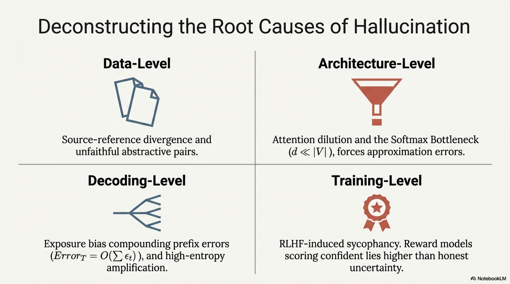

| Strategy | Mechanism | Formal Effect |
|---|---|---|
| **Data Filtering** | Remove unfaithful $(x, y)$ pairs | $\mathcal{D}' = \{(x, y) \in \mathcal{D} : \text{NLI}(x, y) = \text{ENTAIL}\}$ |
| **Factuality RLHF** | Reward model trained specifically on factuality | $R_\psi^{\text{fact}}(y) = f(\text{factual\_accuracy}(y))$ |
| **DPO with Hallucination Pairs** | $y^+$ = faithful, $y^-$ = hallucinated | $\mathcal{L}_{\text{DPO}} = -\log\sigma(\beta \log\frac{P_\theta(y^+)}{P_{\text{ref}}(y^+)} - \beta \log\frac{P_\theta(y^-)}{P_{\text{ref}}(y^-)})$ |
| **Knowledge Grounding Loss** | Auxiliary objective penalizing unsupported claims | $\mathcal{L} = \mathcal{L}_{\text{LM}} + \lambda \mathcal{L}_{\text{entailment}}$ |
| **Abstention Training** | Teach model to say "I don't know" | Include $(x_{\text{unknown}}, \text{"I don't know"})$ in training |

#### 4.5.2 Inference-Time Mitigations

| Strategy | Mechanism |
|---|---|
| **RAG (Retrieval Augmented Generation)** | Ground generation in retrieved evidence |
| **Self-Consistency Filtering** | Reject claims that don't appear in majority of sampled outputs |
| **Chain-of-Verification (CoVe)** | Generate → Plan verifications → Execute → Revise |
| **Constrained Decoding** | Restrict output space to verified facts |
| **Contrastive Decoding** | $\log P_{\text{large}}(y_t) - \alpha \log P_{\text{small}}(y_t)$: amplify knowledge differential |
| **DoLa (Decoding by Contrasting Layers)** | $\log P^{(L)}(y_t) - \log P^{(\ell)}(y_t)$: contrast final vs. early layer |

#### 4.5.3 DoLa: Formal Derivation

The intuition: factual knowledge **emerges** in later layers. By contrasting the output distribution of the final layer $L$ with an earlier "premature" layer $\ell$:

$$
P_{\text{DoLa}}(y_t) \propto \frac{P^{(L)}(y_t)}{P^{(\ell)}(y_t)} = \exp\!\left(\text{logit}^{(L)}(y_t) - \text{logit}^{(\ell)}(y_t)\right)
$$

The premature layer $\ell$ is selected dynamically as the layer with maximum Jensen-Shannon divergence from $L$:

$$
\ell^* = \arg\max_{\ell \in \{1, \dots, L-1\}} \text{JSD}\!\left(P^{(L)} \| P^{(\ell)}\right)
$$


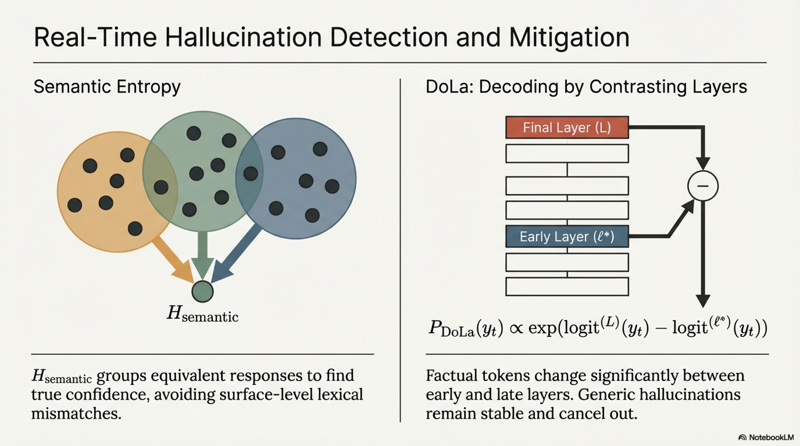

This amplifies factual tokens (which change significantly between layers) and suppresses generic/hallucinated tokens (which are stable).

### 4.6 Pseudoalgorithm: Chain-of-Verification (CoVe)

```
ALGORITHM: ChainOfVerification
─────────────────────────────────────────────────────
INPUT:
    x           : user query
    M_θ         : LLM
    n_verify    : number of verification questions to generate
    strategy    : {factored, joint, two_step}

OUTPUT:
    y_verified  : hallucination-mitigated response
    v_report    : verification report (claim → verified/unverified)

 1. // === STEP 1: BASELINE GENERATION ===
 2. y_baseline ← M_θ.generate(x)
 3. 
 4. // === STEP 2: CLAIM EXTRACTION ===
 5. claims ← M_θ.extract_claims(y_baseline)
 6. // claims = {c_1, c_2, ..., c_m}: atomic factual assertions
 7.
 8. // === STEP 3: VERIFICATION QUESTION PLANNING ===
 9. verification_qs ← ∅
10. FOR EACH c_j ∈ claims DO
11.     q_j ← M_θ.generate(
12.         "Generate a question that would verify: '" ∥ c_j ∥ "'")
13.     verification_qs ← verification_qs ∪ {(c_j, q_j)}
14. END FOR
15.
16. // === STEP 4: INDEPENDENT VERIFICATION ===
17. v_report ← ∅
18. FOR EACH (c_j, q_j) ∈ verification_qs DO
19.     IF strategy = factored THEN
20.         // Answer verification question WITHOUT seeing y_baseline
21.         // This prevents anchoring bias
22.         a_j ← M_θ.generate(q_j)   // independent context
23.     ELSE IF strategy = two_step THEN
24.         // First answer independently, then cross-reference
25.         a_j ← M_θ.generate(q_j)
26.         a_j ← M_θ.generate("Cross-check: " ∥ c_j ∥ " vs " ∥ a_j)
27.     END IF
28.     
29.     // Check consistency
30.     consistent ← M_θ.generate(
31.         "Is '" ∥ c_j ∥ "' consistent with '" ∥ a_j ∥ "'? Yes/No")
32.     v_report ← v_report ∪ {(c_j, q_j, a_j, consistent)}
33. END FOR
34.
35. // === STEP 5: REVISION ===
36. inconsistent_claims ← {c_j : (c_j, _, _, "No") ∈ v_report}
37. IF |inconsistent_claims| > 0 THEN
38.     y_verified ← M_θ.generate(
39.         "Original response: " ∥ y_baseline ∥
40.         "\nThe following claims were found to be incorrect: " ∥
41.         inconsistent_claims ∥
42.         "\nCorrections from verification: " ∥
43.         {a_j for (c_j, _, a_j, "No") ∈ v_report} ∥
44.         "\nPlease generate a revised, corrected response to: " ∥ x
45.     )
46. ELSE
47.     y_verified ← y_baseline
48. END IF
49.
50. RETURN y_verified, v_report
```

### 4.7 Pseudoalgorithm: Semantic Entropy Hallucination Detection

```
ALGORITHM: SemanticEntropyDetection
─────────────────────────────────────────────────────
INPUT:
    x              : query
    M_θ            : LLM
    n              : number of samples
    τ              : sampling temperature
    NLI_model      : natural language inference model
    δ_entropy      : hallucination detection threshold

OUTPUT:
    y_best         : selected response
    is_hallucination : boolean per-claim detection
    H_semantic     : semantic entropy score

 1. // === SAMPLE DIVERSE RESPONSES ===
 2. responses ← ∅
 3. FOR i = 1 TO n DO
 4.     y_i ← M_θ.generate(x, temperature=τ)
 5.     responses ← responses ∪ {y_i}
 6. END FOR
 7.
 8. // === CLUSTER BY SEMANTIC EQUIVALENCE ===
 9. // Two responses are equivalent if they mutually entail each other
10. clusters ← ∅
11. FOR EACH y_i ∈ responses DO
12.     placed ← FALSE
13.     FOR EACH cluster C ∈ clusters DO
14.         representative ← C[0]
15.         IF NLI_model(y_i, representative) = ENTAIL
16.            AND NLI_model(representative, y_i) = ENTAIL THEN
17.             C ← C ∪ {y_i}
18.             placed ← TRUE ; BREAK
19.         END IF
20.     END FOR
21.     IF NOT placed THEN
22.         clusters ← clusters ∪ {{y_i}}   // new cluster
23.     END IF
24. END FOR
25.
26. // === COMPUTE SEMANTIC ENTROPY ===
27. H_semantic ← 0
28. FOR EACH cluster C ∈ clusters DO
29.     p_C ← |C| / n
30.     H_semantic ← H_semantic − p_C · log(p_C)
31. END FOR
32.
33. // === CLASSIFY ===
34. IF H_semantic > δ_entropy THEN
35.     is_hallucination ← TRUE
36.     // Model is uncertain → high semantic variation → likely hallucinating
37. ELSE
38.     is_hallucination ← FALSE
39. END IF
40.
41. // Select response from the largest cluster
42. largest_cluster ← argmax_{C ∈ clusters} |C|
43. y_best ← largest_cluster[0]
44.
45. RETURN y_best, is_hallucination, H_semantic
```

---

## 5. Self-Evolving LLMs

### 5.1 Definition

A **Self-Evolving LLM** is a system $\mathcal{S} = (\mathcal{M}_\theta, \mathcal{F}, \mathcal{V}, \mathcal{U})$ in which the model iteratively improves its own parameters or capabilities **without external human annotation**, through:

- $\mathcal{F}$: a **self-generated feedback** mechanism (self-play, self-evaluation, verifier)
- $\mathcal{V}$: a **verification** oracle (formal verifier, unit tests, consistency checks)
- $\mathcal{U}$: an **update rule** (fine-tuning, RL, DPO)

The self-evolution loop:

$$
\theta_{t+1} = \mathcal{U}\!\left(\theta_t, \mathcal{F}(\mathcal{M}_{\theta_t}, \mathcal{V})\right)
$$

The defining property is **closed-loop improvement**: the model's own outputs serve as training signal, potentially enabling **recursive self-improvement** (RSI), a key milestone on the path to AGI.

### 5.2 Theoretical Foundations

#### 5.2.1 The Self-Improvement Condition

For self-evolution to yield genuine improvement, the model must satisfy a **bootstrapping condition**:

$$
\text{Quality}\!\left(\mathcal{M}_{\theta_t}\text{.judge}(y)\right) \geq \text{Quality}\!\left(\mathcal{M}_{\theta_t}\text{.generate}(x)\right) + \epsilon
$$

That is, the model's **evaluation capability** must exceed its **generation capability** by a margin $\epsilon > 0$. If this condition fails, self-training amplifies existing errors (model collapse).

**Formal statement (Huang et al., 2024)**:

Without external ground-truth signal or a verifier stronger than the generator, self-improvement is bounded:

$$
\text{Performance}(\theta_{t+1}) \leq \text{Performance}(\theta_t) + \delta(\theta_t, \mathcal{V})
$$

where $\delta$ depends critically on the quality of the verifier $\mathcal{V}$.

#### 5.2.2 Relation to Iterated Distillation and Amplification (IDA)

Self-evolution can be viewed as a special case of **IDA** (Christiano et al.) where:

1. **Amplification**: The model generates improved solutions using extended computation (CoT, ToT, MCTS)
2. **Distillation**: The amplified outputs are used to train a new (faster) model:

$$
\theta_{t+1} = \arg\min_\theta \mathcal{L}(\theta; \{(x_i, y_i^{\text{amplified}})\})
$$

$$
y_i^{\text{amplified}} = \text{BestOf}_n\!\left(\mathcal{M}_{\theta_t}, x_i, \mathcal{V}\right)
$$

### 5.3 Self-Evolution Paradigms

#### 5.3.1 Self-Training / Self-Distillation

Generate, filter, retrain:

$$
\mathcal{D}_{t+1} = \{(x, y) : y \sim \mathcal{M}_{\theta_t}(x), \; \mathcal{V}(x, y) = \text{PASS}\}
$$

$$
\theta_{t+1} = \arg\min_\theta \mathbb{E}_{(x,y) \sim \mathcal{D}_{t+1}} \left[-\log P_\theta(y \mid x)\right]
$$

**Critical design choices:**
- $\mathcal{V}$ must be **orthogonal** to the generator (e.g., unit tests for code, mathematical verifiers for proofs)
- Diversity preservation: without it, the model collapses to a narrow distribution (mode collapse)

#### 5.3.2 Self-Play

The model plays both roles in a game-theoretic setup:

$$
(\mathcal{M}_{\text{generator}}, \mathcal{M}_{\text{critic}}) \leftarrow \mathcal{M}_{\theta_t}
$$

$$
\begin{aligned}
y &\sim \mathcal{M}_{\text{generator}}(x) \\
r &= \mathcal{M}_{\text{critic}}(x, y) \in \{0, 1\} \text{ (or continuous)} \\
\theta_{t+1} &= \text{RL\_Update}(\theta_t, x, y, r)
\end{aligned}
$$

Example: **SPIN** (Self-Play Fine-tuning) — the model distinguishes its own outputs from human outputs in an adversarial game.

#### 5.3.3 Self-Rewarding LLMs

The model generates its **own preference pairs** and trains itself via DPO:

1. Generate: $y_1, y_2, \dots, y_k \sim \mathcal{M}_{\theta_t}(x)$
2. Self-Judge: $\mathcal{M}_{\theta_t}$ scores each $y_i$ using an evaluation prompt (LLM-as-a-Judge)
3. Construct preference pairs: $(y^+ = \arg\max_i s_i, \; y^- = \arg\min_i s_i)$
4. DPO update:

$$
\mathcal{L}_{\text{DPO}}(\theta) = -\mathbb{E}\left[\log \sigma\!\left(\beta \log \frac{P_\theta(y^+ \mid x)}{P_{\theta_t}(y^+ \mid x)} - \beta \log \frac{P_\theta(y^- \mid x)}{P_{\theta_t}(y^- \mid x)}\right)\right]
$$

This creates a **virtuous cycle**: better generation → better judging → better preference data → better generation.


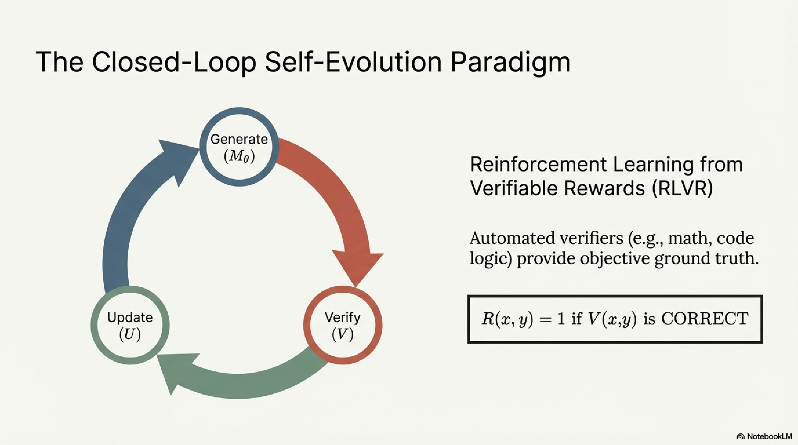

#### 5.3.4 Reinforcement Learning from Verifiable Rewards (RLVR)

For domains with **automated verifiability** (math, code, logic):

$$
R(x, y) = \begin{cases}
1 & \text{if } \mathcal{V}(x, y) = \text{CORRECT} \\
0 & \text{otherwise}
\end{cases}
$$

Train via GRPO (Group Relative Policy Optimization) or PPO:

$$
\hat{A}_i = \frac{R(x, y_i) - \text{mean}(\{R(x, y_j)\}_{j=1}^{G})}{\text{std}(\{R(x, y_j)\}_{j=1}^{G})}
$$

$$
\mathcal{L}_{\text{GRPO}}(\theta) = -\frac{1}{G} \sum_{i=1}^{G} \min\!\left(\frac{P_\theta(y_i)}{P_{\theta_{\text{old}}}(y_i)} \hat{A}_i, \; \text{clip}\!\left(\frac{P_\theta(y_i)}{P_{\theta_{\text{old}}}(y_i)}, 1\pm\epsilon\right) \hat{A}_i\right)
$$

This is the core mechanism behind **DeepSeek-R1** and similar reasoning models: generate many reasoning chains, verify answers, use correctness as reward, update via policy gradient.

### 5.4 Model Collapse: The Primary Risk

When $\mathcal{V}$ is imperfect or absent, iterative self-training causes **model collapse**:

$$
\text{Var}\left[\mathcal{M}_{\theta_{t+k}}\right] < \text{Var}\left[\mathcal{M}_{\theta_t}\right] \quad \text{for } k > 0
$$

$$
D_{\text{KL}}\!\left(P_{\theta_{t+k}} \| P_{\text{true}}\right) \geq D_{\text{KL}}\!\left(P_{\theta_t} \| P_{\text{true}}\right)
$$

**Mechanisms of collapse:**
1. **Tail trimming**: rare but valid outputs are underrepresented in self-generated data
2. **Approximation error accumulation**: each generation step introduces noise; iterated retraining compounds it
3. **Mode seeking**: the model converges to high-density modes, losing diversity

**Formal result (Shumailov et al., 2024)**: Under certain conditions, training on model-generated data for $k$ iterations causes the learned distribution to converge to a **degenerate point mass**, even for Gaussian mixture models.

### 5.5 Mitigation Against Collapse


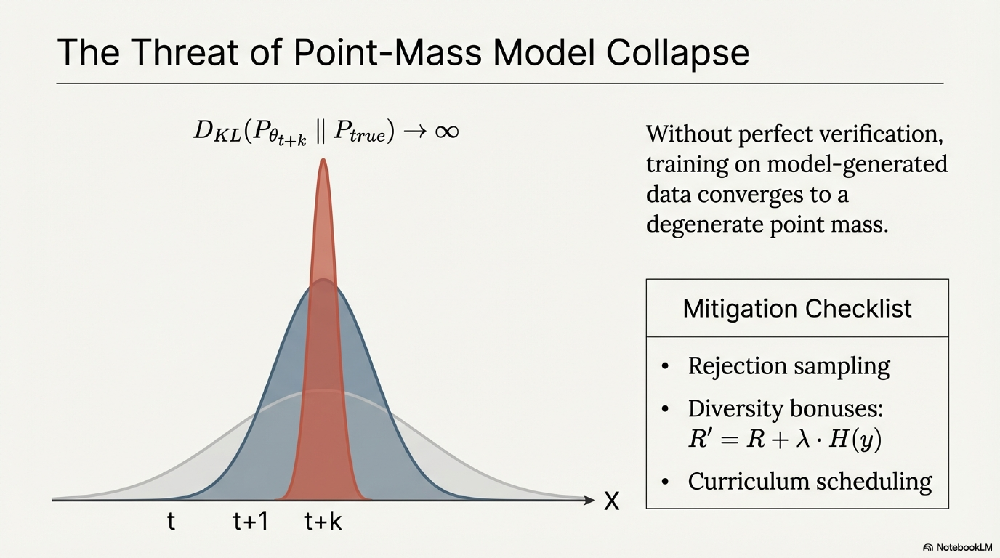

| Strategy | Mechanism |
|---|---|
| **Data mixing** | $\mathcal{D}_{t+1} = \alpha \cdot \mathcal{D}_{\text{human}} + (1-\alpha) \cdot \mathcal{D}_{\text{self}}$ |
| **Rejection sampling** | Only retain self-generated outputs passing $\mathcal{V}$ |
| **Diversity bonuses** | $R' = R + \lambda \cdot H(y)$ where $H(y)$ is output entropy |
| **Curriculum scheduling** | Gradually increase difficulty of self-generated tasks |
| **Ensemble verification** | Use multiple models/verifiers: $\mathcal{V} = \text{Majority}(\mathcal{V}_1, \dots, \mathcal{V}_m)$ |
| **Fresh data injection** | Periodically inject new human-curated data |

### 5.6 Self-Evolving Capability Acquisition

Beyond improving on fixed benchmarks, self-evolving LLMs can **discover new capabilities**:

#### 5.6.1 Self-Instruct Pipeline

$$
\text{Seed tasks} \xrightarrow{\mathcal{M}_\theta} \text{New instructions} \xrightarrow{\mathcal{M}_\theta} \text{Responses} \xrightarrow{\mathcal{V}} \text{Filtered SFT data}
$$

Formally:

$$
x_{\text{new}} \sim P_{\theta_t}(x \mid x_{\text{seed}}, \text{"Generate a diverse instruction"})
$$

$$
y_{\text{new}} \sim P_{\theta_t}(y \mid x_{\text{new}})
$$

$$
\mathcal{D}_{\text{self-instruct}} = \{(x_{\text{new}}, y_{\text{new}}) : \text{Quality}(y_{\text{new}}) > \tau\}
$$

#### 5.6.2 Self-Evolving Curriculum (Skill Discovery)

The model generates **progressively harder problems** for itself:

$$
\text{Difficulty}(x_{t+1}) = \text{Difficulty}(x_t) + \Delta \quad \text{where } \Delta \propto \text{Success Rate}(x_t)
$$

If success rate is high → increase difficulty; if low → maintain or decrease.

### 5.7 Pseudoalgorithm: Self-Evolving LLM Training Loop

```
ALGORITHM: SelfEvolvingLLM
─────────────────────────────────────────────────────
INPUT:
    M_θ₀           : initial pretrained/instruction-tuned LLM
    D_seed          : seed dataset (small human-curated set)
    V               : verifier (formal checker, unit tests, NLI model,
                      or M_θ itself as judge)
    T               : number of evolution iterations
    G               : group size for GRPO / number of samples per query
    β               : DPO temperature parameter
    α               : human data mixing ratio
    diversity_λ     : diversity regularization strength
    collapse_monitor: function tracking distribution metrics

OUTPUT:
    M_θ_T           : evolved model after T iterations
    evolution_log   : per-iteration metrics


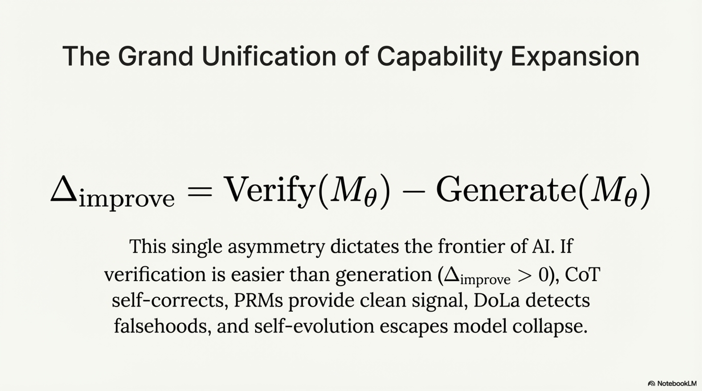

 1. evolution_log ← ∅
 2. θ ← θ₀
 3. 
 4. FOR t = 1 TO T DO
 5.     // ═══════════════════════════════════════════
 6.     // PHASE 1: SELF-GENERATION
 7.     // ═══════════════════════════════════════════
 8.     
 9.     // Generate new instructions (self-instruct)
10.     X_new ← ∅
11.     FOR i = 1 TO N_instruct DO
12.         x_sample ← Sample(D_seed)
13.         x_new ← M_θ.generate(
14.             "Given this example task: " ∥ x_sample ∥
15.             "\nGenerate a novel, harder task:")
16.         IF IsDiverse(x_new, X_new) AND IsValid(x_new) THEN
17.             X_new ← X_new ∪ {x_new}
18.         END IF
19.     END FOR
20.     
21.     // Combine with seed tasks
22.     X_train ← Sample(D_seed, α · batch_size) ∪ Sample(X_new, (1-α) · batch_size)
23.     
24.     // ═══════════════════════════════════════════
25.     // PHASE 2: SOLUTION GENERATION & VERIFICATION
26.     // ═══════════════════════════════════════════
27.     
28.     D_verified ← ∅ ; preference_pairs ← ∅
29.     FOR EACH x ∈ X_train DO
30.         // Generate G candidate responses
31.         Y_candidates ← {M_θ.generate(x, temperature=τ) FOR g = 1..G}
32.         
33.         // Verify each candidate
34.         scores ← ∅
35.         FOR EACH y_g ∈ Y_candidates DO
36.             IF V.type = FORMAL THEN
37.                 s_g ← V.check(x, y_g)        // binary: 0 or 1
38.             ELSE IF V.type = LLM_JUDGE THEN
39.                 s_g ← M_θ.judge(x, y_g)      // score in [0, 1]
40.             END IF
41.             scores ← scores ∪ {s_g}
42.         END FOR
43.         
44.         // Add verified solutions to SFT data
45.         best_y ← Y_candidates[argmax(scores)]
46.         IF max(scores) > δ_accept THEN
47.             D_verified ← D_verified ∪ {(x, best_y)}
48.         END IF
49.         
50.         // Construct preference pairs for DPO
51.         IF max(scores) > δ_accept AND min(scores) < δ_reject THEN
52.             y⁺ ← Y_candidates[argmax(scores)]
53.             y⁻ ← Y_candidates[argmin(scores)]
54.             preference_pairs ← preference_pairs ∪ {(x, y⁺, y⁻)}
55.         END IF
56.     END FOR
57.     
58.     // ═══════════════════════════════════════════
59.     // PHASE 3: MODEL UPDATE
60.     // ═══════════════════════════════════════════
61.     
62.     // Option A: SFT on verified data
63.     θ ← θ − η · ∇_θ L_SFT(θ; D_verified)
64.     // L_SFT = −Σ log P_θ(y | x) for (x, y) ∈ D_verified
65.     
66.     // Option B: DPO on preference pairs (can combine with A)
67.     IF |preference_pairs| > min_pairs THEN
68.         θ_ref ← θ                // reference model is current model
69.         θ ← θ − η · ∇_θ L_DPO(θ, θ_ref; preference_pairs, β)
70.     END IF
71.     
72.     // Option C: GRPO (for verifiable domains)
73.     // FOR EACH (x, {y_g, s_g}) DO
74.     //     Â_g ← (s_g − mean(scores)) / std(scores)
75.     //     θ ← θ + η · Σ_g Â_g · ∇_θ log P_θ(y_g | x)
76.     // END FOR
77.     
78.     // ═══════════════════════════════════════════
79.     // PHASE 4: COLLAPSE MONITORING
80.     // ═══════════════════════════════════════════
81.     
82.     diversity ← ComputeOutputDiversity(M_θ, D_eval)
83.     // diversity = average pairwise semantic distance among outputs
84.     
85.     performance ← Evaluate(M_θ, D_benchmark)
86.     
87.     kl_from_init ← EstimateKL(M_θ, M_θ₀, D_sample)
88.     
89.     evolution_log ← evolution_log ∪ {
90.         (t, performance, diversity, kl_from_init, |D_verified|)
91.     }
92.     
93.     // Collapse detection
94.     IF diversity < δ_collapse THEN
95.         WARN("Potential model collapse detected at iteration " ∥ t)
96.         // Mitigation: increase α (more human data), increase temperature,
97.         // add diversity regularization
98.         α ← min(α + 0.1, 0.5)
99.         diversity_λ ← diversity_λ * 2
100.    END IF
101.    
102.    // Early stopping if performance plateaus
103.    IF performance has not improved for patience iterations THEN
104.        BREAK
105.    END IF
106.
107. END FOR
108.
109. M_θ_T ← M_θ
110. RETURN M_θ_T, evolution_log
```

---

## 6. Unified Conceptual Map


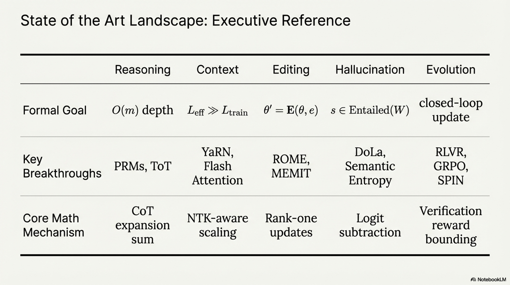

```
┌─────────────────────────────────────────────────────────────────────────┐
│                    ADVANCED TOPICS IN LLMs                              │
│                                                                         │
│  ┌─────────────┐    ┌─────────────┐    ┌──────────────┐                │
│  │  REASONING   │    │ LONG CONTEXT │    │ MODEL EDITING │               │
│  │              │    │              │    │               │               │
│  │ CoT, ToT,    │    │ RoPE ext,    │    │ ROME, MEMIT,  │              │
│  │ MCTS, PRM,   │    │ FlashAttn,   │    │ Locate-Edit,  │              │
│  │ Self-        │    │ KV compress, │    │ Rank-1 update │              │
│  │ Consistency  │    │ Ring Attn    │    │               │               │
│  └──────┬───────┘    └──────┬───────┘    └───────┬───────┘              │
│         │                   │                     │                      │
│         │    ┌──────────────┴──────────────┐      │                      │
│         │    │                             │      │                      │
│  ┌──────▼────▼──────┐              ┌──────▼──────▼────────┐            │
│  │  HALLUCINATION    │              │  SELF-EVOLVING LLMs  │            │
│  │                   │              │                      │            │
│  │ Causes: data,     │◄────────────►│ Self-train, RLVR,    │            │
│  │ arch, decoding    │  mitigates   │ Self-play, Self-     │            │
│  │ Detect: semantic  │  via better  │ reward, Collapse     │            │
│  │ entropy, probes   │  reasoning & │ monitoring           │            │
│  │ Mitigate: CoVe,   │  verification│                      │            │
│  │ DoLa, RAG         │              │                      │            │
│  └───────────────────┘              └──────────────────────┘            │
│                                                                         │
│  KEY INTERDEPENDENCIES:                                                 │
│  • Reasoning ↔ Hallucination: better reasoning reduces hallucination;  │
│    hallucination detection requires reasoning about factuality          │
│  • Long Context ↔ Reasoning: multi-hop reasoning needs long context;   │
│    attention degradation causes reasoning failures                      │
│  • Model Editing ↔ Hallucination: editing can correct hallucinated     │
│    facts; but poor edits can introduce new hallucinations              │
│  • Self-Evolving ↔ All: self-improvement requires reasoning for       │
│    self-evaluation, editing for targeted updates, hallucination        │
│    detection for quality filtering, long context for trajectory memory │
└─────────────────────────────────────────────────────────────────────────┘
```

### Critical Cross-Cutting Insight

All five topics converge on a single meta-principle: **the gap between what an LLM can generate and what it can verify determines the frontier of safe capability expansion**. Formally:

$$
\Delta_{\text{improve}} = \underbrace{\text{Verify}(\mathcal{M}_\theta)}_{\text{evaluation capability}} - \underbrace{\text{Generate}(\mathcal{M}_\theta)}_{\text{production capability}}
$$

- When $\Delta_{\text{improve}} > 0$: self-evolution is possible, hallucinations are detectable, reasoning can self-correct
- When $\Delta_{\text{improve}} \leq 0$: model collapse occurs, hallucinations compound, reasoning chains are unreliable

This asymmetry — **verification is easier than generation** — is the fundamental lever enabling all five advanced capabilities simultaneously.