---

# Transformers: A Complete SOTA-Level Technical Treatment


---

## 1. Transformers

### 1.1 Definition

A **Transformer** is a sequence-to-sequence neural architecture that replaces recurrence and convolution entirely with a **parallelizable attention mechanism** operating over all positions simultaneously. It learns a parameterized function:

$$f_\theta : \mathbb{R}^{n \times d_{\text{in}}} \longrightarrow \mathbb{R}^{m \times d_{\text{out}}}$$

where $n$ is the source sequence length, $m$ is the target sequence length, $d_{\text{in}}, d_{\text{out}}$ are input/output dimensionalities, and $\theta$ denotes all learnable parameters.

### 1.2 Core Architectural Insight

The fundamental departure from RNNs/LSTMs is the elimination of **sequential bottleneck**. In recurrent models, the hidden state $h_t = f(h_{t-1}, x_t)$ enforces $\mathcal{O}(n)$ sequential steps, preventing parallelism and creating gradient pathways of length $\mathcal{O}(n)$. The Transformer achieves:

| Property | RNN | Transformer |
|---|---|---|
| Sequential operations | $\mathcal{O}(n)$ | $\mathcal{O}(1)$ |
| Maximum path length | $\mathcal{O}(n)$ | $\mathcal{O}(1)$ |
| Computation per layer | $\mathcal{O}(n \cdot d^2)$ | $\mathcal{O}(n^2 \cdot d + n \cdot d^2)$ |

The $\mathcal{O}(1)$ path length between any two positions enables direct gradient flow, while the $\mathcal{O}(n^2 \cdot d)$ attention cost is the price paid for full pairwise interaction — a tradeoff that motivates efficient attention variants (§6).

### 1.3 Canonical Architecture


The original Transformer (Vaswani et al., 2017) follows an **encoder-decoder** structure:

$$\text{Transformer}(X, Y_{\text{shift}}) = \text{Decoder}\big(\text{Encoder}(X),\; Y_{\text{shift}}\big)$$

where $X \in \mathbb{R}^{n \times d}$ is the source and $Y_{\text{shift}} \in \mathbb{R}^{m \times d}$ is the right-shifted target.

### 1.4 Pseudo-Algorithm: Full Transformer (Encoder-Decoder)

```
ALGORITHM: Transformer_Encoder_Decoder

INPUT:
    X         ∈ ℝ^{n × d_vocab_src}    — source token IDs (integers in [0, V_src))
    Y_shift   ∈ ℝ^{m × d_vocab_tgt}    — right-shifted target token IDs
    N_enc     ∈ ℤ⁺                      — number of encoder layers
    N_dec     ∈ ℤ⁺                      — number of decoder layers

OUTPUT:
    P         ∈ ℝ^{m × V_tgt}           — probability distribution over target vocabulary
                                           at each target position

PARAMETERS:
    W_emb_src ∈ ℝ^{V_src × d_model}
    W_emb_tgt ∈ ℝ^{V_tgt × d_model}
    W_out     ∈ ℝ^{d_model × V_tgt}
    θ_enc[1..N_enc]                      — encoder layer parameters
    θ_dec[1..N_dec]                      — decoder layer parameters

PROCEDURE:
    // 1. Embed and add positional information
    H_src ← Lookup(W_emb_src, X) + PositionalEncoding(n, d_model)
    H_tgt ← Lookup(W_emb_tgt, Y_shift) + PositionalEncoding(m, d_model)

    // 2. Encoder pass
    Z ← H_src
    FOR l = 1 TO N_enc:
        Z ← EncoderBlock(Z; θ_enc[l])
    END FOR
    // Z ∈ ℝ^{n × d_model} — contextual source representations

    // 3. Decoder pass
    S ← H_tgt
    FOR l = 1 TO N_dec:
        S ← DecoderBlock(S, Z; θ_dec[l])
    END FOR
    // S ∈ ℝ^{m × d_model} — contextual target representations

    // 4. Output projection
    Logits ← S · W_out                  // ∈ ℝ^{m × V_tgt}
    P ← Softmax(Logits, axis=-1)        // row-wise softmax

    RETURN P
```

---

## 2. Self-Attention

### 2.1 Definition

**Self-attention** (intra-attention) is a mechanism that computes a representation of each position in a sequence by attending to all positions within the **same** sequence. For input $X \in \mathbb{R}^{n \times d}$, it produces output $Z \in \mathbb{R}^{n \times d}$ where each row $z_i$ is a weighted combination of value vectors derived from $X$, with weights determined by compatibility between query and key vectors.

### 2.2 Scaled Dot-Product Attention


Given input $X \in \mathbb{R}^{n \times d_{\text{model}}}$, we project into three distinct subspaces:

$$Q = X W^Q, \quad K = X W^K, \quad V = X W^V$$

where $W^Q, W^K \in \mathbb{R}^{d_{\text{model}} \times d_k}$ and $W^V \in \mathbb{R}^{d_{\text{model}} \times d_v}$.

The attention function is:

$$\text{Attention}(Q, K, V) = \text{softmax}\!\left(\frac{QK^\top}{\sqrt{d_k}}\right) V$$

#### 2.2.1 Decomposition of the Mechanism

**Step 1 — Compatibility scoring:**

$$E = QK^\top \in \mathbb{R}^{n \times n}, \quad e_{ij} = q_i^\top k_j$$

Each $e_{ij}$ measures how much position $i$ should attend to position $j$.

**Step 2 — Scaling:**

$$\hat{E} = \frac{E}{\sqrt{d_k}}$$

**Justification:** Assume $q_i, k_j$ have components drawn i.i.d. from $\mathcal{N}(0, 1)$. Then $q_i^\top k_j = \sum_{\ell=1}^{d_k} q_{i\ell} \cdot k_{j\ell}$, which has:

$$\mathbb{E}[q_i^\top k_j] = 0, \quad \text{Var}(q_i^\top k_j) = d_k$$

Without scaling, as $d_k$ grows, the dot products grow in magnitude, pushing softmax into saturated regions where gradients vanish. Dividing by $\sqrt{d_k}$ normalizes variance to $1$.

**Step 3 — Normalization:**

$$A = \text{softmax}(\hat{E}) \in \mathbb{R}^{n \times n}, \quad a_{ij} = \frac{\exp(\hat{e}_{ij})}{\sum_{l=1}^{n} \exp(\hat{e}_{il})}$$

The matrix $A$ is **row-stochastic**: each row sums to $1$, forming a categorical distribution over source positions.

**Step 4 — Aggregation:**

$$Z = AV \in \mathbb{R}^{n \times d_v}, \quad z_i = \sum_{j=1}^{n} a_{ij} \, v_j$$

Each output is a convex combination of value vectors weighted by attention scores.

### 2.3 Geometric Interpretation

Self-attention performs a **data-dependent, soft dictionary lookup**:
- $Q$ encodes **"what am I looking for?"**
- $K$ encodes **"what do I contain?"**
- $V$ encodes **"what do I provide if selected?"**

The attention matrix $A$ can be viewed as a **learned, input-conditioned adjacency matrix** of a fully connected weighted directed graph over the sequence positions.

### 2.4 Multi-Head Attention (MHA)

Rather than performing a single attention function with $d_{\text{model}}$-dimensional keys/queries/values, MHA projects into $h$ parallel subspaces:

$$\text{MultiHead}(X) = \text{Concat}(\text{head}_1, \ldots, \text{head}_h) \, W^O$$

where each head is:

$$\text{head}_i = \text{Attention}(X W_i^Q, \; X W_i^K, \; X W_i^V)$$

with $W_i^Q, W_i^K \in \mathbb{R}^{d_{\text{model}} \times d_k}$, $W_i^V \in \mathbb{R}^{d_{\text{model}} \times d_v}$, $W^O \in \mathbb{R}^{h \cdot d_v \times d_{\text{model}}}$, and typically $d_k = d_v = d_{\text{model}} / h$.

**Total parameter count for MHA:**

$$|\theta_{\text{MHA}}| = h \cdot (d_{\text{model}} \cdot d_k + d_{\text{model}} \cdot d_k + d_{\text{model}} \cdot d_v) + h \cdot d_v \cdot d_{\text{model}} = 4 \, d_{\text{model}}^2$$

(when $d_k = d_v = d_{\text{model}}/h$)

#### 2.4.1 Why Multiple Heads?

Each head learns to attend to information from a **different representational subspace**. Empirically observed specializations include:

- **Positional heads**: attend to fixed relative offsets (e.g., previous token)
- **Syntactic heads**: track dependency arcs
- **Rare-token heads**: attend disproportionately to infrequent tokens
- **Induction heads**: implement in-context pattern matching (copy from prior context where the current token last appeared)

### 2.5 Pseudo-Algorithm: Multi-Head Self-Attention

```
ALGORITHM: MultiHead_SelfAttention

INPUT:
    X     ∈ ℝ^{n × d_model}     — input sequence representations
    M     ∈ {0,1}^{n × n}       — optional binary mask (1 = attend, 0 = block)
                                    (for causal: M[i,j] = 1 iff j ≤ i)
    h     ∈ ℤ⁺                  — number of attention heads

OUTPUT:
    Z     ∈ ℝ^{n × d_model}     — attended representations

PARAMETERS:
    W_i^Q ∈ ℝ^{d_model × d_k}   for i = 1..h,  where d_k = d_model / h
    W_i^K ∈ ℝ^{d_model × d_k}   for i = 1..h
    W_i^V ∈ ℝ^{d_model × d_v}   for i = 1..h,  where d_v = d_model / h
    W^O   ∈ ℝ^{(h·d_v) × d_model}

PROCEDURE:
    heads ← empty list

    FOR i = 1 TO h:    // ← parallelizable across heads
        Q_i ← X · W_i^Q                              // ∈ ℝ^{n × d_k}
        K_i ← X · W_i^K                              // ∈ ℝ^{n × d_k}
        V_i ← X · W_i^V                              // ∈ ℝ^{n × d_v}

        E_i ← (Q_i · K_i^⊤) / √d_k                  // ∈ ℝ^{n × n}

        // Apply mask: set blocked positions to -∞
        FOR all (p, q) where M[p, q] = 0:
            E_i[p, q] ← -∞
        END FOR

        A_i ← Softmax(E_i, axis=-1)                  // ∈ ℝ^{n × n}, row-stochastic
        head_i ← A_i · V_i                            // ∈ ℝ^{n × d_v}

        APPEND head_i TO heads
    END FOR

    C ← Concatenate(heads, axis=-1)                   // ∈ ℝ^{n × (h·d_v)}
    Z ← C · W^O                                       // ∈ ℝ^{n × d_model}

    RETURN Z
```

### 2.6 Cross-Attention

When queries come from one sequence and keys/values from another:

$$Q = X_{\text{tgt}} W^Q, \quad K = X_{\text{src}} W^K, \quad V = X_{\text{src}} W^V$$

This gives $A \in \mathbb{R}^{m \times n}$ — the decoder attending to encoder outputs. The mechanism is identical except $Q$ and $K, V$ originate from different sequences.

---

## 3. Transformer Encoder Block

### 3.1 Definition


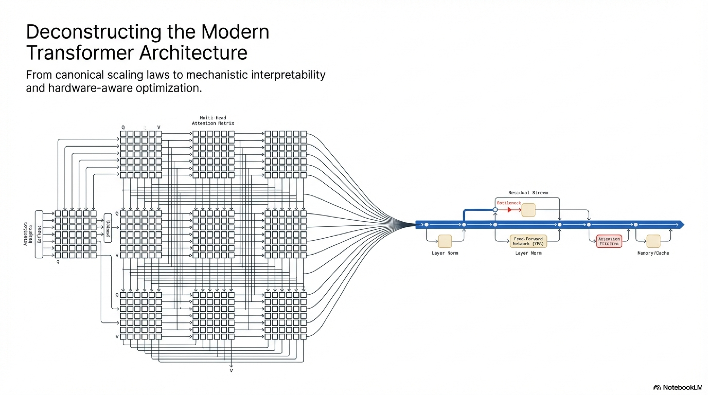

A **Transformer Encoder Block** is a single computational unit within the encoder stack. It applies **bidirectional** (unmasked) self-attention followed by a position-wise feed-forward network, with residual connections and layer normalization at each sub-layer.

### 3.2 Mathematical Formulation (Post-Norm, Original)

Given input $X^{(l)} \in \mathbb{R}^{n \times d_{\text{model}}}$ to layer $l$:

$$\hat{X}^{(l)} = \text{LayerNorm}\!\Big(X^{(l)} + \text{MHA}\big(X^{(l)}\big)\Big)$$

$$X^{(l+1)} = \text{LayerNorm}\!\Big(\hat{X}^{(l)} + \text{FFN}\big(\hat{X}^{(l)}\big)\Big)$$

### 3.3 Sub-Components in Detail

#### 3.3.1 Layer Normalization

For vector $x \in \mathbb{R}^d$:

$$\text{LayerNorm}(x) = \gamma \odot \frac{x - \mu}{\sqrt{\sigma^2 + \epsilon}} + \beta$$

where:

$$\mu = \frac{1}{d}\sum_{i=1}^{d} x_i, \quad \sigma^2 = \frac{1}{d}\sum_{i=1}^{d}(x_i - \mu)^2$$

$\gamma, \beta \in \mathbb{R}^d$ are learnable scale and shift, $\epsilon \sim 10^{-5}$ prevents division by zero.

**Contrast with BatchNorm:** LayerNorm normalizes across the feature dimension **within a single sample**, making it invariant to batch size and naturally suited to variable-length sequences.

#### 3.3.2 Position-Wise Feed-Forward Network (FFN)

Applied identically and independently to each position:

$$\text{FFN}(x) = W_2 \, \sigma(W_1 x + b_1) + b_2$$

where $W_1 \in \mathbb{R}^{d_{\text{model}} \times d_{\text{ff}}}$, $W_2 \in \mathbb{R}^{d_{\text{ff}} \times d_{\text{model}}}$, and typically $d_{\text{ff}} = 4 \cdot d_{\text{model}}$.

**Activation variants:**

| Variant | Formula |
|---|---|
| ReLU (original) | $\sigma(x) = \max(0, x)$ |
| GELU (BERT, GPT) | $\sigma(x) = x \cdot \Phi(x)$, where $\Phi$ is the standard normal CDF |
| SwiGLU (LLaMA, PaLM) | $\sigma(x) = \text{Swish}(xW_{\text{gate}}) \odot (xW_{\text{up}})$ |

**SwiGLU** introduces a gating mechanism with Swish activation $\text{Swish}(x) = x \cdot \text{sigmoid}(\beta x)$, empirically improving performance. When using SwiGLU, the FFN has three weight matrices, and $d_{\text{ff}}$ is typically adjusted to $\frac{8}{3} d_{\text{model}}$ (rounded to nearest multiple of 256) to keep parameter count comparable.

**Interpretation:** The FFN serves as a **key-value memory** (Geva et al., 2021). Each row of $W_1$ acts as a key pattern; the corresponding column of $W_2$ is the associated value. The activation selects which memories to retrieve.

#### 3.3.3 Pre-Norm vs. Post-Norm

**Post-Norm** (original Transformer):
$$\text{output} = \text{LN}(x + \text{Sublayer}(x))$$

**Pre-Norm** (GPT-2, modern standard):
$$\text{output} = x + \text{Sublayer}(\text{LN}(x))$$


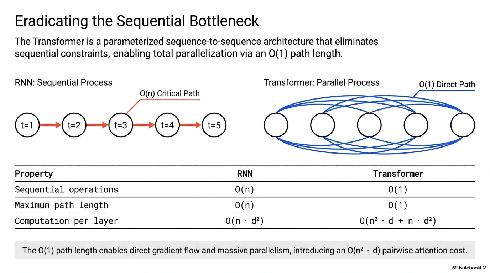

Pre-Norm places the residual pathway as a **direct, unobstructed additive path**, improving gradient flow at initialization and enabling stable training of very deep models (>100 layers) without warmup. The tradeoff: Pre-Norm can underperform Post-Norm at convergence for moderate depths (Xiong et al., 2020), though this gap closes with proper optimization.

### 3.4 Pseudo-Algorithm: Transformer Encoder Block

```
ALGORITHM: Transformer_Encoder_Block (Pre-Norm variant)

INPUT:
    X       ∈ ℝ^{n × d_model}        — sequence representations from previous layer
    h       ∈ ℤ⁺                     — number of attention heads

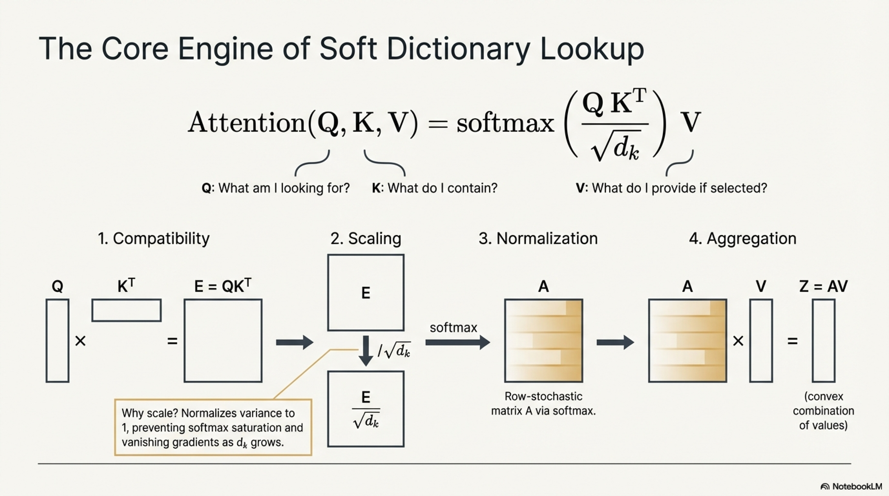


OUTPUT:
    X_out   ∈ ℝ^{n × d_model}        — updated sequence representations

PARAMETERS:
    γ₁, β₁ ∈ ℝ^{d_model}            — LayerNorm 1 parameters
    W^Q_i, W^K_i, W^V_i for i=1..h   — MHA projection matrices
    W^O     ∈ ℝ^{(h·d_v) × d_model}  — MHA output projection
    γ₂, β₂ ∈ ℝ^{d_model}            — LayerNorm 2 parameters
    W₁ ∈ ℝ^{d_model × d_ff}          — FFN up-projection
    W₂ ∈ ℝ^{d_ff × d_model}          — FFN down-projection
    b₁ ∈ ℝ^{d_ff}, b₂ ∈ ℝ^{d_model} — FFN biases

PROCEDURE:
    // Sub-layer 1: Multi-Head Self-Attention with residual
    X_norm ← LayerNorm(X; γ₁, β₁)
    A_out  ← MultiHead_SelfAttention(X_norm, mask=None, h)    // bidirectional
    X_mid  ← X + A_out                                        // residual connection

    // Sub-layer 2: Position-wise FFN with residual
    X_mid_norm ← LayerNorm(X_mid; γ₂, β₂)
    F_out      ← W₂ · Activation(W₁ · X_mid_norm + b₁) + b₂  // applied per-position
    X_out      ← X_mid + F_out                                 // residual connection

    RETURN X_out
```

### 3.5 Full Encoder Stack

```
ALGORITHM: Transformer_Encoder

INPUT:
    Token_IDs  ∈ ℤ^{n}                 — source token indices
    N_layers   ∈ ℤ⁺                    — number of encoder blocks

OUTPUT:
    Z          ∈ ℝ^{n × d_model}       — final contextual representations

PROCEDURE:
    E ← Embedding(Token_IDs)           // ∈ ℝ^{n × d_model}
    H ← E + PositionalEncoding(n)      // inject position information
    H ← Dropout(H)

    FOR l = 1 TO N_layers:
        H ← Transformer_Encoder_Block(H; θ_enc[l])
    END FOR

    Z ← LayerNorm(H)                   // final norm (Pre-Norm convention)
    RETURN Z
```

---

## 4. Transformer Decoder Block

### 4.1 Definition

A **Transformer Decoder Block** extends the encoder block with two critical modifications:

1. **Causal (masked) self-attention** — prevents position $i$ from attending to positions $j > i$, enforcing the autoregressive property $P(y_t \mid y_{<t})$.
2. **Cross-attention** — attends to encoder outputs, injecting source-side information.

### 4.2 Mathematical Formulation (Pre-Norm)

For decoder layer $l$ with input $S^{(l)} \in \mathbb{R}^{m \times d}$ and encoder output $Z \in \mathbb{R}^{n \times d}$:

$$\hat{S}^{(l)} = S^{(l)} + \text{CausalMHA}\!\Big(\text{LN}_1\big(S^{(l)}\big)\Big)$$

$$\tilde{S}^{(l)} = \hat{S}^{(l)} + \text{CrossMHA}\!\Big(\text{LN}_2\big(\hat{S}^{(l)}\big),\; Z\Big)$$

$$S^{(l+1)} = \tilde{S}^{(l)} + \text{FFN}\!\Big(\text{LN}_3\big(\tilde{S}^{(l)}\big)\Big)$$

### 4.3 Causal Masking

The causal mask $M \in \{0, 1\}^{m \times m}$ is a lower-triangular matrix:

$$M_{ij} = \begin{cases} 1 & \text{if } j \leq i \\ 0 & \text{if } j > i \end{cases}$$

Applied to attention logits:

$$\hat{e}_{ij} = \begin{cases} \frac{q_i^\top k_j}{\sqrt{d_k}} & \text{if } j \leq i \\ -\infty & \text{if } j > i \end{cases}$$

After softmax, positions $j > i$ receive zero attention weight, ensuring that the prediction at position $i$ depends only on known outputs at positions $\leq i$.

**Critical property:** This enables **teacher forcing** during training (all positions computed in parallel) while maintaining the autoregressive factorization:

$$P(y_1, \ldots, y_m \mid X) = \prod_{t=1}^{m} P(y_t \mid y_{<t}, X)$$

### 4.4 Decoder-Only Architecture (GPT-family, LLaMA)

Modern large language models typically use a **decoder-only** Transformer, which removes cross-attention and the encoder entirely:

$$S^{(l+1)} = S^{(l)} + \text{FFN}\!\Big(\text{LN}_2\Big(S^{(l)} + \text{CausalMHA}\big(\text{LN}_1(S^{(l)})\big)\Big)\Big)$$

The entire input (prompt + generation) is treated as a single causal sequence. This unifies pre-training (next-token prediction) and generation under one architecture.

### 4.5 Pseudo-Algorithm: Transformer Decoder Block (Full Encoder-Decoder)

```
ALGORITHM: Transformer_Decoder_Block (Pre-Norm, Encoder-Decoder)

INPUT:
    S       ∈ ℝ^{m × d_model}        — target sequence representations from previous layer
    Z       ∈ ℝ^{n × d_model}        — encoder output (source context)
    h       ∈ ℤ⁺                     — number of attention heads

OUTPUT:
    S_out   ∈ ℝ^{m × d_model}        — updated target representations

PARAMETERS:
    // Sub-layer 1: Causal Self-Attention
    γ₁, β₁           — LayerNorm 1
    W^Q₁_i, W^K₁_i, W^V₁_i  for i=1..h,  W^O₁

    // Sub-layer 2: Cross-Attention
    γ₂, β₂           — LayerNorm 2
    W^Q₂_i, W^K₂_i, W^V₂_i  for i=1..h,  W^O₂

    // Sub-layer 3: FFN
    γ₃, β₃           — LayerNorm 3
    W₁, W₂, b₁, b₂  — FFN weights

PROCEDURE:
    // ─── Sub-layer 1: Masked (Causal) Self-Attention ───
    S_norm ← LayerNorm(S; γ₁, β₁)

    // Construct causal mask
    M_causal ∈ {0,1}^{m × m}
    M_causal[i,j] ← 1 if j ≤ i, else 0

    A₁_out ← MultiHead_SelfAttention(S_norm, mask=M_causal, h)
    S_mid₁ ← S + A₁_out

    // ─── Sub-layer 2: Cross-Attention to Encoder ───
    S_mid₁_norm ← LayerNorm(S_mid₁; γ₂, β₂)

    // Queries from decoder, Keys & Values from encoder
    FOR i = 1 TO h:
        Q_i ← S_mid₁_norm · W^Q₂_i
        K_i ← Z · W^K₂_i           // from encoder
        V_i ← Z · W^V₂_i           // from encoder
        head_i ← Softmax(Q_i · K_i^⊤ / √d_k) · V_i
    END FOR
    A₂_out ← Concat(head_1, ..., head_h) · W^O₂

    S_mid₂ ← S_mid₁ + A₂_out

    // ─── Sub-layer 3: Feed-Forward Network ───
    S_mid₂_norm ← LayerNorm(S_mid₂; γ₃, β₃)
    F_out  ← W₂ · Activation(W₁ · S_mid₂_norm + b₁) + b₂
    S_out  ← S_mid₂ + F_out

    RETURN S_out
```

### 4.6 Pseudo-Algorithm: Decoder-Only Block (GPT/LLaMA-style)

```
ALGORITHM: Transformer_DecoderOnly_Block (Pre-Norm)

INPUT:
    X       ∈ ℝ^{n × d_model}        — sequence representations
    h       ∈ ℤ⁺                     — number of attention heads

OUTPUT:
    X_out   ∈ ℝ^{n × d_model}

PARAMETERS:
    γ₁, β₁, W^Q_i, W^K_i, W^V_i, W^O   — attention
    γ₂, β₂, W₁, W₂, b₁, b₂             — FFN (or SwiGLU: W_gate, W_up, W_down)

PROCEDURE:
    // Sub-layer 1: Causal Self-Attention
    X_norm ← LayerNorm(X; γ₁, β₁)
    M_causal[i,j] ← 1 if j ≤ i, else 0
    A_out ← MultiHead_SelfAttention(X_norm, mask=M_causal, h)
    X_mid ← X + A_out

    // Sub-layer 2: FFN (SwiGLU variant)
    X_mid_norm ← LayerNorm(X_mid; γ₂, β₂)
    gate   ← Swish(X_mid_norm · W_gate)
    up     ← X_mid_norm · W_up
    F_out  ← (gate ⊙ up) · W_down
    X_out  ← X_mid + F_out

    RETURN X_out
```

### 4.7 KV-Cache for Autoregressive Inference

During generation, recomputing attention over all prior tokens at each step is wasteful. The **KV-cache** stores key and value projections from all previous steps:

At step $t$:
$$K_{\text{cached}} \leftarrow \text{Concat}(K_{\text{cached}}, \; k_t) \in \mathbb{R}^{t \times d_k}$$
$$V_{\text{cached}} \leftarrow \text{Concat}(V_{\text{cached}}, \; v_t) \in \mathbb{R}^{t \times d_v}$$

Only $q_t \in \mathbb{R}^{1 \times d_k}$ is freshly computed, yielding $\mathcal{O}(t \cdot d_k)$ per step instead of $\mathcal{O}(t^2 \cdot d_k)$.

**Memory cost:** For a model with $L$ layers, $h$ heads, $d_k$ key dimension, sequence length $n$, and batch size $B$:

$$\text{KV-cache memory} = 2 \cdot B \cdot L \cdot h \cdot n \cdot d_k \cdot \text{bytes\_per\_element}$$

This is often the dominant memory bottleneck during inference, motivating MQA/GQA (§6).

---

## 5. Positional Embeddings

### 5.1 Motivation

Self-attention is **permutation-equivariant** by construction:

$$\text{Attention}(\Pi X) = \Pi \, \text{Attention}(X)$$

for any permutation matrix $\Pi$. Without positional information, the model cannot distinguish $(\text{dog bites man})$ from $(\text{man bites dog})$. Positional embeddings break this symmetry.

### 5.2 Taxonomy

```
Positional Embeddings
├── Absolute
│   ├── Sinusoidal (fixed)
│   └── Learned
├── Relative
│   ├── Shaw et al. (2018)
│   ├── T5 Relative Bias
│   ├── RoPE (Rotary Position Embedding)
│   └── ALiBi (Attention with Linear Biases)
└── Hybrid / Conditional
    └── Context-dependent (e.g., CoPE)
```

### 5.3 Sinusoidal Positional Encoding (Vaswani et al., 2017)

For position $\text{pos}$ and dimension $i$:

$$PE_{(\text{pos}, 2i)} = \sin\!\left(\frac{\text{pos}}{10000^{2i/d_{\text{model}}}}\right)$$

$$PE_{(\text{pos}, 2i+1)} = \cos\!\left(\frac{\text{pos}}{10000^{2i/d_{\text{model}}}}\right)$$

**Key property — relative positions via linear transformation:** For any fixed offset $k$, there exists a linear matrix $M_k$ (independent of position) such that:

$$PE_{\text{pos}+k} = M_k \cdot PE_{\text{pos}}$$

This is because each $(2i, 2i+1)$ dimension pair encodes a rotation in 2D:

$$\begin{pmatrix} PE_{(\text{pos}+k, 2i)} \\ PE_{(\text{pos}+k, 2i+1)} \end{pmatrix} = \begin{pmatrix} \cos(k\omega_i) & \sin(k\omega_i) \\ -\sin(k\omega_i) & \cos(k\omega_i) \end{pmatrix} \begin{pmatrix} PE_{(\text{pos}, 2i)} \\ PE_{(\text{pos}, 2i+1)} \end{pmatrix}$$

where $\omega_i = 1/10000^{2i/d_{\text{model}}}$. This provides a geometric spectrum of wavelengths from $2\pi$ to $2\pi \cdot 10000$, enabling the model to attend to relative positions at multiple scales.

### 5.4 Learned Positional Embeddings

$$PE_{\text{pos}} = W_{\text{pos}}[\text{pos}] \in \mathbb{R}^{d_{\text{model}}}$$

where $W_{\text{pos}} \in \mathbb{R}^{n_{\max} \times d_{\text{model}}}$ is a learned lookup table. Used in BERT, GPT-2.

**Limitation:** Cannot extrapolate beyond $n_{\max}$ positions seen during training.

### 5.5 Rotary Position Embedding (RoPE) — Su et al., 2021

RoPE encodes position directly into the attention dot product through rotation of query/key vectors.

**Core idea:** For a 2D subspace $(x_{2i}, x_{2i+1})$ at position $m$, apply rotation:

$$R_{\Theta, m} = \text{diag}\!\left(R_{\theta_1, m}, \; R_{\theta_2, m}, \; \ldots, \; R_{\theta_{d/2}, m}\right)$$

where each $2 \times 2$ block is:

$$R_{\theta_i, m} = \begin{pmatrix} \cos(m\theta_i) & -\sin(m\theta_i) \\ \sin(m\theta_i) & \cos(m\theta_i) \end{pmatrix}$$

with $\theta_i = 10000^{-2i/d}$.

**The RoPE-transformed attention score between positions $m$ and $n$:**

$$(R_{\Theta,m} \, q)^\top (R_{\Theta,n} \, k) = q^\top R_{\Theta,m}^\top R_{\Theta,n} \, k = q^\top R_{\Theta, n-m} \, k$$

This exploits orthogonality $R_m^\top R_n = R_{n-m}$, meaning the dot product depends only on the **relative distance** $n - m$, while being applied as absolute rotations.

**Properties:**
- Injects relative position information into attention logits
- Decays naturally with distance (inner product of rotated vectors decreases for large $|n-m|$)
- No additional parameters
- Extrapolates better than learned embeddings (with techniques like NTK-aware scaling, YaRN)

### 5.6 ALiBi (Attention with Linear Biases) — Press et al., 2022

ALiBi adds no positional embeddings to token representations. Instead, it adds a **static, linear bias** directly to attention scores:

$$e_{ij} = \frac{q_i^\top k_j}{\sqrt{d_k}} - m \cdot |i - j|$$

where $m$ is a head-specific slope, with slopes set as a geometric sequence:

$$m_h = \frac{1}{2^{8h/H}}, \quad h = 1, \ldots, H$$

**Properties:**
- Zero additional parameters
- Strong length extrapolation (train on 1024, evaluate on 100K+)
- Implements an exponential distance decay in attention weights

### 5.7 Pseudo-Algorithm: Positional Embedding Application

```
ALGORITHM: Apply_Positional_Encoding

INPUT:
    X           ∈ ℝ^{n × d_model}   — token embeddings
    positions   ∈ ℤ^{n}             — position indices [0, 1, ..., n-1]
    method      ∈ {sinusoidal, learned, RoPE, ALiBi}

OUTPUT:
    X_pos       ∈ ℝ^{n × d_model}   — position-aware representations
                                       (or modified attention logits for ALiBi)

PROCEDURE:
    CASE method OF:

        sinusoidal:
            PE ∈ ℝ^{n × d_model}
            FOR pos = 0 TO n-1:
                FOR i = 0 TO d_model/2 - 1:
                    ω_i ← 1 / 10000^(2i / d_model)
                    PE[pos, 2i]   ← sin(pos · ω_i)
                    PE[pos, 2i+1] ← cos(pos · ω_i)
                END FOR
            END FOR
            X_pos ← X + PE

        learned:
            X_pos ← X + W_pos[positions]        // lookup from learned table

        RoPE:
            // Applied to Q, K only (not V, not embeddings)
            // For each 2D pair (2i, 2i+1):
            FOR pos = 0 TO n-1:
                FOR i = 0 TO d_model/2 - 1:
                    θ_i ← 10000^(-2i / d_model)
                    c ← cos(pos · θ_i)
                    s ← sin(pos · θ_i)
                    // Rotate the (2i, 2i+1) components
                    x₀ ← X[pos, 2i]
                    x₁ ← X[pos, 2i+1]
                    X_pos[pos, 2i]   ← x₀ · c - x₁ · s
                    X_pos[pos, 2i+1] ← x₀ · s + x₁ · c
                END FOR
            END FOR

        ALiBi:
            X_pos ← X    // no modification to embeddings
            // Instead, during attention score computation:
            // E[i,j] ← Q[i]·K[j]ᵀ / √d_k  −  m_head · |i − j|
            // (bias applied per head with geometric slopes)

    END CASE

    RETURN X_pos
```

### 5.8 Comparative Analysis

| Method | Params | Relative Pos. | Extrapolation | Where Applied |
|---|---|---|---|---|
| Sinusoidal | 0 | Implicit | Moderate | Added to embeddings |
| Learned | $n_{\max} \cdot d$ | No | None | Added to embeddings |
| RoPE | 0 | Explicit | Good (with scaling) | Rotates $Q, K$ |
| ALiBi | 0 | Explicit | Excellent | Bias on attention logits |

---

## 6. Efficient Attention

### 6.1 The Quadratic Bottleneck

Standard attention requires:
- **Time:** $\mathcal{O}(n^2 \cdot d)$ for computing $QK^\top$ and $AV$
- **Memory:** $\mathcal{O}(n^2)$ for storing the attention matrix $A$ (per head, per layer)

For $n = 100{,}000$ and $h = 32$ heads, storing $A$ in float16 requires $\sim 596$ GB per layer — clearly infeasible.

### 6.2 Taxonomy of Efficient Attention Methods

```
Efficient Attention
├── Sparse Patterns
│   ├── Local/Sliding Window (Longformer, BigBird)
│   ├── Strided (Sparse Transformer)
│   ├── Block-Sparse
│   └── Learned/Data-Dependent Sparsity
├── Low-Rank / Kernel Approximations
│   ├── Linear Attention (Katharopoulos et al.)
│   ├── Random Feature Attention (Performer)
│   └── Nyström Attention
├── IO-Aware Exact Methods
│   └── FlashAttention (Dao et al.)
├── Architectural Modifications
│   ├── Multi-Query Attention (MQA)
│   ├── Grouped-Query Attention (GQA)
│   └── Multi-head Latent Attention (MLA, DeepSeek-V2)
└── Recurrent/State-Space Alternatives
    ├── Linear RNNs / RetNet
    ├── Mamba (Selective State Spaces)
    └── RWKV
```

### 6.3 Sparse Attention

**Sliding Window Attention (Longformer):**

Each token attends only to its local neighborhood of size $w$:

$$a_{ij} > 0 \quad \text{only if} \quad |i - j| \leq w/2$$

Complexity: $\mathcal{O}(n \cdot w \cdot d)$. Often combined with a small number of **global tokens** (e.g., [CLS]) that attend to all positions.

**Sparse Transformer (Child et al., 2019):**

Combines two sparse patterns via separate heads:
1. **Local:** stride-1 attending to previous $\sqrt{n}$ tokens
2. **Strided:** stride-$\sqrt{n}$, attending to every $\sqrt{n}$-th token

Gives $\mathcal{O}(n \sqrt{n})$ complexity with logarithmic path length.

### 6.4 Linear Attention (Kernel Approximation)

**Key insight:** Rewrite attention without explicit softmax by using a kernel feature map $\phi$:

Standard attention:

$$z_i = \frac{\sum_j \exp(q_i^\top k_j) \, v_j}{\sum_j \exp(q_i^\top k_j)}$$

If we approximate $\exp(q^\top k) \approx \phi(q)^\top \phi(k)$ for some feature map $\phi : \mathbb{R}^{d_k} \to \mathbb{R}^{D}$:

$$z_i = \frac{\phi(q_i)^\top \sum_j \phi(k_j) v_j^\top}{\phi(q_i)^\top \sum_j \phi(k_j)}$$

Define $S = \sum_j \phi(k_j) v_j^\top \in \mathbb{R}^{D \times d_v}$ and $\zeta = \sum_j \phi(k_j) \in \mathbb{R}^D$, both computable in $\mathcal{O}(n \cdot D \cdot d_v)$. Then:

$$z_i = \frac{\phi(q_i)^\top S}{\phi(q_i)^\top \zeta}$$

**Total complexity:** $\mathcal{O}(n \cdot D \cdot d)$ — linear in $n$.

**Performer** uses random Fourier features: $\phi(x) = \frac{1}{\sqrt{D}} \exp(Wx + b)$ componentwise.

**Tradeoff:** Approximation quality degrades for sharp attention distributions (which dominate in trained models), limiting practical adoption for high-precision tasks.

### 6.5 FlashAttention (Dao et al., 2022, 2023)

FlashAttention computes **exact** standard attention but restructures the computation to be **IO-aware** — minimizing reads/writes between GPU SRAM (fast, small) and HBM (slow, large).

**Core technique — Tiling + Online Softmax:**

The attention matrix $A = \text{softmax}(QK^\top / \sqrt{d_k})$ is never fully materialized in HBM. Instead:

1. Partition $Q, K, V$ into blocks that fit in SRAM
2. For each block of $Q$, iterate over blocks of $K, V$
3. Compute partial softmax using the **online softmax trick** (maintaining running max and sum)
4. Accumulate the output incrementally

**Online softmax recurrence:** Given previous max $m^{(j-1)}$, sum $\ell^{(j-1)}$, and output $O^{(j-1)}$:

$$m^{(j)} = \max(m^{(j-1)}, \; \max(\tilde{S}^{(j)}))$$

$$\ell^{(j)} = e^{m^{(j-1)} - m^{(j)}} \cdot \ell^{(j-1)} + \text{rowsum}\!\left(e^{\tilde{S}^{(j)} - m^{(j)}}\right)$$

$$O^{(j)} = \text{diag}\!\left(e^{m^{(j-1)} - m^{(j)}}\right) O^{(j-1)} + e^{\tilde{S}^{(j)} - m^{(j)}} \cdot V^{(j)}$$

where $\tilde{S}^{(j)}$ is the attention logit block for the $j$-th key block.

**Complexity:**
- **FLOPs:** $\mathcal{O}(n^2 d)$ — same as standard attention (exact computation)
- **HBM accesses:** $\mathcal{O}(n^2 d^2 / M)$ where $M$ is SRAM size — dramatically reduced
- **Memory:** $\mathcal{O}(n)$ — only stores $O$, $\ell$, $m$ (no $n \times n$ matrix)

**FlashAttention-2** further optimizes with reduced non-matmul FLOPs, better work partitioning across warps, and support for variable sequence lengths.

**FlashAttention-3** (Hopper GPUs) exploits asynchronous execution, FP8 tensor cores, and warp specialization.

### 6.6 Multi-Query Attention (MQA) and Grouped-Query Attention (GQA)

**MQA (Shazeer, 2019):** All heads share a **single** key and value projection:

$$Q_i = XW_i^Q \quad \text{(per-head)}, \qquad K = XW^K, \quad V = XW^V \quad \text{(shared)}$$

**KV-cache reduction:** Factor of $h$ (e.g., 32× for 32 heads).

**GQA (Ainslie et al., 2023):** Compromise — $g$ groups of heads, each group sharing one $K, V$:

$$\text{GQA:} \quad g \text{ key-value heads}, \quad h/g \text{ query heads per group}$$

- $g = 1$: MQA
- $g = h$: standard MHA
- Typical: $g = 8$ with $h = 32$ (LLaMA-2 70B)

**Quality-efficiency tradeoff:**

| Method | KV-Cache Size | Quality | Inference Speed |
|---|---|---|---|
| MHA | $2BLnd_k h$ | Baseline | Baseline |
| GQA ($g=8$) | $2BLnd_k g$ | ≈ MHA | ~1.5× |
| MQA | $2BLnd_k$ | Slight drop | ~2× |

### 6.7 Multi-Head Latent Attention (MLA) — DeepSeek-V2

MLA compresses $K$ and $V$ into a **shared low-rank latent vector** $c_t$:

$$c_t^{KV} = W^{DKV} x_t \in \mathbb{R}^{d_c}, \quad d_c \ll h \cdot d_k$$

$$K_t = W^{UK} c_t^{KV}, \quad V_t = W^{UV} c_t^{KV}$$

The KV-cache stores only $c_t^{KV}$ per token, achieving even greater compression than GQA while maintaining full multi-head expressiveness through the up-projection.

### 6.8 Pseudo-Algorithm: FlashAttention (Simplified)

```
ALGORITHM: FlashAttention

INPUT:
    Q ∈ ℝ^{n × d}           — queries
    K ∈ ℝ^{n × d}           — keys
    V ∈ ℝ^{n × d}           — values
    B_r ∈ ℤ⁺                — row block size (fits in SRAM)
    B_c ∈ ℤ⁺                — column block size (fits in SRAM)

OUTPUT:
    O ∈ ℝ^{n × d}           — attention output (exact)

PROCEDURE:
    // Initialize accumulators in HBM
    O ← zeros(n, d)
    ℓ ← zeros(n)             // running softmax denominators
    m ← fill(n, -∞)          // running row-wise maxima

    // Partition Q into T_r = ⌈n / B_r⌉ row-blocks
    // Partition K, V into T_c = ⌈n / B_c⌉ column-blocks

    FOR i = 1 TO T_r:        // outer loop over query blocks
        // Load Q_i ∈ ℝ^{B_r × d} from HBM to SRAM
        // Load O_i, ℓ_i, m_i from HBM to SRAM

        FOR j = 1 TO T_c:    // inner loop over key-value blocks
            // Load K_j, V_j ∈ ℝ^{B_c × d} from HBM to SRAM

            // Compute block attention scores (in SRAM)
            S_ij ← Q_i · K_j^⊤ / √d         // ∈ ℝ^{B_r × B_c}

            // Online softmax update
            m_ij  ← rowmax(S_ij)              // ∈ ℝ^{B_r}
            m_new ← max(m_i, m_ij)            // element-wise

            // Correction factors
            α ← exp(m_i - m_new)              // rescale old accumulator
            β ← exp(m_ij - m_new)             // scale new block

            P_ij ← diag(β) · exp(S_ij - m_ij · 1^⊤)   // ∈ ℝ^{B_r × B_c}

            ℓ_new ← α ⊙ ℓ_i + rowsum(P_ij)
            O_i   ← diag(α) · O_i + P_ij · V_j
            m_i   ← m_new
            ℓ_i   ← ℓ_new
        END FOR

        // Final normalization and write back to HBM
        O_i ← diag(1/ℓ_i) · O_i
        STORE O_i, ℓ_i, m_i to HBM

    END FOR

    RETURN O
```

---

## 7. Alternate Formulations: Residual Stream & Interpretability

### 7.1 The Residual Stream Framework

#### 7.1.1 Definition

The **residual stream** formulation (Elhage et al., 2021) reconceptualizes the Transformer not as a sequence of layers that transform hidden states, but as a **fixed-width communication channel** (the residual stream) to which each layer **reads from** and **writes to** additively.

For a Transformer with $L$ layers, each containing attention ($\text{Attn}$) and MLP sub-layers:

$$x^{(0)} = W_E \, \text{token} + \text{PE}$$

$$x^{(L)}_{\text{final}} = x^{(0)} + \sum_{l=1}^{L} \left[\text{Attn}^{(l)}(x^{(l-1)}) + \text{MLP}^{(l)}(\cdot)\right]$$

$$\text{logits} = W_U \, x^{(L)}_{\text{final}}$$

where $W_E \in \mathbb{R}^{V \times d}$ is the embedding matrix and $W_U \in \mathbb{R}^{d \times V}$ is the unembedding matrix.

#### 7.1.2 Key Conceptual Shifts

**1. Additive decomposition:** The final representation at any position is a **linear sum** of contributions:

$$x_{\text{final}} = x^{(0)} + \underbrace{\sum_{l=1}^{L} a^{(l)}}_{\text{attention writes}} + \underbrace{\sum_{l=1}^{L} m^{(l)}}_{\text{MLP writes}}$$

Each term $a^{(l)}, m^{(l)} \in \mathbb{R}^d$ is a vector in the same $d$-dimensional space.

**2. Every component reads from and writes to the same space:** Attention heads and MLPs at layer $l$ receive the full sum of all prior contributions:

$$\text{input to layer } l = x^{(0)} + \sum_{l'=1}^{l-1}\left[a^{(l')} + m^{(l')}\right]$$

This means **later components can read outputs of earlier components**, enabling compositional circuits.

**3. Logit attribution:** Since $\text{logits} = W_U \cdot x_{\text{final}}$, and $x_{\text{final}}$ is a sum, we can decompose logits into per-component contributions:

$$\text{logit}(\text{token } t) = w_t^\top x^{(0)} + \sum_{l=1}^{L}\left[w_t^\top a^{(l)} + w_t^\top m^{(l)}\right]$$

where $w_t$ is the $t$-th column of $W_U^\top$. This enables **direct logit attribution** — quantifying how much each attention head and MLP layer promotes or suppresses each output token.

### 7.2 Superposition Hypothesis

#### 7.2.1 The Problem

Neural networks represent more **features** (semantically meaningful directions) than they have **dimensions**. For $d_{\text{model}} = 4096$, the model may encode $\gg 4096$ features.

#### 7.2.2 Mathematical Framework

Features are represented as **almost-orthogonal vectors** in $\mathbb{R}^d$. The Johnson-Lindenstrauss lemma guarantees that $\exp(\mathcal{O}(d))$ vectors can be embedded in $\mathbb{R}^d$ with pairwise inner products bounded by $\epsilon$:

$$|\langle f_i, f_j \rangle| \leq \epsilon \quad \text{for } i \neq j$$

The model exploits the **sparsity** of feature activations: if only $k \ll n_{\text{features}}$ features are active simultaneously, the interference between non-orthogonal directions remains manageable.

The reconstruction error for feature $i$ with coefficient $\alpha_i$:

$$\hat{\alpha}_i = f_i^\top \left(\sum_j \alpha_j f_j\right) = \alpha_i \|f_i\|^2 + \sum_{j \neq i} \alpha_j \langle f_i, f_j \rangle$$

The second term is **interference noise**, small when features are sparse and nearly orthogonal.

### 7.3 Mechanistic Interpretability: Circuits and Motifs

#### 7.3.1 Attention Head Composition

Attention heads compose through the residual stream in three fundamental ways:

**Q-composition:** Head $B$ at layer $l_2$ uses the **output of head** $A$ at layer $l_1 < l_2$ **as part of its query**:

$$Q_B = (\ldots + W^{OV}_A \cdot \text{attended\_values}_A + \ldots) \cdot W^{QK}_B$$

**K-composition:** Head $B$ uses head $A$'s output as part of its keys.

**V-composition:** Head $B$ uses head $A$'s output as part of its values.

#### 7.3.2 The QK and OV Circuits

For a single attention head with parameters $W^Q, W^K, W^V, W^O$:

**QK circuit** (determines **where** to attend):

$$W^{QK} = W^Q (W^K)^\top \in \mathbb{R}^{d_{\text{model}} \times d_{\text{model}}}$$

The attention pattern is governed by:

$$e_{ij} \propto x_i^\top W^{QK} x_j$$

This is a **bilinear form** on the residual stream — it selects which source positions are relevant to each destination.

**OV circuit** (determines **what** to write):

$$W^{OV} = W^V W^O \in \mathbb{R}^{d_{\text{model}} \times d_{\text{model}}}$$

The attended value is $W^{OV} x_j$ — this determines what information flows from source to destination.

**Full attention head operation in residual stream terms:**

$$\text{head output at position } i = \sum_j a_{ij} \, W^{OV} \, x_j$$

where $a_{ij} = \text{softmax}_j(x_i^\top W^{QK} x_j / \sqrt{d_k})$.

#### 7.3.3 Identified Circuit Motifs


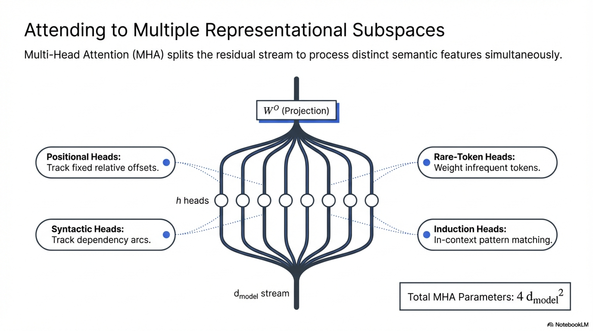

| Circuit | Mechanism | Layers |
|---|---|---|
| **Induction head** | Copies tokens that followed the current token in prior context. Composition of "previous-token head" (layer $l$) + "pattern-matching head" (layer $l' > l$) | Early-Mid |
| **Inhibition head** | Negative OV eigenvalues suppress certain token logits | Varies |
| **Backup heads** | Activate when primary circuit heads are ablated (redundancy) | Parallel |
| **IOI circuit** | Indirect Object Identification — 26 heads across 3 sub-circuits | Multi-layer |

### 7.4 Mathematical Tools for Interpretability

#### 7.4.1 Direct Logit Attribution (DLA)

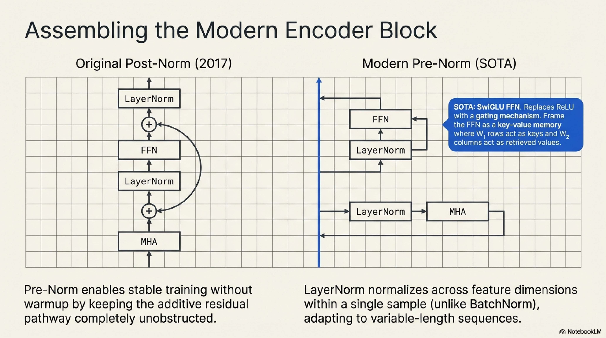


$$\Delta \text{logit}(t)_{\text{head}_{l,h}} = w_t^\top \cdot W^O_{l,h} \cdot \left(\sum_j a_{ij} W^V_{l,h} x_j\right)$$

This scalar quantifies head $(l,h)$'s contribution to the logit of token $t$ at position $i$.

#### 7.4.2 Activation Patching

Replace activation $a$ at a specific component with its value from a **corrupted** (or **clean**) forward pass, measuring the effect on the metric:

$$\Delta \mathcal{L} = \mathcal{L}(\text{with patch}) - \mathcal{L}(\text{original})$$

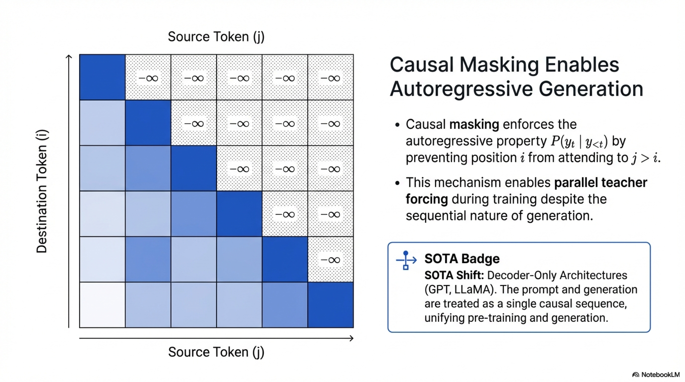


**Causal mediation analysis:** determines which components are causally necessary for a behavior.

#### 7.4.3 Sparse Autoencoders (SAEs) for Feature Extraction

To decompose a residual stream vector $x \in \mathbb{R}^d$ into interpretable features, train an autoencoder with sparsity penalty:

$$f = \text{ReLU}(W_{\text{enc}}(x - b_{\text{dec}}) + b_{\text{enc}}) \in \mathbb{R}^{D}, \quad D \gg d$$

$$\hat{x} = W_{\text{dec}} f + b_{\text{dec}}$$

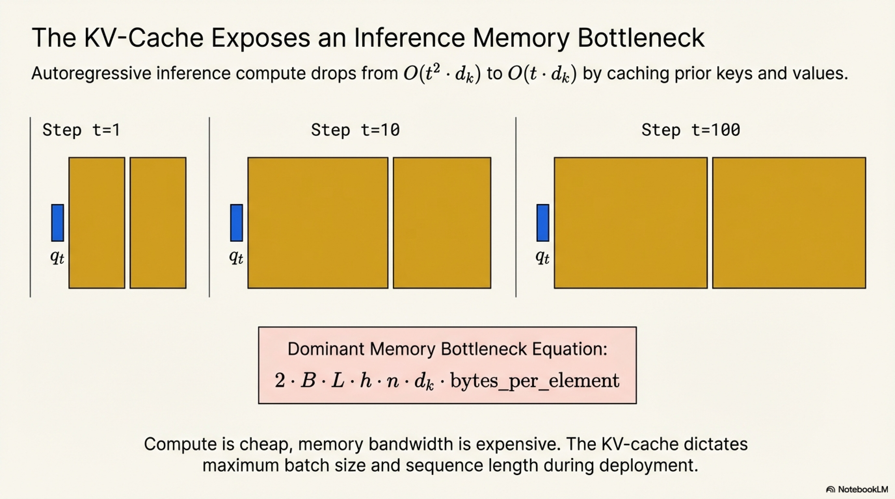


$$\mathcal{L} = \|x - \hat{x}\|_2^2 + \lambda \|f\|_1$$

The $\ell_1$ penalty encourages sparse $f$, where each dimension ideally corresponds to a **monosemantic** feature — a single interpretable concept.

### 7.5 Pseudo-Algorithm: Residual Stream Logit Attribution

```
ALGORITHM: Residual_Stream_Logit_Attribution


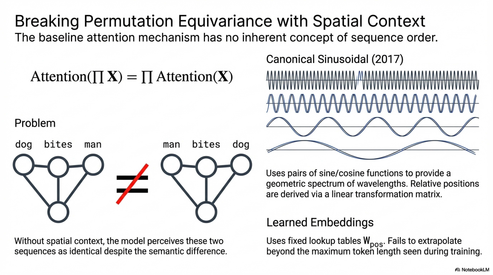

INPUT:
    token_ids    ∈ ℤ^{n}              — input token sequence
    target_pos   ∈ ℤ                  — position at which to analyze predictions
    target_tok   ∈ ℤ                  — token whose logit we decompose
    Model with L layers, each with H heads + 1 MLP

OUTPUT:
    contributions ∈ ℝ^{(2L+1)}       — logit contribution from each component:
                                         [embed, attn_1, mlp_1, ..., attn_L, mlp_L]


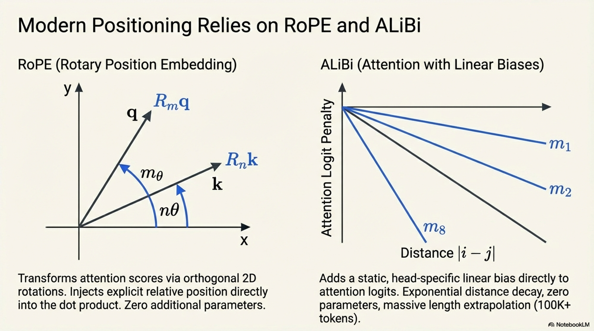

PROCEDURE:
    // Forward pass storing all intermediate writes
    x ← W_E[token_ids] + PE                  // ∈ ℝ^{n × d}
    writes ← [x[target_pos]]                  // embedding contribution

    residual ← x
    FOR l = 1 TO L:
        // Attention sub-layer
        a_l ← Attn_l(LayerNorm(residual))     // ∈ ℝ^{n × d}
        APPEND a_l[target_pos] TO writes

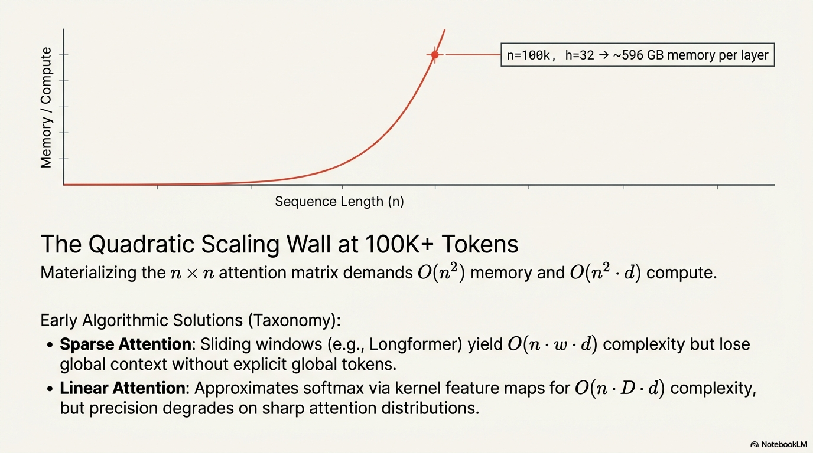

        residual ← residual + a_l

        // MLP sub-layer
        m_l ← MLP_l(LayerNorm(residual))      // ∈ ℝ^{n × d}
        APPEND m_l[target_pos] TO writes
        residual ← residual + m_l
    END FOR

    // Apply final LayerNorm (for Pre-Norm: already applied)
    // Get unembedding direction for target token

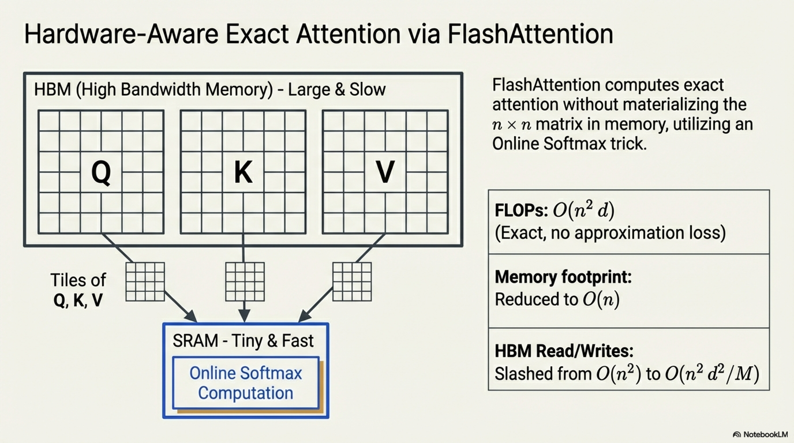

    w_t ← W_U[:, target_tok]                  // ∈ ℝ^{d}

    // Compute per-component logit contributions
    contributions ← empty list
    FOR each write w_i in writes:
        c_i ← w_t^⊤ · w_i                    // scalar: logit contribution
        APPEND c_i TO contributions
    END FOR

    // Verify: sum(contributions) ≈ logit(target_tok)  (up to LayerNorm effects)

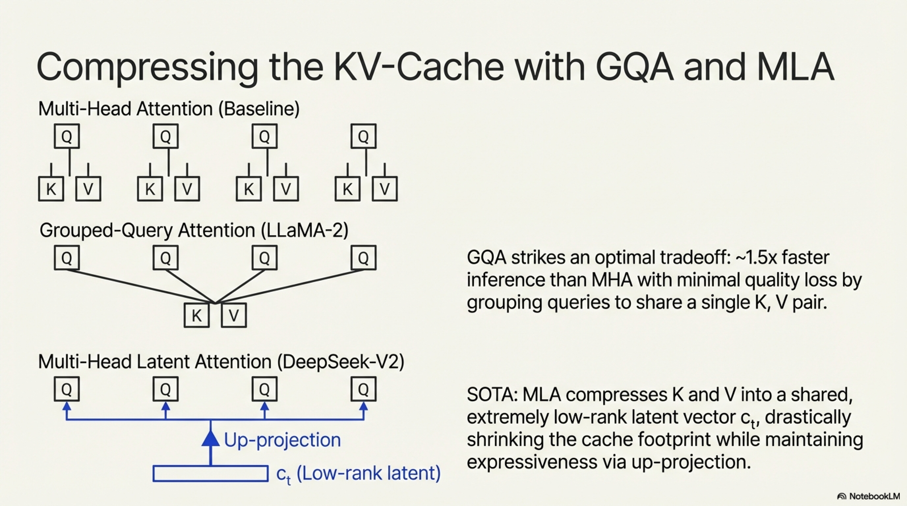


    RETURN contributions
```

### 7.6 Pseudo-Algorithm: Activation Patching

```
ALGORITHM: Activation_Patching

INPUT:
    clean_input     ∈ ℤ^{n}          — input that produces correct behavior
    corrupt_input   ∈ ℤ^{n}          — input that disrupts behavior
    target_component                   — (layer, type, head_idx) to patch
    metric          : logits → ℝ      — scalar evaluation metric

OUTPUT:
    causal_effect   ∈ ℝ              — change in metric from patching

PROCEDURE:
    // Run clean forward, cache all activations
    clean_cache ← ForwardWithCache(clean_input)
    metric_clean ← metric(clean_cache.logits)

    // Run corrupt forward
    metric_corrupt ← metric(Forward(corrupt_input))

    // Run corrupt forward with surgical replacement
    // At target_component, substitute clean activation
    patched_logits ← Forward(corrupt_input,
        hook: at target_component,
              replace activation with clean_cache[target_component])

    metric_patched ← metric(patched_logits)

    // Causal effect: how much does restoring this component recover performance?
    causal_effect ← (metric_patched - metric_corrupt) / (metric_clean - metric_corrupt)
    // 1.0 = fully recovers, 0.0 = no effect

    RETURN causal_effect
```

---

## Summary: Information Flow Through the Complete Transformer

$$\boxed{\text{tokens} \xrightarrow{W_E + \text{PE}} \underbrace{x^{(0)}}_{\text{residual stream}} \xrightarrow[\text{reads/writes}]{\text{Attn}^{(1)}, \text{MLP}^{(1)}} x^{(1)} \xrightarrow{\cdots} x^{(L)} \xrightarrow{W_U} \text{logits} \xrightarrow{\text{softmax}} P(y_t \mid y_{<t})}$$


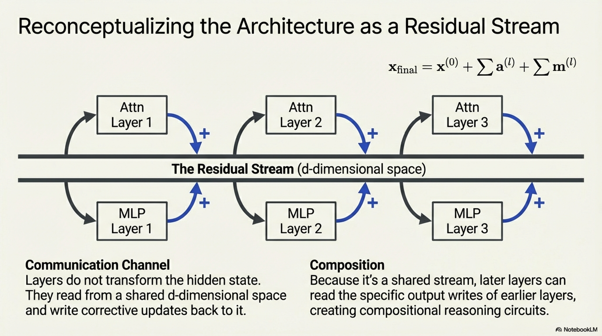

Each layer does **not** transform the representation — it **adds a correction** to the residual stream. The residual stream is the fundamental object; attention and MLPs are **read-process-write** operators on this shared bandwidth. This formulation unifies:


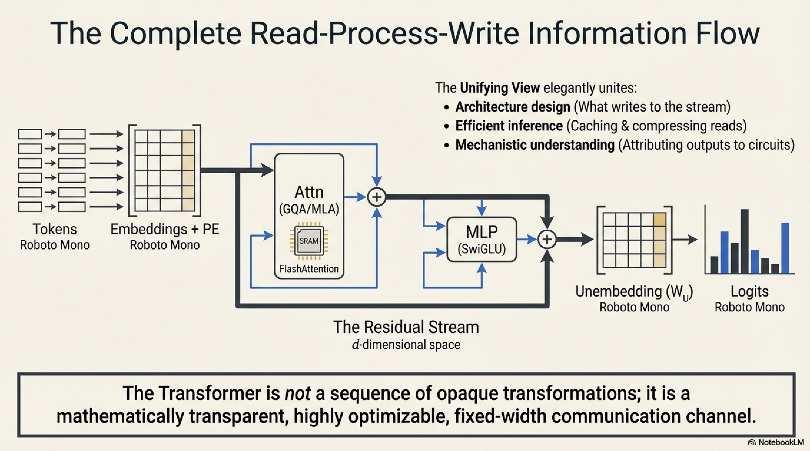

- **Architecture design** (what to add to the stream)
- **Efficient inference** (what can be cached, shared, or pruned)
- **Mechanistic understanding** (which components contribute what to which predictions)
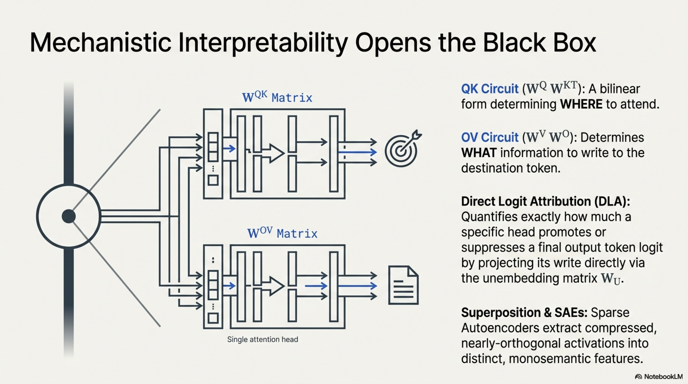

