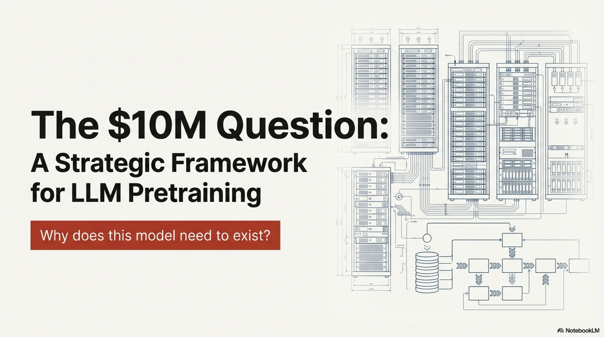

# Strategic Justification for Large Language Model Pretraining: A Decision-Theoretic Framework

---

## 1. Introduction and Motivation

The proliferation of large language models (LLMs) has precipitated a widespread—and frequently unjustified—impulse among research laboratories and industrial organizations to initiate pretraining campaigns from scratch. The availability of GPU clusters, competitive pressure from peer institutions, and the general momentum surrounding generative AI have created an environment in which the most fundamental question is systematically neglected:

> **Why does this model need to exist?**

This report formalizes the decision process that must precede any from-scratch pretraining effort. It establishes a rigorous framework for evaluating whether pretraining is warranted, delineates the conditions under which it is justified, and provides a taxonomy of valid motivations grounded in empirical precedent. The scope explicitly addresses pretraining from random initialization; orthogonal compression methodologies such as knowledge distillation and structured pruning constitute distinct workflows with different cost-benefit profiles and are excluded from this analysis (cf. Muralidharan et al., 2024, *Minitron*).

---

## 2. The Misallocation Problem: Common Anti-Patterns in Training Decisions

### 2.1 Observed Failure Modes

A recurrent pattern in practice follows a characteristic trajectory: an organization secures access to a compute allocation—perhaps $N = 100$ accelerators (e.g., NVIDIA H100 SXM5) for a finite window $T \approx 3$ months—and proceeds directly to training without establishing clear objectives. The downstream consequences are predictable and costly:

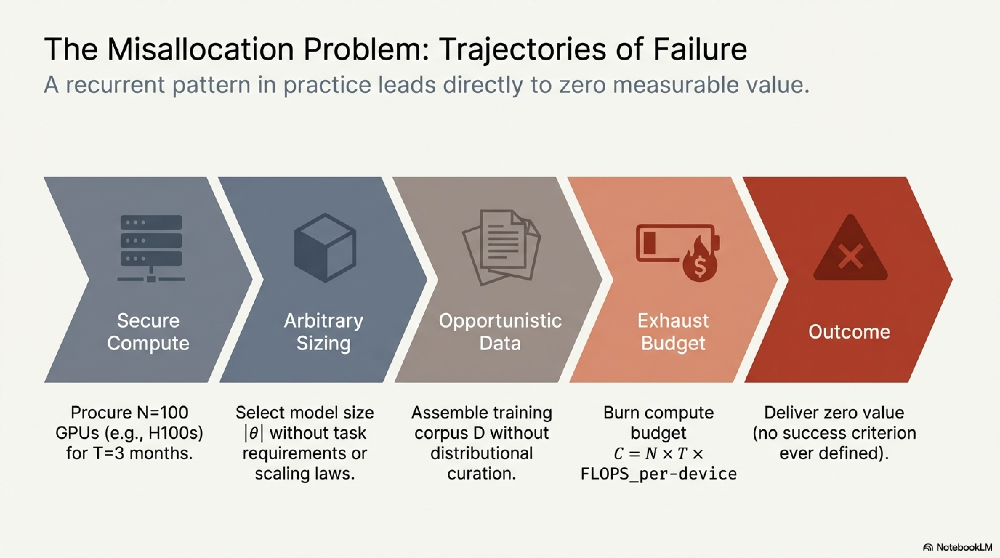

- Model size $|\theta|$ is selected arbitrarily rather than derived from task requirements, scaling laws, or deployment constraints.
- The training corpus $\mathcal{D}$ is assembled opportunistically from available sources rather than curated to satisfy distributional requirements.
- After exhausting the compute budget $C = N \times T \times \text{FLOPS}_{\text{per-device}}$, the resulting checkpoint delivers no measurable value because no success criterion was ever defined.

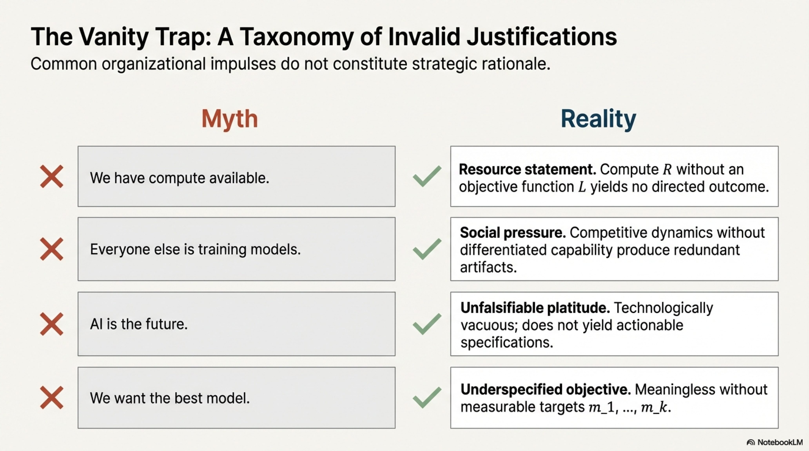

### 2.2 Taxonomy of Invalid Justifications

The following table enumerates commonly invoked justifications that fail to constitute valid strategic rationale for pretraining:

| Stated Justification | Classification | Failure Analysis |
|---|---|---|
| "We have compute available." | Resource statement | Compute availability is a necessary precondition, not a sufficient objective. A resource $R$ without a defined objective function $\mathcal{L}$ to optimize against it yields no directed outcome. |
| "Everyone else is training models." | Social pressure | Peer activity constitutes neither a technical requirement nor a strategic differentiator. Competitive dynamics without differentiated capability produce redundant artifacts. |
| "AI is the future." | Unfalsifiable platitude | Broad technological trends do not decompose into actionable pretraining specifications. The statement is non-falsifiable and therefore scientifically vacuous. |
| "We want the best model possible." | Underspecified objective | Without explicit metrics $m_1, m_2, \ldots, m_k$, target benchmarks, domain constraints, and deployment contexts, "best" is undefined. An objective function $\mathcal{J}(\theta)$ must be measurable to guide architectural and data decisions. |

### 2.3 The Cost of Unexamined Pretraining

The total cost of a pretraining campaign extends far beyond raw compute expenditure. Let the total cost $C_{\text{total}}$ be decomposed as:

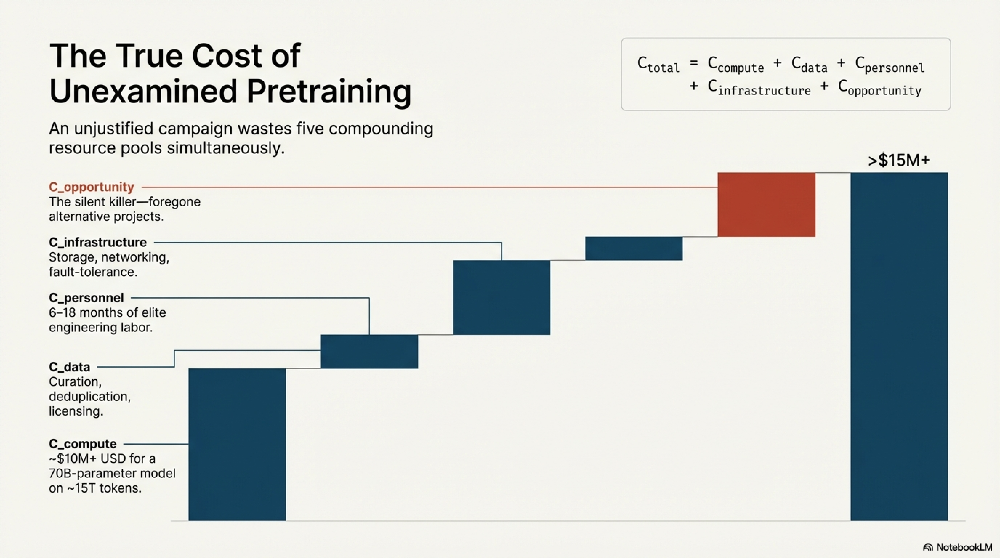

$$
C_{\text{total}} = C_{\text{compute}} + C_{\text{data}} + C_{\text{personnel}} + C_{\text{opportunity}} + C_{\text{infrastructure}}
$$

where:

- $C_{\text{compute}}$: Direct accelerator-hours, interconnect bandwidth, and energy consumption. For a 70B-parameter model trained on $\sim$15T tokens, this can exceed $\$10$M USD at current cloud pricing.
- $C_{\text{data}}$: Curation, cleaning, deduplication, quality filtering, and licensing costs.
- $C_{\text{personnel}}$: Engineering and research labor, often spanning 6–18 months for a full training campaign.
- $C_{\text{opportunity}}$: Foregone alternative projects and research directions.
- $C_{\text{infrastructure}}$: Cluster provisioning, storage, networking, monitoring, and fault-tolerance infrastructure.

An unjustified pretraining campaign wastes all five cost components simultaneously.

---

## 3. Decision Framework: A Hierarchical Evaluation Protocol

### 3.1 Overview

Before initiating any pretraining effort, the following hierarchical decision protocol must be traversed exhaustively. Each stage represents a less resource-intensive alternative to full pretraining, and progression to the next stage is warranted only when the current stage demonstrably fails to satisfy requirements.

The decision procedure follows a strict partial ordering of increasing resource commitment:

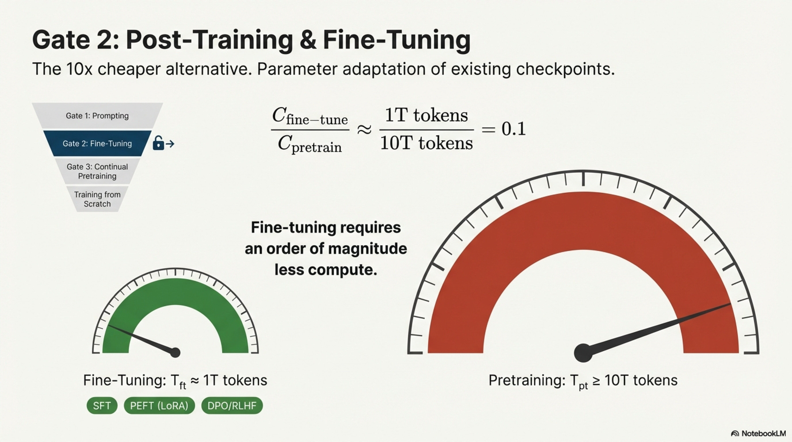

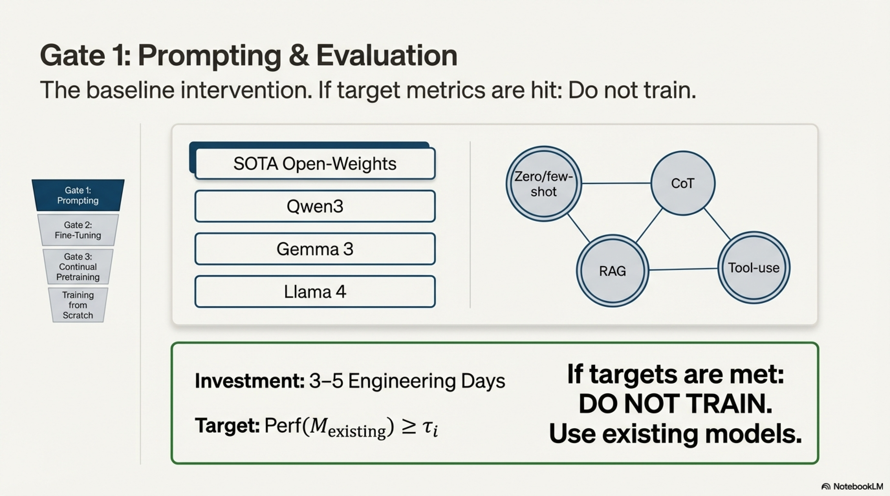

$$
\text{Prompting} \prec \text{Fine-tuning (Post-training)} \prec \text{Continual Pretraining} \prec \text{Training from Scratch}
$$

### 3.2 Stage 1: Evaluation of Existing Models via Prompting

**Protocol.** Select current state-of-the-art (SOTA) open-weight models—e.g., Qwen3 (Qwen Team, 2025), Gemma 3 (Google DeepMind, 2025), Llama 4 (Meta, 2025)—and conduct a systematic evaluation against the target use case using:

- Zero-shot and few-shot prompting
- Chain-of-thought (CoT) prompting (Wei et al., 2022)
- Tool-augmented generation (retrieval-augmented generation, code execution, API calls)
- System-prompt engineering and structured output formatting

**Evaluation Criteria.** Define measurable performance targets $\tau_1, \tau_2, \ldots, \tau_k$ on task-specific benchmarks. If existing models satisfy $\text{Perf}(M_{\text{existing}}) \geq \tau_i$ for all $i \in \{1, \ldots, k\}$, then:

$$
\boxed{\text{Do not train. Use existing models.}}
$$

**Recommended Investment.** Allocate a minimum of 3–5 engineering-days to this evaluation. The cost is negligible relative to pretraining and eliminates a large fraction of unnecessary training campaigns.

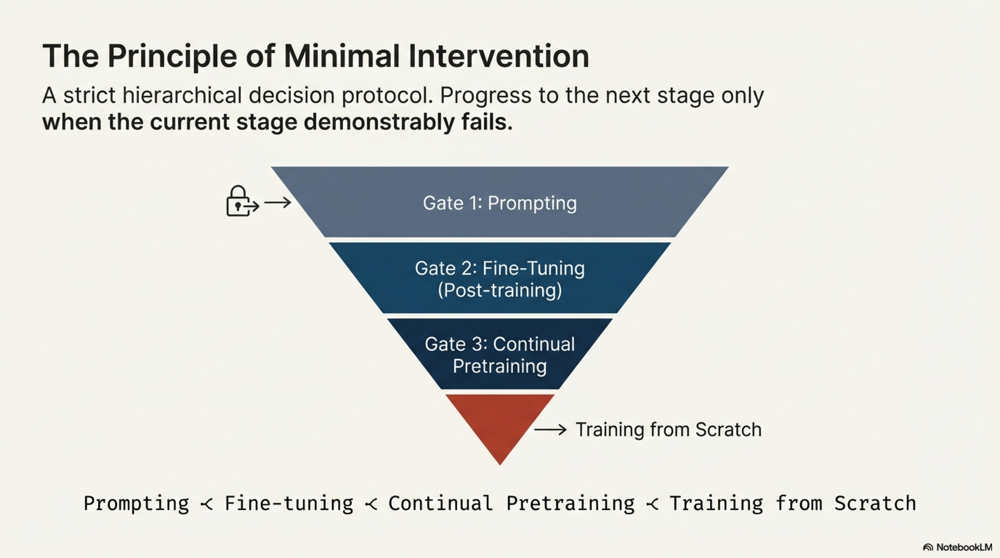

### 3.3 Stage 2: Fine-Tuning and Post-Training

If prompting alone fails to achieve target performance, the next intervention is parameter adaptation of an existing pretrained checkpoint. This encompasses:

1. **Supervised Fine-Tuning (SFT):** Adaptation on task-specific instruction-response pairs $\{(x_i, y_i)\}_{i=1}^{N}$ using the standard autoregressive objective:

$$
\mathcal{L}_{\text{SFT}}(\theta) = -\sum_{i=1}^{N} \sum_{t=1}^{|y_i|} \log P_\theta(y_i^{(t)} \mid x_i, y_i^{(<t)})
$$

2. **Parameter-Efficient Fine-Tuning (PEFT):** Methods such as Low-Rank Adaptation (LoRA) (Hu et al., 2022), which constrains weight updates to a low-rank subspace:

$$
W' = W_0 + \Delta W = W_0 + BA, \quad B \in \mathbb{R}^{d \times r},\; A \in \mathbb{R}^{r \times k},\; r \ll \min(d, k)
$$

3. **Preference Optimization:** Alignment via Direct Preference Optimization (DPO) (Rafailov et al., 2023), Reinforcement Learning from Human Feedback (RLHF) (Ouyang et al., 2022), or Group Relative Policy Optimization (GRPO) (Shao et al., 2024).

4. **Continual Pretraining:** Extended training on domain-specific corpora $\mathcal{D}_{\text{domain}}$ while preserving general capabilities, sometimes referred to colloquially as "mid-training" when the token budget approaches $\sim$1T tokens.

**Critical Cost Comparison.** Fine-tuning a model on $T_{\text{ft}} \approx 1$T tokens is substantially more economical than pretraining from scratch on $T_{\text{pt}} \geq 10$T tokens. The compute cost scales approximately as:

$$
C_{\text{FLOPS}} \approx 6 \times |\theta| \times T
$$

where $|\theta|$ denotes the parameter count and $T$ denotes the token count (Kaplan et al., 2020; Hoffmann et al., 2022). Thus:

$$
\frac{C_{\text{fine-tune}}}{C_{\text{pretrain}}} \approx \frac{T_{\text{ft}}}{T_{\text{pt}}} \approx \frac{1\text{T}}{10\text{T}} = 0.1
$$

Even an exceptionally expensive fine-tuning campaign represents approximately one order of magnitude less compute than from-scratch pretraining. If fine-tuning achieves target performance:

$$
\boxed{\text{Do not train from scratch. Fine-tune or continually pretrain.}}
$$

### 3.4 Stage 3: Training from Scratch

Only upon exhaustive demonstration that Stages 1 and 2 cannot satisfy requirements does from-scratch pretraining become justified. At this stage, the motivation must fall into one of three well-defined categories, elaborated in Section 4.

---

## 4. Valid Justifications for From-Scratch Pretraining

### 4.1 Category I — Research: Hypothesis-Driven Scientific Investigation

#### 4.1.1 Characterization

Research-motivated pretraining is warranted when the objective is to answer a well-defined scientific question that cannot be resolved through fine-tuning or analysis of existing models. The distinguishing characteristic is that the training run itself constitutes the experiment, and the primary output is knowledge rather than a deployable artifact.

#### 4.1.2 Requirements for Valid Research Motivation

A research pretraining campaign must satisfy the following criteria:

1. **Falsifiable Hypothesis.** The research question must be formulated as a testable hypothesis $H_0$ with a corresponding alternative $H_1$. Vague exploratory objectives ("let's see what happens") do not justify the compute expenditure of pretraining.

2. **Necessity of Scale.** The hypothesis must genuinely require pretraining-scale experiments. If the question can be answered at fine-tuning scale or through analytical methods, pretraining is unjustified.

3. **Controlled Experimental Design.** Appropriate baselines, ablation conditions, and controlled variables must be established prior to training.

4. **Defined Success Metrics.** Quantitative criteria for confirming or rejecting $H_0$ must be specified a priori.

#### 4.1.3 Exemplary Research Questions

The following published works illustrate well-formulated research hypotheses that legitimately required pretraining:

| Research Question | Reference | Scale |
|---|---|---|
| Can the Muon optimizer maintain its advantages when scaled to $>$10B parameters? | Jordanetal. (2025), "Muon is Scalable for LLM Training" | 10B+ parameters |
| Can reinforcement learning alone, without SFT, produce emergent reasoning capabilities? | Guo et al. (2025), "DeepSeek-R1" | 671B MoE |
| Can high-quality synthetic textbook data substitute for web-scale corpora in training small models? | Gunasekar et al. (2023), "Textbooks Are All You Need" (Phi-1) | 1.3B parameters |
| Can competitive model performance be achieved using exclusively openly licensed training data? | Soldaini et al. (2024), "The Common Pile v0.1" | 8TB corpus |

#### 4.1.4 Hypothesis Formulation Methodology

The hypothesis should be expressed with maximal specificity. Compare:

- **Weak:** "We want to explore new training methods." → Non-falsifiable; no clear endpoint.
- **Strong:** "Training a 10B-parameter model with optimizer $\mathcal{O}_{\text{new}}$ will achieve loss $\mathcal{L} \leq \mathcal{L}_{\text{AdamW}} - \epsilon$ on a held-out validation set $\mathcal{D}_{\text{val}}$ at equivalent compute budget $C$, where $\epsilon > 0$ represents a statistically significant improvement at significance level $\alpha = 0.05$."

The stronger formulation specifies the model scale, the comparison baseline, the evaluation metric, and the statistical criterion—all prior to the expenditure of compute.

### 4.2 Category II — Production: Operational Necessity

#### 4.2.1 Characterization

Production-motivated pretraining is warranted when an organization has a deployment requirement that demonstrably cannot be met by existing models, even after extensive prompting and fine-tuning (as established by Stage 1 and Stage 2 of the decision framework in Section 3).

#### 4.2.2 Subcategory A: Domain Specificity

**Condition.** The target domain involves data distributions, vocabularies, or structural properties sufficiently divergent from general web text that existing model representations are inadequate.

**Technical Indicators:**

- The domain vocabulary $\mathcal{V}_{\text{domain}}$ has low overlap with standard tokenizer vocabularies, resulting in excessive subword fragmentation and inflated sequence lengths. For a domain-specific token $w$, if the subword decomposition yields $|T(w)| \gg 1$ under a general-purpose tokenizer $T$, then tokenization inefficiency degrades both throughput and representational quality.
- The domain exhibits long-range dependencies at scales beyond the effective context utilization of existing models.
- The semantic structure of the domain (e.g., formal logic in legal texts, molecular grammar in genomics) is not adequately captured by general-purpose pretraining distributions.

**Concrete Examples:**

| Domain | Justification for Custom Pretraining |
|---|---|
| Genomics / DNA modeling | Requires a non-linguistic vocabulary (e.g., $k$-mer tokenization over $\{A, C, G, T\}^k$), long-range dependency modeling over sequences of $10^6$+ base pairs, and structural understanding absent from text corpora. |
| Legal / Regulatory NLP | Demands deep familiarity with jurisdiction-specific statutes, case law citation networks, and domain-specific logical reasoning patterns that are underrepresented in general pretraining corpora. |
| Financial modeling | Requires integration of numerical reasoning, temporal dependencies, domain-specific jargon (e.g., derivatives pricing terminology), and sensitivity to regulatory disclosure requirements. |

#### 4.2.3 Subcategory B: Deployment Constraints

**Condition.** The target deployment environment imposes hardware, latency, memory, or connectivity constraints that cannot be satisfied by any available model, even after quantization and pruning.

**Technical Indicators:**

- **Hardware constraints:** Deployment on non-standard accelerators (e.g., FPGAs, custom ASICs, edge NPUs) requiring architecture modifications incompatible with existing checkpoints.
- **Latency budgets:** Real-time inference requirements $t_{\text{response}} \leq \tau_{\text{latency}}$ that necessitate purpose-built architectures (e.g., state-space models, linear attention variants) rather than dense transformers.
- **Memory envelopes:** Strict DRAM limitations on edge devices (e.g., drones, embedded systems, mobile phones) requiring models with $|\theta| \leq \theta_{\text{max}}$ parameters, where $\theta_{\text{max}}$ is determined by the device memory budget.
- **Connectivity constraints:** Air-gapped or offline deployments precluding API-based solutions.

#### 4.2.4 Subcategory C: Safety, Governance, and Regulatory Compliance

**Condition.** The organization operates in a regulated industry or high-stakes application domain where complete provenance over the training pipeline is a legal or operational requirement.

**Technical and Organizational Indicators:**

- **Data provenance:** Regulatory frameworks (e.g., EU AI Act, HIPAA, SOX) require full auditability of training data, necessitating control over every document in the corpus $\mathcal{D} = \{d_1, d_2, \ldots, d_N\}$ with verifiable licensing and content classification.
- **Behavioral guarantees:** The organization must demonstrate to regulators that specific categories of outputs are prohibited or that the model's behavior satisfies formally specified safety properties.
- **Update cycle control:** Regulatory approval processes require deterministic control over model versioning, and dependence on third-party model providers introduces unacceptable update risk.
- **Intellectual property isolation:** Training on proprietary data that cannot be transmitted to external API providers due to trade secret protections or contractual obligations.

In such cases, from-scratch pretraining may be the only legally and operationally viable path, even when technically sufficient models exist externally.

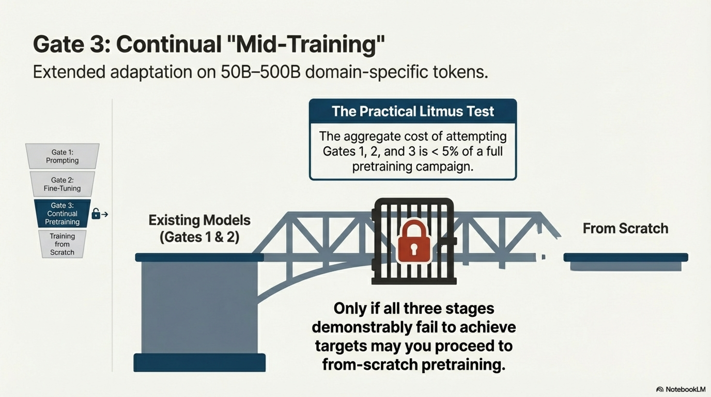

#### 4.2.5 The Practical Litmus Test

Before committing to pretraining for production, execute the following concrete evaluation protocol:

1. Select $\geq$2 current SOTA open-weight models (e.g., Qwen3, Gemma 3).
2. Invest 3–5 engineering-days in systematic prompting, tool-use integration, and RAG-based augmentation.
3. If performance remains below target: invest 1–2 weeks in SFT and/or PEFT on domain-specific data.
4. If performance remains below target: invest 2–4 weeks in continual pretraining on domain-specific corpora ($\sim$50B–500B tokens).
5. **Only if all four stages fail** to achieve performance targets: proceed to from-scratch pretraining.

The aggregate cost of Steps 1–4 is typically $< 5\%$ of a full pretraining campaign and provides strong empirical evidence for or against the necessity of training from scratch.

### 4.3 Category III — Strategic Open Source: Ecosystem Gap-Filling

#### 4.3.1 Characterization

Strategic open-source pretraining is warranted when an organization identifies a concrete, underserved need within the open-weight model ecosystem and possesses the technical capability to address it. The distinguishing feature is that the primary value creation is external: the resulting artifact benefits the broader research and developer community.

#### 4.3.2 Requirements for Valid Strategic Motivation

1. **Identified Gap.** A specific capability, scale point, modality, or language coverage that is absent or inadequately served by existing open-weight models.
2. **Credible Differentiation.** A concrete technical advantage—superior training data, novel training recipes, architectural innovations, or sufficient compute to overtrain at a given scale—that provides reasonable confidence in producing a superior artifact.
3. **Specificity of Objective.** The target must be precise and measurable, not vague aspirations. Compare:
   - **Invalid:** "The best model ever." → Unmeasurable; no clear niche.
   - **Valid:** "The best 3B-parameter model for on-device deployment with 128K-token context." → Specific scale, specific capability, specific deployment target.

#### 4.3.3 Ecosystem Analysis: Identifying Gaps

Systematic gap identification requires mapping the existing open-weight model landscape across multiple dimensions:

$$
\text{Gap}(\mathcal{M}_{\text{existing}}) = \{(s, c, l, m, a) \mid \nexists\; M \in \mathcal{M}_{\text{existing}} : M \text{ satisfies } (s, c, l, m, a)\}
$$

where the dimensions are:

- $s$: Scale (parameter count)
- $c$: Capability profile (reasoning, code, multilingual, long-context, multimodal)
- $l$: Licensing terms (permissive, restricted, fully open including data)
- $m$: Modality (text-only, vision-language, speech, embodied)
- $a$: Architecture class (dense transformer, MoE, SSM, hybrid)

**Example Gaps (Illustrative):**

| Gap Description | Dimensional Coordinates |
|---|---|
| No strong on-device model ($\leq$3B) with $>$128K context and hybrid reasoning | $s \leq 3\text{B}$, $c = \{\text{long-context, reasoning}\}$, $a = \text{dense}$ |
| No competitive multilingual model with strong performance on low-resource languages | $c = \{\text{multilingual, low-resource}\}$ |
| No open-weight interactive world model | $m = \{\text{video, interactive}\}$ |

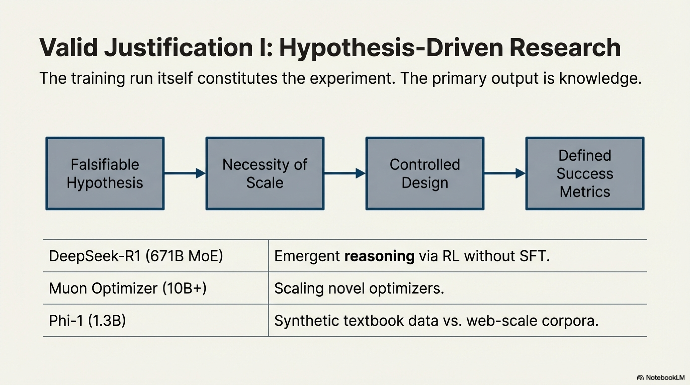

#### 4.3.4 Success Criteria

A strategic open-source release is successful if:

- Developer adoption occurs (measured by downloads, derivative fine-tunes, citations).
- The model becomes infrastructure for downstream applications.
- Technical credibility is established or reinforced for the releasing organization.

Success requires not only scientific rigor but also significant execution experience. Organizations attempting strategic open-source releases without prior pretraining experience face elevated failure risk due to the large number of failure modes in the training pipeline (data quality, hyperparameter selection, training stability, evaluation methodology).

---

## 5. Case Study: Hugging Face's Pretraining Programs

### 5.1 Institutional Rationale

Hugging Face's pretraining efforts provide a longitudinal case study of the strategic open-source motivation applied consistently over five years. The organizational objective can be stated precisely: **produce fully open artifacts (models, datasets, tooling, and documentation) that address underserved needs in the open-source ecosystem.**

A critical distinction separates Hugging Face's approach from the majority of open-weight releases: **full openness**, encompassing not only model weights but also training data, preprocessing code, training configurations, and evaluation protocols. As of the time of writing, only a small number of organizations consistently release at this level of openness, including Ai2 (OLMo) and Stanford's Marin community.

### 5.2 Chronological Program Analysis

The following table traces the sequence of pretraining projects, identifying for each the specific ecosystem gap that motivated the effort:

| Project | Year | Gap Identified | Key Technical Contribution | Scale |
|---|---|---|---|---|
| **BLOOM** (BigScience) | 2022 | No open-weight reproduction of GPT-3 (Brown et al., 2020) existed. Risk of foundational LLM knowledge consolidating exclusively in closed industrial labs. | Community-driven training of a 175B-parameter multilingual autoregressive model. Developed open training stack, multilingual tokenizer, and curated pretraining corpus (ROOTS). | 175B params, 46 languages |
| **StarCoder** (BigCode) | 2023 | OpenAI Codex (Chen et al., 2021) powered GitHub Copilot but was entirely closed-source. No competitive open alternative for code generation existed. | Created The Stack dataset (permissively licensed source code). Trained StarCoder 15B as an open Codex reproduction. Collaboration with ServiceNow. | 15B params |
| **StarCoder2** | 2024 | Post-hoc analysis of StarCoder revealed undertrained regime. Insight that smaller models trained longer may deliver superior value than a single large model. | Trained a model family (3B / 7B / 15B) on multiple trillions of tokens, substantially exceeding prior open code model training budgets. Validated scaling-token tradeoffs for code models. | 3B / 7B / 15B params, multi-trillion tokens |
| **SmolLM** | 2024 | Very few strong small models ($\leq$2B params) existed. FineWeb-Edu dataset (Penedo et al., 2024) provided a uniquely strong pretraining signal. | Trained a family of small models (135M / 360M / 1.7B) optimized for on-device and resource-constrained deployment. | 135M / 360M / 1.7B params |
| **SmolLM2** | 2025 | SmolLM demonstrated viability but left performance headroom. Data quality improvements and extended training durations could yield SOTA small models. | Improved data curation pipeline and extended training token budget. Achieved SOTA performance across multiple small-model benchmarks. | 135M / 360M / 1.7B params |
| **SmolLM3** | 2026 | Community demand for small models with hybrid reasoning, multilingual capability, and long-context support. No existing 3B model combined all three. | Scaled to 3B parameters. Integrated hybrid reasoning (combining fast and slow inference), multilingual support, and extended context window. | 3B params |

### 5.3 Beyond Pretraining: Post-Training and Multimodal Extensions

Hugging Face's contributions extend beyond base model pretraining, following the same gap-identification principle:

| Project | Gap Addressed | Technical Contribution |
|---|---|---|
| **Zephyr** (Tunstall et al., 2023) | Lack of empirical evidence that DPO works effectively at scale for LLM alignment. | Demonstrated DPO-based alignment at scale, establishing it as a viable alternative to PPO-based RLHF. |
| **Open-R1** | DeepSeek-R1's distillation pipeline was documented but not openly reproduced. | Open reproduction of the R1 distillation pipeline, enabling community verification and extension. |
| **OlympicCoder** | No open model achieved SOTA on competitive programming benchmarks (IOI-level). | Achieved SOTA performance on International Olympiad in Informatics benchmarks. |
| **SmolVLM** (Marafioti et al., 2025) | Gap in small, efficient vision-language models for resource-constrained deployment. | Extended the SmolLM paradigm to vision-language multimodal architectures. |
| **SmolVLA** (Shukor et al., 2025) | No small open model for vision-language-action (robotic control) tasks. | Pioneered small-scale VLA models for embodied AI applications. |

### 5.4 Extracted Principles

The Hugging Face case study yields several generalizable principles for strategic pretraining:

1. **Every project began with an identified gap**, not with available compute.
2. **Objectives were specific and measurable**: "the best 3B model for on-device use," not "the best model."
3. **Iterative refinement** (SmolLM → SmolLM2 → SmolLM3; StarCoder → StarCoder2) followed systematic post-hoc analysis of prior runs, not arbitrary repetition.
4. **Full openness**—including data, code, and training details—maximized ecosystem impact and external reproducibility.
5. **Cross-pollination** between pretraining, post-training, and multimodal efforts created compounding value.

---

## 6. Pre-Training Readiness Assessment: A Checklist

Before proceeding to the operational phases of pretraining (data curation, architecture selection, hyperparameter optimization, distributed training), the following readiness conditions must be verified:

### 6.1 Strategic Readiness

| Criterion | Verification Question | Required Evidence |
|---|---|---|
| Justified motivation | Does the project fall into Category I (Research), II (Production), or III (Strategic Open Source)? | Written justification document mapping to one of the three categories. |
| Prompting elimination | Have $\geq$2 SOTA models been evaluated via prompting? | Benchmark results demonstrating failure to meet performance targets. |
| Fine-tuning elimination | Has SFT/PEFT been attempted on the best available base model? | Benchmark results demonstrating failure to meet performance targets post–fine-tuning. |
| Continual pretraining elimination | Has domain-adaptive continual pretraining been attempted? | Benchmark results demonstrating failure to meet performance targets after continual pretraining. |

### 6.2 Technical Readiness

| Criterion | Verification Question |
|---|---|
| Defined success metrics | Are quantitative evaluation metrics $\{m_1, \ldots, m_k\}$ and target thresholds $\{\tau_1, \ldots, \tau_k\}$ specified? |
| Data availability | Is a training corpus of sufficient scale and quality identified, with licensing verified? |
| Compute budget | Is the compute budget $C$ sufficient for the target model size and token count, as estimated by scaling laws? |
| Team capability | Does the team possess demonstrated experience with distributed training, debugging training instabilities (loss spikes, gradient pathologies), and evaluation methodology? |
| Infrastructure readiness | Is the training infrastructure (cluster, storage, networking, checkpointing, monitoring) provisioned and validated? |
| Timeline feasibility | Is the project timeline compatible with the estimated training duration, including contingency for restarts and debugging? |

### 6.3 Risk Assessment

| Risk Category | Mitigation |
|---|---|
| Training instability (loss divergence, gradient explosion) | Implement gradient clipping, learning rate warmup, checkpoint-based restart protocols, and real-time loss monitoring. |
| Data quality degradation | Establish automated data quality auditing pipelines with distributional shift detection. |
| Evaluation overfitting | Define held-out evaluation suites not used during any hyperparameter selection. |
| Compute overrun | Define hard compute budgets with pre-agreed early stopping criteria. |
| Scope creep | Lock the project specification (model size, token budget, evaluation suite) prior to training commencement. |

---

## 7. Decision Summary

The complete decision protocol is summarized by the following formal procedure:

$$
\text{Decision}(\text{use case}) =
\begin{cases}
\text{Use existing model} & \text{if prompting satisfies requirements} \\
\text{Fine-tune existing model} & \text{if SFT/PEFT/RLHF satisfies requirements} \\
\text{Continual pretraining} & \text{if domain adaptation satisfies requirements} \\
\text{Train from scratch} & \text{if } \textbf{all} \text{ of the following hold:} \\
& \quad (a) \text{ Stages 1–3 demonstrably fail} \\
& \quad (b) \text{ Motivation } \in \{\text{Research, Production, Strategic OS}\} \\
& \quad (c) \text{ Readiness criteria (§6) are satisfied}
\end{cases}
$$

The fundamental principle is one of **minimal intervention**: adopt the least resource-intensive approach that satisfies requirements, and escalate only upon empirical demonstration of failure at each preceding stage.

---

## 8. Conclusion

The decision to pretrain a large language model from scratch represents one of the highest-commitment choices in applied AI, with costs spanning compute, data engineering, personnel, infrastructure, and opportunity. This report has established that the vast majority of use cases can be adequately served by prompting, fine-tuning, or continual pretraining of existing open-weight models—approaches that are one to two orders of magnitude less expensive than from-scratch training.

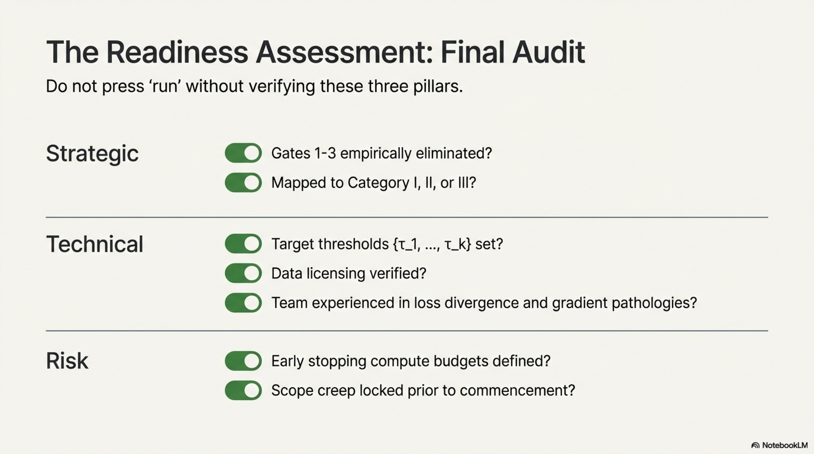

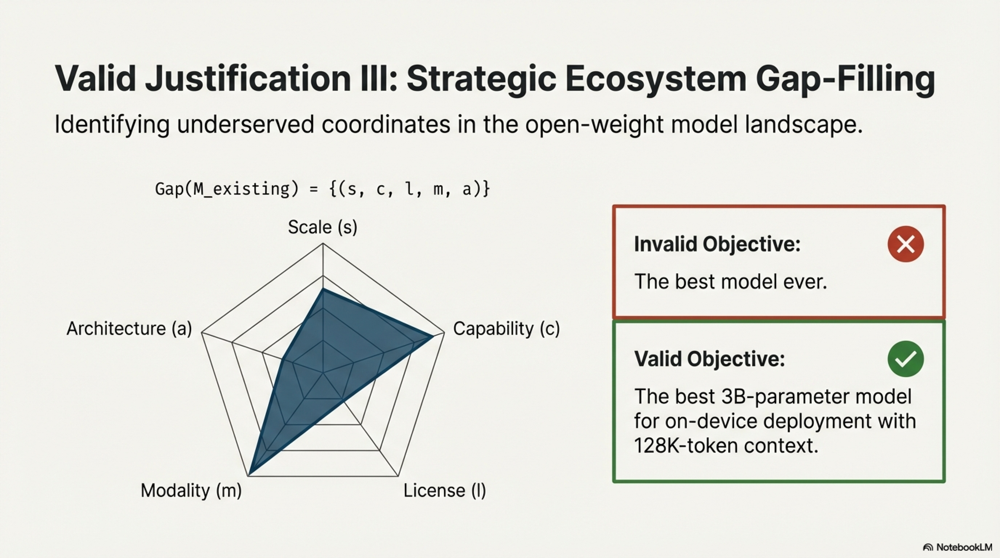

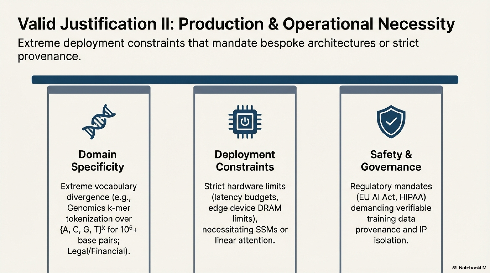

When from-scratch pretraining is genuinely warranted, it falls into precisely three categories: **(I)** hypothesis-driven research requiring pretraining-scale experiments, **(II)** production deployments with domain, hardware, or regulatory constraints that existing models cannot satisfy, and **(III)** strategic open-source contributions that address a concrete, verified gap in the ecosystem.

The Hugging Face case study demonstrates that sustained, impactful pretraining programs are built on disciplined gap identification, specific and measurable objectives, iterative refinement informed by rigorous post-hoc analysis, and a commitment to full openness. Organizations that internalize this decision framework will allocate their resources toward pretraining efforts that produce genuine scientific or operational value, rather than contributing to the growing surplus of redundant, unmotivated model checkpoints.

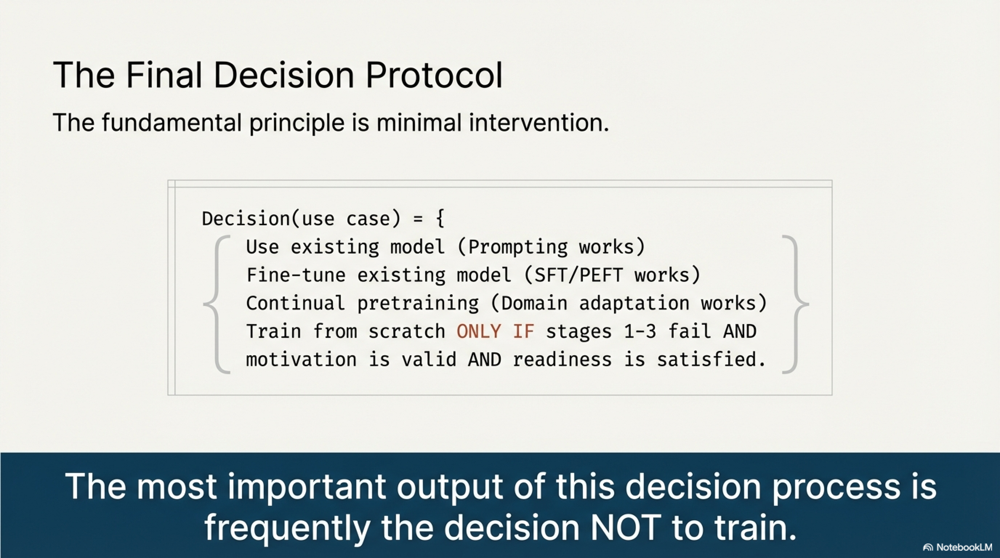

> **The most important output of this decision process is frequently the decision not to train.**

---

## References

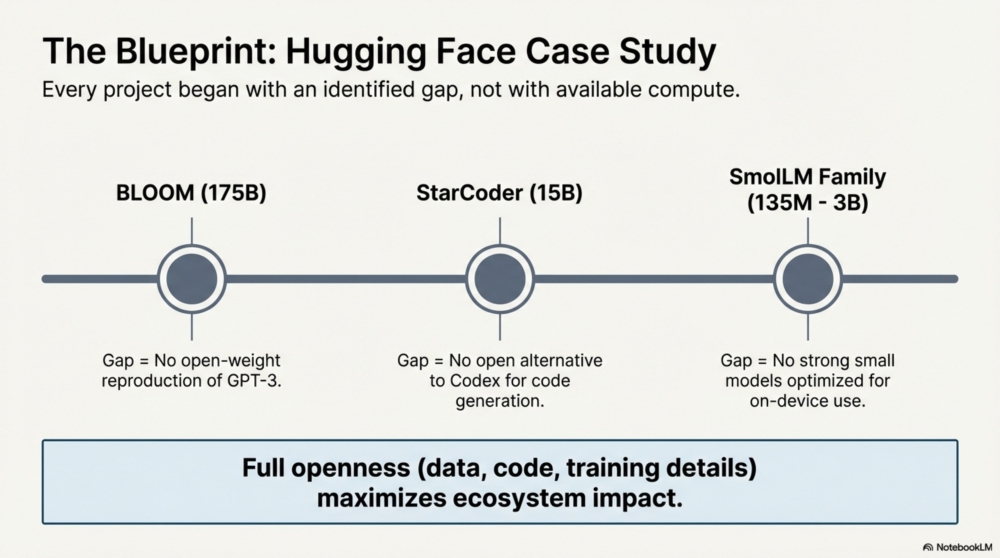

- Allal, L. B. et al. (2025). SmolLM2: Smol Models for the Masses. *Hugging Face Technical Report.*
- Brown, T. B. et al. (2020). Language Models are Few-Shot Learners. *NeurIPS 2020.*
- Chen, M. et al. (2021). Evaluating Large Language Models Trained on Code. *arXiv:2107.03374.*
- Gunasekar, S. et al. (2023). Textbooks Are All You Need. *arXiv:2306.11644.*
- Guo, D. et al. (2025). DeepSeek-R1: Incentivizing Reasoning Capability in LLMs via Reinforcement Learning. *arXiv:2501.12948.*
- Hoffmann, J. et al. (2022). Training Compute-Optimal Large Language Models. *NeurIPS 2022.*
- Hu, E. J. et al. (2022). LoRA: Low-Rank Adaptation of Large Language Models. *ICLR 2022.*
- Jordan, K. et al. (2025). Muon is Scalable for LLM Training. *arXiv:2502.16982.*
- Kaplan, J. et al. (2020). Scaling Laws for Neural Language Models. *arXiv:2001.08361.*
- Li, R. et al. (2023). StarCoder: May the Source Be with You! *arXiv:2305.06161.*
- Lozhkov, A. et al. (2024). StarCoder 2 and The Stack v2. *arXiv:2402.19173.*
- Marafioti, A. et al. (2025). SmolVLM: Small Vision Language Models. *Hugging Face Technical Report.*
- Muralidharan, S. et al. (2024). Compact Language Models via Pruning and Knowledge Distillation (Minitron). *arXiv:2407.14679.*
- Ouyang, L. et al. (2022). Training Language Models to Follow Instructions with Human Feedback. *NeurIPS 2022.*
- Penedo, G. et al. (2024). FineWeb-Edu: The Finest Collection of Educational Content. *Hugging Face Technical Report.*
- Rafailov, R. et al. (2023). Direct Preference Optimization: Your Language Model is Secretly a Reward Model. *NeurIPS 2023.*
- Shao, Z. et al. (2024). DeepSeekMath: Pushing the Limits of Mathematical Reasoning in Open Language Models. *arXiv:2402.03300.*
- Shukor, M. et al. (2025). SmolVLA: A Small Vision-Language-Action Model for Robotics. *Hugging Face Technical Report.*
- Soldaini, L. et al. (2024). The Common Pile v0.1. *Technical Report.*
- Tunstall, L. et al. (2023). Zephyr: Direct Distillation of LM Alignment. *arXiv:2310.16944.*
- Wei, J. et al. (2022). Chain-of-Thought Prompting Elicits Reasoning in Large Language Models. *NeurIPS 2022.*