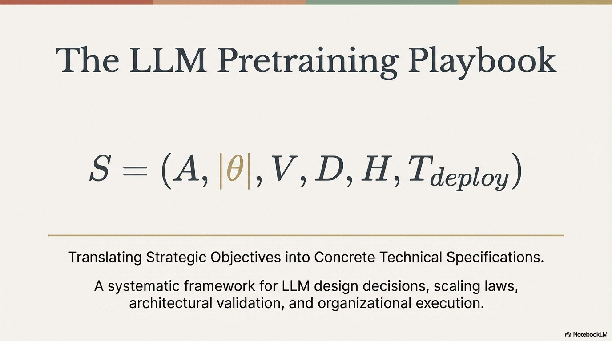

# Translating Strategic Objectives into Technical Specifications: A Systematic Framework for LLM Design Decisions

---


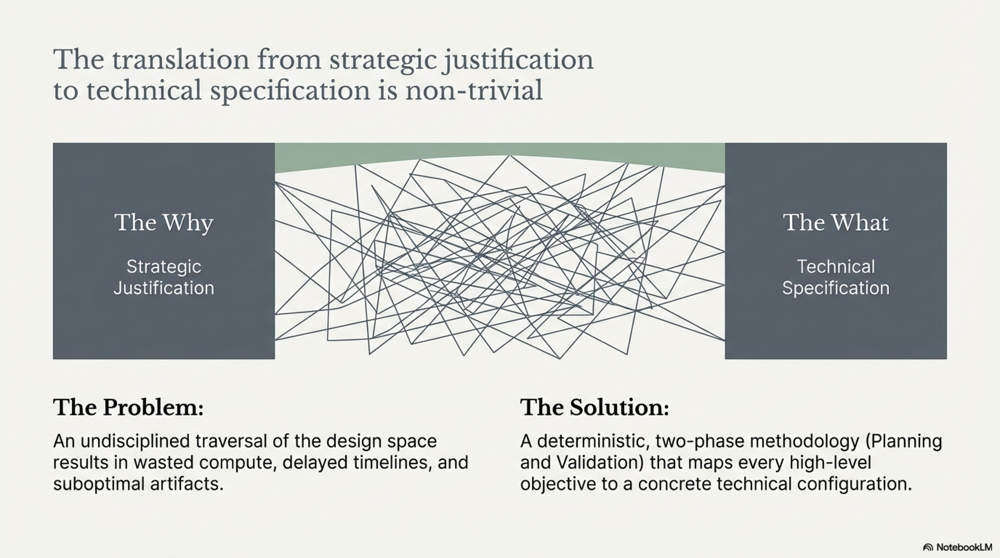

## 1. Introduction: From Strategic Justification to Technical Specification

Once the strategic justification for pretraining has been established (the *why*), the immediate successor problem is the translation of that justification into a concrete set of technical specifications (the *what*). This translation is non-trivial: the space of possible design choices is combinatorially vast, spanning model architecture class, parameter count, attention mechanisms, positional encodings, vocabulary design, data mixture composition, and training hyperparameters. An undisciplined traversal of this space results in wasted compute, delayed timelines, and suboptimal artifacts.

This report formalizes the decision process that maps high-level objectives to concrete technical configurations. It establishes a two-phase methodology—**Planning** and **Validation**—and identifies the organizational and operational factors that empirically distinguish successful pretraining teams from unsuccessful ones.

---


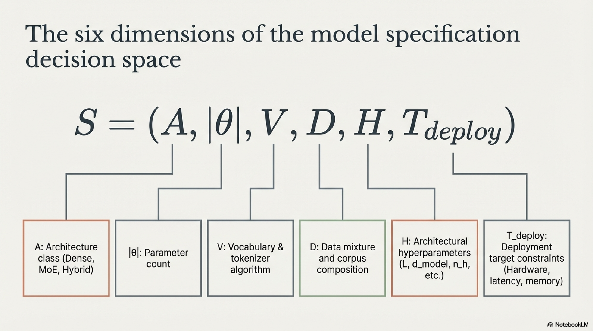

## 2. The Decision Space: Dimensions of Model Specification

### 2.1 Taxonomy of Design Decisions

The complete specification of a pretraining campaign requires decisions across the following orthogonal dimensions:

$$
\mathcal{S} = (\mathcal{A}, |\theta|, \mathcal{V}, \mathcal{D}, \mathcal{H}, \mathcal{T}_{\text{deploy}})
$$

where:

| Symbol | Dimension | Description |
|---|---|---|
| $\mathcal{A}$ | Architecture class | Dense transformer, Mixture-of-Experts (MoE), hybrid (transformer + SSM), novel architectures |
| $|\theta|$ | Model size | Total parameter count and its decomposition across layers, heads, and expert modules |
| $\mathcal{V}$ | Vocabulary & tokenizer | Tokenizer algorithm (BPE, Unigram, SentencePiece), vocabulary size $|\mathcal{V}|$, language coverage |
| $\mathcal{D}$ | Data mixture | Corpus composition, domain proportions, quality filtering thresholds, deduplication strategy |
| $\mathcal{H}$ | Architectural hyperparameters | Number of layers $L$, hidden dimension $d_{\text{model}}$, number of attention heads $n_h$, head dimension $d_h$, intermediate FFN dimension $d_{\text{ff}}$, positional encoding scheme, normalization strategy, activation functions |
| $\mathcal{T}_{\text{deploy}}$ | Deployment target | Hardware constraints, latency budget, memory envelope, throughput requirements |

### 2.2 Use-Case-Driven Decision Derivation

The central principle governing the *what* is that **every technical decision must trace back to a constraint or objective established in the *why***. The mapping is not arbitrary—it follows deterministic or strongly constrained inference paths from use-case requirements to architectural choices.

The following table establishes canonical mappings from common strategic objectives to their implied technical specifications:


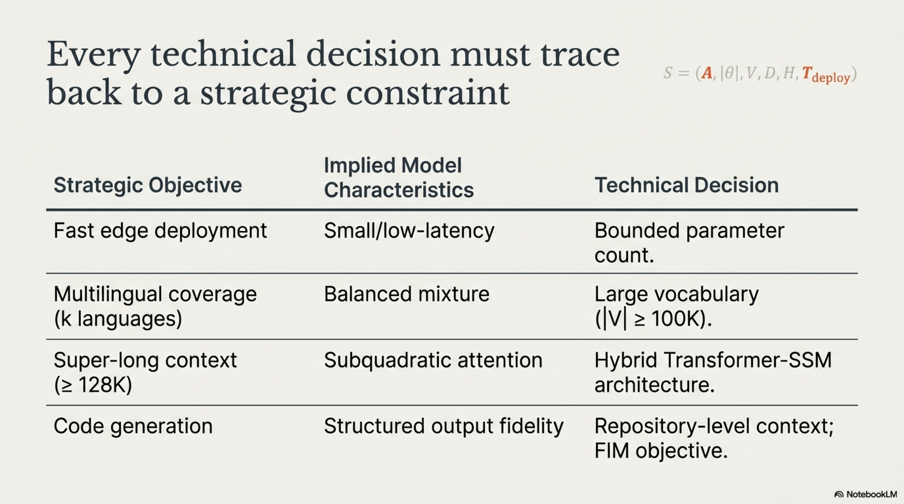

| Strategic Objective | Implied Model Characteristics | Key Technical Decisions |
|---|---|---|
| Fast inference on edge/on-device deployment | Small, efficient, low-latency model | $|\theta| \leq 3\text{B}$; dense architecture preferred (simpler inference kernel); aggressive quantization compatibility (INT4/INT8); grouped-query attention (GQA) or multi-query attention (MQA) for reduced KV-cache; shallow-wide vs. deep-narrow tradeoff analysis |
| Multilingual coverage across $k$ languages | Large tokenizer vocabulary; balanced data mixture | $|\mathcal{V}| \geq 100\text{K}$ tokens to ensure adequate fertility across scripts; language-balanced sampling strategy $p(l_i) \propto n_i^\alpha$ with temperature $\alpha \in (0, 1)$; evaluation on per-language benchmarks |
| Super-long context ($\geq 128\text{K}$ tokens) | Subquadratic or hybrid attention; efficient positional encoding | Hybrid architecture (e.g., transformer layers interleaved with state-space model (SSM) layers such as Mamba); RoPE with frequency scaling or NTK-aware interpolation; sliding window attention + global attention hybrid; ring attention or sequence parallelism for training |
| State-of-the-art reasoning | Sufficient model capacity; high-quality reasoning data | $|\theta| \geq 7\text{B}$ (empirically, reasoning capabilities emerge at scale); chain-of-thought data in pretraining mixture; potential MoE architecture for parameter efficiency at high total parameter count; reinforcement learning post-training (GRPO, PPO) |
| Code generation | Code-heavy data mixture; structured output fidelity | Repository-level context in training data; fill-in-the-middle (FIM) objective alongside standard autoregressive loss; code-specific tokenizer vocabulary entries; evaluation on HumanEval, MBPP, SWE-bench |
| Regulated/auditable deployment | Full data provenance; deterministic behavior | Fully documented training corpus with per-document licensing; deterministic training with fixed seeds where feasible; version-controlled model lineage; safety-constrained post-training |

### 2.3 Decisions for Training Optimization

Beyond use-case-driven decisions, a second class of design choices optimizes the training process itself along three axes:

1. **Training Stability:** Choices that reduce the probability of loss divergence, gradient explosion, or training collapse.
2. **Sample Efficiency:** Choices that maximize capability gain per training token.
3. **Throughput:** Choices that maximize tokens processed per unit wall-clock time.

These training-optimization decisions are partially orthogonal to use-case decisions and partially interact with them:

| Training Optimization Axis | Relevant Design Choices | Technical Details |
|---|---|---|
| **Stability** | Pre-normalization (Pre-LN vs. Post-LN); QK-normalization; $\mu$P or maximal update parametrization; careful initialization; z-loss regularization | Pre-LayerNorm applies normalization before attention and FFN sublayers: $x_{l+1} = x_l + \text{Sublayer}(\text{LN}(x_l))$, yielding more stable gradient flow than Post-LN. QK-normalization prevents attention logit growth: $\text{Attn}(Q,K,V) = \text{softmax}\left(\frac{\text{LN}(Q) \cdot \text{LN}(K)^T}{\sqrt{d_h}}\right) V$. |
| **Sample Efficiency** | Data quality filtering; curriculum learning; optimal data mixing; architectural capacity allocation | Higher-quality data subsets (e.g., FineWeb-Edu) empirically yield superior downstream performance per token. Optimal data mixing seeks weights $\{w_i\}_{i=1}^{D}$ over $D$ domains to minimize validation loss: $\min_{\{w_i\}} \mathcal{L}_{\text{val}}(\theta^*(\{w_i\}))$. |
| **Throughput** | FlashAttention; activation checkpointing; mixed-precision training (BF16/FP8); tensor/pipeline/data/context parallelism; fused kernels | FlashAttention reduces attention memory from $O(n^2)$ to $O(n)$ and improves wall-clock speed by minimizing HBM reads. FP8 training (E4M3 forward, E5M2 backward) on Hopper GPUs approximately doubles arithmetic throughput vs. BF16. |

---

## 3. The Decision Methodology: Planning and Validation

### 3.1 Phase I — Planning: Constraint-to-Specification Mapping

#### 3.1.1 Objective

The planning phase systematically maps every constraint from the strategic justification (*why*) to a concrete specification or a bounded range of candidate specifications in the design space $\mathcal{S}$.

#### 3.1.2 Protocol

The planning protocol proceeds through the following steps:

**Step 1: Enumerate Constraints.** Extract all hard constraints from the strategic justification and classify them:

$$
\mathcal{C} = \mathcal{C}_{\text{hard}} \cup \mathcal{C}_{\text{soft}}
$$

- $\mathcal{C}_{\text{hard}}$: Non-negotiable requirements (e.g., "model must fit in 4GB VRAM at INT4 quantization," "latency $< 50$ms per token on target hardware," "must support Japanese and Korean").
- $\mathcal{C}_{\text{soft}}$: Desirable properties that can be traded off (e.g., "prefer strong mathematical reasoning," "should handle 64K context if possible").

**Step 2: Derive Model Size Bounds.** Deployment constraints directly determine upper bounds on parameter count. For a target device with memory budget $M_{\text{device}}$ and a quantization scheme that uses $b$ bits per parameter:

$$
|\theta|_{\text{max}} = \frac{M_{\text{device}} - M_{\text{KV}} - M_{\text{activation}} - M_{\text{overhead}}}{b / 8}
$$

where $M_{\text{KV}}$ is the KV-cache memory (dependent on context length, batch size, number of KV heads, and head dimension), $M_{\text{activation}}$ accounts for intermediate activation storage during inference, and $M_{\text{overhead}}$ is OS and runtime overhead.

For example, a 4GB edge device at INT4 ($b = 4$) with $\sim$1GB reserved for KV-cache and overhead yields:

$$
|\theta|_{\text{max}} \approx \frac{3 \times 10^9 \text{ bytes}}{0.5 \text{ bytes/param}} = 6 \times 10^9 = 6\text{B parameters}
$$

**Step 3: Determine Compute-Optimal Token Budget.** Given a fixed compute budget $C$ (in FLOPS) and a target model size $|\theta|$, the Chinchilla scaling law (Hoffmann et al., 2022) provides the compute-optimal token count $T^*$:

$$
C \approx 6 \times |\theta| \times T
$$

$$
T^* = \frac{C}{6 \times |\theta|}
$$


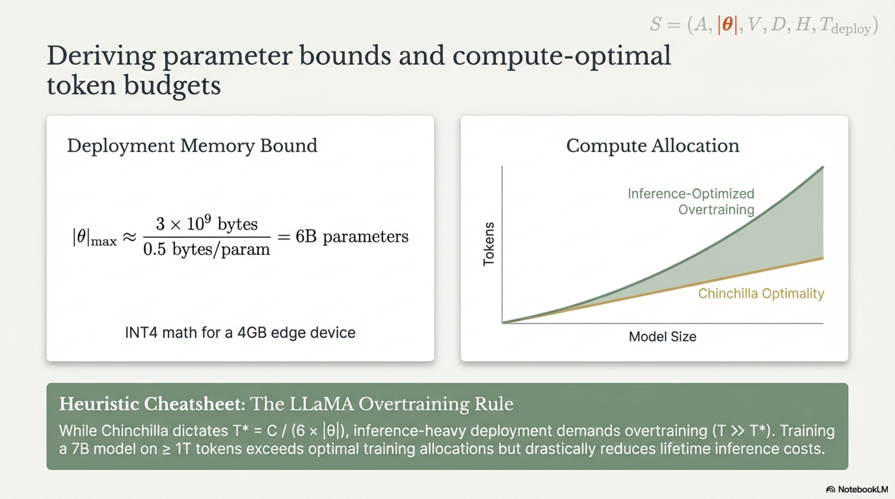

However, for inference-heavy deployment scenarios, **overtraining**—training on $T \gg T^*_{\text{Chinchilla}}$ tokens—is standard practice. The rationale is that inference cost scales with $|\theta|$ (not $T$), so training a smaller model for longer reduces lifetime deployment cost. The LLaMA scaling approach (Touvron et al., 2023) and subsequent work have demonstrated that training 7B-parameter models on $\geq$1T tokens substantially exceeds Chinchilla-optimal allocations but yields superior inference-time performance per FLOP.

**Step 4: Map Capabilities to Architecture Class.** Based on the required capability profile, select the architecture class:

| Required Capability Profile | Recommended Architecture Class | Rationale |
|---|---|---|
| General-purpose, moderate context ($\leq$8K) | Dense transformer | Simplest training and inference pipeline; well-understood scaling behavior; mature tooling ecosystem. |
| High parameter count with inference budget constraints | Mixture-of-Experts (MoE) | Decouples total parameter count from per-token compute: only $k$ of $E$ experts activate per token. Active parameters per forward pass: $|\theta_{\text{active}}| = |\theta_{\text{shared}}| + k \times |\theta_{\text{expert}}|$, where $k \ll E$. Enables larger effective capacity at fixed inference FLOPS. |
| Very long context ($\geq 128$K tokens) | Hybrid transformer-SSM | Pure self-attention scales as $O(n^2)$ in sequence length $n$, even with FlashAttention (which reduces memory but not FLOPS). Hybrid architectures interleave transformer layers (for high-resolution local and global attention) with SSM layers (e.g., Mamba, which processes in $O(n)$) to amortize the quadratic cost. |
| Novel research hypothesis | Problem-dependent | Architecture selection is itself the variable under investigation. The choice must be determined by the research hypothesis. |

**Step 5: Map Language/Domain Requirements to Vocabulary Design.** Tokenizer vocabulary size $|\mathcal{V}|$ directly impacts:

- **Fertility** (tokens per word): lower fertility → shorter sequences → faster training and inference.
- **Embedding table size**: $|\mathcal{V}| \times d_{\text{model}}$ parameters in the embedding matrix, which for large vocabularies can constitute a significant fraction of total parameter count, especially in small models.
- **Multilingual coverage**: inadequate vocabulary size results in disproportionate fertility inflation for underrepresented scripts.

The tradeoff is governed by the compression-capacity balance:

$$
\text{Effective sequence length} = \frac{\text{Text length (chars)}}{f(\mathcal{V})}
$$

where $f(\mathcal{V})$ is the average fertility (characters per token) under vocabulary $\mathcal{V}$. Larger $|\mathcal{V}|$ reduces fertility but increases embedding parameters. For multilingual models spanning $k$ languages with diverse scripts, empirical best practice sets $|\mathcal{V}| \geq 100\text{K}$ (e.g., Qwen3 uses 151,936 tokens; Gemma 3 uses 262,144 tokens).

**Step 6: Map Domain to Data Mixture.** Define the domain-weight vector $\mathbf{w} = (w_1, w_2, \ldots, w_D)$ over $D$ data domains, subject to:

$$
\sum_{i=1}^{D} w_i = 1, \quad w_i \geq 0 \;\;\forall i
$$

Initial mixture weights are derived from:

- **Capability requirements:** If code generation is a primary objective, $w_{\text{code}}$ must be substantially elevated (e.g., $w_{\text{code}} \geq 0.2$).
- **Domain coverage:** Underrepresented but critical domains require upsampling relative to their natural prevalence in web-crawled data.
- **Quality stratification:** Within each domain, quality-filtered subsets (e.g., educational-grade text) may receive higher sampling weight.

These initial weights serve as the starting point for the Validation phase.

#### 3.1.3 Planning Phase Output

The output of the planning phase is a **candidate specification vector** $\mathcal{S}_0 = (\mathcal{A}_0, |\theta|_0, \mathcal{V}_0, \mathcal{D}_0, \mathcal{H}_0, \mathcal{T}_{\text{deploy}})$ together with a **ranked list of uncertain decisions** requiring experimental validation.

### 3.2 Phase II — Validation: Systematic Ablation and Experimental Verification

#### 3.2.1 Objective

The validation phase resolves the uncertain decisions identified during planning through controlled experimentation. The primary tool is the **ablation study**: a systematic protocol in which a single design variable is modified while all others are held fixed, and the resulting impact on a defined evaluation metric is measured.

#### 3.2.2 The Ablation Principle

An ablation study for decision variable $v_j$ computes:

$$
\Delta \mathcal{L}_j = \mathcal{L}(\mathcal{S}_0^{(v_j = a)}) - \mathcal{L}(\mathcal{S}_0^{(v_j = b)})
$$

where $\mathcal{L}$ is the evaluation loss (or a downstream metric), and $a, b$ are candidate values of variable $v_j$. All other variables in $\mathcal{S}_0$ remain fixed. The ablation is conducted at reduced scale (smaller model, shorter training) under the assumption that relative orderings of design choices are preserved across scales—an assumption that must itself be validated for critical decisions (see Section 3.2.4).

#### 3.2.3 Prioritization: What Is Worth Testing

A central principle—often neglected in practice—is that the prioritization of ablation targets is as consequential as the quality of the ablations themselves:


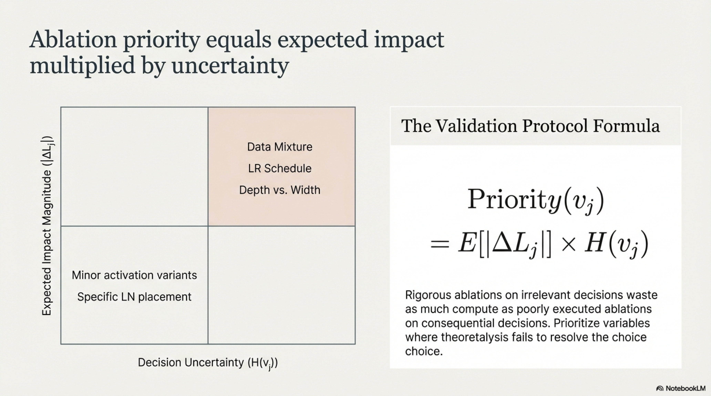

> **Rigorous ablations on irrelevant decisions waste as much compute as poorly executed ablations on consequential decisions.**

Ablation priority should be assigned based on two factors:

1. **Expected Impact Magnitude.** The estimated effect size $|\Delta \mathcal{L}_j|$ of the decision variable on the target metric. High-impact decisions include data mixture composition, learning rate schedule, and model depth-vs-width ratio. Low-impact decisions include minor activation function variants or specific normalization layer placement (when both Pre-LN options are considered).

2. **Decision Uncertainty.** The degree to which prior literature and theoretical analysis fail to resolve the choice. If extensive prior work consistently demonstrates that choice $a$ dominates choice $b$, ablation compute is better allocated elsewhere.

The prioritization function can be expressed as:

$$
\text{Priority}(v_j) = \mathbb{E}[|\Delta \mathcal{L}_j|] \times H(v_j)
$$

where $H(v_j)$ denotes the entropy (uncertainty) over the candidate values of decision $v_j$. Decisions with both high expected impact and high uncertainty receive the highest ablation priority.

#### 3.2.4 Scale Transfer Validity

Ablations are typically conducted at reduced scale for computational tractability. A common protocol uses models at $\frac{1}{10}$ to $\frac{1}{100}$ of the target parameter count, trained for a proportionally reduced number of tokens. However, not all findings transfer across scales:

- **Findings that typically transfer:** Relative ordering of data mixtures, tokenizer fertility comparisons, learning rate schedule shapes (after appropriate rescaling), normalization strategies.
- **Findings that may not transfer:** Optimal model depth-to-width ratio, specific MoE routing strategies, the onset of emergent capabilities, interaction effects between multiple simultaneous architectural modifications.

For decisions where scale-transfer validity is uncertain, a **multi-scale validation ladder** is employed:

$$
\text{Scale}_1 \rightarrow \text{Scale}_2 \rightarrow \cdots \rightarrow \text{Scale}_{\text{target}}
$$


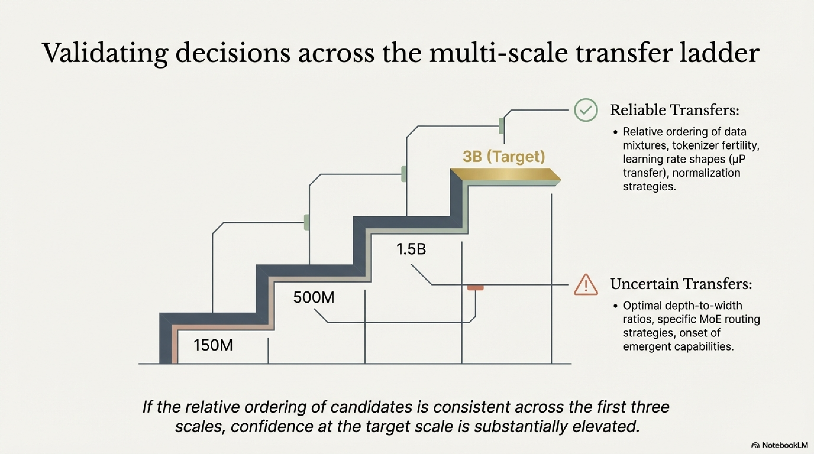

For example: validate at 150M → 500M → 1.5B → 3B (target). If the relative ordering of candidates is consistent across the first three scales, confidence in the decision at target scale is substantially elevated.

#### 3.2.5 Key Ablation Categories

The following table enumerates the principal categories of ablation experiments and their associated decision variables:

| Ablation Category | Decision Variables | Evaluation Protocol |
|---|---|---|
| **Data mixture** | Domain weights $\{w_i\}$, quality thresholds, deduplication aggressiveness | Train matched models on different mixtures; evaluate on domain-specific and general benchmarks. This is typically the highest-priority ablation category. |
| **Architecture** | Depth $L$ vs. width $d_{\text{model}}$; GQA vs. MHA vs. MQA; FFN type (SwiGLU, GeGLU); with/without SSM layers | Train matched models with identical parameter budgets but different structural allocations; evaluate loss and downstream task performance. |
| **Tokenizer** | Vocabulary size $|\mathcal{V}|$; BPE vs. Unigram; byte-level fallback | Measure fertility across target languages/domains; evaluate downstream performance with matched training compute (note: changing the tokenizer changes the effective number of "semantic tokens" per compute unit). |
| **Positional encoding** | RoPE base frequency; ALiBi; NoPE; learned absolute | Evaluate perplexity as a function of sequence length, particularly at lengths exceeding training context. |
| **Learning rate & schedule** | Peak LR; warmup duration; decay shape (cosine, WSD, linear); cooldown | Critical for training stability and final performance. Requires careful sweep; $\mu$P (Yang et al., 2022) can reduce the search cost by enabling LR transfer across scales. |
| **Batch size schedule** | Initial vs. final batch size; ramp-up profile | Affects early training stability and late-stage convergence. |

---

## 4. Architectural Decision Space: Detailed Technical Analysis

### 4.1 Dense Transformer Models

#### 4.1.1 Standard Configuration

The dense transformer (Vaswani et al., 2017) remains the default architecture class for LLM pretraining. The modern instantiation differs substantially from the original formulation:

**Layer Structure.** Each transformer layer $l \in \{1, \ldots, L\}$ computes:

$$
h_l' = h_{l-1} + \text{Attention}(\text{RMSNorm}(h_{l-1}))
$$

$$
h_l = h_l' + \text{FFN}(\text{RMSNorm}(h_l'))
$$

where $\text{RMSNorm}(x) = \frac{x}{\sqrt{\frac{1}{d}\sum_{i=1}^{d} x_i^2 + \epsilon}} \odot \gamma$ provides Pre-LN normalization with root-mean-square normalization (Zhang & Sennrich, 2019), eliminating the mean-centering of LayerNorm for marginal efficiency gains.

**Attention Mechanism.** Grouped-Query Attention (GQA) (Ainslie et al., 2023) has become the standard attention variant, providing a configurable tradeoff between Multi-Head Attention (MHA) and Multi-Query Attention (MQA):

$$
\text{GQA}(X) = \text{Concat}(\text{head}_1, \ldots, \text{head}_{n_h}) W^O
$$

$$
\text{head}_i = \text{softmax}\left(\frac{Q_i K_{g(i)}^T}{\sqrt{d_h}}\right) V_{g(i)}
$$

where $g(i)$ maps query head $i$ to its corresponding KV group. With $n_{\text{kv}}$ KV heads shared across $n_h$ query heads, the KV-cache memory is reduced by a factor of $n_h / n_{\text{kv}}$ relative to MHA, which is critical for long-context and high-throughput inference.

**Feed-Forward Network.** The SwiGLU variant (Shazeer, 2020) has become standard:

$$
\text{FFN}_{\text{SwiGLU}}(x) = (\text{Swish}(x W_1) \odot x W_3) W_2
$$

where $W_1, W_3 \in \mathbb{R}^{d_{\text{model}} \times d_{\text{ff}}}$ and $W_2 \in \mathbb{R}^{d_{\text{ff}} \times d_{\text{model}}}$. The gated architecture introduces an additional projection ($W_3$) compared to standard FFN; to maintain parameter parity, $d_{\text{ff}}$ is typically set to $\frac{8}{3} d_{\text{model}}$ (rounded to the nearest multiple of a convenient number for hardware efficiency, often 256).

**Positional Encoding.** Rotary Position Embeddings (RoPE) (Su et al., 2024) are the dominant positional encoding for autoregressive LLMs:

$$
\text{RoPE}(x_m, m) = R_{\Theta, m} \cdot x_m
$$

where $R_{\Theta, m}$ is a block-diagonal rotation matrix with frequency components:

$$
\theta_i = \beta^{-2i/d_h}, \quad i \in \{0, 1, \ldots, d_h/2 - 1\}
$$

The base frequency $\beta$ (commonly $\beta = 10{,}000$ or $\beta = 500{,}000$) controls the wavelength spectrum and directly influences context length extrapolation capability. Higher $\beta$ values extend the effective context window but may reduce short-range positional resolution.

#### 4.1.2 Depth-Width Tradeoff

For a fixed parameter budget $|\theta|$, the allocation between depth ($L$ layers) and width ($d_{\text{model}}$) is a critical architectural decision. The approximate parameter count of a dense transformer (excluding embeddings) is:

$$
|\theta|_{\text{layers}} \approx L \times (4 d_{\text{model}}^2 + \frac{8}{3} \cdot 2 \cdot d_{\text{model}} \times d_{\text{ff}})
$$

For SwiGLU with $d_{\text{ff}} = \frac{8}{3} d_{\text{model}}$:

$$
|\theta|_{\text{layers}} \approx L \times 12 d_{\text{model}}^2
$$

Empirical findings suggest:


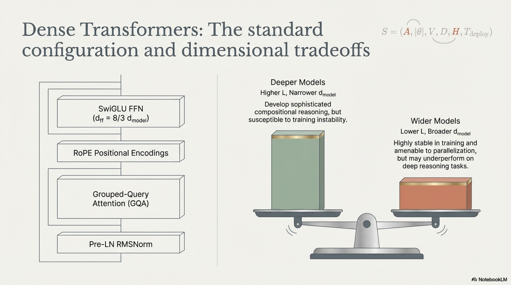

- **Deeper models** (higher $L$, narrower $d_{\text{model}}$) tend to develop more sophisticated compositional reasoning but are more susceptible to training instability and gradient vanishing.
- **Wider models** (lower $L$, broader $d_{\text{model}}$) tend to be more stable in training and more amenable to parallelization but may underperform on tasks requiring deep compositional reasoning.

This tradeoff must be resolved empirically via ablation at reduced scale.


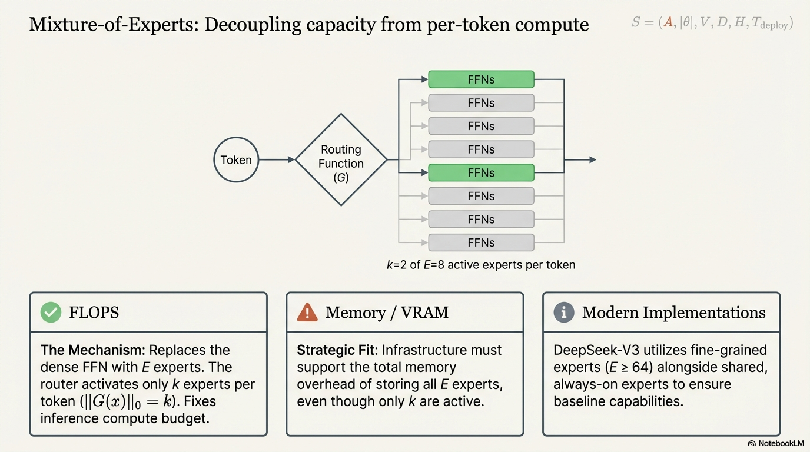

### 4.2 Mixture-of-Experts (MoE) Models

#### 4.2.1 Architecture

MoE architectures replace the dense FFN layer with a set of $E$ expert FFN modules, of which only $k$ are activated per token via a learned routing function $G$:

$$
\text{MoE-FFN}(x) = \sum_{i=1}^{E} G(x)_i \cdot \text{FFN}_i(x)
$$

where the gating function $G: \mathbb{R}^{d_{\text{model}}} \rightarrow \mathbb{R}^E$ produces sparse weights with $\|G(x)\|_0 = k$. Common routing strategies include Top-$k$ softmax gating:

$$
G(x) = \text{TopK}(\text{softmax}(W_g x), k)
$$

with auxiliary load-balancing losses to prevent expert collapse:

$$
\mathcal{L}_{\text{balance}} = \alpha \cdot E \sum_{i=1}^{E} f_i \cdot p_i
$$

where $f_i$ is the fraction of tokens routed to expert $i$, $p_i$ is the average gating probability for expert $i$, and $\alpha$ is a balancing coefficient.

#### 4.2.2 When to Choose MoE

MoE architectures are indicated when:

- The compute budget for inference is fixed, but higher model capacity is desired: MoE enables total parameter counts $|\theta|_{\text{total}}$ that are $E/k$ times larger than what the inference FLOPS budget would permit in a dense model.
- The training compute budget is sufficient: MoE models typically require more training tokens than comparably performing dense models to fully utilize expert capacity.
- The deployment infrastructure supports the memory overhead: all $E$ experts must reside in memory (or be efficiently swappable), even though only $k$ are activated per token.

#### 4.2.3 MoE-Specific Design Decisions

| Decision | Options | Considerations |
|---|---|---|
| Number of experts $E$ | 8, 16, 64, 128+ | Higher $E$ increases capacity but raises memory requirements and routing complexity. Fine-grained experts ($E \geq 64$) with small per-expert size have shown strong results (DeepSeek-V3). |
| Experts per token $k$ | 1, 2, 4+ | Higher $k$ increases per-token FLOPS but improves expert utilization. $k=2$ is common. |
| Shared experts | 0, 1, 2+ always-on experts | Shared experts ensure baseline capability across all tokens; specialized experts capture domain-specific patterns. DeepSeek-V2/V3 employ shared + routed expert designs. |
| Routing algorithm | Top-$k$, expert choice, hash-based | Expert-choice routing (Zhou et al., 2022) fixes the load per expert rather than the experts per token, improving balance but complicating autoregressive decoding. |
| Expert granularity | Standard (replace full FFN) vs. fine-grained (segment FFN into smaller experts) | Fine-grained experts increase the number of experts $E$ while keeping per-expert parameter count small, often yielding better routing diversity. |


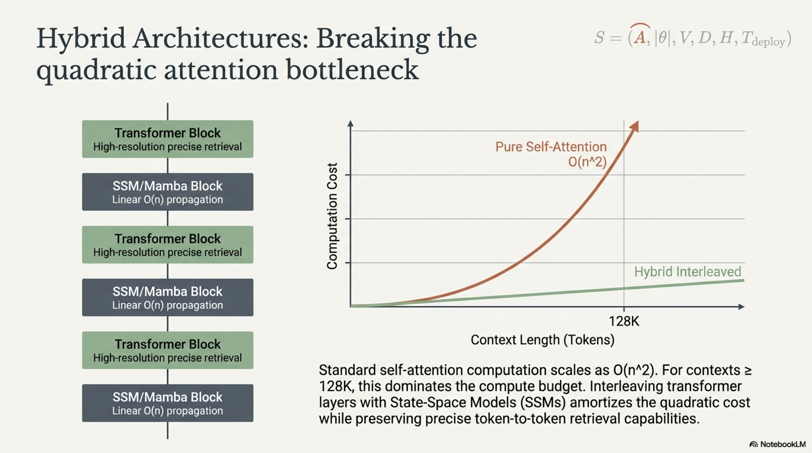

### 4.3 Hybrid Architectures (Transformer + SSM)

#### 4.3.1 Motivation

Standard self-attention computes pairwise interactions across all $n$ tokens, yielding computational complexity:

$$
\text{FLOPS}_{\text{attention}} = O(n^2 \cdot d_h \cdot n_h)
$$

For very long contexts ($n \geq 128\text{K}$), this quadratic scaling becomes the dominant computational bottleneck. State-space models (SSMs), such as Mamba (Gu & Dao, 2024), process sequences in $O(n)$ time and memory via recurrent state propagation:

$$
h_t = A h_{t-1} + B x_t, \quad y_t = C h_t + D x_t
$$

where $A, B, C, D$ are learned (and potentially input-dependent in selective SSM variants) state-space parameters. SSMs excel at modeling long-range dependencies with linear scaling but may underperform transformers on tasks requiring precise token-to-token retrieval or in-context learning.

#### 4.3.2 Hybrid Design Strategy

Hybrid architectures interleave transformer layers (for high-resolution attention) with SSM layers (for efficient long-range propagation):

$$
\text{Layer}_l = \begin{cases} \text{Transformer Block} & \text{if } l \in \mathcal{I}_{\text{attn}} \\ \text{SSM Block} & \text{if } l \in \mathcal{I}_{\text{SSM}} \end{cases}
$$

where $\mathcal{I}_{\text{attn}} \cup \mathcal{I}_{\text{SSM}} = \{1, 2, \ldots, L\}$ and $\mathcal{I}_{\text{attn}} \cap \mathcal{I}_{\text{SSM}} = \emptyset$. The ratio $|\mathcal{I}_{\text{attn}}| / L$ controls the tradeoff between attention capacity and computational efficiency. Common configurations interleave at regular intervals (e.g., one attention layer every four SSM layers) or concentrate attention layers in the deeper portion of the network where high-resolution retrieval is empirically most valuable.

#### 4.3.3 When to Choose Hybrid

Hybrid architectures are indicated when:

- The target context length exceeds $\geq 64\text{K}$ tokens and quadratic attention cost is prohibitive at training and/or inference time.
- The use case involves both long-range dependency modeling (favoring SSM) and precise in-context retrieval or copying (favoring attention).
- The organization is willing to accept the additional engineering complexity of a dual-component architecture.

### 4.4 Architectural Hyperparameter Selection Summary

For a target model size $|\theta|$ in a dense transformer, the following heuristics provide starting points (subject to validation via ablation):

$$
d_{\text{model}} \approx 96 \times \left\lceil \frac{(|\theta| / 12L)^{1/2}}{96} \right\rceil
$$

(rounded to a multiple of 96 for hardware efficiency on modern GPUs), with common ratios:

| $|\theta|$ | $L$ | $d_{\text{model}}$ | $n_h$ | $n_{\text{kv}}$ | $d_h$ | $d_{\text{ff}}$ |
|---|---|---|---|---|---|---|
| 1.7B | 24 | 2048 | 32 | 8 | 64 | 5461 |
| 3B | 32 | 2560 | 32 | 8 | 80 | 6827 |
| 7B | 32 | 4096 | 32 | 8 | 128 | 10923 |
| 13B | 40 | 5120 | 40 | 8 | 128 | 13653 |
| 70B | 80 | 8192 | 64 | 8 | 128 | 21845 |

These are indicative; actual configurations should be validated through the ablation protocol described in Section 3.2.

---

## 5. Data Mixture Specification

### 5.1 The Primacy of Data Quality

Empirical evidence across multiple independent pretraining campaigns consistently demonstrates that **data quality and composition exert greater influence on model capability than architectural modifications at equivalent parameter count and compute budget**. This finding is robust across scales from sub-billion to hundreds of billions of parameters.

Formally, for two training configurations $(\mathcal{A}_1, \mathcal{D}_1)$ and $(\mathcal{A}_2, \mathcal{D}_2)$ with matched compute $C$:

$$
\text{Perf}(\mathcal{A}_{\text{standard}}, \mathcal{D}_{\text{superior}}) > \text{Perf}(\mathcal{A}_{\text{novel}}, \mathcal{D}_{\text{standard}})
$$

in the vast majority of empirically observed cases. This does not render architecture irrelevant—it establishes that data curation should receive *at least* commensurate attention and resources as architectural innovation, which is rarely the case in practice.

### 5.2 Data Mixture Components

A typical pretraining corpus comprises the following domains with associated quality considerations:

| Domain | Typical Weight Range | Quality Signals | Key Considerations |
|---|---|---|---|
| Web text (filtered) | 40–60% | Perplexity filtering, classifier-based quality scoring, URL-based filtering, language ID | Dominant data source by volume; quality variance is extreme; aggressive filtering (e.g., FineWeb-Edu methodology) dramatically improves downstream performance. |
| Code | 10–30% | Syntactic validity, repository-level quality signals (stars, license), deduplication | Improves reasoning and structured output capabilities even for non-code tasks. Repository-level context is preferable to isolated file-level snippets. |
| Scientific/academic text | 5–15% | Peer-review status, citation count, LaTeX quality | Enhances factual knowledge and mathematical reasoning. |
| Books | 5–10% | Publication status, literary quality, copyright compliance | Provides long-form coherence and narrative structure. |
| Conversational/dialogue | 2–5% | Platform quality signals, human verification | Improves instruction-following and dialogue capabilities. |
| Multilingual | Variable | Per-language quality filtering, parallel corpus alignment | Required for multilingual objectives; sampling temperature $\alpha$ controls low-resource language representation. |
| Synthetic data | 0–20% | Verification of synthetic examples (e.g., mathematical proof checking, code execution) | Increasingly important for reasoning capabilities; must be carefully verified to avoid training on hallucinated content. |

### 5.3 Data Mixture Optimization

Data mixture weights are not typically derivable from first principles and require experimental optimization. The optimization objective is:

$$
\mathbf{w}^* = \arg\min_{\mathbf{w} \in \Delta^{D-1}} \sum_{j=1}^{K} \lambda_j \mathcal{L}_j(\theta^*(\mathbf{w}))
$$

where $\Delta^{D-1}$ is the $(D-1)$-dimensional probability simplex, $\mathcal{L}_j$ are task-specific validation losses, $\lambda_j$ are task importance weights, and $\theta^*(\mathbf{w})$ denotes the model parameters resulting from training on mixture $\mathbf{w}$.

Proxy methods for this expensive optimization include:

- **DoReMi** (Xie et al., 2024): Trains a small proxy model to learn domain weights that minimize worst-case group loss.
- **Online data mixing:** Adjusts $\mathbf{w}$ during training based on per-domain validation loss trajectories.
- **Manual ablation at reduced scale:** The most common approach—train small models on candidate mixtures and evaluate.

---

## 6. Organizational Factors: Operational Determinants of Pretraining Success

### 6.1 Iteration Speed as the Dominant Predictor of Team Capability

#### 6.1.1 Empirical Observation

Across the landscape of LLM development organizations, the single most reliable predictor of team capability improvement is **iteration speed**: the frequency with which the team completes full training cycles (data curation → training → evaluation → post-mortem analysis → revised design). This is fundamentally an experiential discipline; competence accrues through direct engagement with the full training pipeline, not through theoretical analysis alone.

#### 6.1.2 Quantitative Impact

Consider two teams with identical initial skill levels and compute budgets:

- **Team A:** Executes one training cycle per year.
- **Team B:** Executes one training cycle per quarter (four per year).

After two years:

- Team A has completed 2 full cycles and accumulated 2 cycles of empirical learning.
- Team B has completed 8 full cycles and accumulated 8 cycles of empirical learning, including 6 additional opportunities to identify failure modes, refine data pipelines, tune hyperparameters, and develop institutional debugging expertise.

The compounding nature of this learning advantage is substantial. Each cycle reveals failure modes, data quality issues, and training dynamics insights that inform all subsequent cycles. Teams that complete $n$ cycles accumulate an experience corpus $\mathcal{E}$ that grows superlinearly in effective value:

$$
\text{Effective Expertise} \propto \sum_{i=1}^{n} (1 + \gamma)^{n-i} \cdot e_i
$$

where $e_i$ is the learning acquired in cycle $i$ and $\gamma > 0$ represents the compounding factor through which earlier lessons amplify the value of later lessons.

#### 6.1.3 Exemplary Organizations

The following organizations exemplify the high-iteration-speed approach:

| Organization | Iteration Cadence | Observable Pattern |
|---|---|---|
| **Qwen** (Alibaba) | Multiple major releases per year (Qwen, Qwen1.5, Qwen2, Qwen2.5, Qwen3) | Each successive release incorporated lessons from prior generations: improved data, refined architecture decisions, expanded multimodal capabilities. |
| **DeepSeek** | Rapid successive releases (DeepSeek, DeepSeek-V2, DeepSeek-V3, DeepSeek-R1) | Pioneered novel architectural innovations (MLA, DeepSeekMoE) and training methodologies (GRPO) through rapid experimentation cycles. |


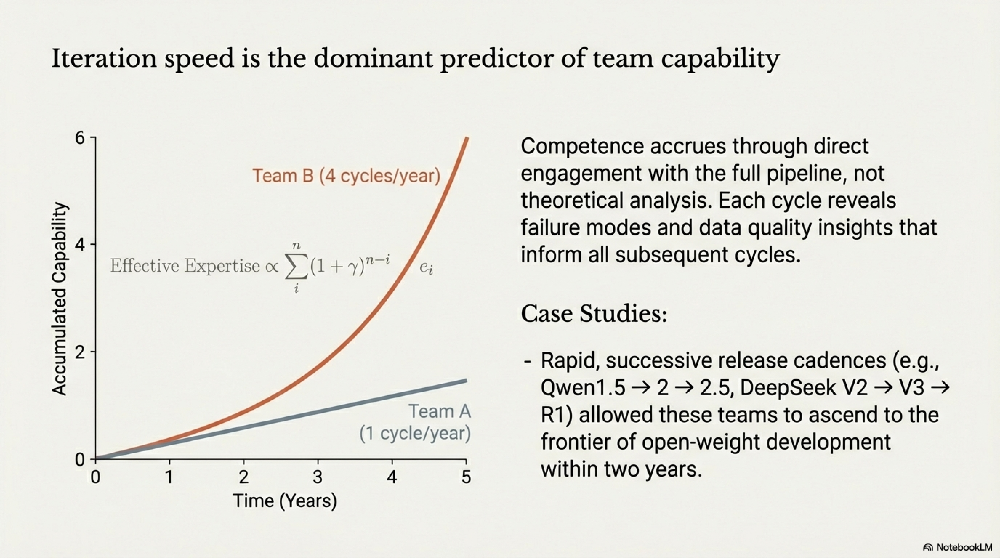

Both teams ascended from relative obscurity to the frontier of open-weight LLM development within approximately two years—a trajectory attributable in significant part to iteration speed.

### 6.2 Data Curation as the Highest-Leverage Activity


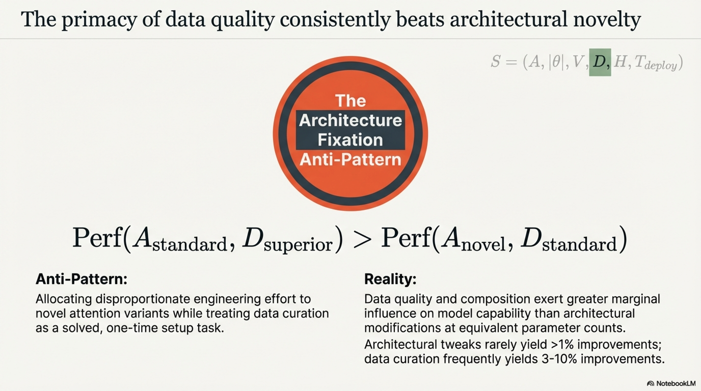

#### 6.2.1 The Architecture Fixation Anti-Pattern

A pervasive anti-pattern in LLM teams is disproportionate allocation of engineering effort to architecture modifications (novel attention variants, custom layer designs, exotic activation functions) while treating data curation as a solved problem or a one-time setup task.

This allocation is empirically suboptimal. The marginal return on engineering effort invested in data quality consistently exceeds the marginal return on architectural innovation for the majority of pretraining projects. Architectural innovations that yield $>$1% improvement on downstream benchmarks are rare; data quality improvements of comparable effort frequently yield 3–10% improvements.

#### 6.2.2 Data Curation as a Continuous Process

Data curation is not a preparatory phase that concludes before training begins—it is a continuous, iterative process that runs in parallel with training and evolves across training cycles:

1. **Initial curation:** Corpus assembly, deduplication, language identification, quality filtering.
2. **Mid-training refinement:** Analysis of training loss curves by data domain reveals underperforming or harmful subsets; data mixture adjustments are applied at training restarts.
3. **Post-training analysis:** Evaluation of model capabilities exposes specific knowledge or skill gaps traceable to data deficiencies, informing curation for the next training cycle.
4. **Cross-cycle improvement:** Insights from cycles $1, \ldots, n-1$ compound into the data pipeline for cycle $n$.


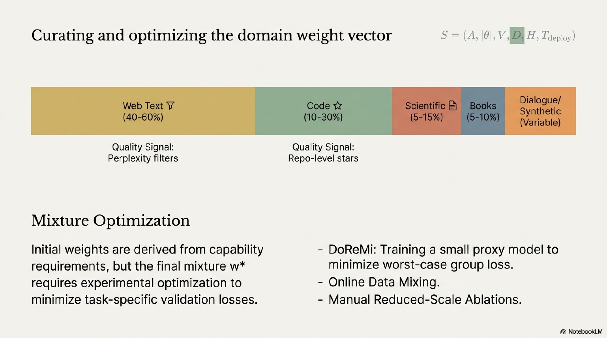

### 6.3 Team Size: The Small-Team Advantage


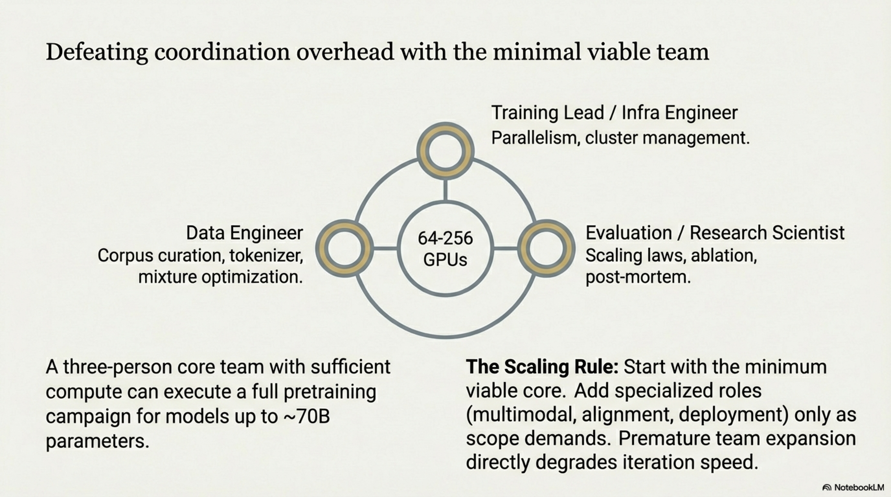

#### 6.3.1 Minimum Viable Team

The minimum viable team for a pretraining campaign is remarkably small. For the core pretraining task (data pipeline + distributed training + evaluation), the essential roles are:

| Role | Count | Responsibilities |
|---|---|---|
| **Training lead / infra engineer** | 1 | Distributed training infrastructure, parallelism strategy, monitoring, debugging loss spikes, checkpointing, cluster management. |
| **Data engineer** | 1 | Corpus curation, quality filtering, deduplication, tokenizer training, data loading pipeline, mixture optimization. |
| **Evaluation / research scientist** | 1 | Benchmark design, ablation experiments, scaling law analysis, architecture decisions, post-mortem analysis. |

This three-person core team, equipped with sufficient compute (e.g., 64–256 GPUs), can execute a full pretraining campaign for models up to $\sim$70B parameters. This assessment is consistent with industry reports: replicating a model comparable to Llama 3 today plausibly requires 2–3 experienced engineers with adequate infrastructure.

#### 6.3.2 Scaling the Team

Team expansion beyond the minimum viable core becomes necessary when the project scope extends beyond base pretraining:

| Extended Scope | Additional Roles |
|---|---|
| Multimodal capabilities (vision, audio) | Vision encoder specialist, multimodal alignment researcher |
| Multilingual coverage | Linguistic data specialist per language cluster |
| Post-training (SFT, RLHF, DPO) | Alignment researcher, human annotation coordinator |
| Specialized deployment (on-device, FPGA) | Systems/deployment engineer, quantization specialist |
| Safety and red-teaming | Safety researcher, adversarial evaluation specialist |

The key organizational principle is to **start with the minimum viable core and add roles only as scope demands**, rather than staffing a large team from the outset. Large initial teams introduce coordination overhead that directly reduces iteration speed—the dominant capability predictor identified in Section 6.1.


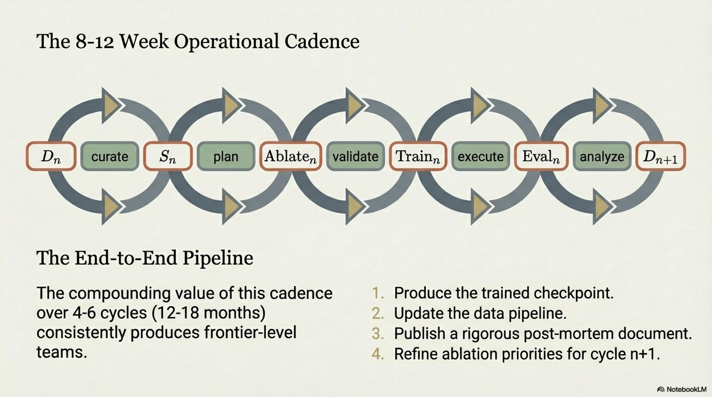

### 6.4 The Operational Cadence

Synthesizing the three organizational factors (iteration speed, data primacy, small teams), the optimal operational cadence for a pretraining team is:

$$
\text{Cycle}_n: \quad \mathcal{D}_n \xrightarrow{\text{curate}} \mathcal{S}_n \xrightarrow{\text{plan}} \text{Ablate}_n \xrightarrow{\text{validate}} \text{Train}_n \xrightarrow{\text{execute}} \text{Eval}_n \xrightarrow{\text{analyze}} \mathcal{D}_{n+1}
$$

with a target cycle duration of **8–12 weeks**. Each cycle produces:

1. A trained model checkpoint (the primary artifact).
2. An updated data pipeline (incorporating lessons from evaluation).
3. A post-mortem document (capturing decisions, failures, and insights for cycle $n+1$).
4. Refined ablation priorities for the next cycle.

The compounding value of this cadence over 4–6 cycles (12–18 months) consistently produces teams operating at the frontier of open-weight LLM development.

---

## 7. Synthesis: End-to-End Decision Pipeline

The complete *what* decision pipeline integrates the planning phase, validation phase, and organizational factors into a unified workflow:

```
┌─────────────────────────────────────────────────────────────┐
│                    STRATEGIC OBJECTIVE (WHY)                 │
│         (Research / Production / Strategic Open Source)       │
└──────────────────────────┬──────────────────────────────────┘
                           │
                           ▼
┌─────────────────────────────────────────────────────────────┐
│               PHASE I: PLANNING                             │
│                                                             │
│  1. Enumerate hard & soft constraints                       │
│  2. Derive model size bounds from deployment target         │
│  3. Compute token budget from scaling laws                  │
│  4. Select architecture class (dense / MoE / hybrid)        │
│  5. Design tokenizer & vocabulary                           │
│  6. Define initial data mixture                             │
│  7. Rank uncertain decisions by Priority(v_j)               │
│                                                             │
│  OUTPUT: Candidate specification S₀ + ablation priority list│
└──────────────────────────┬──────────────────────────────────┘
                           │
                           ▼
┌─────────────────────────────────────────────────────────────┐
│               PHASE II: VALIDATION (ABLATIONS)              │
│                                                             │
│  For each decision v_j in priority order:                   │
│    • Train matched small-scale models (150M–1.5B)           │
│    • Measure ΔL_j on evaluation suite                       │
│    • Validate scale-transfer for critical decisions         │
│    • Update S₀ → S₁ → ... → S_final                        │
│                                                             │
│  KEY PRINCIPLE: Prioritize data mixture ablations first      │
│                                                             │
│  OUTPUT: Validated specification S_final                     │
└──────────────────────────┬──────────────────────────────────┘
                           │
                           ▼
┌─────────────────────────────────────────────────────────────┐
│               FULL-SCALE TRAINING                           │
│                                                             │
│  Execute training with S_final                              │
│  Monitor loss, gradient norms, downstream evals             │
│  Conduct post-mortem analysis                               │
│  Feed learnings into next cycle                             │
└─────────────────────────────────────────────────────────────┘
```

---

## 8. Conclusion

The translation of strategic pretraining objectives (*why*) into concrete technical specifications (*what*) is a structured decision process, not an ad hoc selection. Every design choice—architecture class, model size, tokenizer vocabulary, data mixture composition, and architectural hyperparameters—must trace back to an explicit constraint or objective established in the strategic justification phase.

The methodology comprises two phases: **Planning** (systematic constraint-to-specification mapping) and **Validation** (prioritized ablation studies resolving uncertain decisions at reduced scale). The prioritization of ablation targets is itself a critical meta-decision: rigorous experiments on inconsequential variables are as wasteful as careless experiments on important ones.

Three organizational factors consistently distinguish successful pretraining teams:

1. **Iteration speed:** Teams that complete training cycles on 8–12 week cadences accumulate experiential learning that compounds across cycles, enabling rapid ascent to the development frontier.
2. **Data curation primacy:** Data quality and composition exert greater marginal influence on model capability than architectural innovation at equivalent compute budgets. Teams that allocate disproportionate effort to data curation consistently outperform those focused primarily on architecture.
3. **Small, focused teams:** A core team of 2–3 experienced engineers with adequate compute can execute pretraining campaigns up to frontier scale. Coordination overhead from premature team expansion directly degrades iteration speed.

The operational implication is clear: **assemble a small, skilled team; invest heavily in data curation; iterate rapidly; and let each cycle's post-mortem analysis drive the next cycle's design decisions.** The technical decisions detailed in this report provide the structured framework for executing each cycle with scientific rigor.

---

## References

- Ainslie, J. et al. (2023). GQA: Training Generalized Multi-Query Transformer Models from Multi-Head Checkpoints. *EMNLP 2023.*
- Gu, A. & Dao, T. (2024). Mamba: Linear-Time Sequence Modeling with Selective State Spaces. *COLM 2024.*
- Hoffmann, J. et al. (2022). Training Compute-Optimal Large Language Models. *NeurIPS 2022.*
- Shazeer, N. (2020). GLU Variants Improve Transformer. *arXiv:2002.05202.*
- Su, J. et al. (2024). RoFormer: Enhanced Transformer with Rotary Position Embedding. *Neurocomputing.*
- Touvron, H. et al. (2023). LLaMA: Open and Efficient Foundation Language Models. *arXiv:2302.13971.*
- Vaswani, A. et al. (2017). Attention Is All You Need. *NeurIPS 2017.*
- Xie, S. M. et al. (2024). DoReMi: Optimizing Data Mixtures Speeds Up Language Model Pretraining. *NeurIPS 2024.*
- Yang, G. et al. (2022). Tensor Programs V: Tuning Large Neural Networks via Zero-Shot Hyperparameter Transfer. *arXiv:2203.03466.*
- Zhou, Y. et al. (2022). Mixture-of-Experts with Expert Choice Routing. *NeurIPS 2022.*
- Zhang, B. & Sennrich, R. (2019). Root Mean Square Layer Normalization. *NeurIPS 2019.*