# Scaling Laws for Language Models: Parameter-Data Trade-offs, Compute-Optimal Training, and the Overtraining Paradigm

## A Comprehensive Scientific Technical Report

---

## 1. Introduction and Motivation

The fundamental question in training neural language models under finite computational budgets reduces to a constrained optimization problem: given a fixed compute envelope $C$ (measured in floating-point operations, FLOPs), how should one allocate resources between **model scale** $N$ (parameter count) and **training duration** $D$ (token count) to minimize the expected loss $L$?

This question was historically unformalized. In the pre-LLM era, practitioners selected model configurations through heuristic rules: maximize model size $N$ and batch size $B$ subject to hardware memory constraints, then train until either (a) validation loss exhibited upward curvature indicating overfitting, or (b) the available dataset was exhausted. The absence of predictive scaling theory meant that the relationship between $N$, $D$, and $L$ remained empirical and poorly characterized.

However, even in this early period, empirical evidence strongly suggested that **scale confers systematic benefits**. Hestness et al. (2017) provided one of the first comprehensive cross-domain demonstrations, establishing that test loss across multiple tasks (machine translation, language modeling, image classification, speech recognition) follows **power-law decay** as a function of dataset size, provided the model capacity is not a binding constraint.

The transition from heuristic scaling to **predictive scaling theory** marks one of the most consequential methodological shifts in modern deep learning. This report provides a rigorous mathematical treatment of the scaling laws framework, analyzes its revisions, examines the emerging overtraining paradigm, and identifies critical open gaps in the current understanding.

---

## 2. Foundational Scaling Laws: The Kaplan Formulation

### 2.1 Core Empirical Observations

Kaplan et al. (2020), in their seminal work *"Scaling Laws for Neural Language Models,"* demonstrated that the cross-entropy loss $L$ of autoregressive Transformer language models obeys remarkably smooth power-law relationships across **many orders of magnitude** of scale in three independent variables:

1. **Model parameters** $N$ (non-embedding parameter count)
2. **Dataset size** $D$ (number of training tokens)
3. **Compute budget** $C$ (total training FLOPs)

### 2.2 Mathematical Formulation

#### 2.2.1 Single-Variable Power Laws

When other factors are not binding constraints, the loss follows univariate power laws:

$$
L(N) = \left(\frac{N_c}{N}\right)^{\alpha_N}, \quad \text{where } \alpha_N \approx 0.076, \quad N_c \approx 8.8 \times 10^{13}
$$

$$
L(D) = \left(\frac{D_c}{D}\right)^{\alpha_D}, \quad \text{where } \alpha_D \approx 0.095, \quad D_c \approx 5.4 \times 10^{13}
$$

$$
L(C) = \left(\frac{C_c}{C}\right)^{\alpha_C}, \quad \text{where } \alpha_C \approx 0.050, \quad C_c \approx 3.1 \times 10^8
$$

Here, $N_c$, $D_c$, $C_c$ are scale constants, and the exponents $\alpha_N$, $\alpha_D$, $\alpha_C$ govern the rate of loss reduction per unit increase in the corresponding variable.

#### 2.2.2 Joint Power Law (Bivariate Decomposition)

When both $N$ and $D$ are simultaneously constrained, Kaplan et al. proposed a combined functional form:

$$
L(N, D) = \left[\left(\frac{N_c}{N}\right)^{\alpha_N / \alpha_D} + \frac{D_c}{D}\right]^{\alpha_D}
$$

This decomposition captures the intuition that loss has two independent sources of irreducible inefficiency: **model capacity limitations** (finite $N$) and **data limitations** (finite $D$). Total loss is bounded below by $L_{\infty}$, the entropy of natural language, and the full expression includes this floor:

$$
L(N, D) = L_{\infty} + \left(\frac{N_c}{N}\right)^{\alpha_N} + \left(\frac{D_c}{D}\right)^{\alpha_D}
$$

where $L_{\infty}$ represents the **irreducible loss** (intrinsic entropy of the data distribution).

#### 2.2.3 Compute-Loss Relationship

The compute budget for a training run is approximately:

$$
C \approx 6 \cdot N \cdot D
$$

This approximation arises because each training token requires approximately $6N$ FLOPs—$2N$ for the forward pass, $2N$ for the backward pass computing gradients with respect to activations, and $2N$ for the backward pass computing gradients with respect to parameters. More precisely:

$$
C = 6 \cdot N \cdot D \cdot \eta_{\text{MFU}}^{-1}
$$

where $\eta_{\text{MFU}}$ is the **Model FLOPs Utilization** (the fraction of theoretical peak hardware FLOPs actually consumed by useful model computation).

### 2.3 Kaplan Optimal Allocation

Given a fixed compute budget $C$, the optimization problem is:

$$
\min_{N, D} \quad L(N, D) \quad \text{subject to} \quad C = 6ND
$$

Using Lagrangian optimization on the bivariate power law, Kaplan et al. derived the compute-optimal scaling:

$$
N^{*}(C) \propto C^{a}, \quad D^{*}(C) \propto C^{b}
$$

Their empirical fits yielded:

$$
a \approx 0.73, \quad b \approx 0.27
$$

**Critical implication:** Since $a \gg b$, the Kaplan laws prescribe allocating the **vast majority of additional compute to model size** rather than training duration. This means that when the compute budget doubles, most of the additional FLOPs should go toward increasing $N$, with only a modest increase in $D$.

### 2.4 Consequences of the Kaplan Scaling Prescription

This result directly motivated the design philosophy behind **GPT-3** (Brown et al., 2020):

| Property | Value |
|---|---|
| Parameters $N$ | $175 \times 10^9$ (175B) |
| Training tokens $D$ | $300 \times 10^9$ (300B) |
| Token-to-parameter ratio $D/N$ | $\approx 1.7$ |
| Estimated compute $C$ | $\approx 3.14 \times 10^{23}$ FLOPs |

The token-to-parameter ratio $D/N \approx 1.7$ is remarkably low by modern standards, reflecting Kaplan et al.'s recommendation to prioritize model scale.

---

## 3. The Chinchilla Revision: Hoffmann et al. (2022)

### 3.1 Methodological Critique

Hoffmann et al. (2022), in *"Training Compute-Optimal Large Language Models,"* identified a critical methodological flaw in Kaplan et al.'s approach to deriving optimal $N^*(C)$ and $D^*(C)$.

**The core issue:** Kaplan et al. estimated optimal model size at each compute level by fitting an envelope over training runs of **different model sizes but with a fixed learning rate schedule**. Critically, they did not independently tune the learning rate schedule for each model size at each compute level. Since smaller models trained for more steps may require different learning rate decay schedules than larger models trained for fewer steps, this introduced a **systematic bias toward larger models**—the larger models appeared to extract more value from additional compute than they actually would under individually optimized training configurations.

### 3.2 Three Independent Estimation Approaches

Hoffmann et al. employed three independent approaches to re-derive the optimal allocation:

**Approach 1 (Fixed model, vary tokens):** For each of several fixed model sizes $N_i$, train on varying numbers of tokens $D_j$ with properly tuned learning rate schedules. Fit the resulting $L(N_i, D_j)$ surface and extract the optimal $D^*(C)$ for each $N$.

**Approach 2 (IsoFLOP profiles):** For each of several fixed compute budgets $C_k$, train models of varying sizes with corresponding token counts satisfying $D = C/(6N)$. Identify the model size that achieves minimal loss at each compute level.

**Approach 3 (Parametric loss fitting):** Fit a parametric loss function directly to all collected $(N, D, L)$ data points and solve the constrained optimization analytically.

### 3.3 Revised Parametric Loss Function

Hoffmann et al. proposed the following parametric loss model:

$$
\hat{L}(N, D) = \frac{A}{N^{\alpha}} + \frac{B}{D^{\beta}} + E
$$

where:
- $A / N^{\alpha}$: loss contribution from finite model capacity
- $B / D^{\beta}$: loss contribution from finite training data
- $E$: irreducible loss (entropy floor of the data distribution)

The fitted parameter estimates across their three approaches converged to:

$$
\alpha \approx 0.34, \quad \beta \approx 0.28, \quad A \approx 406.4, \quad B \approx 410.7, \quad E \approx 1.69
$$

### 3.4 Chinchilla Optimal Allocation

Solving the constrained optimization:

$$
\min_{N, D} \quad \hat{L}(N, D) \quad \text{subject to} \quad C = 6ND
$$

Forming the Lagrangian:

$$
\mathcal{L}(N, D, \lambda) = \frac{A}{N^{\alpha}} + \frac{B}{D^{\beta}} + E + \lambda(6ND - C)
$$

Setting partial derivatives to zero:

$$
\frac{\partial \mathcal{L}}{\partial N} = -\frac{A\alpha}{N^{\alpha+1}} + 6\lambda D = 0
$$

$$
\frac{\partial \mathcal{L}}{\partial D} = -\frac{B\beta}{D^{\beta+1}} + 6\lambda N = 0
$$

$$
\frac{\partial \mathcal{L}}{\partial \lambda} = 6ND - C = 0
$$

From the first two conditions:

$$
\frac{A\alpha}{N^{\alpha+1}} = 6\lambda D, \quad \frac{B\beta}{D^{\beta+1}} = 6\lambda N
$$

Dividing:

$$
\frac{A\alpha \cdot D^{\beta+1}}{B\beta \cdot N^{\alpha+1}} = \frac{D}{N}
$$

$$
\frac{A\alpha}{B\beta} = \frac{D}{N} \cdot \frac{N^{\alpha+1}}{D^{\beta+1}} = \frac{N^{\alpha}}{D^{\beta}}
$$

Using the constraint $D = C/(6N)$ and substituting:

$$
N^{*}(C) = G \cdot C^{a}, \quad D^{*}(C) = \frac{1}{6G} \cdot C^{b}
$$

where:

$$
a = \frac{\beta}{\alpha + \beta}, \quad b = \frac{\alpha}{\alpha + \beta}
$$

With $\alpha \approx 0.34$ and $\beta \approx 0.28$:

$$
a \approx 0.46, \quad b \approx 0.54
$$

**This is the central result:** Under the Chinchilla revision, parameters and tokens should scale **approximately equally** with compute. This dramatically contrasts with Kaplan et al.'s allocation where $a \approx 0.73$ and $b \approx 0.27$.

### 3.5 Quantitative Implications: GPT-3 as a Case Study

Under the Chinchilla laws, the compute-optimal training configuration for GPT-3's compute budget yields:

| Property | GPT-3 (Actual) | Chinchilla-Optimal |
|---|---|---|
| Parameters $N$ | 175B | ~70B |
| Training tokens $D$ | 300B | ~3.7T |
| Token-to-parameter ratio $D/N$ | ~1.7 | ~52.9 |

The **Chinchilla model** itself (70B parameters, 1.4T tokens) outperformed the substantially larger Gopher (280B parameters) on virtually all downstream benchmarks, empirically validating the revised scaling prescription.

### 3.6 The Chinchilla Optimal Ratio

A simplified rule-of-thumb emerged from the Chinchilla analysis:

$$
D^{*} \approx 20 \cdot N
$$

That is, the compute-optimal training token count is approximately **20 times the parameter count**. This "Chinchilla ratio" became a widely adopted benchmark in the field.

---

## 4. From Compute-Optimal to Inference-Optimal: The Overtraining Paradigm

### 4.1 The Fundamental Limitation of Chinchilla Laws

The Chinchilla scaling laws optimize a single objective:

$$
\min_{N, D} \quad L(N, D) \quad \text{subject to} \quad C_{\text{train}} = 6ND
$$

This formulation contains a critical blind spot: **it ignores inference cost entirely**. In practical deployment, the total lifecycle cost of a language model is:

$$
C_{\text{total}} = C_{\text{train}} + C_{\text{inference}} = 6ND + 2N \cdot T_{\text{total}}
$$

where $T_{\text{total}}$ is the total number of tokens generated during the model's inference lifetime, and $2N$ FLOPs per inference token accounts for the forward pass.

For models with high inference demand (e.g., open-weight models deployed by millions of users, API-served commercial models), $T_{\text{total}}$ can be enormous:

$$
T_{\text{total}} \gg D \quad \Longrightarrow \quad C_{\text{inference}} \gg C_{\text{train}}
$$

In this regime, the **inference cost dominates**, and it scales linearly with $N$. Therefore, reducing $N$ by even a small fraction yields large aggregate savings, even if this requires a compensating increase in $D$ (and thus $C_{\text{train}}$) to maintain the same loss level.

### 4.2 Inference-Aware Optimization

Sardana et al. (2025) and de Vries (2023) formalized the inference-aware compute allocation problem. Define the **total deployment cost** as:

$$
C_{\text{deploy}}(N, D) = C_{\text{train}}(N, D) + C_{\text{inference}}(N)
$$

$$
C_{\text{deploy}}(N, D) = 6ND + 2N \cdot \mathbb{E}[T_{\text{total}}]
$$

The optimization becomes:

$$
\min_{N, D} \quad L(N, D) \quad \text{subject to} \quad 6ND + 2N \cdot \mathbb{E}[T_{\text{total}}] \leq C_{\text{deploy}}
$$

Alternatively, one can fix a **target loss** $L^{*}$ and minimize total deployment cost:

$$
\min_{N, D} \quad C_{\text{deploy}}(N, D) \quad \text{subject to} \quad L(N, D) \leq L^{*}
$$

The solution to this modified problem systematically shifts the optimal allocation toward **smaller $N$ and larger $D$** relative to the Chinchilla optimum. The magnitude of this shift depends on the expected inference demand $\mathbb{E}[T_{\text{total}}]$.

### 4.3 The Overtraining Ratio

Define the **overtraining ratio** $\rho$ as the factor by which actual training tokens exceed the Chinchilla-optimal count:

$$
\rho = \frac{D_{\text{actual}}}{D_{\text{Chinchilla}}^{*}}
$$

When $\rho = 1$, training follows the Chinchilla prescription exactly. When $\rho > 1$, the model is **overtrained** relative to the compute-optimal allocation.

Modern models exhibit extreme overtraining ratios:

| Model | $N$ | $D$ | $D/N$ | $\rho$ (approx.) |
|---|---|---|---|---|
| Chinchilla | 70B | 1.4T | 20 | 1.0 |
| Llama 2 7B | 7B | 2.0T | 286 | ~14.3 |
| Llama 3 8B | 8B | 15T | 1,875 | ~93.8 |
| Qwen3-4B | 4B | 36T | 9,000 | ~450 |
| SmolLM3-3B | 3B | 11T | 3,667 | ~183 |

The progression is stark: modern $D/N$ ratios exceed the Chinchilla recommendation by **two to three orders of magnitude**.

### 4.4 Theoretical Justification for Overtraining

Consider two models achieving the same loss $L^{*}$:

- **Model A (Chinchilla-optimal):** $N_A$ parameters, $D_A = 20 N_A$ tokens
- **Model B (Overtrained):** $N_B < N_A$ parameters, $D_B \gg 20 N_B$ tokens

The parametric loss function provides:

$$
L^{*} = \frac{A}{N_A^{\alpha}} + \frac{B}{D_A^{\beta}} + E = \frac{A}{N_B^{\alpha}} + \frac{B}{D_B^{\beta}} + E
$$

Since $N_B < N_A$, the model-capacity term $A/N_B^{\alpha}$ is larger, requiring $B/D_B^{\beta}$ to be correspondingly smaller, hence $D_B \gg D_A$. The additional training compute is:

$$
\Delta C_{\text{train}} = 6N_B D_B - 6 N_A D_A
$$

But the inference savings over the model's lifetime are:

$$
\Delta C_{\text{inference}} = 2(N_A - N_B) \cdot T_{\text{total}}
$$

Overtraining is justified when:

$$
\Delta C_{\text{inference}} > \Delta C_{\text{train}} \quad \Longleftrightarrow \quad T_{\text{total}} > \frac{3(N_B D_B - N_A D_A)}{N_A - N_B}
$$

For models intended for widespread deployment (open-weight releases, high-traffic APIs), this condition is almost always satisfied.

---

## 5. Critical Model Size: The Information-Theoretic Floor

### 5.1 Concept Formalization

De Vries (2023) introduced the concept of **critical model size** $N_{\text{crit}}(L^{*})$: the minimum parameter count required to achieve a target loss $L^{*}$, regardless of training duration.

From the parametric loss function:

$$
L(N, D) = \frac{A}{N^{\alpha}} + \frac{B}{D^{\beta}} + E
$$

As $D \to \infty$, the data-limited term vanishes:

$$
\lim_{D \to \infty} L(N, D) = \frac{A}{N^{\alpha}} + E \triangleq L_{\min}(N)
$$

The critical model size for target loss $L^{*}$ is:

$$
N_{\text{crit}}(L^{*}) = \left(\frac{A}{L^{*} - E}\right)^{1/\alpha}
$$

**This is a hard lower bound.** For any $N < N_{\text{crit}}(L^{*})$, the loss $L^{*}$ is **unattainable regardless of training data volume**. The model simply lacks sufficient capacity to represent the complexity of the data distribution at the required fidelity.

### 5.2 Diminishing Returns Below Critical Size

For models approaching $N_{\text{crit}}$ from above, the marginal value of additional training data decreases sharply. Define the data efficiency:

$$
\eta_D(N, D) = -\frac{\partial L}{\partial D} = \frac{B\beta}{D^{\beta+1}}
$$

This quantity is independent of $N$, but the achievable loss improvement is bounded by $L_{\min}(N) - E = A/N^{\alpha}$. When $N$ is near $N_{\text{crit}}$, the gap $L_{\min}(N) - L^{*}$ is small, meaning that even infinite data provides negligible benefit beyond what finite data already achieves.

---

## 6. SmolLM3 Case Study: Applied Scaling Decisions

### 6.1 Design Parameter Selection

SmolLM3 represents a concrete application of inference-aware scaling principles. The key design decisions are analyzed below:

**Target parameter count:** $N = 3 \times 10^9$ (3B parameters). This choice reflects a trade-off between:
- **Capability floor:** Models at $3 \times 10^9$ parameters have been empirically demonstrated to exhibit emergent capabilities including multi-step reasoning, code generation, and tool use (evidenced by Llama 3.2 3B, Gemma 3 4B, Qwen3-4B).
- **Inference efficiency:** At 3B parameters, the model fits within the memory constraints of consumer-grade hardware (e.g., single GPU with 8GB VRAM in quantized formats), enabling local deployment.

**Training token budget derivation:**

Given:
- Available hardware: 384 × H100 GPUs
- Training duration: $\sim$1 month ($\approx 2.592 \times 10^6$ seconds)
- H100 peak FP16/BF16 throughput: $\sim 989$ TFLOP/s per GPU
- Model FLOPs Utilization (MFU): $\eta_{\text{MFU}} \approx 0.30$

Total available compute:

$$
C = 384 \times 989 \times 10^{12} \times 2.592 \times 10^{6} \times 0.30 \; \text{FLOPs}
$$

$$
C \approx 384 \times 989 \times 10^{12} \times 2.592 \times 10^{6} \times 0.30
$$

$$
C \approx 2.95 \times 10^{23} \; \text{FLOPs}
$$

Using $C = 6ND$:

$$
D = \frac{C}{6N} = \frac{2.95 \times 10^{23}}{6 \times 3 \times 10^9} = \frac{2.95 \times 10^{23}}{1.8 \times 10^{10}} \approx 1.64 \times 10^{13}
$$

This yields $D \approx 16.4\text{T}$ tokens theoretically; the actual budget was conservatively set to $D = 11\text{T}$ tokens, accounting for checkpointing overhead, evaluation pauses, and restarts.

### 6.2 Chinchilla-Optimality Analysis

Under the Chinchilla ratio ($D^{*} = 20N$):

$$
D_{\text{Chinchilla}}^{*} = 20 \times 3 \times 10^{9} = 6 \times 10^{10} \; \text{tokens} = 60\text{B tokens}
$$

The overtraining ratio:

$$
\rho = \frac{11 \times 10^{12}}{6 \times 10^{10}} \approx 183
$$

SmolLM3 is trained on $\sim$183× the Chinchilla-optimal token count. This extreme overtraining is justified by the model's intended deployment profile: open-weight release targeting local/edge inference with maximal user adoption—exactly the regime where inference cost dominance makes smaller, overtrained models economically optimal.

### 6.3 Comparative Scaling Regime Analysis

The SmolLM3 token-to-parameter ratio can be situated within the broader landscape:

$$
\frac{D}{N}\bigg|_{\text{SmolLM3}} = \frac{11 \times 10^{12}}{3 \times 10^9} \approx 3{,}667
$$

This exceeds the Chinchilla recommendation of $D/N \approx 20$ by a factor of $\sim$183, placing SmolLM3 firmly in the modern overtraining regime. The key question becomes whether the loss surface $L(N, D)$ at $N = 3\text{B}$, $D = 11\text{T}$ is still in the region of meaningful returns—i.e., whether $\partial L / \partial D$ at this operating point is sufficiently large to justify continued training.

---

## 7. Practical Utility of Scaling Laws Despite Deviations

### 7.1 Scaling Laws as Experimental Tools

Even when practitioners deliberately deviate from compute-optimal prescriptions, scaling laws retain substantial practical utility across multiple dimensions:

**7.1.1 Ablation Efficiency**

When evaluating architectural modifications, data mixture changes, or training hyperparameter adjustments, running experiments at the **Chinchilla-optimal point** for a small compute budget provides maximum signal-to-noise ratio. At this point, neither model capacity nor data quantity is the binding constraint, so the observed loss change most cleanly reflects the effect of the intervention. Formally, at the optimal point:

$$
\frac{\partial L}{\partial N}\bigg|_{N^{*}} \cdot \frac{dN}{dC} = \frac{\partial L}{\partial D}\bigg|_{D^{*}} \cdot \frac{dD}{dC}
$$

The marginal returns from increasing $N$ and $D$ are equalized, meaning neither factor masks the signal from the experimental variable.

**7.1.2 Performance Prediction**

Scaling laws enable extrapolation from small-scale experiments to full-scale training outcomes. If a loss $L_s$ is observed at small scale $(N_s, D_s)$, the expected loss at full scale $(N_f, D_f)$ can be predicted:

$$
\hat{L}_f = \frac{A}{N_f^{\alpha}} + \frac{B}{D_f^{\beta}} + E
$$

where $A$, $B$, $\alpha$, $\beta$, $E$ are estimated from a grid of small-scale runs. This provides a **go/no-go decision framework** before committing to expensive full-scale training.

**7.1.3 Critical Capacity Analysis**

As discussed in Section 5, scaling laws identify whether a target model size $N$ can even theoretically achieve the desired loss level. If $N < N_{\text{crit}}(L^{*})$, no amount of additional training data or compute will suffice—a different model architecture or increased parameter count is required.

---

## 8. Mathematical Analysis of Scaling Law Exponents

### 8.1 Exponent Interpretation

The power-law exponents $\alpha$ and $\beta$ in the parametric loss function:

$$
L(N, D) = \frac{A}{N^{\alpha}} + \frac{B}{D^{\beta}} + E
$$

have precise information-theoretic interpretations:

- $\alpha$: The **parameter efficiency exponent**. A larger $\alpha$ means loss decreases more rapidly with model size, implying each additional parameter contributes more marginal information capacity.
- $\beta$: The **data efficiency exponent**. A larger $\beta$ means loss decreases more rapidly with training data, implying each additional token provides more marginal learning signal.

### 8.2 The Ratio $\alpha / \beta$ Determines Optimal Allocation

From the constrained optimization in Section 3.4:

$$
a = \frac{\beta}{\alpha + \beta}, \quad b = \frac{\alpha}{\alpha + \beta}
$$

The optimal compute allocation exponents depend only on the ratio $\alpha / \beta$:

- If $\alpha / \beta > 1$ (parameters are more efficient than data): $b > a$, allocate more compute to data (because parameters are "cheap"—each one gives more, so you need fewer).
- If $\alpha / \beta < 1$ (data is more efficient than parameters): $a > b$, allocate more compute to parameters.
- If $\alpha / \beta = 1$: $a = b = 0.5$, equal allocation.

Kaplan et al. found $\alpha_N \approx 0.076$ and $\alpha_D \approx 0.095$, giving $\alpha_N / \alpha_D \approx 0.8$, which (through a differently parameterized model) led to the conclusion that parameters should be favored.

Hoffmann et al. found $\alpha \approx 0.34$ and $\beta \approx 0.28$, giving $\alpha / \beta \approx 1.21$, which yields the approximately equal allocation of the Chinchilla prescription.

### 8.3 Sensitivity Analysis

The optimal parameter count $N^{*}(C)$ is sensitive to the exponent estimates. Consider the proportionality:

$$
N^{*} \propto C^{\beta / (\alpha + \beta)}
$$

A 10% error in $\beta$ (e.g., $\beta = 0.308$ instead of $0.28$) shifts the exponent from $0.452$ to $0.475$, which at $C = 10^{24}$ FLOPs changes $N^{*}$ by a factor of:

$$
\frac{(10^{24})^{0.475}}{(10^{24})^{0.452}} = 10^{24 \times 0.023} = 10^{0.552} \approx 3.56
$$

This **3.56× change** in optimal model size from a mere 10% change in one exponent underscores the fragility of precise scaling law predictions and motivates the practical importance of safety margins and empirical validation at intermediate scales.

---

## 9. Identified Research Gaps and Open Problems

### 9.1 Task-Specific vs. Loss-Based Scaling

**Gap:** Existing scaling laws predict **pretraining cross-entropy loss**, but downstream task performance does not scale smoothly with pretraining loss. Emergent capabilities appear discontinuously at specific scales, and the relationship between pretraining loss and downstream task accuracy is poorly characterized for tasks requiring multi-step reasoning, factual recall, or instruction following.

$$
\text{Accuracy}_{\text{task}}(L) \neq f_{\text{smooth}}(L)
$$

The mapping from pretraining loss to downstream performance is non-injective, task-dependent, and may exhibit phase transitions.

### 9.2 Post-Training Scaling Laws

**Gap:** Modern language model development involves extensive post-training: supervised fine-tuning (SFT), reinforcement learning from human feedback (RLHF), direct preference optimization (DPO), and iterative refinement. No comprehensive scaling laws exist for the relationship between:
- Pretraining loss $L_{\text{pretrain}}$
- Post-training data volume $D_{\text{post}}$
- Post-training compute $C_{\text{post}}$
- Final downstream performance $P_{\text{final}}$

### 9.3 Architecture-Dependent Scaling Exponents

**Gap:** Scaling law exponents $\alpha$ and $\beta$ are typically estimated for a specific Transformer architecture (e.g., dense decoder-only models). It remains unclear how these exponents change for:
- **Mixture-of-Experts (MoE)** architectures, where total parameter count $N_{\text{total}}$ differs from active parameter count $N_{\text{active}}$
- **State-space models** (e.g., Mamba), which have fundamentally different computational graphs
- **Hybrid architectures** combining attention and recurrence

The scaling behavior of MoE models is of particular interest, since the relevant "effective" $N$ for scaling purposes is:

$$
N_{\text{effective}} = f(N_{\text{active}}, N_{\text{total}}, k, E)
$$

where $k$ is the top-$k$ routing parameter and $E$ is the number of experts, but the functional form $f$ is not well-established.

### 9.4 Data Quality vs. Data Quantity

**Gap:** Scaling laws treat all tokens as equivalent, but empirical evidence overwhelmingly demonstrates that **data quality** dominates data quantity. The effective dataset size may be better modeled as:

$$
D_{\text{eff}} = \sum_{i=1}^{D} q(x_i)
$$

where $q(x_i) \in [0, 1]$ is a quality weight for token $x_i$ reflecting relevance, cleanliness, diversity contribution, and informational content. No scaling law formulation currently incorporates data quality as a first-class variable.

### 9.5 Scaling Laws for Multimodal Models

**Gap:** Existing scaling laws are derived almost exclusively for unimodal text-only language models. For multimodal models processing text, images, audio, and video, the loss decomposition must account for cross-modal interactions:

$$
L_{\text{multimodal}}(N, D_{\text{text}}, D_{\text{image}}, D_{\text{audio}}, \ldots) = \; ?
$$

Whether the power-law structure is preserved across modalities, and whether modality-specific exponents are independent or coupled, remains an open empirical question.

### 9.6 Tokenization Effects on Scaling Laws

**Gap:** Scaling laws express data quantity in tokens, but the information content per token varies dramatically with tokenizer vocabulary size $V$ and compression efficiency. A model trained on $D$ tokens with vocabulary $V_1$ may consume a fundamentally different amount of information than the same model trained on $D$ tokens with vocabulary $V_2 > V_1$. The correct data-axis normalization may be:

$$
D_{\text{bits}} = D \times H_{\text{token}}
$$

where $H_{\text{token}}$ is the average entropy per token under the tokenizer, but this correction is not standard in scaling law analyses.

### 9.7 Scaling Laws Under Data Repetition

**Gap:** When overtraining by factors of $\rho > 100$, models inevitably encounter repeated data (multiple epochs). The effective marginal value of repeated data is:

$$
\frac{\partial L}{\partial D_{\text{repeated}}} < \frac{\partial L}{\partial D_{\text{fresh}}}
$$

Muennighoff et al. (2023) showed that repeated data yields diminishing returns and that the effective data count under repetition follows approximately:

$$
D_{\text{eff}} \approx D_{\text{unique}} \cdot (1 - e^{-R \cdot e_{\text{epochs}}})
$$

where $R$ is a data-dependent constant and $e_{\text{epochs}}$ is the number of epochs. Integrating this into scaling law formulations remains an open area.

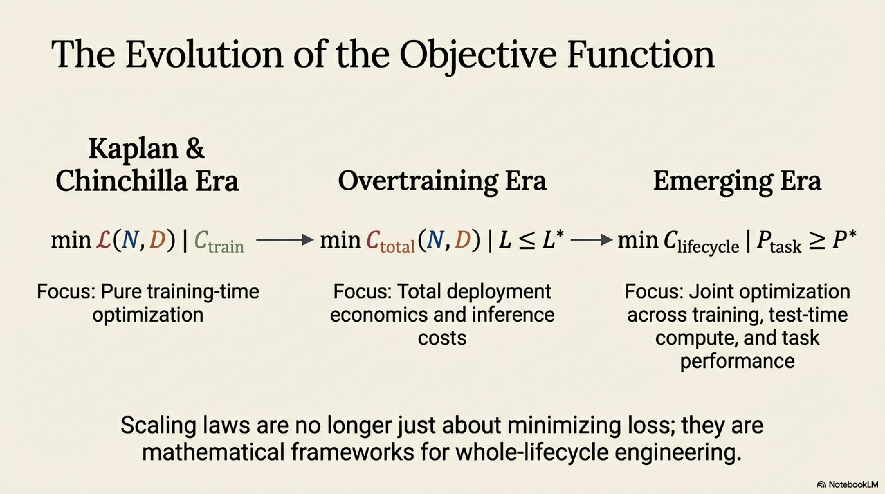

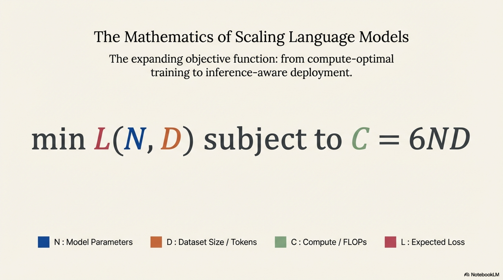

### 9.8 Inference-Time Compute Scaling

**Gap:** Recent developments (e.g., chain-of-thought reasoning, test-time compute scaling as in OpenAI o1/o3) suggest a new dimension of scaling: **inference-time compute** $C_{\text{infer-per-query}}$. The trade-off becomes:

$$
L_{\text{effective}}(N, D, C_{\text{infer-per-query}})
$$

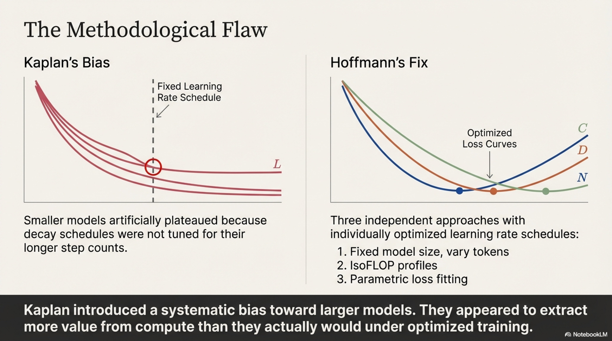

This introduces a three-way allocation problem (training parameters, training data, inference compute) for which no comprehensive scaling laws exist.

---

## 10. Conclusions

### 10.1 Summary of Key Results

| Aspect | Kaplan et al. (2020) | Hoffmann et al. (2022) | Modern Practice |
|---|---|---|---|
| $N^{*} \propto C^a$ | $a \approx 0.73$ | $a \approx 0.46$ | Varies (inference-aware) |
| $D^{*} \propto C^b$ | $b \approx 0.27$ | $b \approx 0.54$ | Varies ($\rho \gg 1$) |
| Optimal $D/N$ | $\sim 1\text{-}5$ | $\sim 20$ | $\sim 1{,}000\text{-}10{,}000$ |
| Optimization target | $\min L$ given $C_{\text{train}}$ | $\min L$ given $C_{\text{train}}$ | $\min C_{\text{deploy}}$ given $L^*$ |

### 10.2 The Field's Trajectory

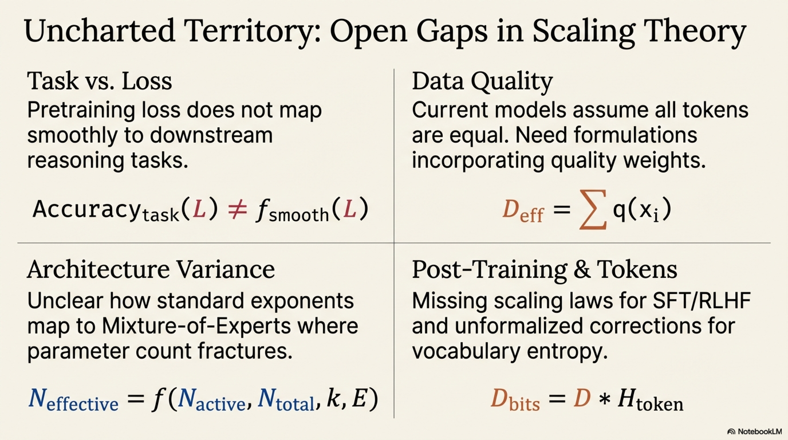

The evolution of scaling laws reflects a maturation of the field's understanding:

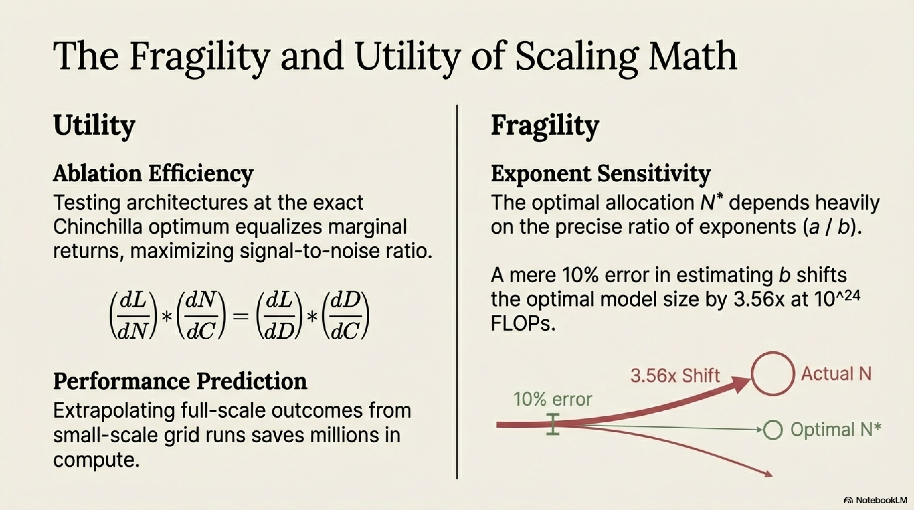

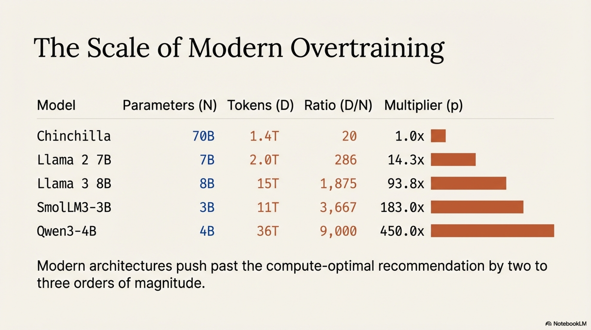

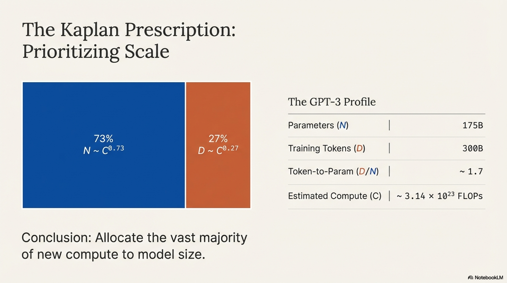

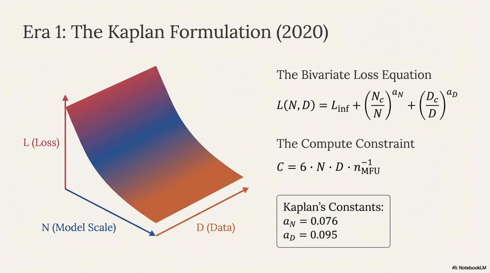

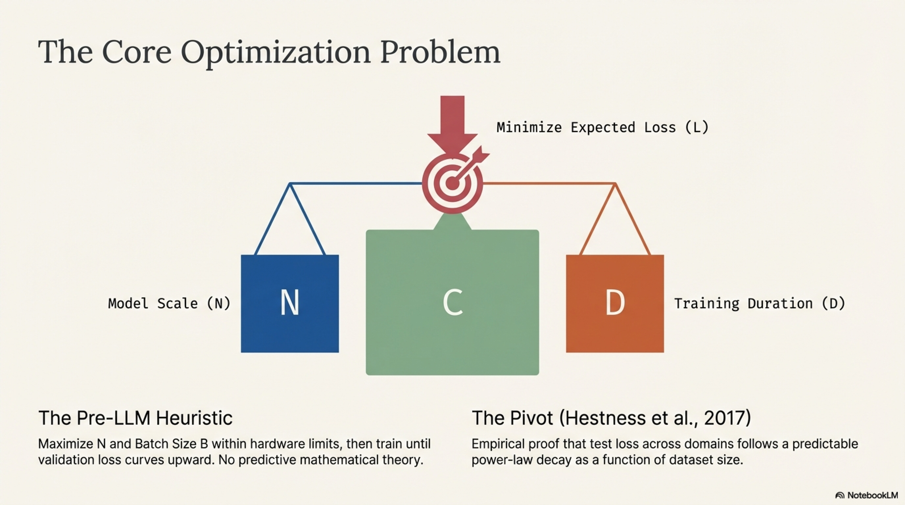

1. **Phase 1 (Pre-2020):** Heuristic scaling. No formal theory; scale until overfitting.
2. **Phase 2 (2020–2022):** Kaplan-era. Formalized power-law relationships; bias toward model size.
3. **Phase 3 (2022–2023):** Chinchilla era. Corrected methodology; balanced allocation.
4. **Phase 4 (2023–present):** Overtraining era. Inference-cost-aware optimization; $\rho \gg 1$ standard.
5. **Phase 5 (emerging):** Test-time compute scaling. Joint optimization over training and inference compute budgets.

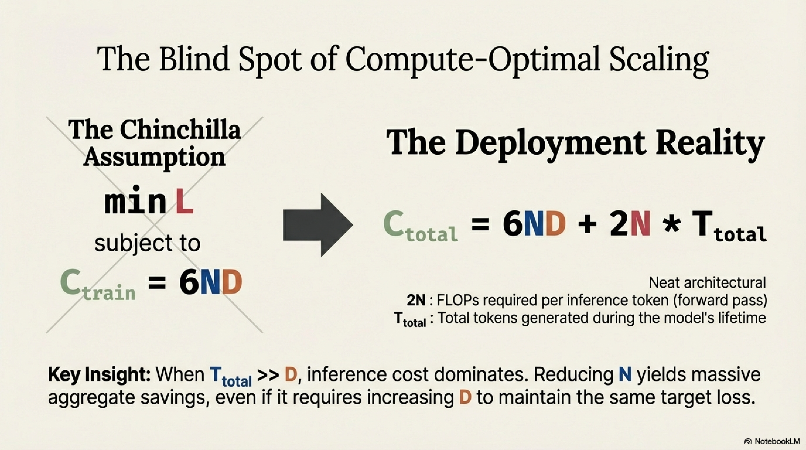

### 10.3 Fundamental Insight

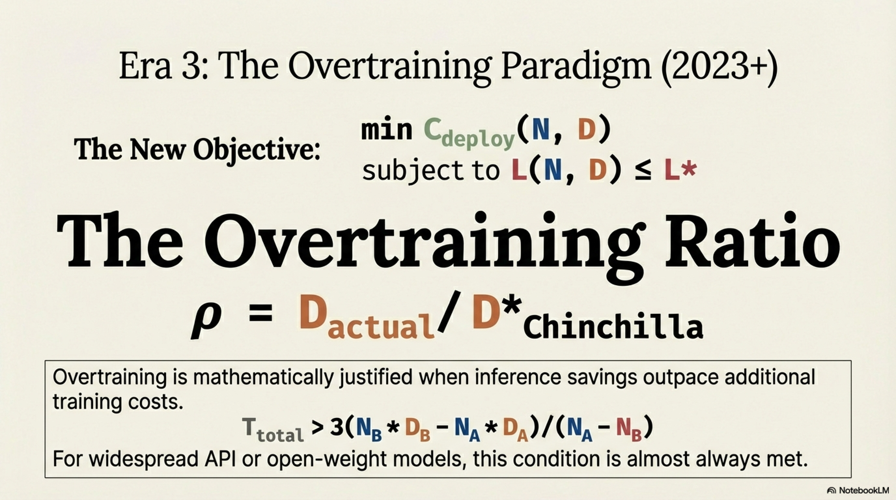

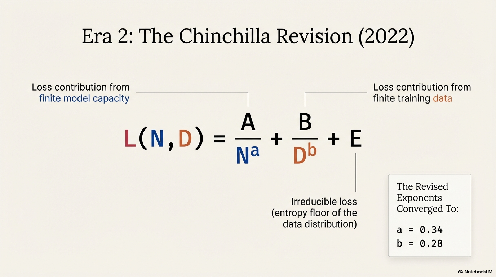

The evolution from Kaplan to Chinchilla to overtraining can be understood as a progressive expansion of the optimization objective's scope:

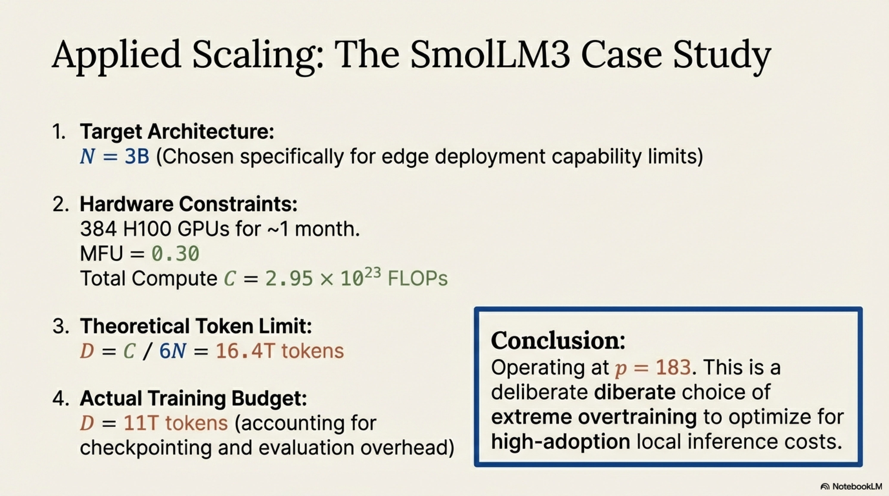

$$

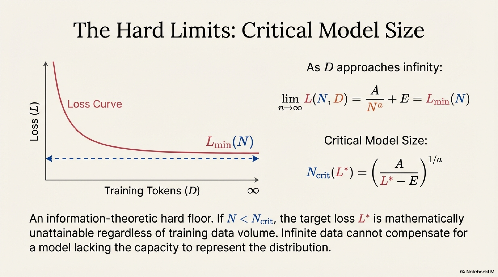

\underbrace{\min_{N,D} L(N,D) \; | \; C_{\text{train}}}_{\text{Kaplan/Chinchilla}} \quad \longrightarrow \quad \underbrace{\min_{N,D} C_{\text{total}}(N,D) \; | \; L \leq L^*}_{\text{Overtraining}} \quad \longrightarrow \quad \underbrace{\min_{N,D,C_{\text{test}}} C_{\text{lifecycle}} \; | \; P_{\text{task}} \geq P^*}_{\text{Emerging}}
$$

Each successive formulation incorporates a broader view of the costs and constraints governing practical language model development, moving from pure training-time optimization toward whole-lifecycle engineering.

---

## References

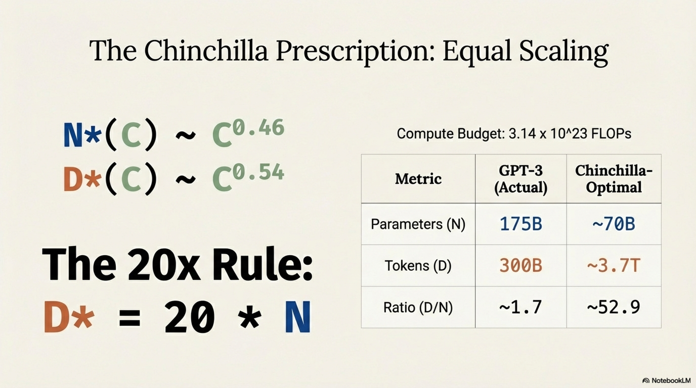

1. Hestness, J., et al. (2017). *Deep Learning Scaling is Predictable, Empirically.* arXiv:1712.00409.
2. Kaplan, J., et al. (2020). *Scaling Laws for Neural Language Models.* arXiv:2001.08361.
3. Brown, T., et al. (2020). *Language Models are Few-Shot Learners.* NeurIPS 2020.
4. Hoffmann, J., et al. (2022). *Training Compute-Optimal Large Language Models.* NeurIPS 2022.
5. de Vries, H. (2023). *Go Smol or Go Home.* Blog post / Technical report.
6. Sardana, N., et al. (2025). *Beyond Chinchilla-Optimal: Accounting for Inference in Language Model Scaling Laws.* arXiv:2401.00448.
7. Muennighoff, N., et al. (2023). *Scaling Data-Constrained Language Models.* NeurIPS 2023.

---