# Empirical Foundations of Large Language Model Development: A Comprehensive Technical Report on Ablation Methodology, Baseline Selection, and Experimental Rigor in Pretraining

---

## Abstract

The development of performant large language models (LLMs) demands a disciplined empirical methodology that precedes and governs every phase of the training pipeline. This report presents a complete technical exposition of the ablation-driven development paradigm: from baseline architecture selection, through training framework evaluation, to experimental design, evaluation protocol construction, data mixture strategy, cost estimation, and operational discipline. We formalize each decision point with mathematical precision, enumerate the design trade-offs at every layer of abstraction, and establish the methodological principles that distinguish rigorous model development from ad hoc experimentation. The exposition draws on concrete instantiations from the SmolLM3 (3B dense) development cycle and contextualizes decisions against contemporary architectures including Llama, Qwen, DeepSeek-V3, Kimi K2, and Falcon-H1.

---

## Table of Contents

1. [Introduction: The Primacy of Small-Scale Empiricism](#1-introduction)
2. [The Insufficiency of Intuition in LLM Development](#2-insufficiency-of-intuition)
3. [Foundational Decisions: Architecture Type and Model Scale](#3-foundational-decisions)
4. [Baseline Selection: Principles and Taxonomy](#4-baseline-selection)
5. [Systematic Baseline Modification: The Discipline of Derisking](#5-derisking)
6. [Training Framework Selection](#6-training-framework)
7. [Ablation Experimental Design](#7-ablation-design)
8. [Evaluation Methodology](#8-evaluation)
9. [Data Mixture Strategy for Ablations](#9-data-mixture)
10. [Compute Cost Estimation and Budget Planning](#10-cost-estimation)
11. [Operational Rules of Engagement](#11-rules-of-engagement)
12. [Conclusion](#12-conclusion)

---

## 1. Introduction: The Primacy of Small-Scale Empiricism

### 1.1 Motivation

Training a large language model at scale—consuming trillions of tokens across hundreds of GPUs over weeks—constitutes an irreversible commitment of substantial computational resources. Every hyperparameter, architectural decision, data mixture ratio, and optimizer configuration locked into the final run propagates its effects across the entire training trajectory. Errors or suboptimal choices discovered late are extraordinarily expensive to correct.

The fundamental principle governing responsible LLM development is therefore:


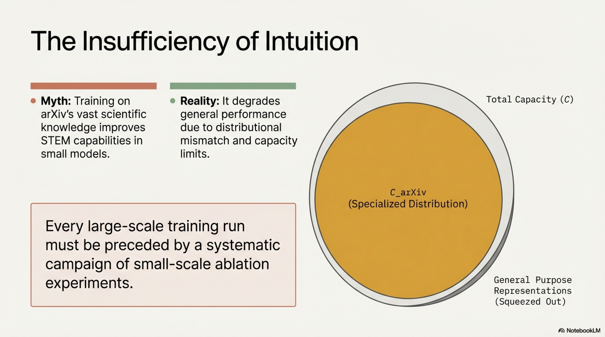

> **Every large-scale training run must be preceded by a systematic campaign of small-scale ablation experiments that empirically validate each critical design decision.**

This principle transforms LLM development from an exercise in architectural speculation into a rigorous experimental science, where hypotheses are tested, falsified, or confirmed through controlled experimentation before any commitment to full-scale compute expenditure.

### 1.2 Machine Learning as Experimental Science

Machine learning—and deep learning in particular—occupies a distinctive epistemological position. It is not pure mathematics, where results follow deductively from axioms. Rather, it functions as an **experimental science** governed by empirical laws whose deeper theoretical foundations remain partially understood.

A productive analogy is the historical relationship between thermodynamics and statistical mechanics:


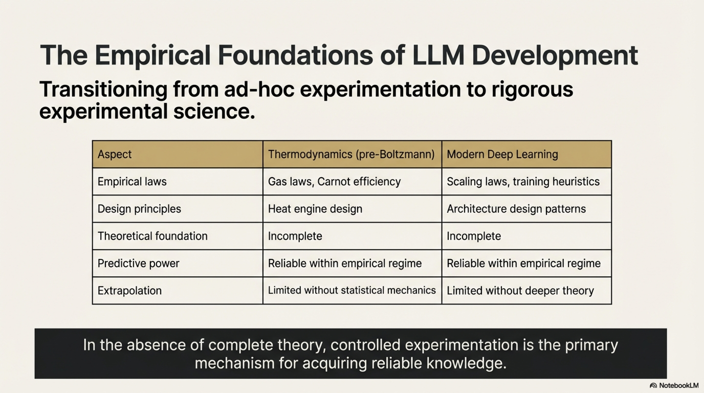

| Aspect | Thermodynamics (pre-Boltzmann) | Modern Deep Learning |
|--------|-------------------------------|---------------------|
| **Empirical laws** | Gas laws, Carnot efficiency | Scaling laws, training heuristics |
| **Design principles** | Heat engine design | Architecture design patterns |
| **Theoretical foundation** | Incomplete | Incomplete |
| **Predictive power** | Reliable within empirical regime | Reliable within empirical regime |
| **Extrapolation** | Limited without statistical mechanics | Limited without deeper theory |

This analogy clarifies why empirical ablation is not merely a practical convenience but an **epistemological necessity**: in the absence of complete theory, controlled experimentation is the primary mechanism for acquiring reliable knowledge about system behavior.

---

## 2. The Insufficiency of Intuition in LLM Development

### 2.1 The Counter-Intuitive Nature of LLM Behavior

A critical insight for practitioners is that **intuitive reasoning about what should improve LLM performance frequently fails**. Strategic thinking and domain expertise are necessary preconditions, but they are not sufficient for making correct design decisions.

#### 2.1.1 Case Study: The arXiv Paradox

Consider the hypothesis:

> *"Training on arXiv papers—a vast repository of humanity's scientific knowledge—should produce models with superior STEM capabilities."*

This hypothesis is intuitively compelling. arXiv contains millions of peer-reviewed and preprint scientific papers spanning mathematics, physics, computer science, and related fields. However, empirical evidence demonstrates the opposite effect, particularly at smaller model scales (Shao et al., 2024).

**Root Cause Analysis:**

The failure of this hypothesis stems from a distributional mismatch:

1. **Stylistic narrowness**: arXiv papers employ a highly specialized academic register that constitutes a narrow slice of natural language distribution. Models trained disproportionately on such text develop skewed language priors.

2. **Domain concentration**: While rich in STEM content, arXiv lacks the distributional diversity that enables models to develop robust general-purpose representations.

3. **Scale-dependent effects**: At smaller model scales, the model's limited capacity is consumed by fitting domain-specific patterns rather than learning transferable representations. Formally, if we denote the model's capacity as $C$ and the required capacity to represent arXiv's specialized distribution as $C_{\text{arXiv}}$, then for small models where $C \approx C_{\text{arXiv}}$, the model cannot simultaneously accommodate general-purpose language competence.

4. **Diversity-quality trade-off**: The relationship between data "quality" (as perceived by human domain experts) and training utility is non-monotonic. Beyond a certain concentration, high-quality specialized data produces diminishing and eventually negative returns.

### 2.2 Implication: The Necessity of Empirical Validation

This case study exemplifies a general principle: **no design decision in LLM development should be accepted on the basis of intuitive plausibility alone**. Every hypothesis must be subjected to empirical testing through controlled ablation experiments. The methodology for conducting such experiments constitutes the core subject of this report.

---


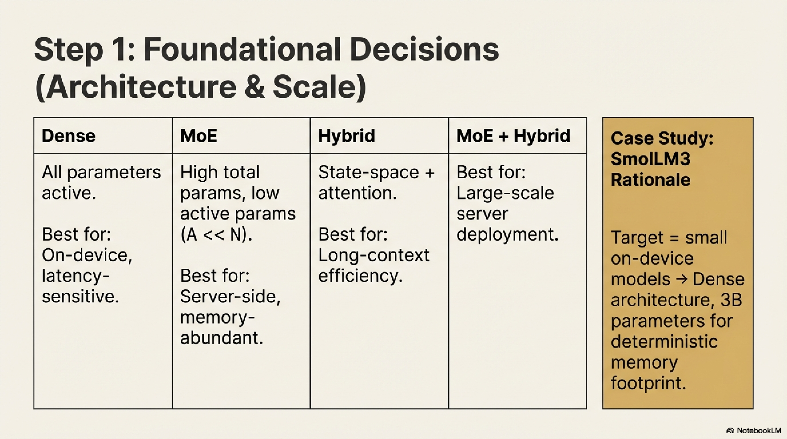

## 3. Foundational Decisions: Architecture Type and Model Scale

### 3.1 Pre-Ablation Decisions

Before ablation experiments can be designed and executed, two foundational decisions must be established, as they determine the experimental framework:

1. **Architecture type**: Dense transformer, Mixture-of-Experts (MoE), hybrid (e.g., incorporating state-space layers), or combinations thereof.
2. **Target model scale**: The approximate number of total and active parameters.

These decisions are guided by the project's strategic constraints—deployment target, latency requirements, memory budget, inference hardware—rather than by ablation, since they define the space within which ablations operate.

### 3.2 Architecture–Scale Decision Matrix

| Architecture Type | Characteristics | Suitable Deployment Targets |
|---|---|---|
| **Dense** | All parameters active during inference; simpler implementation; predictable memory/compute scaling | On-device, edge, latency-sensitive applications |
| **MoE** | Subset of parameters active per token ($A \ll N$); higher total parameter count for equivalent compute; routing complexity | Server-side inference where total memory is less constrained |
| **Hybrid** | Combines transformer attention with alternative layers (e.g., Mamba state-space layers); potentially superior length generalization | Applications requiring efficient long-context processing |
| **MoE + Hybrid** | Combines MoE routing with hybrid architectural elements | Large-scale server deployment with diverse capability requirements |

### 3.3 SmolLM3 Decision Rationale

For SmolLM3, the target was **small on-device models**, which motivated:

- **Dense architecture**: Simplifies deployment, avoids routing overhead, and provides deterministic memory footprint.
- **Llama-style transformer**: Proven architecture with extensive ecosystem support.
- **3B parameters**: Balances capability with on-device memory constraints.

---

## 4. Baseline Selection: Principles and Taxonomy


### 4.1 The Baseline-First Principle

A foundational methodological principle in LLM development is:

> **Every successful model builds upon a proven foundation and systematically modifies it for its specific requirements.**

This principle is not merely pragmatic advice; it reflects a deep truth about the accumulated knowledge embedded in existing architectures and training recipes:

- The standard transformer architecture (Vaswani et al., 2017) and its descendants represent the product of **thousands of person-years of iteration** across multiple organizations.
- Optimizers like AdamW (Loshchilov & Hutter, 2019) have been refined through extensive empirical debugging of failure modes, instabilities, and edge cases.
- Training hyperparameters (learning rates, warmup schedules, batch sizes) encode hard-won knowledge about training dynamics at scale.

**Starting from scratch means rediscovering every problem independently.** Starting from a proven baseline means inheriting all accumulated engineering and scientific knowledge embedded in that baseline.

### 4.2 Historical Precedent

The baseline-first principle is universally practiced by leading organizations:

| Model | Baseline Architecture | Reference |
|-------|----------------------|-----------|
| Qwen (first generation) | Llama architecture | Bai et al., 2023 |
| Llama 3 | Llama 2 | Meta, 2024 |
| Kimi K2 | DeepSeek-V3 MoE architecture | Team et al., 2025 |

### 4.3 Baseline Selection Criteria

A suitable baseline architecture must satisfy four criteria:

#### Criterion 1: Constraint Alignment

The architecture must be compatible with the deployment target and use case. A model intended for on-device inference must fit within device memory and latency budgets; a model intended for server-side deployment may prioritize throughput over footprint.

#### Criterion 2: Scale Validation

The architecture must have been **demonstrated in multi-trillion-token training runs** at similar or larger parameter counts. Architectures validated only at small scale may exhibit unforeseen instabilities, degraded scaling behavior, or training dynamics pathologies at the target scale.

#### Criterion 3: Documentation Quality

The architecture must have **published hyperparameters that have been proven to work** in open model releases. This includes learning rates, batch sizes, optimizer configurations, normalization strategies, initialization schemes, and data mixture ratios.

#### Criterion 4: Ecosystem Support

The architecture must be supported in:
- **Training frameworks** under consideration (Megatron-LM, Nanotron, TorchTitan, etc.)
- **Inference frameworks** intended for deployment (vLLM, TensorRT-LLM, llama.cpp, etc.)


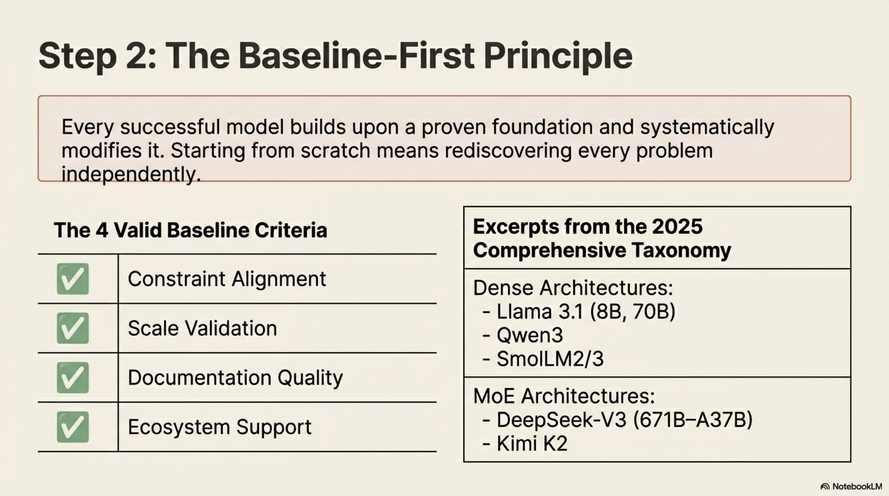

### 4.4 Comprehensive Baseline Taxonomy (2025)

The following table presents a non-exhaustive but representative set of strong baseline options organized by architecture type, as of early 2026:

#### Dense Architectures

| Model Family | Available Sizes | Key Characteristics |
|---|---|---|
| **Llama 3.1** | 8B, 70B | Proven at massive scale; extensive ecosystem |
| **Llama 3.2** | 1B, 3B | Validated for small-scale dense models |
| **Qwen3** | 0.6B, 1.7B, 4B, 14B, 32B | Broad size range; strong multilingual performance |
| **Gemma 3** | 12B, 27B | Google DeepMind; efficient architecture |
| **SmolLM2 / SmolLM3** | 135M, 360M, 1.7B, 3B | Optimized for small on-device deployment |

#### Mixture-of-Experts (MoE) Architectures

| Model Family | Available Sizes (Total–Active) | Key Characteristics |
|---|---|---|
| **Qwen3 MoE** | 30B–A3B, 235B–A122B | Versatile MoE with proven training recipes |
| **gpt-oss** | 21B–A3B, 117B–A5B | Open-source MoE baseline |
| **Kimi Moonlight** | 16B–A3B | Efficient MoE design |
| **Kimi K2** | 1T–A32B | Largest openly documented MoE |
| **DeepSeek-V3** | 671B–A37B | Pioneering MoE with multi-head latent attention |

#### Hybrid Architectures

| Model Family | Available Sizes | Key Characteristics |
|---|---|---|
| **Zamba2** | 1.2B, 2.7B, 7B | Mamba + attention hybrid |
| **Falcon-H1** | 0.5B, 1.5B, 3B, 7B, 34B | Hybrid state-space + attention |

#### MoE + Hybrid Architectures

| Model Family | Available Sizes (Total–Active) | Key Characteristics |
|---|---|---|
| **Qwen3-Next** | 80B–A3B | MoE with hybrid layers |
| **MiniMax-01** | 456B–A46B | Large-scale MoE hybrid |
| **MiMo-V2-Flash** | 309B–A15B | Efficient MoE hybrid |

### 4.5 Selection Procedure

1. **Identify architecture type** based on deployment constraints (Section 3).
2. **Select a baseline** with parameter count closest to the target.
3. **Do not over-optimize the selection**: the baseline is a starting point, not a final commitment. Subsequent ablation-driven modifications (Section 5) will refine the architecture.

---

## 5. Systematic Baseline Modification: The Discipline of Derisking

### 5.1 The Derisking Principle

Once a baseline is selected, the practitioner faces a temptation to immediately incorporate promising architectural innovations from recent literature. The discipline of **derisking** provides the corrective:


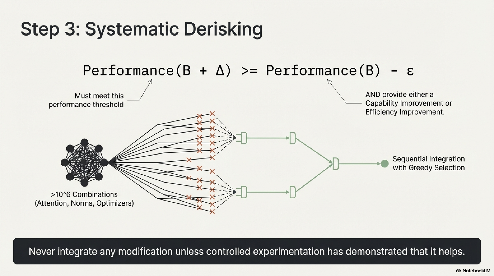

> **Never integrate any modification into the training recipe unless controlled experimentation has demonstrated that it helps.**

#### 5.1.1 Formal Definition of "Derisked"

A modification $\Delta$ applied to baseline configuration $\mathcal{B}$ is considered **derisked** if and only if empirical evaluation demonstrates that:

$$
\text{Performance}(\mathcal{B} + \Delta) \geq \text{Performance}(\mathcal{B}) - \epsilon
$$

where $\epsilon$ is a pre-defined acceptable performance tolerance, **and** the modification provides at least one of:

1. **Capability improvement**: Statistically significant gains on target evaluation benchmarks.
2. **Efficiency improvement**: Measurable benefits in inference latency, memory footprint, training throughput, or numerical stability.

If neither condition is met, the modification is rejected regardless of its theoretical appeal.

### 5.2 The Combinatorial Challenge

A typical LLM training configuration contains numerous modifiable components:

- Attention mechanism (multi-head, grouped-query, multi-query, multi-head latent)
- Positional encoding (RoPE, ALiBi, learned, NoPE)
- Activation function (SwiGLU, GELU, ReLU²)
- Normalization scheme (RMSNorm, LayerNorm; pre-norm vs. post-norm)
- Optimizer (AdamW, Lion, Muon, Sophia)
- Learning rate schedule (cosine, WSD, constant-then-decay)
- Embedding strategy (tied vs. untied)
- Model layout (depth vs. width ratio)

These components interact in **non-linear and often unpredictable ways**. Given $k$ components each with $m_i$ variants, the full combinatorial search space is:

$$
|\mathcal{S}| = \prod_{i=1}^{k} m_i
$$

For typical configurations, $|\mathcal{S}|$ easily exceeds $10^6$, making exhaustive search computationally infeasible.

### 5.3 Sequential Derisking Protocol

The practical solution is **sequential integration with greedy selection**:

```
Algorithm: Sequential Derisking Protocol

Input: Baseline B₀, candidate modifications {Δ₁, Δ₂, ..., Δₙ}, 
       priority ordering π
Output: Final configuration B*

1. B_current ← B₀
2. For i = 1 to n (in priority order π):
   a. Train B_current + Δ_π(i) under ablation conditions
   b. Train B_current under identical ablation conditions (if not cached)
   c. Evaluate both on benchmark suite
   d. If Performance(B_current + Δ_π(i)) > Performance(B_current) - ε:
      B_current ← B_current + Δ_π(i)  // Accept and integrate
   e. Else:
      Reject Δ_π(i)  // Do not integrate
3. Return B* = B_current
```

When compute budget permits, a **leave-one-out analysis** can be performed: after all accepted modifications are integrated, each is individually removed to verify its continued contribution in the presence of all other changes.

### 5.4 Strategic Experiment Prioritization

Not all candidate modifications merit experimental resources. Before allocating compute to any ablation, two screening questions must be answered affirmatively:

1. **Use-case relevance**: *Does this modification address a specific requirement of the target deployment scenario?*
2. **Training optimization**: *Does this modification improve training efficiency, stability, or data utilization?*

If a candidate modification does not clearly address either question, it should be **deprioritized or skipped entirely**, regardless of its novelty or prominence in recent literature.

---


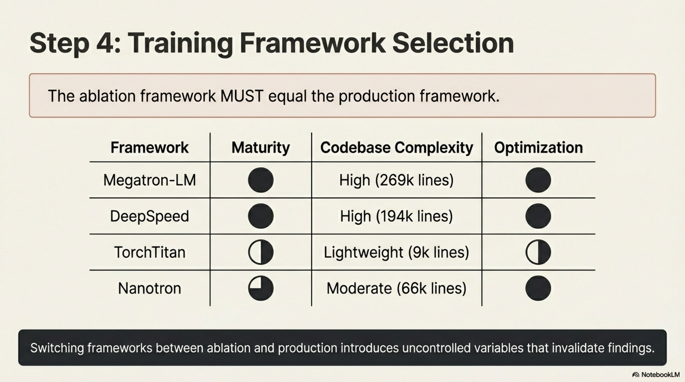

## 6. Training Framework Selection

### 6.1 Criticality of Framework Choice

The training framework is the computational substrate upon which all ablation experiments and the final training run execute. A critical operational principle governs this decision:

> **The training framework used for ablations must be identical to the framework used for the final production run.**

Switching frameworks between ablation and production introduces uncontrolled variables—different numerical implementations, parallelism strategies, memory management behaviors, and gradient computation paths—that can invalidate ablation findings.

### 6.2 Evaluation Criteria

Three primary criteria govern framework selection:

| Criterion | Description |
|-----------|-------------|
| **Architecture support** | The framework must natively support the target architecture or provide clean extension points for implementing it. |
| **Production stability** | The framework must be battle-tested, with a track record of completing multi-week training runs without mysterious failures, silent numerical divergences, or memory leaks. |
| **Throughput performance** | The framework must deliver competitive tokens-per-second-per-GPU to maximize the experimental value of available compute. |

### 6.3 Framework Comparison

| Framework | Feature Coverage | Production Track Record | Optimization Maturity | Codebase Scale (Core / Total) | Extensibility |
|-----------|-----------------|------------------------|----------------------|------------------------------|---------------|
| **Megatron-LM** | Extensive | Kimi K2, Nemotron | Pioneered 3D parallelism | 93k / 269k lines | Complex for newcomers |
| **DeepSpeed** | Extensive | BLOOM, GLM | Pioneered ZeRO & 3D parallelism | 94k / 194k lines | Complex for newcomers |
| **TorchTitan** | Growing | PyTorch team validated | Optimized for dense; MoE in progress | 7k / 9k lines | Moderate |
| **Nanotron** | Focused on HF pretraining | StarCoder, SmolLM | Optimized (UltraScale Playbook) | 15k / 66k lines | Moderate |

### 6.4 Detailed Framework Analysis

#### 6.4.1 Megatron-LM (NVIDIA)

The most mature framework in the ecosystem. It implements the full spectrum of parallelism strategies: tensor parallelism (TP), pipeline parallelism (PP), data parallelism (DP), sequence parallelism (SP), context parallelism (CP), and expert parallelism (EP). Its maturity ensures stability, but the codebase complexity (269k total lines) creates a steep learning curve for customization and debugging.

#### 6.4.2 DeepSpeed (Microsoft)

The originator of ZeRO (Zero Redundancy Optimizer) optimization stages. It provides comprehensive parallelism support and has powered multiple high-profile training runs. Like Megatron-LM, its extensive feature set comes at the cost of codebase complexity (194k total lines).

#### 6.4.3 TorchTitan (PyTorch / Meta)

A deliberately lightweight framework with a compact codebase (~9k total lines), designed for rapid experimentation. Its simplicity facilitates debugging and extension, but its relative youth means fewer battle-tested edge cases and potentially lower stability for extended production runs.

#### 6.4.4 Nanotron (Hugging Face)

A purpose-built framework for Hugging Face pretraining workflows, offering full flexibility and deep integration with the HF ecosystem. The development process yielded the Ultra-Scale Playbook—a comprehensive guide to distributed training. Currently supports all required dense model features, with MoE support under active development.

### 6.5 Selection Methodology

1. **Filter** frameworks by architecture support compatibility.
2. **Rank** remaining candidates by production stability for the target training duration.
3. **Benchmark** throughput on the target hardware configuration.
4. **Select** the framework offering the best trade-off between stability, throughput, and team familiarity.

For rapid experimentation and speed runs, simpler codebases frequently outperform feature-rich frameworks due to lower overhead and faster iteration cycles.

---


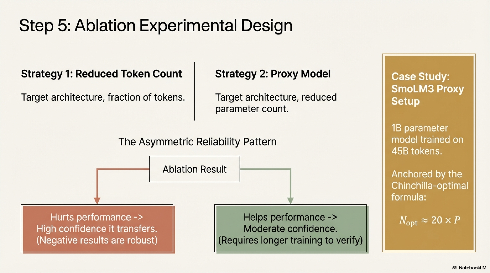

## 7. Ablation Experimental Design

### 7.1 Objective

The goal of ablation experiments is to obtain empirical results at small computational scale that **transfer reliably** to the full-scale production training run. This requires careful design of the ablation model, training duration, and experimental protocol.

### 7.2 Ablation Scaling Strategies

Two complementary strategies exist for reducing ablation cost while maintaining signal fidelity:

#### Strategy 1: Reduced Token Count (Same Model Size)

Train the target model architecture at full parameter count but on significantly fewer tokens than the production run.

$$
\text{Ablation tokens} \ll \text{Production tokens}
$$

**Example**: SmolLM3 ablations trained the full 3B model on 100B tokens, compared to the final 11T token production run—a reduction factor of $110\times$.

#### Strategy 2: Proxy Model (Reduced Model Size)

Train a smaller proxy model that preserves the architectural characteristics of the target but at a reduced parameter count.

**Example**: Kimi K2 (1T total parameters, 32B active) used a 3B MoE proxy with 0.5B active parameters for certain ablation experiments (Team et al., 2025).

### 7.3 Transferability of Small-Scale Findings

The transferability of ablation results follows an **asymmetric reliability pattern**:

| Ablation Result | Transferability to Full Scale | Confidence Level |
|----------------|-------------------------------|------------------|
| **Hurts performance** | Reliably transfers (negative results are robust) | **High** |
| **Helps performance** | Transfers with caveats; depends on training duration and proxy fidelity | **Moderate** |

**Formal statement**: Let $\mathcal{P}_{\text{ablation}}(\Delta)$ denote the performance change from modification $\Delta$ at ablation scale, and $\mathcal{P}_{\text{full}}(\Delta)$ the corresponding change at full scale. Empirical evidence supports:

$$
\mathcal{P}_{\text{ablation}}(\Delta) < 0 \implies \mathcal{P}_{\text{full}}(\Delta) < 0 \quad \text{(high probability)}
$$

$$
\mathcal{P}_{\text{ablation}}(\Delta) > 0 \implies \mathcal{P}_{\text{full}}(\Delta) > 0 \quad \text{(moderate probability, increasing with ablation scale)}
$$

The reliability of positive transfers improves with:
- **Longer ablation training** (more tokens)
- **Closer proxy model size** to the target
- **Greater architectural similarity** between proxy and target

### 7.4 SmolLM3 Ablation Configuration

The primary ablation setup for SmolLM3 consists of a 1B parameter transformer following the Llama 3.2 1B architecture, trained on 45B tokens. This configuration was chosen to balance experimental throughput with signal reliability.

#### 7.4.1 Training Throughput

- **Hardware**: 1 node, 8× NVIDIA H100 GPUs
- **Throughput**: ~42,000 tokens per second per GPU
- **Wall-clock time**: Approximately 1.5 days per ablation run

#### 7.4.2 Token Budget Rationale

The 45B token training budget was selected to ensure stable evaluation signal. For a 1B parameter model, the Chinchilla-optimal token count is approximately 35B tokens (Hoffmann et al., 2022), computed from the relation:

$$
N_{\text{opt}} \approx 20 \times P
$$

where $P$ is the parameter count in units of parameters and $N_{\text{opt}}$ is the optimal token count. Training slightly beyond Chinchilla-optimal ensures that evaluation metrics have stabilized and are not still in the rapid-change phase of early training.

#### 7.4.3 Detailed Configuration Specification

The ablation baseline configuration is specified in structured YAML format with the following key sections:

**Data Configuration:**

```yaml
data_stages:
  - data:
      dataset:
        dataset_folder:
          - fineweb-edu       # High-quality English web text
          - stack-edu-python   # Curated Python code
          - finemath-3plus     # Mathematical content (quality ≥ 3)
        dataset_weights:
          - 0.7               # 70% English web
          - 0.2               # 20% code
          - 0.1               # 10% math
```

**Model Architecture (Llama 3.2 1B):**

```yaml
model:
  model_config:
    hidden_size: 2048            # d_model
    num_hidden_layers: 16        # L (number of transformer layers)
    num_attention_heads: 32      # h (query heads)
    num_key_value_heads: 8       # h_kv (GQA with 4:1 ratio)
    intermediate_size: 8192      # d_ff (FFN hidden dimension)
    max_position_embeddings: 4096  # Maximum sequence length
    rope_theta: 50000.0          # RoPE base frequency
    tie_word_embeddings: true    # Shared input/output embeddings
```

**Optimizer Configuration (AdamW with Cosine Schedule):**

```yaml
optimizer:
  clip_grad: 1.0                    # Gradient clipping threshold
  learning_rate_scheduler:
    learning_rate: 0.0005           # η_max = 5 × 10⁻⁴
    lr_decay_starting_step: 2000    # Begin decay after warmup
    lr_decay_steps: 18000           # Decay duration
    lr_decay_style: cosine          # Cosine annealing
    lr_warmup_steps: 2000           # Linear warmup duration
    lr_warmup_style: linear
    min_decay_lr: 5.0e-05           # η_min = 5 × 10⁻⁵
  optimizer_factory:
    adam_beta1: 0.9                 # β₁ (first moment decay)
    adam_beta2: 0.95                # β₂ (second moment decay)
    adam_eps: 1.0e-08               # ε (numerical stability)
    name: adamW                     # Weight-decoupled Adam
```

**Parallelism Configuration:**

```yaml
parallelism:
  dp: 8   # Data parallelism across 8 GPUs
  tp: 1   # No tensor parallelism (unnecessary at 1B scale)
  pp: 1   # No pipeline parallelism (unnecessary at 1B scale)
```

**Training Budget:**

```yaml
tokens:
  batch_accumulation_per_replica: 16
  micro_batch_size: 3
  sequence_length: 4096
  train_steps: 20000
```

The **global batch size (GBS)** in tokens is computed as:

$$
\text{GBS} = \text{DP} \times \text{batch\_accumulation} \times \text{micro\_batch\_size} \times \text{sequence\_length}
$$

$$
\text{GBS} = 8 \times 16 \times 3 \times 4096 = 1{,}572{,}864 \approx 1.5\text{M tokens}
$$

The **total training tokens** are:

$$
\text{Total tokens} = \text{GBS} \times \text{train\_steps} = 1.5\text{M} \times 20{,}000 = 30\text{B tokens}
$$

*(Note: The configuration shown here specifies 20k steps / 30B tokens; the full ablation suite extends some runs to 45B tokens for additional signal stability.)*

### 7.5 Controlling for Parameter Count Variations

Architectural modifications frequently alter the total parameter count, which confounds fair comparison. Two prominent examples:

1. **Embedding strategy**: Switching from tied embeddings ($W_{\text{input}} = W_{\text{output}}^{\top}$) to untied embeddings doubles the embedding parameter count:

$$
P_{\text{embed, tied}} = V \times d_{\text{model}}
$$

$$
P_{\text{embed, untied}} = 2 \times V \times d_{\text{model}}
$$

where $V$ is the vocabulary size and $d_{\text{model}}$ is the hidden dimension.

2. **Attention mechanism**: Switching from multi-head attention (MHA) to grouped-query attention (GQA) or multi-query attention (MQA) reduces attention parameters:

$$
P_{\text{attn, MHA}} = 4 \times d_{\text{model}}^2 \quad \text{(per layer)}
$$

$$
P_{\text{attn, GQA}} = d_{\text{model}}^2 \left(1 + \frac{h_{\text{kv}}}{h} + \frac{h_{\text{kv}}}{h} + 1\right) = d_{\text{model}}^2 \left(2 + \frac{2h_{\text{kv}}}{h}\right) \quad \text{(per layer)}
$$

where $h$ is the number of query heads and $h_{\text{kv}}$ is the number of key-value heads.


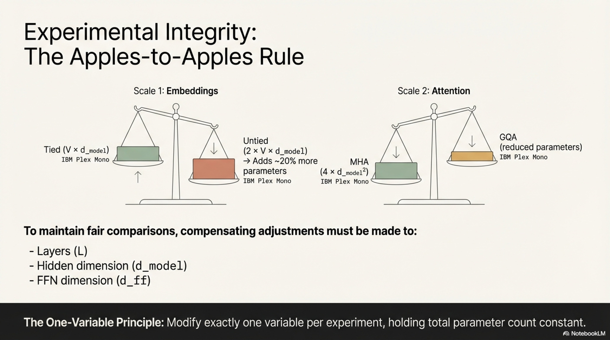

To maintain fair comparisons, compensating adjustments to $d_{\text{model}}$, $L$ (number of layers), or $d_{\text{ff}}$ (FFN hidden dimension) must be made to keep total parameter count approximately constant across ablation variants.

#### 7.5.1 Parameter Counting Utility

A systematic parameter counting function ensures accurate tracking:

```python
from transformers import LlamaConfig, LlamaForCausalLM

def count_parameters(
    tie_embeddings=True,
    num_key_value_heads=4,
    num_attention_heads=32,
    hidden_size=2048,
    num_hidden_layers=16,
    intermediate_size=8192,
    vocab_size=128256,
    sequence_length=4096,
):
    config = LlamaConfig(
        hidden_size=hidden_size,
        num_hidden_layers=num_hidden_layers,
        num_attention_heads=num_attention_heads,
        num_key_value_heads=num_key_value_heads,
        intermediate_size=intermediate_size,
        vocab_size=vocab_size,
        max_position_embeddings=sequence_length,
        tie_word_embeddings=tie_embeddings,
    )
    model = LlamaForCausalLM(config)
    return f"{sum(p.numel() for p in model.parameters()) / 1e9:.2f}B"
```

### 7.6 Parameter Distribution Analysis

For the baseline 1B configuration with tied embeddings and MHA, the parameter distribution is:

| Component | Formula | Parameter Count | Percentage |
|-----------|---------|----------------|------------|
| **Embeddings** (tied input + output) | $V \times d_{\text{model}}$ | ~262M | ~19.5% |
| **Attention layers** (Q, K, V, O projections) | $L \times d_{\text{model}}^2 \times 4$ | ~268M | ~20.0% |
| **Feed-forward layers** (up, gate, down) | $L \times d_{\text{model}} \times d_{\text{ff}} \times 3$ | ~805M | ~60.0% |
| **Layer norms** (input + attention per layer) | $L \times d_{\text{model}} \times 2$ | ~68K | ~0.005% |
| **Total** | — | **~1.34B** | 100% |

Key observations:
- Feed-forward layers dominate parameter count at ~60%.
- Attention layers constitute ~20%.
- Embeddings constitute ~20% (with tied strategy).
- Layer norms are negligible.

### 7.7 The One-Variable Principle

A non-negotiable experimental discipline:

> **Modify exactly one variable per ablation experiment, holding all other factors constant.**

If multiple variables are changed simultaneously and performance changes, the causal attribution is ambiguous. Individual contributions must be assessed first; successful modifications are then combined, and their joint effect is re-evaluated to detect positive or negative interactions.

---

## 8. Evaluation Methodology

### 8.1 The Insufficiency of Training Loss as the Sole Metric

The training loss $\mathcal{L}(\theta)$—typically the cross-entropy over next-token predictions—is a necessary but insufficient indicator of model quality:

$$
\mathcal{L}(\theta) = -\frac{1}{T} \sum_{t=1}^{T} \log p_\theta(x_t \mid x_{<t})
$$

**Utility**: A smoothly decreasing loss curve without spikes or instability is a prerequisite for healthy training. For many architectural choices, loss correlates with downstream performance (Y. Chen et al., 2025).

**Limitations**:


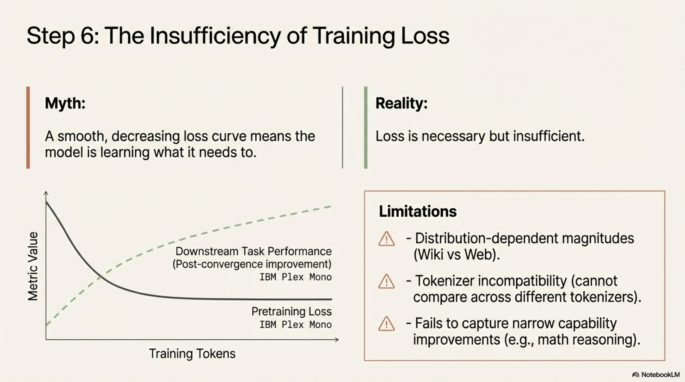

| Failure Mode | Description |
|---|---|
| **Distribution-dependent magnitude** | Training on Wikipedia yields lower loss than web pages (next tokens are more predictable), but this does not imply superior downstream capability. |
| **Tokenizer incompatibility** | Loss values are incomparable across runs using different tokenizers, as different tokenizations alter the prediction difficulty per token. |
| **Capability-specific effects** | Modifications that specifically affect narrow capabilities (e.g., mathematical reasoning) may produce negligible changes in average loss but significant changes in task-specific performance. |
| **Post-convergence improvement** | Models can continue improving on downstream tasks even after pretraining loss has converged (Liu et al., 2022). |

### 8.2 Downstream Evaluation: Task Formulation Taxonomy

Fine-grained downstream evaluation requires careful selection of **task formulations**—the specific mechanisms by which the model is queried and evaluated. Three primary formulations exist:


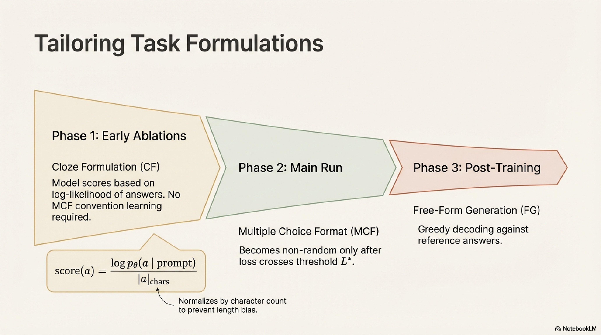

#### 8.2.1 Multiple Choice Format (MCF)

The model receives a prompt with explicitly enumerated answer options (A/B/C/D) and must select one. The model's output is evaluated based on which option letter it assigns the highest probability to (or generates first).

**Characteristics**:
- Requires the model to understand the MCF convention.
- Performance is initially random for small models or early training stages.
- For a 7B transformer, non-random MMLU MCF performance emerges after ~500B tokens (Gu et al., 2025).
- For a 1.7B model, non-random MMLU MCF was observed only after ~6T tokens (Allal et al., 2025).

#### 8.2.2 Cloze Formulation (CF)

The model does not see the answer options in the prompt. Instead, the **log-likelihood of each candidate answer** is computed independently, and the answer with the highest (normalized) log-likelihood is selected.

**Scoring**: Accuracy is computed as the fraction of questions where the correct answer achieves the highest log-probability, normalized by character count to prevent length bias:

$$
\text{score}(a) = \frac{\log p_\theta(a \mid \text{prompt})}{|a|_{\text{chars}}}
$$

$$
\hat{a} = \arg\max_{a \in \mathcal{A}} \text{score}(a)
$$

where $\mathcal{A}$ is the set of candidate answers and $|a|_{\text{chars}}$ is the character length of answer $a$.

**Characteristics**:
- Provides signal earlier in training than MCF.
- Does not require the model to have learned MCF conventions.
- Preferred for small-scale ablations.

#### 8.2.3 Free-Form Generation (FG)

The model generates a complete response via greedy decoding (or other decoding strategies), and the response is evaluated against a reference answer.

**Characteristics**:
- Requires substantial latent knowledge and generation capability.
- Too demanding for early-stage pretraining ablations.
- Becomes the primary formulation for post-trained (instruction-tuned) model evaluation.

### 8.3 Formulation Selection Strategy

| Training Phase | Recommended Formulation | Rationale |
|---|---|---|
| Early ablations (small models, few tokens) | Cloze Formulation (CF) | Provides early signal; does not require MCF convention learning |
| Main training run (later stages) | Multiple Choice Format (MCF) | Better signal at later stages; more discriminative for capable models |
| Post-training evaluation | Free-Form Generation (FG) | Tests actual generation capability |

This phased strategy is supported by Du et al. (2025), who argue that the transition from random to non-random MCF performance is fundamentally governed by the pretraining loss reaching a specific threshold $\mathcal{L}^*$:

$$
\text{MCF non-random} \iff \mathcal{L}(\theta) \leq \mathcal{L}^*
$$


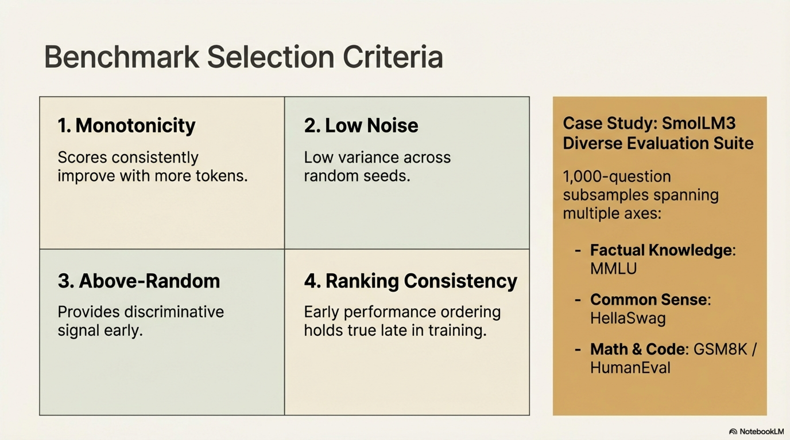

### 8.4 Benchmark Selection Criteria

For ablation experiments, benchmark tasks must satisfy four properties (established in the FineWeb/FineTasks methodology):

#### Property 1: Monotonicity

Benchmark scores must **consistently improve** as training progresses (more tokens consumed):

$$
t_1 < t_2 \implies \mathbb{E}[\text{Score}(t_1)] \leq \mathbb{E}[\text{Score}(t_2)]
$$

Tasks that exhibit non-monotonic behavior confound the interpretation of ablation results.

#### Property 2: Low Noise

When multiple runs with identical configurations but different random seeds are executed, benchmark score variance must be small:

$$
\text{Var}_{\text{seed}}[\text{Score}] \leq \tau_{\text{noise}}
$$

High-variance benchmarks risk inducing **noise-chasing**: accepting or rejecting modifications based on stochastic fluctuations rather than genuine performance differences.

#### Property 3: Above-Random Performance

Tasks must exhibit above-random performance within the ablation training budget. Benchmarks that remain at chance level throughout the ablation provide zero discriminative signal and waste evaluation compute.

#### Property 4: Ranking Consistency

If configuration $A$ outperforms configuration $B$ at an early checkpoint, this ordering must remain stable at later checkpoints:

$$
\text{Score}_A(t_{\text{early}}) > \text{Score}_B(t_{\text{early}}) \implies \text{Score}_A(t_{\text{late}}) > \text{Score}_B(t_{\text{late}}) \quad \text{(with high probability)}
$$

Ranking inversions undermine the foundational assumption that ablation results transfer to longer training horizons.

### 8.5 SmolLM3 Evaluation Suite

The following benchmarks constitute the ablation evaluation suite, selected based on the four criteria above:

| Benchmark | Domain | Task Type | Total Questions | Ablation Sample | Capability Tested |
|-----------|--------|-----------|-----------------|-----------------|-------------------|
| **MMLU** | Broad knowledge | Multiple choice | 14,000 | 1,000 | Academic knowledge across 57 subjects |
| **ARC** | Science & reasoning | Multiple choice | 7,000 | 1,000 | Grade-school science reasoning |
| **HellaSwag** | Common sense | Multiple choice | 10,000 | 1,000 | Narrative completion via common-sense reasoning |
| **WinoGrande** | Common sense | Binary choice | 1,700 | 1,000 | Pronoun resolution requiring world knowledge |
| **CommonsenseQA** | Common sense | Multiple choice | 1,100 | 1,000 | Everyday concept reasoning |
| **OpenBookQA** | Science | Multiple choice | 500 | 500 | Elementary science with reasoning |
| **PIQA** | Physical common sense | Binary choice | 1,800 | 1,000 | Physical intuition about objects |
| **GSM8K** | Mathematics | Free-form generation | 1,319 | Full (3B only) | Grade-school math word problems |
| **HumanEval** | Code | Free-form generation | 164 | Full (3B only) | Python function synthesis from docstrings |

**Implementation notes**:
- All multiple-choice benchmarks are evaluated using **cloze formulation (CF)** during ablations.
- Evaluation is subsampled to 1,000 questions per benchmark (except GSM8K, HumanEval, and RULER) to accelerate evaluation at the cost of minor additional noise.
- GSM8K and HumanEval are evaluated in full for 3B ablations but omitted from 1B experiments (as they require more capability than 1B models reliably exhibit).
- Additional multilingual benchmarks are incorporated for multilingual ablations and production training.
- All evaluations are executed using the **LightEval** framework.

### 8.6 Benchmark Diversity Analysis

The evaluation suite is deliberately constructed to span multiple orthogonal capability axes:

| Capability Axis | Benchmarks |
|---|---|
| **Factual knowledge** | MMLU, ARC, OpenBookQA |
| **Common-sense reasoning** | HellaSwag, WinoGrande, CommonsenseQA, PIQA |
| **Mathematical reasoning** | GSM8K |
| **Code generation** | HumanEval |

This diversity ensures that ablation decisions are not biased toward any single capability dimension.

---


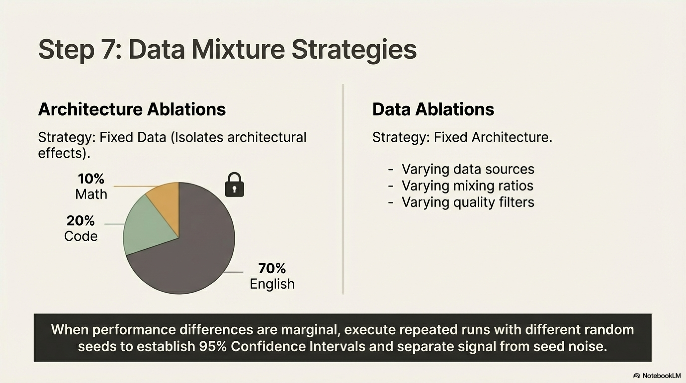

## 9. Data Mixture Strategy for Ablations

### 9.1 Orthogonal Strategies for Architecture vs. Data Ablations

The data mixture strategy differs fundamentally between architecture ablations and data ablations, reflecting their distinct experimental objectives:

#### 9.1.1 Architecture Ablations: Fixed Data, Variable Architecture

**Objective**: Isolate the effect of architectural modifications from data effects.

**Strategy**: Train on a **fixed, high-quality data mixture** that provides early signal across a broad range of capabilities. The mixture should cover:

- **General English text**: FineWeb-Edu (high-quality educational web content)
- **Mathematical content**: FineMath (curated mathematical text, quality score ≥ 3)
- **Code**: Stack-Edu-Python (curated Python code)

**Mixing ratios** (SmolLM3 baseline):

$$
\mathbf{w} = [0.7, 0.2, 0.1] \quad \text{for [English, Code, Math]}
$$

**Rationale**: Architectural findings are expected to **generalize across data distributions**, including multilingual data. A simple, fixed mixture eliminates data as a confounding variable.

#### 9.1.2 Data Ablations: Fixed Architecture, Variable Data

**Objective**: Isolate the effect of data composition on model performance.

**Strategy**: Fix the architecture and systematically vary data sources, mixing ratios, quality filtering thresholds, and domain proportions to understand their individual and joint effects on downstream capabilities.

### 9.2 Statistical Considerations

When evaluation differences between ablation variants are small, random seed variation may account for observed differences. If compute budget permits, **repeated runs with different random seeds** should be conducted to estimate confidence intervals:

$$
\text{CI}_{95\%} = \bar{x} \pm 1.96 \frac{s}{\sqrt{n}}
$$

where $\bar{x}$ is the mean performance across $n$ seeds and $s$ is the sample standard deviation.

---

## 10. Compute Cost Estimation and Budget Planning

### 10.1 The True Cost of Model Development

A pervasive misconception in the broader community is that the cost of developing an LLM equals the cost of the final training run. This dramatically underestimates total expenditure. The complete compute budget must account for:

1. **Ablation experiments** (pre-training and mid-training)
2. **The final production training run**
3. **Evaluation compute**
4. **Debugging, restarts, and recovery from unexpected failures**

### 10.2 SmolLM3 Compute Breakdown

| Phase | GPU Count | Duration (Days) | GPU-Hours |
|-------|-----------|-----------------|-----------|
| **Main pretraining run** | 384 | 30 | 276,480 |
| **Ablations (pretraining phase)** | 192 | 15 | 69,120 |
| **Ablations (mid-training phase)** | 192 | 10 | 46,080 |
| **Training reset / debugging** | 384 / 192 | 3 / 4 | 46,080 |
| **Total** | — | — | **437,760** |

### 10.3 Evaluation Compute

Evaluation compute, while smaller than training compute, is non-negligible:

- **Per evaluation**: ~1.5 GPU-hours for the full suite (English, multilingual, math & code)
- **Evaluation frequency**: Every 10B tokens throughout 11T token training → $\frac{11{,}000}{10} = 1{,}100$ evaluations
- **Ablation evaluations**: Additional evaluations across 100+ ablation runs
- **Long-context evaluations**: ~1 hour on 8 GPUs per run (8 GPU-hours each)
- **Estimated total evaluation cost**: Slightly under **10,000 GPU-hours**

### 10.4 Cost Distribution Analysis

The cost distribution reveals a critical insight:

$$
\text{Ablation + Debugging cost} = 69{,}120 + 46{,}080 + 46{,}080 = 161{,}280 \text{ GPU-hours}
$$

$$
\text{Main run cost} = 276{,}480 \text{ GPU-hours}
$$

$$
\frac{\text{Ablation + Debugging}}{\text{Main run}} = \frac{161{,}280}{276{,}480} \approx 58.3\%
$$

**Ablation and debugging compute exceeded half the cost of the final training run.** This ratio is not anomalous; it is characteristic of any serious model development effort. The SmolLM3 team conducted over **100 ablation experiments** across the development cycle.

### 10.5 Budget Planning Formula

A realistic compute budget for LLM development should be estimated as:


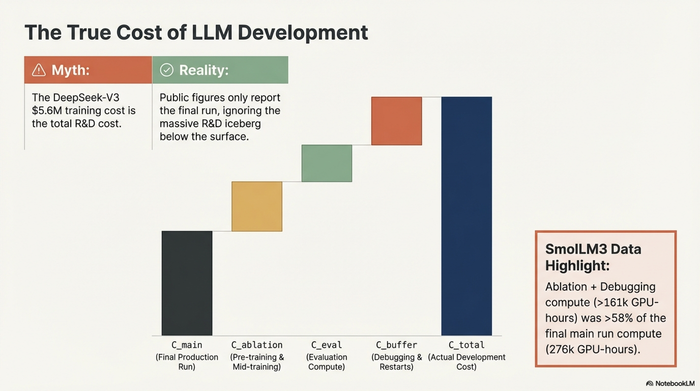

$$
C_{\text{total}} = C_{\text{main}} + C_{\text{ablation}} + C_{\text{eval}} + C_{\text{buffer}}
$$

where:

- $C_{\text{main}}$: Cost of the final production training run
- $C_{\text{ablation}}$: Cost of pre-training and mid-training ablation experiments (typically $0.3\text{–}0.6 \times C_{\text{main}}$)
- $C_{\text{eval}}$: Evaluation compute (typically $0.02\text{–}0.05 \times C_{\text{main}}$)
- $C_{\text{buffer}}$: Reserve for unexpected failures, restarts, and debugging (recommend $\geq 0.15 \times C_{\text{main}}$)

A conservative estimate:

$$
C_{\text{total}} \approx 1.5\text{–}2.0 \times C_{\text{main}}
$$

### 10.6 The DeepSeek-V3 Illustration

When DeepSeek-V3 was released, its reported \$5.6M training cost was widely misinterpreted as the total R&D cost. In reality, this figure reflects **only the final training run**. The research costs—ablations, failed runs, debugging, architectural exploration—were undisclosed but certainly significantly higher. Given the scale (671B parameters) and novelty (multi-head latent attention, auxiliary-loss-free load balancing), the total development cost was likely a substantial multiple of the reported training cost.

This illustrates a general principle: **publicly reported training costs systematically underestimate total development costs**, creating distorted perceptions of the true investment required for frontier model development.

---


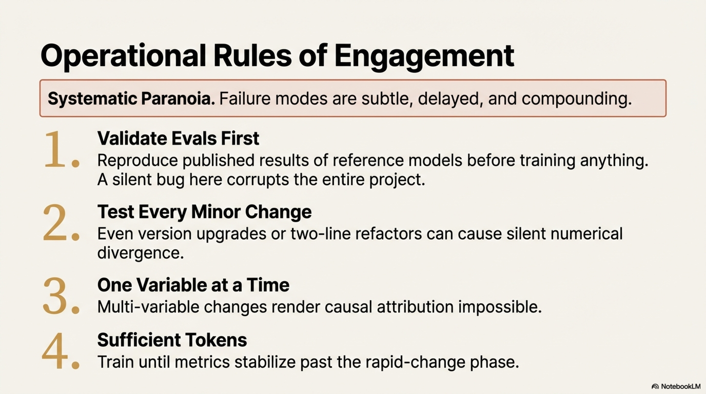

## 11. Operational Rules of Engagement

### 11.1 Governing Principle

> **Adopt a posture of systematic paranoia regarding every component of the experimental pipeline.**

This principle is not hyperbolic; it reflects hard-won operational experience. The failure modes in LLM development are subtle, delayed, and compounding—making rigorous operational discipline the primary defense against wasted compute and flawed conclusions.

### 11.2 Rule 1: Validate the Evaluation Suite Before Any Training

**Requirement**: Before training any models, verify that the evaluation suite **reproduces published results** of reference models that will serve as comparison points.

**Procedure**:
1. Download published model checkpoints.
2. Run the complete evaluation suite.
3. Compare obtained scores against published scores.
4. Investigate and resolve any discrepancies before proceeding.

**Special attention for generative evaluations** (e.g., GSM8K, HumanEval):
- Manually inspect a sample of model outputs.
- Verify prompt formatting is correct (instruction format, few-shot examples, delimiters).
- Verify post-processing logic correctly extracts answers from generated text.
- Confirm that evaluation metrics match the published methodology.

**Rationale**: Since evaluations guide every subsequent decision, errors in the evaluation pipeline propagate to every architectural and data choice, silently corrupting the entire development process.

### 11.3 Rule 2: Test Every Change, Regardless of Apparent Magnitude

**Requirement**: No modification to the codebase, dependencies, or configuration is exempt from empirical validation—including seemingly innocuous changes such as:

- Library version upgrades
- "Minor" code refactors touching "only two lines"
- Configuration formatting changes
- Dependency updates in transitive packages

**Rationale**: Subtle bugs introduced by small changes can produce:
- Silent numerical divergences that only manifest after thousands of training steps.
- Performance shifts that contaminate ablation comparisons.
- Non-deterministic behavior that increases evaluation noise.

**Implementation**: Maintain a comprehensive regression test suite covering all critical training and evaluation code paths. Every commit must pass the test suite before being integrated.

### 11.4 Rule 3: Change One Variable at a Time

**Requirement**: Each ablation experiment must modify **exactly one variable** relative to the current baseline. All other configuration elements must remain identical.

**Procedure**:
1. Assess individual modifications independently.
2. If multiple modifications each yield improvements, combine them into a single configuration.
3. Re-evaluate the combined configuration to detect interaction effects.

**Rationale**: Simultaneous multi-variable changes render causal attribution impossible. Observed performance changes cannot be assigned to any individual modification, eliminating the scientific value of the experiment.

### 11.5 Rule 4: Train on Sufficient Tokens with Sufficient Evaluation Coverage

**Requirement**: Ablation runs must:
- Train on enough tokens that evaluation metrics have **stabilized beyond the rapid-change phase**.
- Include sufficient **benchmark diversity** to detect capability-specific effects.

**Rationale**: Premature evaluation termination produces noisy metrics that do not reliably predict longer-horizon behavior. Insufficient benchmark coverage risks missing regressions in capabilities not measured.

### 11.6 The Golden Principle

> **Once a validated experimental setup is established, no change to any component of the pipeline should proceed to production without empirical re-validation.**

---

## 12. Conclusion

### 12.1 Summary of Methodological Framework

This report has presented a comprehensive technical framework for the empirical foundations of LLM development, organized around the following key principles:

1. **Empiricism over intuition**: LLM behavior is frequently counter-intuitive; controlled experimentation is the only reliable mechanism for acquiring knowledge about what works.

2. **Baseline-first development**: Every model should begin from a proven, well-documented foundation, inheriting accumulated engineering knowledge rather than rediscovering problems independently.

3. **Disciplined derisking**: No modification is integrated without empirical evidence of benefit; changes are tested sequentially against the current best configuration.

4. **Framework consistency**: The training framework must be identical between ablation and production phases to prevent confounding variables.

5. **Rigorous experimental design**: One variable per experiment, controlled parameter counts, sufficient training duration, and reproducible configurations.

6. **Multi-faceted evaluation**: Training loss is supplemented by downstream benchmarks spanning knowledge, reasoning, mathematics, and code, evaluated using formulations appropriate to the training stage (CF for early ablations, MCF for later stages, FG for post-training).

7. **Realistic cost planning**: Total development cost is $1.5\text{–}2\times$ the final training run cost, with ablations and debugging constituting a substantial fraction of total compute.

8. **Operational paranoia**: Every component of the pipeline—evaluation, training code, dependencies, configurations—is subject to continuous validation and regression testing.


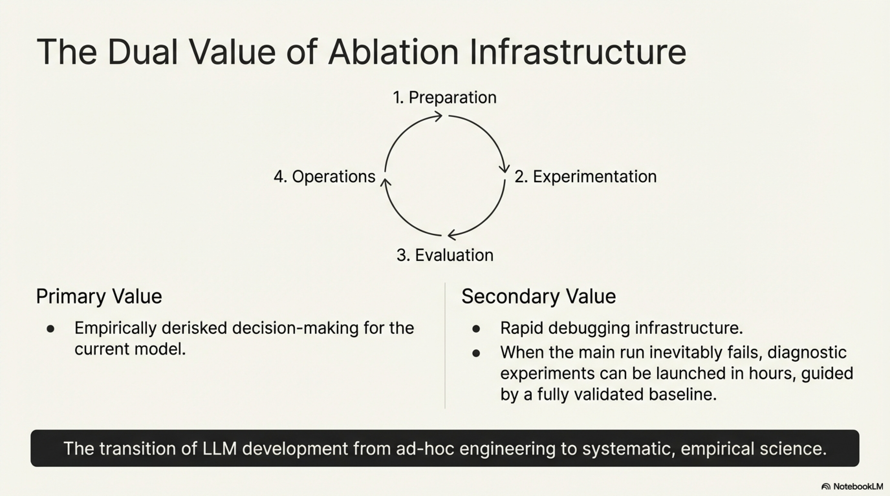

### 12.2 The Dual Value of Ablation Infrastructure

The value of a robust ablation infrastructure extends beyond the immediate goal of making optimal design decisions for a single model. When problems inevitably arise during the main training run—instabilities, unexpected performance regressions, infrastructure failures—the ablation infrastructure provides:

- **Rapid hypothesis testing**: New diagnostic experiments can be launched in hours rather than days.
- **Decision confidence**: Every component of the training recipe has been independently validated, narrowing the debugging search space.
- **Institutional knowledge**: The accumulated ablation results constitute a searchable knowledge base for future development cycles.

### 12.3 Toward a Science of Model Development

The methodology described in this report represents a maturation of LLM development from ad hoc engineering toward systematic experimental science. As the field progresses toward deeper theoretical understanding—analogous to the transition from thermodynamics to statistical mechanics—these empirical foundations will continue to serve as the bedrock upon which theoretical insights are validated and operationalized.

---

## References

- Allal, L. B., et al. (2025). SmolLM2: When Smol Goes Big — Data-Centric Training of a Small Language Model. *Hugging Face Technical Report*.
- Bai, J., et al. (2023). Qwen Technical Report. *arXiv preprint arXiv:2309.16609*.
- Du, Z., et al. (2025). On the evaluation of LLMs during pretraining. *arXiv preprint*.
- Gu, Y., et al. (2025). OLMES: A Standard for Language Model Evaluations. *arXiv preprint*.
- Hoffmann, J., et al. (2022). Training Compute-Optimal Large Language Models. *NeurIPS*.
- Khatri, A., et al. (2025). ScaleRL: Scalable Reinforcement Learning. *arXiv preprint*.
- Li, J., et al. (2025). On evaluation formulations for pretrained language models. *arXiv preprint*.
- Liang, T., et al. (2025). TorchTitan: One-stop PyTorch native solution for production ready LLM pretraining. *arXiv preprint*.
- Liu, Z., et al. (2022). Few-Shot Parameter-Efficient Fine-Tuning is Better and Cheaper than In-Context Learning. *NeurIPS*.
- Loshchilov, I., & Hutter, F. (2019). Decoupled Weight Decay Regularization. *ICLR*.
- Shao, Z., et al. (2024). DeepSeekMath: Pushing the Limits of Mathematical Reasoning in Open Language Models. *arXiv preprint*.
- Team, K., et al. (2025). Kimi K2 Technical Report. *arXiv preprint*.
- Vaswani, A., et al. (2017). Attention Is All You Need. *NeurIPS*.
- Y. Chen, et al. (2025). On the relationship between pretraining loss and downstream performance. *arXiv preprint*.