# Tokenizer Design, Evaluation, and Selection for Large Language Models: A Comprehensive Technical Report

---

## Table of Contents

1. [Introduction and Motivation](#1-introduction-and-motivation)
2. [Tokenizer Fundamentals: Bridging Raw Text and Model Computation](#2-tokenizer-fundamentals)
3. [Pre-Tokenization and Text Normalization](#3-pre-tokenization-and-text-normalization)
4. [Tokenization Algorithms](#4-tokenization-algorithms)
5. [Vocabulary Size: Theoretical Analysis and Practical Trade-Offs](#5-vocabulary-size)
6. [Domain-Specific Tokenization Considerations](#6-domain-specific-tokenization)
7. [Quantitative Tokenizer Evaluation Metrics](#7-quantitative-tokenizer-evaluation-metrics)
8. [Cross-Linguistic Tokenizer Benchmarking](#8-cross-linguistic-tokenizer-benchmarking)
9. [Choosing Between Existing and Custom Tokenizers](#9-choosing-between-existing-and-custom-tokenizers)
10. [Special Tokens and Chat Template Integration](#10-special-tokens-and-chat-template-integration)
11. [Downstream Impact on Model Performance](#11-downstream-impact-on-model-performance)
12. [Conclusion](#12-conclusion)
13. [References](#13-references)

---

## 1. Introduction and Motivation

The tokenizer constitutes the **interface layer** between raw human-readable text and the numerical tensor representations that a language model operates upon. Despite its foundational role, tokenization is among the most underappreciated components in the LLM development pipeline. Architectural innovations in attention mechanisms, mixture-of-experts routing, and training paradigms receive disproportionate attention, yet the tokenizer governs the **granularity, efficiency, and representational fidelity** of every input the model processes and every output it generates.

The analogy to a translator is precise: the tokenizer performs a bijective mapping between the space of natural language strings and the space of integer sequences that serve as model inputs. As with any translation system, the quality of this mapping propagates through every downstream computation. A poorly designed tokenizer introduces systematic biases:

- **Over-fragmentation** of text in underrepresented languages inflates sequence lengths, increasing training cost ($\propto$ sequence length) and inference latency
- **Inadequate domain coverage** (e.g., mathematical notation, programming syntax) forces the model to reconstruct semantic units from sub-optimal token boundaries
- **Vocabulary-parameter trade-offs** directly affect the embedding layer's share of total model parameters, with cascading effects on capacity allocation

This report provides a rigorous, end-to-end treatment of tokenizer design, covering algorithmic foundations, vocabulary sizing, quality metrics, cross-linguistic evaluation, domain-specific considerations, and the decision framework for selecting or training tokenizers for frontier LLM development.

---

## 2. Tokenizer Fundamentals: Bridging Raw Text and Model Computation

### 2.1 Core Function

A tokenizer implements two complementary mappings:

**Encoding (Tokenization):**

$$
\mathcal{E}: \Sigma^* \rightarrow \mathbb{Z}_{\geq 0}^{n}
$$

where $\Sigma^*$ is the set of all finite strings over a character alphabet $\Sigma$, and $\mathbb{Z}_{\geq 0}^{n}$ is a variable-length sequence of non-negative integer token IDs drawn from a vocabulary $\mathcal{V}$ of size $V = |\mathcal{V}|$.

**Decoding (Detokenization):**

$$
\mathcal{D}: \mathbb{Z}_{\geq 0}^{n} \rightarrow \Sigma^*
$$

For a well-formed tokenizer, these mappings must satisfy **lossless round-trip reconstruction**:

$$
\mathcal{D}(\mathcal{E}(s)) = s \quad \forall \; s \in \Sigma^*
$$

This invertibility constraint ensures that no information is lost during the text-to-token-to-text pipeline, which is essential for both training (where targets must be exactly recoverable) and inference (where generated token IDs must decode to valid text).

### 2.2 Token Granularity Spectrum

Tokenization strategies exist along a granularity spectrum:

| Granularity | Unit | Example ("unhappiness") | Vocabulary Size | Sequence Length |
|-------------|------|-------------------------|-----------------|-----------------|
| **Character-level** | Individual characters | `[u, n, h, a, p, p, i, n, e, s, s]` | $\sim$256 (byte) or $\sim$150K (Unicode) | Very long |
| **Subword-level** | Learned subword units | `[un, happiness]` or `[un, happ, iness]` | $\sim$32K–262K | Moderate |
| **Word-level** | Whitespace-delimited words | `[unhappiness]` | $\sim$500K+ (open) | Short |

Modern LLMs universally employ **subword tokenization**, which occupies the optimal trade-off between:

- **Vocabulary compactness** (avoiding the open-vocabulary problem of word-level tokenization, where rare or novel words cannot be represented)
- **Sequence efficiency** (avoiding the extreme sequence lengths of character/byte-level tokenization, which stress attention's $O(n^2)$ complexity)
- **Morphological compositionality** (preserving meaningful sub-word units like prefixes, stems, and suffixes)

### 2.3 Fundamental Design Questions

Before any algorithmic or parametric decision, the tokenizer design process must address three prerequisite questions that determine the entire downstream configuration:

**Question 1: Language Coverage**

> *What languages must the model support?*

If the model targets multilingual deployment but the tokenizer's training corpus is predominantly English, non-English text will be systematically over-fragmented. This over-fragmentation manifests as:

- Higher token counts per equivalent semantic content, directly increasing training FLOPs (proportional to sequence length)
- Increased inference latency (more autoregressive decoding steps per response)
- Degraded model quality due to reduced effective context within fixed context windows

**Question 2: Domain Coverage**

> *Which specialized domains (code, mathematics, scientific notation, structured data) must be represented?*

Domains such as mathematics and programming impose specific tokenization requirements (e.g., digit splitting, whitespace sensitivity in Python, operator handling) that generic text tokenizers may not address.

**Question 3: Training Data Alignment**

> *What is the target pretraining data mixture?*

If the tokenizer is trained from scratch, its training corpus should **mirror the intended pretraining data distribution** as closely as possible. Discrepancies between the tokenizer's training distribution and the model's training distribution lead to suboptimal compression on the actual data the model will consume.

---

## 3. Pre-Tokenization and Text Normalization

### 3.1 Text Normalization

Before subword segmentation, raw text typically undergoes **normalization** to canonicalize equivalent representations:

- **Unicode normalization** (NFC, NFKC): Resolves composed vs. decomposed character representations (e.g., `é` as a single code point U+00E9 vs. `e` + combining acute accent U+0301)
- **Whitespace normalization:** Collapses multiple whitespace characters, handles non-breaking spaces, zero-width characters
- **Case folding** (optional, generally not applied in modern LLMs): Converting to lowercase—avoided because case carries semantic information

### 3.2 Pre-Tokenization

Pre-tokenization is the process of splitting raw text into coarse segments **before** the subword algorithm operates. This step prevents the subword algorithm from merging across linguistically inappropriate boundaries (e.g., merging the end of one word with the beginning of the next).

Modern BPE implementations use **regex-based pre-tokenization patterns** to define segment boundaries. The GPT-4 / Llama 3 pattern (using the `tiktoken` library) is representative:

```python
import regex

GPT4_SPLIT_PATTERN = r"""'(?i:[sdmt]|ll|ve|re)|[^\r\n\p{L}\p{N}]?+\p{L}+|\p{N}{1,3}| ?[^\s\p{L}\p{N}]++[\r\n]*|\s*[\r\n]|\s+(?!\S)|\s+"""
```

This pattern enforces several linguistically motivated constraints:

- **English contractions** are preserved as units (`'ll`, `'ve`, `'re`, `'s`, `'d`, `'m`, `'t`)
- **Letters** are grouped into contiguous alphabetic runs (with optional leading non-alphanumeric character)
- **Digits** are segmented into groups of 1–3 (enabling digit-level arithmetic reasoning)
- **Punctuation and special characters** are separated
- **Whitespace** is handled with leading-space attachment conventions

The pre-tokenization pattern is a critical design choice: it defines the **maximum possible token span** and directly influences how the subword algorithm distributes its vocabulary budget across different text types.

### 3.3 Byte-Level Fallback

To guarantee **complete Unicode coverage** without requiring every possible character in the vocabulary, modern tokenizers employ a **byte-level fallback mechanism**. All 256 individual byte values are included as base vocabulary entries. Any character or byte sequence not matched by a learned merge rule is decomposed into its constituent UTF-8 byte sequence, ensuring that:

$$
\forall \; s \in \Sigma^* : \mathcal{E}(s) \text{ is defined}
$$

This eliminates the out-of-vocabulary (OOV) problem entirely: every possible byte sequence can be encoded, even if it was never observed during tokenizer training.

---

## 4. Tokenization Algorithms


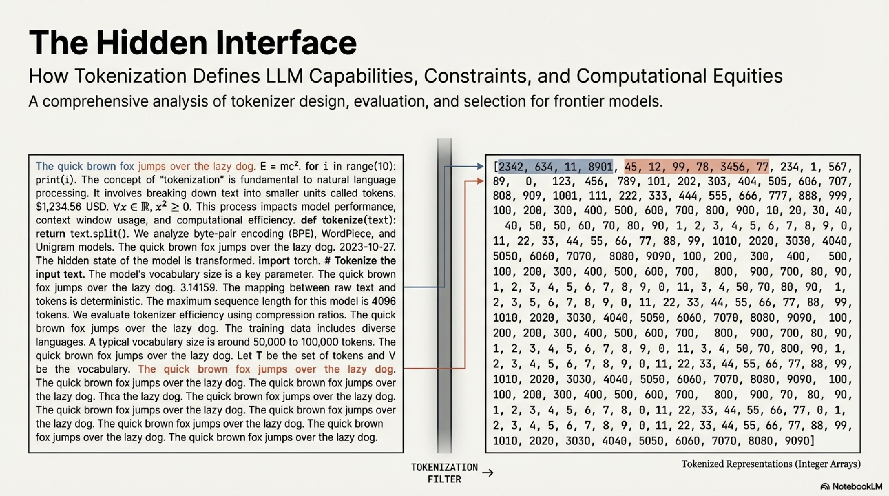

### 4.1 Byte-Pair Encoding (BPE)

**Byte-Pair Encoding** (Sennrich et al., 2016) is the dominant tokenization algorithm in modern LLMs. BPE operates as a greedy, bottom-up compression algorithm that iteratively merges the most frequent adjacent symbol pair in the training corpus.

#### 4.1.1 Training Algorithm

**Input:** Training corpus $\mathcal{C}$, target vocabulary size $V$

**Initialization:** Initialize vocabulary $\mathcal{V}_0$ with all individual bytes (or characters), yielding $|\mathcal{V}_0| = 256$ base tokens. Represent the corpus as a sequence of these base tokens.

**Iterative Merge Procedure:**

For $i = 1, 2, \ldots, V - |\mathcal{V}_0|$:

1. **Count all adjacent token pairs** $(t_a, t_b)$ across the corpus:

$$
\text{freq}(t_a, t_b) = \#\{(j) : \text{corpus}[j] = t_a \wedge \text{corpus}[j+1] = t_b\}
$$

2. **Select the most frequent pair:**

$$
(t_a^*, t_b^*) = \arg\max_{(t_a, t_b)} \text{freq}(t_a, t_b)
$$

3. **Create a new token** $t_{\text{new}} = \text{concat}(t_a^*, t_b^*)$ and add it to the vocabulary:

$$
\mathcal{V}_i = \mathcal{V}_{i-1} \cup \{t_{\text{new}}\}
$$

4. **Replace all occurrences** of the adjacent pair $(t_a^*, t_b^*)$ in the corpus with $t_{\text{new}}$

5. **Record the merge rule:** $(t_a^*, t_b^*) \rightarrow t_{\text{new}}$

**Output:** Final vocabulary $\mathcal{V} = \mathcal{V}_{V - |\mathcal{V}_0|}$ and ordered list of merge rules.

#### 4.1.2 Encoding (Inference-Time Tokenization)

Given a new string $s$:

1. Initialize: decompose $s$ into its base tokens (bytes/characters)
2. Apply merge rules **in the order they were learned** during training
3. At each step, merge any adjacent pair that matches the current rule
4. Continue until no more applicable merge rules remain

The result is a sequence of token IDs from $\mathcal{V}$.

#### 4.1.3 Information-Theoretic Interpretation

BPE can be understood through the lens of information theory as an **approximate entropy coder**. Each merge operation targets the highest-frequency bigram, effectively allocating shorter representations (single tokens) to more probable sequences—a discrete analog of Huffman coding applied to the subword level. The resulting vocabulary approximately minimizes the **expected number of tokens per unit of text**, subject to the vocabulary size constraint:

$$
\min_{\mathcal{V}: |\mathcal{V}| = V} \; \mathbb{E}_{s \sim \mathcal{C}}\!\left[\left|\mathcal{E}_{\mathcal{V}}(s)\right|\right]
$$

where $|\mathcal{E}_{\mathcal{V}}(s)|$ denotes the token count when encoding string $s$ with vocabulary $\mathcal{V}$.

### 4.2 Alternative Algorithms

| Algorithm | Key Difference from BPE | Adoption |
|-----------|------------------------|----------|
| **WordPiece** (Schuster & Nakajima, 2012) | Selects merges by maximizing **likelihood** of the training corpus under a unigram language model, rather than raw frequency | BERT, DistilBERT |
| **Unigram LM** (Kudo, 2018) | Starts with a **large** initial vocabulary and iteratively **removes** tokens that least reduce the corpus likelihood, the reverse direction of BPE | Part of SentencePiece |
| **SentencePiece** (Kudo & Richardson, 2018) | A framework that supports both BPE and Unigram LM; treats the input as a **raw byte stream** without pre-tokenization, enabling language-agnostic tokenization | T5, Gemma, mT5 |

### 4.3 Tokenizer-Free Approaches

An emerging research direction explores **byte-level or character-level models** that eliminate the tokenization step entirely (e.g., ByT5, MegaByte). These approaches:

- **Eliminate tokenization artifacts** and the need for vocabulary engineering
- **Impose no language-specific biases** inherent in subword vocabularies
- **Incur significantly longer sequences**, stressing attention complexity ($O(n^2)$) and increasing training/inference cost

Current byte-level models remain less competitive than subword-based models at equivalent compute budgets, but the approach is of theoretical interest for its simplicity and universality.

---

## 5. Vocabulary Size: Theoretical Analysis and Practical Trade-Offs

### 5.1 The Embedding Parameter Budget

The vocabulary size $V$ directly determines the parameter count of the model's embedding layers. For a model with hidden dimension $h$:

- **Input embedding matrix:** $\mathbf{W}_{\text{embed}} \in \mathbb{R}^{V \times h}$, containing $V \times h$ parameters
- **Output projection (LM head):** $\mathbf{W}_{\text{head}} \in \mathbb{R}^{V \times h}$, containing $V \times h$ parameters (if untied)

**Total embedding parameters:**

$$
P_{\text{embed}} = \begin{cases}
2Vh & \text{if embeddings are untied} \\
Vh & \text{if input/output embeddings are tied (weight sharing)}
\end{cases}
$$

**Relative cost** as a fraction of total model parameters $P_{\text{total}}$:

$$
\text{Embedding Fraction} = \frac{P_{\text{embed}}}{P_{\text{total}}}
$$

This fraction is **inversely proportional to model size**: for small models (e.g., 1B parameters), the embedding fraction can exceed 30–40% of total parameters, representing a substantial capacity allocation. For large models (e.g., 70B+), the fraction drops below 5%, making larger vocabularies more affordable. This relationship motivates **embedding tying** (weight sharing between input and output embeddings) in smaller models, which halves $P_{\text{embed}}$ at the cost of constraining the input and output embedding spaces to share the same learned representation.

### 5.2 Compression vs. Vocabulary Size Trade-Off

Increasing vocabulary size improves **text compression** (fewer tokens per sentence), but the relationship exhibits **diminishing returns**. Dagan et al. (2024) empirically demonstrate that compression gains from larger vocabularies decrease exponentially:

$$
\text{Compression Gain}(V) \approx c_1 - c_2 \cdot e^{-V / V_0}
$$

This implies the existence of an **optimal vocabulary size** beyond which additional entries yield negligible compression improvement while continuing to increase embedding parameters.

### 5.3 Inference Cost Analysis

The vocabulary size interacts with inference cost through two competing mechanisms:

1. **Compression benefit:** Fewer tokens per sequence $\Rightarrow$ fewer autoregressive decoding steps $\Rightarrow$ reduced forward-pass cost per generated response
2. **Softmax overhead:** Each decoding step requires computing a softmax over $V$ classes in the output layer:

$$
p(t_i | t_{<i}) = \text{Softmax}(\mathbf{W}_{\text{head}} \cdot \mathbf{h}_i) \in \mathbb{R}^{V}
$$

The cost of this operation scales as $O(Vh)$ per token.

**Net effect (Dagan et al., 2024):** For larger models, the compression benefit dominates—saving more on the number of forward passes than the additional per-step softmax cost. For smaller models, the softmax overhead is proportionally more significant, and the optimal vocabulary size is correspondingly smaller.

### 5.4 Memory and KV Cache Implications

Vocabulary size affects memory through the KV cache during inference:

$$
\text{KV Cache Size} = 2 \times n_{\text{layers}} \times n_{\text{heads}} \times d_{\text{head}} \times n_{\text{tokens}} \times \text{precision bytes}
$$

A larger vocabulary compresses the same text into fewer tokens ($n_{\text{tokens}}$ decreases), reducing KV cache memory. This benefit is more pronounced for:

- **Longer context lengths:** Where KV cache is the dominant memory consumer
- **Larger batch sizes:** Where aggregate KV cache scales linearly with batch size


### 5.5 Hardware Alignment: Powers of 2

Modern GPU architectures (NVIDIA Tensor Cores, AMD Matrix Cores) execute matrix multiplications in tiles whose dimensions are powers of 2 (typically 8, 16, 32, 64, or 128). When matrix dimensions are not divisible by these tile sizes, the hardware must **pad** the operands, wasting compute and memory bandwidth.

**Practical recommendation:** Set vocabulary size to a **multiple of 128**:

$$
V = 128 \cdot \lceil V_{\text{desired}} / 128 \rceil
$$

For example, use $V = 50{,}304$ instead of $V = 50{,}000$, or $V = 131{,}072$ instead of $V = 131{,}000$. This alignment ensures efficient memory access patterns and maximizes Tensor Core utilization, yielding measurable throughput improvements (He, 2023).


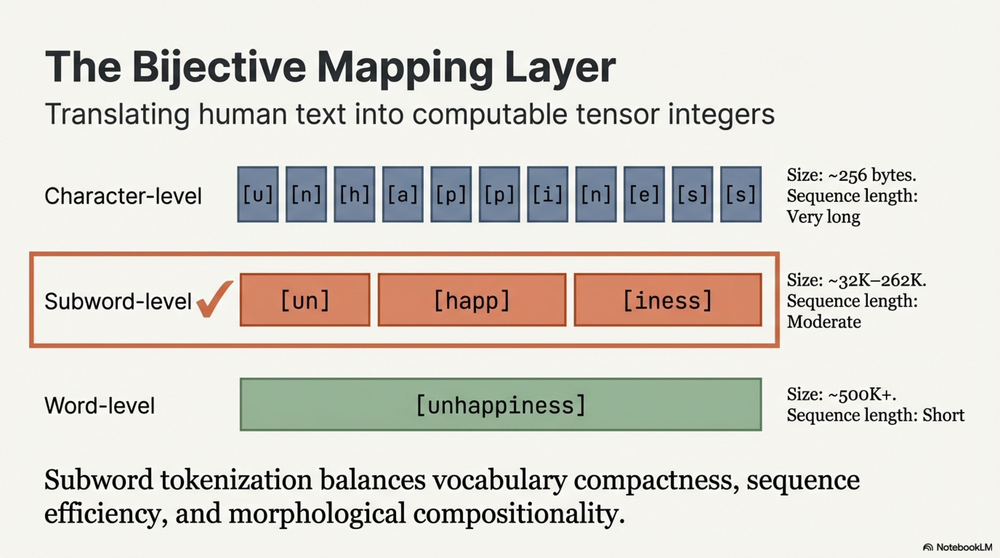

### 5.6 Vocabulary Size in Frontier Models

| Model | Vocabulary Size $V$ | Notes |
|-------|---------------------|-------|
| GPT-2 | 50,257 | English-centric |
| Llama 3 | 128,256 | Multilingual + code |
| Mistral Small | 131,072 | Multilingual |
| Qwen3 | 151,936 | Strong Chinese + multilingual |
| Gemma 3 | 262,144 | Very large; broad multilingual |

The secular trend is toward **larger vocabularies** (128K+), driven by the need for efficient multilingual and multi-domain coverage. Models targeting primarily English can operate effectively with $\sim$50K tokens, but multilingual models require 100K+ to avoid systematic over-fragmentation of non-Latin scripts.

---


## 6. Domain-Specific Tokenization Considerations

### 6.1 Numerical and Mathematical Tokenization

The tokenization of numerical content presents a unique challenge. Consider two approaches:

**Whole-number tokenization:** Encoding "342792" as a single indivisible token forces the model to memorize arithmetic relationships between every pair of number tokens—a combinatorially intractable learning problem.

**Digit-level tokenization:** Encoding "342792" as `["3", "4", "2", "7", "9", "2"]` enables the model to learn **digit-level positional arithmetic operations** (carry, borrow, column-wise addition) that generalize compositionally.

Most modern tokenizers implement **single-digit splitting** (Chowdhery et al., 2022; DeepSeek-AI et al., 2024), where individual digits 0–9 are atomic tokens. This design choice has been empirically validated to improve arithmetic reasoning performance.

**Intermediate approaches** also exist. Llama 3's tokenizer (Grattafiori et al., 2024) encodes integers from 1 to 999 as unique single tokens, with larger numbers composed from these base numeric tokens. This provides a controlled trade-off between compression efficiency on common numeric values and compositional generalization on larger numbers.


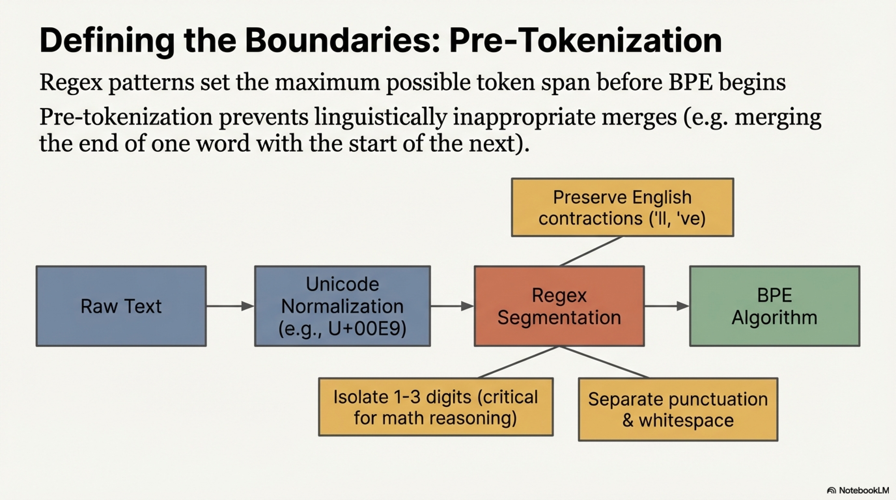

### 6.2 Code Tokenization

Programming languages impose additional tokenization requirements:

- **Whitespace sensitivity:** Languages like Python use indentation for syntactic structure; the tokenizer must preserve whitespace patterns faithfully
- **Operator and delimiter handling:** Tokens like `!=`, `>=`, `->`, `::` should ideally be preserved as atomic units rather than split
- **Identifier segmentation:** Variable and function names in camelCase or snake_case may be segmented into semantically meaningful subwords

Pre-tokenization patterns (Section 3.2) play a critical role in ensuring that code-relevant character sequences are handled appropriately before the BPE merge procedure operates.

### 6.3 Special Character and Unicode Handling

For domains involving scientific notation, chemical formulae, or mathematical symbols, the tokenizer must handle a wide range of Unicode characters. The byte-level fallback mechanism (Section 3.3) ensures coverage, but frequently occurring domain-specific symbols benefit from explicit vocabulary inclusion to avoid byte-level decomposition that inflates token counts.

---

## 7. Quantitative Tokenizer Evaluation Metrics

### 7.1 Fertility

**Fertility** measures the average number of tokens required to encode a single word, providing a direct measure of tokenizer compression efficiency:

$$
\text{Fertility} = \frac{\#\text{tokens}}{\#\text{words}} = \frac{|\mathcal{E}(s)|}{|\mathcal{W}(s)|}
$$

where $\mathcal{W}(s)$ denotes the word-level segmentation of text $s$ (produced by a language-appropriate word tokenizer, e.g., from Spacy or Stanza).

**Interpretation:**
- $\text{Fertility} = 1.0$: Every word maps to exactly one token (optimal compression at the word level)
- $\text{Fertility} > 1.0$: Words are, on average, split into multiple tokens
- **Lower fertility is better**, indicating superior compression and shorter token sequences

### 7.2 Proportion of Continued Words (PCW)

The **Proportion of Continued Words** measures the fraction of words in the corpus that are fragmented into two or more tokens:

$$
\text{PCW} = \frac{\#\{w \in \mathcal{W}(s) : |\mathcal{E}(w)| \geq 2\}}{|\mathcal{W}(s)|}
$$

**Interpretation:**
- $\text{PCW} = 0\%$: No word is split (all words are in-vocabulary as single tokens)
- $\text{PCW} = 100\%$: Every word is fragmented
- **Lower PCW is better**, indicating that the tokenizer preserves word-level integrity

### 7.3 Alternative Compression Metrics

When word-level tokenizers are unavailable or unreliable for a given language, alternative denominators can be used:

| Metric | Formula | Advantage | Limitation |
|--------|---------|-----------|------------|
| **Characters-to-tokens ratio** | $|\text{chars}(s)| / |\mathcal{E}(s)|$ | Simple, language-agnostic | Characters vary in information density across languages (e.g., Chinese characters carry more information than Latin characters) |
| **Bytes-to-tokens ratio** | $|\text{bytes}(s)| / |\mathcal{E}(s)|$ | Truly universal, no language-specific tools needed | UTF-8 encoding introduces bias: Chinese characters use 3 bytes, Latin characters 1–2 bytes, artificially inflating apparent compression for CJK languages |

**Fertility (word-based) remains the preferred metric** for cross-linguistic comparison when reliable word tokenizers are available, precisely because it normalizes by a semantically meaningful unit (words) rather than encoding-dependent units (bytes, characters).

### 7.4 Implementation

The following implementation computes both metrics:

```python
import numpy as np

def compute_tokenizer_metrics(tokenizer, word_tokenizer, text):
    """
    Computes fertility and proportion of continued words.
    
    Args:
        tokenizer: HuggingFace tokenizer instance
        word_tokenizer: Language-specific word tokenizer (e.g., from DataTrove)
        text: Raw text string to evaluate
    
    Returns:
        tuple: (fertility, proportion_continued_words)
            - fertility: average tokens per word (lower is better)
            - proportion_continued_words: fraction of words split 
              into 2+ tokens (lower is better)
    """
    words = word_tokenizer.word_tokenize(text)
    tokens = tokenizer.batch_encode_plus(words, add_special_tokens=False)
    tokens_per_word = np.array(list(map(len, tokens["input_ids"])))
    
    fertility = np.mean(tokens_per_word).item()
    proportion_continued_words = (tokens_per_word >= 2).sum() / len(tokens_per_word)
    
    return fertility, proportion_continued_words
```

---

## 8. Cross-Linguistic Tokenizer Benchmarking

### 8.1 Experimental Protocol

To rigorously compare tokenizer quality across languages, we adopt the evaluation framework from FineWeb2 (Penedo et al., 2025):

- **Evaluation corpus:** Wikipedia articles (Wikimedia Foundation, November 2023 dump)
- **Sample size:** 100 randomly sampled articles per language (sufficient for stable metric estimation while maintaining computational tractability)
- **Languages evaluated:** English (`eng_Latn`), Chinese (`cmn_Hani`), French (`fra_Latn`), Arabic (`arb_Arab`)
- **Word tokenizers:** Language-specific word tokenizers from DataTrove (using Spacy/Stanza backends)
- **Tokenizers evaluated:** Llama 3 (128K vocab), Gemma 3 (262K vocab), Mistral Small (131K vocab), Qwen3 (151K vocab)

### 8.2 Setup and Execution

```python
# Install dependencies
# pip install transformers datasets sentencepiece 'datatrove[multilingual]'

tokenizers_config = [
    ("Llama3", "meta-llama/Llama-3.2-1B"),
    ("Gemma3", "google/gemma-3-1b-pt"),
    ("Mistral (S)", "mistralai/Mistral-Small-24B-Instruct-2501"),
    ("Qwen3", "Qwen/Qwen3-4B")
]

languages = [
    ("English", "eng_Latn", "en"),
    ("Chinese", "cmn_Hani", "zh"),
    ("French", "fra_Latn", "fr"),
    ("Arabic", "arb_Arab", "ar"),
]

from datasets import load_dataset

wikis = {}
for lang_name, lang_code, short_lang_code in languages:
    wiki_ds = load_dataset(
        "wikimedia/wikipedia", 
        f"20231101.{short_lang_code}", 
        streaming=True, 
        split="train"
    )
    wiki_ds = wiki_ds.shuffle(seed=42, buffer_size=10_000)
    ds_iter = iter(wiki_ds)
    wikis[lang_code] = "\n".join(
        [next(ds_iter)["text"] for _ in range(100)]
    )

from transformers import AutoTokenizer
from datatrove.utils.word_tokenizers import load_word_tokenizer
import pandas as pd

results = []
for tokenizer_name, tokenizer_path in tokenizers_config:
    tokenizer = AutoTokenizer.from_pretrained(
        tokenizer_path, trust_remote_code=True
    )
    for lang_name, lang_code, short_lang_code in languages:
        word_tokenizer = load_word_tokenizer(lang_code)
        fertility, pcw = compute_tokenizer_metrics(
            tokenizer, word_tokenizer, wikis[lang_code]
        )
        results.append({
            "tokenizer": tokenizer_name,
            "language": lang_name,
            "fertility": fertility,
            "pcw": pcw
        })

df = pd.DataFrame(results)
```

### 8.3 Qualitative Analysis: GPT-2 vs. Gemma 3 on Arabic

The disparity between tokenizers trained on different data distributions is starkly illustrated by comparing GPT-2's English-only BPE tokenizer with Gemma 3's multilingual SentencePiece tokenizer on Arabic text.

**Input sentence (Arabic):**
> لقد أحدث تطوير النماذج اللغوية الكبيرة ثورة في مجال أبحاث الذكاء الاصطناعي وتطبيقاته في مجالات متعددة، وخاصة في مجال التعليم.

| Tokenizer | Token Count | Observation |
|-----------|-------------|-------------|
| GPT-2 (50K, English-only) | >100 tokens | Arabic text decomposed to individual bytes; almost every character becomes a separate token |
| Gemma 3 (262K, multilingual) | ~44 tokens | Arabic morphemes and common word fragments preserved as coherent tokens |

The $>$2× token inflation for GPT-2 on Arabic means that for equivalent semantic content:
- Training cost is $>$2× higher per Arabic example
- Inference latency is $>$2× higher
- Effective context window is $<$50% of what English users experience

This example underscores the critical importance of **tokenizer-data alignment** for multilingual deployment.

### 8.4 Quantitative Results


#### 8.4.1 Fertility (Tokens per Word) — Lower is Better


| Tokenizer (Vocab Size) | English | Chinese | French | Arabic |
|-------------------------|---------|---------|--------|--------|
| Llama 3 (128K) | 1.48 | 1.60 | 1.73 | 2.35 |
| Mistral Small (131K) | 1.59 | 1.78 | 1.69 | **2.15** |
| Qwen3 (151K) | 1.54 | **1.45** | 1.75 | 2.26 |
| Gemma 3 (262K) | **1.41** | 1.47 | **1.56** | 2.25 |

#### 8.4.2 Proportion of Continued Words (%) — Lower is Better

| Tokenizer (Vocab Size) | English | Chinese | French | Arabic |
|-------------------------|---------|---------|--------|--------|
| Llama 3 (128K) | 32.2% | 42.6% | 48.2% | 71.8% |
| Mistral Small (131K) | 36.8% | 47.1% | 46.5% | 66.0% |
| Qwen3 (151K) | 32.8% | **30.7%** | 47.8% | **66.0%** |
| Gemma 3 (262K) | **26.0%** | 33.1% | **39.9%** | 70.1% |

### 8.5 Analysis and Interpretation

1. **Gemma 3** achieves the lowest fertility and word-splitting rates across English, French, and several other European languages. This is attributable to two factors: (a) its **very large vocabulary** (262K, $\sim$2× Llama 3's 128K), which provides more capacity for multilingual subword coverage; and (b) its **multilingual training data**, which ensures adequate representation of non-English scripts during BPE training.

2. **Qwen3** excels on Chinese (fertility 1.45, PCW 30.7%), reflecting its training data distribution which prioritizes CJK character coverage. However, it falls behind Llama 3 on English, French, and other European languages, illustrating the **vocabulary budget allocation trade-off**: capacity spent on Chinese tokens is capacity not available for European language subwords.

3. **Mistral Small** achieves the best Arabic performance (fertility 2.15) but underperforms on English and Chinese, suggesting its vocabulary budget is tilted toward Arabic and European languages.

4. **Llama 3** offers competitive, well-balanced performance across all tested languages without being the best on any single language, representing a strong general-purpose choice.

5. **Arabic remains the most challenging language** across all tokenizers tested, with fertility values $>$2.0 and PCW $>$66% uniformly. This reflects the morphological complexity of Arabic (extensive affixation, cliticization) and the relatively lower representation of Arabic in most tokenizer training corpora compared to English or Chinese.

---

## 9. Choosing Between Existing and Custom Tokenizers

### 9.1 Decision Framework

The choice between adopting an existing tokenizer and training a custom one depends on the alignment between the available tokenizers' coverage and the target model's language/domain requirements.

#### 9.1.1 When to Use an Existing Tokenizer

**Condition:** The target use case's language and domain requirements are well-served by available tokenizers that have been validated at scale.

**Advantages:**
- **Battle-tested:** Existing tokenizers from frontier models have been validated across trillions of training tokens and extensive downstream evaluation
- **Ecosystem compatibility:** Simplifies fine-tuning from existing checkpoints, weight initialization, and vocabulary transfer
- **Reduced development overhead:** Eliminates the need for tokenizer training infrastructure and evaluation pipelines

**Example (SmolLM3):** The SmolLM3 project selected Llama 3's tokenizer because it offers competitive tokenization quality on the target languages (English, French, Spanish, Portuguese, German, Italian) with a vocabulary size (128K) appropriate for the model's small parameter count, where embedding parameters represent a significant fraction of total parameters.

**Practical guideline for vocabulary size and model size interaction:** For smaller models where the embedding fraction is high, a moderately-sized vocabulary (128K) paired with embedding tying is preferable. For larger models where embeddings are a smaller fraction of total parameters, the superior compression efficiency of larger vocabularies (e.g., Gemma 3's 262K) becomes more attractive because the marginal embedding parameter cost is amortized over a much larger model.

#### 9.1.2 When to Train a Custom Tokenizer

**Condition:** The target deployment involves low-resource languages, specialized domains, or a unique data mixture that existing tokenizers handle poorly (evidenced by high fertility or PCW on representative evaluation data).

**Key considerations for custom tokenizer training:**

1. **Training data alignment:** The tokenizer training corpus must closely approximate the **expected pretraining data mixture** in terms of language proportions, domain distributions, and text characteristics. Discrepancies lead to suboptimal compression on the actual training data.

2. **The chicken-and-egg problem:** Determining the optimal pretraining data mixture typically requires running data ablations, which themselves require a tokenizer. The practical resolution is a two-stage approach:
   - Stage 1: Train an initial tokenizer on a best-estimate data mixture; use it for data ablation experiments
   - Stage 2: After finalizing the data mixture, retrain the tokenizer on the confirmed distribution and verify that (a) downstream performance improves or is maintained and (b) fertility metrics remain satisfactory

3. **Validation protocol:** After training, evaluate the custom tokenizer on the full set of target languages and domains using the fertility and PCW metrics described in Section 7, comparing against available alternatives to confirm that the custom tokenizer provides a meaningful improvement.

### 9.2 Decision Summary

```
Does your target language/domain coverage match an existing tokenizer?
├── Yes
│   ├── Small model (embedding fraction significant)
│   │   └── Use existing tokenizer with moderate vocab (e.g., 128K) + embedding tying
│   └── Large model (embedding fraction small)
│       └── Use existing tokenizer with largest practical vocab for best compression
└── No (low-resource languages, unique domains, unusual data mixture)
    └── Train custom tokenizer on representative data mixture
        └── Validate via fertility/PCW metrics against baselines
        └── Retrain after finalizing data mixture if necessary
```

---

## 10. Special Tokens and Chat Template Integration

### 10.1 Special Token Categories

Beyond the data-derived vocabulary entries, tokenizers include **special tokens** that serve structural and control functions:

| Token | Purpose |
|-------|---------|
| `<BOS>` / `<s>` | Beginning of sequence marker |
| `<EOS>` / `</s>` | End of sequence marker |
| `<PAD>` | Padding token for batch alignment |
| `<UNK>` | Unknown token (rarely triggered with byte-level fallback) |
| `<|im_start|>`, `<|im_end|>` | Instruction/message boundary markers (chat templates) |
| `<tool_call>`, `<tool_result>` | Tool-use protocol tokens |

### 10.2 Chat Templates

For instruction-tuned and chat-deployed models, the tokenizer must implement **chat templates** that encode the structured turn-taking format of multi-turn conversations. These templates define how system prompts, user messages, and assistant responses are delimited using special tokens, ensuring that the model can unambiguously parse conversation structure during both training and inference.


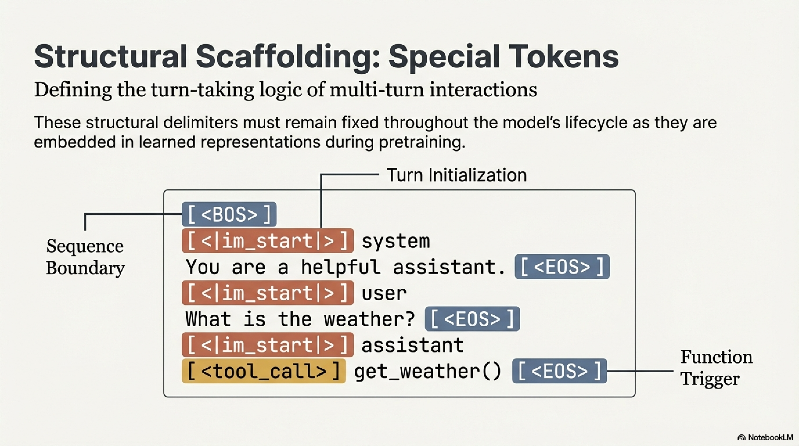

The choice and design of special tokens must be established during tokenizer design and remain fixed throughout the model's lifecycle, as they become embedded in the model's learned representations during pretraining and alignment.

---

## 11. Downstream Impact on Model Performance


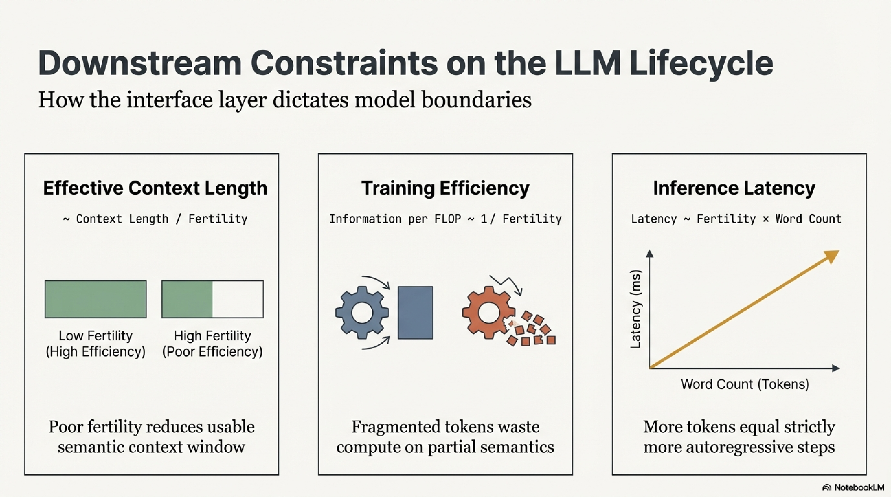

### 11.1 Effective Context Length

Tokenizer compression directly affects the **effective context length**—the amount of semantic content that fits within the model's fixed token-based context window:

$$
\text{Effective Context (in words)} \approx \frac{L_{\text{context}}}{\text{Fertility}}
$$

where $L_{\text{context}}$ is the model's maximum context length in tokens. A tokenizer with fertility 1.4 versus 2.4 on a given language provides $\sim$71% more effective context for the same context window.

### 11.2 Training Efficiency

Each token processed during pretraining consumes a fixed compute budget. Over-fragmentation means spending compute on tokens that carry less semantic information per unit, reducing the effective information intake per FLOP:

$$
\text{Information per FLOP} \propto \frac{1}{\text{Fertility}}
$$


### 11.3 Inference Latency

For autoregressive models, inference latency scales linearly with the number of generated tokens. A tokenizer that produces $k$ times more tokens for equivalent content in a given language imposes a $k$-fold latency penalty:


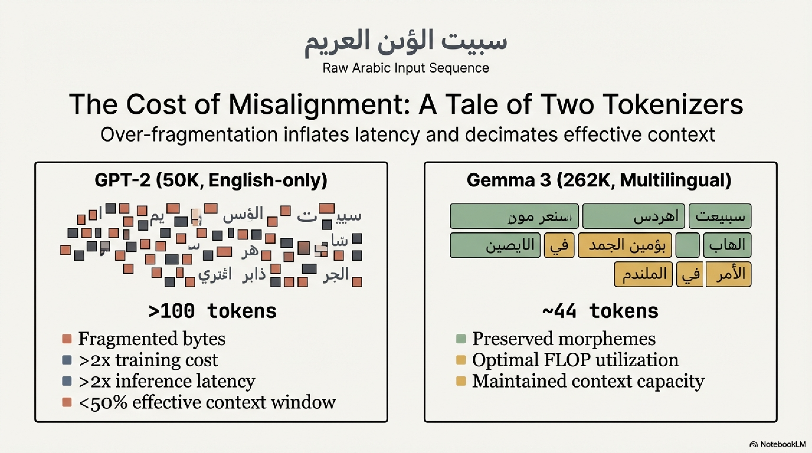

$$
\text{Latency}_{\text{inference}} \propto |\mathcal{E}(s)| = \text{Fertility} \times |\mathcal{W}(s)|
$$

### 11.4 Token Boundary Effects on Learned Representations


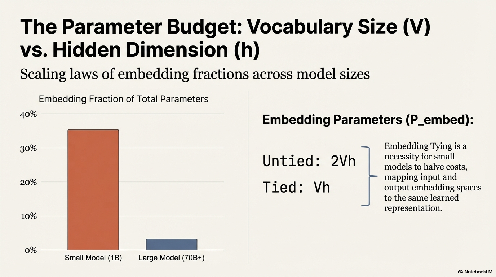

Token boundaries impose a discrete structure on the model's input that can affect learned representations:

- **Within-token computation** is handled by the embedding lookup (a single vector per token)
- **Cross-token computation** requires attention or other inter-token mechanisms

If semantically meaningful units (words, morphemes) are split across token boundaries, the model must expend representational and computational capacity to reconstruct these units from their fragments—capacity that could otherwise be allocated to higher-level reasoning.

---

## 12. Conclusion

This report has provided a comprehensive technical treatment of tokenizer design, evaluation, and selection for large language model development, covering the following key findings and design principles:

1. **Tokenization is a foundational design decision** whose effects propagate through every aspect of model performance—training efficiency, inference latency, effective context length, cross-linguistic equity, and domain-specific capability. It warrants investment commensurate with its impact.


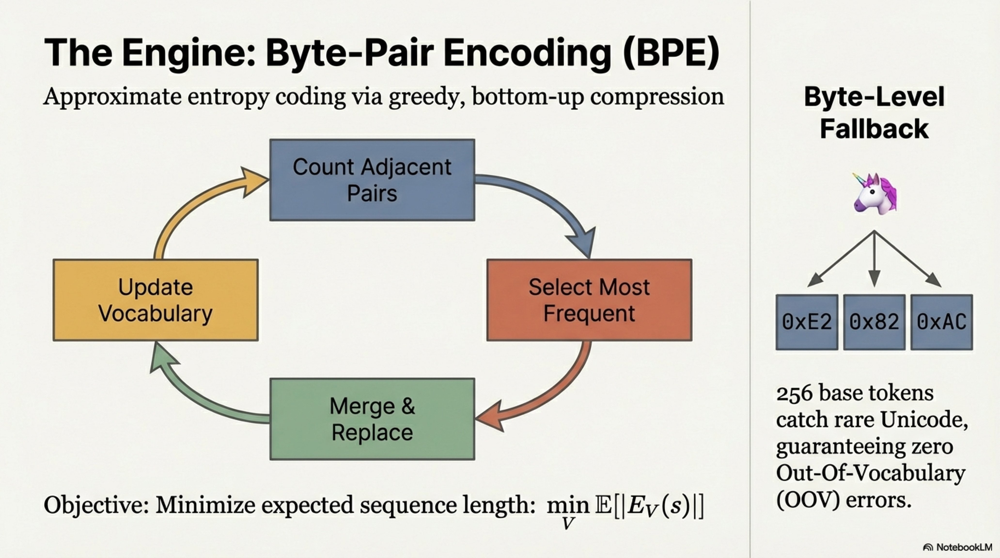

2. **Byte-Pair Encoding (BPE) remains the dominant algorithm**, with byte-level fallback ensuring complete Unicode coverage. Pre-tokenization patterns (regex-based) are a critical but often underappreciated design lever that defines token boundaries before the BPE merge procedure operates.


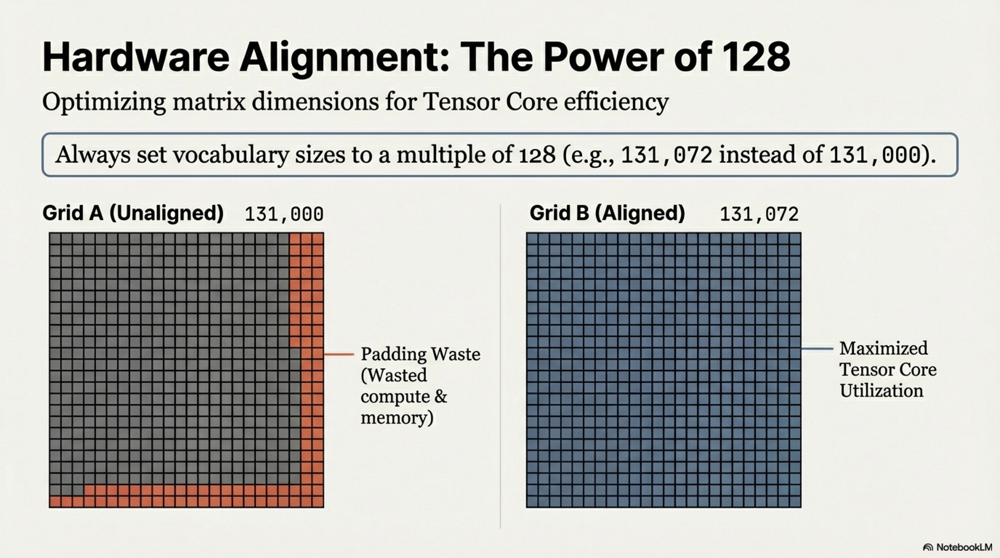


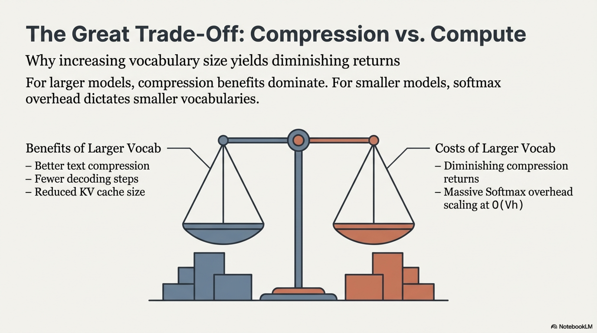

3. **Vocabulary size involves a multi-dimensional trade-off** among compression efficiency (fewer tokens), embedding parameter cost ($V \times h$ per embedding matrix), softmax computation cost ($O(Vh)$ per decoding step), and KV cache memory savings. The optimal size depends on model scale, target languages, and deployment constraints. The field has converged on 128K–262K for frontier multilingual models, with hardware-aligned values (multiples of 128) recommended for throughput optimization.


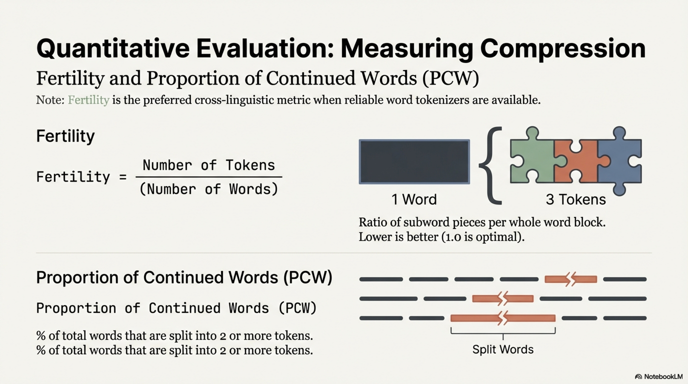

4. **Fertility and Proportion of Continued Words (PCW)** are the primary quantitative metrics for tokenizer evaluation, with word-based denominators preferred for cross-linguistic comparison. Empirical benchmarking across diverse languages is essential—visual inspection of a few examples is insufficient, analogous to making architecture decisions without ablation studies.


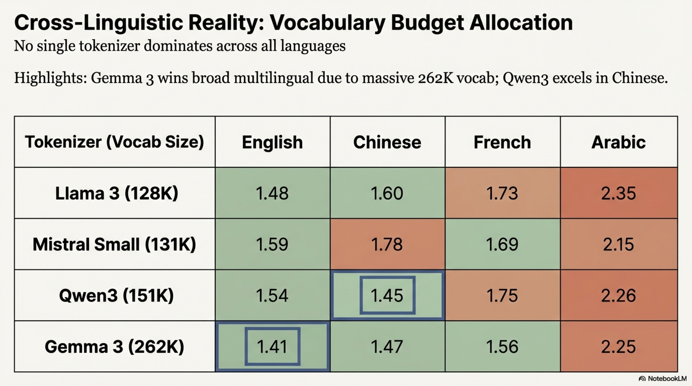

5. **Cross-linguistic benchmarking reveals systematic trade-offs** in vocabulary budget allocation. No single tokenizer dominates across all languages; the optimal choice depends on the model's target language distribution. Larger vocabularies (e.g., Gemma 3's 262K) provide broad multilingual coverage but at higher embedding parameter cost.


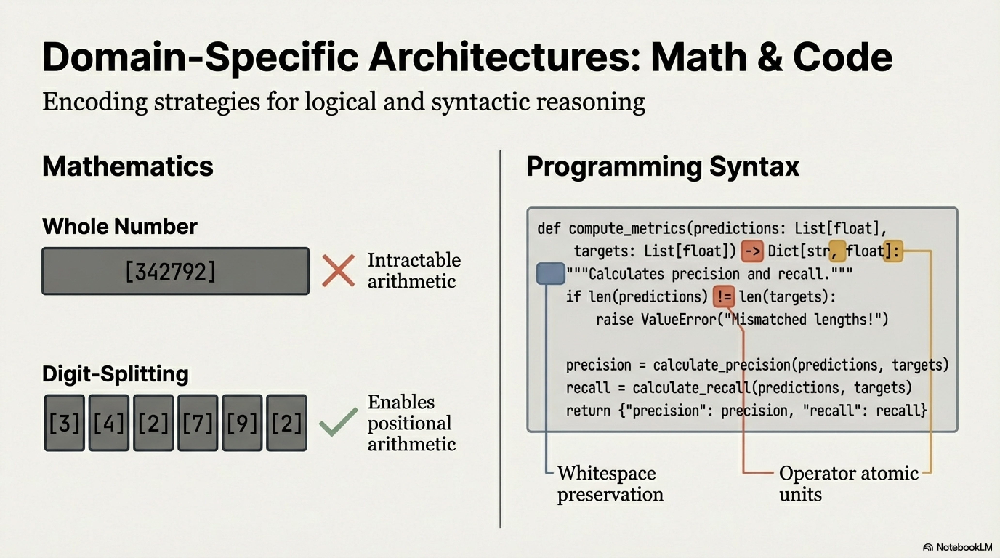

6. **Domain-specific tokenization** (digit splitting for arithmetic, whitespace preservation for code) has measurable downstream effects on task performance and must be explicitly addressed through pre-tokenization patterns and vocabulary design.


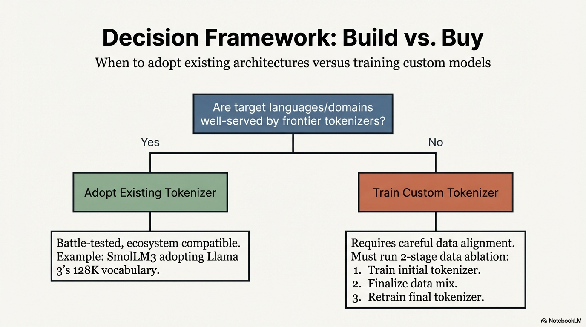

7. **The decision between existing and custom tokenizers** should be driven by measured coverage metrics on representative target data. Existing tokenizers from frontier models are battle-tested and should be preferred when coverage is adequate. Custom tokenizer training is justified when target languages or domains are poorly served, with careful attention to training data alignment and the iterative nature of the tokenizer-data mixture co-optimization process.


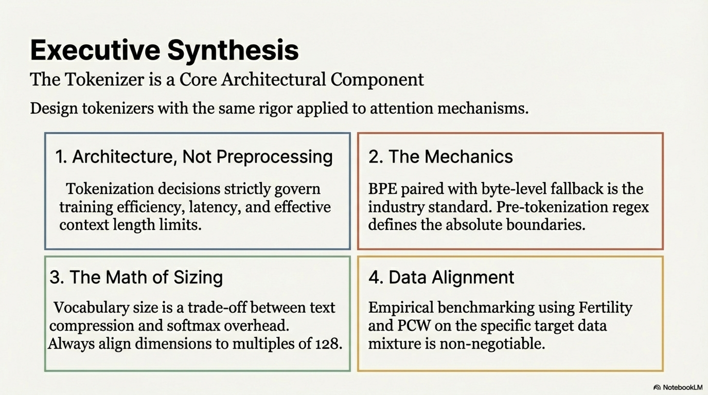

The tokenizer, though frequently treated as a preprocessing detail, is in fact a **core architectural component** whose design requires the same rigor, empirical validation, and systematic evaluation applied to attention mechanisms, expert routing, and training recipes.

---

## 13. References

- Chowdhery, A., et al. (2022). PaLM: Scaling Language Modeling with Pathways.
- Dagan, G., et al. (2024). Getting the Most Out of Your Tokenizer for Pre-Training and Domain Adaptation.
- DeepSeek-AI, et al. (2024). DeepSeek-V2: A Strong, Economical, and Efficient Mixture-of-Experts Language Model.
- Grattafiori, A., et al. (2024). The Llama 3 Herd of Models.
- He, H. (2023). Making Deep Learning Go Brrrr From First Principles. Blog post.
- Karpathy, A. (2024). Let's Build the GPT Tokenizer. Video tutorial.
- Kudo, T. (2018). Subword Regularization: Improving Neural Network Translation Models with Multiple Subword Candidates.
- Kudo, T., & Richardson, J. (2018). SentencePiece: A Simple and Language Independent Subword Tokenizer and Detokenizer for Neural Text Processing.
- Mistral AI. (2025). Mistral Small Technical Report.
- OpenAI, et al. (2024). GPT-4 Technical Report.
- Penedo, G., et al. (2025). FineWeb2: A Sparkling Update with 1000s of Languages.
- Radford, A., et al. (2019). Language Models are Unsupervised Multitask Learners.
- Schuster, M., & Nakajima, K. (2012). Japanese and Korean Voice Search.
- Sennrich, R., Haddow, B., & Birch, A. (2016). Neural Machine Translation of Rare Words with Subword Units.
- Team, G., et al. (2025). Gemma 3 Technical Report.