# Embedding Sharing and Positional Encoding Strategies in Modern Large Language Models: A Comprehensive Technical Report

---

## Table of Contents

1. [Introduction](#1-introduction)
2. [Embedding Sharing (Weight Tying)](#2-embedding-sharing-weight-tying)
3. [Positional Encoding and Long-Context Modeling](#3-positional-encoding-and-long-context-modeling)
4. [Rotary Position Embedding (RoPE)](#4-rotary-position-embedding-rope)
5. [RoPE Frequency Adjustment for Context Extension](#5-rope-frequency-adjustment-for-context-extension)
6. [Hybrid Positional Encoding: NoPE and RNoPE](#6-hybrid-positional-encoding-nope-and-rnope)
7. [Partial RoPE and Multi-Head Latent Attention (MLA)](#7-partial-rope-and-multi-head-latent-attention-mla)
8. [Attention Scope Limitation Strategies for Long Contexts](#8-attention-scope-limitation-strategies-for-long-contexts)
9. [Attention Sinks](#9-attention-sinks)
10. [Summary and Architectural Recommendations](#10-summary-and-architectural-recommendations)

---

## 1. Introduction

The design of modern large language models (LLMs) involves a multitude of architectural decisions that collectively determine model capacity, training efficiency, inference cost, and generalization capability. Two foundational components—**embedding layers** and **positional encodings**—occupy a critical position in this design space, yet their treatment varies substantially across contemporary architectures.

This report provides an end-to-end technical analysis of two interconnected architectural themes:

- **Embedding sharing (weight tying):** The practice of reusing the input embedding matrix as the output projection layer, its parameter-efficiency implications, and empirical ablation evidence demonstrating its effectiveness in small-to-medium scale language models.
- **Positional encoding strategies:** The evolution from absolute positional embeddings through Rotary Position Embeddings (RoPE) to hybrid approaches (NoPE/RNoPE), including frequency adjustment methods (ABF, YaRN) and attention scope limitation techniques (sliding window attention, chunked attention, dual chunk attention) that collectively enable robust long-context modeling.

Each section presents formal mathematical definitions, implementation details, ablation results, and design rationale grounded in empirical findings from recent model development efforts including SmolLM3, Llama 3/4, Qwen 2.5/3, Gemma 3, and others.

---

## 2. Embedding Sharing (Weight Tying)

### 2.1 Problem Formulation

Every autoregressive transformer language model contains two embedding components:

| Component | Function | Dimensionality |
|-----------|----------|----------------|
| **Input Embedding** ($\mathbf{W}_{\text{embed}}$) | Token-to-vector lookup table mapping discrete token indices to dense vector representations | $|V| \times d_{\text{model}}$ |
| **Output Projection** ($\mathbf{W}_{\text{output}}$) | Linear projection mapping final hidden states back to vocabulary logits for next-token prediction | $d_{\text{model}} \times |V|$ |

where $|V|$ denotes the vocabulary size and $d_{\text{model}}$ denotes the hidden dimension.

In the **untied (separate) configuration**, the total number of embedding parameters is:

$$P_{\text{embed}}^{\text{untied}} = 2 \times |V| \times d_{\text{model}}$$

In the **tied (shared) configuration**, a single matrix $\mathbf{W}_{\text{embed}}$ serves both roles. The output projection is computed using the transpose of the input embedding:

$$\mathbf{W}_{\text{output}} = \mathbf{W}_{\text{embed}}^{\top}$$

yielding a total embedding parameter count of:

$$P_{\text{embed}}^{\text{tied}} = |V| \times d_{\text{model}}$$

The parameter savings from weight tying is therefore:

$$\Delta P = |V| \times d_{\text{model}}$$

### 2.2 Motivation: Parameter Budget Analysis

The significance of embedding sharing is fundamentally determined by the **ratio of embedding parameters to total model parameters**. For small language models with large vocabularies, this ratio can be substantial.

**Concrete Example (1.2B-scale ablation model):**

| Metric | Value |
|--------|-------|
| Vocabulary size ($|V|$) | 128,000 |
| Hidden dimension ($d_{\text{model}}$) | 2,048 |
| Single embedding matrix parameters | $128{,}000 \times 2{,}048 = 262.1\text{M}$ |
| Total embedding parameters (untied) | $2 \times 262.1\text{M} = 524.3\text{M}$ |
| Percentage of total model parameters (untied) | $\approx 35\%$ |
| Weight tying savings | $262.1\text{M}$ ($\approx 17\%$ of total) |

This ratio diminishes as model size increases because the non-embedding parameter count (attention and feed-forward layers) scales with depth and width while the embedding layer size remains fixed at $|V| \times d_{\text{model}}$. The following data illustrates this scaling behavior:

| Model | Total Parameters | Embedding Fraction (Untied) |
|-------|------------------|-----------------------------|
| Llama 3.2 1B | 1.24B | $\approx 21.3\%$ |
| SmolLM3 3B | 3B (approx.) | Moderate |
| Llama 3.1 8B | 8B | $\approx 13\%$ |
| Llama 3.1 70B | 70B | $\approx 3\%$ |

**Architectural Implication:** For models at the $\leq 3\text{B}$ parameter scale, embedding sharing constitutes a high-impact optimization. For models at $\geq 8\text{B}$ scale, the marginal benefit is negligible, which explains why most large-scale models (e.g., Llama 3.1 70B) do not employ weight tying.

### 2.3 Parameter Distribution Across Architectural Components

For a tied-embedding model at the 1.24B scale (e.g., Llama 3.2 1B configuration), the parameter distribution across architectural components is approximately:

| Component | Fraction of Total Parameters |
|-----------|------------------------------|
| Embeddings (tied) | $\approx 21.3\%$ |
| Attention (Q, K, V, O projections) | $\approx 13.6\%$ |
| Feed-Forward Networks (MLP) | $\approx 65.2\%$ |
| Layer Norms | $< 0.1\%$ |

The feed-forward network dominates the parameter budget, consistent with the standard transformer architecture where each MLP layer contains $2 \times d_{\text{model}} \times d_{\text{ff}}$ parameters (or $3 \times d_{\text{model}} \times d_{\text{ff}}$ for gated variants such as SwiGLU), with $d_{\text{ff}}$ typically set to $4 \times d_{\text{model}}$ or $\frac{8}{3} \times d_{\text{model}}$.

### 2.4 Ablation Study: Tied vs. Untied Embeddings

#### 2.4.1 Experimental Design

To rigorously evaluate the impact of embedding sharing, three model configurations were compared:

| Configuration | Layers | Embedding Strategy | Total Parameters |
|--------------|--------|--------------------|------------------|
| **A (Baseline)** | 16 | Tied | 1.2B |
| **B** | 12 | Untied | 1.2B (iso-parameter) |
| **C** | 16 | Untied | 1.46B |

The experimental design isolates two variables:

- **Configurations A vs. C:** Same depth (16 layers), but C has 18% more parameters due to untied embeddings. This measures whether the additional embedding parameters provide measurable benefit.
- **Configurations A vs. B:** Same total parameter count (1.2B), but B trades 4 layers of depth for separate embedding matrices. This measures whether model depth or embedding separation is more valuable at a fixed parameter budget.

All models were trained on identical data mixtures for up to 40B tokens using consistent hyperparameters.

#### 2.4.2 Results

**Training Loss:** The 1.2B tied-embedding model (Config A) achieved training loss closely matching the 1.46B untied model (Config C) throughout training, despite having 18% fewer parameters. The 1.2B untied model with reduced depth (Config B) exhibited consistently higher loss.

**Downstream Evaluation Benchmarks:**

| Benchmark | Config A (Tied, 16L) | Config B (Untied, 12L) | Config C (Untied, 16L) |
|-----------|----------------------|------------------------|------------------------|
| HellaSwag | Comparable to C | Lowest | Highest (marginal) |
| MMLU | Comparable to C | Lowest | Highest (marginal) |
| ARC | Comparable to C | Lowest | Highest (marginal) |
| PIQA | Comparable to C | Lowest | Highest (marginal) |
| OpenBookQA | Comparable to C | Lowest | Highest (marginal) |
| WinoGrande | Slightly below C | Lowest | Highest |

#### 2.4.3 Analysis and Conclusions

The ablation yields three key findings:

1. **Depth dominates over embedding separation at iso-parameter budgets.** Configuration B (12 layers, untied) consistently underperformed Configuration A (16 layers, tied) despite identical parameter counts. This demonstrates that the representational capacity gained from additional transformer layers outweighs the benefit of maintaining separate input and output embedding matrices.

2. **Tied embeddings achieve near-parity with larger untied models.** Configuration A matched Configuration C on all benchmarks except WinoGrande, despite an 18% parameter reduction. The savings from weight tying can be effectively reinvested into increased model depth.

3. **Prior work corroboration.** These findings are consistent with MobileLLM's comprehensive ablations at the 125M scale, which demonstrated that embedding sharing reduced parameter count by 11.8% with minimal accuracy degradation (Liu et al., 2024).

**Design Decision:** Based on these results, tied embeddings were adopted for SmolLM3-3B, controlled via the `tie_word_embeddings` configuration flag.

### 2.5 Formal Description of Forward Pass with Tied Embeddings

Let $\mathbf{W} \in \mathbb{R}^{|V| \times d_{\text{model}}}$ denote the shared embedding matrix. For an input token sequence $[t_1, t_2, \ldots, t_T]$:

**Input embedding:**

$$\mathbf{h}_i^{(0)} = \mathbf{W}[t_i, :] \in \mathbb{R}^{d_{\text{model}}}, \quad \forall\, i \in \{1, \ldots, T\}$$

**Transformer layers:**

$$\mathbf{h}_i^{(\ell)} = \text{TransformerLayer}^{(\ell)}\!\left(\mathbf{h}_i^{(\ell-1)}\right), \quad \ell = 1, \ldots, L$$

**Output logits (with weight tying):**

$$\mathbf{z}_i = \mathbf{W} \cdot \mathbf{h}_i^{(L)} \in \mathbb{R}^{|V|}$$

where the same matrix $\mathbf{W}$ used for the input lookup is reused (without transpose in implementation, since the lookup operation indexes rows while the projection multiplies by the full matrix). The next-token probability distribution is then:

$$P(t_{i+1} = v \mid t_{\leq i}) = \text{softmax}(\mathbf{z}_i)_v$$

---


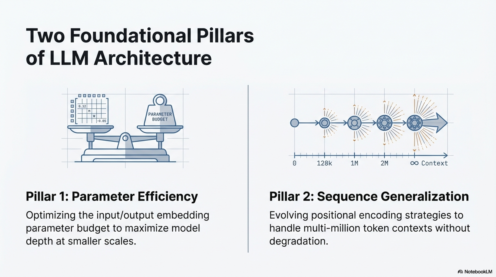


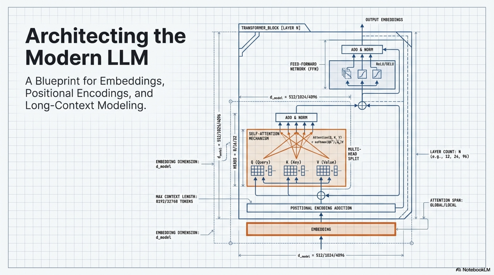

## 3. Positional Encoding and Long-Context Modeling

### 3.1 The Positional Information Problem

Transformer architectures process sequences through **parallel attention operations** that compute pairwise interactions across all positions simultaneously. Unlike recurrent neural networks, which process tokens sequentially and thereby encode position implicitly through their hidden state evolution, transformers possess **no intrinsic mechanism for distinguishing token order**.

Formally, consider two sequences:

- $S_1 = [\text{"Adam"}, \text{"beats"}, \text{"Muon"}]$
- $S_2 = [\text{"Muon"}, \text{"beats"}, \text{"Adam"}]$

Without positional information, the self-attention mechanism computes identical representations for both sequences (up to permutation), since the set of pairwise token interactions $\{(t_i, t_j) : i, j \in \{1, 2, 3\}\}$ is identical in both cases. Positional embeddings resolve this ambiguity by providing each token with a unique **positional address** within the sequence.

### 3.2 Evolution of Positional Encoding Methods

The development of positional encoding methods has progressed through four generations, each addressing limitations of its predecessor:

#### 3.2.1 Absolute Positional Embeddings (APE)

**Method:** Learn a lookup table $\mathbf{P} \in \mathbb{R}^{L_{\max} \times d_{\text{model}}}$ mapping each integer position to a vector, which is added to the token embedding:

$$\mathbf{h}_i^{(0)} = \mathbf{W}[t_i, :] + \mathbf{P}[i, :]$$

**Limitation:** The model's maximum input sequence length is strictly bounded by $L_{\max}$, the maximum position index seen during training. There is **no out-of-the-box capability** for length generalization beyond the training distribution.

**Historical context:** Used in the original Transformer (Vaswani et al., 2017) and BERT (Devlin et al., 2019) with $L_{\max} = 512$.

#### 3.2.2 Relative Positional Embeddings

**Insight:** The semantic relationship between two tokens depends more on their **relative distance** $(i - j)$ than on their absolute positions $(i, j)$. Whether two words are 3 positions apart at positions $(5, 8)$ or $(105, 108)$ should yield similar attention behavior.

This class of methods modifies the attention computation to depend on the **offset** between query and key positions rather than their absolute indices.

#### 3.2.3 ALiBi (Attention with Linear Biases)

ALiBi (Press et al., 2022) implements relative positioning by adding a linear bias to attention scores proportional to the distance between query and key positions:

$$\text{Attention}(q_i, k_j) = \frac{q_i \cdot k_j}{\sqrt{d_k}} - m \cdot |i - j|$$

where $m$ is a head-specific slope parameter (fixed, not learned) that controls the decay rate. Each attention head uses a different slope from a geometric sequence:

$$m_h = 2^{-\frac{8h}{H}}, \quad h = 1, \ldots, H$$


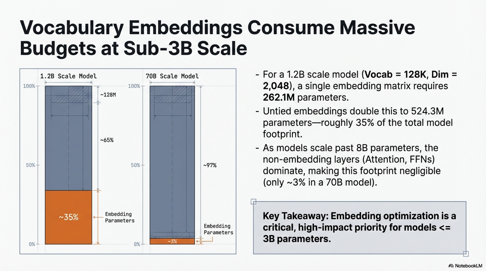

where $H$ is the total number of attention heads.

**Properties:**
- No learnable positional parameters
- Implicit recency bias: distant tokens receive progressively lower attention scores
- Moderate length generalization beyond training context

#### 3.2.4 Rotary Position Embedding (RoPE)

RoPE (Su et al., 2023) has become the **dominant positional encoding** in contemporary LLMs (Llama, Qwen, Gemma, and many others). It encodes positional information through **rotation operations** applied to query and key vectors, described in detail in Section 4.

---

## 4. Rotary Position Embedding (RoPE)

### 4.1 Core Principle

RoPE's fundamental insight is to encode position information as **rotation angles in a high-dimensional space**. Rather than adding positional vectors to token embeddings, RoPE applies position-dependent rotations to query ($\mathbf{q}$) and key ($\mathbf{k}$) vectors in the attention mechanism.

The embedding space is decomposed into $d/2$ two-dimensional subspaces (dimension pairs), where $d = d_{\text{head}}$ is the per-head dimension. Each subspace is rotated by an angle determined by:

1. The token's absolute position $p$ in the sequence
2. The dimension pair index $k$ (different pairs rotate at different frequencies)

### 4.2 Mathematical Formulation

#### 4.2.1 Frequency Spectrum

For each dimension pair indexed by $k \in \{0, 1, \ldots, d/2 - 1\}$, define the **inverse frequency**:

$$\omega_k = \frac{1}{\theta_{\text{base}}^{\,2k/d}}$$

where $\theta_{\text{base}}$ is the base frequency hyperparameter (commonly $\theta_{\text{base}} = 10{,}000$).

The rotation angle for a token at position $p$ in dimension pair $k$ is:

$$\Theta_{p,k} = p \cdot \omega_k = \frac{p}{\theta_{\text{base}}^{\,2k/d}}$$

**Frequency interpretation:**
- Small $k$ (early dimension pairs) $\Rightarrow$ $\omega_k \approx 1$ $\Rightarrow$ **slow oscillation** $\Rightarrow$ captures long-range positional information
- Large $k$ (later dimension pairs) $\Rightarrow$ $\omega_k \ll 1$ $\Rightarrow$ **fast oscillation** $\Rightarrow$ captures fine-grained local detail

#### 4.2.2 Rotation Operation

For a given vector $\mathbf{x} \in \mathbb{R}^d$ at position $p$, RoPE applies a block-diagonal rotation matrix $\mathbf{R}_p \in \mathbb{R}^{d \times d}$:

$$\mathbf{R}_p = \begin{pmatrix} \cos\Theta_{p,0} & -\sin\Theta_{p,0} & & & \\ \sin\Theta_{p,0} & \cos\Theta_{p,0} & & & \\ & & \cos\Theta_{p,1} & -\sin\Theta_{p,1} & \\ & & \sin\Theta_{p,1} & \cos\Theta_{p,1} & \\ & & & & \ddots \end{pmatrix}$$

The RoPE-encoded query and key at positions $m$ and $n$ respectively are:

$$\tilde{\mathbf{q}}_m = \mathbf{R}_m \, \mathbf{q}_m, \qquad \tilde{\mathbf{k}}_n = \mathbf{R}_n \, \mathbf{k}_n$$

#### 4.2.3 Relative Position Encoding via Dot Product

The critical property of RoPE is that the dot product between rotated query and key vectors depends **only on the relative position** $(m - n)$:

$$\tilde{\mathbf{q}}_m^{\top} \tilde{\mathbf{k}}_n = \mathbf{q}_m^{\top} \mathbf{R}_m^{\top} \mathbf{R}_n \, \mathbf{k}_n = \mathbf{q}_m^{\top} \mathbf{R}_{n-m} \, \mathbf{k}_n$$

This follows from the orthogonality of rotation matrices: $\mathbf{R}_m^{\top} \mathbf{R}_n = \mathbf{R}_{n-m}$.

Expanding the dot product across all dimension pairs:

$$\tilde{\mathbf{q}}_m^{\top} \tilde{\mathbf{k}}_n = \sum_{k=0}^{d/2-1} \left[ (q_{2k} k_{2k} + q_{2k+1} k_{2k+1}) \cos\!\big((m-n)\omega_k\big) + (q_{2k} k_{2k+1} - q_{2k+1} k_{2k}) \sin\!\big((m-n)\omega_k\big) \right]$$

**Key property:** The attention score is a function of $(m - n)$, not of $m$ or $n$ independently. Tokens that are $\delta$ positions apart will always produce the same angular relationship regardless of their absolute positions, enabling potential generalization to sequence lengths beyond the training distribution.

### 4.3 Worked Example

Consider the token "fox" from the phrase "The quick brown fox," processed by a model with $d_{\text{head}} = 64$ and $\theta_{\text{base}} = 10{,}000$.

**Setup:**
- 32 dimension pairs: $(x_0, x_1), (x_2, x_3), \ldots, (x_{62}, x_{63})$
- "fox" appears at position $p = 3$

**First dimension pair** ($k = 0$):

$$\Theta_{3,0} = 3 \times \frac{1}{10{,}000^{0/32}} = 3 \times 1.0 = 3.0 \text{ radians} \approx 172°$$

**Last dimension pair** ($k = 31$):

$$\Theta_{3,31} = 3 \times \frac{1}{10{,}000^{62/64}} = 3 \times \frac{1}{10{,}000^{0.96875}} \approx 3 \times 1.29 \times 10^{-4} \approx 3.87 \times 10^{-4} \text{ radians} \approx 0.022°$$

This illustrates the **multi-resolution frequency spectrum**: early dimension pairs undergo large rotations (capturing coarse positional structure), while later pairs undergo negligible rotations (preserving fine-grained semantic content).

### 4.4 Implementation

```python
import torch
import math

def apply_rope(x: torch.Tensor, pos: int, dim: int = 64, base: float = 10000.0) -> torch.Tensor:
    """
    Apply Rotary Positional Embedding to a single vector.
    
    Args:
        x:    Input vector of shape [dim]
        pos:  Token position index (0-indexed)
        dim:  Head dimension (must be even)
        base: Base frequency (default: 10000)
    
    Returns:
        Rotated vector of shape [dim]
    """
    rotated = []
    half_dim = dim // 2
    for k in range(half_dim):
        # Compute inverse frequency for dimension pair k
        inv_freq = 1.0 / (base ** (k / half_dim))
        # Compute rotation angle
        theta = pos * inv_freq
        
        cos_theta = torch.cos(torch.tensor(theta, dtype=x.dtype, device=x.device))
        sin_theta = torch.sin(torch.tensor(theta, dtype=x.dtype, device=x.device))
        
        # Extract the dimension pair
        x1, x2 = x[2 * k], x[2 * k + 1]
        
        # Apply 2D rotation
        rotated.append(x1 * cos_theta - x2 * sin_theta)
        rotated.append(x1 * sin_theta + x2 * cos_theta)
    
    return torch.stack(rotated)

# Usage in attention computation:
# Q, K: [batch, heads, seq_len, d_head]
Q = torch.randn(1, 2, 4, 8)
K = torch.randn(1, 2, 4, 8)

# Apply RoPE to Q and K *before* the dot product
Q_rope = torch.stack([apply_rope(Q[0, 0, p], p, dim=8) for p in range(Q.size(2))])
K_rope = torch.stack([apply_rope(K[0, 0, p], p, dim=8) for p in range(K.size(2))])

# Compute attention scores
scores = (Q_rope @ K_rope.T) / math.sqrt(Q.size(-1))
attn_weights = torch.softmax(scores, dim=-1)
```

---

## 5. RoPE Frequency Adjustment for Context Extension

### 5.1 The Long-Context Challenge

Most LLM pretraining begins with relatively short context lengths (2K–4K tokens) for two practical reasons:

1. **Computational cost:** Attention scales quadratically with sequence length, i.e., $\mathcal{O}(T^2 \cdot d)$ per layer.
2. **Data scarcity:** Long-context training samples (sequences exceeding 4K tokens) are comparatively rare in typical pretraining corpora.
3. **Short-range learning priority:** Early in training, models primarily learn local token-to-token correlations, making long sequences unnecessary.
4. **Short-context performance degradation:** Research (Zhu et al., 2025) suggests that training exclusively on long sequences from the start can degrade short-context performance.

The standard training paradigm therefore follows a **staged approach**: perform the majority of pretraining with short sequences, then execute continual pretraining or dedicate the final several hundred billion tokens to progressively longer sequences.

### 5.2 The Attention Decay Problem

As sequence length grows during context extension, the rotation angles $\Theta_{p,k} = p \cdot \omega_k$ grow proportionally with position $p$. For large $p$, particularly in low-frequency dimension pairs (small $k$), the rotation angles can become very large, causing the cosine terms in the attention dot product to oscillate rapidly:

$$\cos\!\big((m-n) \cdot \omega_k\big)$$

This rapid oscillation causes **attention scores for distant tokens to decay too rapidly** or become incoherent, degrading the model's ability to attend to relevant information at long range (Rozière et al., 2024; Xiong et al., 2023).

### 5.3 RoPE ABF (Adjusted Base Frequency)

**Method (Xiong et al., 2023b):** Increase the base frequency $\theta_{\text{base}}$ in RoPE's formulation to slow down the rotation rate across all dimension pairs.

**Original formulation:**

$$\omega_k = \frac{1}{\theta_{\text{base}}^{\,2k/d}}$$

**ABF formulation:** Replace $\theta_{\text{base}}$ with a larger value $\theta_{\text{base}}' > \theta_{\text{base}}$:

$$\omega_k' = \frac{1}{(\theta_{\text{base}}')^{\,2k/d}}$$

Since $\theta_{\text{base}}' > \theta_{\text{base}}$, we have $\omega_k' < \omega_k$ for all $k > 0$, which **reduces the rotation angle per position step** and thereby slows the angular accumulation over long sequences.

**Properties:**
- Straightforward to implement: requires modifying only a single hyperparameter
- Distributes embedded vectors with increased granularity, making distant positions easier for the model to differentiate
- Can be applied in a single stage (direct frequency boost) or multiple stages (gradual increases as context grows)
- **Limitation:** Uniform scaling across all dimensions may not be optimal for extremely long contexts

### 5.4 YaRN (Yet Another RoPE ExtensioN)

**Method (Peng et al., 2023):** A more sophisticated frequency adjustment that **interpolates scaling factors non-uniformly** across RoPE dimension pairs using a ramp function.

Unlike ABF's uniform adjustment, YaRN partitions RoPE dimensions into three regimes:

1. **Low-frequency dimensions** (large $k$): Apply NTK-aware interpolation (scale frequencies to fit the extended context)
2. **High-frequency dimensions** (small $k$): Leave unmodified (these already rotate slowly enough)
3. **Intermediate dimensions**: Smoothly interpolate between the two extremes using a ramp function

**Additional components:**
- **Dynamic attention scaling:** Adjusts the attention logit temperature to compensate for the altered frequency spectrum
- **Temperature adjustment:** Modifies the softmax temperature in attention computation to preserve the attention distribution's sharpness

**Properties:**
- Enables efficient "train short, test long" strategies with minimal fine-tuning
- Provides smoother scaling and mitigates catastrophic attention loss at very large context sizes
- Can be applied at inference time without any fine-tuning (zero-shot context extension)
- Generally delivers superior empirical performance compared to ABF for extremely long contexts
- More complex to implement and tune than ABF

### 5.5 Practical Deployment: Staged Context Extension

**Example (Qwen3 training pipeline):**

| Stage | Context Length | RoPE Base Frequency | Method |
|-------|--------------|---------------------|--------|
| Pretraining | 4K tokens | $\theta_{\text{base}} = 10{,}000$ | Standard RoPE |
| Context Extension Stage 1 | 32K tokens | $\theta_{\text{base}} = 1{,}000{,}000$ | ABF |
| Context Extension Stage 2 | 131K tokens | — | YaRN ($4\times$ extrapolation) |

**Practical guidance:** There is no strong consensus on optimal frequency values. It is recommended to experimentally evaluate different RoPE base frequencies during the context extension phase, validating against both short-context and long-context evaluation benchmarks specific to the target deployment scenario.

---

## 6. Hybrid Positional Encoding: NoPE and RNoPE

### 6.1 Motivation: Limitations of Pure RoPE at Extreme Context Lengths

As models push toward multi-million-token contexts (Meta AI, 2025; Yang et al., 2025), even RoPE with frequency adjustments encounters performance degradation on challenging long-context benchmarks such as RULER (Hsieh et al., 2024) and HELMET (Yen et al., 2025), which assess capabilities beyond simple needle-in-a-haystack (NIAH) retrieval (Kamradt, 2023).

This motivates exploration of **alternative and hybrid positional encoding strategies**.

### 6.2 NoPE (No Positional Embedding)

**Method (Kazemnejad et al., 2023):** Train transformers **without any explicit positional encoding**, allowing the model to implicitly learn positional information through:

- **Causal masking:** The autoregressive attention mask inherently provides some positional signal, since each token can only attend to tokens at earlier positions.
- **Attention patterns:** The model can learn to use token identity and context to infer relative positions.

**Formal description:** Standard attention without positional modification:

$$\text{Attention}(\mathbf{Q}, \mathbf{K}, \mathbf{V}) = \text{softmax}\!\left(\frac{\mathbf{Q}\mathbf{K}^{\top}}{\sqrt{d_k}} + \mathbf{M}_{\text{causal}}\right) \mathbf{V}$$

where $\mathbf{M}_{\text{causal}}$ is the causal mask (upper-triangular with $-\infty$ entries) and **no rotational or additive positional encoding** is applied to $\mathbf{Q}$ or $\mathbf{K}$.

**Properties:**
- **Advantage:** Superior length generalization compared to ALiBi and RoPE. Without explicit positional encodings to extrapolate beyond training lengths, NoPE naturally handles longer contexts.
- **Limitation:** Weaker performance than RoPE on short-context reasoning and knowledge-intensive tasks (B. Yang et al., 2025), suggesting that explicit positional encodings provide useful **inductive biases** within the training context length.

### 6.3 RNoPE (Hybrid RoPE + NoPE)

**Method (B. Yang et al., 2025):** Alternate between RoPE and NoPE layers throughout the model, leveraging the complementary strengths of each approach.

**Architecture specification:** For a model with $L$ layers, assign positional encoding per layer:

$$\text{PE}^{(\ell)} = \begin{cases} \text{RoPE} & \text{if } \ell \bmod r = 0 \\ \text{NoPE (none)} & \text{otherwise} \end{cases}$$

where $r$ is the RoPE layer interval (e.g., $r = 4$ means every 4th layer uses RoPE).

**Functional roles:**
- **RoPE layers:** Provide explicit positional information and handle local context with inherent recency bias
- **NoPE layers:** Improve information retrieval across long distances by operating without positional constraints

**Adoption:** This hybrid approach has been adopted by several recent models:
- **Llama 4** (Meta AI, 2025)
- **Command A** (Cohere)
- **SmolLM3** (Hugging Face)

### 6.4 Ablation Study: NoPE vs. RoPE on Short-Context Performance

#### 6.4.1 Experimental Design

Three configurations were compared at 1B scale to evaluate whether the hybrid NoPE approach maintains short-context performance:

| Configuration | Positional Encoding | Additional Features |
|--------------|--------------------|--------------------|
| **Baseline** | Pure RoPE (all layers) | — |
| **NoPE** | RoPE every 4th layer, NoPE otherwise | — |
| **NoPE + Doc Masking** | RoPE every 4th layer, NoPE otherwise | Document masking enabled |

#### 6.4.2 Results

**Training loss:** All three configurations exhibited **nearly identical loss curves** throughout 40B tokens of training, with no statistically significant divergence.

**Downstream benchmarks:**

| Benchmark | Baseline (RoPE) | NoPE | NoPE + Doc Masking |
|-----------|-----------------|------|-------------------|
| HellaSwag | Reference | $\approx$ Reference | $\approx$ Reference |
| MMLU | Reference | $\approx$ Reference | $\approx$ Reference |
| ARC | Reference | $\approx$ Reference | $\approx$ Reference |
| PIQA | Reference | $\approx$ Reference | $\approx$ Reference |
| OpenBookQA | Reference | $\approx$ Reference | $\approx$ Reference |
| WinoGrande | Reference | $\approx$ Reference | $\approx$ Reference |

#### 6.4.3 Conclusion

The hybrid NoPE approach **maintains strong short-context capabilities** at parity with pure RoPE, while providing the architectural foundation for superior long-context handling. The combination of NoPE with document masking introduces no measurable degradation.

**Design Decision:** Based on these results, the NoPE + document masking combination was adopted for SmolLM3.

---

## 7. Partial RoPE and Multi-Head Latent Attention (MLA)

### 7.1 Partial RoPE

An alternative to the layer-level alternation of RNoPE is **partial RoPE**, which applies rotary embeddings to only a **subset of head dimensions within the same layer**.

**Formal description:** For a head dimension $d_k$, split into two blocks:

$$d_k = d_{\text{nope}} + d_{\text{rope}}$$

- The $d_{\text{nope}}$-dimensional block receives **no positional encoding**
- The $d_{\text{rope}}$-dimensional block receives **standard RoPE rotations**

The attention score for head $h$ between query at position $t$ and key at position $i$ becomes:

$$s_{t,i}^{(h)} = \frac{1}{\sqrt{d_k}} \left[ \underbrace{\left(\mathbf{q}_{t,\text{nope}}^{(h)}\right)^{\!\top} \mathbf{k}_{i,\text{nope}}^{(h)}}_{\text{position-free component}} + \underbrace{\left(\mathbf{R}_t \, \mathbf{q}_{t,\text{rope}}^{(h)}\right)^{\!\top} \left(\mathbf{R}_i \, \mathbf{k}_{i,\text{rope}}^{(h)}\right)}_{\text{position-aware component}} \right]$$

**Adoption:** Models using partial RoPE include GPT-J (Wang & Komatsuzaki, 2021), GLM-4.5 (5 Team et al., 2025), MiniMax-01 (MiniMax et al., 2025), and all models employing MLA.

### 7.2 Why Partial RoPE Is Essential for MLA

Multi-Head Latent Attention (MLA) achieves inference efficiency through **projection absorption**. Instead of storing per-head key vectors $\mathbf{k}_i^{(h)} \in \mathbb{R}^{d_k}$ in the KV cache, MLA caches a small shared latent vector:

$$\mathbf{c}_i = \mathbf{x}_i \mathbf{W}_c \in \mathbb{R}^{d_c}, \quad d_c \ll H \cdot d_k$$

Per-head keys are reconstructed from the latent: $\mathbf{k}_i^{(h)} = \mathbf{c}_i \mathbf{E}^{(h)}$, and queries are: $\mathbf{q}_t^{(h)} = \mathbf{x}_t \mathbf{W}_q^{(h)}$.

**Absorption trick:** Define $\mathbf{U}^{(h)} = \mathbf{W}_q^{(h)} \mathbf{E}^{(h)}$, then:

$$s_{t,i}^{(h)} = \frac{1}{\sqrt{d_k}} \left(\mathbf{q}_t^{(h)}\right)^{\!\top} \mathbf{k}_i^{(h)} = \frac{1}{\sqrt{d_k}} \left(\mathbf{x}_t \, \mathbf{U}^{(h)}\right)^{\!\top} \mathbf{c}_i$$

The absorbed query $\tilde{\mathbf{q}}_t^{(h)} = \mathbf{x}_t \, \mathbf{U}^{(h)} \in \mathbb{R}^{d_c}$ is computed against the tiny cache $\mathbf{c}_i$ — **no per-head key storage is required**.

**Why full RoPE breaks absorption:** With full-dimension RoPE, the attention score becomes:

$$s_{t,i}^{(h)} = \frac{1}{\sqrt{d_k}} \left(\mathbf{x}_t \, \mathbf{W}_q^{(h)}\right)^{\!\top} \underbrace{\mathbf{R}_{t-i}}_{\text{depends on } t-i} \left(\mathbf{c}_i \, \mathbf{E}^{(h)}\right)$$

The position-dependent rotation matrix $\mathbf{R}_{t-i}$ is sandwiched between the query and key projections, preventing the pre-merger of $\mathbf{W}_q^{(h)}$ and $\mathbf{E}^{(h)}$ into a fixed $\mathbf{U}^{(h)}$.

**Partial RoPE resolution:** By splitting $d_k = d_{\text{nope}} + d_{\text{rope}}$:

- **NoPE block** ($d_{\text{nope}}$ dimensions): Absorption works as intended — $(\mathbf{x}_t \, \mathbf{U}_{\text{nope}}^{(h)})^{\top} \mathbf{c}_i$
- **RoPE block** ($d_{\text{rope}}$ dimensions, typically small): RoPE is applied, but only to a small additional set of cached vectors, maintaining a modest KV cache overhead

This decomposition preserves both the **inference efficiency** of projection absorption and the **positional encoding capability** of RoPE.

---

## 8. Attention Scope Limitation Strategies for Long Contexts

### 8.1 Motivation

The strategies discussed in Sections 5–7 modify **how the model encodes position** to handle sequences longer than those seen during training. A complementary class of techniques takes a fundamentally different approach: **restricting which tokens can attend to each other**, keeping attention patterns within familiar positional ranges while still processing the full sequence.

Consider a model pretrained with sequences of length $L_{\text{train}} = 8$. At inference, we wish to process a sequence of length $L_{\text{infer}} = 16 > L_{\text{train}}$. Positions $8$–$15$ are out-of-distribution for the model's positional encodings. Attention scope methods address this by ensuring that any individual attention computation only spans positional offsets within $[0, L_{\text{train}})$.

**Additional benefit:** These methods reduce both computational cost ($\mathcal{O}(T \cdot w)$ instead of $\mathcal{O}(T^2)$, where $w$ is the window size) and memory requirements (bounded KV cache size).

### 8.2 Chunked Attention

**Method:** Divide the sequence into fixed-size non-overlapping chunks of size $C$. Tokens can only attend within their own chunk.

**Formal mask definition:** Token at position $i$ can attend to token at position $j$ if and only if:

$$\left\lfloor \frac{i}{C} \right\rfloor = \left\lfloor \frac{j}{C} \right\rfloor \quad \text{and} \quad j \leq i$$

**Properties:**
- Creates isolated attention windows that **reset at chunk boundaries**
- Tokens in one chunk **cannot attend to any token in previous chunks**
- Reduces KV cache size to $\mathcal{O}(C)$ per layer

**Deployment example:** Llama 4 (Meta AI, 2025) uses chunked attention with $C = 8{,}192$ tokens in RoPE layers (three out of four decoder layers), while NoPE layers maintain full-context access to compensate for the cross-chunk information loss.

**Limitation:** Hard chunk boundaries may impair tasks requiring cross-boundary reasoning.

### 8.3 Sliding Window Attention (SWA)

**Method (Child et al., 2019; Jiang et al., 2023):** Each token attends only to the most recent $w$ tokens (including itself), creating a sliding window that moves continuously through the sequence.

**Formal mask definition:** Token at position $i$ can attend to token at position $j$ if and only if:

$$\max(0, i - w + 1) \leq j \leq i$$

**Properties:**
- No artificial chunk boundaries; the window slides smoothly
- Recent tokens receive full attention; distant tokens are excluded
- Computational complexity per layer: $\mathcal{O}(T \cdot w)$
- KV cache bounded at $w$ entries per layer

**Deployment example:** Gemma 3 combines SWA with full attention in alternating layers, similar to how hybrid positional encoding approaches mix different strategies:

$$\text{Attention scope}^{(\ell)} = \begin{cases} \text{Full attention} & \text{if } \ell \bmod 2 = 0 \\ \text{SWA (window } w\text{)} & \text{if } \ell \bmod 2 = 1 \end{cases}$$

### 8.4 Dual Chunk Attention (DCA)

**Method (An et al., 2024):** A **training-free** inference technique that extends chunked attention while maintaining cross-chunk information flow, keeping all relative positions within the training distribution.

For chunk size $s$ and local window $w$, DCA combines three attention mechanisms:

1. **Intra-chunk attention:** Standard causal attention within each chunk (the diagonal blocks)

$$\text{Relative position: } i - j \in [0, s-1]$$

2. **Inter-chunk attention:** Queries in the current chunk attend to all tokens in previous chunks, but with position indices capped at $s - 1$:

$$\text{Query position index: } s - 1 \quad (\text{fixed})$$

This ensures relative positions are bounded within the training distribution.

3. **Successive chunk attention:** A local window of size $w$ preserves locality between neighboring chunks, maintaining smooth transitions across chunk boundaries.

**Properties:**
- All relative positions remain within $[0, L_{\text{train}})$, ensuring no out-of-distribution positional encodings
- Enables ultra-long context windows (up to 1M tokens) at inference time
- Requires **no continual training** on long sequences

**Deployment example:** Qwen 2.5 uses DCA to support context windows up to 1 million tokens at inference time without training on million-token sequences.

### 8.5 Comparative Summary

| Method | Cross-Boundary Attention | Positional OOD Risk | Computational Complexity | Training Required |
|--------|--------------------------|---------------------|--------------------------|-------------------|
| Full Attention | Yes | High (at long range) | $\mathcal{O}(T^2)$ | — |
| Chunked Attention | No | None (within chunk) | $\mathcal{O}(T \cdot C)$ | No |
| Sliding Window (SWA) | Yes (within window) | None (within window) | $\mathcal{O}(T \cdot w)$ | No |
| Dual Chunk (DCA) | Yes (capped positions) | None (by construction) | $\mathcal{O}(T \cdot s)$ (approx.) | No |

---

## 9. Attention Sinks

### 9.1 Phenomenon

An empirically observed phenomenon in transformer models processing long contexts is that the model assigns **disproportionately high attention scores to the initial tokens** in the sequence, even when those tokens carry no special semantic importance (Xiao et al., 2024). These initial tokens function as a **stabilization mechanism** for the attention distribution, serving as a "sink" where excess attention probability mass accumulates.

### 9.2 Practical Implication

The key practical insight is that maintaining the KV cache of the **initial few tokens** alongside a **sliding window of recent tokens** largely preserves model performance when the total context exceeds the cache capacity:

$$\text{KV cache} = \underbrace{\{\mathbf{k}_1, \ldots, \mathbf{k}_s\}}_{\text{sink tokens}} \cup \underbrace{\{\mathbf{k}_{t-w+1}, \ldots, \mathbf{k}_t\}}_{\text{sliding window}}$$

where $s$ is the number of sink tokens (typically $s \leq 4$) and $w$ is the sliding window size.

This simple modification enables models to handle **arbitrarily long sequences** without fine-tuning or significant performance degradation.

### 9.3 Implementation Variants

| Approach | Description | Example |
|----------|-------------|---------|
| **Special token** | Prepend a dedicated placeholder token during pretraining that serves as an explicit attention sink | Original StreamingLLM (Xiao et al., 2024) |
| **Learned bias logits** | Implement attention sinks as learned per-head bias logits appended to attention scores (not actual tokens) | gpt-oss |
| **Attention bias units** | Use bias terms in the attention layers themselves to implement sink functionality | gpt-oss (echoing GPT-2 design) |

**Note on bias units:** While bias parameters in attention layers are generally considered redundant for standard attention operations (Dehghani et al. demonstrate minimal impact on test loss), they can serve the specialized function of implementing attention sinks. The gpt-oss model uses bias units in attention layers — a design choice rarely seen since GPT-2 — specifically for this purpose.

### 9.4 Functional Interpretation


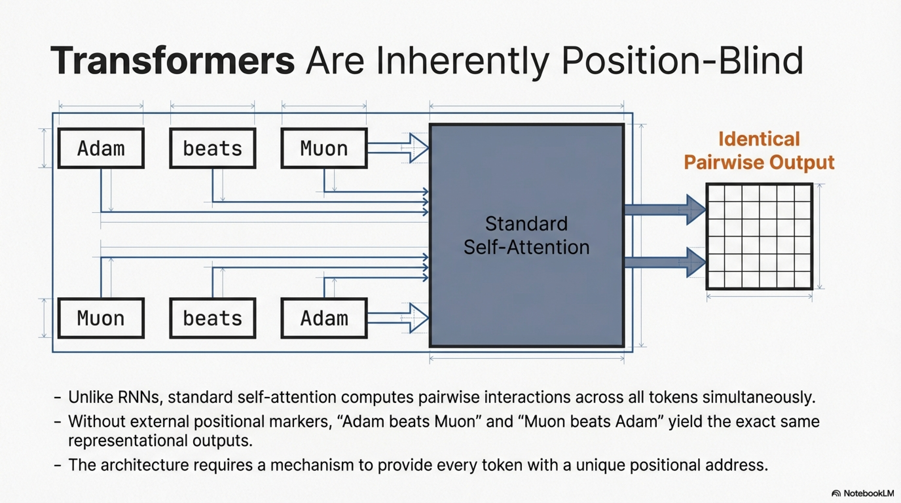

Regardless of implementation mechanism (special tokens, learned biases, or per-head logits), attention sinks provide a **stable anchor** for attention distributions in long-context scenarios. They allow the model to store generally useful aggregate information about the entire sequence, even as the context grows beyond the cache window.

---

## 10. Summary and Architectural Recommendations

### 10.1 Consolidated Design Decisions for SmolLM3

| Component | Decision | Rationale |
|-----------|----------|-----------|
| **Embedding sharing** | Tied ($\mathbf{W}_{\text{output}} = \mathbf{W}_{\text{embed}}^{\top}$) | 17% parameter savings; ablation shows tied 1.2B matches untied 1.46B; depth more valuable than separate embeddings at iso-parameter budget |
| **Positional encoding** | Hybrid RNoPE (RoPE every 4th layer, NoPE otherwise) | Maintains short-context parity with pure RoPE; provides foundation for superior long-context generalization |
| **Document masking** | Enabled | Combined with NoPE at no performance cost; prevents cross-document attention leakage |

### 10.2 Architectural Component Taxonomy

The following taxonomy summarizes the complete space of architectural components covered in this report:


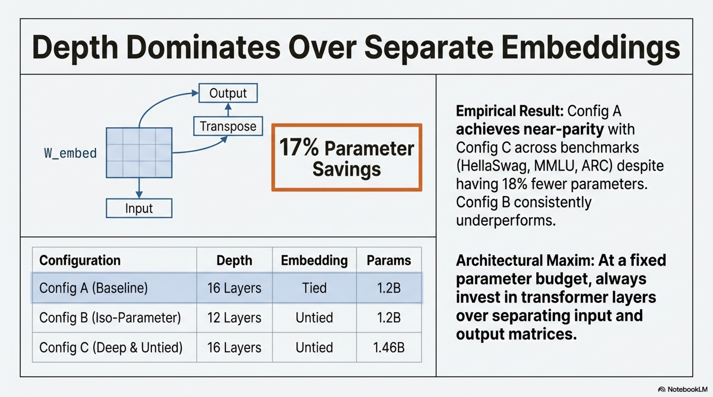

```
Embedding Configuration
├── Tied (weight sharing): W_output = W_embed^T
│   └── Recommended for models ≤ 3B parameters
└── Untied (separate matrices): 2 × |V| × d_model parameters
    └── Standard for models ≥ 8B parameters


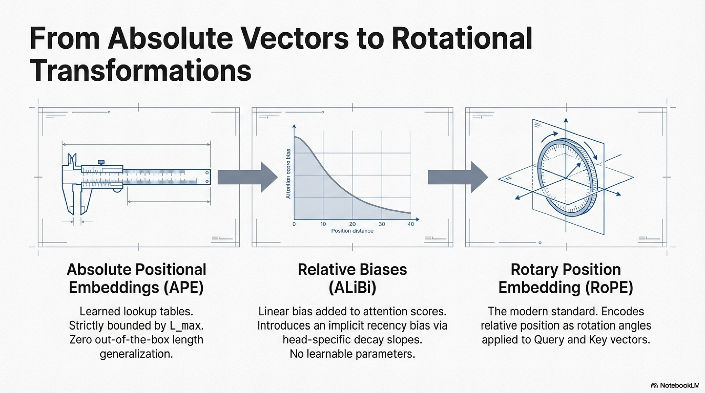

Positional Encoding
├── Absolute PE (APE): learned lookup, no length generalization
├── Relative PE
│   ├── ALiBi: linear attention bias, moderate extrapolation
│   └── RoPE: rotational encoding, dominant in modern LLMs
│       ├── Standard RoPE (base=10K–50K)
│       ├── ABF: uniform base frequency increase
│       └── YaRN: non-uniform frequency interpolation
├── NoPE: no explicit PE, implicit from causal mask
├── RNoPE (Hybrid): alternating RoPE/NoPE layers
└── Partial RoPE: RoPE on subset of head dimensions
    └── Required for MLA projection absorption


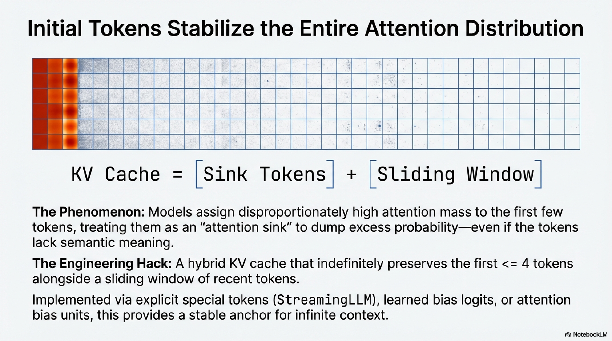


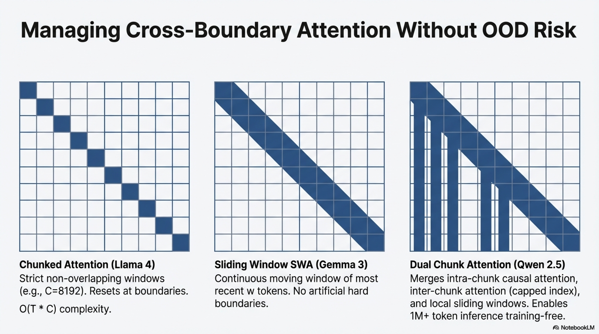


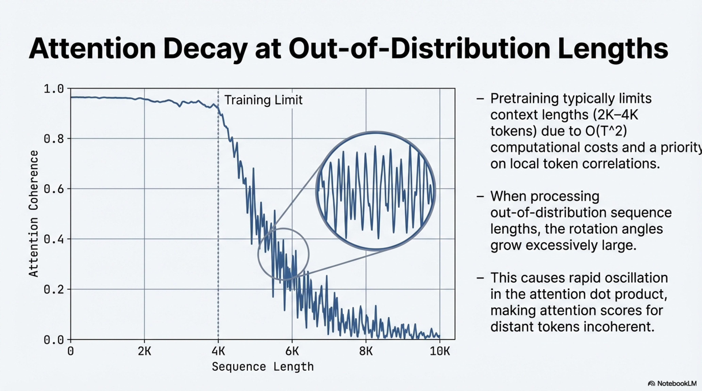

Attention Scope
├── Full attention: O(T²), complete context access
├── Chunked attention: isolated fixed-size windows
├── Sliding Window Attention (SWA): moving local window
├── Dual Chunk Attention (DCA): training-free cross-chunk flow
└── Attention sinks: stable anchors for long-context distributions
```

### 10.3 Key Principles

1. **Parameter allocation priority:** At fixed parameter budgets, invest in **depth** (more transformer layers) over separate embedding matrices. Weight tying is a high-impact, zero-cost optimization for small-to-medium models.


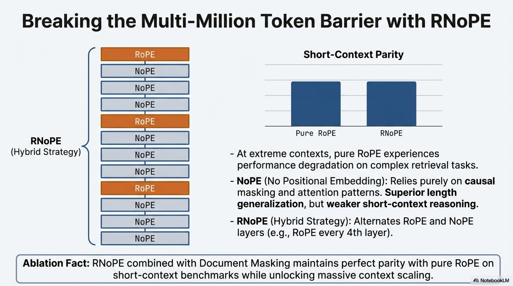


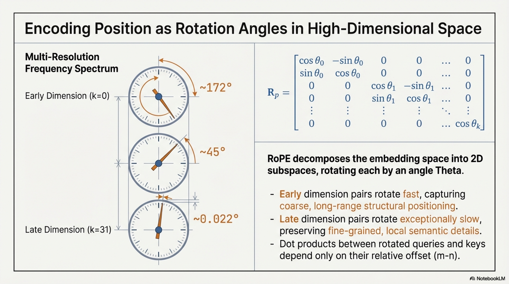

2. **Positional encoding complementarity:** RoPE and NoPE provide complementary inductive biases — explicit local positioning and implicit long-range retrieval, respectively. Hybrid approaches (RNoPE) capture the benefits of both.


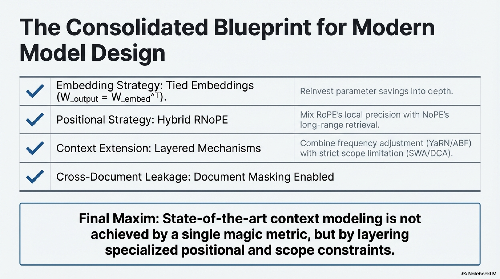


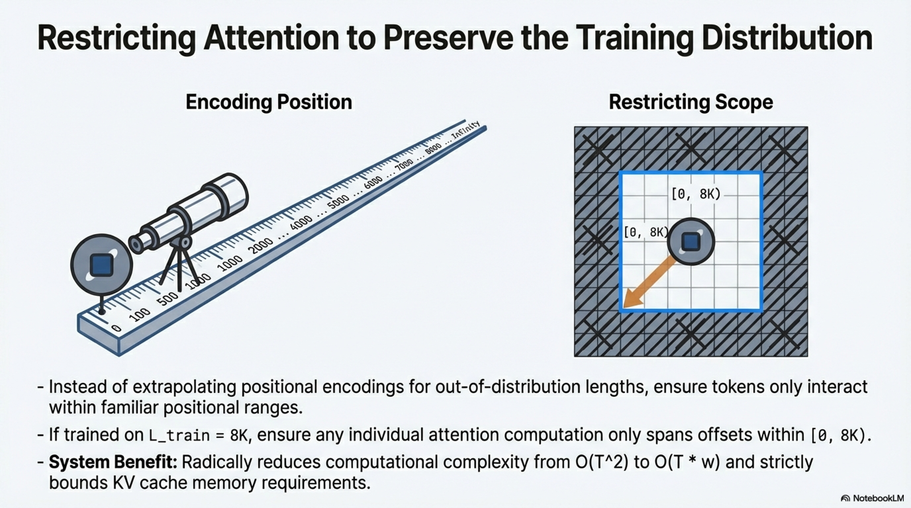


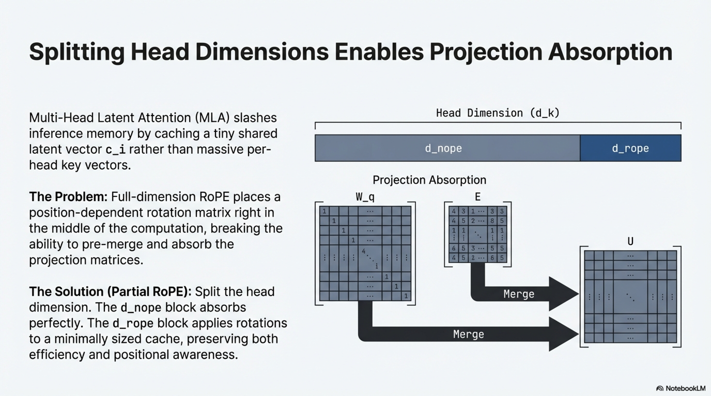


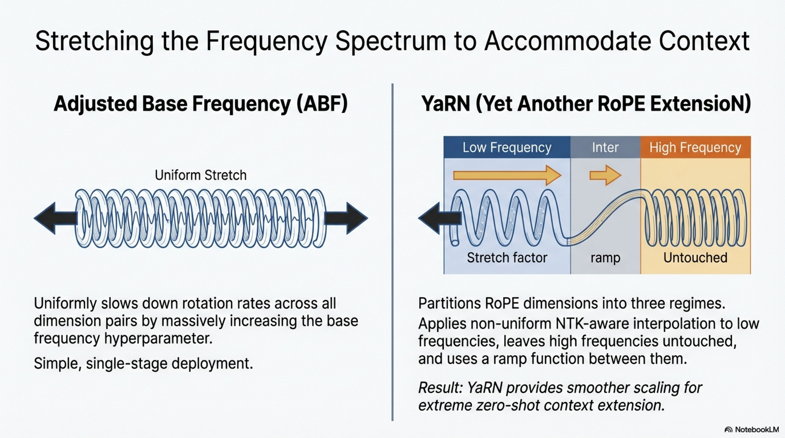

3. **Context extension is a multi-mechanism problem:** No single technique suffices for robust long-context modeling. State-of-the-art systems combine frequency adjustment (ABF/YaRN), hybrid positional encoding (RNoPE), and attention scope limitation (SWA/chunking/DCA) as complementary strategies.

4. **Empirical validation is essential:** Optimal hyperparameters (RoPE base frequency, NoPE layer ratio, window sizes) lack universal consensus and must be determined through ablation studies on target benchmarks and deployment scenarios.

---

## References

- An, C., et al. (2024). Training-Free Long-Context Scaling of Large Language Models. *arXiv:2402.17463*.
- Child, R., et al. (2019). Generating Long Sequences with Sparse Transformers. *arXiv:1904.10509*.
- Dehghani, M., et al. Do We Even Need Attention Biases? Empirical study on transformer bias terms.
- Devlin, J., et al. (2019). BERT: Pre-training of Deep Bidirectional Transformers. *NAACL*.
- Hsieh, C.-Y., et al. (2024). RULER: What's the Real Context Size of Your Long-Context Language Models? *arXiv:2404.06654*.
- Jiang, A. Q., et al. (2023). Mistral 7B. *arXiv:2310.06825*.
- Kamradt, G. (2023). Needle in a Haystack Evaluation.
- Kazemnejad, A., et al. (2023). The Impact of Positional Encoding on Length Generalization in Transformers. *NeurIPS*.
- Liu, Z., et al. (2024). MobileLLM: Optimizing Sub-billion Parameter Language Models for On-Device Use Cases. *arXiv:2402.14905*.
- Meta AI. (2025). Llama 4 Technical Report.
- MiniMax et al. (2025). MiniMax-01: Scaling Foundation Models with Lightning Attention.
- Peng, B., et al. (2023). YaRN: Efficient Context Window Extension of Large Language Models. *arXiv:2309.00071*.
- Press, O., et al. (2022). Train Short, Test Long: Attention with Linear Biases Enables Input Length Extrapolation. *ICLR*.
- Rozière, B., et al. (2024). Code Llama: Open Foundation Models for Code. *arXiv:2308.12950*.
- Su, J., et al. (2023). RoFormer: Enhanced Transformer with Rotary Position Embedding. *Neurocomputing*.
- Vaswani, A., et al. (2017). Attention Is All You Need. *NeurIPS*.
- Wang, B. & Komatsuzaki, A. (2021). GPT-J-6B: A 6 Billion Parameter Autoregressive Language Model.
- Xiao, G., et al. (2024). Efficient Streaming Language Models with Attention Sinks. *ICLR*.
- Xiong, W., et al. (2023). Effective Long-Context Scaling of Foundation Models. *arXiv:2309.16039*.
- Yang, B., et al. (2025). Hybrid Positional Encoding for Long-Context Language Models.
- Yang, A., et al. (2025). Qwen3 Technical Report.
- Yen, H., et al. (2025). HELMET: How to Evaluate Long-Context Language Models Effectively and Thoroughly.
- Zhu, Y., et al. (2025). On the Impact of Long-Context Training on Short-Context Performance.
- 5 Team et al. (2025). GLM-4.5 Technical Report.