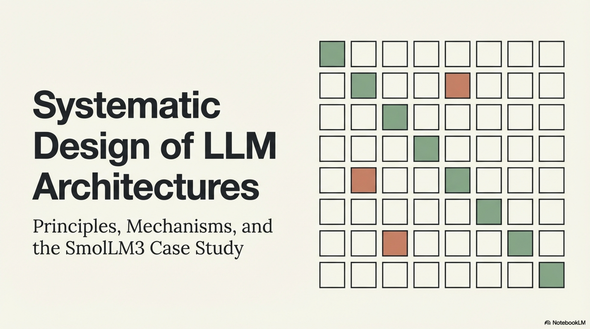

# Technical Report: Systematic Design of Large Language Model Architectures — Principles, Mechanisms, and Empirical Validation

---

## Table of Contents

1. [Preamble: Goal-Driven Architecture Design Philosophy](#1-preamble)
2. [Landscape of Contemporary LLM Architectures](#2-landscape)
3. [Attention Mechanisms: Taxonomy, Mathematical Formulation, and Efficiency Analysis](#3-attention)
   - 3.1 Multi-Head Attention (MHA)
   - 3.2 Multi-Query Attention (MQA)
   - 3.3 Grouped Query Attention (GQA)
   - 3.4 Multi-Head Latent Attention (MLA)
   - 3.5 KV Cache Memory Analysis
   - 3.6 Empirical Ablation: GQA vs. MHA vs. MQA
4. [Document Masking: Intra-Document Attention Constraints](#4-document-masking)
   - 4.1 Sequence Packing in Fixed-Length Training
   - 4.2 Causal Masking vs. Intra-Document Masking
   - 4.3 Theoretical Motivation and Empirical Evidence
   - 4.4 Ablation Results and Deployment Decision
5. [Case Study: SmolLM3 Architecture Design Rationale](#5-smollm3)
6. [Consolidated Findings and Architectural Recommendations](#6-consolidated)

---

## 1. Preamble: Goal-Driven Architecture Design Philosophy

### 1.1 The Imperative of Deliberate Design

Architecture design for large language models (LLMs) constitutes a high-dimensional optimization problem where every decision — from parameter count to attention mechanism to positional encoding scheme — induces cascading constraints on training dynamics, inference efficiency, and downstream capability. Before engaging with any technical specification, a rigorous design process demands explicit articulation of two foundational questions:

1. **Why** is the model being trained? (target application domain, deployment constraints, competitive positioning)
2. **What** should the model embody? (parameter budget, capability profile, context length requirements, language coverage)

These questions are not rhetorical. They function as a **training compass** — a decision-theoretic framework that prunes the combinatorially vast space of architectural configurations into a tractable set of experiments. Without this compass, teams risk expending compute on ablations that do not align with deployment requirements, or adopting architectural innovations that optimize for benchmarks irrelevant to the target use case.

### 1.2 From Objectives to Architectural Constraints

The relationship between high-level objectives and low-level architectural decisions is best understood as a constraint propagation system. Consider the following mapping for the SmolLM3 project:

| **Objective** | **Architectural Constraint** |
|---|---|
| On-device deployment (mobile) | Dense architecture; $\leq 3\text{B}$ parameters; memory-efficient attention |
| Competitive multilingual performance | Expanded tokenizer vocabulary; multilingual pretraining data |
| Strong mathematics and coding capabilities | Domain-specific data mixture; sufficient model capacity |
| Robust long-context handling ($128\text{k}$ tokens) | Position-encoding agnostic design (NoPE); intra-document masking from initialization |
| Project timeline ($\sim 3$ months) | Dense transformer over MoE/hybrid (reduced engineering complexity) |

The choice of a dense transformer over a Mixture-of-Experts (MoE) or hybrid architecture warrants explicit justification. While MoE architectures achieve superior compute-performance tradeoffs at large scale by activating only a subset of parameters per token, they impose significant memory overhead because all expert parameters must reside in memory during inference. For edge devices with constrained DRAM budgets, the total parameter footprint — not the active parameter count — determines deployment feasibility. A $3\text{B}$-parameter dense model thus represents the Pareto-optimal configuration for the stated deployment constraints.

### 1.3 Lessons from Prior Iterations: SmolLM2

The SmolLM2 model family ($135\text{M}$, $360\text{M}$, $1.7\text{B}$ parameters) served as the foundational predecessor, designed for English-only on-device deployment with $8\text{k}$ context length. Scaling from $1.7\text{B}$ to $3\text{B}$ parameters introduced non-trivial challenges:

- **Multilinguality**: Required revalidation of the tokenizer, data mixtures, and evaluation protocols across languages.
- **Extended context length**: SmolLM2 encountered difficulties in post-hoc context length extension during late-stage pretraining. This failure mode directly motivated the adoption of architectural choices amenable to context extension from initialization (NoPE, intra-document masking) in SmolLM3.

This iterative refinement exemplifies a critical principle: **architectural decisions must be informed by failure analysis of prior experiments**, not merely by literature survey.

---

## 2. Landscape of Contemporary LLM Architectures

### 2.1 The Transformer as Universal Foundation

Despite the diversity of modern LLM implementations, virtually all production-grade models share a common foundation: the transformer architecture introduced by Vaswani et al. (2017). The fundamental computational structure — alternating multi-head self-attention layers and position-wise feedforward networks, with residual connections and layer normalization — has remained remarkably stable. What has evolved are the **component-level refinements** addressing specific engineering challenges:

- **Memory constraints during inference** $\rightarrow$ KV cache compression (GQA, MQA, MLA)
- **Training instability at scale** $\rightarrow$ Improved initialization, normalization, and precision strategies
- **Long-context handling** $\rightarrow$ Novel positional encoding schemes (RoPE, NoPE, ALiBi)
- **Compute efficiency** $\rightarrow$ Mixture-of-Experts routing, hybrid attention patterns

### 2.2 Comparative Architecture Survey

The following table consolidates publicly disclosed architectural specifications of representative contemporary LLMs, providing a cross-sectional view of the design space:

| **Model** | **Architecture** | **Parameters** | **Training Tokens** | **Attention** | **Context Length** | **Positional Encoding** | **Precision** | **Init ($\sigma$)** | **Optimizer** | **Max LR** | **LR Schedule** | **Warmup** | **Batch Size** |
|---|---|---|---|---|---|---|---|---|---|---|---|---|---|
| DeepSeek LLM 7B | Dense | $7\text{B}$ | $2\text{T}$ | GQA | $4\text{k}$ | RoPE | BF16 | $0.006$ | AdamW | $4.2 \times 10^{-4}$ | Multi-step | $2\text{k}$ | $9.4\text{M}$ |
| DeepSeek LLM 67B | Dense | $67\text{B}$ | $2\text{T}$ | GQA | $4\text{k}$ | RoPE | BF16 | $0.006$ | AdamW | $3.2 \times 10^{-4}$ | Multi-step | $2\text{k}$ | $18.9\text{M}$ |
| DeepSeek-V2 | MoE | $236\text{B}$ ($21\text{B}$ active) | $8.1\text{T}$ | MLA | $128\text{k}$ | Partial RoPE | — | $0.006$ | AdamW | $2.4 \times 10^{-4}$ | Multi-step | $2\text{k}$ | $9.4\text{M} \rightarrow 37.7\text{M}$ |
| DeepSeek-V3 | MoE | $671\text{B}$ ($37\text{B}$ active) | $14.8\text{T}$ | MLA | $128\text{k}$ | Partial RoPE | FP8 | $0.006$ | AdamW | $2.2 \times 10^{-4}$ | Multi-step + cosine | $2\text{k}$ | $12.6\text{M} \rightarrow 62.9\text{M}$ |
| MiniMax-01 | MoE + hybrid | $456\text{B}$ ($45.9\text{B}$ active) | $11.4\text{T}$ | Linear attn + GQA | $4\text{M}$ | Partial RoPE | — | Xavier + DeepNorm | AdamW | $2 \times 10^{-4}$ | Multi-step | $500$ | $16\text{M} \rightarrow 128\text{M}$ |
| Kimi K2 | MoE | $1\text{T}$ ($32\text{B}$ active) | $15.5\text{T}$ | MLA | $128\text{k}$ | Partial RoPE | BF16 | $\sim 0.006$ | MuonClip | $2 \times 10^{-4}$ | WSD | $500$ | $67\text{M}$ |
| OLMo 2 7B | Dense | $7\text{B}$ | $5\text{T}$ | MHA | $4\text{k}$ | RoPE | BF16 | $0.02$ | AdamW | $3 \times 10^{-4}$ | Cosine | $2\text{k}$ | $4.2\text{M}$ |
| **SmolLM3** | **Dense** | **$3\text{B}$** | **$11\text{T}$** | **GQA** | **$128\text{k}$** | **NoPE** | **BF16** | **$0.02$** | **AdamW** | **$2 \times 10^{-4}$** | **WSD** | **$2\text{k}$** | **$2.3\text{M}$** |

### 2.3 Key Observations from the Survey

Several architectural trends emerge from this cross-model comparison:

1. **Attention mechanism convergence**: GQA has become the de facto standard for dense models, while MLA is gaining traction in MoE architectures (DeepSeek-V2/V3, Kimi K2). Full MHA is increasingly rare at scale.

2. **Positional encoding diversity**: RoPE dominates, but NoPE (No Positional Encoding) and Partial RoPE represent emerging alternatives, particularly for long-context applications.

3. **Learning rate schedule evolution**: The traditional cosine schedule is being displaced by multi-step and WSD (Warmup-Stable-Decay) schedules, which offer greater flexibility for multi-phase training.

4. **Batch size ramping**: Large-scale MoE models universally employ progressive batch size increases during training, beginning with smaller batches for gradient signal quality and scaling up for throughput.

5. **Initialization standard deviation**: A bimodal distribution is observed — $\sigma = 0.006$ (DeepSeek family) vs. $\sigma = 0.02$ (OLMo, SmolLM3) — reflecting different theoretical commitments regarding weight initialization scaling.

---

## 3. Attention Mechanisms: Taxonomy, Mathematical Formulation, and Efficiency Analysis

The attention mechanism constitutes the computational core of the transformer architecture, governing how each token aggregates information from its context. While feedforward layers dominate the FLOPs budget during pretraining (scaling as $\mathcal{O}(b \cdot s \cdot d^2)$ where $b$ is batch size, $s$ is sequence length, and $d$ is model dimension), the attention mechanism becomes the primary inference bottleneck — particularly for long-context applications — due to its quadratic scaling in sequence length and the memory demands of the key-value (KV) cache.

### 3.1 Multi-Head Attention (MHA)

#### 3.1.1 Mathematical Formulation

Multi-head attention, as introduced by Vaswani et al. (2017), partitions the representation space into $n_h$ independent attention heads. For input hidden states $\mathbf{X} \in \mathbb{R}^{s \times d}$, each head $i \in \{1, \ldots, n_h\}$ computes:

$$
\mathbf{Q}_i = \mathbf{X} \mathbf{W}_i^Q, \quad \mathbf{K}_i = \mathbf{X} \mathbf{W}_i^K, \quad \mathbf{V}_i = \mathbf{X} \mathbf{W}_i^V
$$

where $\mathbf{W}_i^Q, \mathbf{W}_i^K, \mathbf{W}_i^V \in \mathbb{R}^{d \times d_h}$ are per-head projection matrices and $d_h = d / n_h$ is the per-head dimension. The attention output for head $i$ is:

$$
\text{Attention}_i(\mathbf{Q}_i, \mathbf{K}_i, \mathbf{V}_i) = \text{softmax}\!\left(\frac{\mathbf{Q}_i \mathbf{K}_i^\top}{\sqrt{d_h}} + \mathbf{M}\right) \mathbf{V}_i
$$

where $\mathbf{M} \in \mathbb{R}^{s \times s}$ is the causal mask matrix with $M_{ij} = 0$ if $i \geq j$ and $M_{ij} = -\infty$ otherwise. The outputs of all heads are concatenated and projected:

$$
\text{MHA}(\mathbf{X}) = \text{Concat}(\text{Attention}_1, \ldots, \text{Attention}_{n_h}) \mathbf{W}^O
$$

where $\mathbf{W}^O \in \mathbb{R}^{d \times d}$ is the output projection matrix.

#### 3.1.2 Inference Characteristics

During autoregressive inference, the model generates one token at a time. For each new token at position $t$, the query $\mathbf{q}_t^{(i)} \in \mathbb{R}^{d_h}$ must attend to all previous keys and values. Rather than recomputing $\mathbf{K}$ and $\mathbf{V}$ for all preceding tokens at every step, the model caches these values incrementally. This **KV cache** stores:

$$
\text{KV Cache} = \left\{ \left(\mathbf{K}_i^{(1:t)}, \mathbf{V}_i^{(1:t)}\right) \mid i = 1, \ldots, n_h \right\} \quad \forall \text{ layers}
$$

The total memory required for the KV cache in MHA is:

$$
\boxed{S_{\text{KV}}^{\text{MHA}} = 2 \times n_{\text{bytes}} \times s \times n_{\text{layers}} \times n_{\text{heads}} \times d_h}
$$

where $n_{\text{bytes}}$ is the number of bytes per parameter (typically $2$ for BF16/FP16), $s$ is the sequence length, and the leading factor of $2$ accounts for storing both keys and values.

**Numerical Example — Llama 3 8B** ($n_{\text{layers}} = 32$, $n_{\text{heads}} = 32$, $d_h = 128$, $s = 8192$, BF16):

$$
S_{\text{KV}}^{\text{MHA}} = 2 \times 2 \times 8192 \times 32 \times 32 \times 128 = 4 \text{ GB}
$$

**Numerical Example — Llama 3 70B** ($n_{\text{layers}} = 80$, $n_{\text{heads}} = 64$, $d_h = 128$, $s = 8192$, BF16):

$$
S_{\text{KV}}^{\text{MHA}} = 2 \times 2 \times 8192 \times 80 \times 64 \times 128 = 20 \text{ GB}
$$

The linear scaling of cache size with sequence length, combined with the exponential growth of target context windows (now reaching millions of tokens), creates a fundamental engineering bottleneck that motivates the attention variants discussed below.

### 3.2 Multi-Query Attention (MQA)

#### 3.2.1 Formulation

Multi-query attention (MQA), introduced by Shazeer (2019), addresses the KV cache bottleneck through the most aggressive compression strategy: **all query heads share a single set of key-value projections**. Formally:

$$
\mathbf{Q}_i = \mathbf{X} \mathbf{W}_i^Q \quad \forall \, i \in \{1, \ldots, n_h\}
$$

$$
\mathbf{K} = \mathbf{X} \mathbf{W}^K, \quad \mathbf{V} = \mathbf{X} \mathbf{W}^V
$$

where $\mathbf{W}^K, \mathbf{W}^V \in \mathbb{R}^{d \times d_h}$ are now **shared** across all heads (note the absence of head index $i$). The KV cache is reduced by a factor of $n_h$:

$$
\boxed{S_{\text{KV}}^{\text{MQA}} = 2 \times n_{\text{bytes}} \times s \times n_{\text{layers}} \times 1 \times d_h}
$$

For Llama 3 70B, this yields a $64\times$ reduction (from $20$ GB to $\sim 0.31$ GB at $s = 8192$).

#### 3.2.2 Trade-offs

While MQA offers maximal cache compression, it sacrifices **attention capacity** — the ability of different heads to retrieve different information patterns using distinct key-value spaces. This can lead to degraded performance on tasks requiring diverse, head-specific attention patterns, as empirically confirmed in the ablation experiments presented in Section 3.6.

### 3.3 Grouped Query Attention (GQA)

#### 3.3.1 Formulation

Grouped Query Attention (GQA), proposed by Ainslie et al. (2023), interpolates between MHA and MQA by partitioning query heads into $g$ groups, where each group shares a common key-value projection. The **GQA ratio** is defined as:

$$
r_{\text{GQA}} = \frac{n_{\text{query heads}}}{n_{\text{KV heads}}} = \frac{n_h}{g}
$$

where $g$ denotes the number of KV head groups. The extremes recover known mechanisms:
- $g = n_h$ (one KV head per query head) $\Rightarrow$ MHA
- $g = 1$ (single KV head shared by all query heads) $\Rightarrow$ MQA

The KV cache memory under GQA is:

$$
\boxed{S_{\text{KV}}^{\text{GQA}} = 2 \times n_{\text{bytes}} \times s \times n_{\text{layers}} \times g \times d_h}
$$

Common configurations employ $g \in \{2, 4, 8\}$. SmolLM3 uses $n_h = 32$ query heads with $g = 8$ KV heads (GQA ratio $= 4$), achieving a $4\times$ KV cache reduction relative to MHA while preserving sufficient attention diversity.

#### 3.3.2 Rationale for Wide Adoption

GQA has emerged as the dominant attention mechanism in contemporary dense LLMs (DeepSeek LLM 7B/67B, SmolLM3, Llama 3, Qwen3, Gemma 3) for the following reasons:

1. **Minimal quality degradation**: Empirical evidence consistently shows that moderate GQA ratios ($2$–$8$) match MHA performance on standard benchmarks (Section 3.6).
2. **Significant inference speedup**: Reduced KV cache size directly translates to higher throughput and lower latency during autoregressive generation.
3. **Implementation simplicity**: GQA requires only minor modifications to standard MHA implementations and is supported by all major inference frameworks (vLLM, TensorRT-LLM, etc.).

### 3.4 Multi-Head Latent Attention (MLA)

#### 3.4.1 Formulation

Multi-Head Latent Attention (MLA), introduced in DeepSeek-V2 (DeepSeek-AI et al., 2024), takes a fundamentally different approach to KV cache compression. Rather than reducing the **number** of KV heads, MLA reduces the **dimensionality** of cached representations by projecting keys and values into a shared low-rank latent space.

The core mechanism operates as follows. Instead of caching full-dimensional key and value vectors, MLA stores a compressed **joint latent vector** $\mathbf{c}_t \in \mathbb{R}^{d_c}$ for each token $t$:

$$
\mathbf{c}_t = \mathbf{x}_t \mathbf{W}^{DKV}
$$

where $\mathbf{W}^{DKV} \in \mathbb{R}^{d \times d_c}$ is the down-projection matrix and $d_c$ is the compressed latent dimension. At inference time, the full key and value matrices for all heads are **reconstructed** from this latent via learned up-projections:

$$
\mathbf{K}_i = \mathbf{C} \mathbf{W}_i^{UK}, \quad \mathbf{V}_i = \mathbf{C} \mathbf{W}_i^{UV}
$$

where $\mathbf{C} \in \mathbb{R}^{s \times d_c}$ is the matrix of cached latent vectors and $\mathbf{W}_i^{UK}, \mathbf{W}_i^{UV} \in \mathbb{R}^{d_c \times d_h}$ are per-head up-projection matrices.

#### 3.4.2 RoPE Compatibility

A technical subtlety arises from the interaction with Rotary Positional Embeddings (RoPE). RoPE operates by applying position-dependent rotations to query and key vectors, which requires the key representation to be **position-aware before caching**. However, the MLA latent $\mathbf{c}_t$ is shared across keys and values and cannot independently encode position for the key component alone.

DeepSeek-V2 resolves this by introducing an auxiliary **RoPE-specific latent vector** $\mathbf{c}_t^{\text{RoPE}} \in \mathbb{R}^{d_r}$ with $d_r = \frac{1}{2} d_h$:

$$
\mathbf{c}_t^{\text{RoPE}} = \mathbf{x}_t \mathbf{W}^{\text{RoPE}}
$$

The total cached representation per token per layer is therefore:

$$
\text{Cache per token per layer} = d_c + d_r
$$

In DeepSeek-V2, $d_c = 4 \cdot d_h$ and $d_r = \frac{1}{2} \cdot d_h$, yielding a total of $4.5 \cdot d_h$ cached dimensions per token per layer. Critically, this representation encodes **both** keys and values jointly, eliminating the leading factor of $2$:

$$
\boxed{S_{\text{KV}}^{\text{MLA}} = n_{\text{bytes}} \times s \times n_{\text{layers}} \times 4.5 \times d_h}
$$

This is equivalent in cache size to GQA with $g = 2.25$ groups, while empirically delivering performance **superior to full MHA** due to the joint compression's regularization effect.

### 3.5 Consolidated KV Cache Comparison

The following table provides a unified comparison of per-token KV cache parameter counts across all discussed attention mechanisms, abstracting away byte precision and sequence length:

| **Mechanism** | **KV Cache Parameters per Token** | **Compression Factor vs. MHA** |
|---|---|---|
| MHA | $2 \times n_h \times n_{\text{layers}} \times d_h$ | $1\times$ (baseline) |
| MQA | $2 \times 1 \times n_{\text{layers}} \times d_h$ | $n_h \times$ |
| GQA | $2 \times g \times n_{\text{layers}} \times d_h$ | $n_h / g \times$ |
| MLA | $4.5 \times n_{\text{layers}} \times d_h$ | $\frac{2 n_h}{4.5} \times \approx \frac{n_h}{2.25} \times$ |

To obtain total memory in bytes, multiply by $n_{\text{bytes}} \times s$ (sequence length).

### 3.6 Empirical Ablation: GQA vs. MHA vs. MQA

#### 3.6.1 Experimental Protocol

To empirically validate the attention mechanism choice, a controlled ablation study was conducted using the standardized $1\text{B}$-parameter baseline model (Llama 3.2 $1\text{B}$ architecture) trained on $45\text{B}$ tokens from a curated mixture of FineWeb-Edu, FineMath, and Python-Edu.

**Critical methodological consideration**: Varying the number of KV heads directly affects the model's parameter count. For configurations where this discrepancy exceeds $\sim 100\text{M}$ parameters (specifically MHA and GQA with ratio $2$ at $16$ layers), the number of transformer layers was adjusted downward to maintain approximate parameter parity. This ensures that observed performance differences are attributable to the attention mechanism rather than model capacity.

| **Attention Type** | **Query Heads** | **KV Heads** | **Layers** | **Parameters** | **Notes** |
|---|---|---|---|---|---|
| MQA | $32$ | $1$ | $16$ | $1.21\text{B}$ | — |
| GQA (ratio $16$) | $32$ | $2$ | $16$ | $1.21\text{B}$ | — |
| GQA (ratio $8$) | $32$ | $4$ | $16$ | $1.22\text{B}$ | **Baseline** |
| GQA (ratio $4$) | $32$ | $8$ | $16$ | $1.24\text{B}$ | — |
| GQA (ratio $2$) | $32$ | $16$ | $15$ | $1.22\text{B}$ | Layers reduced |
| MHA | $32$ | $32$ | $14$ | $1.20\text{B}$ | Layers reduced |
| GQA (ratio $2$) | $32$ | $16$ | $16$ | $1.27\text{B}$ | Over-budget; excluded |
| MHA | $32$ | $32$ | $16$ | $1.34\text{B}$ | Over-budget; excluded |

#### 3.6.2 Results and Analysis

The ablation yields the following findings, consistent across both training loss trajectories and downstream evaluation benchmarks:

**Finding 1 — Aggressive KV compression degrades performance**:
MQA ($g = 1$) and GQA with ratio $16$ ($g = 2$) exhibit significantly higher training loss and lower downstream scores across HellaSwag, MMLU, and ARC compared to all other configurations. This confirms that with only $1$–$2$ KV heads, the attention mechanism lacks sufficient representational diversity to capture the variety of attention patterns required for general language modeling.

**Finding 2 — Moderate GQA matches MHA**:
GQA configurations with ratios $2$, $4$, and $8$ (corresponding to $g = 16, 8, 4$ KV heads) achieve performance statistically indistinguishable from full MHA on both loss curves and downstream benchmarks including HellaSwag, MMLU, ARC, and PIQA. This holds despite MHA having access to fully independent key-value spaces for each head.

**Finding 3 — Benchmark-specific noise**:
Certain benchmarks (OpenBookQA, WinoGrande) exhibit high variance across configurations, providing insufficient signal to discriminate between attention mechanisms. This underscores the importance of evaluating on a **diverse benchmark suite** rather than relying on individual metrics.

#### 3.6.3 Architectural Decision for SmolLM3

Based on these ablation results, **GQA with $g = 8$ KV heads (ratio $4$)** was selected for SmolLM3. This configuration:

- Matches MHA performance on all discriminative benchmarks
- Provides a $4\times$ reduction in KV cache memory vs. MHA
- Aligns with the established practice of leading dense models (DeepSeek LLM, Llama 3)
- Offers straightforward implementation in existing training and inference frameworks

MLA was not ablated due to the absence of a Nanotron implementation at the time of experimentation. However, MLA represents a promising direction for future iterations, particularly if inference on long-context sequences becomes a primary optimization target.

---


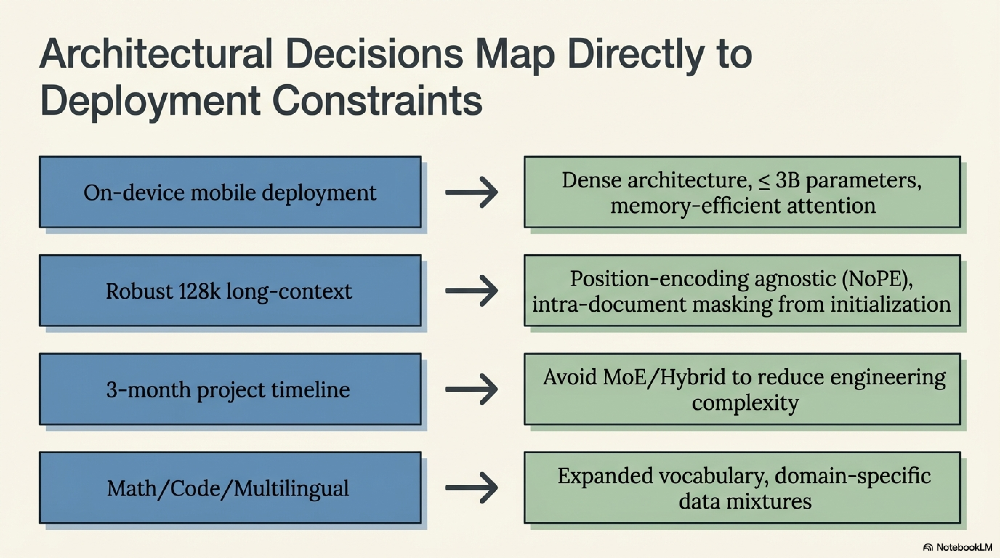

## 4. Document Masking: Intra-Document Attention Constraints

### 4.1 The Sequence Packing Problem

Transformer pretraining operates on fixed-length sequences of $s$ tokens. However, the training corpus comprises documents of highly variable length — ranging from short code snippets ($\sim 100$ tokens) to full research papers ($> 10\text{k}$ tokens). Two strategies exist for reconciling this mismatch:

1. **Padding**: Truncate or pad each document individually to length $s$. This wastes compute on meaningless padding tokens and is universally rejected for large-scale pretraining.

2. **Packing**: Shuffle documents, concatenate them with end-of-sequence ($\langle\text{EOS}\rangle$) delimiters, and segment the resulting stream into fixed-length chunks of $s$ tokens.

Packing is the standard approach. Concretely, given documents $D_1, D_2, \ldots, D_n$ with token counts $|D_1|, |D_2|, \ldots, |D_n|$:

$$
\text{Stream} = D_1 \| \langle\text{EOS}\rangle \| D_2 \| \langle\text{EOS}\rangle \| \cdots \| D_n \| \langle\text{EOS}\rangle
$$

This stream is then partitioned into training sequences:

$$
\text{Sequence}_j = \text{Stream}[(j-1) \cdot s : j \cdot s] \quad \forall \, j
$$

A single training sequence may therefore contain fragments of multiple unrelated documents. An optional $\langle\text{BOS}\rangle$ (beginning-of-sequence) token may additionally be prepended to each document boundary.

### 4.2 Document Length Distribution Analysis

The impact of packing depends critically on the distribution of document lengths relative to the training sequence length $s$. Empirical analysis of four major pretraining datasets reveals that the vast majority of documents are substantially shorter than typical sequence lengths:

| **Token Range** | **FineWeb-Edu** | **DCLM** | **FineMath** | **Python-Edu** |
|---|---|---|---|---|
| $0$–$1\text{k}$ | $\sim 55\%$ | $\sim 60\%$ | $\sim 65\%$ | $\sim 50\%$ |
| $0$–$2\text{k}$ | $> 80\%$ | $> 80\%$ | $> 85\%$ | $> 80\%$ |
| $> 4\text{k}$ | $< 10\%$ | $< 10\%$ | $< 8\%$ | $< 10\%$ |

This distribution implies that with a training sequence length of $s = 4096$, the typical sequence contains **multiple concatenated documents** from entirely unrelated domains (e.g., a cooking recipe, a Python function definition, and a climate science article).

**Exception — PDF-derived datasets**: Datasets extracted from PDF sources (e.g., FinePDFs) exhibit substantially longer documents, with average lengths approximately $2\times$ that of web-crawled text. Mixing PDF-derived data with web data has been shown to improve performance, partially attributable to this distributional difference.

### 4.3 Causal Masking vs. Intra-Document Masking

#### 4.3.1 Standard Causal Masking

Under standard causal (autoregressive) masking, the attention mask $\mathbf{M} \in \{0, -\infty\}^{s \times s}$ permits each token to attend to all preceding tokens within the packed sequence, regardless of document boundaries:

$$
M_{ij}^{\text{causal}} = \begin{cases} 0 & \text{if } i \geq j \\ -\infty & \text{otherwise} \end{cases}
$$

This means a token in document $D_k$ can attend to tokens from documents $D_1, \ldots, D_{k-1}$ that happen to precede it in the packed sequence, even though these documents are semantically unrelated.

#### 4.3.2 Intra-Document Masking

Intra-document masking (also termed document masking) modifies the attention mask to **restrict attention within document boundaries**. Let $\text{doc}(i)$ denote the document index of token $i$. The mask becomes:

$$
M_{ij}^{\text{intra-doc}} = \begin{cases} 0 & \text{if } i \geq j \text{ and } \text{doc}(i) = \text{doc}(j) \\ -\infty & \text{otherwise} \end{cases}
$$

Each token can attend only to preceding tokens **within the same document**. Cross-document attention is completely eliminated.

#### 4.3.3 Formal Comparison

Consider a packed sequence containing three documents with boundaries at positions $b_1, b_2, b_3$:

$$
\underbrace{t_1, \ldots, t_{b_1}}_{\text{Doc 1}}, \underbrace{t_{b_1+1}, \ldots, t_{b_2}}_{\text{Doc 2}}, \underbrace{t_{b_2+1}, \ldots, t_{b_3}}_{\text{Doc 3}}
$$

Under causal masking, token $t_{b_2 + 5}$ (in Doc 3) attends to all tokens $t_1, \ldots, t_{b_2 + 4}$ spanning all three documents. Under intra-document masking, it attends only to $t_{b_2 + 1}, \ldots, t_{b_2 + 4}$ within Doc 3.

### 4.4 Theoretical Motivation

Three complementary theoretical arguments support intra-document masking:

#### Argument 1 — Noise Reduction (Zhao et al., 2024)

Cross-document attention introduces **spurious statistical dependencies** between unrelated texts. The attention mechanism, trained to extract predictive features, will attempt to leverage these coincidental co-occurrences, learning noisy associations that do not generalize. Intra-document masking eliminates this noise source.

#### Argument 2 — Effective Context Length Reduction (Zhu et al., 2025)

The SkyLadder study (Zhu et al., 2025) provides an alternative interpretation: intra-document masking effectively **reduces the average context length** experienced by each token. Given that shorter contexts consistently yield lower validation perplexity during pretraining (a finding independently replicated across multiple studies), this distributional shift toward shorter effective contexts may be the primary mechanism of improvement.


Formally, under intra-document masking, the effective context length $\ell_{\text{eff}}(t)$ for token $t$ at position $p$ within its document is:

$$
\ell_{\text{eff}}(t) = p \leq s
$$

whereas under causal masking:

$$
\ell_{\text{eff}}(t) = \text{global position of } t \text{ in packed sequence}
$$

The distribution of $\ell_{\text{eff}}$ under intra-document masking is strongly skewed toward shorter values, matching the document length distribution.

#### Argument 3 — Long Context Extension Facilitation (Grattafiori et al., 2024; Gao et al., 2025)

Meta's Llama 3 training report and the ProLong paper independently demonstrate that intra-document masking provides significant benefits during **long context extension** phases:

- During short-context pretraining ($s \leq 8\text{k}$), the impact is minimal because cross-document attention spans are relatively short.
- During long-context extension ($s = 32\text{k}$–$128\text{k}$), the attention overhead from unrelated documents becomes substantial, and intra-document masking provides both computational savings and quality improvements.
- ProLong (Gao et al., 2025) demonstrated that using document masking during continual pretraining of Llama 3 8B for context extension improves performance on **both** long-context and short-context benchmarks — indicating that the benefits are not merely artifact of reduced computation but reflect genuinely improved representations.

### 4.5 Ablation Results

#### 4.5.1 Experimental Setup

An ablation was conducted on the $1\text{B}$ baseline model comparing standard causal masking (baseline) against intra-document masking. Implementation in Nanotron requires only a single configuration flag change:


```yaml
model_config:
  _attn_implementation: flash_attention_2
  _fused_rms_norm: true
  _fused_rotary_emb: true
  _use_doc_masking: true  # Enable intra-document masking
```

All other hyperparameters, data mixtures, and training configurations remained identical.

#### 4.5.2 Results


| **Metric** | **Causal Masking (Baseline)** | **Intra-Document Masking** |
|---|---|---|
| Final loss (at $1.69\text{B}$ tokens) | $3.3664$ | $3.3312$ |
| HellaSwag | Baseline | $\approx$ Baseline |
| MMLU | Baseline | $\approx$ Baseline |
| ARC | Baseline | $\approx$ Baseline |
| PIQA | Baseline | Slight improvement |
| OpenBookQA | Baseline | $\approx$ Baseline |
| WinoGrande | Baseline | $\approx$ Baseline |


The loss curves are **effectively identical** across the full $45\text{B}$-token training run. Downstream benchmarks show no statistically significant differences, with the exception of a marginal improvement on PIQA.

#### 4.5.3 Interpretation

These results are consistent with the Llama 3 findings: intra-document masking introduces no degradation during short-context pretraining ($s = 4\text{k}$) and may provide marginal benefits. The critical advantage materializes during long-context extension (scaling from $4\text{k}$ to $64\text{k}$–$128\text{k}$), where it:


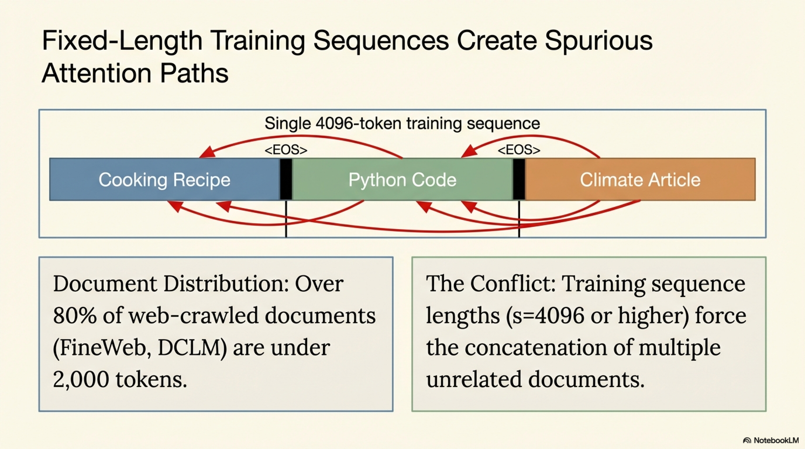

1. **Prevents attention distribution degradation** from massively long cross-document spans
2. **Reduces the computational overhead** of attending to irrelevant tokens
3. **Facilitates cleaner positional encoding generalization** to unseen sequence lengths


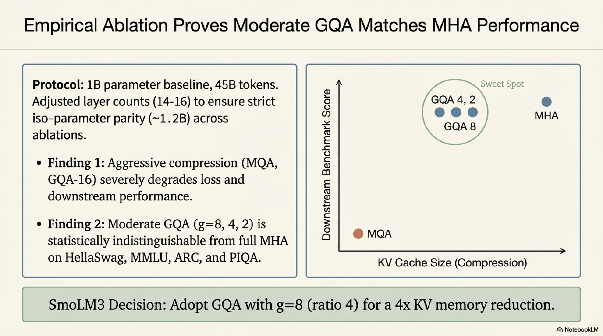


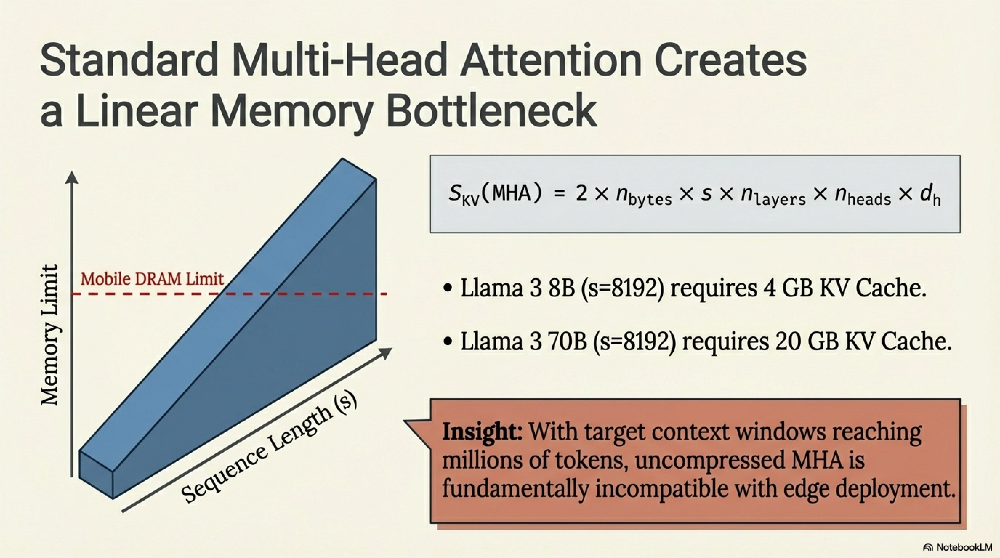

### 4.6 Deployment Decision for SmolLM3

Based on the combined evidence — neutral impact on short-context performance, demonstrated benefits for long-context extension, and negligible implementation cost — **intra-document masking was adopted for the entirety of SmolLM3 pretraining from initialization**. This represents a departure from the SmolLM2 approach, where context extension was treated as a post-hoc modification, and directly addresses the context extension difficulties encountered in that prior iteration.

---

## 5. Case Study: SmolLM3 Architecture Design Rationale

### 5.1 Complete Architectural Specification

The following table consolidates all architectural decisions for SmolLM3, with explicit rationale for each choice:


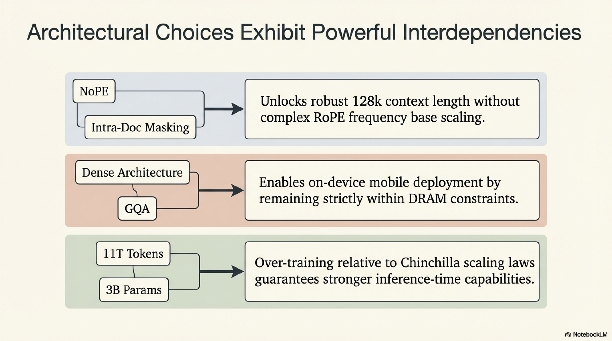


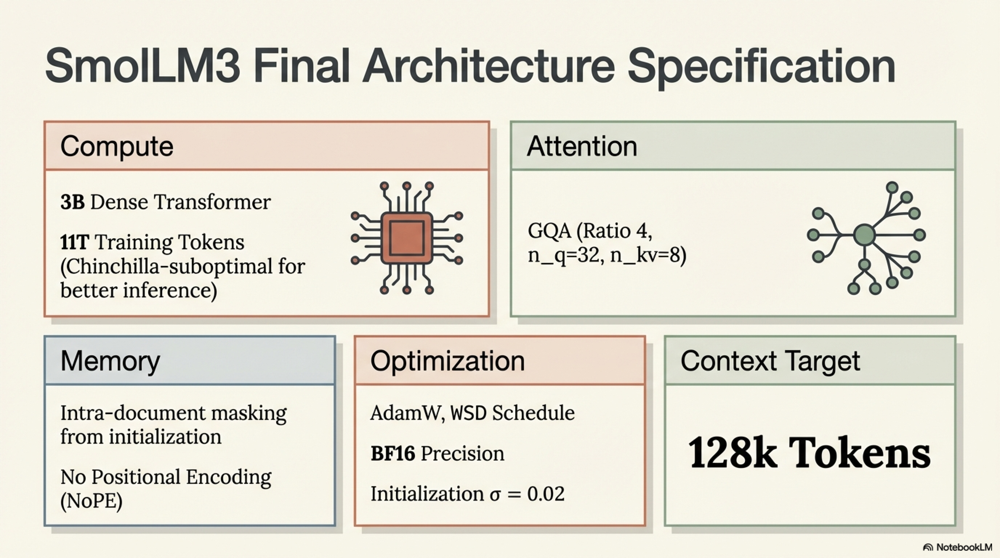


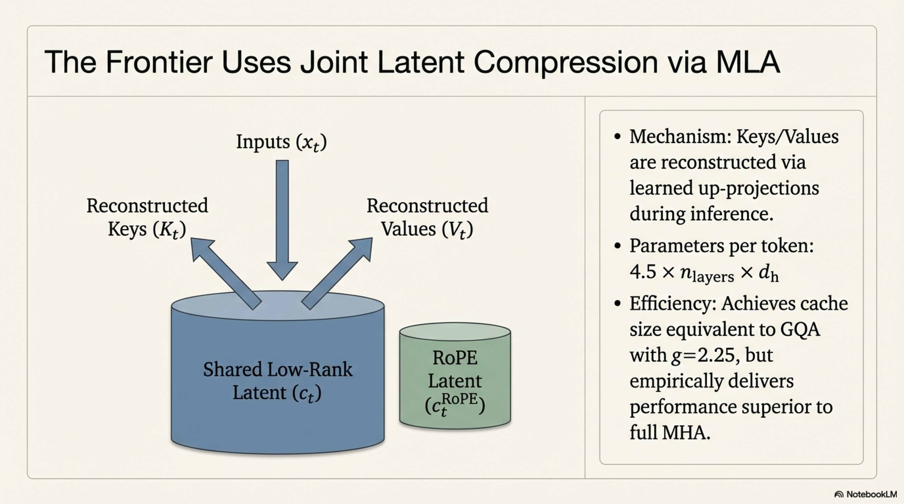


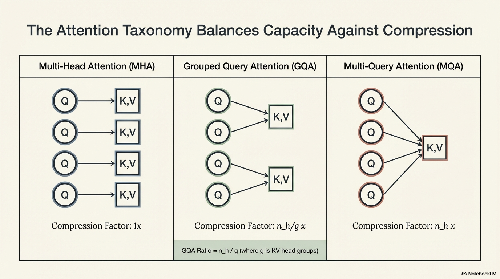


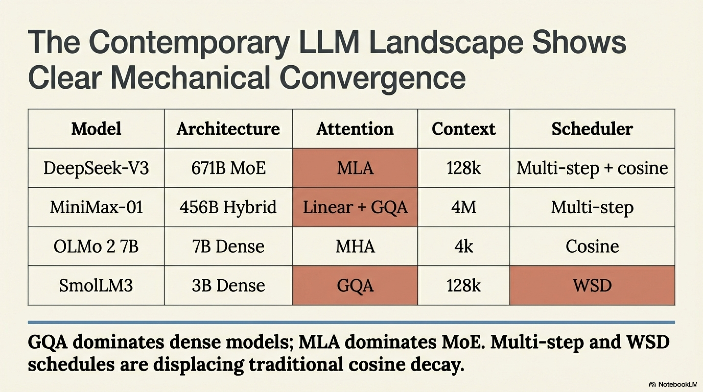

| **Component** | **SmolLM3 Configuration** | **Rationale** |
|---|---|---|
| Architecture type | Dense transformer | Memory constraints of edge devices; reduced engineering complexity |
| Parameter count | $3\text{B}$ | Sufficient capacity for multilingual + math + code; fits mobile DRAM |
| Training tokens | $11\text{T}$ | Chinchilla-suboptimal (overtrained) for stronger inference-time performance |
| Attention mechanism | GQA ($n_q = 32$, $n_{kv} = 8$, ratio $= 4$) | Matches MHA quality; $4\times$ KV cache reduction |
| Positional encoding | NoPE (No Positional Encoding) | Enables robust context length generalization |
| Context length (final) | $128\text{k}$ tokens | Competitive with frontier models |
| Attention masking | Intra-document masking | Facilitates long-context extension; no short-context penalty |
| Numerical precision | BF16 | Standard for training stability at this scale |
| Initialization $\sigma$ | $0.02$ | Following OLMo family convention |
| Optimizer | AdamW | Well-understood convergence properties |
| Maximum learning rate | $2 \times 10^{-4}$ | Empirically validated for $3\text{B}$ scale |
| LR schedule | WSD (Warmup-Stable-Decay) | Flexibility for multi-phase training |
| Warmup steps | $2\text{k}$ | Standard practice |
| Batch size | $2.3\text{M}$ tokens | Balanced throughput vs. gradient quality |

### 5.2 Design Interdependencies

Several architectural choices exhibit strong interdependencies that merit explicit documentation:

1. **NoPE $\leftrightarrow$ Long context**: The adoption of NoPE (No Positional Encoding) was directly motivated by the $128\text{k}$ context length target. Unlike RoPE, which requires careful frequency base scaling (e.g., extending $\theta$ from $10\text{k}$ to $500\text{k}$+) for context generalization, NoPE architectures are inherently position-agnostic and can generalize to longer sequences without architectural modification.


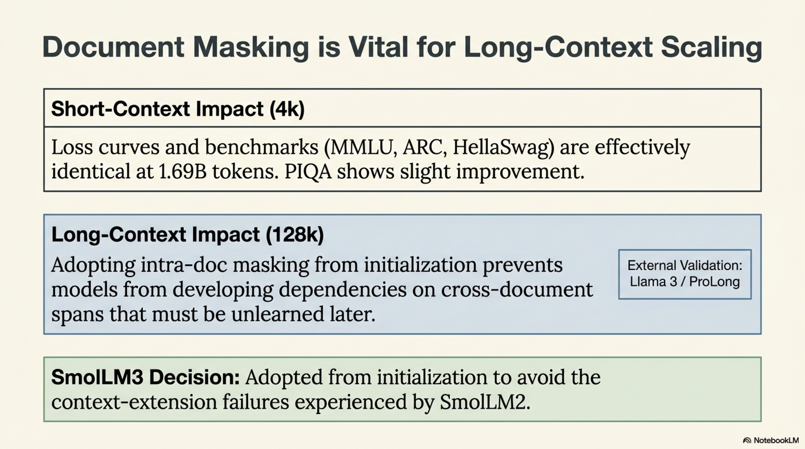


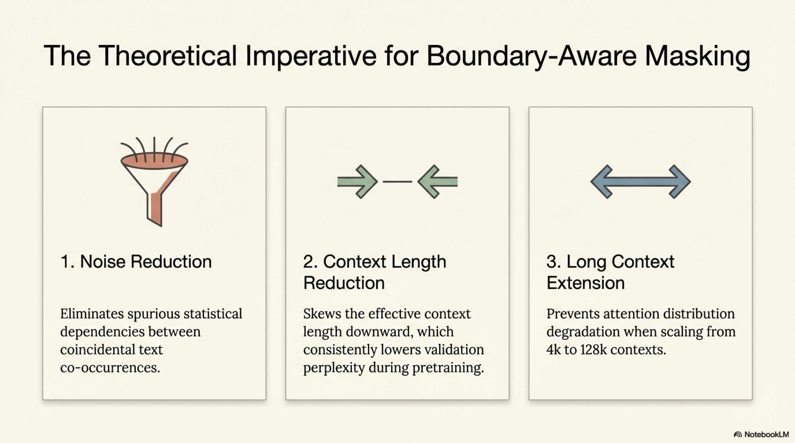


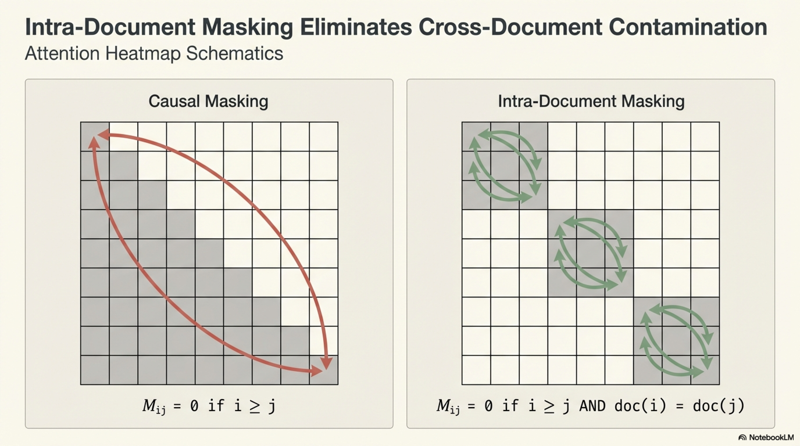

2. **Intra-document masking $\leftrightarrow$ Long context**: Enabling document masking from initialization ensures that the model never develops dependencies on cross-document attention patterns that would need to be unlearned during context extension.

3. **Dense architecture $\leftrightarrow$ On-device deployment**: The rejection of MoE in favor of a dense architecture is not a performance decision but a deployment constraint. MoE models with equivalent active parameters would occupy $3$–$10\times$ more memory on-device due to dormant expert storage.

4. **GQA $\leftrightarrow$ Inference efficiency**: The GQA ratio of $4$ was selected to balance attention capacity against KV cache size for long-context inference on resource-constrained hardware, where memory bandwidth is the primary throughput bottleneck.

---

## 6. Consolidated Findings and Architectural Recommendations

### 6.1 Summary of Empirical Findings

| **Decision** | **Finding** | **Confidence** |
|---|---|---|
| GQA vs. MHA | GQA with ratio $\leq 8$ matches MHA; MQA significantly underperforms | High (consistent across loss + 6 benchmarks) |
| GQA vs. MQA | MQA and GQA-$16$ degrade performance due to insufficient KV diversity | High |
| Intra-document masking (short context) | No significant impact vs. standard causal masking at $s = 4\text{k}$ | High |
| Intra-document masking (long context) | Significant benefits for context extension (external evidence: Llama 3, ProLong, SkyLadder) | High (multi-source corroboration) |
| MLA vs. GQA | MLA achieves superior cache compression with performance matching or exceeding MHA (external evidence: DeepSeek-V2) | Moderate (not directly ablated) |


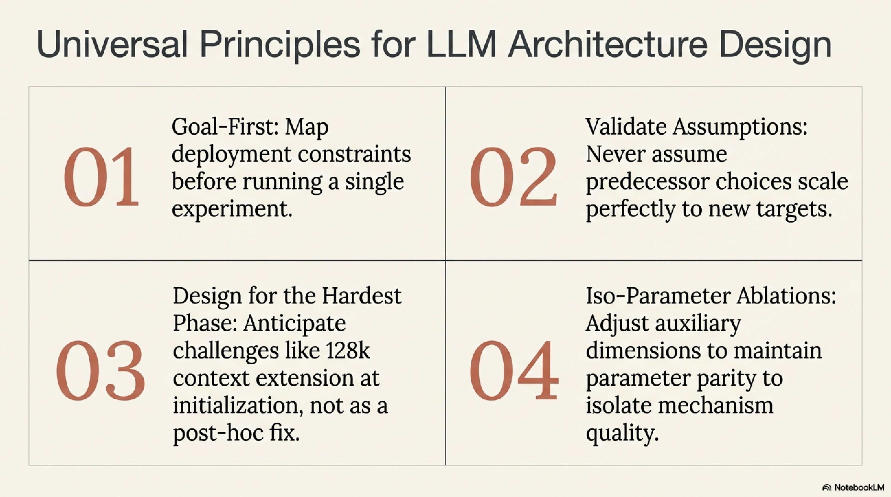

### 6.2 Design Principles Extracted

The following principles generalize beyond SmolLM3 to LLM architecture design broadly:

**Principle 1 — Goal-first, architecture-second**: Begin every architecture design process by explicitly enumerating deployment constraints, capability requirements, and project timeline. These constraints eliminate large regions of the design space before any experiment is run.

**Principle 2 — Validate inherited assumptions**: When scaling from a predecessor model (e.g., SmolLM2 $\rightarrow$ SmolLM3), do not assume that architectural choices validated at smaller scale or different capability targets will transfer. Re-ablate critical decisions at the target scale.

**Principle 3 — Design for the hardest phase**: Architectural choices should anticipate the most challenging training phase (in this case, long-context extension) rather than optimizing exclusively for the initial pretraining phase. The adoption of NoPE and intra-document masking from initialization exemplifies this forward-looking design philosophy.

**Principle 4 — Iso-parameter ablations**: When comparing architectural variants that differ in parameter count, adjust auxiliary dimensions (layer count, hidden size) to maintain approximate parameter parity. Failure to do so confounds mechanism quality with model capacity.

**Principle 5 — Multi-metric evaluation**: No single benchmark reliably discriminates between architectural variants. Evaluate on loss curves **and** a diverse suite of downstream tasks; discard noisy benchmarks (OpenBookQA, WinoGrande in this study) from architectural decisions.


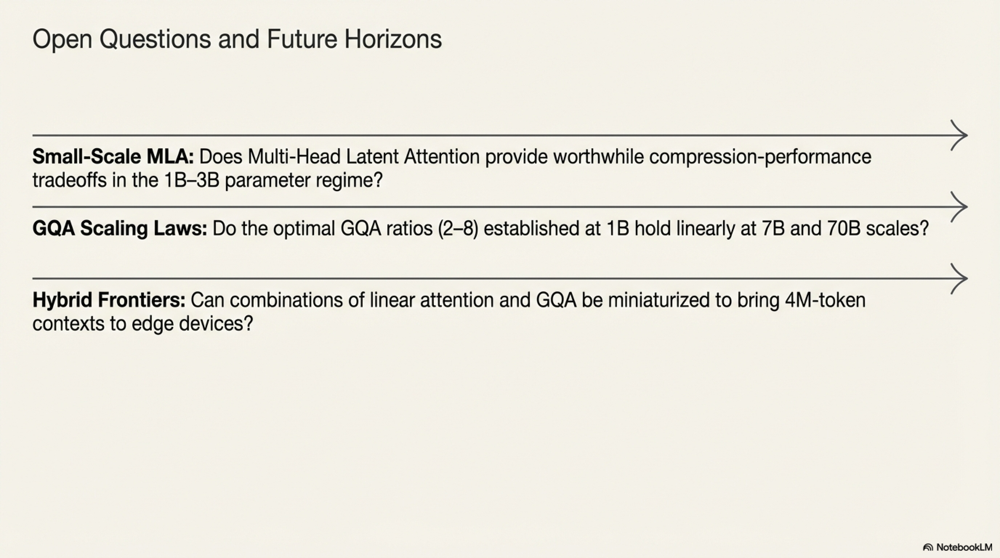

### 6.3 Open Questions and Future Directions

1. **MLA ablation at small scale**: The absence of a direct MLA ablation leaves open the question of whether MLA's compression-performance tradeoff holds at the $1$–$3\text{B}$ parameter regime, where the baseline KV cache is already manageable.

2. **Optimal GQA ratio as a function of scale**: The current ablation at $1\text{B}$ suggests ratios $2$–$8$ are equivalent. Whether this holds at $3\text{B}$, $7\text{B}$, and $70\text{B}$ requires scale-specific validation.

3. **Interaction between document masking and data mixture**: The document length distribution is data-dependent. The neutral impact of document masking observed here may not hold for corpora with systematically different length characteristics (e.g., book-length documents, dialogue data).

4. **Hybrid attention patterns**: Models like MiniMax-01 combine linear attention with GQA, potentially offering subquadratic scaling for ultra-long contexts ($4\text{M}$ tokens). The viability of such hybrids at smaller scales remains unexplored.

---

## References

- Ainslie, J., et al. (2023). GQA: Training Generalized Multi-Query Transformer Models from Multi-Head Checkpoints. *arXiv:2305.13245*.
- DeepSeek-AI, et al. (2024). DeepSeek-V2: A Strong, Economical, and Efficient Mixture-of-Experts Language Model. *arXiv:2405.04434*.
- Gao, T., et al. (2025). ProLong: Probing Long Context Language Models through Continual Pretraining. *arXiv*.
- Grattafiori, A., et al. (2024). The Llama 3 Herd of Models. *arXiv:2407.21783*.
- Shazeer, N. (2019). Fast Transformer Decoding: One Write-Head is All You Need. *arXiv:1911.02150*.
- Vaswani, A., et al. (2017). Attention Is All You Need. *NeurIPS 2017*.
- Zhao, Y., et al. (2024). How Does the Textual Information Affect the Retrieval of Multimodal In-Context Learning? *arXiv*.
- Zhu, B., et al. (2025). SkyLadder: Better and Faster Pretraining via Context Window Scheduling. *arXiv*.

---

*This technical report systematically documents the architectural design decisions for dense transformer-based language models, with SmolLM3 as the primary case study. All ablation experiments follow iso-parameter protocols on a standardized $1\text{B}$-parameter baseline trained on $45\text{B}$ tokens, ensuring reproducibility and fair comparison across architectural variants.*