# Training Stability Techniques in Large Language Model Pretraining: A Comprehensive Technical Report

---

## Table of Contents

1. [Introduction](#1-introduction)
2. [Taxonomy of Training Instabilities](#2-taxonomy-of-training-instabilities)
3. [Z-Loss Regularization](#3-z-loss-regularization)
4. [Removing Weight Decay from Embedding Parameters](#4-removing-weight-decay-from-embedding-parameters)
5. [QK-Norm: Query-Key Normalization](#5-qk-norm-query-key-normalization)
6. [Parameter Initialization Strategies](#6-parameter-initialization-strategies)
7. [Activation Functions in Modern LLMs](#7-activation-functions-in-modern-llms)
8. [Depth-Width Tradeoffs in Architectural Layout](#8-depth-width-tradeoffs-in-architectural-layout)
9. [Consolidated Architectural Decisions for SmolLM3](#9-consolidated-architectural-decisions-for-smollm3)
10. [References](#10-references)

---

## 1. Introduction


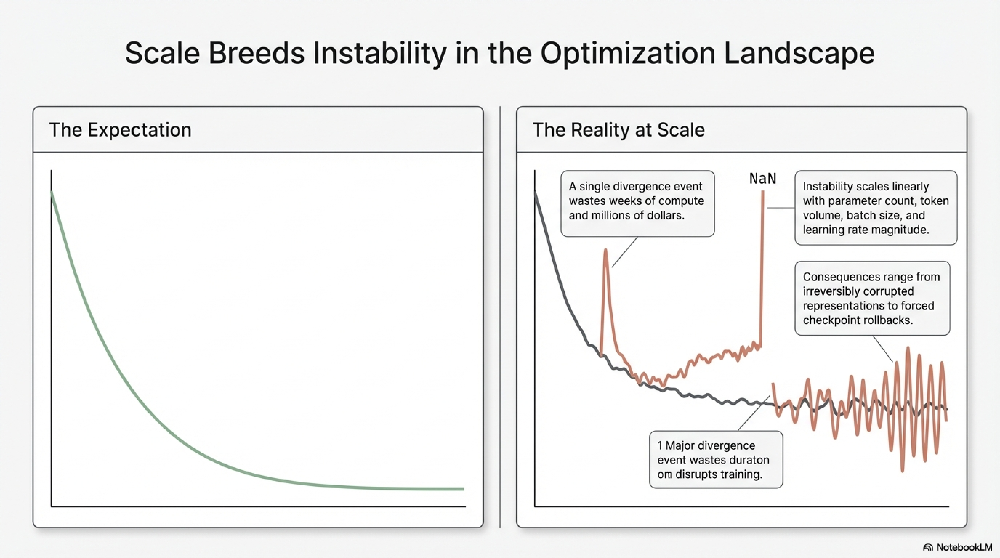

Training instability constitutes one of the most consequential and persistent challenges in large language model (LLM) pretraining. As model scale increases—measured in total parameter count, training token volume, batch size, and learning rate magnitude—the optimization landscape becomes increasingly susceptible to catastrophic perturbations. These instabilities commonly manifest as **loss spikes** (sudden, transient surges in the training loss), **divergence events** (irreversible escalation of loss to infinity), or **slow destabilization** (gradual degradation of gradient statistics leading to eventual collapse).

The consequences are severe: a single divergence event during a multi-month, multi-million-dollar pretraining run can waste weeks of compute, corrupt learned representations irreversibly, or force costly rollbacks to earlier checkpoints. Consequently, understanding, preventing, and mitigating training instabilities is a first-order engineering and scientific concern.

This report provides an end-to-end technical analysis of **architectural and regularization techniques** that improve training stability, drawing from empirical findings in recent large-scale training campaigns including OLMo 2 (OLMo et al., 2025), Qwen3 (A. Yang, Li, et al., 2025), PaLM (Chowdhery et al., 2022), and SmolLM3. Specifically, we examine:

- **Z-loss regularization:** Penalizing large output logits to maintain numerical stability in the softmax computation
- **Selective weight decay exclusion:** Removing weight decay from embedding parameters to prevent gradient amplification through layer normalization
- **QK-norm:** Applying layer normalization to query and key vectors to bound attention logit magnitudes, with analysis of its trade-offs for long-context performance
- **Parameter initialization strategies:** Truncated normal initialization and $\mu$P-based schemes
- **Activation function selection:** The convergence toward SwiGLU as the de facto standard
- **Depth-width architectural tradeoffs:** The interplay between model depth (number of layers) and width (hidden dimension) at fixed parameter budgets

Each technique is analyzed through formal mathematical derivation, mechanistic explanation of its stabilization effect, and empirical ablation evidence at 1B-parameter scale.

---


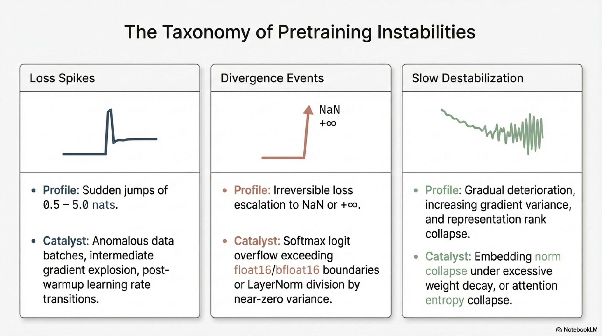

## 2. Taxonomy of Training Instabilities

Before examining individual stabilization techniques, it is essential to establish a precise classification of the instability phenomena they address. Training instabilities in LLMs can be categorized along multiple dimensions:


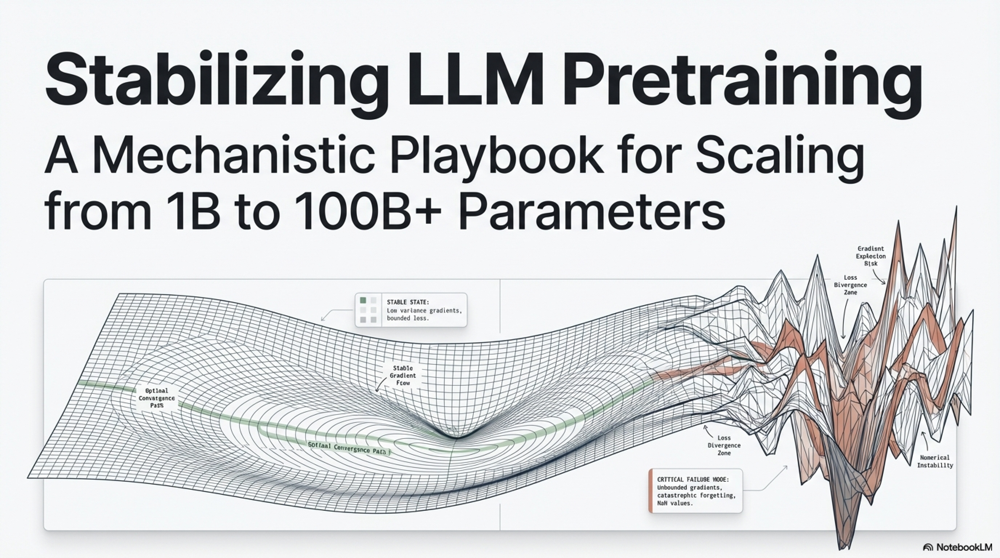

### 2.1 Loss Spikes

**Definition:** Abrupt, transient increases in training loss that may or may not recover to the pre-spike trajectory.

**Characteristics:**
- Typically manifest as sudden jumps of $0.5$–$5.0$ nats in cross-entropy loss within a few optimization steps
- More frequent at larger model scales (>10B parameters), higher learning rates, and during critical training phases (e.g., learning rate warmup completion)
- May be triggered by anomalous data batches, gradient explosion events, or numerical overflow in intermediate computations

### 2.2 Divergence Events

**Definition:** Irreversible escalation of the training loss, often to $\text{NaN}$ or $+\infty$, from which recovery is impossible without checkpoint rollback.

**Root causes include:**
- Overflow in softmax logits: when output logits $\mathbf{z} \in \mathbb{R}^{|V|}$ grow unbounded, $\exp(z_i)$ overflows in float16/bfloat16 representation
- Gradient explosion: $\|\nabla_\theta \mathcal{L}\| \to \infty$ due to multiplicative gradient propagation through deep networks
- Numerical instability in normalization operations: division by near-zero variance estimates in LayerNorm

### 2.3 Slow Destabilization

**Definition:** Gradual deterioration of optimization dynamics over extended training periods, characterized by increasing gradient norm variance, oscillating loss, or degraded downstream performance despite stable training loss.

**Mechanisms:**
- Embedding norm collapse under excessive weight decay
- Attention entropy collapse: attention distributions converging to near-deterministic patterns
- Representation rank collapse: effective dimensionality of hidden representations decreasing over training

### 2.4 Stabilization Strategy Classification

The techniques examined in this report target specific instability mechanisms:

| Technique | Target Instability | Mechanism of Action |
|-----------|-------------------|---------------------|
| Z-loss | Logit overflow, softmax instability | Regularizes output logit magnitude |
| WD exclusion for embeddings | Gradient amplification via LayerNorm | Prevents embedding norm shrinkage |
| QK-norm | Attention logit explosion | Bounds query-key dot product magnitude |
| Proper initialization | Early training divergence | Controls initial activation/gradient scales |
| SwiGLU activation | Dead neuron problems, gradient flow | Smooth, gated activation with favorable gradient properties |

---

## 3. Z-Loss Regularization


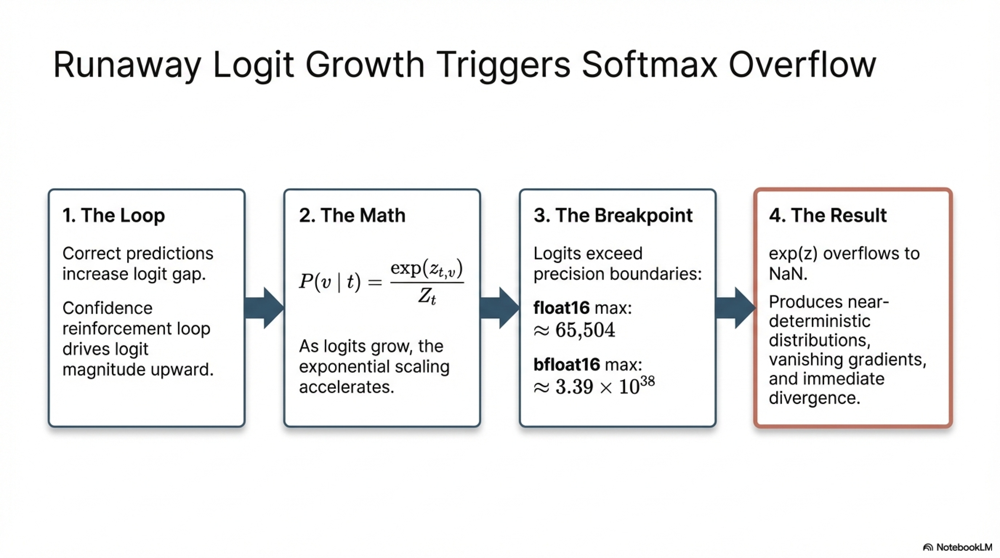

### 3.1 Problem Statement: Logit Magnitude Growth

In autoregressive language modeling, the model produces logit vectors $\mathbf{z}_t \in \mathbb{R}^{|V|}$ at each position $t$, which are converted to a probability distribution via the softmax function:

$$P(v \mid t) = \frac{\exp(z_{t,v})}{\sum_{j=1}^{|V|} \exp(z_{t,j})} = \frac{\exp(z_{t,v})}{Z_t}$$

where $Z_t = \sum_{j=1}^{|V|} \exp(z_{t,j})$ is the **partition function** (softmax denominator).

During training, the logit magnitudes $\|{\mathbf{z}_t}\|$ can grow progressively larger due to several mechanisms:

1. **Output projection weight growth:** The output projection matrix $\mathbf{W}_{\text{out}} \in \mathbb{R}^{d_{\text{model}} \times |V|}$ (or shared embedding matrix in tied configurations) may develop large-magnitude entries.
2. **Hidden state norm escalation:** As training progresses, the norms of the final-layer hidden states $\|\mathbf{h}_t^{(L)}\|$ can increase.
3. **Confidence reinforcement loop:** Correct predictions increase the logit gap between the target token and competitors, which, without regularization, creates a positive feedback loop driving logit magnitudes upward.

**Numerical consequence:** When individual logit values $z_{t,v}$ exceed the representable range of the training precision format (e.g., $\approx 65{,}504$ for float16, $\approx 3.39 \times 10^{38}$ for bfloat16), the exponential $\exp(z_{t,v})$ overflows, producing $\text{NaN}$ or $\text{Inf}$ values that propagate through the loss computation and gradient updates, causing immediate divergence.

Even below the overflow threshold, excessively large logits produce **near-deterministic softmax distributions** that yield:
- Very small gradient magnitudes for most vocabulary entries (vanishing gradient in the output layer)
- Numerical imprecision in the log-softmax computation: $\log P(v \mid t) = z_{t,v} - \log Z_t$ involves subtracting two very large numbers, amplifying floating-point rounding errors

### 3.2 Z-Loss Formulation

**Z-loss** (Chowdhery et al., 2022), introduced in the PaLM training campaign, addresses logit magnitude growth by adding an auxiliary penalty term to the standard cross-entropy loss:

$$\mathcal{L}_{\text{z-loss}} = \lambda_z \cdot \log^2(Z_t)$$

where:
- $Z_t = \sum_{j=1}^{|V|} \exp(z_{t,j})$ is the softmax partition function at position $t$
- $\lambda_z$ is the Z-loss coefficient (hyperparameter controlling regularization strength; typically $\lambda_z \in [10^{-4}, 10^{-3}]$)
- $\log^2(Z_t) = [\log(Z_t)]^2$ denotes the square of the log-partition function

The total training objective becomes:

$$\mathcal{L}_{\text{total}} = \mathcal{L}_{\text{CE}} + \mathcal{L}_{\text{z-loss}} = -\log P(t^* \mid t) + \lambda_z \cdot \log^2(Z_t)$$

where $t^*$ is the ground-truth next token.

### 3.3 Gradient Analysis

To understand Z-loss's stabilization mechanism, consider its gradient with respect to a single logit $z_{t,v}$:

$$\frac{\partial \mathcal{L}_{\text{z-loss}}}{\partial z_{t,v}} = \lambda_z \cdot 2 \log(Z_t) \cdot \frac{1}{Z_t} \cdot \frac{\partial Z_t}{\partial z_{t,v}}$$

Since $\frac{\partial Z_t}{\partial z_{t,v}} = \exp(z_{t,v})$:

$$\frac{\partial \mathcal{L}_{\text{z-loss}}}{\partial z_{t,v}} = 2 \lambda_z \cdot \log(Z_t) \cdot \frac{\exp(z_{t,v})}{Z_t} = 2 \lambda_z \cdot \log(Z_t) \cdot P(v \mid t)$$

**Key properties of this gradient:**

1. **Proportional to $\log(Z_t)$:** When the partition function is well-behaved (close to $|V|$ for uniform distributions, or moderate values), the gradient is small. As logits grow and $Z_t$ increases dramatically, the gradient magnitude scales logarithmically, providing increasing pushback.

2. **Weighted by softmax probability:** The gradient is largest for tokens with high predicted probability (large logits), applying the strongest regularization pressure precisely where it is needed.

3. **Symmetric regularization:** The penalty applies to all logits proportionally to their softmax weight, preventing any individual logit from dominating without suppressing the model's ability to make confident predictions at moderate logit scales.

### 3.4 Mechanistic Interpretation

Z-loss can be interpreted through the lens of **entropy regularization**. The log-partition function $\log Z_t$ is closely related to the free energy of the softmax distribution. By penalizing $\log^2(Z_t)$, Z-loss implicitly encourages the softmax temperature to remain bounded, preventing the effective temperature from approaching zero (which would correspond to a deterministic, unstable distribution).

An equivalent interpretation: Z-loss regularizes the **logsumexp** of the logits:

$$\text{logsumexp}(\mathbf{z}_t) = \log \sum_{j=1}^{|V|} \exp(z_{t,j}) = \log Z_t$$

The squared penalty $[\text{logsumexp}(\mathbf{z}_t)]^2$ acts as a soft constraint that the logsumexp remains within a bounded range, which directly implies bounded logit magnitudes.


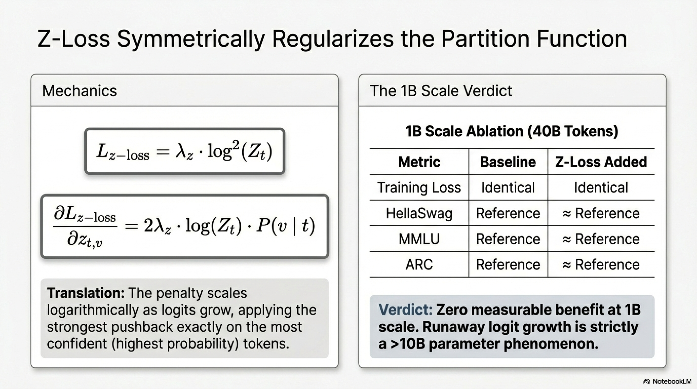

### 3.5 Ablation Results at 1B Scale

#### 3.5.1 Experimental Setup

Two configurations were trained on identical data for 40B tokens:

| Configuration | Z-loss Coefficient $\lambda_z$ | Other Hyperparameters |
|--------------|-------------------------------|----------------------|
| **Baseline** | $0$ (no Z-loss) | Standard |
| **With Z-loss** | $\lambda_z > 0$ (as per PaLM) | Standard |

#### 3.5.2 Results Summary

**Training loss:** The two configurations produced **virtually identical** loss curves throughout the 40B-token training run, with no measurable divergence.

**Downstream benchmarks:**

| Benchmark | No Z-loss (Baseline) | With Z-loss |
|-----------|---------------------|-------------|
| HellaSwag | Reference | $\approx$ Reference |
| MMLU | Reference | $\approx$ Reference |
| ARC | Reference | $\approx$ Reference |
| PIQA | Reference | $\approx$ Reference |
| OpenBookQA | Reference | $\approx$ Reference |
| WinoGrande | Reference | $\approx$ Reference |

#### 3.5.3 Interpretation

At 1B-parameter scale, Z-loss provides **no measurable benefit** to either training loss or downstream evaluation performance. This is consistent with the observation that logit instabilities are primarily a large-scale phenomenon: models at 1B scale are less susceptible to the runaway logit growth that Z-loss is designed to prevent.

**SmolLM3 decision:** Z-loss was **not adopted** for SmolLM3-3B. The implementation introduced non-trivial training throughput overhead (additional forward pass computations for the penalty term), and the overhead had not been optimized by the time the production training run commenced. Given the absence of measurable benefit at the ablation scale, the cost-benefit analysis did not justify inclusion.

**Caveat:** This decision should not be extrapolated to larger-scale training. PaLM (540B), which originally introduced Z-loss, demonstrated its necessity for preventing divergence at that scale. Models exceeding $\sim$10B parameters, or those trained with aggressive learning rate schedules, may derive substantial stability benefits from Z-loss.

### 3.6 Relationship to Other Logit Regularization Techniques

Z-loss belongs to a family of output regularization methods:

| Method | Regularization Target | Formulation |
|--------|----------------------|-------------|
| **Z-loss** | Log-partition function magnitude | $\lambda \cdot \log^2(Z)$ |
| **Label smoothing** | Softmax distribution sharpness | Cross-entropy with smoothed target $\tilde{y}_v = (1-\epsilon) \cdot y_v + \epsilon / |V|$ |
| **Logit clipping** | Maximum logit value | $z_v \leftarrow \text{clamp}(z_v, -C, C)$ |
| **Output norm penalty** | Logit vector norm | $\lambda \cdot \|\mathbf{z}\|_2^2$ |
| **Entropy bonus** | Softmax entropy | $-\lambda \cdot H(P)$ where $H(P) = -\sum_v P(v) \log P(v)$ |

Z-loss is preferred over logit clipping because it provides **smooth gradients** (no gradient discontinuity at the clipping boundary). It is preferred over direct $L_2$ logit regularization because it penalizes the **collective** logit scale rather than individual logit magnitudes, preserving the relative logit structure that encodes the model's confidence ranking over vocabulary items.

---

## 4. Removing Weight Decay from Embedding Parameters

### 4.1 Standard Weight Decay in LLM Training

Weight decay is a regularization technique that adds a penalty proportional to the squared $L_2$ norm of model parameters to the optimization objective. In its decoupled form (as implemented in AdamW (Loshchilov & Hutter, 2019)), weight decay is applied directly to the parameter update rather than through the loss gradient:

$$\theta_{t+1} = \theta_t - \eta \left( \hat{m}_t / (\sqrt{\hat{v}_t} + \epsilon) + \lambda_{\text{wd}} \cdot \theta_t \right)$$

where:
- $\eta$ is the learning rate
- $\hat{m}_t, \hat{v}_t$ are the bias-corrected first and second moment estimates from Adam
- $\lambda_{\text{wd}}$ is the weight decay coefficient (typically $\lambda_{\text{wd}} \in [0.01, 0.1]$)

Standard practice applies weight decay uniformly to **all learnable parameters**, including embedding matrices, projection weights, and (sometimes) bias terms.

### 4.2 The Embedding Norm Collapse Problem

OLMo et al. (2025) identified that applying weight decay to embedding parameters introduces a specific instability mechanism related to the interaction between **embedding norms** and **layer normalization**.

#### 4.2.1 Mechanism: Norm Shrinkage Under Weight Decay

Weight decay continuously shrinks parameter magnitudes toward zero at a rate proportional to $\lambda_{\text{wd}}$. For the embedding matrix $\mathbf{W}_{\text{embed}} \in \mathbb{R}^{|V| \times d_{\text{model}}}$, this causes a gradual decrease in the norms of individual embedding vectors:

$$\|\mathbf{e}_v\|_2 \to 0 \quad \text{as training progresses}$$

where $\mathbf{e}_v = \mathbf{W}_{\text{embed}}[v, :] \in \mathbb{R}^{d_{\text{model}}}$ is the embedding vector for token $v$.

#### 4.2.2 Gradient Amplification Through Layer Normalization

The first operation applied to token embeddings in modern transformers is **layer normalization** (or RMSNorm). Consider the standard LayerNorm formulation applied to an input $\mathbf{x} \in \mathbb{R}^{d}$:

$$\text{LayerNorm}(\mathbf{x}) = \gamma \odot \frac{\mathbf{x} - \mu}{\sigma + \epsilon}$$

where $\mu = \frac{1}{d}\sum_i x_i$ and $\sigma = \sqrt{\frac{1}{d}\sum_i (x_i - \mu)^2}$.

The **Jacobian** of LayerNorm with respect to its input $\mathbf{x}$ has entries that scale as:

$$\frac{\partial \text{LayerNorm}(\mathbf{x})_i}{\partial x_j} \propto \frac{1}{\sigma}$$

Since $\sigma \propto \|\mathbf{x}\|_2$ for centered vectors, the Jacobian magnitude scales as:

$$\left\| \frac{\partial \text{LayerNorm}(\mathbf{x})}{\partial \mathbf{x}} \right\| \propto \frac{1}{\|\mathbf{x}\|_2}$$


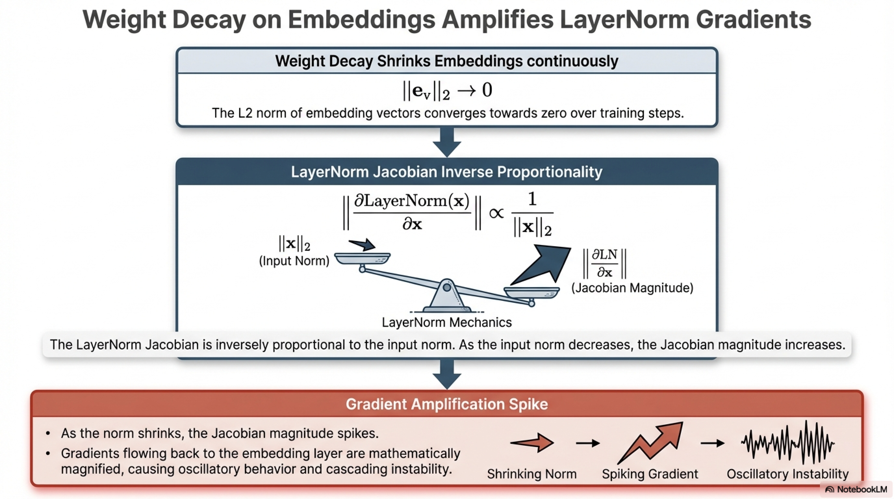

**Critical consequence:** As weight decay shrinks embedding norms ($\|\mathbf{e}_v\|_2 \to 0$), the LayerNorm Jacobian grows **inversely proportional** to the input norm:

$$\|\mathbf{e}_v\|_2 \downarrow \quad \Rightarrow \quad \left\| \frac{\partial \text{LayerNorm}}{\partial \mathbf{e}_v} \right\| \uparrow$$

This creates a **gradient amplification effect** in the early layers of the network. Gradients flowing back through LayerNorm to the embedding layer are magnified by a factor inversely proportional to the embedding norm, which itself is being continuously shrunk by weight decay. This positive feedback loop can lead to:

1. Increasingly large gradient updates to the embedding matrix
2. Oscillatory behavior in embedding parameters
3. Cascading instability through early transformer layers

#### 4.2.3 Formal Analysis with RMSNorm

For RMSNorm (the variant used in most modern LLMs), the analysis is even more direct. RMSNorm computes:

$$\text{RMSNorm}(\mathbf{x}) = \gamma \odot \frac{\mathbf{x}}{\text{RMS}(\mathbf{x})} \quad \text{where} \quad \text{RMS}(\mathbf{x}) = \sqrt{\frac{1}{d}\sum_{i=1}^{d} x_i^2} = \frac{\|\mathbf{x}\|_2}{\sqrt{d}}$$

The normalized output is:

$$\text{RMSNorm}(\mathbf{x}) = \gamma \odot \frac{\sqrt{d} \cdot \mathbf{x}}{\|\mathbf{x}\|_2}$$

Since RMSNorm projects $\mathbf{x}$ onto the unit sphere (scaled by $\gamma$ and $\sqrt{d}$), the **direction** of the embedding is preserved but the **magnitude** is discarded. Consequently, the forward pass output of RMSNorm is invariant to scaling $\|\mathbf{x}\|_2$ — but the backward pass gradient is not:

$$\frac{\partial \mathcal{L}}{\partial \mathbf{x}} = \frac{\sqrt{d}}{\|\mathbf{x}\|_2} \left( \mathbf{I} - \frac{\mathbf{x}\mathbf{x}^{\top}}{\|\mathbf{x}\|_2^2} \right) \text{diag}(\gamma) \cdot \frac{\partial \mathcal{L}}{\partial \text{RMSNorm}(\mathbf{x})}$$

The leading factor $\frac{\sqrt{d}}{\|\mathbf{x}\|_2}$ explicitly shows that **gradient magnitude is inversely proportional to input norm** (Takase et al., 2025). Weight decay applied to embeddings systematically reduces $\|\mathbf{x}\|_2$, which amplifies gradients through the normalization layer — a direct source of training instability.

### 4.3 Solution: Selective Weight Decay Exclusion

The remedy is straightforward: **exclude embedding parameters** from the weight decay regularization while retaining weight decay for all other model parameters:

$$\theta_{t+1} = \begin{cases} \theta_t - \eta \cdot \hat{m}_t / (\sqrt{\hat{v}_t} + \epsilon) & \text{if } \theta \in \{\mathbf{W}_{\text{embed}}\} \\ \theta_t - \eta \left( \hat{m}_t / (\sqrt{\hat{v}_t} + \epsilon) + \lambda_{\text{wd}} \cdot \theta_t \right) & \text{otherwise} \end{cases}$$

This is commonly implemented by partitioning model parameters into two optimizer groups with different weight decay coefficients:

```python
# Partition parameters for differential weight decay
no_decay_params = []
decay_params = []

for name, param in model.named_parameters():
    if "embed" in name or "layernorm" in name or "bias" in name:
        no_decay_params.append(param)  # Weight decay = 0
    else:
        decay_params.append(param)     # Weight decay = λ_wd

optimizer = torch.optim.AdamW([
    {"params": decay_params, "weight_decay": weight_decay},
    {"params": no_decay_params, "weight_decay": 0.0},
], lr=learning_rate, betas=(beta1, beta2), eps=adam_epsilon)
```

**Note:** It is common practice to also exclude **LayerNorm/RMSNorm parameters** ($\gamma$ and, if present, $\beta$) and **bias terms** from weight decay, as these parameters have different scaling semantics than weight matrices.

### 4.4 Ablation Results at 1B Scale

#### 4.4.1 Experimental Design

Three configurations were evaluated to assess both the individual effect of weight decay removal from embeddings and the combined effect with other adopted architectural changes:

| Configuration | Weight Decay on Embeddings | NoPE | Document Masking |
|--------------|---------------------------|------|-----------------|
| **Baseline** | Yes ($\lambda_{\text{wd}} > 0$) | No (pure RoPE) | No |
| **No WD on Embeddings** | No ($\lambda_{\text{wd}} = 0$) | No (pure RoPE) | No |
| **No WD + NoPE + Doc Masking** | No ($\lambda_{\text{wd}} = 0$) | Yes | Yes |

All configurations trained for 40B tokens on identical data.

#### 4.4.2 Results Summary

**Training loss at 7.2B tokens consumed:**


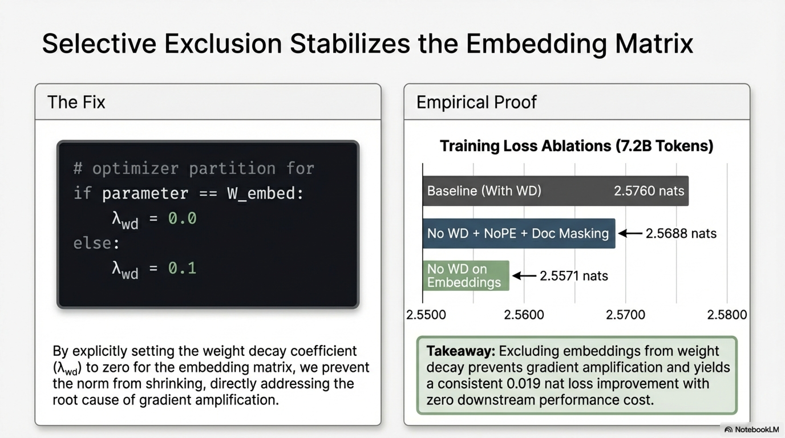

| Configuration | Training Loss |
|--------------|---------------|
| No Weight Decay on Embeddings | $2.5571$ |
| No WD + NoPE + Doc Masking | $2.5688$ |
| Baseline (With Weight Decay) | $2.5760$ |

**Observation:** The configuration excluding weight decay from embeddings achieved the lowest training loss, with a modest but consistent improvement of approximately $0.019$ nats over the baseline. The combined configuration (No WD + NoPE + Doc Masking) achieved intermediate loss, confirming **no negative interactions** between the three techniques.

**Downstream benchmarks:** All three configurations produced **nearly identical** evaluation scores across HellaSwag, MMLU, ARC, PIQA, OpenBookQA, and WinoGrande throughout 40B tokens of training.

#### 4.4.3 Interpretation and Decision

The ablation confirms that excluding embeddings from weight decay produces a slight stability and loss improvement without degrading any downstream metric. Critically, the **combined configuration** (no weight decay on embeddings + NoPE + document masking) demonstrates that these three techniques are **compositionally compatible** — their individual benefits combine without interference.

**SmolLM3 decision:** All three techniques were adopted for production training:
1. No weight decay on embedding parameters
2. Hybrid NoPE (RoPE every 4th layer)
3. Document masking

---

## 5. QK-Norm: Query-Key Normalization

### 5.1 Formulation

QK-norm (Dehghani et al., 2023) applies **layer normalization** (or RMSNorm) to both the query and key vectors **before** computing the attention dot product:

$$\hat{\mathbf{q}}_t^{(h)} = \text{Norm}\!\left(\mathbf{q}_t^{(h)}\right), \qquad \hat{\mathbf{k}}_i^{(h)} = \text{Norm}\!\left(\mathbf{k}_i^{(h)}\right)$$

The attention score with QK-norm becomes:

$$a_{t,i}^{(h)} = \frac{\hat{\mathbf{q}}_t^{(h)\top} \hat{\mathbf{k}}_i^{(h)}}{\sqrt{d_k}}$$

Without QK-norm, the standard formulation is:

$$a_{t,i}^{(h)} = \frac{\mathbf{q}_t^{(h)\top} \mathbf{k}_i^{(h)}}{\sqrt{d_k}}$$

### 5.2 Stabilization Mechanism

The dot product $\mathbf{q}^{\top}\mathbf{k}$ can grow unboundedly as the norms $\|\mathbf{q}\|$ and $\|\mathbf{k}\|$ increase during training. The magnitude of the unnormalized dot product is:

$$|\mathbf{q}^{\top}\mathbf{k}| \leq \|\mathbf{q}\|_2 \cdot \|\mathbf{k}\|_2$$

Without QK-norm, even with the $\sqrt{d_k}$ scaling factor, this upper bound can grow as the query and key projection weights develop large norms. When attention logits become very large, the softmax produces near-one-hot distributions, which leads to:


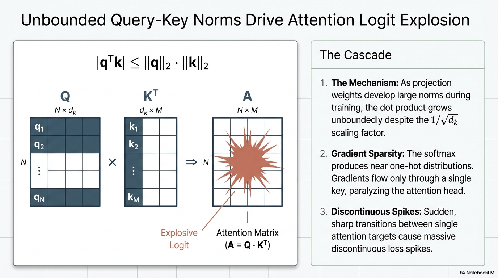

1. **Gradient sparsity:** Gradients flow through only one or very few key positions
2. **Numerical instability:** $\exp(\text{large logit})$ can overflow in low-precision formats
3. **Loss spikes:** Sudden transitions between attention targets cause discontinuous loss changes

QK-norm resolves this by ensuring that both query and key vectors are **projected onto the unit sphere** (modulo the learnable scale $\gamma$), bounding the dot product:

$$|\hat{\mathbf{q}}^{\top}\hat{\mathbf{k}}| \leq \|\hat{\mathbf{q}}\|_2 \cdot \|\hat{\mathbf{k}}\|_2 = 1 \cdot 1 = 1$$


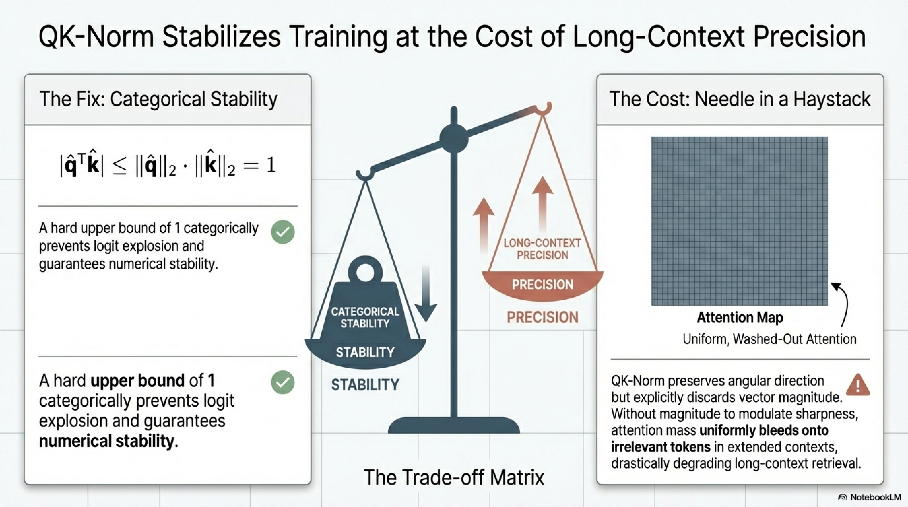

(when using RMSNorm with $\gamma = 1$). This provides a **hard upper bound** on attention logit magnitude, categorically preventing the logit explosion failure mode.

### 5.3 Impact on Attention Dynamics

The normalization operation can be decomposed into two effects:

1. **Direction preservation:** The unit direction $\hat{\mathbf{q}} / \|\hat{\mathbf{q}}\|$ is preserved, maintaining the angular selectivity of attention
2. **Magnitude removal:** The norm $\|\mathbf{q}\|$ is discarded, eliminating the model's ability to use query/key magnitude as a signal

The second effect is significant: in standard (non-normalized) attention, the model can use **query magnitude** to modulate attention sharpness. A query with large norm produces sharper (more peaked) attention distributions; a query with small norm produces more uniform distributions. QK-norm eliminates this degree of freedom.

### 5.4 Long-Context Performance Degradation

B. Yang et al. (2025) conducted a detailed analysis of QK-norm's impact on long-context tasks, revealing a significant trade-off:

#### 5.4.1 Empirical Findings

On challenging long-context benchmarks (beyond simple needle-in-a-haystack retrieval), models trained with QK-norm exhibited:

- **Lower attention mass on relevant tokens ("needles"):** The model's ability to concentrate attention on the critical information within a long context was diminished
- **Higher attention mass on irrelevant context:** Attention was more uniformly distributed across all tokens, including those carrying no relevant information

#### 5.4.2 Mechanistic Explanation

The degradation arises because QK-norm **removes magnitude information** from the query-key dot product, making attention logits **closer in magnitude**. In mathematical terms:

Without QK-norm, the attention logit between a query $\mathbf{q}$ and a relevant key $\mathbf{k}_{\text{rel}}$ versus an irrelevant key $\mathbf{k}_{\text{irrel}}$ is:

$$\Delta a = \frac{\mathbf{q}^{\top}\mathbf{k}_{\text{rel}} - \mathbf{q}^{\top}\mathbf{k}_{\text{irrel}}}{\sqrt{d_k}}$$

The magnitude of this logit gap depends on both the **directional alignment** and the **norms** of the vectors:

$$\Delta a \propto \|\mathbf{q}\| \cdot \left(\|\mathbf{k}_{\text{rel}}\| \cos\alpha_{\text{rel}} - \|\mathbf{k}_{\text{irrel}}\| \cos\alpha_{\text{irrel}}\right)$$

where $\alpha_{\text{rel}}$ and $\alpha_{\text{irrel}}$ are the angles between the query and the respective keys.

With QK-norm, the norms are stripped away:

$$\Delta a_{\text{QK}} \propto \cos\alpha_{\text{rel}} - \cos\alpha_{\text{irrel}}$$

The model can only use **angular separation** to distinguish relevant from irrelevant keys, losing the amplification effect of large norms. In long contexts with many competing keys, this reduced discrimination power makes it harder to identify and retrieve relevant information.

#### 5.4.3 The Fundamental Trade-off

| Property | Without QK-Norm | With QK-Norm |
|----------|-----------------|--------------|
| Attention logit bound | Unbounded | Bounded by $\sim 1$ |
| Training stability | Risk of logit explosion | Stable |
| Attention selectivity | High (magnitude + direction) | Reduced (direction only) |
| Long-context retrieval | Strong discrimination | Degraded discrimination |
| Short-context performance | Standard | Standard |

### 5.5 Decision for SmolLM3

QK-norm was **not adopted** for SmolLM3 based on two considerations:

1. **Long-context performance:** The empirical evidence from B. Yang et al. (2025) demonstrates measurable degradation on long-context tasks, which conflicts with SmolLM3's design goal of supporting extended context windows via hybrid NoPE.

2. **Scale-dependent risk:** At 3B parameters, the risk of training instability from attention logit explosion is substantially lower than at the 10B+ scales where QK-norm provides its most significant stability benefits. The model's reduced depth and width naturally constrain the growth rate of query/key norms.

**Recommendation for larger models:** QK-norm remains highly recommended for models exceeding $\sim$10B parameters, particularly those trained with aggressive learning rate schedules or mixed-precision (float16) training where the overflow threshold is lower. In such regimes, the stability benefit outweighs the long-context performance trade-off. Alternative approaches that preserve magnitude information while bounding logits—such as **capped attention** (applying $\tanh$ scaling to logits) or **softcapping** (as in Gemma 2)—may offer a better balance.

---

## 6. Parameter Initialization Strategies

### 6.1 Importance of Initialization

Parameter initialization determines the **initial distribution of activations and gradients** throughout the network. Poor initialization can cause:

- **Activation explosion/collapse:** If initial weights are too large, activations grow exponentially through layers; if too small, they vanish
- **Gradient pathologies:** Forward activation scaling issues produce corresponding backward gradient scaling issues via the chain rule
- **Symmetry breaking failures:** Insufficient randomness in initialization can prevent the model from utilizing its full capacity
- **Early training divergence:** Extreme initial logit values can cause immediate loss spikes or overflow


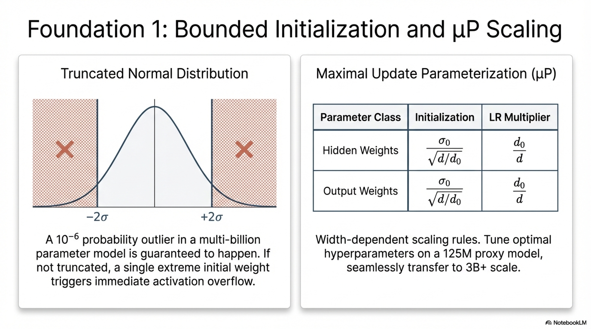

### 6.2 Truncated Normal Initialization

The most common initialization strategy in modern LLMs uses a **truncated normal distribution**:

$$W_{ij} \sim \text{TruncatedNormal}(\mu=0, \sigma, a=-2\sigma, b=2\sigma)$$

where:
- $\mu = 0$: zero mean ensures no systematic bias in initial activations
- $\sigma$: standard deviation controlling the initial scale (typically $\sigma \in \{0.006, 0.02\}$)
- $a, b$: truncation bounds (typically at $\pm 2\sigma$) that eliminate extreme outlier initializations

The truncation is critical for preventing rare but catastrophic large-weight initializations that could cause immediate activation overflow. For a model with millions of parameters, even a $10^{-6}$ probability event will occur multiple times, and a single extreme initial weight can produce a chain of exploding activations.

**Common standard deviations:**

| $\sigma$ Value | Usage Context | Rationale |
|---------------|---------------|-----------|
| $0.02$ | General-purpose, follows GPT-2 convention | Empirically stable for models up to $\sim$1B |
| $0.006$ | Larger models, narrower initialization | Reduces initial activation variance for deeper networks |
| $\sqrt{2 / (d_{\text{in}} + d_{\text{out}})}$ | Xavier/Glorot initialization (adapted) | Theoretically preserves activation variance across layers |

### 6.3 $\mu$P (Maximal Update Parameterization)

$\mu$P (G. Yang & Hu, 2022) is a principled initialization and learning rate scaling scheme derived from the theory of **tensor programs**. It provides a parameterization under which the optimal hyperparameters (learning rate, initialization scale) transfer across model widths, enabling hyperparameter tuning on small proxy models with direct applicability to large target models.

#### 6.3.1 Core Principle

In standard parameterization (SP), the optimal learning rate changes as model width $d$ varies. $\mu$P derives width-dependent scaling rules for:

1. **Initialization:** Each parameter class is initialized with width-dependent standard deviation
2. **Learning rate:** Per-layer learning rate multipliers that depend on the layer's width
3. **Output scaling:** The output logits are scaled by a width-dependent factor

The key scaling rules (for a model of width $d$, relative to a reference width $d_0$):

| Parameter Class | Initialization $\sigma$ | Learning Rate Multiplier |
|----------------|------------------------|--------------------------|
| Embedding ($\mathbf{W}_{\text{embed}}$) | $\sigma_0$ | $1$ |
| Hidden weights ($\mathbf{W}_{\text{hidden}}$) | $\sigma_0 / \sqrt{d/d_0}$ | $d_0 / d$ |
| Output projection ($\mathbf{W}_{\text{output}}$) | $\sigma_0 / \sqrt{d/d_0}$ | $d_0 / d$ |

where $\sigma_0$ is the base standard deviation and $d_0$ is the reference width.

#### 6.3.2 Practical Benefit

$\mu$P enables a powerful workflow: tune hyperparameters on a small model (e.g., 125M parameters), then directly transfer those hyperparameters to the full-scale model (e.g., 3B parameters) with confidence that they remain near-optimal. This can save significant compute that would otherwise be spent on hyperparameter search at scale.

**Adoption:** Cohere's Command A (Cohere et al., 2025) uses $\mu$P-based initialization.

### 6.4 Layer-Dependent Output Scaling

An additional initialization refinement applies a **depth-dependent scaling factor** to the output projections of each residual block. For a model with $L$ layers, the output of the attention and MLP sub-layers in layer $\ell$ is scaled by:

$$\mathbf{h}^{(\ell)} = \mathbf{h}^{(\ell-1)} + \frac{1}{\sqrt{2L}} \cdot f^{(\ell)}(\mathbf{h}^{(\ell-1)})$$

This scaling factor $1/\sqrt{2L}$ (the factor of 2 accounts for two residual connections per layer: one for attention, one for MLP) ensures that the variance of the residual stream grows at a controlled rate, preventing activation explosion in deep networks.

---

## 7. Activation Functions in Modern LLMs

### 7.1 Evolution of Activation Functions

The choice of activation function in the feed-forward network (FFN) of transformer layers has converged toward **gated** variants that provide superior gradient flow and representational capacity:

| Activation | Formulation | Usage |
|-----------|-------------|-------|
| **ReLU** | $\text{ReLU}(x) = \max(0, x)$ | Original Transformer, early models |
| **GELU** | $\text{GELU}(x) = x \cdot \Phi(x)$ where $\Phi$ is the standard Gaussian CDF | GPT-2, BERT |
| **SwiGLU** | See Section 7.2 | Llama, Qwen, SmolLM3, most modern LLMs |
| **GeGLU** | $\text{GeGLU}(\mathbf{x}, \mathbf{W}_1, \mathbf{W}_2) = \text{GELU}(\mathbf{x}\mathbf{W}_1) \odot (\mathbf{x}\mathbf{W}_2)$ | Gemma 2 |
| **ReLU²** | $\text{ReLU}^2(x) = [\max(0, x)]^2$ | NVIDIA models (Nemotron) |

### 7.2 SwiGLU: The De Facto Standard

SwiGLU (Shazeer, 2020) combines the **Swish** activation (also known as SiLU) with a **Gated Linear Unit** (GLU) architecture:

$$\text{SwiGLU}(\mathbf{x}) = \text{Swish}(\mathbf{x}\mathbf{W}_{\text{gate}}) \odot (\mathbf{x}\mathbf{W}_{\text{up}})$$

where:
- $\mathbf{W}_{\text{gate}} \in \mathbb{R}^{d_{\text{model}} \times d_{\text{ff}}}$ is the gate projection
- $\mathbf{W}_{\text{up}} \in \mathbb{R}^{d_{\text{model}} \times d_{\text{ff}}}$ is the up projection
- $\text{Swish}(x) = x \cdot \sigma(x) = \frac{x}{1 + e^{-x}}$ is the Swish/SiLU activation
- $\odot$ denotes element-wise multiplication

The complete FFN block with SwiGLU is:

$$\text{FFN}(\mathbf{x}) = \left[\text{Swish}(\mathbf{x}\mathbf{W}_{\text{gate}}) \odot (\mathbf{x}\mathbf{W}_{\text{up}})\right] \mathbf{W}_{\text{down}}$$

where $\mathbf{W}_{\text{down}} \in \mathbb{R}^{d_{\text{ff}} \times d_{\text{model}}}$ is the down projection.

**Parameter count:** SwiGLU uses **three** projection matrices instead of two (compared to the standard FFN with ReLU/GELU), increasing the FFN parameter count by 50% for a given $d_{\text{ff}}$. To maintain the total parameter budget, models using SwiGLU typically set:

$$d_{\text{ff}} = \frac{8}{3} \cdot d_{\text{model}} \approx 2.67 \cdot d_{\text{model}}$$

instead of the standard $d_{\text{ff}} = 4 \cdot d_{\text{model}}$, yielding approximately the same total FFN parameters:

$$3 \times d_{\text{model}} \times \frac{8}{3} d_{\text{model}} = 8 \, d_{\text{model}}^2 \approx 2 \times d_{\text{model}} \times 4 \, d_{\text{model}} = 8 \, d_{\text{model}}^2$$

### 7.3 Stability Properties of SwiGLU

SwiGLU provides several stability advantages:


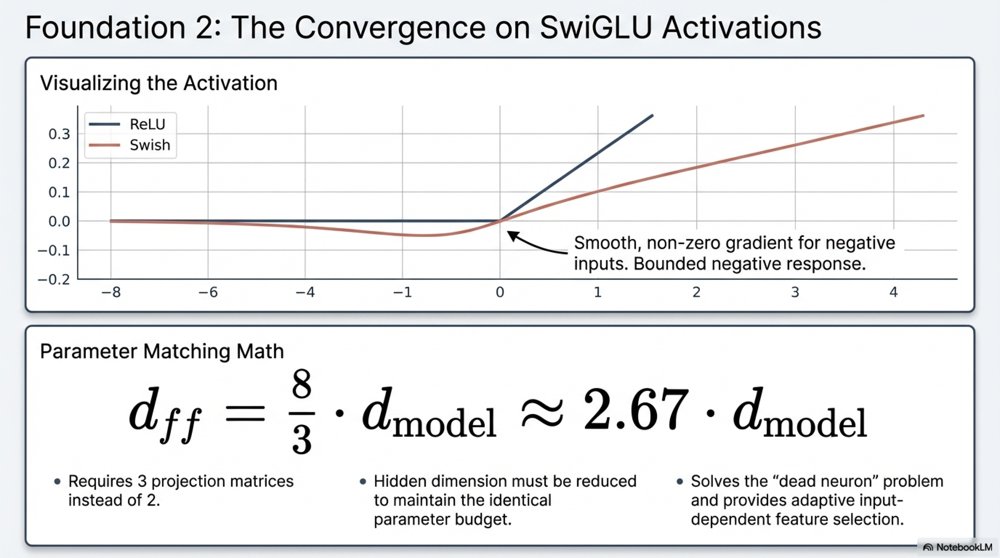

1. **Smooth gradients:** Unlike ReLU, which has a discontinuous gradient at $x=0$, Swish is infinitely differentiable, providing smooth gradient flow
2. **Non-zero gradients for negative inputs:** $\text{Swish}(x) \neq 0$ for $x < 0$ (unlike ReLU), mitigating the "dead neuron" problem
3. **Gating mechanism:** The element-wise multiplication with the gate output provides an adaptive, input-dependent feature selection mechanism that regularizes information flow through the FFN
4. **Bounded negative response:** For $x \ll 0$, $\text{Swish}(x) \to 0$, preventing large negative activations from propagating

---


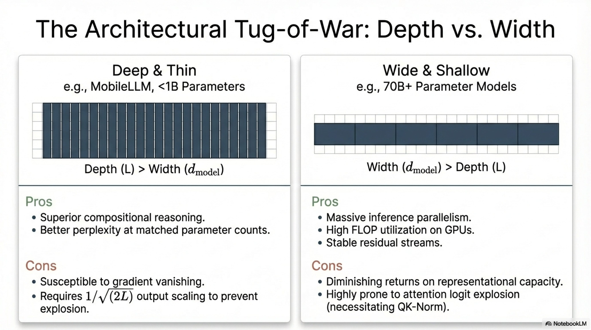

## 8. Depth-Width Tradeoffs in Architectural Layout

### 8.1 Problem Statement

For a fixed total parameter budget $P_{\text{total}}$, the architect must choose the allocation between:

- **Depth** ($L$): Number of transformer layers
- **Width** ($d_{\text{model}}$): Hidden dimension (and proportionally, $d_{\text{ff}}$, number of attention heads)

Since the dominant parameter contribution comes from attention and FFN layers (each contributing $\mathcal{O}(d_{\text{model}}^2)$ parameters per layer), the approximate total non-embedding parameter count scales as:

$$P_{\text{layers}} \approx L \cdot \left(4 d_{\text{model}}^2 + 3 \cdot d_{\text{model}} \cdot d_{\text{ff}}\right) \approx L \cdot 12 \, d_{\text{model}}^2$$

(for standard MHA with $d_{\text{ff}} = \frac{8}{3} d_{\text{model}}$ and SwiGLU). At fixed $P_{\text{layers}}$, increasing $L$ requires decreasing $d_{\text{model}}$ (deeper and narrower), and vice versa.

### 8.2 Empirical Findings

#### 8.2.1 Depth Advantage

Petty et al. (2024) conducted systematic comparisons of architectures at matched parameter counts, varying the depth-width ratio. Key findings:

- **Deeper models outperform equally-sized wider ones** on language modeling perplexity and compositional generalization tasks
- The benefit of additional depth exhibits **diminishing returns** beyond a model-size-dependent saturation point
- The compositional reasoning advantage of depth is consistent with theoretical analyses suggesting that depth enables the computation of more complex functions than width alone (circuit complexity arguments)

#### 8.2.2 The "Deep and Thin" Strategy

MobileLLM (Z. Liu et al., 2024) validated the deep-and-thin approach specifically for sub-billion-parameter models:

- At 125M parameters, a deeper, narrower architecture outperformed a shallower, wider configuration on downstream tasks
- The architecture leverages embedding sharing (as discussed in prior sections) to allocate more parameters to depth

#### 8.2.3 Width Advantages

Despite the general superiority of depth for representational capacity, wider models offer practical advantages:

- **Inference throughput:** Wider models expose greater parallelism within each layer (larger matrix multiplications), which modern GPU architectures can exploit more efficiently
- **Training throughput:** Wider models can achieve higher FLOP utilization on parallel hardware
- **Stability at scale:** Wider residual streams provide more capacity for the "memory" function of the residual stream, reducing the risk of information bottlenecks

### 8.3 Modern Architecture Comparison

Contemporary LLM architectures reflect different positions on the depth-width spectrum, as analyzed by Raschka:

| Model | Parameters | Layers | Hidden Dim | Ratio $L/d_{\text{model}}$ | Strategy |
|-------|-----------|--------|------------|---------------------------|----------|
| Small models (125M–1B) | $\leq 1$B | High $L$ relative to $d$ | Narrow | High | Deep and thin |
| Medium models (3B–8B) | 3B–8B | Balanced | Balanced | Moderate | Balanced |
| Large models (70B+) | $\geq 70$B | Very deep | Very wide | Low | Wide and deep |

### 8.4 Implications for Stability

The depth-width choice has direct stability implications:

- **Very deep models** are more susceptible to gradient vanishing/explosion due to the multiplicative nature of backpropagation through many layers, necessitating careful initialization ($1/\sqrt{2L}$ scaling) and normalization strategies
- **Very wide models** with large hidden dimensions can develop large attention logit magnitudes more easily ($\mathbf{q}^{\top}\mathbf{k} \propto d_k$ in expectation), potentially requiring QK-norm or other attention regularization
- The choice of depth-width ratio should be co-designed with the stabilization techniques discussed in this report

---


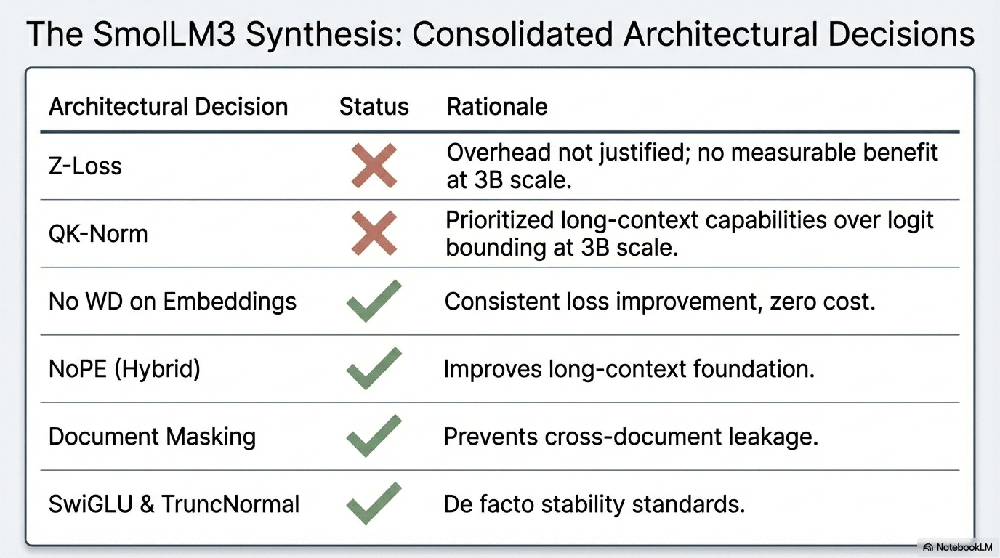

## 9. Consolidated Architectural Decisions for SmolLM3

### 9.1 Summary of Stability-Related Decisions

| Technique | Adopted for SmolLM3 | Rationale |
|-----------|---------------------|-----------|
| **Z-loss** | No | No measurable benefit at 1B ablation scale; implementation overhead not optimized |
| **No WD on embeddings** | Yes | Consistent slight loss improvement; prevents gradient amplification through LayerNorm; no performance cost |
| **QK-norm** | No | Degrades long-context performance (lower needle attention mass); 3B model has lower instability risk |
| **NoPE (hybrid)** | Yes | Maintains short-context parity with RoPE; improves long-context foundation |
| **Document masking** | Yes | Prevents cross-document attention leakage; composes well with NoPE |
| **Tied embeddings** | Yes | 17% parameter savings; iso-parameter ablation shows depth > embedding separation |
| **SwiGLU activation** | Yes (implicit) | De facto standard; superior gradient flow and representational capacity |
| **Truncated normal init** | Yes (standard) | Prevents extreme weight outliers |


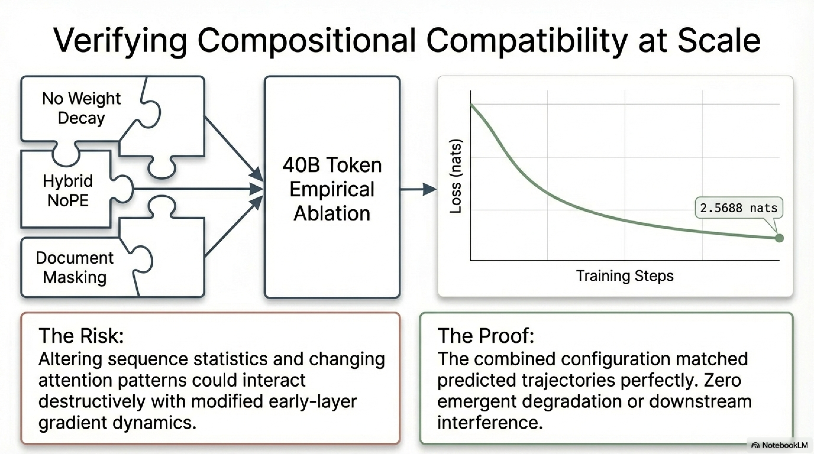

### 9.2 Compositional Compatibility Verification

A critical aspect of the SmolLM3 development process was verifying that **multiple architectural changes compose without negative interactions**. The combined ablation (no weight decay on embeddings + NoPE + document masking) confirmed that the three techniques produce results consistent with their individual effects, with no emergent degradation from their combination.

This compositional verification is essential because architectural modifications can interact in non-obvious ways:
- NoPE alters the attention pattern structure, which could interact with weight decay effects on embeddings (both affect early-layer gradient dynamics)
- Document masking changes the effective sequence statistics, which could interact with embedding norm behavior under weight decay
- The empirical confirmation that these interactions are benign provides confidence for the production training configuration

### 9.3 Scale-Dependent Recommendations

The stability techniques examined in this report have **scale-dependent utility**. Based on the ablation evidence and literature analysis:


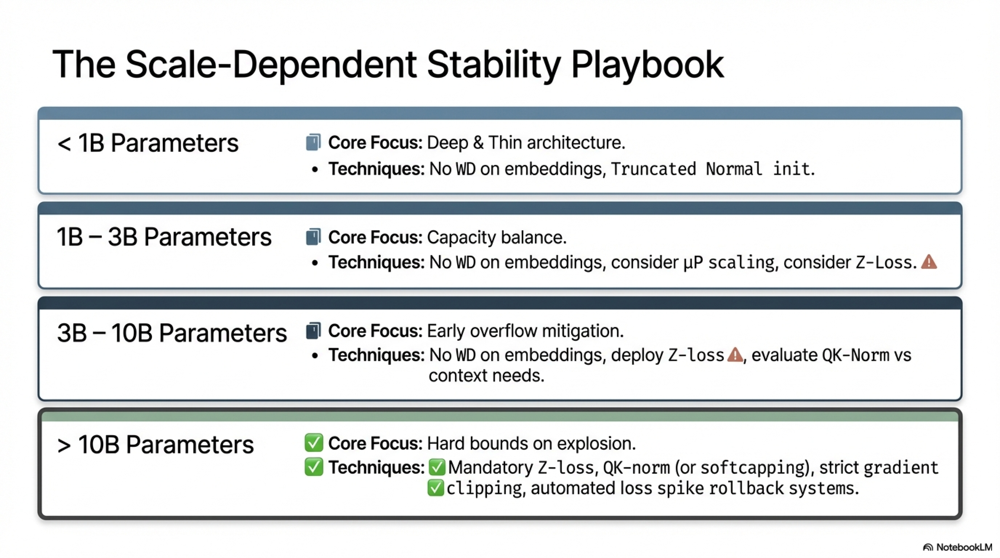

| Model Scale | Recommended Stability Techniques |
|-------------|----------------------------------|
| $< 1$B | No WD on embeddings, proper initialization |
| $1$B–$3$B | No WD on embeddings, proper initialization, consider Z-loss |
| $3$B–$10$B | No WD on embeddings, Z-loss, consider QK-norm |
| $> 10$B | No WD on embeddings, Z-loss, QK-norm (or softcapping), gradient clipping, loss spike detection and rollback |

---

## 10. References

- Chowdhery, A., et al. (2022). PaLM: Scaling Language Modeling with Pathways. *arXiv:2204.02311*.
- Cohere et al. (2025). Command A Technical Report.
- Dehghani, M., et al. (2023). Scaling Vision Transformers to 22 Billion Parameters. *ICML*.
- Liu, Z., et al. (2024). MobileLLM: Optimizing Sub-billion Parameter Language Models for On-Device Use Cases. *arXiv:2402.14905*.
- Loshchilov, I., & Hutter, F. (2019). Decoupled Weight Decay Regularization. *ICLR*.
- NVIDIA et al. (2024, 2025). Nemotron Technical Reports.
- OLMo et al. (2025). OLMo 2: Open Language Model. *arXiv:2501.00656*.
- Petty, J., et al. (2024). The Impact of Depth and Width on Transformer Language Model Generalization.
- Shazeer, N. (2020). GLU Variants Improve Transformer. *arXiv:2002.05202*.
- Takase, S., et al. (2025). On the Interaction Between Weight Decay and Layer Normalization.
- Yang, A., Li, et al. (2025). Qwen3 Technical Report.
- Yang, B., et al. (2025). Hybrid Positional Encoding for Long-Context Language Models.
- Yang, G., & Hu, E. J. (2022). Tensor Programs V: Tuning Large Neural Networks via Zero-Shot Hyperparameter Transfer. *arXiv:2203.03466*.