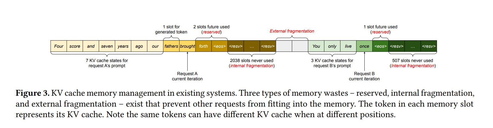
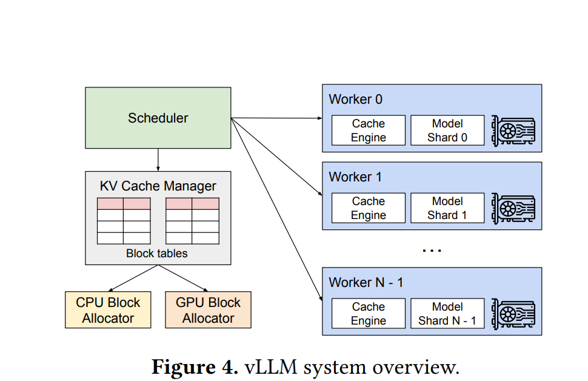
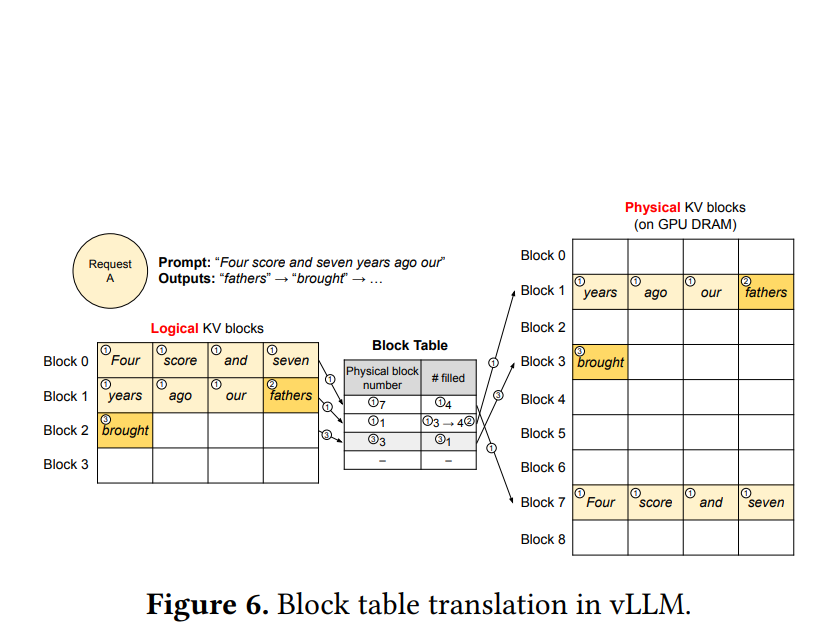

# vLLM: High-Performance LLM Inference Engine — Complete Technical Deep Dive

---

## Table of Contents

1. [PagedAttention: Efficient KV-Cache Memory Management](#1-pagedattention)
2. [High-Throughput Serving with Decoding Algorithms](#2-decoding-algorithms)
3. [Tensor, Pipeline, Data & Expert Parallelism](#3-parallelism)
4. [Streaming Outputs](#4-streaming)
5. [OpenAI-Compatible API Server](#5-api-server)
6. [Multi-Hardware Backend Support](#6-hardware)
7. [Prefix Caching](#7-prefix-caching)
8. [Multi-LoRA Support](#8-multi-lora)

---

## 1. PagedAttention: Efficient KV-Cache Memory Management

### 1.1 The Core Problem: KV-Cache Memory Bottleneck

In autoregressive transformer inference, at each decoding step $t$, the model must attend over **all** previously generated tokens. The standard self-attention mechanism computes:

$$\text{Attention}(Q, K, V) = \text{softmax}\left(\frac{QK^T}{\sqrt{d_k}}\right)V$$

Where:
- $Q \in \mathbb{R}^{1 \times d_k}$ — query vector for the current token
- $K \in \mathbb{R}^{t \times d_k}$ — key matrix for all $t$ previous tokens
- $V \in \mathbb{R}^{t \times d_v}$ — value matrix for all $t$ previous tokens
- $d_k$ — dimension of key/query heads

To avoid **recomputing** $K$ and $V$ from scratch at every step, the engine maintains a **KV-Cache** — storing the key and value tensors for every layer and every attention head across all past tokens.

**Memory footprint per single sequence:**

$$M_{\text{KV}} = 2 \times L \times H \times T \times d_h \times \text{sizeof}(\text{dtype})$$

Where:
- $L$ = number of transformer layers
- $H$ = number of attention heads
- $T$ = current sequence length
- $d_h$ = per-head dimension ($d_h = d_{\text{model}} / H$)
- Factor $2$ accounts for both $K$ and $V$

**Example (LLaMA-70B, FP16):**
- $L = 80$, $H = 64$, $d_h = 128$, $T = 4096$
$$M_{\text{KV}} = 2 \times 80 \times 64 \times 4096 \times 128 \times 2 \text{ bytes} \approx 10.7 \text{ GB per sequence}$$

This creates a **critical GPU memory bottleneck** — traditional systems must **pre-allocate** contiguous memory blocks for each request's maximum possible sequence length, leading to:

| Problem | Description |
|---|---|
| **Internal Fragmentation** | Pre-allocated blocks waste memory when actual sequence length $< T_{\max}$ |
| **External Fragmentation** | Free memory scattered across non-contiguous regions, unusable for new requests |
| **Reservation Waste** | Memory reserved for maximum generation length even if generation terminates early |

Empirical measurements show that **60–80%** of KV-cache memory is wasted under naive contiguous allocation strategies.



### 1.2 PagedAttention: Operating-System-Inspired Solution

PagedAttention directly borrows the **virtual memory paging** concept from operating system design and applies it to KV-cache management.

#### Core Abstraction: Blocks as Pages

The key-value cache for each sequence is partitioned into fixed-size **blocks** (analogous to OS memory pages). Each block stores the KV vectors for a fixed number of tokens $B$ (the **block size**, typically $B = 16$).

**Block structure for layer $\ell$, head $h$:**

$$\text{Block}_{i}^{(\ell, h)} = \left\{ (k_j^{(\ell,h)}, v_j^{(\ell,h)}) \mid j \in [iB,\ (i+1)B - 1] \right\}$$

Where $k_j^{(\ell,h)}, v_j^{(\ell,h)} \in \mathbb{R}^{d_h}$ are the key and value vectors for token position $j$.

#### Block Table: Virtual-to-Physical Mapping

Each sequence maintains a **block table** — a mapping from logical block indices to physical block addresses in GPU memory:

$$\text{BlockTable}[s] : \mathbb{N} \rightarrow \text{PhysicalBlockID}$$

For sequence $s$ with current length $T_s$, the number of allocated blocks is:

$$N_{\text{blocks}}(s) = \left\lceil \frac{T_s}{B} \right\rceil$$

Only the **last block** may be partially filled, yielding waste bounded by:

$$W(s) \leq (B - 1) \times 2 \times L \times H \times d_h \times \text{sizeof(dtype)}$$

This is a **constant overhead** per sequence, independent of $T_{\max}$.



#### Physical Memory Pool

GPU memory is organized as a **block pool** — a flat array of pre-allocated blocks:

$$\text{Pool} = \left\{ \text{Block}_0, \text{Block}_1, \ldots, \text{Block}_{N_{\text{pool}}-1} \right\}$$

A **block allocator** tracks free blocks using a free list, allocating/deallocating on demand — exactly mirroring OS page frame allocation.

### 1.3 PagedAttention Kernel: Modified Attention Computation

The attention kernel must now read KV vectors from **non-contiguous** physical memory locations. The modified computation for query $q_t$ at token position $t$:

$$\text{Attention}(q_t) = \text{softmax}\left( \frac{1}{\sqrt{d_k}} \bigoplus_{i=0}^{N_{\text{blocks}}-1} q_t \cdot K_{\text{phys}(i)}^T \right) \bigoplus_{i=0}^{N_{\text{blocks}}-1} V_{\text{phys}(i)}$$

Where:
- $\bigoplus$ denotes concatenation across physical blocks
- $\text{phys}(i) = \text{BlockTable}[s][i]$ resolves the physical location
- $K_{\text{phys}(i)} \in \mathbb{R}^{B \times d_k}$ — key matrix in physical block $\text{phys}(i)$

**Kernel implementation details:**

```
PAGEDATTENTION_KERNEL(q, block_table, kv_pool, block_size):
    // Phase 1: Compute partial softmax per block
    for each block_idx in block_table[seq_id]:
        phys_id = block_table[seq_id][block_idx]
        K_block = kv_pool.keys[phys_id]     // shape: [B, d_k]
        V_block = kv_pool.values[phys_id]   // shape: [B, d_v]
        
        scores = q @ K_block.T / sqrt(d_k)  // shape: [B]
        local_max = max(scores)
        local_exp = exp(scores - local_max)
        local_sum = sum(local_exp)
        local_out = local_exp @ V_block      // shape: [d_v]
        
        // Accumulate using online softmax (log-sum-exp trick)
        update_running_softmax(global_max, global_sum, global_out,
                               local_max, local_sum, local_out)
    
    // Phase 2: Normalize
    output = global_out / global_sum
```

The **online softmax** (Milakov & Gimelshein, 2018) avoids materializing the full $[1 \times T]$ attention score vector:

$$m_{i+1} = \max(m_i, \hat{m}_{i+1})$$
$$d_{i+1} = d_i \cdot e^{m_i - m_{i+1}} + \hat{d}_{i+1} \cdot e^{\hat{m}_{i+1} - m_{i+1}}$$
$$o_{i+1} = o_i \cdot \frac{d_i \cdot e^{m_i - m_{i+1}}}{d_{i+1}} + \hat{o}_{i+1} \cdot \frac{\hat{d}_{i+1} \cdot e^{\hat{m}_{i+1} - m_{i+1}}}{d_{i+1}}$$

Where $m_i$, $d_i$, $o_i$ are running maximum, denominator sum, and weighted output after processing block $i$.

### 1.4 Copy-on-Write for Shared Prefixes

When multiple sequences share a common prefix (e.g., in parallel sampling), PagedAttention enables **memory sharing** through reference counting:

$$\text{RefCount}[\text{phys\_id}] = |\{s : \exists\, i,\; \text{BlockTable}[s][i] = \text{phys\_id}\}|$$

When a sequence needs to **modify** a shared block (append new tokens), the system performs a **copy-on-write**:

```
if RefCount[phys_id] > 1:
    new_phys_id = allocate_new_block()
    copy(kv_pool[new_phys_id], kv_pool[phys_id])
    block_table[seq_id][block_idx] = new_phys_id
    RefCount[phys_id] -= 1
    RefCount[new_phys_id] = 1
```

This achieves near-**zero-copy** prefix sharing, reducing memory consumption proportional to shared prefix length:

$$M_{\text{saved}} = T_{\text{prefix}} \times (N_{\text{sequences}} - 1) \times 2 \times L \times H \times d_h \times \text{sizeof(dtype)}$$

### 1.5 Memory Utilization Advantage

| Metric | Contiguous Allocation | PagedAttention |
|---|---|---|
| Internal Fragmentation | $O(T_{\max} - T_{\text{actual}})$ per seq | $O(B)$ per seq (last block only) |
| External Fragmentation | High (scattered free gaps) | **Zero** (any free block usable) |
| Prefix Sharing | Full duplication | Copy-on-write shared blocks |
| Effective Memory Utilization | ~20–40% | **>96%** |

This translates directly into **2–4× higher throughput** because more sequences can be batched simultaneously on the same GPU.

---

## 2. High-Throughput Serving with Various Decoding Algorithms

### 2.1 Continuous Batching (Iteration-Level Scheduling)

Traditional **static batching** waits for all sequences in a batch to finish before accepting new ones. vLLM implements **continuous batching** (also called **iteration-level scheduling**), where:

- At **each decode iteration**, the scheduler can:
  - **Insert** new requests that have completed their prefill phase
  - **Evict** finished sequences (those that generated EOS or hit max length)
  - **Preempt** sequences (swap KV-cache to CPU) if memory is exhausted

**Throughput model under continuous batching:**

Let $\lambda$ be the request arrival rate, $\bar{T}$ be the mean generation length, and $B_{\text{eff}}$ the effective batch size maintained:

$$\text{Throughput} = \frac{B_{\text{eff}}}{\tau_{\text{iter}}}\ \text{tokens/sec}$$

Where $\tau_{\text{iter}}$ is the per-iteration latency (dominated by memory-bound KV-cache reads). The key insight: $B_{\text{eff}}$ stays near the **maximum** GPU capacity at all times because finished sequences are immediately replaced.

**GPU utilization comparison:**

$$\eta_{\text{static}} = \frac{\sum_{i=1}^{B} T_i}{B \times T_{\max}} \quad \text{vs} \quad \eta_{\text{continuous}} \approx 1.0$$

Where $T_i$ is the actual generation length for sequence $i$. For high variance in $T_i$, continuous batching achieves dramatically higher utilization.

### 2.2 Parallel Sampling

Given a single prompt, generate $N$ independent completions by sampling from:

$$x_t^{(n)} \sim P_\theta\left(x \mid x_{<t}^{(n)}\right), \quad n = 1, \ldots, N$$

**vLLM optimizations for parallel sampling:**

1. **Shared prefix KV-cache:** All $N$ samples share the same prefill KV-cache blocks via PagedAttention's copy-on-write mechanism
2. **Memory cost:**

$$M_{\text{parallel}} = M_{\text{prefix}} + N \times M_{\text{divergent}}$$

Instead of the naive $N \times (M_{\text{prefix}} + M_{\text{divergent}})$, saving $(N-1) \times M_{\text{prefix}}$.

3. **Scheduling:** All $N$ sequences are scheduled together, enabling efficient batched matrix operations during the decode phase.

### 2.3 Beam Search

Beam search maintains $k$ (beam width) candidate sequences at each step, selecting the top-$k$ by cumulative log-probability:

$$\text{Score}(y_{1:t}) = \sum_{i=1}^{t} \log P_\theta(y_i \mid y_{<i})$$

At each decoding step, for each of the $k$ beams and vocabulary size $|V|$:

$$\text{Candidates} = \underset{(b, v) \in [k] \times [|V|]}{\text{top-}k}\left\{\text{Score}(y_{1:t-1}^{(b)}) + \log P_\theta(v \mid y_{<t}^{(b)})\right\}$$

**vLLM beam search with PagedAttention:**

- When beam $b'$ extends beam $b$, the new sequence's block table **shares** all existing blocks of beam $b$ via reference counting
- Only the **newly divergent** block is allocated fresh
- When a beam is **pruned** (not in top-$k$), its blocks' reference counts decrement; blocks with refcount $= 0$ are freed immediately

**Memory consumption under beam search:**

$$M_{\text{beam}} = M_{\text{shared\_prefix}} + k \times \overline{M}_{\text{unique\_suffix}}$$

Where $\overline{M}_{\text{unique\_suffix}}$ is typically small (beams diverge only in recent tokens), yielding massive memory savings compared to full duplication.

### 2.4 Additional Decoding Strategies Supported

| Strategy | Sampling Distribution | Key Parameter |
|---|---|---|
| **Greedy** | $\arg\max P_\theta(x_t \mid x_{<t})$ | — |
| **Temperature** | $P_\theta(x_t \mid x_{<t})^{1/\tau}$ / $Z$ | $\tau \in (0, \infty)$ |
| **Top-$k$** | Restrict to top $k$ tokens, renormalize | $k \in \mathbb{N}$ |
| **Top-$p$ (Nucleus)** | Smallest set $S$ where $\sum_{x \in S} P(x) \geq p$ | $p \in (0, 1]$ |
| **Min-$p$** | Filter tokens where $P(x) < p \cdot P_{\max}$ | $p \in (0, 1)$ |
| **Repetition Penalty** | $\text{logit}(x) / \alpha$ if $x \in \text{generated}$ | $\alpha > 1$ |
| **Frequency/Presence Penalty** | $\text{logit}(x) - \mu \cdot \text{count}(x)$ | $\mu \geq 0$ |

**All strategies compose** via the logit processing pipeline:

$$\text{logits}' = f_n \circ f_{n-1} \circ \cdots \circ f_1(\text{logits})$$

Where each $f_i$ is a logit processor (temperature, top-$k$ masking, penalty, etc.) applied sequentially before final sampling.

### 2.5 Speculative Decoding

vLLM supports **speculative decoding** to reduce latency while preserving the target model's distribution:

1. A **draft model** $q_\theta$ (smaller, faster) generates $\gamma$ candidate tokens autoregressively
2. The **target model** $p_\phi$ verifies all $\gamma$ tokens in a **single forward pass** (parallel verification)
3. Acceptance probability for token $x_t$ at position $t$:

$$P_{\text{accept}}(x_t) = \min\left(1, \frac{p_\phi(x_t \mid x_{<t})}{q_\theta(x_t \mid x_{<t})}\right)$$

4. Expected tokens accepted per step:

$$\mathbb{E}[\text{tokens/step}] = \frac{1 - \alpha^{\gamma+1}}{1 - \alpha}$$

Where $\alpha = \mathbb{E}[P_{\text{accept}}]$ is the mean acceptance rate.

This yields a **speedup factor** of approximately $\frac{1 - \alpha^{\gamma+1}}{(1-\alpha)(\tau_{\text{draft}} \cdot \gamma + \tau_{\text{target}})} \times \tau_{\text{target}}$, where $\tau_{\text{draft}}$ and $\tau_{\text{target}}$ are per-token latencies of each model.

---

## 3. Tensor, Pipeline, Data, and Expert Parallelism for Distributed Inference

### 3.1 Tensor Parallelism (TP)

Tensor parallelism partitions individual **weight matrices** across $N_{\text{TP}}$ GPUs. For a linear layer $Y = XW$:

#### Column Parallelism (for first linear in MLP / QKV projection):

$$W = [W_1 | W_2 | \cdots | W_{N_{\text{TP}}}], \quad W_i \in \mathbb{R}^{d_{\text{in}} \times (d_{\text{out}}/N_{\text{TP}})}$$

Each GPU $i$ computes:

$$Y_i = X W_i \in \mathbb{R}^{b \times (d_{\text{out}}/N_{\text{TP}})}$$

**No communication needed** — input $X$ is replicated; outputs $Y_i$ are sharded.

#### Row Parallelism (for second linear in MLP / output projection):

$$W = \begin{bmatrix} W_1 \\ W_2 \\ \vdots \\ W_{N_{\text{TP}}} \end{bmatrix}, \quad W_i \in \mathbb{R}^{(d_{\text{in}}/N_{\text{TP}}) \times d_{\text{out}}}$$

Each GPU $i$ holds $X_i$ (sharded input from previous column-parallel layer) and computes:

$$Z_i = X_i W_i$$

Final output requires an **all-reduce**:

$$Y = \sum_{i=1}^{N_{\text{TP}}} Z_i = \text{AllReduce}(Z_1, Z_2, \ldots, Z_{N_{\text{TP}}})$$

**Communication cost per layer:**

$$C_{\text{TP}} = 2 \times (N_{\text{TP}} - 1) \times b \times d_{\text{out}} \times \text{sizeof(dtype)} \quad \text{(all-reduce)}$$

The factor $2$ accounts for the two all-reduce operations per transformer block (one after attention output projection, one after MLP down projection).

#### Attention Head Partitioning:

For multi-head attention with $H$ heads, each GPU handles $H / N_{\text{TP}}$ heads:

$$\text{GPU}_i: \text{heads } \left[\frac{iH}{N_{\text{TP}}}, \frac{(i+1)H}{N_{\text{TP}}}\right)$$

Each head's KV-cache is stored **locally** on the corresponding GPU — no KV-cache communication during attention.

### 3.2 Pipeline Parallelism (PP)

Pipeline parallelism partitions transformer **layers** across $N_{\text{PP}}$ GPUs (stages):

$$\text{Stage}_j = \{\text{Layer}_\ell : \ell \in [jL/N_{\text{PP}},\ (j+1)L/N_{\text{PP}})\}$$

**Inference pipeline execution:**

For each micro-batch, activations flow stage-to-stage:

$$h^{(\ell+1)} = \text{TransformerBlock}_\ell(h^{(\ell)})$$

**Communication cost per micro-batch between stages:**

$$C_{\text{PP}} = b \times T \times d_{\text{model}} \times \text{sizeof(dtype)} \quad \text{(point-to-point send/recv)}$$

This is significantly **cheaper** than TP's all-reduce (point-to-point vs collective).

**Pipeline bubble analysis during inference:**

With $N_{\text{PP}}$ stages and a single request, pipeline bubble fraction:

$$\text{Bubble} = \frac{N_{\text{PP}} - 1}{N_{\text{PP}} + M - 1}$$

Where $M$ = number of micro-batches. For inference, continuous batching provides $M \gg N_{\text{PP}}$, making bubbles negligible.

**When to use PP vs TP:**

| Criterion | Tensor Parallelism | Pipeline Parallelism |
|---|---|---|
| Interconnect requirement | High bandwidth (NVLink) | Lower bandwidth sufficient |
| Latency per token | Same (all GPUs compute every token) | Higher (sequential stages) |
| Memory per GPU | Model params / $N_{\text{TP}}$ per layer | Full layers but fewer layers |
| Scaling efficiency | Diminishes beyond 8 GPUs | Scales to many nodes |

### 3.3 Data Parallelism (DP)

In data parallelism for inference, the **full model is replicated** across $N_{\text{DP}}$ groups, and incoming requests are **load-balanced** across replicas:

$$\text{Throughput}_{\text{total}} = N_{\text{DP}} \times \text{Throughput}_{\text{single}}$$

Each DP replica may internally use TP and/or PP. The total GPU count:

$$N_{\text{GPU}} = N_{\text{DP}} \times N_{\text{TP}} \times N_{\text{PP}}$$

**No inter-replica communication** during inference — each replica handles independent request subsets.

vLLM's scheduler distributes requests using strategies:
- Round-robin
- Least-loaded (fewest active sequences)
- Locality-aware (route similar prompts to same replica for prefix cache hits)

### 3.4 Expert Parallelism (EP) for Mixture-of-Experts Models

For Mixture-of-Experts (MoE) architectures (e.g., Mixtral, DeepSeek-V3), the MLP layer is replaced by:

$$\text{MoE}(x) = \sum_{i=1}^{K} g_i(x) \cdot E_i(x)$$

Where:
- $g(x) = \text{TopK}\left(\text{softmax}(W_g \cdot x)\right)$ — gating function selecting $K$ out of $N_E$ experts
- $E_i$ — the $i$-th expert network (typically a standard MLP)
- $K$ — number of active experts per token (e.g., $K = 2$ for Mixtral)

**Expert parallelism** distributes experts across GPUs:

$$\text{GPU}_j: \text{Experts } \left\{E_i : i \bmod N_{\text{EP}} = j\right\}$$

**Communication pattern (All-to-All dispatch):**

1. **Dispatch:** Each GPU routes tokens to the GPU hosting the selected expert — requires **All-to-All** communication
2. **Compute:** Each GPU processes tokens routed to its local experts
3. **Combine:** Results are sent back to originating GPUs — another **All-to-All**

$$C_{\text{EP}} = 2 \times \frac{b \times T \times d_{\text{model}} \times K}{N_{\text{EP}}} \times \text{sizeof(dtype)}$$

**Load balancing challenge:**

If gating is skewed, some GPUs receive disproportionately many tokens. vLLM handles this through:
- Token dropping (discard overflow tokens)
- Capacity factors: $\text{Cap}_j = \alpha \times \frac{K \times b \times T}{N_E}$ where $\alpha > 1$ is the capacity factor
- Expert-parallel-aware scheduling to co-locate requests that activate complementary experts

### 3.5 Combined Parallelism Strategy

vLLM supports **hybrid parallelism** configurations:

```
Total GPUs = DP × TP × PP × EP

Example for Mixtral-8x22B on 32 GPUs:
  TP = 4  (4-way tensor parallel within node)
  PP = 1  (no pipeline parallelism)
  EP = 8  (8-way expert parallel)
  DP = 1  
  → 4 × 1 × 8 = 32 GPUs
```

---

## 4. Streaming Outputs

### 4.1 Architecture

vLLM implements **token-level streaming** using asynchronous generator patterns. As soon as each decode step produces a new token $x_t$, it is **immediately** yielded to the client without waiting for the full sequence to complete.

**Latency model:**

For a response of $T$ tokens:

| Mode | Time-to-First-Token (TTFT) | Time-to-Last-Token (TTLT) |
|---|---|---|
| Non-streaming | $\tau_{\text{prefill}} + T \times \tau_{\text{decode}}$ | Same |
| Streaming | $\tau_{\text{prefill}} + \tau_{\text{decode}}$ | $\tau_{\text{prefill}} + T \times \tau_{\text{decode}}$ |

**Perceived latency** drops from $O(T)$ to $O(1)$ since users see the first token after just one decode step.

### 4.2 Implementation Protocol

Streaming is implemented via **Server-Sent Events (SSE)** over HTTP:

```
Client Request:
POST /v1/chat/completions
{"model": "llama-3", "messages": [...], "stream": true}

Server Response (chunked):
data: {"choices": [{"delta": {"content": "Hello"}}]}
data: {"choices": [{"delta": {"content": " world"}}]}
data: {"choices": [{"delta": {"content": "!"}}]}
data: [DONE]
```

### 4.3 Detokenization Pipeline

A critical subtlety: token IDs do not always map to complete Unicode characters. vLLM implements an **incremental detokenizer** that:

1. Maintains a buffer of pending token IDs
2. Attempts detokenization at each step
3. Only emits **confirmed** text (characters that cannot change with additional tokens)
4. Handles byte-level BPE correctly (e.g., multi-byte UTF-8 characters split across tokens)

$$\text{emit}(t) = \text{detok}(\text{ids}[0:t]) \setminus \text{detok}(\text{ids}[0:t-1])$$

Where the set difference is computed on the confirmed prefix of the decoded string.

---

## 5. OpenAI-Compatible API Server

### 5.1 API Endpoint Compatibility

vLLM exposes endpoints that are **drop-in replacements** for OpenAI's API:

| Endpoint | Function |
|---|---|
| `POST /v1/completions` | Text completion (prompt → continuation) |
| `POST /v1/chat/completions` | Chat completion (messages → response) |
| `POST /v1/embeddings` | Text embedding generation |
| `GET /v1/models` | List available models |

### 5.2 Request Processing Pipeline

```
[HTTP Request]
    → FastAPI/uvicorn async handler
        → Request validation & tokenization
            → vLLM AsyncEngine.add_request()
                → Scheduler queues request
                    → Continuous batching loop picks it up
                        → Model forward pass (prefill/decode)
                            → Token sampling
                                → Detokenization
                                    → SSE chunk / full response
```

**Key architectural components:**

1. **AsyncLLMEngine:** Core engine running the inference loop in a background coroutine, communicating via `asyncio.Queue`
2. **Scheduler:** Implements FCFS (first-come-first-served) with preemption policies (recompute or swap)
3. **TokenizerGroup:** Handles tokenization potentially on a separate process to avoid GIL contention
4. **OpenAI Serving Layer:** Translates between OpenAI schema objects and vLLM's internal `SamplingParams`/`RequestOutput`

### 5.3 Sampling Parameter Mapping

| OpenAI Parameter | vLLM Internal Mapping |
|---|---|
| `temperature` | $\tau$ in $P'(x) = P(x)^{1/\tau} / Z$ |
| `top_p` | Nucleus sampling threshold $p$ |
| `max_tokens` | Maximum decode steps $T_{\max}$ |
| `n` | Number of parallel samples $N$ |
| `best_of` | Generate $N'$ samples, return best $N$ by log-prob |
| `frequency_penalty` | $\text{logit}(x) - \mu \cdot \text{count}(x)$ |
| `presence_penalty` | $\text{logit}(x) - \beta \cdot \mathbb{1}[x \in \text{generated}]$ |
| `logprobs` | Return top-$k$ token log-probabilities per position |
| `stop` | Stopping strings/token IDs for early termination |

---

## 6. Multi-Hardware Backend Support

### 6.1 Hardware Abstraction Architecture

vLLM implements a **platform abstraction layer** that decouples the scheduling/serving logic from hardware-specific kernel implementations:

```
┌──────────────────────────────────────────────┐
│           vLLM Engine (Scheduler, KV Manager) │
├──────────────────────────────────────────────┤
│              Model Runner Interface           │
├──────┬──────┬──────┬──────┬──────┬───────────┤
│NVIDIA│ AMD  │Intel │ TPU  │ ARM  │  Plugins  │
│(CUDA)│(ROCm)│(XPU) │(XLA) │(CPU) │(Gaudi,..) │
└──────┴──────┴──────┴──────┴──────┴───────────┘
```

### 6.2 Backend-Specific Optimizations

| Hardware | Compute Backend | Attention Kernel | Key Optimizations |
|---|---|---|---|
| **NVIDIA GPU** | CUDA | FlashAttention-2, PagedAttention CUDA kernels | cuBLAS GEMM, NCCL collective ops, CUDA Graphs |
| **AMD GPU** | ROCm/HIP | Triton-based PagedAttention | hipBLAS, RCCL, composable kernel library |
| **Intel GPU** | SYCL/oneAPI (XPU) | oneDNN attention | IPEX optimizations, oneCCL collective ops |
| **Intel CPU** | AVX-512/AMX | Custom CPU attention | VNNI int8, AMX bf16 tile operations |
| **Google TPU** | XLA | XLA-compiled attention | TPU-specific sharding via GSPMD |
| **ARM CPU** | Neon/SVE | Optimized GEMM kernels | SVE vector processing |
| **PowerPC** | VSX | Optimized matrix ops | POWER10 MMA instructions |

### 6.3 Plugin Architecture for Custom Hardware

vLLM supports a **plugin system** for hardware vendors to integrate custom accelerators:

```python
# Plugin interface contract
class PlatformPlugin:
    def get_attn_backend() -> AttentionBackend
    def get_device_communicator() -> DeviceCommunicator
    def compile_model(model) -> CompiledModel
    def allocate_kv_cache(num_blocks, ...) -> KVCache
```

**Supported plugins:**
- **Intel Gaudi (HPU):** Uses Habana SynapseAI SDK with custom HPU graphs
- **IBM Spyre:** Specialized AI accelerator with custom ONNX-based compilation
- **Huawei Ascend (NPU):** Uses CANN (Compute Architecture for Neural Networks) stack

---

## 7. Prefix Caching (Automatic Prompt Caching)

### 7.1 Core Concept

Many production workloads share **common prefixes** across requests:
- System prompts in chat applications
- Few-shot examples
- Shared document contexts in RAG pipelines

**Prefix caching** avoids redundant prefill computation by reusing previously computed KV-cache blocks.

### 7.2 Hash-Based Block Matching

Each KV-cache block is identified by a **content hash** of the tokens it represents and its positional context:

$$\text{Hash}(\text{Block}_i) = \mathcal{H}\left(\text{tokens}[iB : (i+1)B],\; \text{prefix\_hash}_{i-1}\right)$$

This creates a **hash chain** — each block's identity depends on all preceding tokens, ensuring correctness even when identical token subsequences appear at different positions.

**Lookup procedure for a new request with tokens $[x_1, \ldots, x_T]$:**

```
prefix_hash = INIT
matched_blocks = 0
for i in range(ceil(T / B)):
    block_tokens = tokens[i*B : (i+1)*B]
    hash = H(block_tokens, prefix_hash)
    if hash in global_cache:
        block_table[seq].append(global_cache[hash])
        RefCount[global_cache[hash]] += 1
        prefix_hash = hash
        matched_blocks += 1
    else:
        break  // first mismatch ends prefix matching

// Only compute prefill for tokens[(matched_blocks * B):]
```

### 7.3 Eviction Policy

When GPU memory is exhausted, cached (non-active) blocks must be evicted. vLLM implements **LRU (Least Recently Used)** eviction:

$$\text{Evict} = \arg\min_{\text{block} \in \text{cached}} \text{last\_access\_time}(\text{block})$$

Subject to the constraint that **active** blocks (belonging to in-flight requests) are **never** evicted.

### 7.4 Performance Impact

**Prefill computation savings:**

If a request has $T_{\text{total}}$ tokens and $T_{\text{cached}}$ are prefix-cached:

$$\text{Prefill FLOPS saved} = \frac{T_{\text{cached}}}{T_{\text{total}}} \times 100\%$$

$$\tau_{\text{prefill}}' = \tau_{\text{prefill}} \times \frac{T_{\text{total}} - T_{\text{cached}}}{T_{\text{total}}}$$

For chat applications with long system prompts (~500 tokens) and short user queries (~50 tokens):

$$\text{Savings} \approx \frac{500}{550} \approx 91\%$$

### 7.5 Correctness Guarantee

The hash chain ensures that a cached block is reused **if and only if** every preceding token is identical. Formally:

$$\text{Reuse block}_i \iff \forall j \leq (i+1)B: x_j^{\text{new}} = x_j^{\text{cached}}$$

This is guaranteed by the recursive hash structure — any token mismatch at position $j < iB$ changes $\text{prefix\_hash}_{i-1}$, invalidating the hash for block $i$.

---

## 8. Multi-LoRA Support

### 8.1 LoRA: Low-Rank Adaptation

LoRA (Hu et al., 2022) freezes the base model weights $W_0 \in \mathbb{R}^{d \times k}$ and adds trainable low-rank perturbations:

$$W = W_0 + \Delta W = W_0 + \frac{\alpha}{r} B A$$

Where:
- $A \in \mathbb{R}^{r \times k}$ — down-projection (initialized Gaussian)
- $B \in \mathbb{R}^{d \times r}$ — up-projection (initialized zero)
- $r \ll \min(d, k)$ — rank (typically $r \in \{8, 16, 32, 64\}$)
- $\alpha$ — scaling hyperparameter

**Parameter savings:**

$$\frac{|\Delta W|}{|W_0|} = \frac{r(d + k)}{dk} \approx \frac{2r}{\min(d,k)} \ll 1$$

For $d = k = 4096$, $r = 16$: savings $= 99.2\%$ fewer trainable parameters.

### 8.2 Multi-LoRA Serving Architecture

vLLM can serve **multiple LoRA adapters** simultaneously atop a **single base model**, with different requests using different adapters:

```
Request 1: base_model + LoRA_A  (customer-support fine-tune)
Request 2: base_model + LoRA_B  (code-generation fine-tune)
Request 3: base_model (no adapter)
Request 4: base_model + LoRA_A  (same adapter as Request 1)
```

**Memory layout:**

$$M_{\text{total}} = M_{\text{base}} + \sum_{i=1}^{N_{\text{adapters}}} M_{\text{LoRA}_i}$$

Where:

$$M_{\text{LoRA}_i} = |\mathcal{T}_i| \times 2 \times r_i \times (d + k) \times \text{sizeof(dtype)}$$

$|\mathcal{T}_i|$ = number of target modules (e.g., $q\_proj$, $k\_proj$, $v\_proj$, $o\_proj$).

### 8.3 Batched LoRA Computation

The key challenge: within a single batch, different tokens may use **different LoRA adapters**. vLLM implements **custom CUDA kernels** for batched LoRA:

For a batch with $N$ tokens, where token $n$ uses adapter $a(n)$:

**Naive approach (per-adapter loops):**

$$y_n = W_0 x_n + \frac{\alpha_{a(n)}}{r_{a(n)}} B_{a(n)} A_{a(n)} x_n, \quad \forall n$$

This requires iterating over each adapter — $O(N_{\text{adapters}})$ kernel launches.

**vLLM's optimized approach (SGMV / BGMV kernels):**

Segmented/Batched Grouped Matrix-Vector multiplication:

1. **Group tokens by adapter:** Create segments $S_a = \{n : a(n) = a\}$
2. **Batched down-projection:** For all segments simultaneously:
$$h_{S_a} = A_a \cdot X_{S_a}^T \quad \forall a \quad \text{(single kernel launch)}$$
3. **Batched up-projection:** 
$$\Delta Y_{S_a} = B_a \cdot h_{S_a} \quad \forall a \quad \text{(single kernel launch)}$$
4. **Scale and add:** 
$$Y_n = W_0 x_n + \frac{\alpha_{a(n)}}{r_{a(n)}} \Delta Y_n$$

**Kernel fusion:** The SGMV kernel processes all adapter groups in a **single GPU kernel launch** using:
- **Indirect indexing:** A metadata array maps each token to its adapter's $A$/$B$ weight pointers
- **Warp specialization:** Different warps handle different adapters
- **Shared memory:** Adapter weights for active adapters cached in SRAM

### 8.4 LoRA Adapter Management

```
┌──────────────────────────────────────────────┐
│             LoRA Manager                      │
│  ┌────────────────────────────────────────┐   │
│  │  GPU LoRA Cache (hot adapters)         │   │
│  │  LoRA_A, LoRA_B, LoRA_C               │   │
│  └────────────────────────────────────────┘   │
│  ┌────────────────────────────────────────┐   │
│  │  CPU LoRA Cache (warm adapters)        │   │
│  │  LoRA_D, LoRA_E, ...                  │   │
│  └────────────────────────────────────────┘   │
│  ┌────────────────────────────────────────┐   │
│  │  Disk Storage (cold adapters)          │   │
│  │  LoRA_F, LoRA_G, ...                  │   │
│  └────────────────────────────────────────┘   │
└──────────────────────────────────────────────┘
```

**Adapter loading policy:**
- **Hot (GPU):** Active adapters with in-flight requests — loaded into GPU memory
- **Warm (CPU):** Recently used adapters — can be loaded to GPU in $\sim$ms via PCIe transfer
- **Cold (Disk):** Archived adapters — loaded on demand

**Swapping cost for adapter $a$:**

$$\tau_{\text{swap}}(a) = \frac{M_{\text{LoRA}_a}}{\text{PCIe bandwidth}} \approx \frac{2 \times |\mathcal{T}| \times r \times (d+k) \times 2}{\text{32 GB/s}} \sim O(\text{ms})$$

For typical LoRA sizes ($\sim$10–50 MB), swapping takes **<5 ms**, negligible compared to inference time.

### 8.5 Max LoRA Capacity

The maximum number of simultaneously active adapters is bounded by:

$$N_{\text{max\_active}} = \left\lfloor \frac{M_{\text{GPU}} - M_{\text{base}} - M_{\text{KV}}}{\overline{M}_{\text{LoRA}}} \right\rfloor$$

Since $\overline{M}_{\text{LoRA}} \ll M_{\text{base}}$, typically **hundreds** of LoRA adapters can coexist in GPU memory alongside the base model.

---

## Summary: vLLM Performance Architecture

```
                        ┌─────────────────────────┐
                        │   OpenAI-Compatible API  │
                        │   (FastAPI + SSE Stream)  │
                        └──────────┬──────────────┘
                                   │
                        ┌──────────▼──────────────┐
                        │   Async LLM Engine       │
                        │   (Continuous Batching)   │
                        └──────────┬──────────────┘
                                   │
              ┌────────────────────┼────────────────────┐
              │                    │                    │
   ┌──────────▼─────┐  ┌──────────▼──────┐  ┌─────────▼──────────┐
   │   Scheduler    │  │  KV Cache Mgr   │  │  LoRA Manager      │
   │  (FCFS+Preempt)│  │  (PagedAttention)│  │  (Multi-Adapter)   │
   └──────────┬─────┘  └──────────┬──────┘  └─────────┬──────────┘
              │                    │                    │
              └────────────────────┼────────────────────┘
                                   │
                        ┌──────────▼──────────────┐
                        │     Model Runner         │
                        │  (TP / PP / EP / DP)     │
                        └──────────┬──────────────┘
                                   │
              ┌──────────┬─────────┼─────────┬──────────┐
              │          │         │         │          │
           ┌──▼──┐  ┌───▼──┐  ┌──▼──┐  ┌──▼──┐  ┌───▼───┐
           │CUDA │  │ROCm  │  │ XPU │  │ TPU │  │Plugins│
           │(GPU)│  │(AMD) │  │(Intel│  │(XLA)│  │(Gaudi)│
           └─────┘  └──────┘  └─────┘  └─────┘  └───────┘
```

**Key performance multipliers working in concert:**

| Technique | Primary Benefit | Quantitative Impact |
|---|---|---|
| PagedAttention | Memory efficiency | **>96%** GPU memory utilization |
| Continuous Batching | GPU compute utilization | **2–4×** throughput vs static batching |
| Prefix Caching | Redundant computation elimination | Up to **90%+** prefill savings |
| Tensor Parallelism | Single-request latency reduction | Near-linear scaling to 8 GPUs |
| Pipeline Parallelism | Cross-node model distribution | Enables models exceeding single-node memory |
| Expert Parallelism | MoE model efficiency | Proportional to $N_E / K$ expert ratio |
| Multi-LoRA | Model multiplexing | Hundreds of adapters, single base model |
| Speculative Decoding | Decode latency reduction | **2–3×** speedup with good draft models |
| Streaming | Perceived latency | TTFT reduced to **single decode step** |